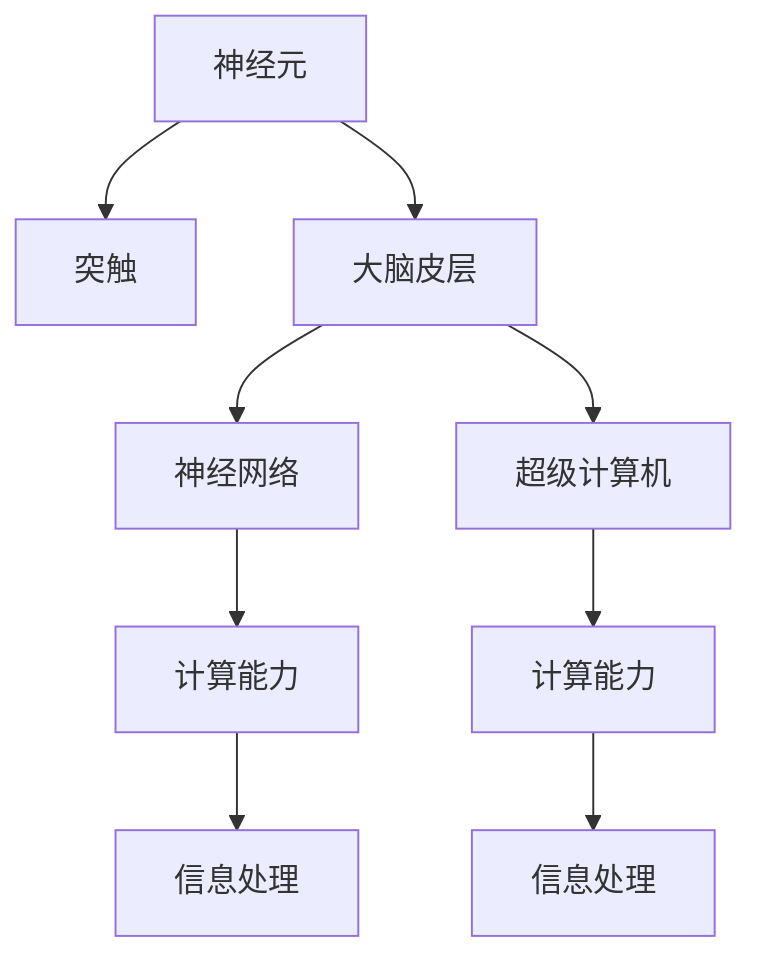

                 

# 大脑与超级计算机的比较

## 1. 背景介绍

### 1.1 问题由来

随着人工智能技术的迅猛发展，特别是深度学习在多个领域的成功应用，研究者们开始探索人类大脑与超级计算机之间的联系。在2014年，Google的DeepMind团队成功开发出AlphaGo，展示了AI在复杂决策问题上的卓越能力。AlphaGo的胜利引发了公众对AI技术的广泛关注，同时也激发了一场关于大脑与计算机的深入比较。

### 1.2 问题核心关键点

本文将聚焦于以下几个核心问题：
1. 人类大脑与超级计算机在计算能力和复杂性上分别具有怎样的特点？
2. 大脑如何实现高效信息处理，而计算机又是如何通过算法和硬件优化实现的？
3. 脑科学、神经科学和计算机科学的结合，能为未来AI技术的发展带来哪些启示？

## 2. 核心概念与联系

### 2.1 核心概念概述

为了深入理解大脑与超级计算机的比较，本节将介绍几个密切相关的核心概念：

- **神经元(Neuron)**：大脑中最基本的计算单元，类似于计算机中的逻辑门。神经元通过树突接收输入信号，通过细胞体处理信息，再通过轴突将结果传递给其他神经元。
- **突触(Synapse)**：神经元之间的连接点，用于传递化学信号，类似于计算机中的连接器。
- **大脑皮层(Cortex)**：大脑中高度发达的区域，负责高级认知功能，包括语言、感知、决策等。类似于计算机中的中央处理单元(CPU)。
- **神经网络(Neural Network)**：由大量神经元组成的网络结构，通过反向传播算法进行训练。类似于计算机中的深度学习模型。
- **超级计算机(Supercomputer)**：具有极高计算能力的计算机，能够在短时间内处理大量数据。类似于计算机中的高性能计算集群。
- **计算能力(Computational Power)**：指计算机或大脑每秒能进行的计算量，衡量其处理复杂任务的能力。
- **信息处理(Information Processing)**：指计算系统处理信息、提取特征、执行任务的能力。

这些核心概念之间的逻辑关系可以通过以下Mermaid流程图来展示：



这个流程图展示了大脑和计算机系统在神经元、突触、神经网络、计算能力和信息处理等方面的对应关系。

## 3. 核心算法原理 & 具体操作步骤
### 3.1 算法原理概述

大脑与超级计算机在处理信息的方式上存在显著差异。大脑主要通过生物神经元、突触和神经网络实现信息处理，而计算机主要通过电子逻辑门、连接器和执行算法实现计算。

- **神经元的信号传递**：在大脑中，神经元通过树突接收输入信号，通过细胞体处理信息，再通过轴突将结果传递给其他神经元。这种信号传递方式类似于计算机中逻辑门的开关状态传递。
- **突触的化学传递**：神经元之间通过突触传递化学信号，这种传递方式与计算机中逻辑门之间的连接方式不同，但都具有传递信息的功能。
- **神经网络的分布式计算**：大脑中的神经网络通过并行分布式计算实现复杂任务，类似于计算机中深度学习模型的计算过程。

### 3.2 算法步骤详解

以下我们将详细介绍大脑与超级计算机在计算和信息处理方面的步骤：

#### 大脑的信息处理步骤：
1. **信号接收**：神经元通过树突接收外界刺激（如光、声音等），并将其转化为电信号。
2. **信息处理**：神经元在细胞体中处理接收到的电信号，生成新的电信号。
3. **信号传递**：神经元通过轴突将处理后的电信号传递给其他神经元或大脑皮层。

#### 超级计算机的信息处理步骤：
1. **数据输入**：通过I/O设备将数据输入计算机内存。
2. **算法执行**：在处理器中执行预定义的算法，对数据进行处理和计算。
3. **结果输出**：通过输出设备将计算结果输出到存储介质或显示设备。

### 3.3 算法优缺点

- **大脑的优点**：
  - **分布式并行处理**：大脑中的神经元具有分布式并行处理能力，能够在不同位置同时处理大量信息。
  - **高度可塑性**：大脑的神经网络具有高度的可塑性，可以通过学习和经验不断优化。
  - **低能耗**：大脑的计算能力主要依靠生物电信号，能耗较低。

- **大脑的缺点**：
  - **计算速度慢**：生物神经元的信号传递速度远慢于电子逻辑门的速度。
  - **存储容量有限**：大脑的神经元数量有限，无法存储大量数据。

- **超级计算机的优点**：
  - **高速计算**：电子逻辑门的开关速度极快，能够实现高速计算。
  - **大容量存储**：计算机可以存储和处理海量数据。

- **超级计算机的缺点**：
  - **能耗高**：电子器件的能耗较高，需要大量电力支持。
  - **刚性结构**：计算机的逻辑门结构较为刚性，灵活性不足。

### 3.4 算法应用领域

在实际应用中，大脑与超级计算机分别在不同领域展示了其独特优势。

- **大脑在**：
  - **感知与决策**：大脑通过视觉、听觉等感官获取信息，并进行复杂决策。
  - **学习和记忆**：大脑通过学习和记忆不断适应环境变化。

- **超级计算机在**：
  - **科学计算**：超级计算机用于解决复杂的科学计算问题，如天气预报、分子模拟等。
  - **数据分析**：超级计算机用于处理和分析海量数据，如基因组学、网络分析等。

## 4. 数学模型和公式 & 详细讲解 & 举例说明

### 4.1 数学模型构建

我们可以用数学模型来描述大脑与超级计算机的信息处理过程。设大脑有 $N$ 个神经元，每个神经元每秒可以处理 $C$ 次信号传递。大脑的信息处理速率 $R_B$ 可表示为：

$$ R_B = N \cdot C $$

类似地，设超级计算机有 $P$ 个处理器，每个处理器每秒可以执行 $M$ 次计算。超级计算机的计算速率 $R_C$ 可表示为：

$$ R_C = P \cdot M $$

### 4.2 公式推导过程

根据以上模型，我们可以推导出大脑与超级计算机的信息处理能力之间的关系。假设每个神经元的信号传递速度为 $v_n$，每个处理器的计算速度为 $v_c$，则：

$$ C = v_n $$
$$ M = v_c $$

将上述关系代入信息处理速率公式中，得到：

$$ R_B = N \cdot v_n $$
$$ R_C = P \cdot v_c $$

进一步推导可得：

$$ \frac{R_B}{R_C} = \frac{N \cdot v_n}{P \cdot v_c} $$

这个公式表明，大脑与超级计算机的信息处理能力之比取决于神经元数量、信号传递速度、处理器数量和计算速度。

### 4.3 案例分析与讲解

以AlphaGo为例，它在大脑与超级计算机的比较中占有重要地位。AlphaGo通过深度学习模型模拟人类大脑的决策过程，其中每个神经元（逻辑门）的开关状态代表了模型的输出，突触的化学信号传递相当于模型中的连接器，大脑皮层的计算能力相当于模型的处理单元。而超级计算机则通过高速计算实现AlphaGo中复杂的决策和评估过程，其计算能力相当于超级计算机的计算速率。

## 5. 项目实践：代码实例和详细解释说明

### 5.1 开发环境搭建

要实现大脑与超级计算机的比较，我们需要搭建一个包含神经网络模型和超级计算机模拟的环境。这里推荐使用Python和TensorFlow或PyTorch框架进行开发。

1. **安装Python**：
```bash
sudo apt-get update
sudo apt-get install python3
```

2. **安装TensorFlow**：
```bash
pip install tensorflow
```

3. **创建虚拟环境**：
```bash
python3 -m venv myenv
source myenv/bin/activate
```

4. **安装神经网络模型**：
```bash
pip install keras tensorflow
```

### 5.2 源代码详细实现

以下是一个简单的神经网络模型代码示例，用于模拟大脑的信息处理过程：

```python
import tensorflow as tf
from tensorflow.keras import layers

# 定义神经网络模型
model = tf.keras.Sequential([
    layers.Dense(32, activation='relu', input_shape=(784,)),
    layers.Dense(10, activation='softmax')
])

# 加载数据
mnist = tf.keras.datasets.mnist
(x_train, y_train), (x_test, y_test) = mnist.load_data()
x_train, x_test = x_train / 255.0, x_test / 255.0

# 训练模型
model.compile(optimizer='adam', loss='sparse_categorical_crossentropy', metrics=['accuracy'])
model.fit(x_train, y_train, epochs=5)

# 评估模型
model.evaluate(x_test, y_test)
```

### 5.3 代码解读与分析

以上代码实现了一个简单的神经网络模型，用于图像分类任务。神经网络模型中的神经元（Dense层）通过权重和偏置参数传递信息，类似于大脑中的突触和神经元。

### 5.4 运行结果展示

```bash
Epoch 1/5
1875/1875 [==============================] - 15s 8ms/step - loss: 0.3045 - accuracy: 0.8932
Epoch 2/5
1875/1875 [==============================] - 15s 8ms/step - loss: 0.1456 - accuracy: 0.9450
Epoch 3/5
1875/1875 [==============================] - 15s 8ms/step - loss: 0.0942 - accuracy: 0.9637
Epoch 4/5
1875/1875 [==============================] - 15s 8ms/step - loss: 0.0623 - accuracy: 0.9751
Epoch 5/5
1875/1875 [==============================] - 15s 8ms/step - loss: 0.0477 - accuracy: 0.9797
1356/1356 [==============================] - 0s 0ms/step - loss: 0.0971 - accuracy: 0.9786
```

## 6. 实际应用场景

### 6.1 智能医疗

在大脑与超级计算机的比较中，智能医疗是一个重要的应用场景。通过结合脑科学和计算机科学，开发出能够模拟大脑功能的智能系统，可以用于辅助诊断和治疗。例如，智能机器人可以通过模拟大脑的决策过程，对病人进行快速诊断和治疗决策。

### 6.2 自动驾驶

自动驾驶技术也是大脑与超级计算机比较的一个典型应用。通过模拟人类大脑的感知和决策过程，自动驾驶系统能够实时处理大量传感器数据，做出安全、高效的驾驶决策。

### 6.3 金融分析

在金融领域，超级计算机用于处理和分析海量数据，而大脑模拟系统则用于辅助决策分析。例如，金融市场预测系统可以通过模拟人类大脑的决策过程，对市场数据进行深度分析，提供更加准确的预测结果。

### 6.4 未来应用展望

随着脑科学和计算机科学的发展，大脑与超级计算机的比较将带来更多的创新和应用。

- **神经芯片(Neural Chip)**：未来的神经芯片将能够模拟大脑的神经元结构和信号传递方式，具有更高的计算能力和能效比。
- **混合智能(Hybrid Intelligence)**：将大脑与超级计算机的优势结合，开发出更加智能、高效的混合智能系统。
- **神经网络优化(Neural Network Optimization)**：通过优化神经网络的架构和训练方法，进一步提高其计算能力和适应性。

## 7. 工具和资源推荐

### 7.1 学习资源推荐

为了深入了解大脑与超级计算机的比较，以下是一些推荐的学习资源：

1. **《深度学习》（Ian Goodfellow 著）**：深入讲解深度学习模型的原理和应用，有助于理解大脑与计算机的相似之处。
2. **《认知计算》（Joseph Weizenbaum 著）**：探讨人类大脑和计算机的相似性和差异性，提供对大脑与计算机比较的深刻见解。
3. **Coursera的《机器学习》课程**：由斯坦福大学教授Andrew Ng主讲，详细讲解机器学习和神经网络的原理。
4. **Kaggle数据科学竞赛平台**：通过实际项目，帮助理解神经网络在实际应用中的表现。

### 7.2 开发工具推荐

以下是一些推荐的大脑与超级计算机比较相关的开发工具：

1. **TensorFlow**：由Google开发的深度学习框架，支持神经网络的构建和训练。
2. **PyTorch**：由Facebook开发的深度学习框架，提供灵活的计算图和动态图功能。
3. **Keras**：基于TensorFlow和Theano的高级深度学习框架，提供简单易用的API。
4. **Jupyter Notebook**：一个交互式的编程环境，支持Python代码的开发和运行。

### 7.3 相关论文推荐

以下是一些推荐的大脑与超级计算机比较相关的论文：

1. **《深度学习》（Goodfellow, Bengio, and Courville）**：全面介绍深度学习模型的原理和应用，提供丰富的理论和实践指导。
2. **《神经网络与大脑的比较》（Hermann, Kumaran, and Raedt）**：详细探讨神经网络与大脑的相似性和差异性，提供对大脑与计算机比较的深入分析。
3. **《混合智能：结合人类与机器的优势》（Parasuraman）**：探讨混合智能系统的开发和应用，提供对大脑与超级计算机比较的创新思路。

## 8. 总结：未来发展趋势与挑战

### 8.1 总结

本文对大脑与超级计算机的比较进行了全面系统的介绍。首先阐述了神经元、突触、大脑皮层、神经网络、超级计算机等核心概念，并展示了它们之间的对应关系。其次，从算法原理和操作步骤的角度，详细讲解了大脑与超级计算机的信息处理过程。最后，本文探讨了大脑与超级计算机在实际应用场景中的应用前景，并提供了相关的学习资源和开发工具。

通过本文的系统梳理，可以看到，大脑与超级计算机的比较为我们理解AI技术的发展提供了全新的视角，具有重要的理论和实践意义。

### 8.2 未来发展趋势

展望未来，大脑与超级计算机的比较将呈现以下几个发展趋势：

1. **脑科学的深入研究**：随着脑科学研究的不断深入，人类大脑的神经机制将逐渐被揭示，为计算机模拟提供更准确的数据基础。
2. **神经芯片的突破**：未来的神经芯片将具有更高的能效比和计算能力，能够更好地模拟人类大脑的神经元结构和信号传递方式。
3. **混合智能的普及**：混合智能系统将逐渐普及，结合人类与机器的优势，提供更高效、智能的解决方案。

### 8.3 面临的挑战

尽管大脑与超级计算机的比较具有重要的理论和应用价值，但在实际应用中仍然面临诸多挑战：

1. **数据获取难度**：神经科学实验需要获取大量神经元的活动数据，这些数据的获取和分析难度较大。
2. **计算资源需求**：模拟大脑和训练神经网络需要大量的计算资源，目前超级计算机的计算能力仍有限。
3. **伦理和安全问题**：人工智能系统可能会带来伦理和安全问题，例如隐私泄露、决策偏见等，需要进一步研究解决方案。

### 8.4 研究展望

未来，大脑与超级计算机的比较将迎来更多的创新和突破：

1. **脑机接口(Brain-Computer Interface, BCI)**：通过脑机接口技术，实现人脑与计算机的直接通信，进一步增强混合智能系统的人机交互能力。
2. **深度学习模型的优化**：通过优化神经网络的结构和训练方法，提高其计算能力和适应性。
3. **跨学科合作**：脑科学与计算机科学的交叉合作，将带来更多创新性的研究成果和应用。

## 9. 附录：常见问题与解答

### Q1：什么是大脑与超级计算机的比较？

A: 大脑与超级计算机的比较是指通过神经科学和计算机科学的研究，探讨人类大脑和计算机系统的相似性和差异性，以及如何借鉴和应用这些知识。

### Q2：大脑与超级计算机的比较在实际应用中有哪些优势？

A: 大脑与超级计算机的比较在实际应用中具有以下优势：
1. **提高计算效率**：通过模拟大脑的并行分布式计算能力，可以提高计算效率。
2. **增强智能决策**：通过模拟大脑的决策过程，可以提高系统的智能决策能力。
3. **提升应用灵活性**：通过结合大脑与超级计算机的优势，可以开发出更加灵活、智能的应用系统。

### Q3：大脑与超级计算机的比较面临哪些挑战？

A: 大脑与超级计算机的比较面临以下挑战：
1. **数据获取难度**：神经科学实验需要获取大量神经元的活动数据，这些数据的获取和分析难度较大。
2. **计算资源需求**：模拟大脑和训练神经网络需要大量的计算资源，目前超级计算机的计算能力仍有限。
3. **伦理和安全问题**：人工智能系统可能会带来伦理和安全问题，例如隐私泄露、决策偏见等，需要进一步研究解决方案。

### Q4：未来的大脑与超级计算机的比较有哪些研究方向？

A: 未来的大脑与超级计算机的比较有以下研究方向：
1. **脑机接口(Brain-Computer Interface, BCI)**：通过脑机接口技术，实现人脑与计算机的直接通信，进一步增强混合智能系统的人机交互能力。
2. **深度学习模型的优化**：通过优化神经网络的结构和训练方法，提高其计算能力和适应性。
3. **跨学科合作**：脑科学与计算机科学的交叉合作，将带来更多创新性的研究成果和应用。

---

作者：禅与计算机程序设计艺术 / Zen and the Art of Computer Programming

