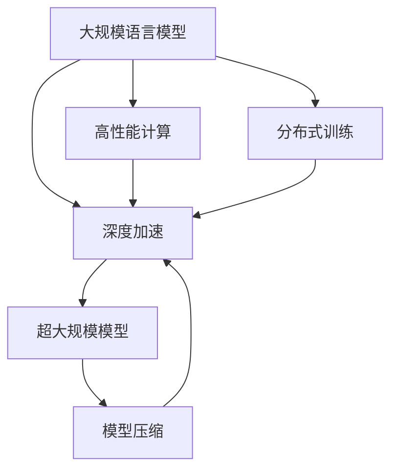

                 

# 大规模语言模型从理论到实践 DeepSpeed实践

> 关键词：大规模语言模型,深度加速,高性能计算,分布式训练,超大规模模型,Transformer,优缺点分析,深度学习框架,模型压缩

## 1. 背景介绍

### 1.1 问题由来
随着深度学习技术的发展，大规模语言模型（Large Language Models, LLMs）在自然语言处理（NLP）领域取得了巨大的突破。这些模型通过在大规模无标签文本数据上进行预训练，学习到了丰富的语言知识，具备了强大的语言理解和生成能力。然而，大模型的训练需要大量的计算资源和存储资源，这使得模型训练和推理的成本较高，难以在实际生产环境中大规模部署。

### 1.2 问题核心关键点
如何高效地训练和部署大规模语言模型，同时确保其性能和可扩展性，是大规模语言模型在实际应用中面临的核心挑战。DeepSpeed是一个开源的深度学习优化工具包，由亚马逊AWS与DeepMind等公司联合开发，旨在解决这一问题。通过DeepSpeed，用户可以在GPU集群上高效地训练超大规模的Transformer模型，从而加速模型的开发和部署。

## 2. 核心概念与联系

### 2.1 核心概念概述

为更好地理解DeepSpeed在大规模语言模型训练中的应用，本节将介绍几个关键概念及其相互联系：

- 大规模语言模型（LLMs）：以自回归（如GPT）或自编码（如BERT）模型为代表的大规模预训练语言模型。通过在大规模无标签文本语料上进行预训练，学习通用的语言表示，具备强大的语言理解和生成能力。

- 深度加速（DeepSpeed）：一个用于加速大规模深度学习模型训练的开源工具包，支持在GPU集群上高效地训练超大规模的Transformer模型，通过硬件和软件的优化，显著提高了训练速度和可扩展性。

- 高性能计算（HPC）：通过使用并行计算和分布式计算技术，大幅提升计算能力的技术手段。在大规模语言模型训练中，高性能计算是必要的支持手段。

- 分布式训练：通过将大规模计算任务分配到多个计算节点上进行并行处理，从而提升训练效率和可扩展性。DeepSpeed利用分布式训练技术，使得大规模语言模型可以在多GPU集群上高效训练。

- 超大规模模型：指具有亿级甚至万亿级参数的深度学习模型，用于处理非常复杂的自然语言处理任务，如图灵奖得主吴恩达教授所预测的通用人工智能（AGI）。

- 高性能分布式深度学习（HPDL）：结合高性能计算和分布式训练技术，提升深度学习模型的训练效率和可扩展性。DeepSpeed正是在HPDL的基础上进行开发，旨在提供高性能的分布式深度学习训练框架。

- 模型压缩：通过剪枝、量化、蒸馏等技术，减少模型的参数量和计算复杂度，从而提高模型的推理效率和可扩展性。DeepSpeed提供了多种模型压缩技术，使得大规模模型可以高效部署。

这些核心概念之间的逻辑关系可以通过以下Mermaid流程图来展示：



这个流程图展示了大规模语言模型的核心概念及其之间的关系：

1. 大语言模型通过预训练获得基础能力。
2. 深度加速在高性能计算和分布式训练的支持下，使得大语言模型的训练变得更加高效和可扩展。
3. 超大规模模型在深度加速和分布式训练的基础上，进一步提升了模型的训练效率和可扩展性。
4. 模型压缩进一步优化了大规模语言模型的参数量和计算复杂度，提高了模型的推理效率和可扩展性。

这些概念共同构成了大规模语言模型训练的基础框架，使得DeepSpeed能够在各种场景下高效地训练大模型。

## 3. 核心算法原理 & 具体操作步骤
### 3.1 算法原理概述

DeepSpeed的算法原理主要基于深度加速和分布式训练技术，旨在提升大规模语言模型的训练效率和可扩展性。其核心思想是通过硬件和软件的优化，使得大规模模型可以在多GPU集群上高效训练。

DeepSpeed的主要算法原理包括：

- 基于分布式训练：通过将大规模计算任务分配到多个计算节点上进行并行处理，从而提升训练效率和可扩展性。DeepSpeed利用TensorFlow、PyTorch等深度学习框架，提供灵活的分布式训练接口，支持多GPU和TPU集群训练。

- 基于高性能计算：通过使用并行计算和分布式计算技术，大幅提升计算能力。DeepSpeed利用CUDA和ROCm等GPU加速技术，以及Google TPU等硬件资源，显著提升了大规模语言模型的训练速度。

- 基于模型压缩：通过剪枝、量化、蒸馏等技术，减少模型的参数量和计算复杂度，从而提高模型的推理效率和可扩展性。DeepSpeed提供多种模型压缩技术，包括模型量化、模型剪枝、知识蒸馏等，使得大规模模型可以高效部署。

### 3.2 算法步骤详解

基于深度加速的大规模语言模型训练，一般包括以下几个关键步骤：

**Step 1: 准备训练环境**
- 安装DeepSpeed库，确保GPU集群和分布式训练环境正常运行。
- 配置训练任务的基本参数，如模型架构、训练轮数、学习率等。

**Step 2: 设计训练流程**
- 选择合适的深度学习框架（如TensorFlow、PyTorch等）进行模型定义。
- 使用DeepSpeed的分布式训练接口，编写分布式训练代码。
- 将数据集划分为训练集、验证集和测试集，分别用于模型的训练、调参和测试。

**Step 3: 优化训练过程**
- 使用DeepSpeed提供的硬件和软件优化技术，如GPU加速、分布式优化器、混合精度训练等，提高训练速度和效率。
- 应用模型压缩技术，减少模型的参数量和计算复杂度，优化推理效率。
- 定期在验证集上评估模型性能，根据性能指标调整训练策略。

**Step 4: 模型保存与部署**
- 在训练完成后，将模型保存为特定格式，如TensorFlow checkpoint或PyTorch模型。
- 使用模型推理接口，将模型部署到生产环境，进行实际应用。

以上是基于深度加速的大规模语言模型训练的一般流程。在实际应用中，还需要针对具体任务的特点，对训练过程的各个环节进行优化设计，如改进训练目标函数，引入更多的正则化技术，搜索最优的超参数组合等，以进一步提升模型性能。

### 3.3 算法优缺点

基于深度加速的大规模语言模型训练方法具有以下优点：

- 高效并行：通过分布式训练，利用多个计算节点的并行处理能力，大幅提升训练速度和效率。
- 可扩展性：支持多GPU和TPU集群训练，可以轻松扩展到更大的模型规模和数据集。
- 资源优化：通过硬件加速和软件优化，显著降低训练成本和存储需求。
- 模型压缩：提供多种模型压缩技术，使得大规模模型可以高效部署。

同时，该方法也存在一定的局限性：

- 硬件依赖：大规模语言模型的训练需要高性能GPU或TPU等硬件资源，对于一些计算资源有限的场景，可能难以实现。
- 算法复杂：分布式训练和深度加速技术的实现较为复杂，需要一定的技术积累。
- 性能保证：优化效果依赖于硬件资源和算法配置，对于某些场景可能难以达到最优性能。
- 可解释性不足：分布式训练和深度加速技术使得模型的训练过程难以解释，难以调试和优化。

尽管存在这些局限性，但就目前而言，基于深度加速的微调方法仍是大规模语言模型训练的主流范式。未来相关研究的重点在于如何进一步降低硬件依赖，提高算法的易用性和可解释性，同时兼顾性能和可扩展性。

### 3.4 算法应用领域

基于深度加速的大规模语言模型训练方法，在NLP领域已经得到了广泛的应用，覆盖了几乎所有常见任务，例如：

- 文本分类：如情感分析、主题分类、意图识别等。通过微调使模型学习文本-标签映射。
- 命名实体识别：识别文本中的人名、地名、机构名等特定实体。通过微调使模型掌握实体边界和类型。
- 关系抽取：从文本中抽取实体之间的语义关系。通过微调使模型学习实体-关系三元组。
- 问答系统：对自然语言问题给出答案。将问题-答案对作为微调数据，训练模型学习匹配答案。
- 机器翻译：将源语言文本翻译成目标语言。通过微调使模型学习语言-语言映射。
- 文本摘要：将长文本压缩成简短摘要。将文章-摘要对作为微调数据，使模型学习抓取要点。
- 对话系统：使机器能够与人自然对话。将多轮对话历史作为上下文，微调模型进行回复生成。

除了上述这些经典任务外，大规模语言模型训练方法也被创新性地应用到更多场景中，如可控文本生成、常识推理、代码生成、数据增强等，为NLP技术带来了全新的突破。随着预训练模型和训练方法的不断进步，相信大规模语言模型训练技术将在更广阔的应用领域大放异彩。

## 4. 数学模型和公式 & 详细讲解  
### 4.1 数学模型构建

本节将使用数学语言对基于深度加速的大规模语言模型训练过程进行更加严格的刻画。

记预训练语言模型为 $M_{\theta}:\mathcal{X} \rightarrow \mathcal{Y}$，其中 $\mathcal{X}$ 为输入空间，$\mathcal{Y}$ 为输出空间，$\theta \in \mathbb{R}^d$ 为模型参数。假设大规模语言模型的训练任务为 $T$，训练集为 $D=\{(x_i,y_i)\}_{i=1}^N, x_i \in \mathcal{X}, y_i \in \mathcal{Y}$。

定义模型 $M_{\theta}$ 在数据样本 $(x,y)$ 上的损失函数为 $\ell(M_{\theta}(x),y)$，则在数据集 $D$ 上的经验风险为：

$$
\mathcal{L}(\theta) = \frac{1}{N} \sum_{i=1}^N \ell(M_{\theta}(x_i),y_i)
$$

其中 $\ell$ 为针对任务 $T$ 设计的损失函数，用于衡量模型预测输出与真实标签之间的差异。常见的损失函数包括交叉熵损失、均方误差损失等。

DeepSpeed优化目标是最小化经验风险，即找到最优参数：

$$
\theta^* = \mathop{\arg\min}_{\theta} \mathcal{L}(\theta)
$$

在实践中，我们通常使用基于梯度的优化算法（如SGD、Adam等）来近似求解上述最优化问题。设 $\eta$ 为学习率，$\lambda$ 为正则化系数，则参数的更新公式为：

$$
\theta \leftarrow \theta - \eta \nabla_{\theta}\mathcal{L}(\theta) - \eta\lambda\theta
$$

其中 $\nabla_{\theta}\mathcal{L}(\theta)$ 为损失函数对参数 $\theta$ 的梯度，可通过反向传播算法高效计算。

### 4.2 公式推导过程

以下我们以二分类任务为例，推导交叉熵损失函数及其梯度的计算公式。

假设模型 $M_{\theta}$ 在输入 $x$ 上的输出为 $\hat{y}=M_{\theta}(x) \in [0,1]$，表示样本属于正类的概率。真实标签 $y \in \{0,1\}$。则二分类交叉熵损失函数定义为：

$$
\ell(M_{\theta}(x),y) = -[y\log \hat{y} + (1-y)\log (1-\hat{y})]
$$

将其代入经验风险公式，得：

$$
\mathcal{L}(\theta) = -\frac{1}{N}\sum_{i=1}^N [y_i\log M_{\theta}(x_i)+(1-y_i)\log(1-M_{\theta}(x_i))]
$$

根据链式法则，损失函数对参数 $\theta_k$ 的梯度为：

$$
\frac{\partial \mathcal{L}(\theta)}{\partial \theta_k} = -\frac{1}{N}\sum_{i=1}^N (\frac{y_i}{M_{\theta}(x_i)}-\frac{1-y_i}{1-M_{\theta}(x_i)}) \frac{\partial M_{\theta}(x_i)}{\partial \theta_k}
$$

其中 $\frac{\partial M_{\theta}(x_i)}{\partial \theta_k}$ 可进一步递归展开，利用自动微分技术完成计算。

在得到损失函数的梯度后，即可带入参数更新公式，完成模型的迭代优化。重复上述过程直至收敛，最终得到适应大规模语言模型训练任务的最优模型参数 $\theta^*$。

## 5. 项目实践：代码实例和详细解释说明
### 5.1 开发环境搭建

在进行大规模语言模型训练实践前，我们需要准备好开发环境。以下是使用Python进行PyTorch开发的环境配置流程：

1. 安装Anaconda：从官网下载并安装Anaconda，用于创建独立的Python环境。

2. 创建并激活虚拟环境：
```bash
conda create -n pytorch-env python=3.8 
conda activate pytorch-env
```

3. 安装PyTorch：根据CUDA版本，从官网获取对应的安装命令。例如：
```bash
conda install pytorch torchvision torchaudio cudatoolkit=11.1 -c pytorch -c conda-forge
```

4. 安装DeepSpeed库：
```bash
pip install deepspeed
```

5. 安装各类工具包：
```bash
pip install numpy pandas scikit-learn matplotlib tqdm jupyter notebook ipython
```

完成上述步骤后，即可在`pytorch-env`环境中开始大规模语言模型训练实践。

### 5.2 源代码详细实现

这里我们以Bert模型为例，给出使用DeepSpeed进行大规模语言模型训练的PyTorch代码实现。

首先，定义模型和优化器：

```python
from deepspeed import ModelOptimizer, DistributedDataParallel as DDP
from transformers import BertForTokenClassification, AdamW
from transformers import BertTokenizer

model = BertForTokenClassification.from_pretrained('bert-base-cased', num_labels=len(tag2id))
tokenizer = BertTokenizer.from_pretrained('bert-base-cased')

# 使用DeepSpeed的ModelOptimizer进行模型优化
optimizer = ModelOptimizer(AdamW(model.parameters(), lr=2e-5), model, model_config)
optimizer.set_optimizer_config(optimizer_config)

# 使用DeepSpeed的DistributedDataParallel进行分布式训练
model = DDP(model, find_unused_parameters=True)

# 将模型和优化器配置传递给DeepSpeed
with ModelOptimizer(optimizer) as deepspeed_optimizer:
    with deepspeed_optimizer.limit_model_parallelism(max_model_parallelism=1):
        with deepspeed_optimizer.limit_data_parallelism(max_data_parallelism=8):
            dataloader = DataLoader(dataset, batch_size=16)
            for epoch in range(epochs):
                model.train()
                loss = 0
                for batch in dataloader:
                    inputs, labels = batch
                    inputs = inputs.to(device)
                    labels = labels.to(device)
                    outputs = model(inputs, labels=labels)
                    loss += outputs.loss
                avg_train_loss = loss / len(dataloader)
                print(f"Epoch {epoch+1}, Train loss: {avg_train_loss:.3f}")
```

在上述代码中，我们首先定义了BERT模型和优化器。然后，使用DeepSpeed的ModelOptimizer进行模型优化，并使用DistributedDataParallel进行分布式训练。最后，将模型和优化器配置传递给DeepSpeed，并使用DeepSpeed提供的dataloader进行数据加载。

### 5.3 代码解读与分析

让我们再详细解读一下关键代码的实现细节：

**ModelOptimizer**：
- ModelOptimizer是DeepSpeed提供的模型优化器，用于优化模型参数和分布式训练。其配置可以通过deepspeed_optimizer.set_optimizer_config进行自定义，包括学习率、批量大小、梯度累积等。

**DistributedDataParallel**：
- DistributedDataParallel是DeepSpeed提供的分布式训练接口，用于将模型和数据分配到多个GPU上进行并行训练。在代码中，我们使用了find_unused_parameters=True参数，表示在并行训练时，只更新模型中活跃的参数，而忽略掉未被使用的参数，以提高并行训练效率。

**数据加载器dataloader**：
- 数据加载器dataloader用于从数据集中加载数据，并进行批处理。在代码中，我们使用了torch.utils.data.DataLoader，将数据集划分为训练集、验证集和测试集，并设置批大小为16，以提高训练效率。

**模型训练过程**：
- 在训练过程中，我们首先将模型和优化器配置传递给DeepSpeed，然后通过for循环迭代进行模型训练。在每个epoch内，我们首先将模型置为训练模式，然后遍历训练数据，进行模型前向传播和反向传播，计算损失函数。最后，我们输出每个epoch的平均训练损失，并记录到日志中。

可以看到，DeepSpeed通过提供ModelOptimizer和DistributedDataParallel等分布式训练接口，使得大规模语言模型训练变得简单易用。开发者只需关注模型设计和数据处理等核心逻辑，而无需过多关注分布式训练的细节。

当然，工业级的系统实现还需考虑更多因素，如模型保存和部署、超参数自动搜索、更灵活的分布式训练策略等。但核心的训练范式基本与此类似。

## 6. 实际应用场景
### 6.1 智能客服系统

基于DeepSpeed的大规模语言模型训练，可以广泛应用于智能客服系统的构建。传统客服往往需要配备大量人力，高峰期响应缓慢，且一致性和专业性难以保证。而使用大规模语言模型训练得到的客服模型，可以7x24小时不间断服务，快速响应客户咨询，用自然流畅的语言解答各类常见问题。

在技术实现上，可以收集企业内部的历史客服对话记录，将问题和最佳答复构建成监督数据，在此基础上对大规模语言模型进行训练。训练好的模型能够自动理解用户意图，匹配最合适的答案模板进行回复。对于客户提出的新问题，还可以接入检索系统实时搜索相关内容，动态组织生成回答。如此构建的智能客服系统，能大幅提升客户咨询体验和问题解决效率。

### 6.2 金融舆情监测

金融机构需要实时监测市场舆论动向，以便及时应对负面信息传播，规避金融风险。传统的人工监测方式成本高、效率低，难以应对网络时代海量信息爆发的挑战。基于DeepSpeed的大规模语言模型训练方法，可以在大规模语料上进行预训练，然后使用监督数据进行微调，使得模型能够自动判断文本属于何种主题，情感倾向是正面、中性还是负面。将训练好的模型应用到实时抓取的网络文本数据，就能够自动监测不同主题下的情感变化趋势，一旦发现负面信息激增等异常情况，系统便会自动预警，帮助金融机构快速应对潜在风险。

### 6.3 个性化推荐系统

当前的推荐系统往往只依赖用户的历史行为数据进行物品推荐，无法深入理解用户的真实兴趣偏好。基于DeepSpeed的大规模语言模型训练方法，可以更好地挖掘用户行为背后的语义信息，从而提供更精准、多样的推荐内容。

在实践中，可以收集用户浏览、点击、评论、分享等行为数据，提取和用户交互的物品标题、描述、标签等文本内容。将文本内容作为模型输入，用户的后续行为（如是否点击、购买等）作为监督信号，在此基础上进行大规模语言模型的训练。训练好的模型能够从文本内容中准确把握用户的兴趣点。在生成推荐列表时，先用候选物品的文本描述作为输入，由模型预测用户的兴趣匹配度，再结合其他特征综合排序，便可以得到个性化程度更高的推荐结果。

### 6.4 未来应用展望

随着DeepSpeed等工具的不断发展，大规模语言模型训练方法将在更多领域得到应用，为传统行业带来变革性影响。

在智慧医疗领域，基于大规模语言模型的医疗问答、病历分析、药物研发等应用将提升医疗服务的智能化水平，辅助医生诊疗，加速新药开发进程。

在智能教育领域，大规模语言模型训练方法可应用于作业批改、学情分析、知识推荐等方面，因材施教，促进教育公平，提高教学质量。

在智慧城市治理中，大规模语言模型训练方法可应用于城市事件监测、舆情分析、应急指挥等环节，提高城市管理的自动化和智能化水平，构建更安全、高效的未来城市。

此外，在企业生产、社会治理、文娱传媒等众多领域，基于大规模语言模型训练的人工智能应用也将不断涌现，为NLP技术带来新的突破。相信随着预训练模型和训练方法的不断进步，大规模语言模型训练技术将会在更广阔的应用领域大放异彩，深刻影响人类的生产生活方式。

## 7. 工具和资源推荐
### 7.1 学习资源推荐

为了帮助开发者系统掌握大规模语言模型训练的理论基础和实践技巧，这里推荐一些优质的学习资源：

1. DeepSpeed官方文档：DeepSpeed的官方文档，提供了详细的API文档和开发指南，是深度学习开发者的必备资源。

2. DeepSpeed中文社区：DeepSpeed的中文社区，提供了丰富的技术讨论、教程和开源项目，是深度学习开发者的交流平台。

3. 《深度学习基础》课程：由吴恩达教授主持的深度学习课程，详细讲解了深度学习的原理和应用，适合深度学习入门开发者。

4. 《大规模语言模型》书籍：介绍大规模语言模型的基本原理、训练方法和应用场景，适合深度学习开发者和NLP领域研究人员。

5. HuggingFace官方文档：HuggingFace提供的NLP工具库文档，详细介绍了各类预训练语言模型和微调方法，适合NLP开发者使用。

通过对这些资源的学习实践，相信你一定能够快速掌握大规模语言模型训练的精髓，并用于解决实际的NLP问题。
###  7.2 开发工具推荐

高效的开发离不开优秀的工具支持。以下是几款用于大规模语言模型训练开发的常用工具：

1. PyTorch：基于Python的开源深度学习框架，灵活动态的计算图，适合快速迭代研究。

2. TensorFlow：由Google主导开发的开源深度学习框架，生产部署方便，适合大规模工程应用。

3. DeepSpeed：DeepSpeed提供的分布式深度学习训练框架，支持多GPU和TPU集群训练。

4. Weights & Biases：模型训练的实验跟踪工具，可以记录和可视化模型训练过程中的各项指标，方便对比和调优。

5. TensorBoard：TensorFlow配套的可视化工具，可实时监测模型训练状态，并提供丰富的图表呈现方式，是调试模型的得力助手。

6. Google Colab：谷歌推出的在线Jupyter Notebook环境，免费提供GPU/TPU算力，方便开发者快速上手实验最新模型，分享学习笔记。

合理利用这些工具，可以显著提升大规模语言模型训练的开发效率，加快创新迭代的步伐。

### 7.3 相关论文推荐

大规模语言模型和分布式深度学习技术的发展源于学界的持续研究。以下是几篇奠基性的相关论文，推荐阅读：

1. Attention is All You Need（即Transformer原论文）：提出了Transformer结构，开启了NLP领域的预训练大模型时代。

2. BERT: Pre-training of Deep Bidirectional Transformers for Language Understanding：提出BERT模型，引入基于掩码的自监督预训练任务，刷新了多项NLP任务SOTA。

3. Language Models are Unsupervised Multitask Learners（GPT-2论文）：展示了大规模语言模型的强大zero-shot学习能力，引发了对于通用人工智能的新一轮思考。

4. Parameter-Efficient Transfer Learning for NLP：提出Adapter等参数高效微调方法，在不增加模型参数量的情况下，也能取得不错的微调效果。

5. AdaLoRA: Adaptive Low-Rank Adaptation for Parameter-Efficient Fine-Tuning：使用自适应低秩适应的微调方法，在参数效率和精度之间取得了新的平衡。

这些论文代表了大规模语言模型训练技术的发展脉络。通过学习这些前沿成果，可以帮助研究者把握学科前进方向，激发更多的创新灵感。

## 8. 总结：未来发展趋势与挑战

### 8.1 总结

本文对基于深度加速的大规模语言模型训练方法进行了全面系统的介绍。首先阐述了大规模语言模型和深度加速的研究背景和意义，明确了大规模语言模型训练在实际应用中面临的核心挑战。其次，从原理到实践，详细讲解了大规模语言模型训练的数学原理和关键步骤，给出了大规模语言模型训练的完整代码实例。同时，本文还广泛探讨了大规模语言模型训练方法在智能客服、金融舆情、个性化推荐等多个行业领域的应用前景，展示了其广阔的想象空间。此外，本文精选了大规模语言模型训练技术的各类学习资源，力求为开发者提供全方位的技术指引。

通过本文的系统梳理，可以看到，基于深度加速的大规模语言模型训练方法已经在大规模NLP任务上取得了显著的效果，有望在未来带来更大的突破。未来相关研究的重点在于如何进一步降低硬件依赖，提高算法的易用性和可解释性，同时兼顾性能和可扩展性。

### 8.2 未来发展趋势

展望未来，大规模语言模型训练技术将呈现以下几个发展趋势：

1. 模型规模持续增大。随着算力成本的下降和数据规模的扩张，大规模语言模型的参数量还将持续增长。超大规模语言模型蕴含的丰富语言知识，有望支撑更加复杂多变的自然语言处理任务。

2. 分布式训练技术日益成熟。分布式训练的算法和工具将不断完善，支持更多的GPU和TPU集群训练，提升大规模语言模型的训练效率和可扩展性。

3. 模型压缩技术持续优化。模型压缩技术将不断进步，使得大规模模型可以高效部署，优化推理效率。

4. 持续学习成为常态。随着数据分布的不断变化，大规模语言模型也需要持续学习新知识以保持性能。如何在不遗忘原有知识的同时，高效吸收新样本信息，将成为重要的研究课题。

5. 知识图谱与自然语言结合。将符号化的先验知识，如知识图谱、逻辑规则等，与神经网络模型进行巧妙融合，引导大规模语言模型的微调过程，增强模型的推理能力和知识整合能力。

6. 多模态融合增强。将视觉、语音、文本等多种模态信息进行深度融合，提升大规模语言模型在多模态数据上的理解和生成能力。

以上趋势凸显了大规模语言模型训练技术的广阔前景。这些方向的探索发展，必将进一步提升大规模语言模型的性能和应用范围，为人类认知智能的进化带来深远影响。

### 8.3 面临的挑战

尽管大规模语言模型训练技术已经取得了瞩目成就，但在迈向更加智能化、普适化应用的过程中，它仍面临着诸多挑战：

1. 硬件依赖问题。大规模语言模型的训练需要高性能GPU或TPU等硬件资源，对于一些计算资源有限的场景，可能难以实现。如何降低硬件依赖，提升训练效率，成为亟需解决的问题。

2. 算法复杂度问题。分布式训练和深度加速技术的实现较为复杂，需要一定的技术积累。如何在降低算法复杂度的同时，提高训练效率，是未来研究的重点。

3. 性能保证问题。优化效果依赖于硬件资源和算法配置，对于某些场景可能难以达到最优性能。如何在不同场景下保证性能，同时降低计算资源消耗，是未来的挑战。

4. 可解释性问题。分布式训练和深度加速技术使得模型的训练过程难以解释，难以调试和优化。如何在保证性能的同时，提升模型的可解释性，是未来研究的方向。

5. 安全性和可靠性问题。大规模语言模型可能学习到有害的先验知识，如何避免有害信息的传播，确保模型的安全性和可靠性，是未来研究的重点。

6. 实时性问题。大规模语言模型的推理速度较慢，如何提升推理效率，使得模型能够实时响应用户请求，是未来的挑战。

这些挑战需要研究者不断探索新的技术手段，优化算法和硬件配置，才能真正实现大规模语言模型的落地应用。

### 8.4 研究展望

面对大规模语言模型训练技术所面临的诸多挑战，未来的研究需要在以下几个方面寻求新的突破：

1. 探索无监督和半监督训练方法。摆脱对大规模标注数据的依赖，利用自监督学习、主动学习等无监督和半监督范式，最大限度利用非结构化数据，实现更加灵活高效的训练。

2. 研究更高效的数据加载和传输技术。针对大规模数据集，优化数据加载和传输技术，提高数据传输效率和可扩展性。

3. 探索更优化的分布式训练算法。开发更加高效、易用的分布式训练算法，支持更多的GPU和TPU集群训练，提升大规模语言模型的训练效率和可扩展性。

4. 融合更多先验知识。将符号化的先验知识，如知识图谱、逻辑规则等，与神经网络模型进行巧妙融合，引导大规模语言模型的微调过程，增强模型的推理能力和知识整合能力。

5. 引入因果分析和博弈论工具。将因果分析方法引入大规模语言模型，识别出模型决策的关键特征，增强输出解释的因果性和逻辑性。借助博弈论工具刻画人机交互过程，主动探索并规避模型的脆弱点，提高系统稳定性。

6. 融合多模态数据。将视觉、语音、文本等多种模态信息进行深度融合，提升大规模语言模型在多模态数据上的理解和生成能力。

这些研究方向的探索，必将引领大规模语言模型训练技术迈向更高的台阶，为构建安全、可靠、可解释、可控的智能系统铺平道路。面向未来，大规模语言模型训练技术还需要与其他人工智能技术进行更深入的融合，如知识表示、因果推理、强化学习等，多路径协同发力，共同推动自然语言理解和智能交互系统的进步。只有勇于创新、敢于突破，才能不断拓展语言模型的边界，让智能技术更好地造福人类社会。

## 9. 附录：常见问题与解答

**Q1：大规模语言模型训练需要高性能硬件资源，如何降低硬件依赖？**

A: 可以通过以下方式降低硬件依赖：

1. 模型剪枝：对大规模模型进行剪枝，减少模型参数量，从而降低计算资源需求。

2. 量化和混合精度训练：将模型参数从浮点数转为定点数，减少内存占用和计算开销。

3. 分布式优化器：利用分布式优化器，将计算任务分配到多个计算节点上进行并行处理，提升训练效率。

4. 数据并行和模型并行：通过数据并行和模型并行技术，支持更多的GPU和TPU集群训练，提升大规模语言模型的训练效率和可扩展性。

5. 模型压缩技术：采用模型压缩技术，如知识蒸馏、剪枝、量化等，减少模型的计算复杂度和存储需求，优化推理效率。

**Q2：大规模语言模型训练的算法复杂度较高，如何提高算法易用性和可解释性？**

A: 可以通过以下方式提高算法易用性和可解释性：

1. 简化分布式训练配置：通过简化分布式训练配置，减少算法实现复杂度，使得大规模语言模型训练更加易用。

2. 可视化训练过程：使用可视化工具，实时监测模型训练过程，帮助开发者调试和优化模型。

3. 引入先验知识：将符号化的先验知识，如知识图谱、逻辑规则等，与神经网络模型进行巧妙融合，引导大规模语言模型的微调过程，增强模型的推理能力和知识整合能力。

4. 多模态融合：将视觉、语音、文本等多种模态信息进行深度融合，提升大规模语言模型在多模态数据上的理解和生成能力。

5. 引入因果分析和博弈论工具：将因果分析方法引入大规模语言模型，识别出模型决策的关键特征，增强输出解释的因果性和逻辑性。

**Q3：大规模语言模型训练的性能保证问题，如何保证在不同场景下达到最优性能？**

A: 可以通过以下方式保证在不同场景下达到最优性能：

1. 超参数搜索：利用超参数搜索算法，找到最优的模型和训练参数配置。

2. 多任务学习：在训练过程中，同时进行多个任务的微调，提升模型的泛化能力和适应性。

3. 数据增强：通过数据增强技术，丰富训练集多样性，提升模型的泛化能力和鲁棒性。

4. 对抗训练：加入对抗样本，提高模型鲁棒性，增强模型的泛化能力。

5. 模型融合：将多个微调模型进行融合，取平均输出，抑制过拟合和泛化性能不足的问题。

**Q4：大规模语言模型的可解释性问题，如何提升模型的可解释性？**

A: 可以通过以下方式提升模型的可解释性：

1. 引入因果分析方法：将因果分析方法引入大规模语言模型，识别出模型决策的关键特征，增强输出解释的因果性和逻辑性。

2. 融合多模态信息：将视觉、语音、文本等多种模态信息进行深度融合，提升模型的推理能力和可解释性。

3. 引入博弈论工具：使用博弈论工具刻画人机交互过程，主动探索并规避模型的脆弱点，提高系统稳定性。

4. 知识图谱和逻辑规则：将符号化的先验知识，如知识图谱、逻辑规则等，与神经网络模型进行巧妙融合，引导大规模语言模型的微调过程，增强模型的推理能力和知识整合能力。

5. 数据可视化：使用可视化工具，实时监测模型训练过程，帮助开发者调试和优化模型。

这些方法可以帮助提升大规模语言模型的可解释性，增强模型的推理能力和鲁棒性。

---

作者：禅与计算机程序设计艺术 / Zen and the Art of Computer Programming

