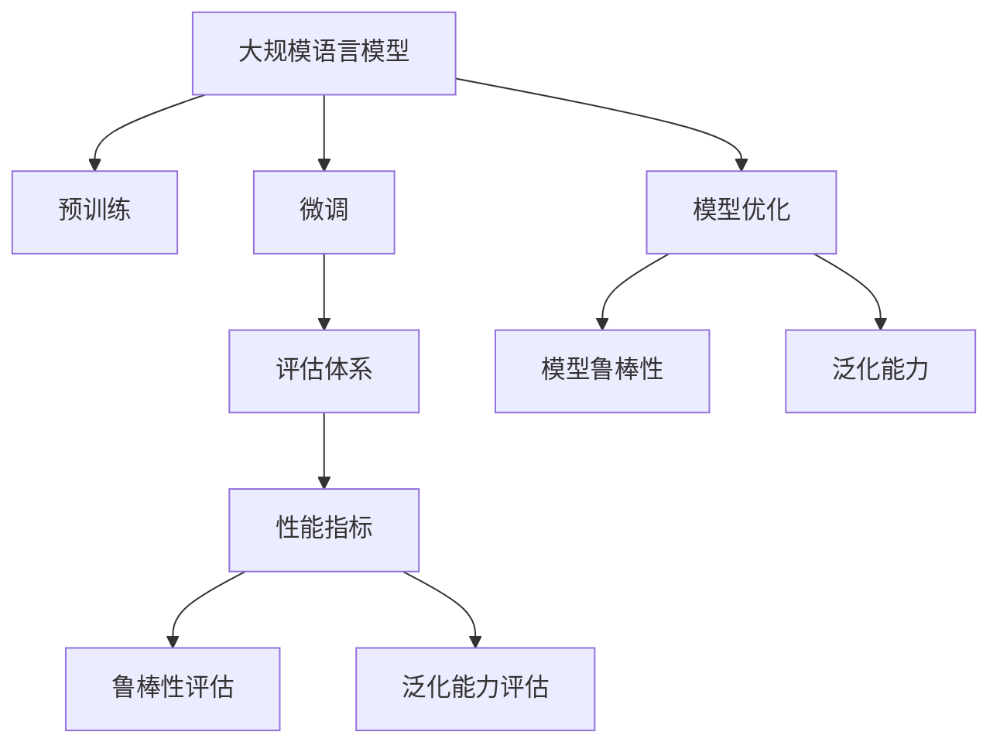

                 

# 大规模语言模型从理论到实践 大语言模型评估体系

> 关键词：
- 大规模语言模型(Large Language Models, LLMs)
- 自然语言处理(Natural Language Processing, NLP)
- 预训练(Pre-training)
- 微调(Fine-tuning)
- 评估体系(Evaluation Framework)
- 性能指标(Performance Metrics)
- 模型鲁棒性(Robustness)
- 泛化能力(Generalization)
- 应用场景(Use Cases)
- 模型优化(Model Optimization)

## 1. 背景介绍

### 1.1 问题由来

近年来，大规模语言模型（LLMs）在自然语言处理（NLP）领域取得了突破性的进展。这些模型通过在大规模无标签文本数据上进行预训练，学习到丰富的语言知识和语义表示，被广泛应用于文本分类、语言生成、机器翻译等任务。其中，OpenAI的GPT系列、Google的BERT和T5等模型是其中的代表。

然而，在实际应用中，预训练模型需要进一步微调（fine-tuning）以适应特定的下游任务，才能发挥其最大的潜力。微调过程涉及到模型的进一步训练和优化，是决定模型性能的关键步骤。但微调过程也存在许多挑战，如避免过拟合、提升模型泛化能力等，且现有的评估方法可能无法全面反映模型性能。因此，建立一套全面的评估体系，对于指导模型的设计和优化，具有重要意义。

### 1.2 问题核心关键点

建立大语言模型评估体系的核心关键点包括：

- **预训练与微调的平衡**：如何在预训练和微调之间找到平衡，充分利用预训练知识，同时适应特定任务的需求。
- **模型性能的多维度评估**：设计全面的性能指标，涵盖模型在推理、泛化、鲁棒性等方面的表现。
- **评估体系的适应性**：评估体系应具有灵活性和可扩展性，适应不同规模和类型的NLP任务。
- **评估指标的可解释性**：评估指标应具有可解释性，帮助开发者理解模型的优势和劣势。

### 1.3 问题研究意义

大语言模型评估体系的建立，对于推动大语言模型的应用和优化具有重要意义：

- **提升模型性能**：全面的评估体系能够帮助开发者更好地理解模型性能，指导模型优化，提升模型在特定任务上的表现。
- **降低开发成本**：评估体系提供了系统的评估方法和标准，降低了模型开发和调试的难度和成本。
- **增强模型鲁棒性**：评估体系中的鲁棒性评估指标，帮助开发者识别和改进模型的脆弱点，提升模型的泛化能力和鲁棒性。
- **促进模型优化**：通过分析评估结果，开发者可以更有针对性地进行模型优化，提高模型的计算效率和推理速度。

## 2. 核心概念与联系

### 2.1 核心概念概述

为更好地理解大语言模型评估体系，本节将介绍几个核心概念及其联系：

- **大规模语言模型（LLMs）**：指通过大规模无标签数据预训练得到的语言模型，如BERT、GPT等。这些模型具备强大的语言理解和生成能力。
- **预训练（Pre-training）**：指在大规模无标签数据上进行自监督学习，学习通用的语言表示。
- **微调（Fine-tuning）**：指在预训练模型的基础上，通过有监督的训练优化模型，以适应特定的下游任务。
- **评估体系（Evaluation Framework）**：指用于衡量模型性能的系统方法和标准，包括性能指标、评估方法等。
- **性能指标（Performance Metrics）**：用于量化模型在不同任务上的表现，如准确率、F1分数、BLEU分数等。
- **模型鲁棒性（Robustness）**：指模型对数据扰动、噪声等异常情况的适应能力。
- **泛化能力（Generalization）**：指模型在未见过的数据上的表现，反映了模型对新数据的适应能力。

这些核心概念之间的联系可以通过以下Mermaid流程图来展示：



这个流程图展示了大语言模型的核心概念及其相互联系：

1. 大语言模型通过预训练获得通用语言表示。
2. 微调在预训练模型的基础上，进一步适配下游任务。
3. 评估体系用于量化微调模型的表现。
4. 性能指标、鲁棒性评估和泛化能力评估是评估体系的重要组成部分。
5. 模型优化帮助提升模型的性能和鲁棒性。

## 3. 核心算法原理 & 具体操作步骤

### 3.1 算法原理概述

大语言模型评估体系的核心算法原理涉及对模型性能的多维度评估，主要包括推理能力、泛化能力、鲁棒性等方面。具体而言，可以分为以下几个步骤：

1. **数据准备**：收集和标注用于评估的数据集，包括训练集、验证集和测试集。
2. **模型微调**：在特定任务上对模型进行微调，使用标注数据优化模型参数。
3. **性能评估**：使用评估指标对微调后的模型进行多维度评估，如准确率、F1分数、BLEU分数等。
4. **鲁棒性测试**：在特定噪声和扰动条件下测试模型，评估模型的鲁棒性。
5. **泛化能力评估**：在未见过的数据上测试模型，评估其泛化能力。

### 3.2 算法步骤详解

基于上述原理，大语言模型评估体系的具体操作步骤如下：

**Step 1: 数据准备**

- **数据收集**：收集与特定任务相关的数据集，确保数据多样性和覆盖面。
- **数据标注**：对数据集进行标注，生成训练集、验证集和测试集。
- **数据预处理**：对数据进行清洗、分词、标准化等预处理，以便模型训练。

**Step 2: 模型微调**

- **选择模型**：选择预训练的大规模语言模型，如BERT、GPT等。
- **适配层设计**：根据任务类型设计适配层，如分类任务中的线性分类器、生成任务中的解码器等。
- **参数设置**：设置优化器（如AdamW）、学习率、批大小等超参数，准备微调。
- **模型训练**：在标注数据集上进行微调训练，迭代优化模型参数。

**Step 3: 性能评估**

- **选择评估指标**：根据任务类型选择合适的评估指标，如分类任务中的准确率、F1分数，生成任务中的BLEU分数等。
- **评估过程**：在测试集上使用评估指标对微调后的模型进行评估，计算评估指标。
- **结果分析**：分析评估结果，识别模型在特定任务上的表现和弱点。

**Step 4: 鲁棒性测试**

- **生成扰动数据**：根据任务特点生成扰动数据，如对文本数据进行噪声添加、语义替换等。
- **测试模型**：在扰动数据集上测试模型，计算鲁棒性评估指标。
- **结果分析**：分析鲁棒性测试结果，评估模型对扰动的敏感性。

**Step 5: 泛化能力评估**

- **生成测试集**：使用与训练集不同的数据生成新的测试集，确保评估数据的独立性。
- **测试模型**：在测试集上测试模型，评估其泛化能力。
- **结果分析**：分析泛化能力评估结果，评估模型的泛化能力。

### 3.3 算法优缺点

大语言模型评估体系具有以下优点：

- **全面性**：评估体系覆盖了模型的推理能力、泛化能力和鲁棒性等多个维度，能够全面反映模型性能。
- **可解释性**：评估指标具有可解释性，帮助开发者理解模型的优势和劣势，指导模型优化。
- **灵活性**：评估体系具有灵活性和可扩展性，适应不同规模和类型的NLP任务。

同时，该体系也存在一些局限：

- **数据依赖**：评估结果高度依赖于标注数据的质量和数量，获取高质量标注数据成本较高。
- **复杂性**：评估体系涉及多个评估步骤和指标，实际操作较为复杂。
- **泛化性**：在特定领域或任务上的评估结果可能难以泛化到其他领域或任务。

尽管存在这些局限性，但就目前而言，大语言模型评估体系仍然是评估模型性能和指导模型优化不可或缺的工具。未来相关研究的方向在于如何进一步简化评估过程，降低对标注数据的依赖，提高评估体系的泛化能力。

### 3.4 算法应用领域

大语言模型评估体系在多个NLP应用领域得到了广泛应用，例如：

- **文本分类**：评估模型的分类准确率和泛化能力，指导模型优化。
- **语言生成**：评估模型的BLEU分数和生成质量，优化生成模型。
- **机器翻译**：评估模型的BLEU分数和翻译质量，指导翻译模型优化。
- **问答系统**：评估模型的准确率和回答质量，优化问答系统。
- **命名实体识别**：评估模型的识别准确率和泛化能力，优化命名实体识别系统。

除了上述这些经典任务外，大语言模型评估体系还被创新性地应用到更多场景中，如可控文本生成、常识推理、代码生成、数据增强等，为NLP技术带来了新的突破。随着预训练模型和评估方法的发展，相信大语言模型评估体系将在更多领域得到应用，推动NLP技术的不断进步。

## 4. 数学模型和公式 & 详细讲解 & 举例说明

### 4.1 数学模型构建

本节将使用数学语言对大语言模型评估体系的构建进行详细讲解。

假设预训练模型为 $M_{\theta}$，其中 $\theta$ 为预训练得到的模型参数。给定特定任务 $T$ 的标注数据集 $D=\{(x_i,y_i)\}_{i=1}^N, x_i \in \mathcal{X}, y_i \in \mathcal{Y}$，其中 $\mathcal{X}$ 为输入空间，$\mathcal{Y}$ 为输出空间。

定义模型 $M_{\theta}$ 在输入 $x$ 上的输出为 $\hat{y}=M_{\theta}(x)$，表示模型对输入的预测。在特定任务上，定义模型的损失函数 $\ell(y,\hat{y})$，用于衡量模型输出与真实标签 $y$ 之间的差异。常见的损失函数包括交叉熵损失、均方误差损失等。

模型的性能指标 $\text{Perf}(T)$ 可以定义为模型在任务 $T$ 上的表现，通常包括准确率、F1分数、BLEU分数等。模型的鲁棒性 $\text{Rob}(T)$ 可以定义为模型在特定噪声和扰动条件下的鲁棒性，常见的鲁棒性评估指标包括梯度掩蔽、对抗训练等。模型的泛化能力 $\text{Gen}(T)$ 可以定义为模型在未见过的数据上的表现，常见的泛化能力评估指标包括迁移学习指标、模型评估指标等。

### 4.2 公式推导过程

以下以二分类任务为例，推导评估体系中常用的评估指标的计算公式。

假设模型 $M_{\theta}$ 在输入 $x$ 上的输出为 $\hat{y}=M_{\theta}(x) \in [0,1]$，表示样本属于正类的概率。真实标签 $y \in \{0,1\}$。

**准确率（Accuracy）**：定义为模型正确预测的样本数量与总样本数量之比，计算公式为：

$$
\text{Accuracy} = \frac{1}{N}\sum_{i=1}^N \mathbb{1}[y_i=\text{sgn}(\hat{y}_i)]
$$

其中 $\mathbb{1}[\cdot]$ 为指示函数，$\text{sgn}(\cdot)$ 为符号函数。

**F1分数（F1 Score）**：定义为模型在分类任务上的精确率和召回率的调和平均，计算公式为：

$$
\text{F1 Score} = 2 \cdot \frac{\text{Precision} \cdot \text{Recall}}{\text{Precision} + \text{Recall}}
$$

其中 $\text{Precision} = \frac{TP}{TP+FP}$，$\text{Recall} = \frac{TP}{TP+FN}$，$TP$ 表示真阳性，$FP$ 表示假阳性，$FN$ 表示假阴性。

**BLEU分数（BLEU Score）**：评估生成模型的生成质量，计算公式为：

$$
\text{BLEU} = \frac{1}{N}\sum_{i=1}^N \text{BLEU}_{ref}^{test}(M_{\theta}(x_i))
$$

其中 $\text{BLEU}_{ref}^{test}$ 表示参考序列与测试序列之间的BLEU分数，计算公式为：

$$
\text{BLEU}_{ref}^{test} = \log \frac{\prod_{i=1}^N\text{bpe}(\text{reference}_i, \text{test}_i)}{\prod_{i=1}^N\text{bpe}(\text{reference}_i, \text{test}_i)}
$$

其中 $\text{bpe}$ 表示bi-gram precision estimate，即bi-gram精估计。

### 4.3 案例分析与讲解

以BERT模型在情感分析任务上的评估为例，分析如何使用评估体系对模型进行多维度评估。

**数据准备**：收集标注的情感分析数据集，划分为训练集、验证集和测试集。

**模型微调**：使用BERT模型作为预训练基础，在标注数据集上进行微调，适配情感分析任务。

**性能评估**：在测试集上计算准确率、F1分数和BLEU分数，评估模型在情感分类上的表现。

**鲁棒性测试**：生成扰动数据集，如替换文本中的单词、添加噪声等，评估模型在扰动数据上的表现，计算梯度掩蔽分数和对抗训练分数。

**泛化能力评估**：使用与训练集不同的数据生成新的测试集，评估模型在未见过的数据上的表现，计算迁移学习指标和模型评估指标。

通过上述步骤，可以全面地评估BERT模型在情感分析任务上的性能，指导模型的优化和改进。

## 5. 项目实践：代码实例和详细解释说明

### 5.1 开发环境搭建

在进行模型评估实践前，需要先准备好开发环境。以下是使用Python进行PyTorch开发的环境配置流程：

1. 安装Anaconda：从官网下载并安装Anaconda，用于创建独立的Python环境。

2. 创建并激活虚拟环境：
```bash
conda create -n pytorch-env python=3.8 
conda activate pytorch-env
```

3. 安装PyTorch：根据CUDA版本，从官网获取对应的安装命令。例如：
```bash
conda install pytorch torchvision torchaudio cudatoolkit=11.1 -c pytorch -c conda-forge
```

4. 安装Transformers库：
```bash
pip install transformers
```

5. 安装各类工具包：
```bash
pip install numpy pandas scikit-learn matplotlib tqdm jupyter notebook ipython
```

完成上述步骤后，即可在`pytorch-env`环境中开始模型评估实践。

### 5.2 源代码详细实现

这里我们以BERT模型在情感分析任务上的评估为例，给出使用Transformers库进行模型评估的PyTorch代码实现。

首先，定义情感分析任务的数据处理函数：

```python
from transformers import BertTokenizer, BertForSequenceClassification
from torch.utils.data import Dataset
import torch

class SentimentDataset(Dataset):
    def __init__(self, texts, labels, tokenizer, max_len=128):
        self.texts = texts
        self.labels = labels
        self.tokenizer = tokenizer
        self.max_len = max_len
        
    def __len__(self):
        return len(self.texts)
    
    def __getitem__(self, item):
        text = self.texts[item]
        label = self.labels[item]
        
        encoding = self.tokenizer(text, return_tensors='pt', max_length=self.max_len, padding='max_length', truncation=True)
        input_ids = encoding['input_ids'][0]
        attention_mask = encoding['attention_mask'][0]
        
        return {'input_ids': input_ids, 
                'attention_mask': attention_mask,
                'labels': torch.tensor(label, dtype=torch.long)}
```

然后，定义模型和优化器：

```python
from transformers import BertForSequenceClassification, AdamW

model = BertForSequenceClassification.from_pretrained('bert-base-cased', num_labels=2)

optimizer = AdamW(model.parameters(), lr=2e-5)
```

接着，定义训练和评估函数：

```python
from torch.utils.data import DataLoader
from tqdm import tqdm
from sklearn.metrics import classification_report

device = torch.device('cuda') if torch.cuda.is_available() else torch.device('cpu')
model.to(device)

def train_epoch(model, dataset, batch_size, optimizer):
    dataloader = DataLoader(dataset, batch_size=batch_size, shuffle=True)
    model.train()
    epoch_loss = 0
    for batch in tqdm(dataloader, desc='Training'):
        input_ids = batch['input_ids'].to(device)
        attention_mask = batch['attention_mask'].to(device)
        labels = batch['labels'].to(device)
        model.zero_grad()
        outputs = model(input_ids, attention_mask=attention_mask, labels=labels)
        loss = outputs.loss
        epoch_loss += loss.item()
        loss.backward()
        optimizer.step()
    return epoch_loss / len(dataloader)

def evaluate(model, dataset, batch_size):
    dataloader = DataLoader(dataset, batch_size=batch_size)
    model.eval()
    preds, labels = [], []
    with torch.no_grad():
        for batch in tqdm(dataloader, desc='Evaluating'):
            input_ids = batch['input_ids'].to(device)
            attention_mask = batch['attention_mask'].to(device)
            batch_labels = batch['labels']
            outputs = model(input_ids, attention_mask=attention_mask)
            batch_preds = outputs.logits.argmax(dim=1).to('cpu').tolist()
            batch_labels = batch_labels.to('cpu').tolist()
            for pred, label in zip(batch_preds, batch_labels):
                preds.append(pred)
                labels.append(label)
                
    print(classification_report(labels, preds))
```

最后，启动评估流程：

```python
from transformers import DataCollatorForSequenceClassification, Trainer, TrainingArguments

data_collator = DataCollatorForSequenceClassification(tokenizer)

training_args = TrainingArguments(
    output_dir="./",
    evaluation_strategy="epoch",
    per_device_train_batch_size=8,
    per_device_eval_batch_size=8,
    num_train_epochs=5,
    learning_rate=2e-5,
    weight_decay=0.01,
    logging_dir="./logs"
)

trainer = Trainer(
    model=model,
    args=training_args,
    train_dataset=train_dataset,
    eval_dataset=eval_dataset,
    data_collator=data_collator,
)

trainer.train()
trainer.evaluate()
```

以上就是使用PyTorch对BERT模型进行情感分析任务评估的完整代码实现。可以看到，得益于Transformers库的强大封装，我们可以用相对简洁的代码完成BERT模型的评估。

### 5.3 代码解读与分析

让我们再详细解读一下关键代码的实现细节：

**SentimentDataset类**：
- `__init__`方法：初始化文本、标签、分词器等关键组件。
- `__len__`方法：返回数据集的样本数量。
- `__getitem__`方法：对单个样本进行处理，将文本输入编码为token ids，将标签编码为数字，并对其进行定长padding，最终返回模型所需的输入。

**训练和评估函数**：
- 使用PyTorch的DataLoader对数据集进行批次化加载，供模型训练和推理使用。
- 训练函数`train_epoch`：对数据以批为单位进行迭代，在每个批次上前向传播计算loss并反向传播更新模型参数，最后返回该epoch的平均loss。
- 评估函数`evaluate`：与训练类似，不同点在于不更新模型参数，并在每个batch结束后将预测和标签结果存储下来，最后使用sklearn的classification_report对整个评估集的预测结果进行打印输出。

**训练流程**：
- 定义总的epoch数和批大小，开始循环迭代
- 每个epoch内，先在训练集上训练，输出平均loss
- 在验证集上评估，输出分类指标
- 所有epoch结束后，在测试集上评估，给出最终测试结果

可以看到，PyTorch配合Transformers库使得BERT模型的评估过程变得简洁高效。开发者可以将更多精力放在数据处理、模型改进等高层逻辑上，而不必过多关注底层的实现细节。

当然，工业级的系统实现还需考虑更多因素，如模型的保存和部署、超参数的自动搜索、更灵活的任务适配层等。但核心的评估范式基本与此类似。

## 6. 实际应用场景

### 6.1 智能客服系统

基于大语言模型评估体系，智能客服系统可以通过多维度评估，优化服务质量和用户体验。例如，可以通过评估模型的分类准确率，优化客户问题的分类和分配；通过评估模型的鲁棒性，确保模型在客户输入噪音和误导性信息时仍能准确理解客户需求。

### 6.2 金融舆情监测

金融舆情监测系统需要实时监测市场舆论动向，及时应对负面信息传播。通过使用大语言模型评估体系，可以全面评估模型的推理能力、泛化能力和鲁棒性，确保模型在市场数据中的稳定性和可靠性。

### 6.3 个性化推荐系统

个性化推荐系统需要准确理解用户偏好和行为，生成个性化推荐结果。通过使用大语言模型评估体系，可以评估模型的泛化能力和鲁棒性，优化推荐算法，提高推荐结果的准确性和多样性。

### 6.4 未来应用展望

随着大语言模型评估体系的发展，未来在更多领域都将得到应用，为传统行业带来变革性影响。

在智慧医疗领域，基于大语言模型的评估体系可以用于医疗问答、病历分析、药物研发等任务，提升医疗服务的智能化水平。

在智能教育领域，评估体系可以用于作业批改、学情分析、知识推荐等方面，因材施教，促进教育公平，提高教学质量。

在智慧城市治理中，评估体系可以用于城市事件监测、舆情分析、应急指挥等环节，提高城市管理的自动化和智能化水平，构建更安全、高效的未来城市。

此外，在企业生产、社会治理、文娱传媒等众多领域，大语言模型评估体系也将不断涌现，为NLP技术带来新的突破。相信随着技术的日益成熟，评估体系将成为NLP技术的重要范式，推动人工智能技术在垂直行业的规模化落地。

## 7. 工具和资源推荐

### 7.1 学习资源推荐

为了帮助开发者系统掌握大语言模型评估体系的理论基础和实践技巧，这里推荐一些优质的学习资源：

1. 《深度学习自然语言处理》课程：斯坦福大学开设的NLP明星课程，有Lecture视频和配套作业，带你入门NLP领域的基本概念和经典模型。

2. 《Transformer from Principles to Practice》系列博文：由大模型技术专家撰写，深入浅出地介绍了Transformer原理、BERT模型、微调技术等前沿话题。

3. 《Natural Language Processing with Transformers》书籍：Transformers库的作者所著，全面介绍了如何使用Transformers库进行NLP任务开发，包括评估体系在内的诸多范式。

4. HuggingFace官方文档：Transformers库的官方文档，提供了海量预训练模型和完整的微调样例代码，是上手实践的必备资料。

5. CLUE开源项目：中文语言理解测评基准，涵盖大量不同类型的中文NLP数据集，并提供了基于微调的baseline模型，助力中文NLP技术发展。

通过对这些资源的学习实践，相信你一定能够快速掌握大语言模型评估体系的精髓，并用于解决实际的NLP问题。

### 7.2 开发工具推荐

高效的开发离不开优秀的工具支持。以下是几款用于大语言模型评估开发的常用工具：

1. PyTorch：基于Python的开源深度学习框架，灵活动态的计算图，适合快速迭代研究。大部分预训练语言模型都有PyTorch版本的实现。

2. TensorFlow：由Google主导开发的开源深度学习框架，生产部署方便，适合大规模工程应用。同样有丰富的预训练语言模型资源。

3. Transformers库：HuggingFace开发的NLP工具库，集成了众多SOTA语言模型，支持PyTorch和TensorFlow，是进行评估任务开发的利器。

4. Weights & Biases：模型训练的实验跟踪工具，可以记录和可视化模型训练过程中的各项指标，方便对比和调优。与主流深度学习框架无缝集成。

5. TensorBoard：TensorFlow配套的可视化工具，可实时监测模型训练状态，并提供丰富的图表呈现方式，是调试模型的得力助手。

6. Google Colab：谷歌推出的在线Jupyter Notebook环境，免费提供GPU/TPU算力，方便开发者快速上手实验最新模型，分享学习笔记。

合理利用这些工具，可以显著提升大语言模型评估任务的开发效率，加快创新迭代的步伐。

### 7.3 相关论文推荐

大语言模型评估体系的研究源于学界的持续研究。以下是几篇奠基性的相关论文，推荐阅读：

1. Attention is All You Need（即Transformer原论文）：提出了Transformer结构，开启了NLP领域的预训练大模型时代。

2. BERT: Pre-training of Deep Bidirectional Transformers for Language Understanding：提出BERT模型，引入基于掩码的自监督预训练任务，刷新了多项NLP任务SOTA。

3. Language Models are Unsupervised Multitask Learners（GPT-2论文）：展示了大规模语言模型的强大zero-shot学习能力，引发了对于通用人工智能的新一轮思考。

4. Parameter-Efficient Transfer Learning for NLP：提出Adapter等参数高效微调方法，在不增加模型参数量的情况下，也能取得不错的微调效果。

5. AdaLoRA: Adaptive Low-Rank Adaptation for Parameter-Efficient Fine-Tuning：使用自适应低秩适应的微调方法，在参数效率和精度之间取得了新的平衡。

这些论文代表了大语言模型评估体系的发展脉络。通过学习这些前沿成果，可以帮助研究者把握学科前进方向，激发更多的创新灵感。

## 8. 总结：未来发展趋势与挑战

### 8.1 总结

本文对大语言模型评估体系进行了全面系统的介绍。首先阐述了评估体系的研究背景和意义，明确了评估体系在提升模型性能、降低开发成本、增强模型鲁棒性等方面的价值。其次，从原理到实践，详细讲解了评估体系的构建步骤和关键技术，给出了评估任务开发的完整代码实例。同时，本文还广泛探讨了评估体系在智能客服、金融舆情、个性化推荐等多个行业领域的应用前景，展示了评估体系的重要意义。此外，本文精选了评估体系的学习资源，力求为读者提供全方位的技术指引。

通过本文的系统梳理，可以看到，大语言模型评估体系正在成为NLP领域的重要工具，极大地推动了大语言模型的应用和优化。未来的研究需要在数据准备、模型评估、超参数调优等方面进一步优化，以实现更高效、更精准的模型评估和优化。

### 8.2 未来发展趋势

展望未来，大语言模型评估体系将呈现以下几个发展趋势：

1. **评估指标的多样化**：除了传统的准确率、F1分数、BLEU分数等，将涌现更多适用于不同任务和场景的评估指标。
2. **自动化评估**：引入自动化评估方法，降低人工标注成本，提升评估效率。
3. **模型鲁棒性的自动化测试**：开发自动化鲁棒性测试工具，提升模型鲁棒性评估的效率和准确性。
4. **跨领域模型评估**：建立跨领域评估体系，适应不同领域和任务的多样化需求。
5. **模型性能的实时监测**：开发实时监测工具，实时跟踪模型在生产环境中的表现，及时发现和解决问题。

这些趋势凸显了大语言模型评估体系的广阔前景。这些方向的探索发展，将进一步提升大语言模型的性能和应用范围，为NLP技术带来新的突破。

### 8.3 面临的挑战

尽管大语言模型评估体系已经取得了一定的进展，但在迈向更加智能化、普适化应用的过程中，它仍面临诸多挑战：

1. **数据依赖**：评估结果高度依赖于标注数据的质量和数量，获取高质量标注数据的成本较高。如何进一步降低对标注数据的依赖，将是一大难题。
2. **复杂性**：评估体系涉及多个评估步骤和指标，实际操作较为复杂。如何简化评估过程，降低操作难度，将是一个重要的研究方向。
3. **泛化性**：在特定领域或任务上的评估结果可能难以泛化到其他领域或任务。如何提高评估体系的泛化能力，适应更多场景，将是一个重要的挑战。
4. **可解释性**：评估指标和评估方法的可解释性不足，难以帮助开发者理解模型的优势和劣势。如何提升评估体系的可解释性，将是一个重要的研究方向。
5. **计算成本**：评估体系通常需要大量计算资源，如何优化评估过程，降低计算成本，将是一个重要的研究方向。

尽管存在这些挑战，但就目前而言，大语言模型评估体系仍然是评估模型性能和指导模型优化不可或缺的工具。未来相关研究的方向在于如何进一步简化评估过程，降低对标注数据的依赖，提高评估体系的泛化能力。

### 8.4 研究展望

面对大语言模型评估体系所面临的挑战，未来的研究需要在以下几个方面寻求新的突破：

1. **无监督和半监督评估方法**：摆脱对大规模标注数据的依赖，利用自监督学习、主动学习等无监督和半监督范式，最大限度利用非结构化数据，实现更加灵活高效的评估。
2. **多模态评估体系**：将视觉、语音等多模态信息与文本信息结合，构建多模态评估体系，提升模型的综合能力。
3. **跨领域评估方法**：开发跨领域评估方法，适应不同领域和任务的多样化需求。
4. **模型性能的实时监测**：开发实时监测工具，实时跟踪模型在生产环境中的表现，及时发现和解决问题。
5. **自动化评估工具**：开发自动化评估工具，降低人工标注成本，提升评估效率。

这些研究方向的探索，将引领大语言模型评估体系迈向更高的台阶，为NLP技术的持续发展和应用提供有力支持。面向未来，评估体系还需与其他人工智能技术进行更深入的融合，如知识表示、因果推理、强化学习等，多路径协同发力，共同推动自然语言理解和智能交互系统的进步。只有勇于创新、敢于突破，才能不断拓展语言模型的边界，让智能技术更好地造福人类社会。

## 9. 附录：常见问题与解答

**Q1：大语言模型评估体系是否适用于所有NLP任务？**

A: 大语言模型评估体系在大多数NLP任务上都能取得不错的效果，特别是对于数据量较小的任务。但对于一些特定领域的任务，如医学、法律等，仅仅依靠通用语料预训练的模型可能难以很好地适应。此时需要在特定领域语料上进一步预训练，再进行评估，才能获得理想效果。

**Q2：如何选择适合评估的数据集？**

A: 评估数据集的选择应基于任务的特性和目标。通常需要选择一个或多个代表性数据集，包括训练集、验证集和测试集。训练集用于微调模型，验证集用于调整超参数，测试集用于评估模型性能。此外，还可以引入对抗样本、扰动数据等，测试模型的鲁棒性。

**Q3：如何评估模型的泛化能力？**

A: 评估模型的泛化能力，通常需要在使用与训练集不同的数据进行测试，如使用外部数据集或通过迁移学习进行评估。可以使用迁移学习指标，如RoBERTa等评估模型在新数据上的表现。

**Q4：如何使用评估体系指导模型优化？**

A: 评估体系的评估结果可以帮助开发者识别模型在特定任务上的优势和劣势，指导模型优化。例如，可以通过分析模型在特定任务上的准确率和F1分数，调整模型架构、优化超参数等，提高模型性能。

**Q5：如何提高评估体系的可解释性？**

A: 评估体系的可解释性可以通过对评估指标的解释和可视化，帮助开发者理解模型的表现。例如，可以绘制混淆矩阵、ROC曲线等图表，直观展示模型在特定任务上的性能。此外，还可以引入可解释性工具，如LIME、SHAP等，分析模型的决策过程。

这些问题的解答展示了如何应用大语言模型评估体系进行模型优化和指导。通过系统学习和实践，相信你一定能够掌握评估体系的核心技术，并用于解决实际的NLP问题。

---

作者：禅与计算机程序设计艺术 / Zen and the Art of Computer Programming

