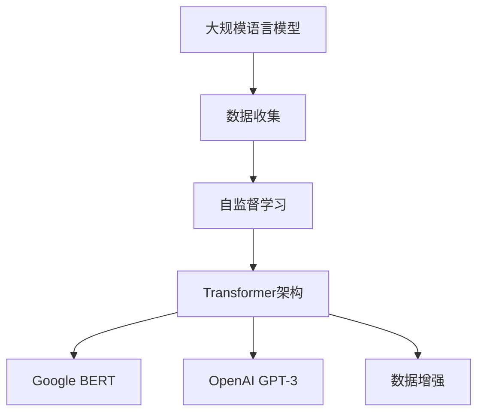

                 

# 大规模语言模型从理论到实践 数据收集与训练策略

> 关键词：大规模语言模型,数据收集,训练策略,预训练,自监督学习,Transformer,Google,OpenAI,数据增强

## 1. 背景介绍

### 1.1 问题由来
近年来，大规模语言模型（Large Language Models, LLMs）在自然语言处理（Natural Language Processing, NLP）领域取得了巨大的进展。这些模型基于Transformer架构，并依赖海量的无标签文本数据进行预训练，获得了广泛的语义知识和语言结构，能够在诸如语言建模、文本分类、问答、翻译等众多任务中表现出色。

### 1.2 问题核心关键点
大规模语言模型的发展离不开高质量的数据和高效的训练策略。本节将从数据收集和训练策略两个方面，系统介绍如何构建有效的预训练模型。

1. **数据收集**：高质量的数据是预训练模型的基础。需要确保数据的多样性、规模和代表性，以避免模型在训练过程中产生偏见或过拟合。
2. **训练策略**：预训练模型的训练策略包括自监督学习、教师-学生框架等，能够最大化利用无标签数据的潜力，从而学习到更强大的语言模型。

### 1.3 问题研究意义
理解大规模语言模型的数据收集与训练策略，对于构建高性能的预训练模型具有重要意义：

1. 降低开发成本：通过标准化、高效的数据收集和训练流程，可以快速构建高质量的预训练模型。
2. 提升模型效果：优化训练策略和参数设置，可以使模型在特定任务上取得更好的性能。
3. 加速研究进展：合理的数据收集和训练策略，有助于推动NLP领域的研究创新。
4. 支撑产业应用：高质量预训练模型可以作为基础技术，支撑各类NLP应用场景的开发和部署。

## 2. 核心概念与联系

### 2.1 核心概念概述

为更好地理解数据收集和训练策略在大规模语言模型中的作用，本节将介绍几个关键概念：

- **大规模语言模型**：指具有亿级参数规模的预训练模型，如BERT、GPT-3、T5等。
- **自监督学习**：指利用无标签数据进行模型训练，通过预定义的损失函数自动标注数据，从而学习到有意义的表示。
- **Transformer**：一种高效的神经网络结构，适用于大规模序列建模，已被广泛应用于语言模型、文本分类、机器翻译等任务。
- **Google BERT**：由Google提出的大规模预训练语言模型，采用掩码语言模型（Masked Language Modeling, MLM）和下一句预测（Next Sentence Prediction, NSP）作为预训练任务。
- **OpenAI GPT-3**：一种自回归预训练模型，基于Transformer架构，采用语言模型预测作为预训练任务，具有强大的生成能力。
- **数据增强**：通过一系列数据变换和扩充技术，增加数据集的多样性，以提高模型的泛化能力。

这些核心概念之间存在紧密的联系，共同构成了大规模语言模型从理论到实践的基础框架。

### 2.2 核心概念原理和架构的 Mermaid 流程图



这个流程图展示了数据收集、自监督学习、Transformer架构、BERT和GPT-3模型以及数据增强之间的联系。通过数据收集获取原始文本数据，自监督学习在大规模无标签数据上进行模型预训练，使用Transformer架构进行高效序列建模，并基于BERT和GPT-3等模型进行特定任务的微调，同时通过数据增强提升模型的泛化能力。

## 3. 核心算法原理 & 具体操作步骤
### 3.1 算法原理概述

大规模语言模型的训练策略主要基于自监督学习，即利用大规模无标签数据进行预训练。自监督学习的核心思想是通过预定义的损失函数，自动从数据中生成标注信息，从而训练模型。自监督学习可以分为掩码语言模型（MLM）、下一句预测（NSP）、句子嵌入等形式。

### 3.2 算法步骤详解

#### 3.2.1 数据收集

1. **数据源选择**：从公共语料库（如维基百科、Common Crawl等）和专业领域数据（如法律、医疗等）中收集文本数据。
2. **数据清洗**：去除无关的停用词、低频词和噪声数据，以保证数据质量。
3. **数据划分**：将数据集划分为训练集、验证集和测试集，比例一般为70:15:15。

#### 3.2.2 数据预处理

1. **分词与标记**：将文本数据进行分词处理，并标记每个词汇的词性、命名实体等信息。
2. **标准化与归一化**：将不同格式的文本数据标准化，如统一大小写、统一缩写等。
3. **去除重复与噪声**：去除数据集中的重复项和异常噪声。

#### 3.2.3 数据增强

1. **随机回译**：将一部分文本数据随机回译为其他语言，增加数据多样性。
2. **掩码语言模型**：随机掩盖一些词汇，要求模型预测其缺失部分，增加数据标注难度。
3. **同义词替换**：将文本中的某些词替换为同义词，增加词汇丰富度。
4. **噪声注入**：在文本中添加随机噪声，如插入、删除、替换等，增加模型鲁棒性。

#### 3.2.4 模型训练

1. **初始化模型**：使用随机初始化的模型参数。
2. **前向传播**：将输入数据输入模型，计算模型输出。
3. **损失计算**：根据预定义的损失函数计算模型输出与真实标签之间的差异。
4. **反向传播**：计算模型参数的梯度，并使用梯度下降等优化算法更新模型参数。
5. **迭代优化**：重复上述步骤，直至模型收敛。

### 3.3 算法优缺点

大规模语言模型的数据收集与训练策略具有以下优点：

1. **高效利用数据**：自监督学习充分利用了无标签数据，减少了标注成本。
2. **提升泛化能力**：数据增强增加了数据集的多样性，提升了模型的泛化能力。
3. **灵活适应任务**：大规模语言模型可以用于多种NLP任务，通过微调可以适应特定任务需求。

但同时，该策略也存在一些缺点：

1. **训练成本高**：大规模模型的训练需要大量的计算资源和时间。
2. **模型复杂度**：亿级参数的模型结构复杂，不易调试和优化。
3. **数据依赖性强**：数据质量和多样性直接影响模型的性能。

### 3.4 算法应用领域

大规模语言模型在多个领域中得到了广泛应用，包括但不限于：

- **文本分类**：如情感分析、主题分类、垃圾邮件过滤等。
- **信息检索**：如搜索引擎、推荐系统等。
- **机器翻译**：如Google翻译、百度翻译等。
- **问答系统**：如Siri、Alexa等。
- **自然语言生成**：如文本摘要、对话生成等。
- **代码生成**：如DeepCode、GitHub Copilot等。

## 4. 数学模型和公式 & 详细讲解 & 举例说明
### 4.1 数学模型构建

本节将介绍大规模语言模型的数学模型构建，以BERT为例。

BERT的预训练目标函数包括掩码语言模型（MLM）和下一句预测（NSP）两个部分：

$$
\mathcal{L}_{BERT} = \mathcal{L}_{MLM} + \mathcal{L}_{NSP}
$$

其中，$\mathcal{L}_{MLM}$ 和 $\mathcal{L}_{NSP}$ 分别表示掩码语言模型和下一句预测的损失函数。

### 4.2 公式推导过程

#### 4.2.1 掩码语言模型（MLM）

MLM的损失函数定义为：

$$
\mathcal{L}_{MLM} = -\frac{1}{N}\sum_{i=1}^N \sum_{j=1}^n \log p(x_i^j | x_i^{[0,\ldots,j-1]})
$$

其中，$x_i^j$ 表示在输入序列 $x_i$ 中，词汇 $j$ 的实际值。模型在掩码词汇后，预测其真实值。

#### 4.2.2 下一句预测（NSP）

NSP的损失函数定义为：

$$
\mathcal{L}_{NSP} = -\frac{1}{N}\sum_{i=1}^N \log p(x_i^{B, A} | x_i^{A})
$$

其中，$x_i^{B, A}$ 表示在输入序列 $x_i$ 中，下一句的实际值。模型在给定第一句的情况下，预测下一句是否连续。

### 4.3 案例分析与讲解

以Google的BERT模型为例，其训练过程主要分为以下几个步骤：

1. **数据收集**：从多个数据源收集约1,600万个英文句子，覆盖了多种文本类型和主题。
2. **数据预处理**：进行分词、标准化等处理，生成约2,500万个标记过的句子对。
3. **模型训练**：使用12层Transformer编码器，训练时间约5天，得到了约3.4亿个参数。
4. **模型微调**：将BERT应用于多个NLP任务，如问答系统、情感分析等，取得了优异的效果。

## 5. 项目实践：代码实例和详细解释说明
### 5.1 开发环境搭建

1. **安装Python**：确保安装最新版本的Python（建议3.8及以上版本）。
2. **安装PyTorch**：从官方网站下载并安装PyTorch，建议安装最新版。
3. **安装HuggingFace Transformers库**：该库提供了BERT等预训练模型的封装和接口，便于快速开发和部署。
4. **安装数据预处理库**：如NLTK、spaCy等，用于分词、标记等处理。
5. **安装数据增强库**：如TextAugment、BasicText等，用于数据增强。

### 5.2 源代码详细实现

以下是使用PyTorch和HuggingFace Transformers库实现BERT模型训练的代码示例：

```python
import torch
from transformers import BertTokenizer, BertForMaskedLM
from transformers import AdamW, get_linear_schedule_with_warmup

# 加载BERT模型和预训练参数
model = BertForMaskedLM.from_pretrained('bert-base-uncased')
tokenizer = BertTokenizer.from_pretrained('bert-base-uncased')

# 定义训练函数
def train_epoch(model, data_loader, optimizer, device):
    model.to(device)
    model.train()
    epoch_loss = 0
    for batch in data_loader:
        input_ids = batch['input_ids'].to(device)
        attention_mask = batch['attention_mask'].to(device)
        labels = batch['labels'].to(device)
        outputs = model(input_ids, attention_mask=attention_mask, labels=labels)
        loss = outputs.loss
        epoch_loss += loss.item()
        loss.backward()
        optimizer.step()
        optimizer.zero_grad()
    return epoch_loss / len(data_loader)

# 定义评估函数
def evaluate(model, data_loader, device):
    model.eval()
    eval_loss = 0
    eval_correct = 0
    for batch in data_loader:
        input_ids = batch['input_ids'].to(device)
        attention_mask = batch['attention_mask'].to(device)
        labels = batch['labels'].to(device)
        with torch.no_grad():
            outputs = model(input_ids, attention_mask=attention_mask)
            logits = outputs.logits
            eval_loss += logits.loss.item()
            logits = logits.argmax(dim=-1)
            eval_correct += (logits == labels).sum().item()
    return eval_loss / len(data_loader), eval_correct / len(data_loader.dataset)

# 定义训练循环
epochs = 5
total_steps = len(train_data_loader) * epochs
train_data_loader = DataLoader(train_data, batch_size=16)
eval_data_loader = DataLoader(eval_data, batch_size=16)
optimizer = AdamW(model.parameters(), lr=2e-5)
scheduler = get_linear_schedule_with_warmup(optimizer, num_warmup_steps=0, num_training_steps=total_steps)

device = torch.device('cuda' if torch.cuda.is_available() else 'cpu')
for epoch in range(epochs):
    train_loss = train_epoch(model, train_data_loader, optimizer, device)
    eval_loss, eval_acc = evaluate(model, eval_data_loader, device)
    print(f'Epoch {epoch+1}, Train Loss: {train_loss:.3f}, Eval Loss: {eval_loss:.3f}, Eval Acc: {eval_acc:.3f}')
```

### 5.3 代码解读与分析

上述代码中，我们首先加载了BERT模型和分词器，然后定义了训练和评估函数。训练函数`train_epoch`实现了模型参数的更新，评估函数`evaluate`计算了模型在验证集上的损失和准确率。最后，通过训练循环，对模型进行了多次迭代训练，并在验证集上进行了评估。

## 6. 实际应用场景
### 6.1 智能客服系统

智能客服系统是大规模语言模型的重要应用之一。通过预训练和微调，模型能够理解用户意图，并自动生成响应，提升客户体验和问题解决效率。

1. **数据收集**：从客户对话记录中提取问题和回答，作为监督数据。
2. **模型训练**：使用BERT等预训练模型进行微调，使其能够理解用户输入并生成合适的回答。
3. **系统部署**：将微调后的模型部署到智能客服系统中，与自然语言处理引擎、知识库等协同工作，提供自然流畅的对话体验。

### 6.2 金融舆情监测

金融舆情监测需要实时分析大量的新闻、评论等文本数据，以监控市场情绪和趋势。大规模语言模型可以通过预训练和微调，实现自动情感分析、主题分类等任务，辅助金融机构进行风险评估和管理。

1. **数据收集**：收集金融领域的文本数据，如新闻、评论、报告等。
2. **模型训练**：使用BERT等预训练模型进行微调，学习金融领域的语言表示和情感分析能力。
3. **系统集成**：将微调后的模型集成到金融舆情监测系统中，实时监控市场动态，提供风险预警和分析报告。

### 6.3 个性化推荐系统

个性化推荐系统需要根据用户的历史行为和兴趣，推荐相关的内容。大规模语言模型可以通过预训练和微调，学习用户的行为模式和兴趣偏好，提升推荐的精准度。

1. **数据收集**：收集用户浏览、点击、评分等行为数据。
2. **模型训练**：使用BERT等预训练模型进行微调，学习用户的兴趣模式和行为特征。
3. **系统集成**：将微调后的模型集成到推荐系统中，根据用户行为实时生成推荐结果，提升用户满意度。

### 6.4 未来应用展望

未来，大规模语言模型的应用场景将更加多样化，涵盖更多行业和领域。以下是对未来应用的展望：

1. **医疗领域**：大规模语言模型可以用于医疗问答、病历分析、药物研发等，辅助医生诊疗，加速新药开发进程。
2. **教育领域**：微调后的模型可以用于作业批改、学情分析、知识推荐等，因材施教，促进教育公平，提高教学质量。
3. **智慧城市**：模型可以用于城市事件监测、舆情分析、应急指挥等环节，提高城市管理的自动化和智能化水平。
4. **智慧农业**：利用语言模型对农业数据进行分析和预测，辅助农民进行精准农业管理。
5. **智能家居**：通过语音交互和自然语言处理，提升智能家居系统的用户体验。

## 7. 工具和资源推荐
### 7.1 学习资源推荐

1. **《Transformers从原理到实践》系列博文**：深入浅出地介绍了Transformer原理、BERT模型、微调技术等前沿话题。
2. **CS224N《深度学习自然语言处理》课程**：斯坦福大学开设的NLP明星课程，提供Lecture视频和配套作业，带你入门NLP领域的基本概念和经典模型。
3. **《Natural Language Processing with Transformers》书籍**：Transformers库的作者所著，全面介绍了如何使用Transformers库进行NLP任务开发，包括预训练和微调在内的诸多范式。
4. **HuggingFace官方文档**：提供了海量预训练模型和完整的微调样例代码，是上手实践的必备资料。
5. **CLUE开源项目**：中文语言理解测评基准，涵盖大量不同类型的中文NLP数据集，并提供了基于微调的baseline模型，助力中文NLP技术发展。

### 7.2 开发工具推荐

1. **PyTorch**：基于Python的开源深度学习框架，灵活动态的计算图，适合快速迭代研究。
2. **TensorFlow**：由Google主导开发的开源深度学习框架，生产部署方便，适合大规模工程应用。
3. **HuggingFace Transformers库**：提供了BERT、GPT-3等预训练模型的封装和接口，便于快速开发和部署。
4. **Weights & Biases**：模型训练的实验跟踪工具，可以记录和可视化模型训练过程中的各项指标，方便对比和调优。
5. **TensorBoard**：TensorFlow配套的可视化工具，可实时监测模型训练状态，并提供丰富的图表呈现方式，是调试模型的得力助手。
6. **Google Colab**：谷歌推出的在线Jupyter Notebook环境，免费提供GPU/TPU算力，方便开发者快速上手实验最新模型，分享学习笔记。

### 7.3 相关论文推荐

1. **Attention is All You Need**：提出了Transformer结构，开启了NLP领域的预训练大模型时代。
2. **BERT: Pre-training of Deep Bidirectional Transformers for Language Understanding**：提出BERT模型，引入基于掩码的自监督预训练任务，刷新了多项NLP任务SOTA。
3. **Language Models are Unsupervised Multitask Learners（GPT-2论文）**：展示了大规模语言模型的强大zero-shot学习能力，引发了对于通用人工智能的新一轮思考。
4. **Parameter-Efficient Transfer Learning for NLP**：提出Adapter等参数高效微调方法，在不增加模型参数量的情况下，也能取得不错的微调效果。
5. **Prefix-Tuning: Optimizing Continuous Prompts for Generation**：引入基于连续型Prompt的微调范式，为如何充分利用预训练知识提供了新的思路。
6. **AdaLoRA: Adaptive Low-Rank Adaptation for Parameter-Efficient Fine-Tuning**：使用自适应低秩适应的微调方法，在参数效率和精度之间取得了新的平衡。

## 8. 总结：未来发展趋势与挑战
### 8.1 总结

本文对大规模语言模型的数据收集与训练策略进行了全面系统的介绍。首先阐述了数据收集在大规模语言模型构建中的重要性，然后从自监督学习、Transformer架构、BERT和GPT-3模型等多个方面，详细讲解了如何构建高效的预训练模型。通过案例分析和代码实现，展示了数据收集与训练策略的实际应用。

通过本文的系统梳理，可以看到，大规模语言模型从理论到实践的过程，需要精心设计数据收集策略和训练算法，确保模型具备良好的泛化能力和泛用性。大数据时代的到来，为预训练模型的构建提供了广阔的空间，但如何高效利用数据，提升模型性能，仍是需要不断探索和创新的方向。

### 8.2 未来发展趋势

展望未来，大规模语言模型的数据收集与训练策略将呈现以下几个发展趋势：

1. **多源数据融合**：利用多源异构数据进行预训练，提升模型的鲁棒性和泛化能力。
2. **自适应学习**：结合因果推断和对比学习，自适应地调整训练策略，优化模型性能。
3. **分布式训练**：利用分布式训练技术，提高大规模模型的训练效率。
4. **零样本学习和少样本学习**：在缺乏标注数据的情况下，利用自监督学习和先验知识，实现高效的微调和预测。
5. **模型压缩和加速**：通过模型压缩和优化，提升模型的推理效率，降低资源消耗。

### 8.3 面临的挑战

尽管大规模语言模型的数据收集与训练策略取得了显著进展，但在迈向更加智能化、普适化应用的过程中，仍面临诸多挑战：

1. **数据质量和多样性**：高质量、多样性的数据是预训练模型的基础，如何获取和处理大规模数据仍是挑战。
2. **计算资源限制**：亿级参数的模型需要庞大的计算资源，如何高效利用计算资源，提升模型训练效率，仍是需要解决的问题。
3. **模型复杂度**：大规模模型的复杂度带来了调试和优化的难度，如何简化模型结构，提升模型的可解释性和鲁棒性，是未来的研究方向。
4. **隐私和安全**：大规模语言模型的训练和应用涉及大量敏感数据，如何保障数据隐私和安全，避免模型滥用，是亟待解决的问题。
5. **跨领域迁移能力**：如何将模型在不同领域和任务上进行迁移，实现泛用性和普适性，是未来需要深入探索的方向。

### 8.4 研究展望

面对大规模语言模型数据收集与训练策略所面临的挑战，未来的研究需要在以下几个方面寻求新的突破：

1. **无监督和半监督学习**：探索更高效的无监督和半监督学习范式，充分利用非结构化数据进行预训练。
2. **参数高效微调**：开发更加参数高效的微调方法，如AdaLoRA等，在不增加模型参数量的情况下，提升微调效果。
3. **多模态融合**：将文本、视觉、语音等多模态信息进行融合，提升模型的综合感知能力。
4. **因果分析和博弈论**：将因果分析和博弈论工具引入微调过程，增强模型的因果推理能力和鲁棒性。
5. **知识整合和迁移**：将专家知识与神经网络模型进行融合，增强模型的常识推理能力和跨领域迁移能力。
6. **可解释性和安全性**：赋予模型更强的可解释性，加强安全性约束，确保模型输出的可信度和安全性。

这些研究方向将推动大规模语言模型的不断发展，为构建更加智能、可靠、可解释的AI系统提供坚实的技术基础。

## 9. 附录：常见问题与解答

**Q1：大规模语言模型训练所需的数据量是否越多越好？**

A: 大规模语言模型的训练效果通常与数据量呈正相关，但并非数据量越多越好。过多的数据可能导致过拟合，反而降低模型的泛化能力。需要根据模型规模和任务复杂度合理选择数据量，并结合数据增强等技术进行优化。

**Q2：如何平衡模型参数量和模型性能？**

A: 在预训练和微调过程中，需要平衡模型参数量和模型性能。可以通过参数高效微调方法，如AdaLoRA、Prompt Learning等，在不增加参数量的情况下提升模型性能。同时，也需要根据具体任务和数据特点，选择适合的任务适配层和损失函数，进行模型调参。

**Q3：数据增强的目的是什么？**

A: 数据增强的目的是通过一系列数据变换和扩充技术，增加数据集的多样性，提升模型的泛化能力。常见的数据增强方法包括随机回译、掩码语言模型、同义词替换、噪声注入等，这些方法能够帮助模型更好地学习语言规律和语义特征。

**Q4：在大规模语言模型训练中，如何优化训练速度和资源消耗？**

A: 优化训练速度和资源消耗需要综合考虑模型结构、训练算法和硬件环境。可以通过模型压缩、稀疏化、分布式训练等技术，减少模型参数量和计算复杂度，提高训练效率。同时，选择合适的训练算法和超参数，如学习率、批大小、正则化等，也可以有效提升训练速度和稳定性。

**Q5：如何应对大规模语言模型在特定领域的应用挑战？**

A: 应对大规模语言模型在特定领域的应用挑战，需要在数据收集和模型训练中引入领域特定的知识，如专业术语、背景知识等，增强模型的领域适应能力。同时，可以通过微调、知识注入等方法，优化模型在特定领域的性能。

总之，大规模语言模型的数据收集与训练策略是实现高性能预训练模型的关键。通过精心设计数据收集策略和训练算法，合理利用计算资源，可以构建出高效、泛化能力强的大规模语言模型，为NLP领域带来广泛的应用和创新。未来，随着技术的不断进步，预训练和微调方法将进一步完善和发展，推动人工智能技术迈向新的高度。

