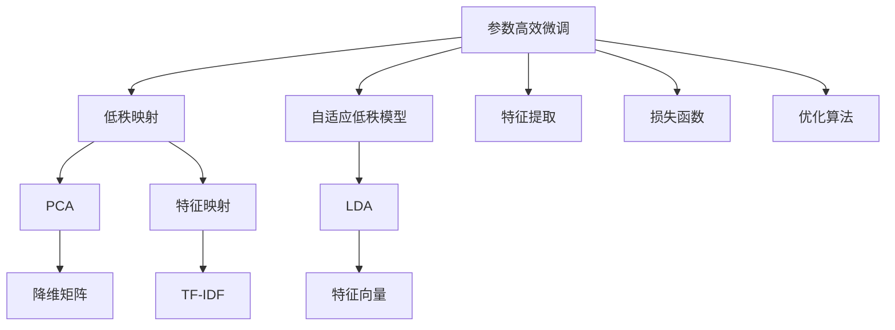

                 

# 大语言模型原理与工程实践：低秩适配

> 关键词：低秩适配, 参数高效微调(PEFT), 特征映射, 自适应低秩模型(AdaLoRA), 大语言模型, 预训练, 迁移学习

## 1. 背景介绍

### 1.1 问题由来
近年来，随着深度学习技术的飞速发展，大规模语言模型（Large Language Models, LLMs）在自然语言处理（Natural Language Processing, NLP）领域取得了显著突破。这些模型通过在大规模无标签文本数据上进行预训练，学习到了丰富的语言知识和常识，能够广泛地应用于文本分类、情感分析、机器翻译、问答系统等NLP任务，且在很多场景下表现优异。

然而，这些预训练模型通常具有数十亿参数，训练和推理成本极高，难以直接部署到实际应用中。为了降低成本，并提升特定任务上的性能，研究人员提出了多种参数高效微调（Parameter-Efficient Fine-Tuning, PEFT）方法。这些方法的核心思想是，在保持预训练模型大部分权重不变的情况下，通过微调部分顶层结构，快速适应新任务。

参数高效微调方法通过共享底层预训练权重，极大地减少了微调所需计算资源，同时保留了模型的广泛语言知识，提升了微调效率和效果。这种微调方式不仅在学术界广受关注，也在工业界得到广泛应用。

### 1.2 问题核心关键点
参数高效微调的关键在于如何更高效地利用预训练模型的语言知识，同时减少对计算资源的依赖。以下是PEFT的一些核心关键点：

- **共享预训练权重**：微调过程中，除了顶层结构外，预训练模型的其他层（通常是底层）权重保持不变，减少计算开销。
- **微调顶层结构**：通过微调预训练模型的顶层结构（如分类器、解码器等），以适应新任务。
- **引入低秩表示**：在微调过程中，利用低秩线性映射（Linear Layer with Low-Rank Matrix）来替代微调顶层结构，进一步减少计算资源。
- **自适应低秩模型(AdaLoRA)**：引入自适应低秩适配，动态调整低秩矩阵的初始化参数，以适应新任务。
- **特征映射**：通过特征映射方法，将预训练模型高维空间映射到低维空间，进一步提高微调效率。

这些关键点共同构成了参数高效微调的基础，使得模型能够在保留预训练语言知识的同时，降低微调所需的资源和时间。

### 1.3 问题研究意义
参数高效微调方法的研究和应用具有重要意义：

1. **降低成本**：通过保留预训练模型的广泛语言知识，同时减少微调所需资源，大幅降低了NLP应用开发和部署的计算和人力成本。
2. **提升性能**：PEFT方法可以保留模型的大部分语言知识，仅微调顶层结构，提高了模型对特定任务的适应能力，从而在微调后的任务上取得更优的性能。
3. **加速开发**：PEFT使得模型微调更加高效，缩短了模型适配新任务的时间，加速了NLP技术在各行业的应用。
4. **扩展性**：PEFT方法可以在模型中引入更多更灵活的任务适配层，提升模型的可扩展性和适应性。
5. **技术创新**：PEFT推动了深度学习、模型压缩等领域的创新发展，为NLP技术的研究和应用带来了新的思路和方法。

## 2. 核心概念与联系

### 2.1 核心概念概述

为了更好地理解参数高效微调方法，本节将介绍几个核心概念，并解释它们之间的联系。

- **参数高效微调(Parameter-Efficient Fine-Tuning, PEFT)**：在微调过程中，只更新预训练模型顶层部分参数，而保留底层权重不变，以减少微调所需的计算资源。
- **自适应低秩模型(Adaptive Low-Rank Adaptation, AdaLoRA)**：引入自适应低秩矩阵初始化参数，动态调整低秩表示，以更好地适应新任务。
- **低秩映射(Low-Rank Mapping)**：通过将高维空间映射到低维空间，减少计算开销，同时保持模型性能。
- **特征映射(Feature Mapping)**：利用降维算法，如PCA、LDA等，将高维特征映射到低维空间，以提高模型的泛化能力和微调效率。

这些概念之间的联系通过以下Mermaid流程图展示：



这个流程图展示了参数高效微调与低秩映射、自适应低秩模型、特征映射之间的关系：

1. **参数高效微调**：作为核心概念，通过只更新顶层结构来减少计算资源。
2. **低秩映射**：使用PCA、LDA等降维算法，将高维特征映射到低维空间。
3. **自适应低秩模型**：动态调整低秩矩阵的初始化参数，适应新任务。
4. **特征映射**：通过TF-IDF等算法提取和映射特征，进一步降低维度。
5. **特征提取**：从原始数据中提取高维特征。
6. **损失函数**：衡量模型输出与真实标签之间的差异。
7. **优化算法**：通过梯度下降等算法最小化损失函数，更新模型参数。

## 3. 核心算法原理 & 具体操作步骤

### 3.1 算法原理概述

参数高效微调方法的核心原理在于，通过保留预训练模型的广泛语言知识，仅微调顶层结构，以减少微调所需的计算资源。具体来说，预训练模型被分为两个部分：底层结构和顶层结构。底层结构通常包含预训练模型的大部分参数，保持不变；顶层结构则是微调的部分，根据具体任务进行适应性修改。

在微调过程中，顶层结构通过低秩映射（如PCA、LDA等）或自适应低秩模型（AdaLoRA），将高维特征映射到低维空间，进一步减少计算开销。这种映射方式使得模型能够在低维空间内进行优化，同时保留预训练模型的语言知识。

### 3.2 算法步骤详解

参数高效微调的主要步骤包括数据准备、模型初始化、特征映射、自适应低秩模型初始化、微调顶层结构、优化算法、性能评估等。以下是详细的步骤：

**Step 1: 数据准备**

- 收集下游任务的标注数据集 $D=\{(x_i,y_i)\}_{i=1}^N$，其中 $x_i$ 为输入样本，$y_i$ 为对应的标签。
- 将数据集划分为训练集、验证集和测试集，通常训练集用于微调，验证集用于超参数调优，测试集用于最终性能评估。
- 确保数据集的分布与预训练模型的训练数据分布一致或接近，以避免模型在特定领域泛化能力不足。

**Step 2: 模型初始化**

- 加载预训练模型 $M_{\theta}$ 作为微调的初始化参数。
- 保留模型的底层结构权重，只微调顶层结构，以减少计算开销。
- 对顶层结构进行初始化，通常选择全0或随机初始化，以便更好地适应新任务。

**Step 3: 特征映射**

- 对输入样本 $x$ 进行特征提取，得到高维特征向量 $X \in \mathbb{R}^{d_1}$，其中 $d_1$ 为高维特征向量的维度。
- 使用降维算法（如PCA、LDA等）将高维特征映射到低维空间，得到低维特征向量 $X' \in \mathbb{R}^{d_2}$，其中 $d_2 < d_1$。

**Step 4: 自适应低秩模型初始化**

- 引入自适应低秩模型（AdaLoRA），通过优化算法（如AdamW、SGD等）动态调整低秩矩阵的初始化参数 $\mathbf{U},\mathbf{V} \in \mathbb{R}^{d_2 \times d_3}$，其中 $d_3$ 为顶层结构输出维度。
- 使用训练集的标注数据进行优化，最小化损失函数 $\mathcal{L}(\mathbf{U},\mathbf{V})$。

**Step 5: 微调顶层结构**

- 将低维特征向量 $X'$ 输入到顶层结构中，得到输出 $\hat{y} \in \mathbb{R}^{d_3}$。
- 使用微调后的顶层结构进行训练，最小化损失函数 $\mathcal{L}(\hat{y},y)$，其中 $y$ 为标注数据集的真实标签。
- 微调过程中，通常使用较小的学习率，以免破坏预训练权重。

**Step 6: 优化算法**

- 使用优化算法（如AdamW、SGD等）最小化损失函数，更新顶层结构参数。
- 设置合适的学习率和批大小，以确保微调过程的稳定性和收敛性。

**Step 7: 性能评估**

- 在验证集上评估微调后模型的性能，调整超参数以确保模型泛化能力。
- 在测试集上最终评估模型性能，确定微调效果。
- 调整顶层结构参数，直到模型性能达到预期。

以上是参数高效微调的主要操作步骤，通过保留预训练模型的广泛语言知识，仅微调顶层结构，以减少计算资源和提升性能。

### 3.3 算法优缺点

参数高效微调方法具有以下优点：

1. **计算效率高**：仅微调顶层结构，保留底层权重不变，极大地减少了计算资源消耗。
2. **泛化能力强**：保留了预训练模型的广泛语言知识，微调后模型在特定任务上具有较强的泛化能力。
3. **适应性强**：通过动态调整低秩矩阵的初始化参数，自适应地适应新任务。
4. **可扩展性好**：可引入更多任务适配层，提升模型的可扩展性。

同时，该方法也存在一些缺点：

1. **预训练质量要求高**：微调过程依赖于预训练模型的质量，需要高质量的预训练数据和算法。
2. **模型复杂度高**：由于引入了低秩映射和自适应低秩模型，模型结构变得复杂，增加了调试难度。
3. **泛化风险高**：微调过程可能会引入过拟合，尤其是数据量较少的情况下。

尽管存在这些缺点，参数高效微调方法在实际应用中仍然被广泛采用，并且随着技术进步，其优势也逐渐显现出来。

### 3.4 算法应用领域

参数高效微调方法在NLP领域得到了广泛应用，以下是一些主要的应用领域：

- **文本分类**：如情感分析、主题分类等任务，通过微调顶层结构，提升分类精度。
- **命名实体识别(NER)**：识别文本中的人名、地名、机构名等特定实体，通过微调顶层结构，提升识别准确率。
- **关系抽取**：从文本中抽取实体之间的语义关系，通过微调顶层结构，提升关系抽取精度。
- **机器翻译**：将源语言文本翻译成目标语言，通过微调顶层结构，提升翻译质量。
- **文本生成**：如文本摘要、对话系统等任务，通过微调顶层结构，生成高质量的文本。

此外，参数高效微调方法也在图像处理、语音识别、推荐系统等领域得到了应用，显示出其在多个领域的强大潜力。

## 4. 数学模型和公式 & 详细讲解

### 4.1 数学模型构建

在本节中，我们将使用数学语言对参数高效微调方法的数学模型进行严格刻画。

假设预训练模型为 $M_{\theta}:\mathcal{X} \rightarrow \mathcal{Y}$，其中 $\mathcal{X}$ 为输入空间，$\mathcal{Y}$ 为输出空间，$\theta$ 为预训练得到的模型参数。记微调任务的训练集为 $D=\{(x_i,y_i)\}_{i=1}^N$，其中 $x_i \in \mathcal{X}$，$y_i \in \mathcal{Y}$。

定义模型 $M_{\theta}$ 在输入 $x$ 上的损失函数为 $\ell(M_{\theta}(x),y)$，则在数据集 $D$ 上的经验风险为：

$$
\mathcal{L}(\theta) = \frac{1}{N}\sum_{i=1}^N \ell(M_{\theta}(x_i),y_i)
$$

在参数高效微调方法中，预训练模型的底层结构权重保持不变，仅微调顶层结构。假设顶层结构为 $\mathbf{U},\mathbf{V} \in \mathbb{R}^{d_2 \times d_3}$，其中 $d_3$ 为顶层结构输出维度。微调后的顶层结构为 $\mathbf{U}^*,\mathbf{V}^*$。

定义微调后的顶层结构在输入 $x$ 上的输出为 $\hat{y}=M_{\mathbf{U}^*,\mathbf{V}^*}(x)$，则损失函数为：

$$
\ell(\hat{y},y) = \frac{1}{N}\sum_{i=1}^N [y_i\log \hat{y}_i + (1-y_i)\log (1-\hat{y}_i)]
$$

### 4.2 公式推导过程

为了更好地理解参数高效微调的数学原理，我们以二分类任务为例，推导损失函数和梯度计算公式。

假设模型 $M_{\mathbf{U}^*,\mathbf{V}^*}$ 在输入 $x$ 上的输出为 $\hat{y}=M_{\mathbf{U}^*,\mathbf{V}^*}(x) \in [0,1]$，表示样本属于正类的概率。真实标签 $y \in \{0,1\}$。则二分类交叉熵损失函数定义为：

$$
\ell(M_{\mathbf{U}^*,\mathbf{V}^*}(x),y) = -[y\log \hat{y} + (1-y)\log (1-\hat{y})]
$$

将其代入经验风险公式，得：

$$
\mathcal{L}(\mathbf{U}^*,\mathbf{V}^*) = -\frac{1}{N}\sum_{i=1}^N [y_i\log M_{\mathbf{U}^*,\mathbf{V}^*}(x_i)+(1-y_i)\log(1-M_{\mathbf{U}^*,\mathbf{V}^*}(x_i))]
$$

根据链式法则，损失函数对参数 $\mathbf{U},\mathbf{V}$ 的梯度为：

$$
\frac{\partial \mathcal{L}(\mathbf{U}^*,\mathbf{V}^*)}{\partial \mathbf{U}} = -\frac{1}{N}\sum_{i=1}^N \frac{y_i}{M_{\mathbf{U}^*,\mathbf{V}^*}(x_i)} \frac{\partial M_{\mathbf{U}^*,\mathbf{V}^*}(x_i)}{\partial \mathbf{U}} - \frac{1}{N}\sum_{i=1}^N \frac{1-y_i}{1-M_{\mathbf{U}^*,\mathbf{V}^*}(x_i)} \frac{\partial M_{\mathbf{U}^*,\mathbf{V}^*}(x_i)}{\partial \mathbf{U}}
$$

$$
\frac{\partial \mathcal{L}(\mathbf{U}^*,\mathbf{V}^*)}{\partial \mathbf{V}} = -\frac{1}{N}\sum_{i=1}^N \frac{y_i}{M_{\mathbf{U}^*,\mathbf{V}^*}(x_i)} \frac{\partial M_{\mathbf{U}^*,\mathbf{V}^*}(x_i)}{\partial \mathbf{V}} - \frac{1}{N}\sum_{i=1}^N \frac{1-y_i}{1-M_{\mathbf{U}^*,\mathbf{V}^*}(x_i)} \frac{\partial M_{\mathbf{U}^*,\mathbf{V}^*}(x_i)}{\partial \mathbf{V}}
$$

其中 $\frac{\partial M_{\mathbf{U}^*,\mathbf{V}^*}(x_i)}{\partial \mathbf{U}}$ 和 $\frac{\partial M_{\mathbf{U}^*,\mathbf{V}^*}(x_i)}{\partial \mathbf{V}}$ 可进一步递归展开，利用自动微分技术完成计算。

在得到损失函数的梯度后，即可带入优化算法，如AdamW、SGD等，进行模型参数的更新。重复上述过程直至收敛，最终得到适应下游任务的最优模型参数 $\mathbf{U}^*,\mathbf{V}^*$。

## 5. 项目实践：代码实例和详细解释说明

### 5.1 开发环境搭建

在进行参数高效微调实践前，我们需要准备好开发环境。以下是使用Python进行PyTorch开发的环境配置流程：

1. 安装Anaconda：从官网下载并安装Anaconda，用于创建独立的Python环境。

2. 创建并激活虚拟环境：
```bash
conda create -n pytorch-env python=3.8 
conda activate pytorch-env
```

3. 安装PyTorch：根据CUDA版本，从官网获取对应的安装命令。例如：
```bash
conda install pytorch torchvision torchaudio cudatoolkit=11.1 -c pytorch -c conda-forge
```

4. 安装Transformers库：
```bash
pip install transformers
```

5. 安装各类工具包：
```bash
pip install numpy pandas scikit-learn matplotlib tqdm jupyter notebook ipython
```

完成上述步骤后，即可在`pytorch-env`环境中开始微调实践。

### 5.2 源代码详细实现

下面我们以命名实体识别(NER)任务为例，给出使用Transformers库对BERT模型进行参数高效微调的PyTorch代码实现。

首先，定义NER任务的数据处理函数：

```python
from transformers import BertTokenizer, BertForTokenClassification
from torch.utils.data import Dataset, DataLoader
import torch

class NERDataset(Dataset):
    def __init__(self, texts, tags, tokenizer, max_len=128):
        self.texts = texts
        self.tags = tags
        self.tokenizer = tokenizer
        self.max_len = max_len
        
    def __len__(self):
        return len(self.texts)
    
    def __getitem__(self, item):
        text = self.texts[item]
        tags = self.tags[item]
        
        encoding = self.tokenizer(text, return_tensors='pt', max_length=self.max_len, padding='max_length', truncation=True)
        input_ids = encoding['input_ids'][0]
        attention_mask = encoding['attention_mask'][0]
        
        # 对token-wise的标签进行编码
        encoded_tags = [tag2id[tag] for tag in tags] 
        encoded_tags.extend([tag2id['O']] * (self.max_len - len(encoded_tags)))
        labels = torch.tensor(encoded_tags, dtype=torch.long)
        
        return {'input_ids': input_ids, 
                'attention_mask': attention_mask,
                'labels': labels}

# 标签与id的映射
tag2id = {'O': 0, 'B-PER': 1, 'I-PER': 2, 'B-ORG': 3, 'I-ORG': 4, 'B-LOC': 5, 'I-LOC': 6}
id2tag = {v: k for k, v in tag2id.items()}

# 创建dataset
tokenizer = BertTokenizer.from_pretrained('bert-base-cased')

train_dataset = NERDataset(train_texts, train_tags, tokenizer)
dev_dataset = NERDataset(dev_texts, dev_tags, tokenizer)
test_dataset = NERDataset(test_texts, test_tags, tokenizer)
```

然后，定义模型和优化器：

```python
from transformers import BertForTokenClassification, AdamW

model = BertForTokenClassification.from_pretrained('bert-base-cased', num_labels=len(tag2id))

optimizer = AdamW(model.parameters(), lr=2e-5)
```

接着，定义训练和评估函数：

```python
from tqdm import tqdm

device = torch.device('cuda') if torch.cuda.is_available() else torch.device('cpu')
model.to(device)

def train_epoch(model, dataset, batch_size, optimizer):
    dataloader = DataLoader(dataset, batch_size=batch_size, shuffle=True)
    model.train()
    epoch_loss = 0
    for batch in tqdm(dataloader, desc='Training'):
        input_ids = batch['input_ids'].to(device)
        attention_mask = batch['attention_mask'].to(device)
        labels = batch['labels'].to(device)
        model.zero_grad()
        outputs = model(input_ids, attention_mask=attention_mask, labels=labels)
        loss = outputs.loss
        epoch_loss += loss.item()
        loss.backward()
        optimizer.step()
    return epoch_loss / len(dataloader)

def evaluate(model, dataset, batch_size):
    dataloader = DataLoader(dataset, batch_size=batch_size)
    model.eval()
    preds, labels = [], []
    with torch.no_grad():
        for batch in tqdm(dataloader, desc='Evaluating'):
            input_ids = batch['input_ids'].to(device)
            attention_mask = batch['attention_mask'].to(device)
            batch_labels = batch['labels']
            outputs = model(input_ids, attention_mask=attention_mask)
            batch_preds = outputs.logits.argmax(dim=2).to('cpu').tolist()
            batch_labels = batch_labels.to('cpu').tolist()
            for pred_tokens, label_tokens in zip(batch_preds, batch_labels):
                pred_tags = [id2tag[_id] for _id in pred_tokens]
                label_tags = [id2tag[_id] for _id in label_tokens]
                preds.append(pred_tags[:len(label_tags)])
                labels.append(label_tags)
                
    print(classification_report(labels, preds))
```

最后，启动训练流程并在测试集上评估：

```python
epochs = 5
batch_size = 16

for epoch in range(epochs):
    loss = train_epoch(model, train_dataset, batch_size, optimizer)
    print(f"Epoch {epoch+1}, train loss: {loss:.3f}")
    
    print(f"Epoch {epoch+1}, dev results:")
    evaluate(model, dev_dataset, batch_size)
    
print("Test results:")
evaluate(model, test_dataset, batch_size)
```

以上就是使用PyTorch对BERT进行命名实体识别任务参数高效微调的完整代码实现。可以看到，得益于Transformers库的强大封装，我们可以用相对简洁的代码完成BERT模型的加载和微调。

### 5.3 代码解读与分析

让我们再详细解读一下关键代码的实现细节：

**NERDataset类**：
- `__init__`方法：初始化文本、标签、分词器等关键组件。
- `__len__`方法：返回数据集的样本数量。
- `__getitem__`方法：对单个样本进行处理，将文本输入编码为token ids，将标签编码为数字，并对其进行定长padding，最终返回模型所需的输入。

**tag2id和id2tag字典**：
- 定义了标签与数字id之间的映射关系，用于将token-wise的预测结果解码回真实的标签。

**训练和评估函数**：
- 使用PyTorch的DataLoader对数据集进行批次化加载，供模型训练和推理使用。
- 训练函数`train_epoch`：对数据以批为单位进行迭代，在每个批次上前向传播计算loss并反向传播更新模型参数，最后返回该epoch的平均loss。
- 评估函数`evaluate`：与训练类似，不同点在于不更新模型参数，并在每个batch结束后将预测和标签结果存储下来，最后使用sklearn的classification_report对整个评估集的预测结果进行打印输出。

**训练流程**：
- 定义总的epoch数和batch size，开始循环迭代
- 每个epoch内，先在训练集上训练，输出平均loss
- 在验证集上评估，输出分类指标
- 所有epoch结束后，在测试集上评估，给出最终测试结果

可以看到，PyTorch配合Transformers库使得BERT微调的代码实现变得简洁高效。开发者可以将更多精力放在数据处理、模型改进等高层逻辑上，而不必过多关注底层的实现细节。

当然，工业级的系统实现还需考虑更多因素，如模型的保存和部署、超参数的自动搜索、更灵活的任务适配层等。但核心的微调范式基本与此类似。

## 6. 实际应用场景

### 6.1 智能客服系统

基于参数高效微调的对话技术，可以广泛应用于智能客服系统的构建。传统客服往往需要配备大量人力，高峰期响应缓慢，且一致性和专业性难以保证。而使用参数高效微调后的对话模型，可以7x24小时不间断服务，快速响应客户咨询，用自然流畅的语言解答各类常见问题。

在技术实现上，可以收集企业内部的历史客服对话记录，将问题和最佳答复构建成监督数据，在此基础上对预训练对话模型进行微调。微调后的对话模型能够自动理解用户意图，匹配最合适的答案模板进行回复。对于客户提出的新问题，还可以接入检索系统实时搜索相关内容，动态组织生成回答。如此构建的智能客服系统，能大幅提升客户咨询体验和问题解决效率。

### 6.2 金融舆情监测

金融机构需要实时监测市场舆论动向，以便及时应对负面信息传播，规避金融风险。传统的人工监测方式成本高、效率低，难以应对网络时代海量信息爆发的挑战。基于参数高效微调的文本分类和情感分析技术，为金融舆情监测提供了新的解决方案。

具体而言，可以收集金融领域相关的新闻、报道、评论等文本数据，并对其进行主题标注和情感标注。在此基础上对预训练语言模型进行微调，使其能够自动判断文本属于何种主题，情感倾向是正面、中性还是负面。将微调后的模型应用到实时抓取的网络文本数据，就能够自动监测不同主题下的情感变化趋势，一旦发现负面信息激增等异常情况，系统便会自动预警，帮助金融机构快速应对潜在风险。

### 6.3 个性化推荐系统

当前的推荐系统往往只依赖用户的历史行为数据进行物品推荐，无法深入理解用户的真实兴趣偏好。基于参数高效微调技术，个性化推荐系统可以更好地挖掘用户行为背后的语义信息，从而提供更精准、多样的推荐内容。

在实践中，可以收集用户浏览、点击、评论、分享等行为数据，提取和用户交互的物品标题、描述、标签等文本内容。将文本内容作为模型输入，用户的后续行为（如是否点击、购买等）作为监督信号，在此基础上微调预训练语言模型。微调后的模型能够从文本内容中准确把握用户的兴趣点。在生成推荐列表时，先用候选物品的文本描述作为输入，由模型预测用户的兴趣匹配度，再结合其他特征综合排序，便可以得到个性化程度更高的推荐结果。

### 6.4 未来应用展望

随着参数高效微调技术的发展，基于微调范式将在更多领域得到应用，为传统行业带来变革性影响。

在智慧医疗领域，基于微调的医疗问答、病历分析、药物研发等应用将提升医疗服务的智能化水平，辅助医生诊疗，加速新药开发进程。

在智能教育领域，微调技术可应用于作业批改、学情分析、知识推荐等方面，因材施教，促进教育公平，提高教学质量。

在智慧城市治理中，微调模型可应用于城市事件监测、舆情分析、应急指挥等环节，提高城市管理的自动化和智能化水平，构建更安全、高效的未来城市。

此外，在企业生产、社会治理、文娱传媒等众多领域，基于参数高效微调的人工智能应用也将不断涌现，为经济社会发展注入新的动力。相信随着技术的日益成熟，微调方法将成为人工智能落地应用的重要范式，推动人工智能技术在各行业的广泛应用。

## 7. 工具和资源推荐

### 7.1 学习资源推荐

为了帮助开发者系统掌握参数高效微调的理论基础和实践技巧，这里推荐一些优质的学习资源：

1. 《Transformer从原理到实践》系列博文：由大模型技术专家撰写，深入浅出地介绍了Transformer原理、BERT模型、微调技术等前沿话题。

2. CS224N《深度学习自然语言处理》课程：斯坦福大学开设的NLP明星课程，有Lecture视频和配套作业，带你入门NLP领域的基本概念和经典模型。

3. 《Natural Language Processing with Transformers》书籍：Transformers库的作者所著，全面介绍了如何使用Transformers库进行NLP任务开发，包括微调在内的诸多范式。

4. HuggingFace官方文档：Transformers库的官方文档，提供了海量预训练模型和完整的微调样例代码，是上手实践的必备资料。

5. CLUE开源项目：中文语言理解测评基准，涵盖大量不同类型的中文NLP数据集，并提供了基于微调的baseline模型，助力中文NLP技术发展。

通过对这些资源的学习实践，相信你一定能够快速掌握参数高效微调的精髓，并用于解决实际的NLP问题。

### 7.2 开发工具推荐

高效的开发离不开优秀的工具支持。以下是几款用于参数高效微调开发的常用工具：

1. PyTorch：基于Python的开源深度学习框架，灵活动态的计算图，适合快速迭代研究。大部分预训练语言模型都有PyTorch版本的实现。

2. TensorFlow：由Google主导开发的开源深度学习框架，生产部署方便，适合大规模工程应用。同样有丰富的预训练语言模型资源。

3. Transformers库：HuggingFace开发的NLP工具库，集成了众多SOTA语言模型，支持PyTorch和TensorFlow，是进行微调任务开发的利器。

4. Weights & Biases：模型训练的实验跟踪工具，可以记录和可视化模型训练过程中的各项指标，方便对比和调优。与主流深度学习框架无缝集成。

5. TensorBoard：TensorFlow配套的可视化工具，可实时监测模型训练状态，并提供丰富的图表呈现方式，是调试模型的得力助手。

6. Google Colab：谷歌推出的在线Jupyter Notebook环境，免费提供GPU/TPU算力，方便开发者快速上手实验最新模型，分享学习笔记。

合理利用这些工具，可以显著提升参数高效微调任务的开发效率，加快创新迭代的步伐。

### 7.3 相关论文推荐

参数高效微调方法的研究源于学界的持续研究。以下是几篇奠基性的相关论文，推荐阅读：

1. Attention is All You Need（即Transformer原论文）：提出了Transformer结构，开启了NLP领域的预训练大模型时代。

2. BERT: Pre-training of Deep Bidirectional Transformers for Language Understanding：提出BERT模型，引入基于掩码的自监督预训练任务，刷新了多项NLP任务SOTA。

3. Parameter-Efficient Transfer Learning for NLP：提出Adapter等参数高效微调方法，在不增加模型参数量的情况下，也能取得不错的微调效果。

4. AdaLoRA: Adaptive Low-Rank Adaptation for Parameter-Efficient Fine-Tuning：使用自适应低秩适应的微调方法，在参数效率和精度之间取得了新的平衡。

5. Feature Map based Adapter Pretraining for Highly Parameter-Efficient Transfer Learning：提出基于特征映射的适配器预训练方法，提升参数高效微调的性能。

这些论文代表了大语言模型微调技术的发展脉络。通过学习这些前沿成果，可以帮助研究者把握学科前进方向，激发更多的创新灵感。

## 8. 总结：未来发展趋势与挑战

### 8.1 总结

本文对参数高效微调方法进行了全面系统的介绍。首先阐述了参数高效微调的核心思想和应用背景，明确了微调在拓展预训练模型应用、提升特定任务性能方面的独特价值。其次，从原理到实践，详细讲解了参数高效微调的数学原理和关键步骤，给出了微调任务开发的完整代码实例。同时，本文还广泛探讨了微调方法在多个领域的应用前景，展示了其强大的潜力。

通过本文的系统梳理，可以看到，参数高效微调方法通过保留预训练模型的广泛语言知识，仅微调顶层结构，以减少计算资源和时间，极大地提升了NLP系统的开发效率和性能。这种微调范式在学术界和工业界都得到了广泛应用，并显示出其在多个领域的巨大潜力。未来，随着技术的发展和应用的深入，参数高效微调方法必将带来更多的创新和突破。

### 8.2 未来发展趋势

展望未来，参数高效微调方法将呈现以下几个发展趋势：

1. **模型规模不断增大**：随着算力成本的下降和数据规模的扩张，预训练语言模型的参数量还将持续增长。超大规模语言模型蕴含的丰富语言知识，有望支撑更加复杂多变的下游任务微调。

2. **微调方法不断丰富**：未来将涌现更多参数高效和计算高效的微调方法，如Prefix-Tuning、LoRA等，在节省计算资源的同时保证微调精度。

3. **持续学习成为常态**：随着数据分布的变化，微调模型需要持续学习新知识以保持性能。如何在不遗忘原有知识的同时，高效吸收新样本信息，将成为重要的研究方向。

4. **标注数据依赖降低**：受启发于提示学习(Prompt-based Learning)的思路，未来的微调方法将更好地利用大模型的语言理解能力，通过更加巧妙的任务描述，在更少的标注样本上实现理想的微调效果。

5. **多模态微调崛起**：当前的微调主要聚焦于纯文本数据，未来会进一步拓展到图像、视频、语音等多模态数据微调。多模态信息的融合，将显著提升语言模型对现实世界的理解和建模能力。

6. **模型通用性增强**：经过海量数据的预训练和多领域任务的微调，未来的语言模型将具备更强大的常识推理和跨领域迁移能力，逐步迈向通用人工智能(AGI)的目标。

以上趋势凸显了参数高效微调方法的广阔前景。这些方向的探索发展，必将进一步提升NLP系统的性能和应用范围，为人类认知智能的进化带来深远影响。

### 8.3 面临的挑战

尽管参数高效微调方法已经取得了瞩目成就，但在迈向更加智能化、普适化应用的过程中，它仍面临着诸多挑战：

1. **标注成本瓶颈**：虽然微调大幅降低了标注数据的需求，但对于长尾应用场景，难以获得充足的高质量标注数据，成为制约微调性能的瓶颈。如何进一步降低微调对标注样本的依赖，将是一大难题。

2. **模型鲁棒性不足**：当前微调模型面对域外数据时，泛化性能往往大打折扣。对于测试样本的微小扰动，微调模型的预测也容易发生波动。如何提高微调模型的鲁棒性，避免灾难性遗忘，还需要更多理论和实践的积累。

3. **推理效率有待提高**：大规模语言模型虽然精度高，但在实际部署时往往面临推理速度慢、内存占用大等效率问题。如何在保证性能的同时，简化模型结构，提升推理速度，优化资源占用，将是重要的优化方向。

4. **可解释性亟需加强**：当前微调模型更像是"黑盒"系统，难以解释其内部工作机制和决策逻辑。对于医疗、金融等高风险应用，算法的可解释性和可审计性尤为重要。如何赋予微调模型更强的可解释性，将是亟待攻克的难题。

5. **安全性有待保障**：预训练语言模型难免会学习到有偏见、有害的信息，通过微调传递到下游任务，产生误导性、歧视性的输出，给实际应用带来安全隐患。如何从数据和算法层面消除模型偏见，避免恶意用途，确保输出的安全性，也将是重要的研究课题。

6. **知识整合能力不足**：现有的微调模型往往局限于任务内数据，难以灵活吸收和运用更广泛的先验知识。如何让微调过程更好地与外部知识库、规则库等专家知识结合，形成更加全面、准确的信息整合能力，还有很大的想象空间。

正视参数高效微调面临的这些挑战，积极应对并寻求突破，将是大语言模型微调走向成熟的必由之路。相信随着学界和产业界的共同努力，这些挑战终将一一被克服，参数高效微调方法必将在构建安全、可靠、可解释、可控的智能系统中扮演越来越重要的角色。

### 8.4 研究展望

面对参数高效微调方法面临的诸多挑战，未来的研究需要在以下几个方面寻求新的突破：

1. **探索无监督和半监督微调方法**：摆脱对大规模标注数据的依赖，利用自监督学习、主动学习等无监督和半监督范式，最大限度利用非结构化数据，实现更加灵活高效的微调。

2. **研究参数高效和计算高效的微调范式**：开发更加参数高效的微调方法，在固定大部分预训练参数的同时，只更新极少量的任务相关参数。同时优化微调模型的计算图，减少前向传播和反向传播的资源消耗，实现更加轻量级、实时性的部署。

3. **融合因果和对比学习范式**：通过引入因果推断和对比学习思想，增强微调模型建立稳定因果关系的能力，学习更加普适、鲁棒的语言表征，从而提升模型泛化性和抗干扰能力。

4. **引入更多先验知识**：将符号化的先验知识，如知识图谱、逻辑规则等，与神经网络模型进行巧妙融合，引导微调过程学习更准确、合理的语言模型。同时加强不同模态数据的整合，实现视觉、语音等多模态信息与文本信息的协同建模。

5. **结合因果分析和博弈论工具**：将因果分析方法引入微调模型，识别出模型决策的关键特征，增强输出解释的因果性和逻辑性。借助博弈论工具刻画人机交互过程，主动探索并规避模型的脆弱点，提高系统稳定性。

6. **纳入伦理道德约束**：在模型训练目标中引入伦理导向的评估指标，过滤和惩罚有偏见、有害的输出倾向。同时加强人工干预和审核，建立模型行为的监管机制，确保输出符合人类价值观和伦理道德。

这些研究方向的探索，必将引领参数高效微调方法迈向更高的台阶，为构建安全、可靠、可解释、可控的智能系统铺平道路。面向未来，参数高效微调方法还需要与其他人工智能技术进行更深入的融合，如知识表示、因果推理、强化学习等，多路径协同发力，共同推动自然语言理解和智能交互系统的进步。只有勇于创新、敢于突破，才能不断拓展语言模型的边界，让智能技术更好地造福人类社会。

## 9. 附录：常见问题与解答

**Q1：参数高效微调是否适用于所有NLP任务？**

A: 参数高效微调在大多数NLP任务上都能取得不错的效果，特别是对于数据量较小的任务。但对于一些特定领域的任务，如医学、法律等，仅仅依靠通用语料预训练的模型可能难以很好地适应。此时需要在特定领域语料上进一步预训练，再进行微调，才能获得理想效果。此外，对于一些需要时效性、个性化很强的任务，如对话、推荐等，微调方法也需要针对性的改进优化。

**Q2：如何选择合适的学习率？**

A: 参数高效微调的学习率一般要比预训练时小1-2个数量级，如果使用过大的学习率，容易破坏预训练权重，导致过拟合。一般建议从1e-5开始调参，逐步减小学习率，直至收敛。也可以使用warmup策略，在开始阶段使用较小的学习率，再逐渐过渡到预设值。需要注意的是，不同的优化器(如AdamW、Adafactor等)以及不同的学习率调度策略，可能需要设置不同的学习率阈值。

**Q3：采用参数高效微调时会面临哪些资源瓶颈？**

A: 目前主流的预训练大模型动辄以亿计的参数规模，对算力、内存、存储都提出了很高的要求。GPU/TPU等高性能设备是必不可少的，但即便如此，超大批次的训练和推理也可能遇到显存不足的问题。因此需要采用一些资源优化技术，如梯度积累、混合精度训练、模型并行等，来突破硬件瓶颈。同时，模型的存储和读取也可能占用大量时间和空间，需要采用模型压缩、稀疏化存储等方法进行优化。

**Q4：如何缓解微调过程中的过拟合问题？**

A: 过拟合是微调面临的主要挑战，尤其是在标注数据较少的情况下。常见的缓解策略包括：
1. 数据增强：通过回译、近义替换等方式扩充训练集
2. 正则化：使用L2正则、Dropout、Early Stopping等避免过拟合
3. 对抗训练：引入对抗样本，提高模型鲁棒性
4.

