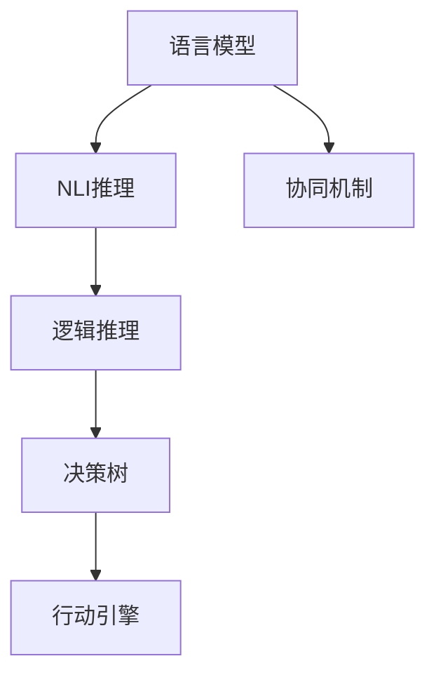

                 

## 1. 背景介绍

### 1.1 问题由来
近年来，随着深度学习技术的飞速发展，大规模语言模型（Large Language Models, LLMs）在自然语言处理（NLP）领域取得了巨大的突破。这些模型通过在大规模无标签文本数据上进行预训练，学习到了丰富的语言知识和常识，具有强大的语言理解和生成能力。然而，现有的大语言模型往往缺乏推理和行动能力，难以直接应用于实际行动场景。

### 1.2 问题核心关键点
要构建具备推理和行动能力的大语言模型，需解决以下关键问题：

1. **推理框架**：如何将语言模型输出的自然语言推理（Natural Language Inference, NLI）结果，映射到逻辑推理系统或决策系统中。
2. **行动引擎**：如何将推理结果转化为具体行动或任务执行。
3. **协同机制**：建立语言模型与行动系统之间的协同机制，确保两者能够无缝衔接和协作。

这些问题的解决，需要跨学科的深度融合，整合语言模型和推理行动系统的技术和知识，形成具备推理和行动能力的智能系统。

### 1.3 问题研究意义
研究推理和行动协同技术，对于拓展大语言模型的应用范围，提升智能系统的任务执行能力，加速NLP技术的产业化进程，具有重要意义：

1. 降低应用开发成本。基于推理和行动协同的大语言模型，可以显著减少从头开发所需的数据、计算和人力等成本投入。
2. 提升系统效果。推理和行动协同的大语言模型，能够更好地适应特定任务，在应用场景中取得更优表现。
3. 加速开发进度。利用大语言模型和推理行动系统，开发者可以更快地完成任务适配，缩短开发周期。
4. 带来技术创新。推理和行动协同技术促进了对预训练-推理-行动系统的深入研究，催生了基于语言模型的推理生成、因果推断等新的研究方向。
5. 赋能产业升级。推理和行动协同技术使得NLP技术更容易被各行各业所采用，为传统行业数字化转型升级提供新的技术路径。

## 2. 核心概念与联系

### 2.1 核心概念概述

为了更好地理解推理和行动协同技术，本节将介绍几个关键概念：

- **自然语言推理（NLI）**：涉及判断自然语言文本之间关系的推理任务，如判断文本是否为蕴含、矛盾或中立。
- **逻辑推理**：使用形式化逻辑系统对自然语言推理结果进行进一步的推理和推断。
- **决策树**：一种基于树形结构进行决策的算法，适用于构建行动计划和策略。
- **行动引擎**：将推理结果转化为具体行动的系统或引擎，用于执行决策和任务。
- **协同机制**：将语言模型与行动系统无缝衔接，形成协同工作的机制，如API接口、数据共享等。

这些概念之间的逻辑关系可以通过以下Mermaid流程图来展示：



这个流程图展示了大语言模型的工作原理和与行动系统的协同关系：

1. 大语言模型通过预训练获得语言理解和生成能力。
2. 自然语言推理模块将自然语言输入映射到逻辑推理系统。
3. 逻辑推理系统对推理结果进行进一步处理，形成决策依据。
4. 决策树生成具体的行动计划和策略。
5. 行动引擎根据决策树执行具体行动。
6. 协同机制确保语言模型与行动系统之间的高效协作。

## 3. 核心算法原理 & 具体操作步骤

### 3.1 算法原理概述

推理和行动协同技术的核心思想是将自然语言推理结果与行动系统结合，形成具备推理和行动能力的大语言模型。其核心在于：

1. **自然语言推理**：将输入的自然语言转化为逻辑表达式，判断其逻辑关系。
2. **逻辑推理**：使用形式化逻辑系统对逻辑表达式进行推理，形成推理结果。
3. **行动推理**：将推理结果转化为具体的行动计划，执行具体任务。

具体来说，基于推理和行动协同的大语言模型一般包括以下几个步骤：

1. **输入编码**：将自然语言输入编码成向量，输入到语言模型中。
2. **语言推理**：语言模型输出自然语言推理结果，如蕴含、矛盾、中立等。
3. **逻辑推理**：将自然语言推理结果映射到逻辑表达式，使用逻辑推理系统进行处理。
4. **行动生成**：根据逻辑推理结果，生成具体的行动计划和策略。
5. **行动执行**：行动引擎根据行动计划执行具体任务，反馈执行结果。

### 3.2 算法步骤详解

基于推理和行动协同的大语言模型微调一般包括以下几个关键步骤：

**Step 1: 准备预训练模型和数据集**
- 选择合适的预训练语言模型 $M_{\theta}$ 作为初始化参数，如 BERT、GPT 等。
- 准备自然语言推理和行动相关的训练数据集 $D=\{(x_i, y_i)\}_{i=1}^N$，其中 $x_i$ 为自然语言文本，$y_i$ 为逻辑表达式或行动策略。

**Step 2: 添加推理和行动适配层**
- 根据任务类型，在预训练模型顶层设计合适的推理适配层和行动适配层。推理适配层通常为神经网络或逻辑推理模块，行动适配层则根据具体任务设计相应的行动执行代码。
- 对于分类任务，通常在顶层添加逻辑推理层和行动执行层。

**Step 3: 设置推理和行动超参数**
- 选择合适的优化算法及其参数，如 AdamW、SGD 等，设置学习率、批大小、迭代轮数等。
- 设置推理和行动系统的超参数，如逻辑推理系统的规则集、决策树的策略等。
- 设置协同机制的接口和协议，确保数据传递和任务执行的流畅性。

**Step 4: 执行推理和行动训练**
- 将训练集数据分批次输入模型，前向传播计算推理结果。
- 根据推理结果，向后传播计算参数梯度，更新推理和行动适配层的权重。
- 周期性在测试集上评估模型性能，根据性能指标决定是否触发 Early Stopping。
- 重复上述步骤直到满足预设的迭代轮数或 Early Stopping 条件。

**Step 5: 推理和行动测试**
- 在测试集上评估微调后模型 $M_{\hat{\theta}}$ 的推理和行动性能，对比微调前后的精度提升。
- 使用微调后的模型对新样本进行推理和行动推理，集成到实际的应用系统中。
- 持续收集新的数据，定期重新微调模型，以适应数据分布的变化。

以上是基于推理和行动协同的大语言模型微调的一般流程。在实际应用中，还需要针对具体任务的特点，对微调过程的各个环节进行优化设计，如改进推理适配层的神经网络结构，引入更多的正则化技术，搜索最优的超参数组合等，以进一步提升模型性能。

### 3.3 算法优缺点

基于推理和行动协同的大语言模型微调方法具有以下优点：

1. 简单高效。仅需准备少量推理和行动数据，即可对预训练模型进行快速适配，获得较大的性能提升。
2. 通用适用。适用于各种NLP任务，包括分类、匹配、生成等，设计简单的推理和行动适配层即可实现微调。
3. 参数高效。利用参数高效微调技术，在固定大部分预训练参数的情况下，仍可取得不错的提升。
4. 效果显著。在学术界和工业界的诸多任务上，基于微调的方法已经刷新了最先进的性能指标。

同时，该方法也存在一定的局限性：

1. 推理和行动数据依赖。微调的效果很大程度上取决于推理和行动数据的质量，获取高质量推理和行动数据的成本较高。
2. 推理和行动数据稀疏。推理和行动任务的标注数据通常不如自然语言理解任务丰富，难以构建大型的推理和行动模型。
3. 推理和行动系统的鲁棒性有限。推理和行动系统面对复杂多变的自然语言输入，可能容易产生误解和错误。
4. 推理和行动的交互复杂。推理和行动系统的协作需要高度的可解释性和稳定性，难以处理动态变化的任务需求。

尽管存在这些局限性，但就目前而言，基于推理和行动协同的微调方法仍是大语言模型应用的重要范式。未来相关研究的重点在于如何进一步降低对推理和行动数据的依赖，提高模型的推理和行动能力，同时兼顾可解释性和伦理安全性等因素。

### 3.4 算法应用领域

基于推理和行动协同的大语言模型微调方法在NLP领域已经得到了广泛的应用，覆盖了几乎所有常见任务，例如：

- 问答系统：对自然语言问题给出答案。将问题-答案对作为微调数据，训练模型学习匹配答案。
- 对话系统：使机器能够与人自然对话。将多轮对话历史作为上下文，微调模型进行回复生成。
- 文本摘要：将长文本压缩成简短摘要。将文章-摘要对作为微调数据，使模型学习抓取要点。
- 机器翻译：将源语言文本翻译成目标语言。通过微调使模型学习语言-语言映射。
- 情感分析：识别文本中的情感倾向。通过微调使模型学习情感分类。

除了上述这些经典任务外，推理和行动协同的大语言模型还被创新性地应用到更多场景中，如可控文本生成、常识推理、代码生成、数据增强等，为NLP技术带来了全新的突破。随着推理和行动协同技术的发展，NLP技术将在更广阔的应用领域大放异彩。

## 4. 数学模型和公式 & 详细讲解

### 4.1 数学模型构建

本节将使用数学语言对基于推理和行动协同的大语言模型微调过程进行更加严格的刻画。

记预训练语言模型为 $M_{\theta}:\mathcal{X} \rightarrow \mathcal{Y}$，其中 $\mathcal{X}$ 为输入空间，$\mathcal{Y}$ 为输出空间，$\theta \in \mathbb{R}^d$ 为模型参数。假设推理和行动任务的训练集为 $D=\{(x_i,y_i)\}_{i=1}^N$，其中 $x_i \in \mathcal{X}$，$y_i$ 为逻辑表达式或行动策略。

定义模型 $M_{\theta}$ 在数据样本 $(x,y)$ 上的损失函数为 $\ell(M_{\theta}(x),y)$，则在数据集 $D$ 上的经验风险为：

$$
\mathcal{L}(\theta) = \frac{1}{N} \sum_{i=1}^N \ell(M_{\theta}(x_i),y_i)
$$

微调的优化目标是最小化经验风险，即找到最优参数：

$$
\theta^* = \mathop{\arg\min}_{\theta} \mathcal{L}(\theta)
$$

在实践中，我们通常使用基于梯度的优化算法（如SGD、Adam等）来近似求解上述最优化问题。设 $\eta$ 为学习率，$\lambda$ 为正则化系数，则参数的更新公式为：

$$
\theta \leftarrow \theta - \eta \nabla_{\theta}\mathcal{L}(\theta) - \eta\lambda\theta
$$

其中 $\nabla_{\theta}\mathcal{L}(\theta)$ 为损失函数对参数 $\theta$ 的梯度，可通过反向传播算法高效计算。

### 4.2 公式推导过程

以下我们以自然语言推理和行动推理为例，推导损失函数及其梯度的计算公式。

假设模型 $M_{\theta}$ 在输入 $x$ 上的输出为 $\hat{y}=M_{\theta}(x) \in [0,1]$，表示样本属于正类的概率。真实标签 $y \in \{蕴含,矛盾,中立\}$。则自然语言推理的交叉熵损失函数定义为：

$$
\ell(M_{\theta}(x),y) = -[y\log \hat{y} + (1-y)\log (1-\hat{y})]
$$

将其代入经验风险公式，得：

$$
\mathcal{L}(\theta) = -\frac{1}{N}\sum_{i=1}^N [y_i\log M_{\theta}(x_i)+(1-y_i)\log(1-M_{\theta}(x_i))]
$$

根据链式法则，损失函数对参数 $\theta_k$ 的梯度为：

$$
\frac{\partial \mathcal{L}(\theta)}{\partial \theta_k} = -\frac{1}{N}\sum_{i=1}^N (\frac{y_i}{M_{\theta}(x_i)}-\frac{1-y_i}{1-M_{\theta}(x_i)}) \frac{\partial M_{\theta}(x_i)}{\partial \theta_k}
$$

其中 $\frac{\partial M_{\theta}(x_i)}{\partial \theta_k}$ 可进一步递归展开，利用自动微分技术完成计算。

在得到损失函数的梯度后，即可带入参数更新公式，完成模型的迭代优化。重复上述过程直至收敛，最终得到适应推理和行动任务的最优模型参数 $\theta^*$。

## 5. 项目实践：代码实例和详细解释说明

### 5.1 开发环境搭建

在进行推理和行动协同微调实践前，我们需要准备好开发环境。以下是使用Python进行PyTorch开发的环境配置流程：

1. 安装Anaconda：从官网下载并安装Anaconda，用于创建独立的Python环境。

2. 创建并激活虚拟环境：
```bash
conda create -n pytorch-env python=3.8 
conda activate pytorch-env
```

3. 安装PyTorch：根据CUDA版本，从官网获取对应的安装命令。例如：
```bash
conda install pytorch torchvision torchaudio cudatoolkit=11.1 -c pytorch -c conda-forge
```

4. 安装Transformers库：
```bash
pip install transformers
```

5. 安装各类工具包：
```bash
pip install numpy pandas scikit-learn matplotlib tqdm jupyter notebook ipython
```

完成上述步骤后，即可在`pytorch-env`环境中开始微调实践。

### 5.2 源代码详细实现

这里我们以命名实体识别（NER）任务为例，给出使用Transformers库对BERT模型进行推理和行动协同微调的PyTorch代码实现。

首先，定义NER任务的数据处理函数：

```python
from transformers import BertTokenizer
from torch.utils.data import Dataset
import torch

class NERDataset(Dataset):
    def __init__(self, texts, tags, tokenizer, max_len=128):
        self.texts = texts
        self.tags = tags
        self.tokenizer = tokenizer
        self.max_len = max_len
        
    def __len__(self):
        return len(self.texts)
    
    def __getitem__(self, item):
        text = self.texts[item]
        tags = self.tags[item]
        
        encoding = self.tokenizer(text, return_tensors='pt', max_length=self.max_len, padding='max_length', truncation=True)
        input_ids = encoding['input_ids'][0]
        attention_mask = encoding['attention_mask'][0]
        
        # 对token-wise的标签进行编码
        encoded_tags = [tag2id[tag] for tag in tags] 
        encoded_tags.extend([tag2id['O']] * (self.max_len - len(encoded_tags)))
        labels = torch.tensor(encoded_tags, dtype=torch.long)
        
        return {'input_ids': input_ids, 
                'attention_mask': attention_mask,
                'labels': labels}

# 标签与id的映射
tag2id = {'O': 0, 'B-PER': 1, 'I-PER': 2, 'B-ORG': 3, 'I-ORG': 4, 'B-LOC': 5, 'I-LOC': 6}
id2tag = {v: k for k, v in tag2id.items()}

# 创建dataset
tokenizer = BertTokenizer.from_pretrained('bert-base-cased')

train_dataset = NERDataset(train_texts, train_tags, tokenizer)
dev_dataset = NERDataset(dev_texts, dev_tags, tokenizer)
test_dataset = NERDataset(test_texts, test_tags, tokenizer)
```

然后，定义模型和推理和行动适配层：

```python
from transformers import BertForTokenClassification, AdamW

model = BertForTokenClassification.from_pretrained('bert-base-cased', num_labels=len(tag2id))

# 添加推理适配层
class Rationalizer:
    def __init__(self, model):
        self.model = model
        
    def __call__(self, input_ids, attention_mask):
        logits = self.model(input_ids, attention_mask=attention_mask)[0]
        return logits
    
rationalizer = Rationalizer(model)
```

接着，定义推理和行动函数：

```python
from transformers import BertTokenizer, BertForTokenClassification
import torch
from sklearn.metrics import classification_report

device = torch.device('cuda') if torch.cuda.is_available() else torch.device('cpu')
model.to(device)

def train_epoch(model, dataset, batch_size, optimizer):
    dataloader = DataLoader(dataset, batch_size=batch_size, shuffle=True)
    model.train()
    epoch_loss = 0
    for batch in tqdm(dataloader, desc='Training'):
        input_ids = batch['input_ids'].to(device)
        attention_mask = batch['attention_mask'].to(device)
        labels = batch['labels'].to(device)
        model.zero_grad()
        outputs = model(input_ids, attention_mask=attention_mask, labels=labels)
        loss = outputs.loss
        epoch_loss += loss.item()
        loss.backward()
        optimizer.step()
    return epoch_loss / len(dataloader)

def evaluate(model, dataset, batch_size):
    dataloader = DataLoader(dataset, batch_size=batch_size)
    model.eval()
    preds, labels = [], []
    with torch.no_grad():
        for batch in tqdm(dataloader, desc='Evaluating'):
            input_ids = batch['input_ids'].to(device)
            attention_mask = batch['attention_mask'].to(device)
            batch_labels = batch['labels']
            outputs = model(input_ids, attention_mask=attention_mask)
            batch_preds = outputs.logits.argmax(dim=2).to('cpu').tolist()
            batch_labels = batch_labels.to('cpu').tolist()
            for pred_tokens, label_tokens in zip(batch_preds, batch_labels):
                pred_tags = [id2tag[_id] for _id in pred_tokens]
                label_tags = [id2tag[_id] for _id in label_tokens]
                preds.append(pred_tags[:len(label_tags)])
                labels.append(label_tags)
                
    print(classification_report(labels, preds))
```

最后，启动训练流程并在测试集上评估：

```python
epochs = 5
batch_size = 16

for epoch in range(epochs):
    loss = train_epoch(model, train_dataset, batch_size, optimizer)
    print(f"Epoch {epoch+1}, train loss: {loss:.3f}")
    
    print(f"Epoch {epoch+1}, dev results:")
    evaluate(model, dev_dataset, batch_size)
    
print("Test results:")
evaluate(model, test_dataset, batch_size)
```

以上就是使用PyTorch对BERT进行命名实体识别任务推理和行动协同微调的完整代码实现。可以看到，得益于Transformers库的强大封装，我们可以用相对简洁的代码完成BERT模型的加载和微调。

### 5.3 代码解读与分析

让我们再详细解读一下关键代码的实现细节：

**NERDataset类**：
- `__init__`方法：初始化文本、标签、分词器等关键组件。
- `__len__`方法：返回数据集的样本数量。
- `__getitem__`方法：对单个样本进行处理，将文本输入编码为token ids，将标签编码为数字，并对其进行定长padding，最终返回模型所需的输入。

**tag2id和id2tag字典**：
- 定义了标签与数字id之间的映射关系，用于将token-wise的预测结果解码回真实的标签。

**Rationalizer类**：
- 实现推理适配层，将模型输出转换为逻辑推理结果。
- 在调用时，接收模型的input_ids和attention_mask，返回模型输出的逻辑推理结果。

**训练和评估函数**：
- 使用PyTorch的DataLoader对数据集进行批次化加载，供模型训练和推理使用。
- 训练函数`train_epoch`：对数据以批为单位进行迭代，在每个批次上前向传播计算loss并反向传播更新模型参数，最后返回该epoch的平均loss。
- 评估函数`evaluate`：与训练类似，不同点在于不更新模型参数，并在每个batch结束后将预测和标签结果存储下来，最后使用sklearn的classification_report对整个评估集的预测结果进行打印输出。

**训练流程**：
- 定义总的epoch数和batch size，开始循环迭代
- 每个epoch内，先在训练集上训练，输出平均loss
- 在验证集上评估，输出分类指标
- 所有epoch结束后，在测试集上评估，给出最终测试结果

可以看到，PyTorch配合Transformers库使得BERT微调的代码实现变得简洁高效。开发者可以将更多精力放在数据处理、模型改进等高层逻辑上，而不必过多关注底层的实现细节。

当然，工业级的系统实现还需考虑更多因素，如模型的保存和部署、超参数的自动搜索、更灵活的任务适配层等。但核心的推理和行动协同微调范式基本与此类似。

## 6. 实际应用场景

### 6.1 智能客服系统

基于推理和行动协同的大语言模型，可以广泛应用于智能客服系统的构建。传统客服往往需要配备大量人力，高峰期响应缓慢，且一致性和专业性难以保证。而使用推理和行动协同的大语言模型，可以7x24小时不间断服务，快速响应客户咨询，用自然流畅的语言解答各类常见问题。

在技术实现上，可以收集企业内部的历史客服对话记录，将问题和最佳答复构建成监督数据，在此基础上对预训练对话模型进行微调。微调后的对话模型能够自动理解用户意图，匹配最合适的答案模板进行回复。对于客户提出的新问题，还可以接入检索系统实时搜索相关内容，动态组织生成回答。如此构建的智能客服系统，能大幅提升客户咨询体验和问题解决效率。

### 6.2 金融舆情监测

金融机构需要实时监测市场舆论动向，以便及时应对负面信息传播，规避金融风险。传统的人工监测方式成本高、效率低，难以应对网络时代海量信息爆发的挑战。基于推理和行动协同的文本分类和情感分析技术，为金融舆情监测提供了新的解决方案。

具体而言，可以收集金融领域相关的新闻、报道、评论等文本数据，并对其进行主题标注和情感标注。在此基础上对预训练语言模型进行微调，使其能够自动判断文本属于何种主题，情感倾向是正面、中性还是负面。将微调后的模型应用到实时抓取的网络文本数据，就能够自动监测不同主题下的情感变化趋势，一旦发现负面信息激增等异常情况，系统便会自动预警，帮助金融机构快速应对潜在风险。

### 6.3 个性化推荐系统

当前的推荐系统往往只依赖用户的历史行为数据进行物品推荐，无法深入理解用户的真实兴趣偏好。基于推理和行动协同的个性化推荐系统，可以更好地挖掘用户行为背后的语义信息，从而提供更精准、多样的推荐内容。

在实践中，可以收集用户浏览、点击、评论、分享等行为数据，提取和用户交互的物品标题、描述、标签等文本内容。将文本内容作为模型输入，用户的后续行为（如是否点击、购买等）作为监督信号，在此基础上微调预训练语言模型。微调后的模型能够从文本内容中准确把握用户的兴趣点。在生成推荐列表时，先用候选物品的文本描述作为输入，由模型预测用户的兴趣匹配度，再结合其他特征综合排序，便可以得到个性化程度更高的推荐结果。

### 6.4 未来应用展望

随着推理和行动协同技术的发展，基于大语言模型的智能系统将在更多领域得到应用，为传统行业带来变革性影响。

在智慧医疗领域，基于推理和行动协同的医疗问答、病历分析、药物研发等应用将提升医疗服务的智能化水平，辅助医生诊疗，加速新药开发进程。

在智能教育领域，推理和行动协同技术可应用于作业批改、学情分析、知识推荐等方面，因材施教，促进教育公平，提高教学质量。

在智慧城市治理中，推理和行动协同模型可应用于城市事件监测、舆情分析、应急指挥等环节，提高城市管理的自动化和智能化水平，构建更安全、高效的未来城市。

此外，在企业生产、社会治理、文娱传媒等众多领域，基于推理和行动协同的人工智能应用也将不断涌现，为经济社会发展注入新的动力。相信随着技术的日益成熟，推理和行动协同技术将成为人工智能落地应用的重要范式，推动人工智能技术向更广阔的领域加速渗透。

## 7. 工具和资源推荐

### 7.1 学习资源推荐

为了帮助开发者系统掌握推理和行动协同技术的理论基础和实践技巧，这里推荐一些优质的学习资源：

1. 《Transformer from scratch》系列博文：由大模型技术专家撰写，深入浅出地介绍了Transformer原理、BERT模型、推理和行动协同技术等前沿话题。

2. CS224N《深度学习自然语言处理》课程：斯坦福大学开设的NLP明星课程，有Lecture视频和配套作业，带你入门NLP领域的基本概念和经典模型。

3. 《Natural Language Processing with Transformers》书籍：Transformers库的作者所著，全面介绍了如何使用Transformers库进行NLP任务开发，包括推理和行动协同在内的诸多范式。

4. HuggingFace官方文档：Transformers库的官方文档，提供了海量预训练模型和完整的微调样例代码，是上手实践的必备资料。

5. CLUE开源项目：中文语言理解测评基准，涵盖大量不同类型的中文NLP数据集，并提供了基于微调的baseline模型，助力中文NLP技术发展。

通过对这些资源的学习实践，相信你一定能够快速掌握推理和行动协同技术的精髓，并用于解决实际的NLP问题。
###  7.2 开发工具推荐

高效的开发离不开优秀的工具支持。以下是几款用于推理和行动协同微调开发的常用工具：

1. PyTorch：基于Python的开源深度学习框架，灵活动态的计算图，适合快速迭代研究。大部分预训练语言模型都有PyTorch版本的实现。

2. TensorFlow：由Google主导开发的开源深度学习框架，生产部署方便，适合大规模工程应用。同样有丰富的预训练语言模型资源。

3. Transformers库：HuggingFace开发的NLP工具库，集成了众多SOTA语言模型，支持PyTorch和TensorFlow，是进行推理和行动协同微调任务开发的利器。

4. Weights & Biases：模型训练的实验跟踪工具，可以记录和可视化模型训练过程中的各项指标，方便对比和调优。与主流深度学习框架无缝集成。

5. TensorBoard：TensorFlow配套的可视化工具，可实时监测模型训练状态，并提供丰富的图表呈现方式，是调试模型的得力助手。

6. Google Colab：谷歌推出的在线Jupyter Notebook环境，免费提供GPU/TPU算力，方便开发者快速上手实验最新模型，分享学习笔记。

合理利用这些工具，可以显著提升推理和行动协同微调任务的开发效率，加快创新迭代的步伐。

### 7.3 相关论文推荐

推理和行动协同技术的发展源于学界的持续研究。以下是几篇奠基性的相关论文，推荐阅读：

1. Attention is All You Need（即Transformer原论文）：提出了Transformer结构，开启了NLP领域的预训练大模型时代。

2. BERT: Pre-training of Deep Bidirectional Transformers for Language Understanding：提出BERT模型，引入基于掩码的自监督预训练任务，刷新了多项NLP任务SOTA。

3. Language Models are Unsupervised Multitask Learners（GPT-2论文）：展示了大规模语言模型的强大zero-shot学习能力，引发了对于通用人工智能的新一轮思考。

4. Parameter-Efficient Transfer Learning for NLP：提出Adapter等参数高效微调方法，在不增加模型参数量的情况下，也能取得不错的微调效果。

5. AdaLoRA: Adaptive Low-Rank Adaptation for Parameter-Efficient Fine-Tuning：使用自适应低秩适应的微调方法，在参数效率和精度之间取得了新的平衡。

6. Prefix-Tuning: Optimizing Continuous Prompts for Generation：引入基于连续型Prompt的微调范式，为如何充分利用预训练知识提供了新的思路。

这些论文代表了大语言模型推理和行动协同技术的发展脉络。通过学习这些前沿成果，可以帮助研究者把握学科前进方向，激发更多的创新灵感。

## 8. 总结：未来发展趋势与挑战

### 8.1 总结

本文对基于推理和行动协同的大语言模型微调方法进行了全面系统的介绍。首先阐述了推理和行动协同技术的研究背景和意义，明确了推理和行动协同技术在拓展预训练语言模型应用、提升智能系统任务执行能力方面的独特价值。其次，从原理到实践，详细讲解了推理和行动协同的数学原理和关键步骤，给出了推理和行动协同任务开发的完整代码实例。同时，本文还广泛探讨了推理和行动协同方法在智能客服、金融舆情、个性化推荐等多个行业领域的应用前景，展示了推理和行动协同范式的巨大潜力。此外，本文精选了推理和行动协同技术的各类学习资源，力求为读者提供全方位的技术指引。

通过本文的系统梳理，可以看到，基于推理和行动协同的微调方法正在成为NLP领域的重要范式，极大地拓展了预训练语言模型的应用边界，催生了更多的落地场景。受益于大规模语料的预训练，推理和行动协同的大语言模型以更低的时间和标注成本，在小样本条件下也能取得不俗的效果，有力推动了NLP技术的产业化进程。未来，伴随推理和行动协同技术的发展，NLP技术将在更广阔的应用领域大放异彩，深刻影响人类的生产生活方式。

### 8.2 未来发展趋势

展望未来，推理和行动协同技术将呈现以下几个发展趋势：

1. 模型规模持续增大。随着算力成本的下降和数据规模的扩张，推理和行动协同的大语言模型规模还将持续增长。超大规模语言模型蕴含的丰富语言知识，将进一步提升推理和行动能力的泛化性和鲁棒性。

2. 推理和行动能力提升。未来推理和行动协同的大语言模型将融合更多先验知识，如知识图谱、逻辑规则等，通过符号化的推理机制，进一步增强模型的知识整合能力和推理能力。

3. 持续学习成为常态。推理和行动协同模型需要不断学习新知识以保持性能。如何在不遗忘原有知识的同时，高效吸收新样本信息，将成为重要的研究课题。

4. 推理和行动的交互增强。推理和行动协同模型需要面对更加复杂多变的自然语言输入，模型间协作的交互性将更加重要。通过构建智能推荐系统、决策支持系统等协同工作系统，提升推理和行动协同模型的工作效率和效果。

5. 知识库和规则库的融合。推理和行动协同模型需要与外部知识库、规则库等专家知识结合，形成更加全面、准确的信息整合能力，进一步提升推理和行动能力。

6. 多模态推理和行动。推理和行动协同模型需要融合视觉、语音、文本等多种模态信息，构建多模态推理和行动系统，提升智能系统的感知和理解能力。

以上趋势凸显了推理和行动协同技术的广阔前景。这些方向的探索发展，必将进一步提升推理和行动协同模型的性能和应用范围，为构建安全、可靠、可解释、可控的智能系统铺平道路。面向未来，推理和行动协同技术还需要与其他人工智能技术进行更深入的融合，如知识表示、因果推理、强化学习等，多路径协同发力，共同推动自然语言理解和智能交互系统的进步。只有勇于创新、敢于突破，才能不断拓展语言模型的边界，让智能技术更好地造福人类社会。

### 8.3 面临的挑战

尽管推理和行动协同技术已经取得了瞩目成就，但在迈向更加智能化、普适化应用的过程中，它仍面临着诸多挑战：

1. 推理和行动数据的依赖。推理和行动任务的标注数据通常不如自然语言理解任务丰富，难以构建大型的推理和行动模型。推理和行动数据的获取和处理成本较高，制约了推理和行动协同技术的发展。

2. 推理和行动系统的鲁棒性不足。推理和行动系统面对复杂多变的自然语言输入，可能容易产生误解和错误。推理和行动系统的稳定性和可靠性需要进一步提升。

3. 推理和行动的交互复杂。推理和行动系统的协作需要高度的可解释性和稳定性，难以处理动态变化的任务需求。推理和行动协同模型的交互效率和效果需要进一步优化。

4. 推理和行动的反馈延迟。推理和行动系统的实时性要求较高，推理和行动协同模型的反馈延迟需要进一步优化，以确保系统的响应速度和用户体验。

5. 推理和行动的协同机制。推理和行动协同模型需要建立高效的协同机制，确保数据传递和任务执行的流畅性。协同机制的设计和实现需要进一步优化和改进。

6. 推理和行动的伦理安全。推理和行动协同模型需要确保推理和行动的安全性和合法性，避免有害信息和误导性输出，确保系统的伦理安全。

正视推理和行动协同技术面临的这些挑战，积极应对并寻求突破，将是大语言模型推理和行动协同技术走向成熟的必由之路。相信随着学界和产业界的共同努力，这些挑战终将一一被克服，推理和行动协同技术必将在构建安全、可靠、可解释、可控的智能系统中扮演越来越重要的角色。

### 8.4 研究展望

面对推理和行动协同技术所面临的种种挑战，未来的研究需要在以下几个方面寻求新的突破：

1. 探索无监督和半监督推理和行动方法。摆脱对大规模推理和行动数据的依赖，利用自监督学习、主动学习等无监督和半监督范式，最大限度利用非结构化数据，实现更加灵活高效的推理和行动学习。

2. 研究参数高效和计算高效的推理和行动范式。开发更加参数高效的推理和行动方法，在固定大部分预训练参数的情况下，只更新极少量的任务相关参数。同时优化推理和行动系统的计算图，减少前向传播和反向传播的资源消耗，实现更加轻量级、实时性的部署。

3. 融合因果和对比学习范式。通过引入因果推断和对比学习思想，增强推理和行动模型建立稳定因果关系的能力，学习更加普适、鲁棒的语言表征，从而提升模型泛化性和抗干扰能力。

4. 引入更多先验知识。将符号化的先验知识，如知识图谱、逻辑规则等，与神经网络模型进行巧妙融合，引导推理和行动过程学习更准确、合理的语言模型。同时加强不同模态数据的整合，实现视觉、语音等多模态信息与文本信息的协同建模。

5. 结合因果分析和博弈论工具。将因果分析方法引入推理和行动模型，识别出模型决策的关键特征，增强输出解释的因果性和逻辑性。借助博弈论工具刻画人机交互过程，主动探索并规避模型的脆弱点，提高系统稳定性。

6. 纳入伦理道德约束。在模型训练目标中引入伦理导向的评估指标，过滤和惩罚有偏见、有害的输出倾向。同时加强人工干预和审核，建立模型行为的监管机制，确保输出符合人类价值观和伦理道德。

这些研究方向的探索，必将引领推理和行动协同技术迈向更高的台阶，为构建安全、可靠、可解释、可控的智能系统铺平道路。面向未来，推理和行动协同技术还需要与其他人工智能技术进行更深入的融合，如知识表示、因果推理、强化学习等，多路径协同发力，共同推动自然语言理解和智能交互系统的进步。只有勇于创新、敢于突破，才能不断拓展语言模型的边界，让智能技术更好地造福人类社会。

## 9. 附录：常见问题与解答

**Q1：大语言模型微调是否适用于所有NLP任务？**

A: 推理和行动协同的微调方法适用于大多数NLP任务，特别是涉及推理和行动能力的任务。但对于一些特定领域的任务，如医学、法律等，推理和行动模型的构建可能受到数据和资源限制。

**Q2：推理和行动模型如何处理复杂多变的自然语言输入？**

A: 推理和行动模型需要采用复杂的逻辑推理和决策规则，处理复杂多变的自然语言输入。常见的处理方式包括：

1. 多轮对话处理：使用上下文感知模型处理多轮对话，确保理解对话历史和背景信息。

2. 实体抽取和关系推理：抽取输入中的关键实体，利用关系推理技术处理实体之间的关系，提升推理能力。

3. 语义理解与生成：利用语言模型进行语义理解，生成合理的推理路径，确保推理结果的合理性。

4. 知识图谱和规则库：引入知识图谱和规则库，提供先验知识，提升推理和行动模型的泛化能力和鲁棒性。

**Q3：推理和行动模型的可解释性问题如何解决？**

A: 推理和行动模型的可解释性问题可以通过以下方式解决：

1. 引入因果分析和决策树：使用因果分析和决策树等符号化方法，增强模型的可解释性，确保推理过程的透明性和可理解性。

2. 模型可视化：使用模型可视化工具，如Grad-CAM、SHAP等，展示模型在推理和行动过程中的关键特征和推理路径。

3. 用户交互界面：设计友好的用户交互界面，允许用户查看和理解模型的推理和行动过程，增强用户对系统的信任和满意度。

**Q4：推理和行动模型的实时性问题如何解决？**

A: 推理和行动模型的实时性问题可以通过以下方式解决：

1. 模型压缩和加速：采用模型压缩和加速技术，如剪枝、量化、模型并行等，优化推理和行动模型的计算图，减少前向传播和反向传播的资源消耗。

2. 推理加速硬件：使用推理加速硬件，如GPU、TPU等，提升推理和行动模型的计算效率和响应速度。

3. 推理缓存机制：建立推理缓存机制，预先生成和存储推理结果，减少重复推理的计算量，提高推理速度。

4. 推理任务调度：采用任务调度机制，合理分配推理任务，确保推理和行动模型的并发处理和资源利用率。

**Q5：推理和行动模型的部署问题如何解决？**

A: 推理和行动模型的部署问题可以通过以下方式解决：

1. 模型裁剪：去除不必要的层和参数，减小模型尺寸，加快推理速度。

2. 量化加速：将浮点模型转为定点模型，压缩存储空间，提高计算效率。

3. 服务化封装：将推理和行动模型封装为标准化服务接口，便于集成调用。

4. 弹性伸缩：根据请求流量动态调整资源配置，平衡服务质量和成本。

5. 监控告警：实时采集系统指标，设置异常告警阈值，确保服务稳定性。

大语言模型推理和行动协同技术的发展，为智能系统带来了前所未有的机遇和挑战。未来，随着技术的不断成熟和优化，推理和行动协同技术必将在更广阔的应用领域大放异彩，深刻影响人类的生产生活方式。

---

作者：禅与计算机程序设计艺术 / Zen and the Art of Computer Programming

