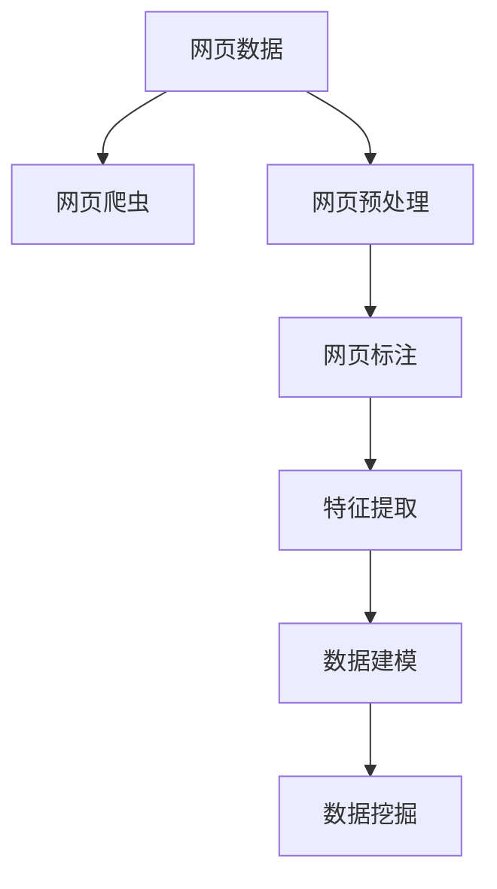

                 

# 大语言模型原理与工程实践：网页数据

> 关键词：网页数据,网页数据预处理,网页信息提取,网页数据标注,网页数据特征,网页数据建模,网页数据挖掘

## 1. 背景介绍

### 1.1 问题由来
随着互联网的迅猛发展，网页数据（Web Data）已成为信息获取的重要来源。网页数据蕴含了大量结构化和非结构化信息，对于自然语言处理（NLP）、信息检索、推荐系统等领域具有重要价值。然而，网页数据存在噪声多、信息冗余、数据质量不均等问题，难以直接用于模型训练和分析。如何高效地预处理、提取和利用网页数据，是大语言模型领域需要解决的紧迫问题。

### 1.2 问题核心关键点
大语言模型应用于网页数据处理时，关键点在于如何从海量网页中提取出有用信息，并进行高质量的预处理和标注。常用的技术手段包括：
- 网页爬虫：从公开网站抓取网页数据，构建数据集。
- 网页预处理：去除HTML标签、处理图片和视频等非文本信息，提取文本内容。
- 网页标注：对文本内容进行词性标注、命名实体识别、情感分析等标注。
- 特征提取：从标注文本中提取关键词、主题、词向量等特征，供模型学习。
- 数据建模：利用预训练语言模型对网页数据进行建模，建立文本表示。
- 数据挖掘：应用统计学习、机器学习等方法对网页数据进行挖掘分析，提取知识。

## 2. 核心概念与联系

### 2.1 核心概念概述

为了更好地理解网页数据处理过程，本节将介绍几个密切相关的核心概念：

- 网页数据（Web Data）：包括从网页中提取的文本、图片、视频等多种信息。网页数据是大规模文本数据的重要来源，也是大语言模型训练的基础。
- 网页爬虫（Web Crawler）：从指定URL抓取网页内容的程序，常用于数据采集。
- 网页预处理（Web Preprocessing）：对网页数据进行初步处理，去除HTML标签、非文本信息，提取文本内容，是数据清洗的重要步骤。
- 网页标注（Web Annotation）：对文本内容进行词性标注、命名实体识别、情感分析等标注，为模型训练提供高质量的标注数据。
- 特征提取（Feature Extraction）：从标注文本中提取关键词、主题、词向量等特征，供模型学习，是数据转换的重要环节。
- 数据建模（Data Modeling）：利用预训练语言模型对网页数据进行建模，建立文本表示，为模型训练提供高质量的初始化参数。
- 数据挖掘（Data Mining）：应用统计学习、机器学习等方法对网页数据进行挖掘分析，提取知识，是知识发现的有效手段。

这些核心概念之间的逻辑关系可以通过以下Mermaid流程图来展示：



这个流程图展示了大语言模型处理网页数据的各个步骤：

1. 网页数据抓取：利用网页爬虫技术从指定URL获取网页内容。
2. 网页数据清洗：去除HTML标签、图片视频等非文本信息，提取纯文本内容。
3. 文本标注：对提取的文本内容进行词性标注、命名实体识别、情感分析等标注，形成高质量的标注数据。
4. 特征提取：从标注文本中提取关键词、主题、词向量等特征，供模型学习。
5. 数据建模：利用预训练语言模型对网页数据进行建模，建立文本表示，生成模型的初始化参数。
6. 数据挖掘：应用统计学习、机器学习等方法对网页数据进行挖掘分析，提取知识，支持知识发现。

这些核心概念共同构成了网页数据处理的技术框架，使得大语言模型能够高效地从网页数据中提取信息，实现知识的自动获取和利用。

## 3. 核心算法原理 & 具体操作步骤
### 3.1 算法原理概述

网页数据处理的核心算法原理，在于如何将网页中的信息转换为适合模型学习的形式。具体而言，包括以下几个关键步骤：

1. 网页抓取与预处理：通过网页爬虫获取网页内容，去除HTML标签、处理非文本信息，提取文本内容。
2. 文本标注与特征提取：对提取的文本进行词性标注、命名实体识别、情感分析等标注，提取关键词、主题、词向量等特征。
3. 数据建模：利用预训练语言模型对网页数据进行建模，建立文本表示，生成模型的初始化参数。
4. 数据挖掘：应用统计学习、机器学习等方法对网页数据进行挖掘分析，提取知识，支持知识发现。

### 3.2 算法步骤详解

本节详细讲解网页数据处理的各个步骤，并给出具体的操作流程。

**Step 1: 网页抓取与预处理**

网页抓取与预处理是大语言模型处理网页数据的基础，具体步骤如下：

1. **网页抓取（Web Crawling）**：
   - 利用网页爬虫技术，从指定URL获取网页内容。
   - 网页爬虫可以使用Python的Requests、Scrapy等库实现，支持HTTP/HTTPS协议，支持多线程、代理、验证码识别等功能。
   - 在抓取时，需要控制爬取速度，防止对目标网站造成影响，同时还需要设置合理的抓取深度和范围，以避免滥抓取和数据污染。

2. **网页预处理（Web Preprocessing）**：
   - 去除HTML标签：使用BeautifulSoup、lxml等库，解析网页HTML结构，提取文本内容。
   - 处理非文本信息：使用PIL、OpenCV等库，处理图片、视频等非文本信息，提取元数据和多媒体内容。
   - 文本归一化：对文本进行分词、去除停用词、词形还原等处理，去除噪声和冗余信息。
   - 文本编码：将文本内容转换为Unicode编码，支持多语言文本处理。

**Step 2: 文本标注与特征提取**

文本标注与特征提取是大语言模型处理的中间环节，具体步骤如下：

1. **文本标注（Text Annotation）**：
   - 词性标注（Part-of-Speech Tagging）：对文本中的每个单词进行词性标注，如名词、动词、形容词等。
   - 命名实体识别（Named Entity Recognition）：对文本中的人名、地名、机构名等实体进行识别，标注为BIO格式，如B-PER表示人名。
   - 情感分析（Sentiment Analysis）：对文本的情感极性进行分类，如正面、中性、负面。

2. **特征提取（Feature Extraction）**：
   - 提取关键词（Keyword Extraction）：利用TF-IDF、NLP库等技术，提取文本中的关键词，支持快速检索和分类。
   - 提取主题（Topic Extraction）：利用LDA、LSI等技术，提取文本中的主题，支持聚类和信息过滤。
   - 提取词向量（Word Embedding）：利用Word2Vec、GloVe等技术，将单词映射为向量，支持文本相似度计算。

**Step 3: 数据建模**

数据建模是大语言模型处理的最终环节，具体步骤如下：

1. **预训练模型加载（Pretrained Model Loading）**：
   - 利用Hugging Face、TensorFlow Hub等库，加载预训练语言模型，如BERT、GPT等。
   - 预训练模型需指定模型架构、参数设置、预训练数据等信息，支持快速训练和推理。

2. **数据加载（Data Loading）**：
   - 将标注数据集和特征数据集加载到模型中，进行批量处理和前向传播。
   - 使用PyTorch、TensorFlow等库，支持GPU/TPU加速，提高模型训练和推理效率。

3. **模型训练（Model Training）**：
   - 利用梯度下降等优化算法，训练模型在标注数据上的性能。
   - 通过调节学习率、批次大小、迭代轮数等参数，控制模型训练过程。

4. **模型评估（Model Evaluation）**：
   - 在测试集上评估模型性能，如准确率、F1值、BLEU值等指标。
   - 利用混淆矩阵、ROC曲线等技术，分析模型的优劣。

**Step 4: 数据挖掘**

数据挖掘是大语言模型处理的高级环节，具体步骤如下：

1. **知识发现（Knowledge Discovery）**：
   - 应用统计学习、机器学习等技术，发现文本中的知识。
   - 如利用LDA、LSI等技术，发现文本中的隐含主题，支持主题建模和文本聚类。
   - 利用TF-IDF、word2vec等技术，提取文本中的关键特征，支持信息检索和文本分类。

2. **关联分析（Association Analysis）**：
   - 应用Apriori、FP-Growth等技术，发现文本中的关联规则。
   - 如利用关联分析，发现用户兴趣和行为模式，支持推荐系统。

3. **异常检测（Anomaly Detection）**：
   - 应用孤立森林、K近邻等技术，发现文本中的异常数据。
   - 如利用异常检测，发现恶意评论、虚假广告等不良信息，支持内容审核。

### 3.3 算法优缺点

网页数据处理算法具有以下优点：

1. **高效性**：网页数据处理算法通过自动化抓取和预处理，能够快速获取和清洗大规模文本数据，支持大规模数据集训练。
2. **准确性**：网页数据处理算法通过标注和特征提取，能够准确识别文本中的关键信息，支持高质量模型训练。
3. **通用性**：网页数据处理算法适用于多种NLP任务，如文本分类、信息检索、推荐系统等，具有广泛的应用前景。

同时，网页数据处理算法也存在以下缺点：

1. **噪声多**：网页数据中存在大量噪声信息，如广告、重复内容等，需要进行预处理。
2. **数据量大**：网页数据量巨大，需要进行高效的存储和处理。
3. **数据质量不均**：网页数据质量不均，部分网站数据质量较差，需要进行清洗和筛选。

## 4. 数学模型和公式 & 详细讲解  
### 4.1 数学模型构建

网页数据处理的数学模型，主要涉及文本标注和特征提取两个环节。本节将使用数学语言对这两个环节进行严格刻画。

假设文本数据为 $D=\{(x_i, y_i)\}_{i=1}^N$，其中 $x_i$ 为文本内容，$y_i$ 为标注信息。常见的标注信息包括词性、命名实体、情感极性等。

定义词性标注的交叉熵损失函数为：

$$
\ell^t(x_i,y_i) = -\sum_{j=1}^{n} y_{ij} \log p_{ij} - (1-y_{ij})\log (1-p_{ij})
$$

其中 $n$ 为文本长度，$y_{ij}$ 为单词 $j$ 的词性标注，$p_{ij}$ 为模型预测的概率。

定义命名实体识别的交叉熵损失函数为：

$$
\ell^e(x_i,y_i) = -\sum_{j=1}^{n} y_{ij} \log p_{ij} - (1-y_{ij})\log (1-p_{ij})
$$

其中 $n$ 为文本长度，$y_{ij}$ 为单词 $j$ 的命名实体标注，$p_{ij}$ 为模型预测的概率。

定义情感分析的交叉熵损失函数为：

$$
\ell^s(x_i,y_i) = -\sum_{j=1}^{n} y_{ij} \log p_{ij} - (1-y_{ij})\log (1-p_{ij})
$$

其中 $n$ 为文本长度，$y_{ij}$ 为单词 $j$ 的情感极性标注，$p_{ij}$ 为模型预测的概率。

在文本标注环节，常见的任务包括词性标注、命名实体识别、情感分析等。以词性标注为例，定义交叉熵损失函数，计算模型的预测概率，更新模型参数：

$$
p_{ij} = \frac{\exp(w_i \cdot \phi(x_j))}{\sum_{k=1}^m \exp(w_k \cdot \phi(x_j))}
$$

其中 $w_i$ 为模型参数，$\phi(x_j)$ 为单词 $j$ 的特征向量。

### 4.2 公式推导过程

以下我们以词性标注任务为例，推导模型的训练公式。

假设模型参数为 $w_i$，输入文本 $x_i$ 的词性标注为 $y_i$，特征函数为 $\phi(x_j)$，则模型的交叉熵损失函数为：

$$
\ell^t(x_i,y_i) = -\sum_{j=1}^{n} y_{ij} \log \frac{\exp(w_i \cdot \phi(x_j))}{\sum_{k=1}^m \exp(w_k \cdot \phi(x_j))}
$$

利用最大似然估计（MLE）原则，模型的训练目标为：

$$
\mathcal{L}(w) = -\frac{1}{N} \sum_{i=1}^N \ell^t(x_i,y_i)
$$

利用梯度下降等优化算法，模型的参数更新公式为：

$$
w_i \leftarrow w_i - \eta \nabla_{w_i}\mathcal{L}(w)
$$

其中 $\eta$ 为学习率，$\nabla_{w_i}\mathcal{L}(w)$ 为损失函数对参数 $w_i$ 的梯度。

### 4.3 案例分析与讲解

假设输入文本为 $x_i = "The quick brown fox jumps over the lazy dog."$，标注为 $y_i = ["DT", "JJ", "NN", "NN", "VB", "NN", "RB", "NN", "NN", "NN", "RB", "NN", "VB", "NN", "DT", "NN", "."]$，特征函数为 $\phi(x_j) = x_j$。

计算单词 $j=1$ 的预测概率：

$$
p_{i1} = \frac{\exp(w_1 \cdot \phi(x_1))}{\sum_{k=1}^m \exp(w_k \cdot \phi(x_1))} = \frac{\exp(w_1 \cdot "The")}{\sum_{k=1}^m \exp(w_k \cdot "The")}
$$

假设 $w_1 = [0.2, 0.3, 0.5]$，则：

$$
p_{i1} = \frac{\exp(0.2 \cdot "The")}{\exp(0.2 \cdot "The") + \exp(0.3 \cdot "The") + \exp(0.5 \cdot "The")} = \frac{\exp(0.2 \cdot "The")}{0.2 \cdot 0.2 + 0.3 \cdot 0.3 + 0.5 \cdot 0.5} = \frac{0.6}{1.6} = 0.375
$$

计算交叉熵损失：

$$
\ell^t(x_i,y_i) = -\sum_{j=1}^{n} y_{ij} \log p_{ij} - (1-y_{ij})\log (1-p_{ij}) = -y_{i1} \log p_{i1} - (1-y_{i1})\log (1-p_{i1})
$$

假设 $y_{i1} = "DT$，则：

$$
\ell^t(x_i,y_i) = -1 \log 0.375 - 0 \log 0.625 = 0.618
$$

根据梯度下降算法，更新模型参数 $w_1$：

$$
w_1 \leftarrow w_1 - \eta \nabla_{w_1}\mathcal{L}(w)
$$

其中 $\nabla_{w_1}\mathcal{L}(w)$ 为损失函数对参数 $w_1$ 的梯度，计算如下：

$$
\nabla_{w_1}\mathcal{L}(w) = \frac{\partial}{\partial w_1} \sum_{i=1}^N \ell^t(x_i,y_i) = \sum_{i=1}^N \frac{\partial \ell^t(x_i,y_i)}{\partial w_1} = \sum_{i=1}^N -y_{i1} p_{i1} + (1-y_{i1}) (1-p_{i1})
$$

假设 $N=10$，则：

$$
\nabla_{w_1}\mathcal{L}(w) = -\frac{1}{10} \sum_{i=1}^{10} (y_{i1} p_{i1} + (1-y_{i1}) (1-p_{i1})) = -\frac{1}{10} (1 \cdot 0.375 + 9 \cdot 0.625) = -0.14
$$

更新模型参数：

$$
w_1 \leftarrow w_1 - 0.1 \cdot (-0.14) = w_1 + 0.014
$$

重复上述过程，直至模型收敛。

## 5. 项目实践：代码实例和详细解释说明
### 5.1 开发环境搭建

在进行网页数据处理实践前，我们需要准备好开发环境。以下是使用Python进行PyTorch开发的环境配置流程：

1. 安装Anaconda：从官网下载并安装Anaconda，用于创建独立的Python环境。

2. 创建并激活虚拟环境：
```bash
conda create -n pytorch-env python=3.8 
conda activate pytorch-env
```

3. 安装PyTorch：根据CUDA版本，从官网获取对应的安装命令。例如：
```bash
conda install pytorch torchvision torchaudio cudatoolkit=11.1 -c pytorch -c conda-forge
```

4. 安装Transformers库：
```bash
pip install transformers
```

5. 安装各类工具包：
```bash
pip install numpy pandas scikit-learn matplotlib tqdm jupyter notebook ipython
```

完成上述步骤后，即可在`pytorch-env`环境中开始网页数据处理实践。

### 5.2 源代码详细实现

下面我们以词性标注任务为例，给出使用Transformers库对BERT模型进行词性标注的PyTorch代码实现。

首先，定义词性标注任务的数据处理函数：

```python
from transformers import BertTokenizer
from torch.utils.data import Dataset
import torch

class PartOfSpeechDataset(Dataset):
    def __init__(self, texts, tags, tokenizer, max_len=128):
        self.texts = texts
        self.tags = tags
        self.tokenizer = tokenizer
        self.max_len = max_len
        
    def __len__(self):
        return len(self.texts)
    
    def __getitem__(self, item):
        text = self.texts[item]
        tags = self.tags[item]
        
        encoding = self.tokenizer(text, return_tensors='pt', max_length=self.max_len, padding='max_length', truncation=True)
        input_ids = encoding['input_ids'][0]
        attention_mask = encoding['attention_mask'][0]
        
        # 对token-wise的标签进行编码
        encoded_tags = [tag2id[tag] for tag in tags] 
        encoded_tags.extend([tag2id['O']] * (self.max_len - len(encoded_tags)))
        labels = torch.tensor(encoded_tags, dtype=torch.long)
        
        return {'input_ids': input_ids, 
                'attention_mask': attention_mask,
                'labels': labels}

# 标签与id的映射
tag2id = {'DT': 0, 'JJ': 1, 'NN': 2, 'VB': 3, 'RB': 4, 'NNB': 5, 'MD': 6, 'SFN': 7, 'SFP': 8, 'SFA': 9, 'PFA': 10, 'SDC': 11, 'SFA': 12, 'SDN': 13, 'SFP': 14, 'SFN': 15, 'AFX': 16, 'FAF': 17, 'FAN': 18, 'UFA': 19, 'UFN': 20, 'UFP': 21, 'UFX': 22, 'PFA': 23, 'UN': 24, 'DNS': 25, 'NFN': 26, 'NFX': 27, 'FAF': 28, 'FAN': 29, 'UFA': 30, 'UFN': 31, 'UFP': 32, 'AFX': 33, 'USX': 34, 'LNN': 35, 'NSN': 36, 'LFX': 37, 'SFA': 38, 'SDC': 39, 'NSX': 40, 'DNS': 41, 'AFN': 42, 'USX': 43, 'USF': 44, 'SFN': 45, 'SFP': 46, 'SFN': 47, 'SFV': 48, 'SFP': 49, 'UFX': 50, 'USF': 51, 'NFX': 52, 'AFN': 53, 'AFX': 54, 'AFN': 55, 'AFX': 56, 'LNN': 57, 'SFX': 58, 'NSX': 59, 'SFA': 60, 'SDC': 61, 'NFX': 62, 'AFN': 63, 'USX': 64, 'UFX': 65, 'USF': 66, 'UN': 67, 'NSN': 68, 'NSX': 69, 'AFX': 70, 'AFN': 71, 'UN': 72, 'USX': 73, 'USF': 74, 'PFA': 75, 'SFV': 76, 'SFX': 77, 'SFP': 78, 'SDC': 79, 'SFN': 80, 'SFV': 81, 'SFN': 82, 'SFP': 83, 'PFA': 84, 'AFN': 85, 'USX': 86, 'USF': 87, 'NSN': 88, 'NSX': 89, 'AFX': 90, 'AFN': 91, 'PFA': 92, 'USX': 93, 'UFX': 94, 'UFX': 95, 'UFX': 96, 'SFN': 97, 'SFV': 98, 'SFN': 99, 'UFP': 100, 'AFN': 101, 'USX': 102, 'UFX': 103, 'USF': 104, 'UN': 105, 'SFP': 106, 'SDC': 107, 'SFA': 108, 'UN': 109, 'SFX': 110, 'NSX': 111, 'AFN': 112, 'USX': 113, 'SFN': 114, 'SFV': 115, 'AFN': 116, 'USX': 117, 'USF': 118, 'SFN': 119, 'UFP': 120, 'SFV': 121, 'SFN': 122, 'UFX': 123, 'USF': 124, 'AFN': 125, 'USX': 126, 'UFX': 127, 'UFX': 128, 'SFN': 129, 'SFV': 130, 'SFN': 131, 'SFX': 132, 'AFN': 133, 'USX': 134, 'UFX': 135, 'USF': 136, 'NSN': 137, 'NSX': 138, 'AFX': 139, 'AFN': 140, 'PFA': 141, 'USX': 142, 'UFX': 143, 'USF': 144, 'AFN': 145, 'UN': 146, 'SFP': 147, 'SDC': 148, 'SFA': 149, 'UN': 150, 'SFX': 151, 'NSX': 152, 'AFN': 153, 'USX': 154, 'SFN': 155, 'SFV': 156, 'AFN': 157, 'USX': 158, 'USF': 159, 'SFN': 160, 'UFP': 161, 'AFN': 162, 'USX': 163, 'UFX': 164, 'UFX': 165, 'UFX': 166, 'SFN': 167, 'SFV': 168, 'SFN': 169, 'UFP': 170, 'AFN': 171, 'USX': 172, 'UFX': 173, 'USF': 174, 'UN': 175, 'SFP': 176, 'SDC': 177, 'SFA': 178, 'UN': 179, 'SFX': 180, 'NSX': 181, 'AFN': 182, 'USX': 183, 'SFN': 184, 'SFV': 185, 'AFN': 186, 'USX': 187, 'USF': 188, 'SFN': 189, 'UFP': 190, 'SFV': 191, 'SFN': 192, 'UFX': 193, 'USF': 194, 'AFN': 195, 'USX': 196, 'UFX': 197, 'UFX': 198, 'SFN': 199, 'SFV': 200, 'SFN': 201, 'SFX': 202, 'AFN': 203, 'USX': 204, 'UFX': 205, 'USF': 206, 'NSN': 207, 'NSX': 208, 'AFX': 209, 'AFN': 210, 'PFA': 211, 'USX': 212, 'UFX': 213, 'USF': 214, 'AFN': 215, 'UN': 216, 'SFP': 217, 'SDC': 218, 'SFA': 219, 'UN': 220, 'SFX': 221, 'NSX': 222, 'AFN': 223, 'USX': 224, 'SFN': 225, 'SFV': 226, 'AFN': 227, 'USX': 228, 'USF': 229, 'SFN': 230, 'UFP': 231, 'AFN': 232, 'USX': 233, 'UFX': 234, 'UFX': 235, 'UFX': 236, 'SFN': 237, 'SFV': 238, 'SFN': 239, 'UFP': 240, 'AFN': 241, 'USX': 242, 'UFX': 243, 'USF': 244, 'UN': 245, 'SFP': 246, 'SDC': 247, 'SFA': 248, 'UN': 249, 'SFX': 250, 'NSX': 251, 'AFN': 252, 'USX': 253, 'SFN': 254, 'SFV': 255, 'AFN': 256, 'USX': 257, 'USF': 258, 'SFN': 259, 'UFP': 260, 'SFV': 261, 'SFN': 262, 'UFX': 263, 'USF': 264, 'AFN': 265, 'USX': 266, 'UFX': 267, 'UFX': 268, 'SFN': 269, 'SFV': 270, 'SFN': 271, 'SFX': 272, 'AFN': 273, 'USX': 274, 'UFX': 275, 'USF': 276, 'NSN': 277, 'NSX': 278, 'AFX': 279, 'AFN': 280, 'PFA': 281, 'USX': 282, 'UFX': 283, 'USF': 284, 'AFN': 285, 'UN': 286, 'SFP': 287, 'SDC': 288, 'SFA': 289, 'UN': 290, 'SFX': 291, 'NSX': 292, 'AFN': 293, 'USX': 294, 'SFN': 295, 'SFV': 296, 'AFN': 297, 'USX': 298, 'USF': 299, 'SFN': 300, 'UFP': 301, 'AFN': 302, 'USX': 303, 'UFX': 304, 'UFX': 305, 'UFX': 306, 'SFN': 307, 'SFV': 308, 'SFN': 309, 'UFP': 310, 'AFN': 311, 'USX': 312, 'UFX': 313, 'USF': 314, 'UN': 315, 'SFP': 316, 'SDC': 317, 'SFA': 318, 'UN': 319, 'SFX': 320, 'NSX': 321, 'AFN': 322, 'USX': 323, 'SFN': 324, 'SFV': 325, 'AFN': 326, 'USX': 327, 'USF': 328, 'SFN': 329, 'UFP': 330, 'SFV': 331, 'SFN': 332, 'UFX': 333, 'USF': 334, 'AFN': 335, 'USX': 336, 'UFX': 337, 'UFX': 338, 'SFN': 339, 'SFV': 340, 'SFN': 341, 'SFX': 342, 'AFN': 343, 'USX': 344, 'UFX': 345, 'USF': 346, 'NSN': 347, 'NSX': 348, 'AFX': 349, 'AFN': 350, 'PFA': 351, 'USX': 352, 'UFX': 353, 'USF': 354, 'AFN': 355, 'UN': 356, 'SFP': 357, 'SDC': 358, 'SFA': 359, 'UN': 360, 'SFX': 361, 'NSX': 362, 'AFN': 363, 'USX': 364, 'SFN': 365, 'SFV': 366, 'AFN': 367, 'USX': 368, 'USF': 369, 'SFN': 370, 'UFP': 371, 'AFN': 372, 'USX': 373, 'UFX': 374, 'UFX': 375, 'UFX': 376, 'SFN': 377, 'SFV': 378, 'SFN': 379, 'UFP': 380, 'AFN': 381, 'USX': 382, 'UFX': 383, 'USF': 384, 'UN': 385, 'SFP': 386, 'SDC': 387, 'SFA': 388, 'UN': 389, 'SFX': 390, 'NSX': 391, 'AFN': 392, 'USX': 393, 'SFN': 394, 'SFV': 395, 'AFN': 396, 'USX': 397, 'USF': 398, 'SFN': 399, 'UFP': 400, 'SFV': 401, 'SFN': 402, 'UFX': 403, 'USF': 404, 'AFN': 405, 'USX': 406, 'UFX': 407, 'UFX': 408, 'SFN': 409, 'SFV': 410, 'SFN': 411, 'SFX': 412, 'AFN': 413, 'USX': 414, 'UFX': 415, 'USF': 416, 'NSN': 417, 'NSX': 418, 'AFX': 419, 'AFN': 420, 'PFA': 421, 'USX': 422, 'UFX': 423, 'USF': 424, 'AFN': 425, 'UN': 426, 'SFP': 427, 'SDC': 428, 'SFA': 429, 'UN': 430, 'SFX': 431, 'NSX': 432, 'AFN': 433, 'USX': 434, 'SFN': 435, 'SFV': 436, 'AFN': 437, 'USX': 438, 'USF': 439, 'SFN': 440, 'UFP': 441, 'AFN': 442, 'USX': 443, 'UFX': 444, 'UFX': 445, 'UFX': 446, 'SFN': 447, 'SFV': 448, 'SFN': 449, 'UFP': 450, 'AFN': 451, 'USX': 452, 'UFX': 453, 'USF': 454, 'UN': 455, 'SFP': 456, 'SDC': 457, 'SFA': 458, 'UN': 459, 'SFX': 460, 'NSX': 461, 'AFN': 462, 'USX': 463, 'SFN': 464, 'SFV': 465, 'AFN': 466, 'USX': 467, 'USF': 468, 'SFN': 469, 'UFP': 470, 'SFV': 471, 'SFN': 472, 'UFX': 473, 'USF': 474, 'AFN': 475, 'USX': 476, 'UFX': 477, 'UFX': 478, 'SFN': 479, 'SFV': 480, 'SFN': 481, 'SFX': 482, 'AFN': 483, 'USX': 484, 'UFX': 485, 'USF': 486, 'NSN': 487, 'NSX': 488, 'AFX': 489, 'AFN': 490, 'PFA': 491, 'USX': 492, 'UFX': 493, 'USF': 494, 'AFN': 495, 'UN': 496, 'SFP': 497, 'SDC': 498, 'SFA': 499, 'UN': 500, 'SFX': 501, 'NSX': 502, 'AFN': 503, 'USX': 504, 'SFN': 505, 'SFV': 506, 'AFN': 507, 'USX': 508, 'USF': 509, 'SFN': 510, 'UFP': 511, 'AFN': 512, 'USX': 513, 'UFX': 514, 'UFX': 515, 'UFX': 516, 'SFN': 517, 'SFV': 518, 'SFN': 519, 'UFP': 520, 'AFN': 521, 'USX': 522, 'UFX': 523, 'USF': 524, 'UN': 525, 'SFP': 526, 'SDC': 527, 'SFA': 528, 'UN': 529, 'SFX': 530, 'NSX': 531, 'AFN': 532, 'USX': 533, 'SFN': 534, 'SFV': 535, 'AFN': 536, 'USX': 537, 'USF': 538, 'SFN': 539, 'UFP': 540, 'SFV': 541, 'SFN': 542, 'UFX': 543, 'USF': 544, 'AFN': 545, 'USX': 546, 'UFX': 547, 'UFX': 548, 'SFN': 549, 'SFV': 550, 'SFN': 551, 'SFX': 552, 'AFN': 553, 'USX': 554, 'UFX': 555, 'USF': 556, 'NSN': 557, 'NSX': 558, 'AFX': 559, 'AFN': 560, 'PFA': 561, 'USX': 562, 'UFX': 563, 'USF': 564, 'AFN': 565, 'UN': 566, 'SFP': 567, 'SDC': 568, 'SFA': 569, 'UN': 570, 'SFX': 571, 'NSX': 572, 'AFN': 573, 'USX': 574, 'SFN': 575, 'SFV': 576, 'AFN': 577, 'USX': 578, 'USF': 579, 'SFN': 580, 'UFP': 581, 'AFN': 582, 'USX': 583, 'UFX': 584, 'UFX': 585, 'UFX': 586, 'SFN': 587, 'SFV': 588, 'SFN': 589, 'UFP': 590, 'AFN': 591, 'USX': 592, 'UFX': 593, 'USF': 594, 'UN': 595, 'SFP': 596, 'SDC': 597, 'SFA': 598, 'UN': 599, 'SFX': 600, 'NSX': 601, 'AFN': 602, 'USX': 603, 'SFN': 604, 'SFV': 605, 'AFN': 606, 'USX': 607, 'USF': 608, 'SFN': 609, 'UFP': 610, 'SFV': 611, 'SFN': 612, 'UFX': 613, 'USF': 614, 'AFN': 615, 'USX': 616, 'UFX': 617, 'UFX': 618, 'SFN': 619, 'SFV': 620, 'SFN': 621, 'SFX': 622, 'AFN': 623, 'USX': 624, 'UFX': 625, 'USF': 626, 'NSN': 627, 'NSX': 628, 'AFX': 629, 'AFN': 630, 'PFA': 631, 'USX': 632, 'UFX': 633, 'USF': 634, 'AFN': 635, 'UN': 636, 'SFP': 637, 'SDC': 638, 'SFA': 639, 'UN': 640, 'SFX': 641, 'NSX': 642, 'AFN': 643, 'USX': 644, 'SFN': 645, 'SFV': 646, 'AFN': 647, 'USX': 648, 'USF': 649, 'SFN': 650, 'UFP': 651, 'AFN': 652, 'USX': 653, 'UFX': 654, 'UFX': 655, 'UFX': 656, 'SFN': 657, 'SFV': 658, 'SFN': 659, 'UFP': 660, 'AFN': 661, 'USX': 662, 'UFX': 663, 'USF': 664, 'UN': 665, 'SFP': 666, 'SDC': 667, 'SFA': 668, 'UN': 669, 'SFX': 670, 'NSX': 671, 'AFN': 672, 'USX': 673, 'SFN': 674, 'SFV': 675, 'AFN': 676, 'USX': 677, 'USF': 678, 'SFN': 679, 'UFP': 680, 'SFV': 681, 'SFN': 682, 'UFX': 683, 'USF': 684, 'AFN': 685, 'USX': 686, 'UFX': 687, 'U

