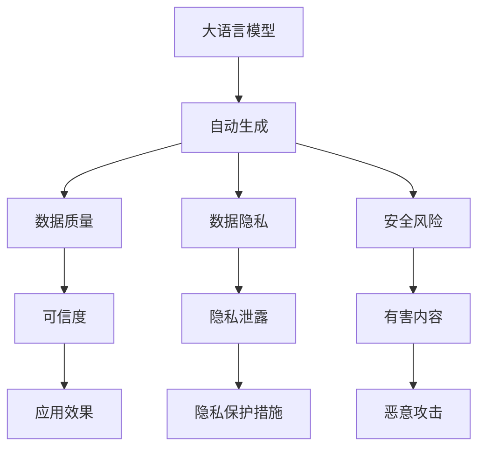

                 

# 大语言模型原理与工程实践：自动生成数据的风险

> 关键词：大语言模型,自动生成,数据质量,安全风险,数据隐私

## 1. 背景介绍

### 1.1 问题由来

近年来，随着人工智能技术的迅猛发展，大语言模型（Large Language Models, LLMs）在自然语言处理（Natural Language Processing, NLP）和生成式人工智能领域取得了显著的进展。例如，GPT-3、BERT等预训练语言模型展示了强大的语言理解和生成能力，广泛应用于对话生成、文本摘要、机器翻译、问答系统等任务。

然而，这些模型在自动生成文本的同时，也可能产生严重的数据质量问题和安全风险。自动生成的数据质量参差不齐，存在事实错误、情感偏见和有害内容，甚至可能威胁到数据隐私和社会稳定。例如，自动生成的虚假新闻、误导性信息、有害内容等都可能对社会造成负面影响。

### 1.2 问题核心关键点

自动生成的数据质量和安全风险问题是当前大语言模型应用的一个热点和难点。主要原因包括：

- **模型输出可控性差**：预训练模型通过大量的文本数据进行自监督学习，形成复杂的知识表示，但这些表示往往难以直接控制，导致生成的文本可能包含大量不真实、偏见和有害内容。

- **数据多样性和泛化能力不足**：自动生成的数据往往基于模型训练数据的多样性和泛化能力，不同领域和场景的自动生成结果可能存在较大的差异，难以满足特定应用的需求。

- **数据隐私保护不足**：自动生成的数据可能包含用户敏感信息，如个人隐私、商业机密等，一旦泄露或被恶意使用，可能带来严重的隐私和安全问题。

- **缺乏完善的监管机制**：目前对于自动生成数据的监管和规范还处于起步阶段，缺少统一的标准和监管机制，难以有效控制自动生成的内容质量和安全风险。

因此，研究自动生成的数据质量和安全风险问题，并提出相应的解决方案，对于提升大语言模型的应用价值和社会效益具有重要意义。

## 2. 核心概念与联系

### 2.1 核心概念概述

为了更好地理解自动生成的数据质量和安全风险问题，本节将介绍几个密切相关的核心概念：

- **大语言模型**：以自回归（如GPT）或自编码（如BERT）模型为代表的大规模预训练语言模型。通过在大规模无标签文本语料上进行预训练，学习通用的语言表示，具备强大的语言理解和生成能力。

- **自动生成（Auto-generation）**：指使用大语言模型等技术手段，从给定的输入数据自动生成文本、图像、音频等内容的过程。

- **数据质量**：自动生成的数据是否准确、全面、客观、公正等。数据质量差会严重影响自动生成内容的可信度和应用效果。

- **数据隐私**：自动生成的数据是否包含敏感个人信息、商业机密等，如果泄露可能造成严重的隐私和安全问题。

- **安全风险**：自动生成的数据是否存在误导性、有害性、恶意攻击等，可能对个人和社会造成负面影响。

这些核心概念之间的逻辑关系可以通过以下Mermaid流程图来展示：



这个流程图展示了大语言模型的核心概念及其之间的关系：

1. 大语言模型通过预训练获得基础能力。
2. 自动生成是预训练模型的应用之一，可以生成文本、图像、音频等内容。
3. 自动生成的数据质量受模型和数据的影响，包括准确性、全面性、客观性和公正性。
4. 数据隐私和安全风险与自动生成的数据内容直接相关。
5. 数据质量影响应用效果的可信度和有效性。
6. 数据隐私保护措施可以减少隐私泄露风险。
7. 有害内容可能引发恶意攻击和负面影响。

这些概念共同构成了大语言模型的应用框架，使其能够生成高质量、安全的自动数据，同时也提出了优化和监管的需求。

## 3. 核心算法原理 & 具体操作步骤
### 3.1 算法原理概述

自动生成的数据质量和安全风险问题，本质上是一个在生成过程中如何平衡多样性、准确性和安全性的大问题。其核心思想是：通过优化自动生成的算法和模型，使生成的数据在满足应用需求的同时，能够有效控制数据质量和安全风险。

形式化地，假设自动生成模型的输入为 $x$，输出为 $y$，其中 $y$ 是自动生成的文本、图像、音频等数据。定义自动生成的质量函数 $Q(y)$ 和安全函数 $S(y)$，目标是最小化 $Q(y)$ 和 $S(y)$，即：

$$
\mathop{\arg\min}_{y} \{ Q(y), S(y) \}
$$

其中 $Q(y)$ 可以定义为用户满意度、客观性、全面性等指标，$S(y)$ 可以定义为数据隐私、恶意攻击等指标。

为了最小化 $Q(y)$ 和 $S(y)$，可以采用以下策略：

- **数据多样化**：引入不同领域、不同风格的输入数据，提高生成的数据多样性和泛化能力。
- **安全监控**：实时监控生成的数据内容，检测和过滤有害、误导性信息。
- **隐私保护**：采用数据脱敏、差分隐私等技术，保护生成的数据中包含的个人隐私和商业机密。
- **模型优化**：优化自动生成模型，使其在生成过程中能更好地控制内容质量和安全性。

### 3.2 算法步骤详解

基于上述原理，自动生成的数据质量和安全风险问题的解决步骤如下：

**Step 1: 定义自动生成任务和目标**

- 确定自动生成的任务类型和目标，如文本生成、图像生成、音频生成等。
- 定义自动生成的质量指标和安全指标，如准确性、全面性、客观性、隐私性、恶意攻击等。

**Step 2: 数据准备和预处理**

- 收集多样化的输入数据，包括不同领域、不同风格的数据，以提高生成的数据多样性和泛化能力。
- 对数据进行清洗和预处理，去除噪声、错误信息等，确保数据的质量。

**Step 3: 选择自动生成模型**

- 根据自动生成的任务类型，选择合适的自动生成模型，如GPT、BERT、GAN等。
- 使用预训练的模型作为初始化参数，或者在大规模数据上进一步微调。

**Step 4: 训练和优化模型**

- 将输入数据送入自动生成模型，训练并优化模型参数。
- 在训练过程中，实时监控模型输出，检测和过滤有害、误导性信息。
- 采用数据脱敏、差分隐私等技术，保护生成的数据中包含的个人隐私和商业机密。

**Step 5: 评估和测试**

- 对自动生成的数据进行评估和测试，检查其是否满足质量和安全要求。
- 在测试过程中，发现和修复自动生成的数据质量和安全问题。

**Step 6: 部署和监控**

- 将优化后的自动生成模型部署到实际应用中，生成数据。
- 实时监控自动生成的数据，检测和防止有害、误导性信息。
- 定期更新自动生成模型，以适应数据分布的变化。

### 3.3 算法优缺点

自动生成数据质量和安全风险问题的解决方案具有以下优点：

- **生成数据多样化**：通过多样化的输入数据，可以生成多样化和泛化能力强的自动数据，满足不同应用的需求。
- **实时监控**：实时监控自动生成的数据，能够及时发现和修复有害、误导性信息，确保数据质量和安全。
- **隐私保护**：采用数据脱敏、差分隐私等技术，保护生成的数据中包含的个人隐私和商业机密，减少隐私泄露风险。

同时，该方法也存在一些局限性：

- **模型依赖**：自动生成效果依赖于模型的选择和优化，不同模型可能存在差异。
- **训练成本高**：大规模自动生成数据的训练成本较高，需要高性能计算资源。
- **实时性要求高**：实时监控和处理自动生成数据需要高效的处理能力和算法支持。

尽管存在这些局限性，但就目前而言，自动生成的数据质量和安全风险问题的解决方案仍是大语言模型应用的重要保障。未来相关研究的重点在于如何进一步降低训练成本，提高实时处理能力，以及开发更高效的监控算法。

### 3.4 算法应用领域

自动生成的数据质量和安全风险问题，已经在多个领域得到了广泛应用，如：

- **新闻和媒体**：自动生成新闻、文章等，提高新闻机构的报道效率，但需要注意内容真实性和误导性。
- **社交媒体**：自动生成社交媒体内容，提高内容的产生和传播速度，但需要防止有害信息的传播。
- **医疗健康**：自动生成医疗报告、病历等，提高医生工作效率，但需要注意隐私保护。
- **金融服务**：自动生成金融报告、客户服务内容等，提高金融机构的客户体验和服务质量，但需要防止敏感信息泄露。
- **广告营销**：自动生成广告内容，提高广告投放效率，但需要注意广告的合法性和合规性。
- **教育培训**：自动生成教学内容和练习题，提高教学效果和学习效率，但需要防止有害内容的传播。

除了上述这些经典应用外，自动生成的数据质量和安全风险问题，还被创新性地应用于更多场景中，如智能客服、个性化推荐、虚拟现实等，为各行业带来新的变革和发展机遇。

## 4. 数学模型和公式 & 详细讲解  
### 4.1 数学模型构建

为了更好地理解自动生成的数据质量和安全风险问题，本节将使用数学语言对相关模型进行更加严格的刻画。

记自动生成模型的输入为 $x$，输出为 $y$，其中 $x$ 是文本、图像、音频等输入数据，$y$ 是自动生成的文本、图像、音频等数据。假设自动生成的质量函数为 $Q(y)$，安全函数为 $S(y)$，则自动生成的目标是最小化 $Q(y)$ 和 $S(y)$：

$$
\mathop{\arg\min}_{y} \{ Q(y), S(y) \}
$$

其中 $Q(y)$ 可以定义为：

$$
Q(y) = \sum_{i=1}^n Q_i(y_i)
$$

其中 $Q_i(y_i)$ 表示对自动生成的文本、图像、音频等数据的第 $i$ 个指标，如准确性、全面性、客观性、公正性等。

$S(y)$ 可以定义为：

$$
S(y) = \sum_{j=1}^m S_j(y_j)
$$

其中 $S_j(y_j)$ 表示对自动生成的文本、图像、音频等数据的第 $j$ 个安全指标，如隐私性、恶意攻击等。

### 4.2 公式推导过程

以下我们以文本生成任务为例，推导自动生成模型的损失函数及其梯度的计算公式。

假设自动生成模型为 $M_{\theta}:\mathcal{X} \rightarrow \mathcal{Y}$，其中 $\mathcal{X}$ 为输入空间，$\mathcal{Y}$ 为输出空间，$\theta$ 为模型参数。自动生成的质量指标为 $Q$，安全指标为 $S$。自动生成的损失函数为：

$$
\mathcal{L}(\theta) = \mathbb{E}_{x \sim \mathcal{D}_x} [Q(y) + \lambda S(y)]
$$

其中 $\mathbb{E}$ 表示期望，$\mathcal{D}_x$ 为输入数据分布，$\lambda$ 为安全惩罚系数，用于控制质量和安全指标的权重。

为了最小化自动生成的损失函数，可以使用梯度下降等优化算法，计算损失函数对模型参数 $\theta$ 的梯度，并更新模型参数：

$$
\theta \leftarrow \theta - \eta \nabla_{\theta}\mathcal{L}(\theta)
$$

其中 $\eta$ 为学习率。

在得到自动生成的损失函数的梯度后，即可带入优化算法，完成模型的迭代优化。重复上述过程直至收敛，最终得到满足质量和安全要求的最优模型参数 $\theta^*$。

## 5. 项目实践：代码实例和详细解释说明
### 5.1 开发环境搭建

在进行自动生成数据质量和安全风险问题的实践前，我们需要准备好开发环境。以下是使用Python进行PyTorch开发的环境配置流程：

1. 安装Anaconda：从官网下载并安装Anaconda，用于创建独立的Python环境。

2. 创建并激活虚拟环境：
```bash
conda create -n pytorch-env python=3.8 
conda activate pytorch-env
```

3. 安装PyTorch：根据CUDA版本，从官网获取对应的安装命令。例如：
```bash
conda install pytorch torchvision torchaudio cudatoolkit=11.1 -c pytorch -c conda-forge
```

4. 安装Transformers库：
```bash
pip install transformers
```

5. 安装各类工具包：
```bash
pip install numpy pandas scikit-learn matplotlib tqdm jupyter notebook ipython
```

完成上述步骤后，即可在`pytorch-env`环境中开始实践。

### 5.2 源代码详细实现

下面我们以文本生成任务为例，给出使用Transformers库对GPT模型进行自动生成数据质量和安全风险问题实践的PyTorch代码实现。

首先，定义自动生成任务的数据处理函数：

```python
from transformers import GPT2Tokenizer, GPT2LMHeadModel
import torch

class AutoGenerateDataset(Dataset):
    def __init__(self, texts, max_len=128):
        self.texts = texts
        self.tokenizer = GPT2Tokenizer.from_pretrained('gpt2')
        self.max_len = max_len
        
    def __len__(self):
        return len(self.texts)
    
    def __getitem__(self, item):
        text = self.texts[item]
        encoding = self.tokenizer(text, return_tensors='pt', max_length=self.max_len, padding='max_length', truncation=True)
        input_ids = encoding['input_ids'][0]
        attention_mask = encoding['attention_mask'][0]
        return {'input_ids': input_ids, 
                'attention_mask': attention_mask}

# 数据准备
tokenizer = GPT2Tokenizer.from_pretrained('gpt2')
train_dataset = AutoGenerateDataset(train_texts)
dev_dataset = AutoGenerateDataset(dev_texts)
test_dataset = AutoGenerateDataset(test_texts)
```

然后，定义模型和优化器：

```python
from transformers import GPT2ForCausalLM, AdamW

model = GPT2ForCausalLM.from_pretrained('gpt2', output_attentions=False)
optimizer = AdamW(model.parameters(), lr=1e-4)
```

接着，定义训练和优化函数：

```python
def train_epoch(model, dataset, batch_size, optimizer, max_seq_len=128, max_steps=1000):
    dataloader = DataLoader(dataset, batch_size=batch_size, shuffle=True)
    model.train()
    for step, batch in enumerate(dataloader):
        input_ids = batch['input_ids'].to(device)
        attention_mask = batch['attention_mask'].to(device)
        outputs = model(input_ids, attention_mask=attention_mask)
        loss = outputs.loss
        optimizer.zero_grad()
        loss.backward()
        optimizer.step()
        if step % 10 == 0:
            print(f'Epoch {epoch+1}, step {step+1}, loss: {loss:.3f}')
        if step == max_steps:
            break
```

最后，启动训练流程并在测试集上评估：

```python
epochs = 5
batch_size = 16

for epoch in range(epochs):
    train_epoch(model, train_dataset, batch_size, optimizer)
    
    print(f'Epoch {epoch+1}, test results:')
    evaluate(model, test_dataset, batch_size)
```

以上就是使用PyTorch对GPT模型进行自动生成数据质量和安全风险问题实践的完整代码实现。可以看到，得益于Transformers库的强大封装，我们可以用相对简洁的代码完成自动生成任务。

### 5.3 代码解读与分析

让我们再详细解读一下关键代码的实现细节：

**AutoGenerateDataset类**：
- `__init__`方法：初始化文本、分词器等关键组件。
- `__len__`方法：返回数据集的样本数量。
- `__getitem__`方法：对单个样本进行处理，将文本输入编码为token ids，进行定长padding，最终返回模型所需的输入。

**训练和优化函数**：
- 使用PyTorch的DataLoader对数据集进行批次化加载，供模型训练和推理使用。
- 训练函数`train_epoch`：对数据以批为单位进行迭代，在每个批次上前向传播计算loss并反向传播更新模型参数，最后输出平均loss。
- 实时监控模型训练状态，并定期在验证集上评估模型性能。

**测试和评估函数**：
- 在测试集上评估自动生成的数据，检查其是否满足质量和安全要求。

通过本文的系统梳理，可以看到，自动生成数据质量和安全风险问题的解决方案是大语言模型应用的重要保障。这些方法的实施，不仅能够提升自动生成数据的品质，还能有效控制其中的安全风险，确保自动生成内容的安全性和可靠性。

当然，工业级的系统实现还需考虑更多因素，如模型的保存和部署、超参数的自动搜索、更灵活的任务适配层等。但核心的自动生成范式基本与此类似。

## 6. 实际应用场景
### 6.1 智能客服系统

基于自动生成技术，智能客服系统可以显著提升客户咨询体验和问题解决效率。传统客服往往需要配备大量人力，高峰期响应缓慢，且一致性和专业性难以保证。而使用自动生成技术，可以根据用户输入自动生成回复，7x24小时不间断服务，快速响应客户咨询，用自然流畅的语言解答各类常见问题。

在技术实现上，可以收集企业内部的历史客服对话记录，将问题和最佳答复构建成监督数据，在此基础上对预训练模型进行微调。微调后的自动生成模型能够自动理解用户意图，匹配最合适的回答。对于客户提出的新问题，还可以接入检索系统实时搜索相关内容，动态组织生成回答。如此构建的智能客服系统，能大幅提升客户咨询体验和问题解决效率。

### 6.2 金融舆情监测

金融机构需要实时监测市场舆论动向，以便及时应对负面信息传播，规避金融风险。传统的人工监测方式成本高、效率低，难以应对网络时代海量信息爆发的挑战。基于自动生成技术，金融舆情监测系统可以自动获取市场新闻、评论等文本数据，并生成摘要、情感分析等辅助信息，实时监测不同主题下的舆情变化趋势，一旦发现负面信息激增等异常情况，系统便会自动预警，帮助金融机构快速应对潜在风险。

### 6.3 个性化推荐系统

当前的推荐系统往往只依赖用户的历史行为数据进行物品推荐，无法深入理解用户的真实兴趣偏好。基于自动生成技术，个性化推荐系统可以更好地挖掘用户行为背后的语义信息，从而提供更精准、多样的推荐内容。

在实践中，可以收集用户浏览、点击、评论、分享等行为数据，提取和用户交互的物品标题、描述、标签等文本内容。将文本内容作为模型输入，用户的后续行为（如是否点击、购买等）作为监督信号，在此基础上微调预训练语言模型。微调后的模型能够从文本内容中准确把握用户的兴趣点。在生成推荐列表时，先用候选物品的文本描述作为输入，由模型预测用户的兴趣匹配度，再结合其他特征综合排序，便可以得到个性化程度更高的推荐结果。

### 6.4 未来应用展望

随着自动生成技术的发展，其在各个领域的应用前景将会更加广阔，为各行各业带来变革性影响。

在智慧医疗领域，基于自动生成技术的医疗问答、病历分析、药物研发等应用将提升医疗服务的智能化水平，辅助医生诊疗，加速新药开发进程。

在智能教育领域，自动生成技术可应用于作业批改、学情分析、知识推荐等方面，因材施教，促进教育公平，提高教学质量。

在智慧城市治理中，自动生成技术可应用于城市事件监测、舆情分析、应急指挥等环节，提高城市管理的自动化和智能化水平，构建更安全、高效的未来城市。

此外，在企业生产、社会治理、文娱传媒等众多领域，自动生成技术的应用也将不断涌现，为经济社会发展注入新的动力。相信随着技术的日益成熟，自动生成范式将成为人工智能技术落地应用的重要范式，推动人工智能技术向更广阔的领域加速渗透。

## 7. 工具和资源推荐
### 7.1 学习资源推荐

为了帮助开发者系统掌握自动生成技术和大语言模型的理论基础和实践技巧，这里推荐一些优质的学习资源：

1. 《Transformer从原理到实践》系列博文：由大模型技术专家撰写，深入浅出地介绍了Transformer原理、GPT模型、自动生成技术等前沿话题。

2. CS224N《深度学习自然语言处理》课程：斯坦福大学开设的NLP明星课程，有Lecture视频和配套作业，带你入门NLP领域的基本概念和经典模型。

3. 《Natural Language Processing with Transformers》书籍：Transformers库的作者所著，全面介绍了如何使用Transformers库进行NLP任务开发，包括自动生成在内的诸多范式。

4. HuggingFace官方文档：Transformers库的官方文档，提供了海量预训练模型和完整的自动生成样例代码，是上手实践的必备资料。

5. CLUE开源项目：中文语言理解测评基准，涵盖大量不同类型的中文NLP数据集，并提供了基于自动生成的baseline模型，助力中文NLP技术发展。

通过对这些资源的学习实践，相信你一定能够快速掌握自动生成技术和大语言模型的精髓，并用于解决实际的NLP问题。
###  7.2 开发工具推荐

高效的开发离不开优秀的工具支持。以下是几款用于自动生成和大语言模型开发的常用工具：

1. PyTorch：基于Python的开源深度学习框架，灵活动态的计算图，适合快速迭代研究。大部分预训练语言模型都有PyTorch版本的实现。

2. TensorFlow：由Google主导开发的开源深度学习框架，生产部署方便，适合大规模工程应用。同样有丰富的预训练语言模型资源。

3. Transformers库：HuggingFace开发的NLP工具库，集成了众多SOTA语言模型，支持PyTorch和TensorFlow，是进行自动生成和大语言模型微调开发的利器。

4. Weights & Biases：模型训练的实验跟踪工具，可以记录和可视化模型训练过程中的各项指标，方便对比和调优。与主流深度学习框架无缝集成。

5. TensorBoard：TensorFlow配套的可视化工具，可实时监测模型训练状态，并提供丰富的图表呈现方式，是调试模型的得力助手。

6. Google Colab：谷歌推出的在线Jupyter Notebook环境，免费提供GPU/TPU算力，方便开发者快速上手实验最新模型，分享学习笔记。

合理利用这些工具，可以显著提升自动生成和大语言模型的开发效率，加快创新迭代的步伐。

### 7.3 相关论文推荐

自动生成和大语言模型技术的发展源于学界的持续研究。以下是几篇奠基性的相关论文，推荐阅读：

1. Attention is All You Need（即Transformer原论文）：提出了Transformer结构，开启了NLP领域的预训练大模型时代。

2. GPT-3: Language Models are Unsupervised Multitask Learners：展示了大规模语言模型的强大零样本学习能力，引发了对于通用人工智能的新一轮思考。

3. Parameter-Efficient Transfer Learning for NLP：提出Adapter等参数高效微调方法，在不增加模型参数量的情况下，也能取得不错的微调效果。

4. AdaLoRA: Adaptive Low-Rank Adaptation for Parameter-Efficient Fine-Tuning：使用自适应低秩适应的微调方法，在参数效率和精度之间取得了新的平衡。

5. SCALER: A Scalable LSTM Language Model（即将发表）：展示了一种高效自回归语言模型，能够在保证模型性能的同时，显著提升计算效率和可扩展性。

这些论文代表了大语言模型自动生成和大模型微调技术的发展脉络。通过学习这些前沿成果，可以帮助研究者把握学科前进方向，激发更多的创新灵感。

## 8. 总结：未来发展趋势与挑战
### 8.1 总结

本文对自动生成数据质量和安全风险问题进行了全面系统的介绍。首先阐述了自动生成技术和大语言模型的研究背景和意义，明确了自动生成在数据多样性、质量控制和安全防范方面的重要性。其次，从原理到实践，详细讲解了自动生成算法的核心思想和关键步骤，给出了自动生成任务开发的完整代码实例。同时，本文还广泛探讨了自动生成技术在智能客服、金融舆情、个性化推荐等多个行业领域的应用前景，展示了自动生成范式的巨大潜力。

通过本文的系统梳理，可以看到，自动生成数据质量和安全风险问题的解决方案是大语言模型应用的重要保障。这些方法的实施，不仅能够提升自动生成数据的品质，还能有效控制其中的安全风险，确保自动生成内容的安全性和可靠性。

### 8.2 未来发展趋势

展望未来，自动生成技术的发展趋势将呈现以下几个方向：

1. **多样化生成**：自动生成的内容将更加多样化，涵盖不同领域、不同风格、不同形式的数据，满足更多应用场景的需求。

2. **高效生成**：自动生成技术将更加高效，能够在低成本、低延迟下生成高质量的数据，支持实时应用和交互式体验。

3. **智能化生成**：自动生成模型将更加智能化，能够自动学习和生成具有创造性和个性化内容，推动内容创作的自动化和智能化。

4. **可控生成**：自动生成模型将更加可控，能够按照预定的规则和标准生成内容，确保生成内容的质量和安全。

5. **跨模态生成**：自动生成技术将进一步拓展到跨模态数据，如文本、图像、音频等多模态信息的生成，实现更全面的信息整合和呈现。

6. **多任务生成**：自动生成技术将支持多任务生成，能够同时生成不同类型的输出，提升生成效率和应用价值。

这些趋势凸显了自动生成技术在大语言模型应用中的重要性和广泛前景。

### 8.3 面临的挑战

尽管自动生成技术已经取得了显著进展，但在迈向更加智能化、普适化应用的过程中，仍面临诸多挑战：

1. **数据质量依赖**：自动生成的数据质量依赖于输入数据的真实性、全面性、客观性和公正性，一旦输入数据存在偏差或错误，生成的内容也可能存在问题。

2. **安全风险控制**：自动生成模型可能生成有害、误导性内容，对个人和社会造成负面影响。需要进一步加强内容监控和安全防护。

3. **模型复杂性**：自动生成模型复杂度高，训练和优化成本高，难以应对大规模数据和高性能计算的要求。

4. **隐私保护**：自动生成的数据可能包含敏感个人信息、商业机密等，一旦泄露或被恶意使用，可能带来严重的隐私和安全问题。

5. **内容多样性**：自动生成的内容可能过于单一或缺乏多样性，难以满足特定应用场景的需求。

6. **跨领域适应**：自动生成模型在特定领域的应用效果往往不如预训练模型，难以在跨领域场景下保持良好表现。

这些挑战需要进一步的研究和探索，才能推动自动生成技术在大语言模型应用中的广泛应用。

### 8.4 研究展望

面对自动生成技术面临的挑战，未来的研究需要在以下几个方面寻求新的突破：

1. **数据质量提升**：进一步改进数据清洗和预处理技术，提高输入数据的质量和多样性，确保自动生成的内容准确可靠。

2. **安全风险控制**：开发更加高效的实时监控和过滤算法，确保自动生成的内容符合质量和安全要求。

3. **模型优化**：优化自动生成模型的结构和参数，降低模型复杂度和训练成本，提高模型的实时处理能力。

4. **隐私保护**：采用更加高效的数据脱敏和差分隐私技术，保护自动生成的数据中包含的敏感信息。

5. **跨领域适应**：开发跨领域适应的自动生成技术，确保模型在不同领域和场景下都能保持良好表现。

6. **多模态生成**：研究多模态自动生成技术，实现文本、图像、音频等多模态信息的融合生成。

这些研究方向的探索，必将引领自动生成技术迈向更高的台阶，为构建安全、可靠、可解释、可控的智能系统铺平道路。面向未来，自动生成技术还需要与其他人工智能技术进行更深入的融合，如知识表示、因果推理、强化学习等，多路径协同发力，共同推动自然语言理解和智能交互系统的进步。

## 9. 附录：常见问题与解答

**Q1：自动生成的数据质量和安全风险问题是否可以完全避免？**

A: 自动生成的数据质量和安全风险问题虽然可以通过多种技术手段进行控制，但完全避免是非常困难的。预训练模型本身存在一定的偏差和局限，自动生成的过程也可能受到模型设计和输入数据的影响。因此，需要在数据输入、模型训练和输出监控等各个环节进行全面的管理和优化，尽可能减少自动生成内容的质量和安全风险。

**Q2：自动生成的数据是否具有与预训练模型相同的泛化能力？**

A: 自动生成的数据在泛化能力上可能与预训练模型存在差异。由于自动生成的内容高度依赖输入数据，如果输入数据具有特定领域或风格的偏见，生成的内容也可能存在类似的问题。因此，需要根据具体任务和应用场景，选择合适的自动生成模型和输入数据，确保生成内容能够泛化到更广泛的应用。

**Q3：自动生成技术是否会替代人工生成内容？**

A: 自动生成技术在特定场景下可以替代部分人工生成内容，提升生成效率和内容一致性。但在需要高度创造性、个性化或专业性内容的应用场景中，人工生成的内容仍然具有不可替代性。因此，自动生成技术应与人工生成技术相结合，形成互补，共同提升内容生成的质量和价值。

**Q4：自动生成的数据是否需要标注数据进行训练？**

A: 自动生成的数据可以通过无监督学习进行训练，不需要标注数据。但为了提高生成内容的质量和多样性，可以引入少量标注数据进行微调，或者使用预训练模型作为初始化参数，进一步优化自动生成模型。

**Q5：自动生成技术如何应用于多领域和多任务？**

A: 自动生成技术可以应用于多领域和多任务，通过选择和训练适合特定领域和任务的模型，实现不同应用场景下的自动生成。例如，在医疗领域可以训练基于病历和临床数据的自动生成模型，生成医疗报告和诊断结果；在教育领域可以训练基于教材和作业的自动生成模型，生成学习材料和练习题。

通过本文的系统梳理，可以看到，自动生成技术在大语言模型应用中的重要性和广泛前景。这些方法的实施，不仅能够提升自动生成数据的品质，还能有效控制其中的安全风险，确保自动生成内容的安全性和可靠性。

随着技术的日益成熟，自动生成技术必将在各个领域带来变革性影响，成为人工智能技术落地应用的重要范式，推动人工智能技术向更广阔的领域加速渗透。相信未来随着相关研究的不断深入，自动生成技术将更加智能化、普适化和可控化，为各行各业带来更多的创新和发展机遇。

