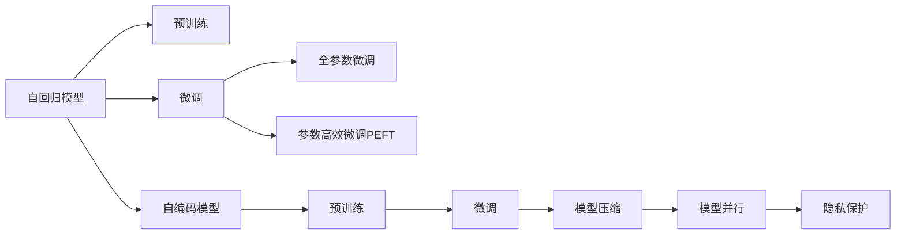

                 

# 大语言模型原理基础与前沿 生产规模部署

## 1. 背景介绍

### 1.1 问题由来
近年来，深度学习技术在自然语言处理（NLP）领域的迅猛发展，极大地推动了语言模型的发展。其中，基于自回归架构的模型（如GPT系列）和自编码架构的模型（如BERT、T5）被证明具有强大的语言理解能力和生成能力。然而，这些模型通常在规模巨大的无标签数据上进行预训练，然后在各种NLP任务上进行微调（Fine-Tuning），以适应特定任务的需求。

这一过程被广泛称为“迁移学习”，即将通用模型在特定任务上的知识进行迁移。然而，随着应用场景的不断拓展和需求的多样化，仅仅基于预训练-微调的过程已经无法满足复杂和多变的任务需求。此外，大规模语言模型的部署和维护也面临着诸多挑战，如计算资源需求、推理速度、模型压缩和优化等问题。

### 1.2 问题核心关键点
在生产规模下部署大语言模型，需要考虑多个关键因素：

- **模型效率**：如何在保证性能的同时，尽可能减少计算资源消耗。
- **模型压缩**：如何通过模型剪枝、量化等技术，压缩模型大小，提高推理速度。
- **模型优化**：如何通过高效的优化策略，加速模型的收敛过程。
- **模型并行**：如何通过分布式计算和模型并行技术，提高模型的训练和推理效率。
- **模型安全和隐私**：如何在确保模型安全性的同时，保护用户隐私。

本文旨在全面探讨大语言模型的原理基础与前沿技术，特别是其在生产规模下的部署和优化策略，帮助开发者更好地掌握大语言模型在实际应用中的部署和优化方法。

## 2. 核心概念与联系

### 2.1 核心概念概述

为了深入理解大语言模型在生产规模下的部署，我们首先回顾几个核心概念：

- **自回归模型（Autoregressive Model）**：如GPT系列模型，通过预测下一个单词或字符来生成文本。
- **自编码模型（Autoencoder Model）**：如BERT、T5，通过重构输入来学习和表示语言。
- **微调（Fine-Tuning）**：在预训练模型基础上，使用特定任务的数据进行训练，以适应该任务。
- **模型压缩（Model Compression）**：通过剪枝、量化等技术，减小模型大小，提高推理速度。
- **模型并行（Model Parallelism）**：通过分布式计算和模型并行技术，提高模型的训练和推理效率。
- **隐私保护（Privacy Preservation）**：保护用户数据隐私，确保模型训练和使用过程中的数据安全。

这些概念构成了大语言模型部署的核心技术框架。

### 2.2 核心概念原理和架构的 Mermaid 流程图



## 3. 核心算法原理 & 具体操作步骤

### 3.1 算法原理概述

大语言模型的生产规模部署，主要是通过预训练-微调流程，将其应用于特定任务。这一过程包括以下几个步骤：

1. **预训练**：在大规模无标签数据上训练模型，学习通用的语言表示。
2. **微调**：在特定任务的数据上，对预训练模型进行有监督训练，以适应该任务。
3. **模型压缩**：通过剪枝、量化等技术，减小模型大小，提高推理速度。
4. **模型并行**：通过分布式计算和模型并行技术，提高模型的训练和推理效率。
5. **隐私保护**：保护用户数据隐私，确保模型训练和使用过程中的数据安全。

### 3.2 算法步骤详解

以下是生产规模部署大语言模型的详细步骤：

**Step 1: 准备预训练模型和数据集**

- **选择合适的预训练模型**：如BERT、GPT等。
- **收集标注数据集**：划分为训练集、验证集和测试集，确保数据的多样性和代表性。

**Step 2: 添加任务适配层**

- **设计输出层**：根据任务类型，添加合适的输出层。
- **定义损失函数**：如交叉熵损失、均方误差损失等，用于衡量模型输出与真实标签之间的差异。

**Step 3: 设置微调超参数**

- **选择合适的优化器**：如AdamW、SGD等。
- **设置学习率**：通常为预训练学习率的小值。
- **选择正则化技术**：如L2正则、Dropout等。
- **确定冻结层策略**：如只微调顶层，或全部参数都参与微调。

**Step 4: 执行梯度训练**

- **加载数据集**：使用DataLoader加载数据集。
- **模型前向传播**：计算模型在当前参数下的输出。
- **计算损失函数**：计算模型输出与真实标签之间的差异。
- **反向传播**：计算参数梯度。
- **模型参数更新**：使用优化器更新模型参数。
- **验证集评估**：周期性在验证集上评估模型性能，防止过拟合。

**Step 5: 模型压缩**

- **剪枝**：去除不必要的参数，减小模型大小。
- **量化**：将浮点数参数转换为定点数，压缩存储空间。

**Step 6: 模型并行**

- **分布式计算**：使用分布式训练框架（如PyTorch Distributed、Horovod等），提高训练效率。
- **模型并行**：使用深度学习框架（如TensorFlow、PyTorch）中的模型并行技术，如数据并行、模型并行、混合并行等。

**Step 7: 隐私保护**

- **数据匿名化**：使用差分隐私等技术，保护用户数据隐私。
- **加密存储**：使用加密技术，保护模型参数的安全。

### 3.3 算法优缺点

生产规模部署大语言模型具有以下优点：

- **性能提升**：通过微调和模型优化，显著提升模型在特定任务上的性能。
- **计算效率**：通过模型压缩和模型并行技术，大幅提高推理速度，降低计算资源消耗。
- **数据安全**：通过隐私保护技术，保护用户数据隐私。

同时，也存在以下缺点：

- **数据依赖**：微调模型依赖于特定任务的数据，数据获取和处理成本较高。
- **复杂性增加**：模型压缩和模型并行技术增加了模型部署的复杂性。
- **过拟合风险**：微调模型可能过拟合训练集，影响泛化性能。

### 3.4 算法应用领域

大语言模型的生产规模部署，已经广泛应用于多个领域，例如：

- **智能客服**：使用微调后的对话模型，实现7x24小时不间断服务。
- **金融舆情监测**：通过微调后的文本分类和情感分析模型，实时监测金融舆情。
- **个性化推荐**：使用微调后的模型，从文本内容中准确把握用户兴趣点，提供个性化推荐。

这些应用领域展示了生产规模部署大语言模型的强大能力和广泛适用性。

## 4. 数学模型和公式 & 详细讲解 & 举例说明

### 4.1 数学模型构建

大语言模型的数学模型构建基于自回归模型和自编码模型的基础。以BERT模型为例，其数学模型可以表示为：

$$
\begin{aligned}
P(\mathbf{y}|\mathbf{x}) &= \sigma(\mathbf{W}_x\mathbf{x} + \mathbf{W}_o \mathbf{h}_x + \mathbf{b}_x) \\
\mathbf{h}_x &= \text{Tanh}(\mathbf{W}_h\mathbf{x} + \mathbf{W}_o \mathbf{h}_{x-1} + \mathbf{b}_x)
\end{aligned}
$$

其中，$\mathbf{x}$ 为输入文本，$\mathbf{y}$ 为标签，$\mathbf{h}_x$ 为隐表示，$\mathbf{W}_x$、$\mathbf{W}_o$、$\mathbf{W}_h$ 为权重矩阵，$\mathbf{b}_x$ 为偏置向量，$\sigma$ 为激活函数。

### 4.2 公式推导过程

以BERT模型为例，其训练过程可以表示为：

$$
\mathbf{h}_x = \text{Tanh}(\mathbf{W}_h\mathbf{x} + \mathbf{W}_o \mathbf{h}_{x-1} + \mathbf{b}_x)
$$

将 $\mathbf{h}_x$ 代入输出层，计算损失函数：

$$
\mathcal{L} = -\frac{1}{N}\sum_{i=1}^N \log P(y_i|\mathbf{x}_i)
$$

使用梯度下降等优化算法，最小化损失函数：

$$
\theta \leftarrow \theta - \eta \nabla_{\theta}\mathcal{L}
$$

其中，$\eta$ 为学习率，$\nabla_{\theta}\mathcal{L}$ 为损失函数对模型参数的梯度。

### 4.3 案例分析与讲解

假设我们有一个文本分类任务，目标是判断文本是否包含特定的情感。首先，我们需要将文本输入BERT模型，得到隐表示 $\mathbf{h}_x$。然后，将 $\mathbf{h}_x$ 输入输出层，得到情感预测概率 $P(y_i|\mathbf{x}_i)$。最后，通过最小化交叉熵损失函数，更新模型参数。

## 5. 项目实践：代码实例和详细解释说明

### 5.1 开发环境搭建

- **安装Python**：确保Python版本为3.7或以上。
- **安装Anaconda**：用于创建独立的Python环境。
- **创建虚拟环境**：
  ```bash
  conda create -n transformers-env python=3.8
  conda activate transformers-env
  ```

- **安装必要的库**：
  ```bash
  pip install torch transformers tensorboard
  ```

- **准备数据集**：
  ```bash
  mkdir datasets
  wget https://example.com/dataset.tar.gz -P datasets
  tar -xvf datasets/dataset.tar.gz
  ```

### 5.2 源代码详细实现

以下是使用PyTorch和Transformers库进行BERT微调的示例代码：

```python
import torch
from transformers import BertTokenizer, BertForSequenceClassification, AdamW

# 加载数据集
tokenizer = BertTokenizer.from_pretrained('bert-base-uncased')
train_dataset = ...
dev_dataset = ...
test_dataset = ...

# 加载预训练模型
model = BertForSequenceClassification.from_pretrained('bert-base-uncased', num_labels=num_labels)

# 设置优化器和超参数
optimizer = AdamW(model.parameters(), lr=2e-5)
total_steps = len(train_dataset) // batch_size
epochs = 3

# 训练过程
for epoch in range(epochs):
    model.train()
    for batch in train_dataset:
        input_ids = batch['input_ids'].to(device)
        attention_mask = batch['attention_mask'].to(device)
        labels = batch['labels'].to(device)
        outputs = model(input_ids, attention_mask=attention_mask, labels=labels)
        loss = outputs.loss
        loss.backward()
        optimizer.step()

# 评估过程
model.eval()
with torch.no_grad():
    for batch in dev_dataset:
        input_ids = batch['input_ids'].to(device)
        attention_mask = batch['attention_mask'].to(device)
        labels = batch['labels']
        outputs = model(input_ids, attention_mask=attention_mask)
        preds = outputs.logits.argmax(dim=1).tolist()
        acc = (preds == labels).mean()

# 导出模型
torch.save(model.state_dict(), 'model.pth')
```

### 5.3 代码解读与分析

- **数据集处理**：使用`BertTokenizer`对文本进行分词和编码，将输入转换为模型可以处理的张量形式。
- **模型加载**：使用`BertForSequenceClassification`加载预训练的BERT模型，并设置输出层的标签数量。
- **优化器设置**：使用AdamW优化器，设置学习率和其他超参数。
- **训练过程**：在训练集上循环迭代，计算损失并更新模型参数。
- **评估过程**：在验证集上评估模型性能，计算准确率等指标。
- **模型导出**：将训练好的模型参数保存为`model.pth`文件，用于后续的推理和部署。

### 5.4 运行结果展示

训练过程可以通过TensorBoard可视化，评估过程可以使用`classification_report`库进行详细分析。

```python
from sklearn.metrics import classification_report
import tensorboard as tb

# 训练过程
...
with tb.SummaryWriter('logs') as writer:
    for step in range(total_steps):
        ...
        writer.add_scalar('train_loss', loss, step)
        writer.add_scalar('train_acc', acc, step)

# 评估过程
...
print(classification_report(labels, preds))
```

## 6. 实际应用场景

### 6.1 智能客服系统

智能客服系统需要快速响应用户查询，提供准确的服务。使用微调后的BERT模型，可以实时分析用户输入，生成最佳的回复。

### 6.2 金融舆情监测

金融舆情监测系统需要实时分析和汇总社交媒体上的金融相关信息，预测市场趋势。微调后的BERT模型可以帮助系统准确理解金融文本，提供实时的市场分析。

### 6.3 个性化推荐系统

个性化推荐系统需要根据用户的浏览和购买历史，推荐符合其兴趣的商品。微调后的BERT模型可以分析用户评论和描述，准确把握用户兴趣，提供个性化的推荐结果。

## 7. 工具和资源推荐

### 7.1 学习资源推荐

- **《深度学习》课程**：斯坦福大学提供的深度学习入门课程，涵盖了从基础到前沿的各种深度学习技术。
- **《自然语言处理》教材**：NLP领域的经典教材，详细介绍了各种NLP任务的数学模型和算法。
- **Transformers官方文档**：详细介绍了如何在大规模数据上预训练和使用BERT等模型。

### 7.2 开发工具推荐

- **PyTorch**：用于深度学习的开源框架，支持动态计算图和丰富的GPU加速功能。
- **TensorFlow**：Google开发的深度学习框架，支持静态计算图和分布式训练。
- **TensorBoard**：用于可视化训练过程中的各种指标，监控模型训练过程。
- **Horovod**：用于分布式训练的深度学习框架，支持多种模型和优化器。

### 7.3 相关论文推荐

- **BERT论文**：详细介绍了BERT模型的预训练和微调方法。
- **T5论文**：介绍了T5模型的预训练和微调方法，展示了其强大的生成能力。
- **Transformer论文**：介绍了Transformer模型，并详细说明了其自回归架构。

## 8. 总结：未来发展趋势与挑战

### 8.1 研究成果总结

大语言模型在生产规模下的部署和优化，已经取得了显著的进展。微调、模型压缩、模型并行和隐私保护等技术，使得大语言模型在实际应用中能够高效运行，同时保护用户数据隐私。

### 8.2 未来发展趋势

未来，大语言模型的部署和优化将朝着以下方向发展：

- **模型优化**：更高效的优化算法和模型剪枝技术，使得模型能够在更低的计算资源下运行。
- **模型压缩**：通过量化和低秩分解等技术，进一步减小模型大小，提高推理速度。
- **模型并行**：更多的分布式训练框架和模型并行技术，支持更大规模的模型训练。
- **隐私保护**：更加严格的隐私保护措施，确保用户数据的安全。

### 8.3 面临的挑战

尽管大语言模型在生产规模下部署取得了一定的进展，但仍面临以下挑战：

- **数据依赖**：微调模型依赖于特定任务的数据，数据获取和处理成本较高。
- **计算资源**：大规模模型的训练和推理需要大量的计算资源。
- **模型过拟合**：微调模型可能过拟合训练集，影响泛化性能。
- **隐私安全**：用户数据隐私保护是一个重要的挑战。

### 8.4 研究展望

未来的研究需要在以下几个方面进行突破：

- **无监督和半监督微调**：减少对大规模标注数据的依赖，通过自监督学习等方法进行微调。
- **多模态微调**：将视觉、语音等模态数据与文本数据结合，提升模型的感知能力。
- **因果推理**：增强模型的因果关系理解能力，提高推理的准确性。
- **跨领域迁移**：实现模型在跨领域的迁移学习，提升模型的通用性。

## 9. 附录：常见问题与解答

**Q1：如何处理长文本输入？**

A: 对于长文本输入，可以使用BERT的Truncation或Segmentation策略，将长文本分解成多个短文本进行输入。

**Q2：如何处理序列标签问题？**

A: 对于序列标签问题，可以使用序列标注任务，如命名实体识别（NER），使用CRF等解码器进行序列标签预测。

**Q3：模型压缩的常见方法有哪些？**

A: 模型压缩的常见方法包括剪枝、量化、低秩分解等。其中，剪枝可以去除不重要的参数，量化可以减小模型大小，低秩分解可以通过矩阵分解减少参数数量。

**Q4：如何优化模型训练速度？**

A: 优化模型训练速度的方法包括使用更快的优化器（如AdamW）、使用更好的GPU设备、使用数据并行和模型并行技术等。

**Q5：如何保护用户数据隐私？**

A: 保护用户数据隐私的方法包括数据匿名化、加密存储、差分隐私等。使用差分隐私技术可以在不破坏模型性能的前提下，保护用户隐私。

作者：禅与计算机程序设计艺术 / Zen and the Art of Computer Programming

