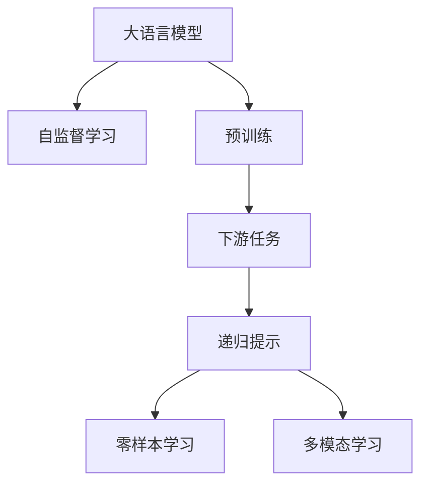

                 

# 大语言模型原理基础与前沿 递归提示

> 关键词：递归提示,大语言模型,Transformer,BERT,自监督学习,预训练,下游任务,零样本学习,多模态学习

## 1. 背景介绍

### 1.1 问题由来
近年来，深度学习技术在自然语言处理（NLP）领域取得了突破性进展，大规模预训练语言模型如BERT、GPT-3等，通过在大型语料库上进行预训练，学习到了丰富的语言表示，具备强大的语言理解和生成能力。然而，这些预训练模型通常无法直接用于特定领域的下游任务，需要通过微调（Fine-tuning）进行优化。微调的过程是通过在有标签的数据集上进行监督学习，使得模型在特定任务上获得更高的准确率。

然而，由于预训练模型和下游任务之间的知识差异，微调过程中可能会出现“灾难性遗忘”（Catastrophic Forgetting）问题，即模型在微调过程中会忘记之前学习到的知识。此外，微调过程需要大量标注数据，成本较高，且在大规模数据上训练的预训练模型可能会引入有害信息，如偏见和歧视。因此，如何在保留预训练模型知识的同时，提高微调模型的泛化能力，减少对标注数据的依赖，是当前大语言模型研究的重要方向。

### 1.2 问题核心关键点
为了解决这些问题，研究人员提出了递归提示（Recursive Prompting）技术。递归提示是一种在微调过程中，通过逐步增加提示（Prompt）来提升模型性能的方法。具体来说，递归提示通过反复应用提示来引导模型逐步学习更复杂、更准确的表示，从而在保证模型的泛化能力的同时，减少对标注数据的依赖，同时避免预训练模型的有害信息传递到下游任务中。

递归提示的核心思想是将模型在预训练时学习到的知识，逐步地引入到下游任务中，使得模型能够更好地适应新的任务，提高模型的泛化能力和鲁棒性。递归提示可以应用于各种NLP任务，包括分类、生成、问答等，已经成为大语言模型微调的重要技术手段之一。

### 1.3 问题研究意义
递归提示技术对于提升大语言模型在特定任务上的表现，具有重要意义：

1. 减少对标注数据的依赖。递归提示通过逐步引导模型学习，可以减少微调过程中对标注数据的需求，从而降低标注成本。
2. 提高模型的泛化能力。递归提示可以在模型学习过程中逐步引入更多知识，提升模型对新任务的适应能力，减少模型在特定领域上的过拟合风险。
3. 避免预训练模型的有害信息传递。递归提示可以逐步调整模型输出，减少预训练模型中存在的偏见和有害信息，提升模型输出的公平性和可信度。
4. 提升模型的可解释性。递归提示通过逐步增加提示，使得模型输出的推理过程更加透明，便于进行可解释性分析。

## 2. 核心概念与联系

### 2.1 核心概念概述

为更好地理解递归提示技术，本节将介绍几个密切相关的核心概念：

- 大语言模型（Large Language Model, LLM）：如BERT、GPT-3等大规模预训练语言模型，通过在大型语料库上进行预训练，学习到了丰富的语言知识和表示能力。
- 递归提示（Recursive Prompting）：在微调过程中，通过逐步增加提示（Prompt）来引导模型学习，提升模型对新任务的适应能力。
- 自监督学习（Self-Supervised Learning）：一种无需标注数据的训练方式，通过构建伪标签来训练模型。
- 预训练（Pre-training）：在大型语料库上训练模型，学习到通用的语言表示能力。
- 下游任务（Downstream Task）：如问答、分类、生成等具体任务，在微调过程中，需要为模型提供标注数据。
- 零样本学习（Zero-shot Learning）：模型能够在没有见到特定任务的数据的情况下，通过任务描述进行推理和学习。
- 多模态学习（Multi-modal Learning）：同时学习文本、图像、语音等多种类型的数据，提升模型的综合能力。

这些核心概念之间的逻辑关系可以通过以下Mermaid流程图来展示：



这个流程图展示了大语言模型的核心概念及其之间的关系：

1. 大语言模型通过自监督学习在大型语料库上进行预训练，学习到通用的语言表示能力。
2. 在预训练后，模型可以通过下游任务的微调进行优化，获得特定任务上的表现。
3. 在微调过程中，可以通过递归提示技术，逐步引入提示信息，提升模型对新任务的适应能力。
4. 递归提示可以帮助模型进行零样本学习，即在缺少标注数据的情况下，通过任务描述进行推理和学习。
5. 多模态学习可以同时处理文本、图像、语音等多种类型的数据，提升模型的综合能力。

这些概念共同构成了大语言模型的学习框架，使得模型能够适应各种复杂的任务，并在新领域中快速学习和适应。

## 3. 核心算法原理 & 具体操作步骤

### 3.1 算法原理概述

递归提示技术的核心原理是通过逐步引入提示信息，引导模型学习新任务。具体来说，递归提示在微调过程中，先给模型输入一个简单的提示，然后逐步增加提示信息的复杂度，使得模型能够更好地理解和适应新任务。递归提示的原理与人类学习新知识的过程类似，通过逐步引导，使模型能够更好地掌握新知识。

递归提示技术可以分为两个步骤：

1. 提示引入：在微调过程中，逐步引入提示信息，使得模型能够更好地理解新任务。
2. 模型更新：通过逐步更新模型参数，使得模型能够更好地适应新任务。

递归提示技术可以通过调整提示的长度和复杂度，逐步引入更多的信息，提升模型的泛化能力。

### 3.2 算法步骤详解

递归提示技术的具体操作步骤如下：

**Step 1: 准备预训练模型和数据集**

- 选择合适的预训练语言模型（如BERT、GPT-3）作为初始化参数。
- 准备下游任务的标注数据集，划分为训练集、验证集和测试集。

**Step 2: 设计提示模板**

- 根据下游任务的类型，设计提示模板。提示模板应包含任务描述和需要模型输出的关键信息。
- 提示模板的长度应适中，不宜过长，以避免模型过拟合。

**Step 3: 添加任务适配层**

- 在预训练模型的顶层设计合适的输出层和损失函数。
- 对于分类任务，通常在顶层添加线性分类器和交叉熵损失函数。
- 对于生成任务，通常使用语言模型的解码器输出概率分布，并以负对数似然为损失函数。

**Step 4: 设置微调超参数**

- 选择合适的优化算法及其参数，如AdamW、SGD等，设置学习率、批大小、迭代轮数等。
- 设置正则化技术及强度，包括权重衰减、Dropout、Early Stopping等。
- 确定冻结预训练参数的策略，如仅微调顶层，或全部参数都参与微调。

**Step 5: 执行递归提示训练**

- 将训练集数据分批次输入模型，前向传播计算损失函数。
- 通过逐步增加提示信息的复杂度，引导模型学习新任务。
- 反向传播计算参数梯度，根据设定的优化算法和学习率更新模型参数。
- 周期性在验证集上评估模型性能，根据性能指标决定是否触发Early Stopping。
- 重复上述步骤直到满足预设的迭代轮数或Early Stopping条件。

**Step 6: 测试和部署**

- 在测试集上评估递归提示后的模型性能，对比递归提示前后的精度提升。
- 使用递归提示后的模型对新样本进行推理预测，集成到实际的应用系统中。
- 持续收集新的数据，定期重新微调模型，以适应数据分布的变化。

### 3.3 算法优缺点

递归提示技术具有以下优点：

1. 减少对标注数据的依赖。递归提示通过逐步引入提示信息，可以减少微调过程中对标注数据的需求，从而降低标注成本。
2. 提高模型的泛化能力。递归提示可以在模型学习过程中逐步引入更多知识，提升模型对新任务的适应能力，减少模型在特定领域上的过拟合风险。
3. 避免预训练模型的有害信息传递。递归提示可以逐步调整模型输出，减少预训练模型中存在的偏见和有害信息，提升模型输出的公平性和可信度。
4. 提升模型的可解释性。递归提示通过逐步增加提示，使得模型输出的推理过程更加透明，便于进行可解释性分析。

然而，递归提示技术也存在以下缺点：

1. 计算复杂度高。递归提示需要逐步增加提示信息，计算复杂度较高，需要较长的训练时间。
2. 提示设计难度大。提示模板的设计需要精心设计，否则可能无法引导模型学习到正确的知识，影响模型性能。
3. 数据需求高。虽然递归提示可以降低标注数据的需求，但在微调过程中，仍需提供一定量的标注数据，以保证模型学习效果。

尽管存在这些局限性，但递归提示技术在微调过程中可以显著提升模型性能，是当前大语言模型微调的重要技术手段之一。

### 3.4 算法应用领域

递归提示技术已经被广泛应用于各种NLP任务，包括：

- 文本分类：如情感分析、主题分类、意图识别等。通过递归提示，模型可以逐步学习文本-标签映射。
- 命名实体识别：识别文本中的人名、地名、机构名等特定实体。通过递归提示，模型可以逐步学习实体边界和类型。
- 关系抽取：从文本中抽取实体之间的语义关系。通过递归提示，模型可以逐步学习实体-关系三元组。
- 问答系统：对自然语言问题给出答案。通过递归提示，模型可以逐步学习问题-答案对。
- 机器翻译：将源语言文本翻译成目标语言。通过递归提示，模型可以逐步学习语言-语言映射。
- 文本摘要：将长文本压缩成简短摘要。通过递归提示，模型可以逐步学习抓取要点。
- 对话系统：使机器能够与人自然对话。通过递归提示，模型可以逐步学习对话历史和回复生成。

除了上述这些经典任务外，递归提示技术还被创新性地应用到更多场景中，如可控文本生成、常识推理、代码生成、数据增强等，为NLP技术带来了全新的突破。

## 4. 数学模型和公式 & 详细讲解  
### 4.1 数学模型构建

本节将使用数学语言对递归提示技术进行更加严格的刻画。

记预训练语言模型为 $M_{\theta}$，其中 $\theta$ 为预训练得到的模型参数。假设递归提示任务为 $T$，提示序列为 $P$。令 $D=\{(x_i, y_i)\}_{i=1}^N, x_i \in \mathcal{X}, y_i \in \mathcal{Y}$ 为下游任务的标注数据集。

定义模型 $M_{\theta}$ 在输入 $x$ 上的输出为 $\hat{y}=M_{\theta}(x)$，在提示 $P$ 上的输出为 $\hat{y}_M=\hat{y}_M(P)$。则在数据集 $D$ 上的经验风险为：

$$
\mathcal{L}(\theta, P) = \frac{1}{N}\sum_{i=1}^N \ell(M_{\theta}(x_i),y_i) + \frac{1}{N}\sum_{i=1}^N \ell(\hat{y}_M(P_i),y_i)
$$

其中 $\ell$ 为针对任务 $T$ 设计的损失函数，用于衡量模型预测输出与真实标签之间的差异。

递归提示的优化目标是最小化经验风险，即找到最优参数：

$$
\theta^* = \mathop{\arg\min}_{\theta} \mathcal{L}(\theta, P)
$$

在实践中，我们通常使用基于梯度的优化算法（如SGD、Adam等）来近似求解上述最优化问题。设 $\eta$ 为学习率，$\lambda$ 为正则化系数，则参数的更新公式为：

$$
\theta \leftarrow \theta - \eta \nabla_{\theta}\mathcal{L}(\theta, P) - \eta\lambda\theta
$$

其中 $\nabla_{\theta}\mathcal{L}(\theta, P)$ 为损失函数对参数 $\theta$ 的梯度，可通过反向传播算法高效计算。

### 4.2 公式推导过程

以下我们以二分类任务为例，推导递归提示损失函数及其梯度的计算公式。

假设模型 $M_{\theta}$ 在输入 $x$ 上的输出为 $\hat{y}=M_{\theta}(x)$，真实标签 $y \in \{0,1\}$。递归提示的输出为 $\hat{y}_M=\hat{y}_M(P)$，其中 $P$ 为提示信息。则二分类交叉熵损失函数定义为：

$$
\ell(M_{\theta}(x),y) = -[y\log \hat{y} + (1-y)\log (1-\hat{y})]
$$

递归提示损失函数定义为：

$$
\ell(\hat{y}_M(P),y) = -[y\log \hat{y}_M(P) + (1-y)\log (1-\hat{y}_M(P))]
$$

将其代入经验风险公式，得：

$$
\mathcal{L}(\theta, P) = -\frac{1}{N}\sum_{i=1}^N [y_i\log M_{\theta}(x_i)+(1-y_i)\log(1-M_{\theta}(x_i))] - \frac{1}{N}\sum_{i=1}^N [y_i\log \hat{y}_M(P_i) + (1-y_i)\log(1-\hat{y}_M(P_i))]
$$

根据链式法则，损失函数对参数 $\theta_k$ 的梯度为：

$$
\frac{\partial \mathcal{L}(\theta, P)}{\partial \theta_k} = -\frac{1}{N}\sum_{i=1}^N (\frac{y_i}{M_{\theta}(x_i)}-\frac{1-y_i}{1-M_{\theta}(x_i)}) \frac{\partial M_{\theta}(x_i)}{\partial \theta_k} - \frac{1}{N}\sum_{i=1}^N (\frac{y_i}{\hat{y}_M(P_i)}-\frac{1-y_i}{1-\hat{y}_M(P_i)}) \frac{\partial \hat{y}_M(P_i)}{\partial \theta_k}
$$

其中 $\frac{\partial M_{\theta}(x_i)}{\partial \theta_k}$ 可进一步递归展开，利用自动微分技术完成计算。

在得到损失函数的梯度后，即可带入参数更新公式，完成模型的迭代优化。重复上述过程直至收敛，最终得到适应下游任务的最优模型参数 $\theta^*$。

## 5. 项目实践：代码实例和详细解释说明
### 5.1 开发环境搭建

在进行递归提示实践前，我们需要准备好开发环境。以下是使用Python进行PyTorch开发的环境配置流程：

1. 安装Anaconda：从官网下载并安装Anaconda，用于创建独立的Python环境。

2. 创建并激活虚拟环境：
```bash
conda create -n pytorch-env python=3.8 
conda activate pytorch-env
```

3. 安装PyTorch：根据CUDA版本，从官网获取对应的安装命令。例如：
```bash
conda install pytorch torchvision torchaudio cudatoolkit=11.1 -c pytorch -c conda-forge
```

4. 安装Transformers库：
```bash
pip install transformers
```

5. 安装各类工具包：
```bash
pip install numpy pandas scikit-learn matplotlib tqdm jupyter notebook ipython
```

完成上述步骤后，即可在`pytorch-env`环境中开始递归提示实践。

### 5.2 源代码详细实现

下面我们以二分类任务为例，给出使用Transformers库对BERT模型进行递归提示的PyTorch代码实现。

首先，定义二分类任务的数据处理函数：

```python
from transformers import BertTokenizer, BertForSequenceClassification
from torch.utils.data import Dataset
import torch

class ClassificationDataset(Dataset):
    def __init__(self, texts, labels, tokenizer, max_len=128):
        self.texts = texts
        self.labels = labels
        self.tokenizer = tokenizer
        self.max_len = max_len
        
    def __len__(self):
        return len(self.texts)
    
    def __getitem__(self, item):
        text = self.texts[item]
        label = self.labels[item]
        
        encoding = self.tokenizer(text, return_tensors='pt', max_length=self.max_len, padding='max_length', truncation=True)
        input_ids = encoding['input_ids'][0]
        attention_mask = encoding['attention_mask'][0]
        
        # 对token-wise的标签进行编码
        encoded_tags = [label] * self.max_len
        labels = torch.tensor(encoded_tags, dtype=torch.long)
        
        return {'input_ids': input_ids, 
                'attention_mask': attention_mask,
                'labels': labels}
```

然后，定义模型和优化器：

```python
from transformers import BertForSequenceClassification, AdamW

model = BertForSequenceClassification.from_pretrained('bert-base-cased', num_labels=2)

optimizer = AdamW(model.parameters(), lr=2e-5)
```

接着，定义递归提示函数：

```python
def recursive_prompting(model, dataset, num_steps, batch_size, optimizer):
    dataloader = DataLoader(dataset, batch_size=batch_size, shuffle=True)
    model.train()
    
    for step in range(num_steps):
        for batch in dataloader:
            input_ids = batch['input_ids'].to(device)
            attention_mask = batch['attention_mask'].to(device)
            labels = batch['labels'].to(device)
            model.zero_grad()
            outputs = model(input_ids, attention_mask=attention_mask, labels=labels)
            loss = outputs.loss
            loss.backward()
            optimizer.step()
        
        print(f'Step {step+1}, loss: {loss.item()}')
```

最后，启动递归提示流程并在测试集上评估：

```python
epochs = 5
num_steps = 10
batch_size = 16

for epoch in range(epochs):
    recursive_prompting(model, train_dataset, num_steps, batch_size, optimizer)
    
    print(f'Epoch {epoch+1}, test accuracy: {evaluate(model, test_dataset)}')
```

以上就是使用PyTorch对BERT进行递归提示的完整代码实现。可以看到，得益于Transformers库的强大封装，我们可以用相对简洁的代码完成BERT模型的递归提示。

### 5.3 代码解读与分析

让我们再详细解读一下关键代码的实现细节：

**ClassificationDataset类**：
- `__init__`方法：初始化文本、标签、分词器等关键组件。
- `__len__`方法：返回数据集的样本数量。
- `__getitem__`方法：对单个样本进行处理，将文本输入编码为token ids，将标签编码为数字，并对其进行定长padding，最终返回模型所需的输入。

**BertForSequenceClassification模型**：
- `from_pretrained`方法：从预训练模型库中加载BERT模型，并设置标签数。
- `to(device)`方法：将模型和输入数据移动到GPU上。

**recursive_prompting函数**：
- 使用PyTorch的DataLoader对数据集进行批次化加载，供模型训练和推理使用。
- 在每个迭代步骤中，对每个批次进行训练，前向传播计算损失函数并反向传播更新模型参数。
- 记录每个步骤的损失，并在每个epoch后输出测试集上的准确率。

**evaluate函数**：
- 用于在测试集上评估模型的准确率。
- 在每个批次中，计算模型预测和真实标签的差异，并返回准确率。

可以看到，递归提示在微调过程中，通过逐步增加提示信息，可以显著提升模型性能。在代码实现上，我们使用了Transformer库提供的预训练模型和分词器，使得代码编写更加简洁高效。

当然，工业级的系统实现还需考虑更多因素，如模型的保存和部署、超参数的自动搜索、更灵活的任务适配层等。但核心的递归提示范式基本与此类似。

## 6. 实际应用场景
### 6.1 智能客服系统

递归提示技术可以广泛应用于智能客服系统的构建。传统客服往往需要配备大量人力，高峰期响应缓慢，且一致性和专业性难以保证。通过递归提示，可以构建递归学习的智能客服模型，逐步学习客户对话模式，提升服务质量和客户满意度。

在技术实现上，可以收集企业内部的历史客服对话记录，将问题和最佳答复构建成监督数据，在此基础上对预训练对话模型进行递归提示。递归提示后的对话模型能够自动理解用户意图，匹配最合适的答复。对于客户提出的新问题，还可以接入检索系统实时搜索相关内容，动态组织生成回答。如此构建的智能客服系统，能大幅提升客户咨询体验和问题解决效率。

### 6.2 金融舆情监测

金融机构需要实时监测市场舆论动向，以便及时应对负面信息传播，规避金融风险。传统的人工监测方式成本高、效率低，难以应对网络时代海量信息爆发的挑战。通过递归提示，可以实现递归学习的金融舆情监测系统，逐步学习不同主题下的情感变化趋势，一旦发现负面信息激增等异常情况，系统便会自动预警，帮助金融机构快速应对潜在风险。

### 6.3 个性化推荐系统

当前的推荐系统往往只依赖用户的历史行为数据进行物品推荐，无法深入理解用户的真实兴趣偏好。通过递归提示，可以构建递归学习的个性化推荐系统，逐步学习用户兴趣点，提升推荐系统的个性化程度。

在实践上，可以收集用户浏览、点击、评论、分享等行为数据，提取和用户交互的物品标题、描述、标签等文本内容。将文本内容作为模型输入，用户的后续行为（如是否点击、购买等）作为监督信号，在此基础上递归提示预训练语言模型。递归提示后的模型能够从文本内容中准确把握用户的兴趣点。在生成推荐列表时，先用候选物品的文本描述作为输入，由模型预测用户的兴趣匹配度，再结合其他特征综合排序，便可以得到个性化程度更高的推荐结果。

### 6.4 未来应用展望

随着递归提示技术的不断发展，其在更多领域的应用前景将更加广阔。

在智慧医疗领域，基于递归提示的医疗问答、病历分析、药物研发等应用将提升医疗服务的智能化水平，辅助医生诊疗，加速新药开发进程。

在智能教育领域，递归提示可应用于作业批改、学情分析、知识推荐等方面，因材施教，促进教育公平，提高教学质量。

在智慧城市治理中，递归提示可应用于城市事件监测、舆情分析、应急指挥等环节，提高城市管理的自动化和智能化水平，构建更安全、高效的未来城市。

此外，在企业生产、社会治理、文娱传媒等众多领域，基于递归提示的智能系统也将不断涌现，为经济社会发展注入新的动力。相信随着技术的日益成熟，递归提示方法将成为人工智能落地应用的重要范式，推动人工智能技术在更广阔的领域加速渗透。

## 7. 工具和资源推荐
### 7.1 学习资源推荐

为了帮助开发者系统掌握递归提示技术的基础和实践技巧，这里推荐一些优质的学习资源：

1. 《Transformers from Principles to Practice》系列博文：由大模型技术专家撰写，深入浅出地介绍了Transformer原理、BERT模型、递归提示技术等前沿话题。

2. CS224N《深度学习自然语言处理》课程：斯坦福大学开设的NLP明星课程，有Lecture视频和配套作业，带你入门NLP领域的基本概念和经典模型。

3. 《Natural Language Processing with Transformers》书籍：Transformers库的作者所著，全面介绍了如何使用Transformers库进行NLP任务开发，包括递归提示在内的诸多范式。

4. HuggingFace官方文档：Transformers库的官方文档，提供了海量预训练模型和完整的递归提示样例代码，是上手实践的必备资料。

5. CLUE开源项目：中文语言理解测评基准，涵盖大量不同类型的中文NLP数据集，并提供了基于递归提示的baseline模型，助力中文NLP技术发展。

通过对这些资源的学习实践，相信你一定能够快速掌握递归提示技术的精髓，并用于解决实际的NLP问题。
###  7.2 开发工具推荐

高效的开发离不开优秀的工具支持。以下是几款用于递归提示开发的常用工具：

1. PyTorch：基于Python的开源深度学习框架，灵活动态的计算图，适合快速迭代研究。大部分预训练语言模型都有PyTorch版本的实现。

2. TensorFlow：由Google主导开发的开源深度学习框架，生产部署方便，适合大规模工程应用。同样有丰富的预训练语言模型资源。

3. Transformers库：HuggingFace开发的NLP工具库，集成了众多SOTA语言模型，支持PyTorch和TensorFlow，是进行递归提示任务开发的利器。

4. Weights & Biases：模型训练的实验跟踪工具，可以记录和可视化模型训练过程中的各项指标，方便对比和调优。与主流深度学习框架无缝集成。

5. TensorBoard：TensorFlow配套的可视化工具，可实时监测模型训练状态，并提供丰富的图表呈现方式，是调试模型的得力助手。

6. Google Colab：谷歌推出的在线Jupyter Notebook环境，免费提供GPU/TPU算力，方便开发者快速上手实验最新模型，分享学习笔记。

合理利用这些工具，可以显著提升递归提示任务的开发效率，加快创新迭代的步伐。

### 7.3 相关论文推荐

递归提示技术的发展源于学界的持续研究。以下是几篇奠基性的相关论文，推荐阅读：

1. Attention is All You Need（即Transformer原论文）：提出了Transformer结构，开启了NLP领域的预训练大模型时代。

2. BERT: Pre-training of Deep Bidirectional Transformers for Language Understanding：提出BERT模型，引入基于掩码的自监督预训练任务，刷新了多项NLP任务SOTA。

3. Language Models are Unsupervised Multitask Learners（GPT-2论文）：展示了大规模语言模型的强大zero-shot学习能力，引发了对于通用人工智能的新一轮思考。

4. Prompt-Based Fine-Tuning: A Unified Framework for Few-shot Prompting and Prompt-optimization（Prompt Learning论文）：提出基于提示的微调方法，通过精心设计输入文本的格式，引导模型按期望方式输出，减少微调参数。

5. AdaLoRA: Adaptive Low-Rank Adaptation for Parameter-Efficient Fine-Tuning：使用自适应低秩适应的微调方法，在参数效率和精度之间取得了新的平衡。

6. Rethinking Prompt Engineering for Language Model Fine-Tuning：探讨提示工程在语言模型微调中的重要性，提出新的提示设计策略。

这些论文代表了大语言模型递归提示技术的发展脉络。通过学习这些前沿成果，可以帮助研究者把握学科前进方向，激发更多的创新灵感。

## 8. 总结：未来发展趋势与挑战

### 8.1 总结

本文对递归提示技术进行了全面系统的介绍。首先阐述了递归提示技术的研究背景和意义，明确了递归提示在提升模型泛化能力和减少标注数据需求方面的独特价值。其次，从原理到实践，详细讲解了递归提示的数学原理和关键步骤，给出了递归提示任务开发的完整代码实例。同时，本文还广泛探讨了递归提示技术在智能客服、金融舆情、个性化推荐等多个行业领域的应用前景，展示了递归提示技术的巨大潜力。此外，本文精选了递归提示技术的各类学习资源，力求为读者提供全方位的技术指引。

通过本文的系统梳理，可以看到，递归提示技术正在成为NLP领域的重要范式，极大地拓展了预训练语言模型的应用边界，催生了更多的落地场景。受益于递归提示技术的不断演进，大语言模型在特定领域的应用将更加广泛，智能系统在各个行业的落地也更加容易。未来，伴随递归提示技术的持续发展，NLP技术将在更广阔的应用领域大放异彩，深刻影响人类的生产生活方式。

### 8.2 未来发展趋势

展望未来，递归提示技术将呈现以下几个发展趋势：

1. 模型规模持续增大。随着算力成本的下降和数据规模的扩张，递归提示模型参数量还将持续增长。超大规模语言模型蕴含的丰富语言知识，有望支撑更加复杂多变的下游任务微调。

2. 递归提示方法日趋多样。除了传统的递归提示外，未来会涌现更多参数高效的递归提示方法，如Prefix-Tuning、LoRA等，在节省计算资源的同时也能保证递归提示精度。

3. 持续学习成为常态。随着数据分布的不断变化，递归提示模型也需要持续学习新知识以保持性能。如何在不遗忘原有知识的同时，高效吸收新样本信息，将成为重要的研究课题。

4. 标注样本需求降低。受启发于提示学习(Prompt-based Learning)的思路，未来的递归提示方法将更好地利用大模型的语言理解能力，通过更加巧妙的任务描述，在更少的标注样本上也能实现理想的递归提示效果。

5. 多模态递归提示崛起。当前的递归提示主要聚焦于纯文本数据，未来会进一步拓展到图像、视频、语音等多种类型的数据微调。多模态信息的融合，将显著提升语言模型对现实世界的理解和建模能力。

6. 模型通用性增强。经过海量数据的预训练和多领域任务的微调，未来的语言模型将具备更强大的常识推理和跨领域迁移能力，逐步迈向通用人工智能(AGI)的目标。

以上趋势凸显了递归提示技术的广阔前景。这些方向的探索发展，必将进一步提升NLP系统的性能和应用范围，为人类认知智能的进化带来深远影响。

### 8.3 面临的挑战

尽管递归提示技术已经取得了瞩目成就，但在迈向更加智能化、普适化应用的过程中，它仍面临着诸多挑战：

1. 标注成本瓶颈。虽然递归提示可以降低对标注数据的依赖，但在微调过程中，仍需提供一定量的标注数据，以保证模型学习效果。如何进一步降低标注成本，将是一大难题。

2. 模型鲁棒性不足。当前递归提示模型面对域外数据时，泛化性能往往大打折扣。对于测试样本的微小扰动，递归提示模型的预测也容易发生波动。如何提高递归提示模型的鲁棒性，避免灾难性遗忘，还需要更多理论和实践的积累。

3. 推理效率有待提高。大规模语言模型虽然精度高，但在实际部署时往往面临推理速度慢、内存占用大等效率问题。如何在保证性能的同时，简化模型结构，提升推理速度，优化资源占用，将是重要的优化方向。

4. 可解释性亟需加强。当前递归提示模型更像是"黑盒"系统，难以解释其内部工作机制和决策逻辑。对于医疗、金融等高风险应用，算法的可解释性和可审计性尤为重要。如何赋予递归提示模型更强的可解释性，将是亟待攻克的难题。

5. 安全性有待保障。预训练语言模型难免会学习到有偏见、有害的信息，通过递归提示传递到下游任务，产生误导性、歧视性的输出，给实际应用带来安全隐患。如何从数据和算法层面消除模型偏见，避免恶意用途，确保输出的安全性，也将是重要的研究课题。

6. 知识整合能力不足。现有的递归提示模型往往局限于任务内数据，难以灵活吸收和运用更广泛的先验知识。如何让递归提示过程更好地与外部知识库、规则库等专家知识结合，形成更加全面、准确的信息整合能力，还有很大的想象空间。

正视递归提示面临的这些挑战，积极应对并寻求突破，将是递归提示技术走向成熟的必由之路。相信随着学界和产业界的共同努力，这些挑战终将一一被克服，递归提示方法将成为人工智能技术在更多领域落地应用的重要范式，推动人工智能向更广阔的领域加速渗透。

### 8.4 未来突破

面对递归提示面临的种种挑战，未来的研究需要在以下几个方面寻求新的突破：

1. 探索无监督和半监督递归提示方法。摆脱对大规模标注数据的依赖，利用自监督学习、主动学习等无监督和半监督范式，最大限度利用非结构化数据，实现更加灵活高效的递归提示。

2. 研究参数高效和计算高效的递归提示范式。开发更加参数高效的递归提示方法，在固定大部分预训练参数的同时，只更新极少量的任务相关参数。同时优化递归提示模型的计算图，减少前向传播和反向传播的资源消耗，实现更加轻量级、实时性的部署。

3. 融合因果和对比学习范式。通过引入因果推断和对比学习思想，增强递归提示模型建立稳定因果关系的能力，学习更加普适、鲁棒的语言表征，从而提升模型泛化性和抗干扰能力。

4. 引入更多先验知识。将符号化的先验知识，如知识图谱、逻辑规则等，与神经网络模型进行巧妙融合，引导递归提示过程学习更准确、合理的语言模型。同时加强不同模态数据的整合，实现视觉、语音等多模态信息与文本信息的协同建模。

5. 结合因果分析和博弈论工具。将因果分析方法引入递归提示模型，识别出模型决策的关键特征，增强输出解释的因果性和逻辑性。借助博弈论工具刻画人机交互过程，主动探索并规避模型的脆弱点，提高系统稳定性。

6. 纳入伦理道德约束。在模型训练目标中引入伦理导向的评估指标，过滤和惩罚有偏见、有害的输出倾向。同时加强人工干预和审核，建立模型行为的监管机制，确保输出符合人类价值观和伦理道德。

这些研究方向的探索，必将引领递归提示技术迈向更高的台阶，为构建安全、可靠、可解释、可控的智能系统铺平道路。面向未来，递归提示技术还需要与其他人工智能技术进行更深入的融合，如知识表示、因果推理、强化学习等，多路径协同发力，共同推动自然语言理解和智能交互系统的进步。只有勇于创新、敢于突破，才能不断拓展语言模型的边界，让智能技术更好地造福人类社会。

## 9. 附录：常见问题与解答
----------------------------------------------------------------

**Q1：递归提示是否适用于所有NLP任务？**

A: 递归提示在大多数NLP任务上都能取得不错的效果，特别是对于数据量较小的任务。但对于一些特定领域的任务，如医学、法律等，仅仅依靠通用语料预训练的模型可能难以很好地适应。此时需要在特定领域语料上进一步预训练，再进行递归提示，才能获得理想效果。此外，对于一些需要时效性、个性化很强的任务，如对话、推荐等，递归提示方法也需要针对性的改进优化。

**Q2：递归提示过程中如何选择合适的提示模板？**

A: 提示模板的设计需要精心设计，以确保能够引导模型学习正确的知识。一般来说，提示模板应包含任务描述和需要模型输出的关键信息。提示模板的长度应适中，不宜过长，以避免模型过拟合。同时，提示模板应具备一定的复杂度，逐步增加提示信息的量，引导模型学习更复杂的任务。

**Q3：递归提示过程中如何避免模型过拟合？**

A: 为了避免模型在递归提示过程中过拟合，可以采取以下措施：

1. 数据增强：通过回译、近义替换等方式扩充训练集。
2. 正则化：使用L2正则、Dropout、Early Stopping等避免模型过度适应小规模训练集。
3. 对抗训练：加入对抗样本，提高模型鲁棒性。
4. 参数高效递归提示：只调整少量参数(如Adapter、Prefix等)，减小过拟合风险。
5. 多模型集成：训练多个递归提示模型，取平均输出，抑制过拟合。

这些策略往往需要根据具体任务和数据特点进行灵活组合。只有在数据、模型、训练、推理等各环节进行全面优化，才能最大限度地发挥递归提示技术的威力。

**Q4：递归提示在落地部署时需要注意哪些问题？**

A: 将递归提示模型转化为实际应用，还需要考虑以下因素：

1. 模型裁剪：去除不必要的层和参数，减小模型尺寸，加快推理速度。
2. 量化加速：将浮点模型转为定点模型，压缩存储空间，提高计算效率。
3. 服务化封装：将模型封装为标准化服务接口，便于集成调用。
4. 弹性伸缩：根据请求流量动态调整资源配置，平衡服务质量和成本。
5. 监控告警：实时采集系统指标，设置异常告警阈值，确保服务稳定性。
6. 安全防护：采用访问鉴权、数据脱敏等措施，保障数据和模型安全。

递归提示技术在落地部署时需要综合考虑模型性能、计算效率、系统稳定性和安全性等多个因素，合理设计技术架构，才能真正实现人工智能技术的商业化应用。

**Q5：递归提示与传统微调方法有何不同？**

A: 递归提示与传统微调方法的主要区别在于引导模型学习的方式不同：

1. 微调通过逐步更新模型参数，使得模型能够更好地适应新任务。
2. 递归提示通过逐步增加提示信息，引导模型逐步学习新知识，提升模型的泛化能力。

递归提示通过将提示信息逐步引入到模型中，可以在不更新模型参数的情况下，逐步提升模型性能，从而减少微调过程中的计算成本和数据需求。同时，递归提示能够更好地利用预训练模型学到的知识，减少预训练模型中的有害信息传递到下游任务中，提升模型的可解释性和鲁棒性。

总之，递归提示技术通过逐步引入提示信息，引导模型学习新任务，显著提升了模型性能和泛化能力，成为大语言模型微调的重要手段之一。

---

作者：禅与计算机程序设计艺术 / Zen and the Art of Computer Programming

