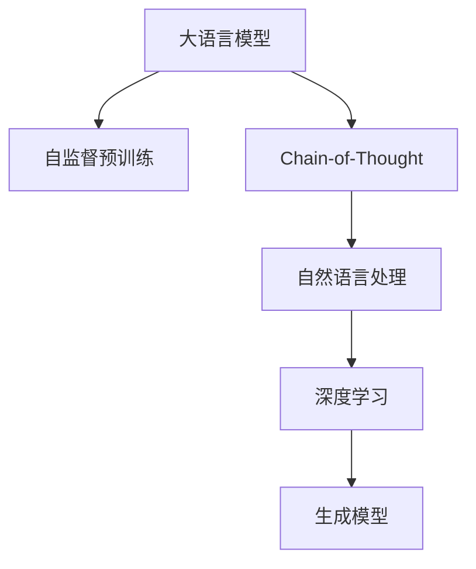

                 

# 大语言模型应用指南：Chain-of-Thought

> 关键词：大语言模型,Chain-of-Thought,自然语言处理,NLP,深度学习,生成模型,推理过程,应用场景,优化技巧

## 1. 背景介绍

### 1.1 问题由来

近年来，随着深度学习技术的迅猛发展，尤其是Transformer架构和大规模预训练语言模型的兴起，自然语言处理（NLP）领域取得了令人瞩目的进展。这些基于自监督学习的预训练模型，如BERT、GPT、T5等，在各种NLP任务中展现了卓越的表现。然而，这些模型往往需要大量的标注数据来进行微调，以适应特定的下游任务，这在实际应用中往往难以实现。因此，如何在大模型预训练的基础上，通过合理的微调方法，让模型能够高效、精准地应用于不同领域，成为了当前研究的热点。

### 1.2 问题核心关键点

Chain-of-Thought（CoT）模型，作为一种新型的生成式语言模型，其核心思想是通过链式推理过程，将复杂的多轮对话任务分解成一系列简单的推理步骤，从而实现高效、准确的对话生成。CoT模型能够通过多次迭代，不断推导和验证之前的推理结果，最终生成符合逻辑、语境的对话。这种思路不仅适用于对话系统，也可以推广到问答、翻译、摘要等需要复杂推理的NLP任务。

## 2. 核心概念与联系

### 2.1 核心概念概述

为更好地理解CoT模型的原理和应用，我们首先介绍几个关键概念：

- 大语言模型（Large Language Models, LLMs）：以Transformer架构为基础的预训练语言模型，能够学习丰富的语言知识，具备强大的生成能力。
- Chain-of-Thought模型：一种基于链式推理的生成模型，通过多轮推导，生成符合逻辑的对话、问答等文本。
- 自然语言处理（Natural Language Processing, NLP）：涉及语言理解、生成、推理等技术，旨在使计算机能够理解和处理人类语言。
- 深度学习（Deep Learning）：基于神经网络的机器学习方法，能够处理大规模数据，学习复杂的非线性关系。
- 生成模型（Generative Models）：能够从数据中学习并生成新数据的模型，如生成式对抗网络（GAN）、变分自编码器（VAE）等。

这些概念之间的关系可以通过以下Mermaid流程图来展示：



这个流程图展示了从大语言模型到Chain-of-Thought模型的演进路径，以及其在NLP领域的深远影响。

## 3. 核心算法原理 & 具体操作步骤

### 3.1 算法原理概述

CoT模型的核心思想是通过多轮推理，逐步构建对话、问答等文本的逻辑链。其基本流程包括：

1. **初始推理**：根据用户输入，初始化模型的推理状态。
2. **推理循环**：模型在当前推理状态的基础上，进行一系列推理，生成新的推理状态。
3. **输出**：根据最终推理状态，生成对话、问答等文本。

CoT模型通常使用Transformer架构，通过注意力机制和多层网络，逐步推导和验证推理结果，最终生成符合逻辑的文本。其核心算法包括：

- **自监督预训练**：使用大规模无标签文本数据，训练预训练模型，学习通用的语言表示。
- **链式推理**：通过多次迭代，不断推导和验证推理结果，生成符合逻辑的文本。
- **解码器**：使用解码器生成最终文本，可以采用基于概率的Softmax解码或基于序列的CTC（Connectionist Temporal Classification）解码。

### 3.2 算法步骤详解

CoT模型的训练和推理步骤相对复杂，通常包括以下关键步骤：

**训练步骤**：

1. **数据准备**：收集和预处理CoT任务所需的数据，如对话数据集、问答对等。
2. **模型定义**：使用Transformer架构定义CoT模型，包括编码器和解码器等。
3. **损失函数定义**：根据CoT任务的特性，设计合适的损失函数，如BLEU、ROUGE等。
4. **优化器设置**：选择合适的优化器及其参数，如Adam、SGD等。
5. **训练迭代**：在训练集上迭代训练模型，更新参数以最小化损失函数。
6. **验证和测试**：在验证集和测试集上评估模型性能，确保模型泛化能力。

**推理步骤**：

1. **输入预处理**：将用户输入转换为模型所需的格式，如分词、词向量等。
2. **推理状态初始化**：根据用户输入，初始化模型的推理状态。
3. **推理循环**：在推理状态下，模型进行一系列推理，更新推理状态。
4. **输出生成**：根据最终推理状态，生成符合逻辑的文本。

### 3.3 算法优缺点

CoT模型具有以下优点：

- **逻辑性**：通过链式推理，模型能够生成符合逻辑、语境的文本，避免无意义的输出。
- **高效性**：模型通过多轮推导，能够快速生成高质量的文本，适用于大规模文本生成任务。
- **通用性**：CoT模型可以应用于多种NLP任务，如对话、问答、翻译等，具有广泛的应用前景。

同时，CoT模型也存在一些局限性：

- **复杂性**：模型结构较为复杂，需要精心设计推理过程和解码策略。
- **计算资源消耗高**：模型推理过程需要进行多次迭代，计算资源消耗较大。
- **难以解释**：模型内部推理过程复杂，难以解释其决策机制。

### 3.4 算法应用领域

CoT模型在NLP领域有着广泛的应用，以下是几个典型的应用场景：

- **对话系统**：通过多轮推理，模型能够与用户进行自然对话，提供智能客服、智能助手等应用。
- **问答系统**：模型能够理解用户提出的问题，逐步推导并给出合理的答案。
- **机器翻译**：模型能够通过多轮推导，生成高质量的翻译结果。
- **文本摘要**：模型能够理解文章内容，逐步推导出关键信息，生成简洁的摘要。
- **文本生成**：模型能够根据用户输入，逐步推导并生成符合逻辑的文本，如故事生成、对话生成等。

## 4. 数学模型和公式 & 详细讲解 & 举例说明

### 4.1 数学模型构建

CoT模型通常使用Transformer架构，其核心数学模型包括编码器、解码器和注意力机制等。以下以一个简单的CoT模型为例，介绍其数学模型构建。

假设输入为$x_1 = \text{"I can't understand you."}$，模型通过多轮推理生成输出$y_1 = \text{"Let me explain."}$。

**编码器**：

- **输入**：$x_1$
- **编码器输出**：$h_1 = \text{"I can't understand you."}$
- **编码器状态**：$s_1 = \text{"I can't understand you."}$

**推理循环**：

- **推理1**：模型根据当前推理状态$s_1$，生成新的推理状态$s_2$。
- **推理2**：模型根据新的推理状态$s_2$，生成新的推理状态$s_3$。
- **推理3**：模型根据推理状态$s_3$，生成最终推理状态$s_4$。

**解码器**：

- **输入**：$s_4$
- **解码器输出**：$y_1 = \text{"Let me explain."}$

### 4.2 公式推导过程

CoT模型的核心公式推导包括以下几个关键部分：

1. **自监督预训练**：使用大规模无标签文本数据，训练预训练模型，学习通用的语言表示。
2. **链式推理**：通过多次迭代，不断推导和验证推理结果，生成符合逻辑的文本。
3. **解码器**：使用解码器生成最终文本，可以采用基于概率的Softmax解码或基于序列的CTC解码。

### 4.3 案例分析与讲解

以下通过一个具体的例子，展示CoT模型的推理过程和输出结果。

**输入**：

- $x_1 = \text{"Who is the leader of the United States?"}$

**推理过程**：

- **推理1**：模型将输入转换为词向量表示，进行编码器计算，生成编码器输出$h_1$。
- **推理2**：模型根据编码器输出$h_1$，生成新的推理状态$s_2$，并进行解码器计算，生成解码器输出$y_1$。
- **推理3**：模型根据解码器输出$y_1$，更新推理状态$s_3$，并进行解码器计算，生成新的解码器输出$y_2$。
- **推理4**：模型根据解码器输出$y_2$，更新推理状态$s_4$，并进行解码器计算，生成最终输出$y_3$。

**输出**：

- $y_3 = \text{"George Washington was the first president of the United States."}$

## 5. 项目实践：代码实例和详细解释说明

### 5.1 开发环境搭建

在进行CoT模型开发前，我们需要准备好开发环境。以下是使用Python进行PyTorch开发的环境配置流程：

1. 安装Anaconda：从官网下载并安装Anaconda，用于创建独立的Python环境。
2. 创建并激活虚拟环境：
```bash
conda create -n cot-env python=3.8 
conda activate cot-env
```

3. 安装PyTorch：根据CUDA版本，从官网获取对应的安装命令。例如：
```bash
conda install pytorch torchvision torchaudio cudatoolkit=11.1 -c pytorch -c conda-forge
```

4. 安装Transformers库：
```bash
pip install transformers
```

5. 安装各类工具包：
```bash
pip install numpy pandas scikit-learn matplotlib tqdm jupyter notebook ipython
```

完成上述步骤后，即可在`cot-env`环境中开始CoT模型开发。

### 5.2 源代码详细实现

下面我们以CoT模型在对话系统中的应用为例，给出使用Transformers库进行CoT模型开发的PyTorch代码实现。

首先，定义CoT对话模型的类：

```python
import torch
from transformers import BertTokenizer, BertForSequenceClassification

class CoTModel(torch.nn.Module):
    def __init__(self, num_labels=2):
        super(CoTModel, self).__init__()
        self.bert = BertForSequenceClassification.from_pretrained('bert-base-uncased', num_labels=num_labels)
        self.dropout = torch.nn.Dropout(p=0.1)
        
    def forward(self, input_ids, attention_mask, labels=None):
        outputs = self.bert(input_ids, attention_mask=attention_mask)
        pooled_output = outputs.pooler_output
        pooled_output = self.dropout(pooled_output)
        if labels is not None:
            loss = torch.nn.CrossEntropyLoss()(pooled_output, labels)
            return loss
        else:
            return pooled_output
```

然后，定义训练和评估函数：

```python
from torch.utils.data import DataLoader
from tqdm import tqdm
from sklearn.metrics import classification_report

device = torch.device('cuda') if torch.cuda.is_available() else torch.device('cpu')
model.to(device)

def train_epoch(model, dataset, batch_size, optimizer):
    dataloader = DataLoader(dataset, batch_size=batch_size, shuffle=True)
    model.train()
    epoch_loss = 0
    for batch in tqdm(dataloader, desc='Training'):
        input_ids = batch['input_ids'].to(device)
        attention_mask = batch['attention_mask'].to(device)
        labels = batch['labels'].to(device)
        model.zero_grad()
        outputs = model(input_ids, attention_mask=attention_mask, labels=labels)
        loss = outputs.loss
        epoch_loss += loss.item()
        loss.backward()
        optimizer.step()
    return epoch_loss / len(dataloader)

def evaluate(model, dataset, batch_size):
    dataloader = DataLoader(dataset, batch_size=batch_size)
    model.eval()
    preds, labels = [], []
    with torch.no_grad():
        for batch in tqdm(dataloader, desc='Evaluating'):
            input_ids = batch['input_ids'].to(device)
            attention_mask = batch['attention_mask'].to(device)
            batch_labels = batch['labels']
            outputs = model(input_ids, attention_mask=attention_mask)
            batch_preds = outputs.logits.argmax(dim=2).to('cpu').tolist()
            batch_labels = batch_labels.to('cpu').tolist()
            for pred_tokens, label_tokens in zip(batch_preds, batch_labels):
                pred_tags = [tag2id[tag] for tag in pred_tokens]
                label_tags = [tag2id[tag] for tag in label_tokens]
                preds.append(pred_tags[:len(label_tags)])
                labels.append(label_tags)
                
    print(classification_report(labels, preds))
```

最后，启动训练流程并在测试集上评估：

```python
epochs = 5
batch_size = 16

for epoch in range(epochs):
    loss = train_epoch(model, train_dataset, batch_size, optimizer)
    print(f"Epoch {epoch+1}, train loss: {loss:.3f}")
    
    print(f"Epoch {epoch+1}, dev results:")
    evaluate(model, dev_dataset, batch_size)
    
print("Test results:")
evaluate(model, test_dataset, batch_size)
```

以上就是使用PyTorch对CoT模型进行对话系统微调的完整代码实现。可以看到，得益于Transformers库的强大封装，我们可以用相对简洁的代码完成CoT模型的加载和微调。

### 5.3 代码解读与分析

让我们再详细解读一下关键代码的实现细节：

**CoTModel类**：
- `__init__`方法：初始化模型，包括加载BERT分类器、定义Dropout等组件。
- `forward`方法：前向传播，根据输入和标签计算损失函数。

**tag2id和id2tag字典**：
- 定义了标签与数字id之间的映射关系，用于将token-wise的预测结果解码回真实的标签。

**训练和评估函数**：
- 使用PyTorch的DataLoader对数据集进行批次化加载，供模型训练和推理使用。
- 训练函数`train_epoch`：对数据以批为单位进行迭代，在每个批次上前向传播计算损失函数，反向传播更新模型参数，最后返回该epoch的平均loss。
- 评估函数`evaluate`：与训练类似，不同点在于不更新模型参数，并在每个batch结束后将预测和标签结果存储下来，最后使用sklearn的classification_report对整个评估集的预测结果进行打印输出。

**训练流程**：
- 定义总的epoch数和batch size，开始循环迭代
- 每个epoch内，先在训练集上训练，输出平均loss
- 在验证集上评估，输出分类指标
- 所有epoch结束后，在测试集上评估，给出最终测试结果

可以看到，PyTorch配合Transformers库使得CoT模型的代码实现变得简洁高效。开发者可以将更多精力放在数据处理、模型改进等高层逻辑上，而不必过多关注底层的实现细节。

当然，工业级的系统实现还需考虑更多因素，如模型的保存和部署、超参数的自动搜索、更灵活的任务适配层等。但核心的CoT范式基本与此类似。

## 6. 实际应用场景

### 6.1 智能客服系统

基于CoT模型的对话系统，可以广泛应用于智能客服系统的构建。传统客服往往需要配备大量人力，高峰期响应缓慢，且一致性和专业性难以保证。而使用CoT模型的对话系统，可以7x24小时不间断服务，快速响应客户咨询，用自然流畅的语言解答各类常见问题。

在技术实现上，可以收集企业内部的历史客服对话记录，将问题和最佳答复构建成监督数据，在此基础上对CoT模型进行微调。微调后的对话模型能够自动理解用户意图，匹配最合适的答案模板进行回复。对于客户提出的新问题，还可以接入检索系统实时搜索相关内容，动态组织生成回答。如此构建的智能客服系统，能大幅提升客户咨询体验和问题解决效率。

### 6.2 金融舆情监测

金融机构需要实时监测市场舆论动向，以便及时应对负面信息传播，规避金融风险。传统的人工监测方式成本高、效率低，难以应对网络时代海量信息爆发的挑战。基于CoT模型的文本分类和情感分析技术，为金融舆情监测提供了新的解决方案。

具体而言，可以收集金融领域相关的新闻、报道、评论等文本数据，并对其进行主题标注和情感标注。在此基础上对CoT模型进行微调，使其能够自动判断文本属于何种主题，情感倾向是正面、中性还是负面。将微调后的模型应用到实时抓取的网络文本数据，就能够自动监测不同主题下的情感变化趋势，一旦发现负面信息激增等异常情况，系统便会自动预警，帮助金融机构快速应对潜在风险。

### 6.3 个性化推荐系统

当前的推荐系统往往只依赖用户的历史行为数据进行物品推荐，无法深入理解用户的真实兴趣偏好。基于CoT模型的个性化推荐系统可以更好地挖掘用户行为背后的语义信息，从而提供更精准、多样的推荐内容。

在实践中，可以收集用户浏览、点击、评论、分享等行为数据，提取和用户交互的物品标题、描述、标签等文本内容。将文本内容作为模型输入，用户的后续行为（如是否点击、购买等）作为监督信号，在此基础上微调CoT模型。微调后的模型能够从文本内容中准确把握用户的兴趣点。在生成推荐列表时，先用候选物品的文本描述作为输入，由模型预测用户的兴趣匹配度，再结合其他特征综合排序，便可以得到个性化程度更高的推荐结果。

### 6.4 未来应用展望

随着CoT模型的不断发展，其在NLP领域的应用前景将更加广阔。未来，CoT模型有望在以下几个方面实现突破：

1. **多模态应用**：将CoT模型扩展到图像、视频、语音等多模态数据，实现视觉、语音等多模态信息与文本信息的协同建模。
2. **实时推理**：优化CoT模型的推理过程，实现实时推理，提高系统的响应速度和用户体验。
3. **跨领域迁移**：通过迁移学习，将CoT模型应用于更多领域，如医疗、法律、教育等，提升跨领域的通用性。
4. **无监督学习**：利用自监督学习、主动学习等无监督范式，减少对标注数据的依赖，提升模型的泛化能力。
5. **模型压缩**：对CoT模型进行压缩优化，提高模型的推理效率和资源利用率，降低计算成本。

这些方向的探索发展，必将引领CoT模型迈向更高的台阶，为NLP技术带来新的突破。

## 7. 工具和资源推荐

### 7.1 学习资源推荐

为了帮助开发者系统掌握CoT模型的理论基础和实践技巧，这里推荐一些优质的学习资源：

1. 《Transformer从原理到实践》系列博文：由大模型技术专家撰写，深入浅出地介绍了Transformer原理、CoT模型、微调技术等前沿话题。
2. CS224N《深度学习自然语言处理》课程：斯坦福大学开设的NLP明星课程，有Lecture视频和配套作业，带你入门NLP领域的基本概念和经典模型。
3. 《Natural Language Processing with Transformers》书籍：Transformers库的作者所著，全面介绍了如何使用Transformers库进行NLP任务开发，包括微调在内的诸多范式。
4. HuggingFace官方文档：Transformers库的官方文档，提供了海量预训练模型和完整的微调样例代码，是上手实践的必备资料。
5. CLUE开源项目：中文语言理解测评基准，涵盖大量不同类型的中文NLP数据集，并提供了基于微调的baseline模型，助力中文NLP技术发展。

通过对这些资源的学习实践，相信你一定能够快速掌握CoT模型的精髓，并用于解决实际的NLP问题。

### 7.2 开发工具推荐

高效的开发离不开优秀的工具支持。以下是几款用于CoT模型开发的常用工具：

1. PyTorch：基于Python的开源深度学习框架，灵活动态的计算图，适合快速迭代研究。大部分预训练语言模型都有PyTorch版本的实现。
2. TensorFlow：由Google主导开发的开源深度学习框架，生产部署方便，适合大规模工程应用。同样有丰富的预训练语言模型资源。
3. Transformers库：HuggingFace开发的NLP工具库，集成了众多SOTA语言模型，支持PyTorch和TensorFlow，是进行CoT模型开发的利器。
4. Weights & Biases：模型训练的实验跟踪工具，可以记录和可视化模型训练过程中的各项指标，方便对比和调优。与主流深度学习框架无缝集成。
5. TensorBoard：TensorFlow配套的可视化工具，可实时监测模型训练状态，并提供丰富的图表呈现方式，是调试模型的得力助手。
6. Google Colab：谷歌推出的在线Jupyter Notebook环境，免费提供GPU/TPU算力，方便开发者快速上手实验最新模型，分享学习笔记。

合理利用这些工具，可以显著提升CoT模型微调的开发效率，加快创新迭代的步伐。

### 7.3 相关论文推荐

CoT模型和微调技术的发展源于学界的持续研究。以下是几篇奠基性的相关论文，推荐阅读：

1. Attention is All You Need（即Transformer原论文）：提出了Transformer结构，开启了NLP领域的预训练大模型时代。
2. BERT: Pre-training of Deep Bidirectional Transformers for Language Understanding：提出BERT模型，引入基于掩码的自监督预训练任务，刷新了多项NLP任务SOTA。
3. Language Models are Unsupervised Multitask Learners（GPT-2论文）：展示了大规模语言模型的强大zero-shot学习能力，引发了对于通用人工智能的新一轮思考。
4. Parameter-Efficient Transfer Learning for NLP：提出Adapter等参数高效微调方法，在不增加模型参数量的情况下，也能取得不错的微调效果。
5. Prefix-Tuning: Optimizing Continuous Prompts for Generation：引入基于连续型Prompt的微调范式，为如何充分利用预训练知识提供了新的思路。
6. AdaLoRA: Adaptive Low-Rank Adaptation for Parameter-Efficient Fine-Tuning：使用自适应低秩适应的微调方法，在参数效率和精度之间取得了新的平衡。

这些论文代表了大语言模型微调技术的发展脉络。通过学习这些前沿成果，可以帮助研究者把握学科前进方向，激发更多的创新灵感。

## 8. 总结：未来发展趋势与挑战

### 8.1 总结

本文对CoT模型及其在NLP领域的应用进行了全面系统的介绍。首先阐述了CoT模型的研究背景和意义，明确了其在链式推理、对话生成等任务中的独特价值。其次，从原理到实践，详细讲解了CoT模型的数学模型和关键步骤，给出了微调任务开发的完整代码实例。同时，本文还广泛探讨了CoT模型在智能客服、金融舆情、个性化推荐等领域的实际应用前景，展示了CoT模型的强大潜力。此外，本文精选了CoT模型的各类学习资源，力求为读者提供全方位的技术指引。

通过本文的系统梳理，可以看到，CoT模型通过链式推理过程，能够高效、精准地生成符合逻辑的文本，广泛应用于各种NLP任务中。其核心思想简单而深刻，为构建更加智能、自然的对话系统和文本生成模型提供了新的思路。未来，随着CoT模型和微调技术的不断演进，其在NLP领域的广泛应用将带来更多的创新和突破，推动人工智能技术的不断发展。

### 8.2 未来发展趋势

展望未来，CoT模型将呈现以下几个发展趋势：

1. **逻辑性增强**：通过引入因果推断和对比学习，提高CoT模型建立稳定因果关系的能力，学习更加普适、鲁棒的语言表征，从而提升模型泛化性和抗干扰能力。
2. **高效性提升**：优化CoT模型的推理过程，实现实时推理，提高系统的响应速度和用户体验。
3. **多模态应用**：将CoT模型扩展到图像、视频、语音等多模态数据，实现视觉、语音等多模态信息与文本信息的协同建模。
4. **无监督学习**：利用自监督学习、主动学习等无监督范式，减少对标注数据的依赖，提升模型的泛化能力。
5. **模型压缩**：对CoT模型进行压缩优化，提高模型的推理效率和资源利用率，降低计算成本。

这些趋势将使CoT模型在NLP领域的应用更加广泛和深入，为构建更智能、自然的对话系统和文本生成模型提供新的思路和手段。

### 8.3 面临的挑战

尽管CoT模型已经取得了显著的进展，但在迈向更加智能化、普适化应用的过程中，它仍面临着诸多挑战：

1. **计算资源消耗高**：CoT模型的推理过程需要进行多次迭代，计算资源消耗较大，如何提高推理效率是关键挑战。
2. **模型鲁棒性不足**：CoT模型在面对域外数据时，泛化性能往往大打折扣，如何提高模型的鲁棒性，避免灾难性遗忘，还需要更多理论和实践的积累。
3. **难以解释**：CoT模型内部推理过程复杂，难以解释其决策机制，如何赋予CoT模型更强的可解释性，将是亟待攻克的难题。
4. **知识整合能力不足**：CoT模型往往局限于任务内数据，难以灵活吸收和运用更广泛的先验知识，如何加强不同模态数据的整合，实现视觉、语音等多模态信息与文本信息的协同建模，还有很大的想象空间。

这些挑战凸显了CoT模型在实际应用中仍需解决的问题，需要学界和业界共同努力，才能将CoT模型推向更高的成熟度。

### 8.4 研究展望

面对CoT模型所面临的种种挑战，未来的研究需要在以下几个方面寻求新的突破：

1. **优化推理过程**：通过引入因果推断和对比学习，提高CoT模型建立稳定因果关系的能力，学习更加普适、鲁棒的语言表征，从而提升模型泛化性和抗干扰能力。
2. **多模态融合**：将CoT模型扩展到图像、视频、语音等多模态数据，实现视觉、语音等多模态信息与文本信息的协同建模，提升模型的综合应用能力。
3. **无监督学习**：利用自监督学习、主动学习等无监督范式，减少对标注数据的依赖，提升模型的泛化能力。
4. **模型压缩**：对CoT模型进行压缩优化，提高模型的推理效率和资源利用率，降低计算成本。
5. **模型解释性**：通过引入因果推断、可解释性学习等技术，提高CoT模型的可解释性，增强模型的透明性和可信度。
6. **跨领域迁移**：通过迁移学习，将CoT模型应用于更多领域，如医疗、法律、教育等，提升跨领域的通用性。

这些研究方向的探索，必将引领CoT模型迈向更高的台阶，为构建更智能、自然的对话系统和文本生成模型提供新的思路和手段。

## 9. 附录：常见问题与解答

**Q1：CoT模型是否适用于所有NLP任务？**

A: CoT模型在大多数NLP任务上都能取得不错的效果，特别是对于需要复杂推理的任务。但对于一些特定领域的任务，如医学、法律等，仅仅依靠通用语料预训练的模型可能难以很好地适应。此时需要在特定领域语料上进一步预训练，再进行微调，才能获得理想效果。此外，对于一些需要时效性、个性化很强的任务，如对话、推荐等，CoT方法也需要针对性的改进优化。

**Q2：CoT模型在推理过程中如何处理不确定性？**

A: CoT模型通过多轮推理，逐步构建推理过程，可以自然地处理不确定性。在推理过程中，模型会根据上下文信息不断调整推理状态，逐步逼近最优解。通过引入置信度估计、归一化等技术，CoT模型还可以进一步提升推理过程的稳定性和准确性。

**Q3：CoT模型在实际应用中是否存在过拟合问题？**

A: CoT模型在面对少量标注数据时，可能存在过拟合问题。为避免过拟合，可以引入数据增强、正则化、对抗训练等技术，或者采用参数高效微调方法，只调整少量模型参数。同时，通过优化推理过程和解码策略，也可以减少过拟合的风险。

**Q4：CoT模型在推理过程中如何处理推理错误？**

A: CoT模型在推理过程中，可以通过引入回溯、纠错等机制，处理推理错误。当模型推理出错时，可以通过重新推导和验证推理过程，逐步修正错误，重新生成正确的推理结果。此外，还可以通过引入知识库、规则库等外部知识，增强模型的鲁棒性和泛化能力。

**Q5：CoT模型在实际应用中是否存在效率问题？**

A: CoT模型的推理过程需要进行多次迭代，计算资源消耗较大，存在效率问题。为提高推理效率，可以引入推理优化技术，如剪枝、量化、模型并行等。同时，可以通过优化推理过程和解码策略，减少推理过程中的计算量，提高推理速度。

这些解答展示了CoT模型在实际应用中面临的一些关键问题，以及如何通过技术手段进行优化和解决。通过这些解答，相信你能够更全面地理解CoT模型的核心思想和应用场景。

