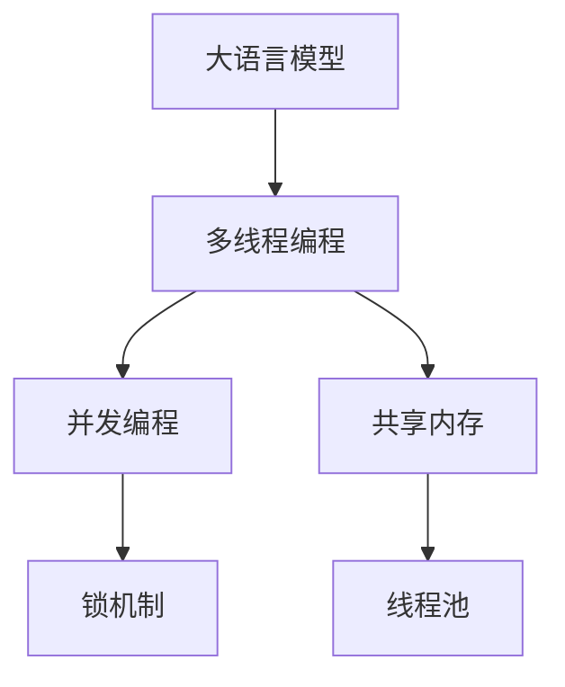

                 

# 大语言模型应用指南：线程

> 关键词：大语言模型,线程,多线程编程,并发编程,共享内存,锁机制,Python,线程池

## 1. 背景介绍

### 1.1 问题由来

在大语言模型的应用中，常常需要处理大量的数据，包括输入数据的预处理、特征提取、模型训练以及结果输出等环节。这些环节往往需要耗费大量的计算资源和时间，特别是当处理的数据量非常大时，单线程的处理方式显然无法满足需求。因此，多线程编程成为了一种非常自然的选择，能够有效提高处理效率和响应速度。

但是，多线程编程也存在一些问题，如线程间的共享内存、锁机制、线程安全等。这些问题如果处理不当，可能导致程序的性能下降、数据不一致、死锁等问题。因此，本文将从多线程编程的基本概念、常用工具、具体应用场景等方面，详细介绍大语言模型在多线程编程中的应用，并给出实际应用中的示例代码，帮助读者更好地理解和应用多线程编程技术。

## 2. 核心概念与联系

### 2.1 核心概念概述

为更好地理解大语言模型在多线程编程中的应用，本节将介绍几个密切相关的核心概念：

- **大语言模型(Large Language Model, LLM)**：指通过大规模语料库进行预训练，能够自动生成文本的模型，如BERT、GPT-3等。
- **多线程编程**：指在一个程序中创建多个线程，每个线程独立执行任务，并共享部分数据结构的一种编程方式。
- **并发编程**：指在程序中同时执行多个任务，以提高处理效率和响应速度的编程方式。
- **共享内存**：指多个线程访问同一个内存区域，以共享数据。
- **锁机制**：指多个线程访问共享内存时，通过锁来保证数据的一致性和互斥访问的机制。
- **线程池**：指预先创建一定数量的线程，用于管理任务分配和执行的机制。

这些核心概念之间的逻辑关系可以通过以下Mermaid流程图来展示：



这个流程图展示了大语言模型、多线程编程、并发编程、共享内存、锁机制、线程池等概念之间的逻辑关系：

1. 大语言模型通过多线程编程和并发编程，可以更好地处理大规模数据，提高计算效率和响应速度。
2. 多线程编程和并发编程常常涉及共享内存和锁机制，用于保证数据的一致性和互斥访问。
3. 线程池是一种常用的线程管理机制，可以更好地分配和复用线程资源。

这些概念共同构成了大语言模型多线程编程的应用框架，使得多线程编程在大语言模型中得以广泛应用。

## 3. 核心算法原理 & 具体操作步骤
### 3.1 算法原理概述

大语言模型在多线程编程中的应用，本质上是一个并行计算和数据处理的过程。其核心思想是：将大语言模型的处理任务分为多个子任务，分配给多个线程并行执行，从而提高处理效率和响应速度。

具体来说，多线程编程通常分为以下几个步骤：

1. **任务分解**：将大语言模型的处理任务分解为多个子任务，每个子任务可以独立执行，不依赖其他任务。
2. **线程创建**：根据任务数量创建相应数量的线程，每个线程负责执行一个子任务。
3. **数据共享**：线程之间共享部分数据结构，如模型参数、中间结果等。
4. **锁机制**：使用锁机制保证线程间对共享数据的一致性和互斥访问。
5. **任务合并**：将各个线程的执行结果合并，得到最终的处理结果。

### 3.2 算法步骤详解

以下是详细的多线程编程算法步骤：

**Step 1: 任务分解**
- 将大语言模型的处理任务分解为多个子任务。例如，将大规模语料库分成多个小批次，每个批次作为一个子任务。

**Step 2: 线程创建**
- 根据任务数量创建相应数量的线程。例如，根据小批次数目创建多个线程，每个线程负责处理一个小批次。
- 在Python中，可以使用`threading`模块创建线程，示例代码如下：

```python
import threading

# 创建线程
thread1 = threading.Thread(target=process_batch, args=(batch1,))
thread2 = threading.Thread(target=process_batch, args=(batch2,))

# 启动线程
thread1.start()
thread2.start()
```

其中，`process_batch`是处理小批次任务的函数，`args`参数用于传递小批次数据。

**Step 3: 数据共享**
- 使用共享内存机制，让多个线程能够访问和修改共享数据。例如，可以使用`multiprocessing`模块中的`Array`类来实现共享数组，示例代码如下：

```python
from multiprocessing import Array

# 创建共享数组
shared_array = Array('i', (100,))

# 多个线程访问共享数组
for i in range(100):
    shared_array[i] = i
```

**Step 4: 锁机制**
- 使用锁机制保证多个线程对共享数据的一致性和互斥访问。例如，可以使用`threading.Lock`类实现锁机制，示例代码如下：

```python
import threading

# 创建锁对象
lock = threading.Lock()

# 多个线程访问共享数据
lock.acquire()
shared_data = process_data()
lock.release()
```

**Step 5: 任务合并**
- 将各个线程的执行结果合并，得到最终的处理结果。例如，将多个小批次的处理结果合并成一个大批次，示例代码如下：

```python
# 合并处理结果
merged_batch = []
for i in range(len(thread_results)):
    merged_batch.append(thread_results[i])
```

通过以上步骤，可以实现大语言模型在多线程编程中的应用。

### 3.3 算法优缺点

大语言模型在多线程编程中的应用，具有以下优点：

1. **提高效率**：通过将任务分解为多个子任务并行执行，可以大大提高处理效率和响应速度。
2. **降低资源消耗**：多个线程可以共享同一台机器的资源，从而降低资源消耗。
3. **提高并行度**：多线程编程可以充分利用多核处理器的性能，提高并行度。

同时，大语言模型在多线程编程中也存在一些缺点：

1. **实现复杂**：多线程编程需要考虑线程同步、数据共享、锁机制等问题，实现相对复杂。
2. **资源竞争**：多个线程对共享资源的竞争可能导致数据不一致、死锁等问题。
3. **性能瓶颈**：线程数过多可能导致上下文切换频繁，反而降低性能。

## 4. 数学模型和公式 & 详细讲解 & 举例说明

### 4.1 数学模型构建

在大语言模型的多线程编程中，常常需要对大规模数据进行并行计算和处理。例如，需要对大规模语料库进行预处理、特征提取、模型训练等操作。以下是一个简单的数学模型，用于计算一个批次的数据处理结果：

设 $x$ 表示一个批次的数据，$y$ 表示该批次的数据处理结果。则数学模型可以表示为：

$$
y = f(x)
$$

其中 $f$ 表示数据处理函数，可以是一个神经网络、一个算法等。

### 4.2 公式推导过程

假设有一个包含 $n$ 个数据的批次，需要将其分为 $m$ 个线程进行处理，每个线程处理 $k$ 个数据。则公式可以推导如下：

1. 将数据分为 $m$ 个批次，每个批次包含 $k$ 个数据：

$$
\begin{aligned}
x_1 &= \{x_1, x_2, \ldots, x_k\} \\
x_2 &= \{x_{k+1}, x_{k+2}, \ldots, x_{2k}\} \\
&\vdots \\
x_m &= \{x_{(m-1)k+1}, x_{(m-1)k+2}, \ldots, x_{nk}\}
\end{aligned}
$$

2. 将数据分别传递给 $m$ 个线程进行处理，每个线程处理 $k$ 个数据：

$$
y_1 = f(x_1), y_2 = f(x_2), \ldots, y_m = f(x_m)
$$

3. 将每个线程的处理结果合并，得到最终的处理结果：

$$
y = \begin{bmatrix}
y_1^T \\
y_2^T \\
\vdots \\
y_m^T
\end{bmatrix}
$$

其中 $y_1, y_2, \ldots, y_m$ 表示每个线程的处理结果，$y$ 表示最终的处理结果。

### 4.3 案例分析与讲解

以下是一个简单的案例，用于说明大语言模型在多线程编程中的应用：

假设有一个包含 1000 个数据的批次，需要将其分为 10 个线程进行处理，每个线程处理 100 个数据。则公式可以推导如下：

1. 将数据分为 10 个批次，每个批次包含 100 个数据：

$$
\begin{aligned}
x_1 &= \{x_1, x_2, \ldots, x_{100}\} \\
x_2 &= \{x_{101}, x_{102}, \ldots, x_{200}\} \\
&\vdots \\
x_{10} &= \{x_{901}, x_{902}, \ldots, x_{1000}\}
\end{aligned}
$$

2. 将数据分别传递给 10 个线程进行处理，每个线程处理 100 个数据：

$$
y_1 = f(x_1), y_2 = f(x_2), \ldots, y_{10} = f(x_{10})
$$

3. 将每个线程的处理结果合并，得到最终的处理结果：

$$
y = \begin{bmatrix}
y_1^T \\
y_2^T \\
\vdots \\
y_{10}^T
\end{bmatrix}
$$

其中 $y_1, y_2, \ldots, y_{10}$ 表示每个线程的处理结果，$y$ 表示最终的处理结果。

## 5. 项目实践：代码实例和详细解释说明

### 5.1 开发环境搭建

在进行多线程编程实践前，我们需要准备好开发环境。以下是使用Python进行多线程编程的环境配置流程：

1. 安装Anaconda：从官网下载并安装Anaconda，用于创建独立的Python环境。

2. 创建并激活虚拟环境：
```bash
conda create -n pytorch-env python=3.8 
conda activate pytorch-env
```

3. 安装Python多线程编程库：
```bash
pip install multiprocessing
```

4. 安装线程管理工具：
```bash
pip install threading
```

完成上述步骤后，即可在`pytorch-env`环境中开始多线程编程实践。

### 5.2 源代码详细实现

下面我们以处理大规模语料库为例，给出使用Python进行多线程编程的代码实现。

```python
import multiprocessing

# 创建线程池
pool = multiprocessing.Pool(processes=4)

# 处理数据函数
def process_data(data):
    # 对数据进行处理，返回处理结果
    return result

# 创建数据
data = create_data()

# 将数据分配给线程池
result = pool.map(process_data, data)

# 合并处理结果
merged_result = merge_results(result)

# 关闭线程池
pool.close()
pool.join()
```

其中，`multiprocessing.Pool`创建了一个包含4个线程的线程池，`process_data`是处理数据的函数，`data`是待处理的数据，`result`是处理结果。`pool.map`方法将数据分配给线程池进行并行处理，`merge_results`方法将各个线程的处理结果合并。

### 5.3 代码解读与分析

让我们再详细解读一下关键代码的实现细节：

**multiprocessing.Pool**：
- 创建线程池：`multiprocessing.Pool`用于创建线程池，`processes`参数用于指定线程数量。
- 多线程编程：`Pool`中的线程自动分配和回收，可以方便地管理任务。

**process_data函数**：
- 处理数据函数：`process_data`是处理数据的函数，可以是一个神经网络、一个算法等。

**pool.map方法**：
- 分配任务：`pool.map`将数据分配给线程池进行并行处理，`process_data`函数在每个线程中执行一次。
- 自动调度：`map`方法自动调度线程池中的线程，将任务均衡分配给各个线程。

**merge_results函数**：
- 合并结果：`merge_results`方法将各个线程的处理结果合并，得到最终的处理结果。

以上代码实现了一个简单的多线程编程任务，即处理大规模语料库。可以看到，使用Python的多线程编程库可以方便地实现多线程编程，提高处理效率和响应速度。

## 6. 实际应用场景

### 6.1 智能客服系统

在智能客服系统中，处理大量的客户咨询数据是一项非常耗时的任务。使用多线程编程可以提高处理效率和响应速度，提升客户体验。

在实际应用中，可以将客户咨询数据分配给多个线程进行并行处理，每个线程负责处理一部分数据。例如，将客户咨询数据按照时间戳或ID进行划分，每个线程处理一部分数据，最后合并处理结果，得到最终的处理结果。

### 6.2 金融舆情监测

在金融舆情监测中，处理大量的市场新闻、评论、舆情报告等数据是一项非常耗时的任务。使用多线程编程可以提高处理效率和响应速度，及时发现负面舆情。

在实际应用中，可以将舆情数据分配给多个线程进行并行处理，每个线程负责处理一部分数据。例如，将市场新闻、评论、舆情报告等数据按照时间戳或ID进行划分，每个线程处理一部分数据，最后合并处理结果，得到最终的处理结果。

### 6.3 个性化推荐系统

在个性化推荐系统中，处理大量的用户行为数据和物品数据是一项非常耗时的任务。使用多线程编程可以提高处理效率和响应速度，提升推荐效果。

在实际应用中，可以将用户行为数据和物品数据分配给多个线程进行并行处理，每个线程负责处理一部分数据。例如，将用户行为数据和物品数据按照时间戳或ID进行划分，每个线程处理一部分数据，最后合并处理结果，得到最终的处理结果。

### 6.4 未来应用展望

随着多线程编程和大语言模型的不断发展，多线程编程在大语言模型中的应用也将不断扩展，为更多领域带来变革性影响。

在智慧医疗领域，多线程编程可以用于处理大规模的医疗数据，提高诊疗效率和准确性。

在智能教育领域，多线程编程可以用于处理大规模的教育数据，提升教学质量和个性化推荐效果。

在智慧城市治理中，多线程编程可以用于处理大规模的城市数据，提高城市管理效率和响应速度。

此外，在企业生产、社会治理、文娱传媒等众多领域，多线程编程和大语言模型也将不断融合，为传统行业数字化转型升级提供新的技术路径。相信随着技术的日益成熟，多线程编程和大语言模型的结合将带来更多的创新突破，推动人工智能技术不断进步。

## 7. 工具和资源推荐
### 7.1 学习资源推荐

为了帮助开发者系统掌握大语言模型在多线程编程中的应用，这里推荐一些优质的学习资源：

1. 《Python线程编程》系列博文：由Python语言专家撰写，深入浅出地介绍了Python线程编程的基本概念、常用工具和具体应用。

2. 《并发编程的艺术》书籍：这是一本经典的并发编程书籍，涵盖了并发编程的各个方面，是学习并发编程的必备参考资料。

3. 《深入理解计算机系统》书籍：这本书介绍了计算机系统的各个方面，包括多线程编程、并发编程等，是学习计算机系统的重要参考资料。

4. Python官方文档：Python官方文档中包含了大量的多线程编程、并发编程、共享内存、锁机制等概念的详细介绍，是学习Python编程的重要参考资料。

5. HuggingFace官方文档：HuggingFace官方文档中包含了大量的多线程编程、共享内存、锁机制等概念的详细介绍，是学习大语言模型应用的重要参考资料。

通过对这些资源的学习实践，相信你一定能够系统掌握大语言模型在多线程编程中的应用，并用于解决实际的NLP问题。

### 7.2 开发工具推荐

高效的开发离不开优秀的工具支持。以下是几款用于大语言模型多线程编程开发的常用工具：

1. PyTorch：基于Python的开源深度学习框架，灵活动态的计算图，适合快速迭代研究。大部分大语言模型都有PyTorch版本的实现。

2. TensorFlow：由Google主导开发的开源深度学习框架，生产部署方便，适合大规模工程应用。同样有丰富的多线程编程工具。

3. multiprocessing：Python标准库中的多线程编程库，提供了简单易用的线程池和进程池功能，适合处理大规模数据。

4. threading：Python标准库中的线程库，提供了简单易用的线程管理功能，适合多线程编程。

5. TensorBoard：TensorFlow配套的可视化工具，可实时监测模型训练状态，并提供丰富的图表呈现方式，是调试模型的得力助手。

6. Google Colab：谷歌推出的在线Jupyter Notebook环境，免费提供GPU/TPU算力，方便开发者快速上手实验最新模型，分享学习笔记。

合理利用这些工具，可以显著提升大语言模型多线程编程任务的开发效率，加快创新迭代的步伐。

### 7.3 相关论文推荐

多线程编程和大语言模型的发展源于学界的持续研究。以下是几篇奠基性的相关论文，推荐阅读：

1. Parallel Programming in Python（PyTorch论文）：介绍了PyTorch中多线程编程的基本概念和具体应用。

2. Concurrent Programming in Python（TensorFlow论文）：介绍了TensorFlow中多线程编程的基本概念和具体应用。

3. Multi-threading for Deep Learning（深度学习多线程编程论文）：介绍了多线程编程在深度学习中的应用。

4. Distributed Training of Deep Neural Networks with GPUs（分布式深度学习多线程编程论文）：介绍了多线程编程在分布式深度学习中的应用。

这些论文代表了大语言模型多线程编程的发展脉络。通过学习这些前沿成果，可以帮助研究者把握学科前进方向，激发更多的创新灵感。

## 8. 总结：未来发展趋势与挑战

### 8.1 总结

本文对大语言模型在多线程编程中的应用进行了全面系统的介绍。首先阐述了多线程编程的基本概念和核心算法，详细讲解了多线程编程的数学模型和公式推导过程，并通过实际应用场景展示了多线程编程在大语言模型中的应用。

通过本文的系统梳理，可以看到，多线程编程在大语言模型中的应用，可以显著提高处理效率和响应速度，带来更好的用户体验。同时，多线程编程也存在一些挑战，如线程安全、锁机制、资源竞争等问题。如何更好地解决这些问题，提升大语言模型在多线程编程中的应用效果，还需进一步的研究和探索。

### 8.2 未来发展趋势

展望未来，多线程编程和大语言模型的结合将呈现以下几个发展趋势：

1. 多线程编程在大规模数据处理中的应用将越来越广泛，例如处理大规模语料库、大规模医疗数据、大规模教育数据等。

2. 多线程编程和分布式计算的结合将更加紧密，例如分布式深度学习、分布式数据处理等。

3. 多线程编程和云计算的结合将更加深入，例如在云平台上进行多线程编程和大规模数据处理。

4. 多线程编程和大数据处理技术的结合将更加紧密，例如大数据处理、分布式文件系统等。

5. 多线程编程和机器学习的结合将更加紧密，例如多线程编程在机器学习模型训练中的应用。

6. 多线程编程和人工智能技术的结合将更加紧密，例如多线程编程在人工智能应用中的优化和加速。

这些趋势凸显了多线程编程和大语言模型在实际应用中的巨大潜力，必将带来更多的创新突破，推动人工智能技术不断进步。

### 8.3 面临的挑战

尽管多线程编程和大语言模型在实际应用中取得了显著的进展，但在迈向更加智能化、普适化应用的过程中，它仍面临诸多挑战：

1. **线程安全问题**：多个线程对共享资源的竞争可能导致数据不一致、死锁等问题。如何保证线程安全，避免数据竞争，是未来需要解决的一个重要问题。

2. **锁机制问题**：锁机制的使用可能导致上下文切换频繁，降低线程并发度。如何优化锁机制，提高线程并发度，是未来需要解决的一个重要问题。

3. **资源竞争问题**：多个线程对共享资源的竞争可能导致资源瓶颈，降低处理效率。如何优化资源分配，提高资源利用率，是未来需要解决的一个重要问题。

4. **可扩展性问题**：多线程编程在大规模数据处理中的应用需要保证可扩展性，避免单线程瓶颈。如何优化任务分配和调度，提高可扩展性，是未来需要解决的一个重要问题。

5. **分布式计算问题**：多线程编程在大规模数据处理中的应用需要支持分布式计算，避免单节点瓶颈。如何优化分布式计算框架，提高分布式计算效率，是未来需要解决的一个重要问题。

6. **编程复杂性问题**：多线程编程和大规模数据处理的应用需要保证编程复杂性适中，避免过度复杂。如何简化编程模型，提高代码可维护性，是未来需要解决的一个重要问题。

这些挑战凸显了多线程编程和大语言模型在实际应用中的复杂性，需要进一步的研究和探索。

### 8.4 研究展望

未来的研究需要在以下几个方面寻求新的突破：

1. **优化锁机制**：设计高效的锁机制，减少锁的竞争次数，提高线程并发度。例如，使用无锁编程、读写锁机制等技术。

2. **优化资源分配**：设计高效的资源分配算法，避免资源竞争，提高资源利用率。例如，使用资源池、分布式资源调度等技术。

3. **优化任务调度**：设计高效的任务调度算法，避免单线程瓶颈，提高任务处理效率。例如，使用任务队列、任务并行化等技术。

4. **优化分布式计算**：设计高效的分布式计算框架，提高分布式计算效率。例如，使用Spark、Hadoop等分布式计算框架。

5. **简化编程模型**：设计简洁高效的编程模型，提高代码可维护性和可扩展性。例如，使用协程、异步编程等技术。

这些研究方向的探索，必将引领多线程编程和大语言模型迈向更高的台阶，为构建更高效、更智能、更普适的智能系统铺平道路。总之，多线程编程和大语言模型需要更多的研究支持，才能充分发挥其潜力，为人工智能技术带来更多的创新突破。

## 9. 附录：常见问题与解答

**Q1：多线程编程和大语言模型在实际应用中需要注意哪些问题？**

A: 在实际应用中，多线程编程和大语言模型需要注意以下几个问题：

1. **线程安全**：多个线程对共享资源的竞争可能导致数据不一致、死锁等问题。需要使用锁机制、原子操作等技术保证线程安全。

2. **锁机制优化**：锁机制的使用可能导致上下文切换频繁，降低线程并发度。需要使用读写锁机制、无锁编程等技术优化锁机制。

3. **资源竞争优化**：多个线程对共享资源的竞争可能导致资源瓶颈，降低处理效率。需要使用资源池、分布式资源调度等技术优化资源分配。

4. **任务调度优化**：多线程编程在大规模数据处理中的应用需要保证可扩展性，避免单线程瓶颈。需要使用任务队列、任务并行化等技术优化任务调度。

5. **分布式计算优化**：多线程编程在大规模数据处理中的应用需要支持分布式计算，避免单节点瓶颈。需要使用Spark、Hadoop等分布式计算框架。

**Q2：多线程编程和大语言模型在实际应用中的优势和劣势是什么？**

A: 多线程编程和大语言模型在实际应用中的优势和劣势如下：

优势：

1. **提高效率**：多线程编程和大语言模型可以同时处理多个任务，提高处理效率和响应速度。

2. **降低资源消耗**：多个线程可以共享同一台机器的资源，降低资源消耗。

3. **提高并行度**：多线程编程和大语言模型可以充分利用多核处理器的性能，提高并行度。

劣势：

1. **实现复杂**：多线程编程和大语言模型需要考虑线程同步、数据共享、锁机制等问题，实现相对复杂。

2. **资源竞争**：多个线程对共享资源的竞争可能导致数据不一致、死锁等问题。

3. **性能瓶颈**：线程数过多可能导致上下文切换频繁，反而降低性能。

**Q3：多线程编程和大语言模型在实际应用中如何解决锁机制问题？**

A: 在多线程编程和大语言模型的实际应用中，解决锁机制问题的方法如下：

1. **读写锁机制**：使用读写锁机制，读操作不需要锁，写操作需要锁，可以提高并发度。

2. **无锁编程**：使用无锁编程，避免使用锁机制，可以提高并发度，但需要保证数据的一致性和互斥访问。

3. **分布式锁机制**：使用分布式锁机制，避免单节点锁竞争，可以提高并发度。

4. **乐观锁机制**：使用乐观锁机制，读操作不需要锁，写操作需要检查版本号，可以提高并发度。

5. **原子操作**：使用原子操作，避免使用锁机制，可以提高并发度，但需要保证数据的一致性和互斥访问。

以上方法可以结合使用，根据具体应用场景选择合适的锁机制。

**Q4：多线程编程和大语言模型在实际应用中的优势是什么？**

A: 多线程编程和大语言模型在实际应用中的优势如下：

1. **提高效率**：多线程编程和大语言模型可以同时处理多个任务，提高处理效率和响应速度。

2. **降低资源消耗**：多个线程可以共享同一台机器的资源，降低资源消耗。

3. **提高并行度**：多线程编程和大语言模型可以充分利用多核处理器的性能，提高并行度。

4. **提高灵活性**：多线程编程和大语言模型可以灵活处理各种任务，适应不同的应用场景。

5. **提高可靠性**：多线程编程和大语言模型可以避免单线程瓶颈，提高系统的可靠性。

**Q5：多线程编程和大语言模型在实际应用中的劣势是什么？**

A: 多线程编程和大语言模型在实际应用中的劣势如下：

1. **实现复杂**：多线程编程和大语言模型需要考虑线程同步、数据共享、锁机制等问题，实现相对复杂。

2. **资源竞争**：多个线程对共享资源的竞争可能导致数据不一致、死锁等问题。

3. **性能瓶颈**：线程数过多可能导致上下文切换频繁，反而降低性能。

4. **可扩展性问题**：多线程编程在大规模数据处理中的应用需要保证可扩展性，避免单线程瓶颈。

5. **编程复杂性**：多线程编程和大规模数据处理的应用需要保证编程复杂性适中，避免过度复杂。

以上劣势需要通过优化锁机制、优化资源分配、优化任务调度等方法进行克服。

综上所述，多线程编程和大语言模型在实际应用中具有显著的优势，但也存在一些劣势。需要在实际应用中不断优化和改进，才能充分发挥其潜力，提升处理效率和响应速度，构建更高效、更智能、更普适的智能系统。

---

作者：禅与计算机程序设计艺术 / Zen and the Art of Computer Programming

