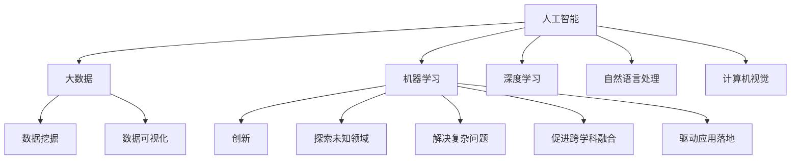

                 

# 好奇心：创新与发现的源泉

> 关键词：好奇心, 创新, 人工智能, 数据科学, 认知心理学

## 1. 背景介绍

### 1.1 问题由来

好奇心（Curiosity）是人类最原始和最强大的驱动力之一。自古以来，它就驱动着人类探索未知世界、发明创造、科技进步。作为“新石器时代的大脑”，好奇心促进了我们的认知发展，推动了人类文明进步。如今，随着人工智能(AI)和大数据技术的迅猛发展，好奇心也成为驱动科学创新和技术突破的核心动力。

在技术领域，好奇心不仅仅是对知识的渴望，更是一种发现问题、解决问题的能力。正是这种探索未知、勇于创新的精神，推动了AI和大数据技术的快速发展和广泛应用。从机器学习到深度学习，从大数据分析到AI伦理，每一个技术突破和应用案例，都源自对新奇问题的探索与解答。

### 1.2 问题核心关键点

好奇心在推动AI和大数据技术发展过程中，主要体现在以下几个方面：

- **探索未知领域**：通过好奇心驱动的探索性研究，发现和理解新领域、新问题，推动技术创新。
- **解决复杂问题**：好奇心驱使研究者深入分析复杂数据和现象，提出新方法和理论，解决实际问题。
- **促进跨学科融合**：好奇心激发跨学科合作，形成跨领域的知识融合，推动AI技术的深度发展。
- **驱动应用落地**：好奇心驱动的创新技术，能够更好地满足用户需求，促进AI技术的广泛应用。

## 2. 核心概念与联系

### 2.1 核心概念概述

为更好地理解好奇心在推动AI和大数据技术发展中的作用，本节将介绍几个密切相关的核心概念：

- **人工智能**：通过计算机模拟人类智能活动的技术。涵盖机器学习、深度学习、自然语言处理、计算机视觉等子领域。
- **大数据**：指结构化和非结构化数据的集合，用于分析挖掘，发现规律和知识。
- **创新**：通过新颖的思维和行为，创造新事物、新方法的过程。
- **认知心理学**：研究认知过程，如感知、记忆、思维等的科学，对理解好奇心有重要意义。

这些概念之间的逻辑关系可以通过以下Mermaid流程图来展示：



这个流程图展示了几者之间的逻辑关系：

1. 人工智能和数据分析是大数据处理的核心。
2. 机器学习和深度学习是人工智能的主要技术手段。
3. 自然语言处理和计算机视觉是人工智能的重要应用领域。
4. 大数据分析挖掘与可视化是发现新知识和规律的重要方法。
5. 创新是推动技术发展的动力。
6. 好奇心驱动探索未知领域、解决复杂问题、促进跨学科融合、驱动应用落地等。

## 3. 核心算法原理 & 具体操作步骤
### 3.1 算法原理概述

好奇心的本质是求知欲和探索未知的驱动力，在AI和大数据领域，好奇心驱动的创新通常体现在以下几个方面：

- **数据探索**：通过探索新的数据集、数据模式，发现新问题和规律。
- **模型创新**：创造新的算法和模型结构，提升数据处理和分析能力。
- **应用拓展**：将新技术和新方法应用于更广泛的领域，推动技术落地。

好奇心驱动的AI和大数据技术创新，主要遵循以下算法原理：

1. **数据探索与处理**：利用大数据技术，探索新数据，发现新模式。
2. **模型构建与训练**：基于数据探索结果，构建新模型，并通过训练提升模型效果。
3. **应用验证与优化**：在实际应用场景中验证模型效果，根据反馈进行优化，推动技术落地。

### 3.2 算法步骤详解

好奇心驱动的AI和大数据技术创新，主要包括以下几个关键步骤：

**Step 1: 数据采集与预处理**

- 收集不同领域、不同类型的数据，包括结构化数据、非结构化数据、图像、视频等。
- 清洗数据，处理缺失值、噪声和异常值，进行数据增强。

**Step 2: 数据探索与分析**

- 使用统计分析、聚类分析、关联规则挖掘等方法，探索数据中的规律和模式。
- 应用可视化工具，如Tableau、Power BI等，直观展示数据特征和关系。
- 引入探索性数据分析（EDA）方法，通过探索性统计描述和图形展示，发现数据中的异常点和复杂结构。

**Step 3: 模型构建与训练**

- 根据数据探索结果，设计合适的算法和模型结构，如回归模型、分类模型、聚类模型等。
- 选择合适的训练算法，如随机梯度下降（SGD）、Adam、Adagrad等，设置学习率、批大小、迭代轮数等超参数。
- 应用正则化技术，如L2正则、Dropout等，防止过拟合。
- 训练模型，评估模型效果，调整超参数，进行模型优化。

**Step 4: 模型验证与优化**

- 在实际应用场景中验证模型效果，如通过A/B测试、回归测试等方法评估模型性能。
- 根据反馈，调整模型结构，优化模型参数，提升模型效果。
- 使用强化学习等技术，动态调整模型策略，提升模型适应性。

**Step 5: 应用落地与迭代**

- 将模型集成到实际应用中，如智能推荐系统、聊天机器人、图像识别等。
- 收集用户反馈，监测系统运行状态，根据反馈进行模型迭代优化。
- 持续收集新数据，更新模型，确保模型不断适应新环境和新需求。

### 3.3 算法优缺点

好奇心驱动的AI和大数据技术创新，具有以下优点：

- **快速响应市场需求**：通过快速探索新数据和新问题，及时发现新机会，迅速响应市场需求。
- **提升技术水平**：好奇心驱动的探索性研究，推动算法和模型创新，提升数据处理和分析能力。
- **推动跨领域融合**：好奇心促进跨学科合作，形成跨领域的知识融合，推动技术深度发展。
- **实现技术落地**：好奇心驱动的应用拓展，推动新技术和新方法在实际场景中的应用，实现技术落地。

同时，该方法也存在一定的局限性：

- **高昂成本**：好奇心驱动的探索性研究需要大量的时间和资源投入，成本较高。
- **结果不确定性**：新问题和新数据往往具有不确定性，探索结果难以预测。
- **模型复杂性**：好奇心驱动的模型创新，可能导致模型结构复杂，难以解释。
- **迭代困难**：好奇心驱动的应用拓展，需要持续收集新数据和反馈，持续迭代优化，较难实现一次性落地。

尽管存在这些局限性，但就目前而言，好奇心驱动的探索性研究仍然是推动AI和大数据技术发展的重要方式。未来相关研究的重点在于如何平衡探索性和实用性，如何在保证创新性的同时降低成本和提高效率。

### 3.4 算法应用领域

好奇心驱动的AI和大数据技术创新，已在多个领域得到广泛应用，例如：

- **金融风控**：通过大数据分析，探索客户行为模式，发现潜在风险点，构建风控模型。
- **医疗健康**：利用医疗大数据，探索疾病特征和治疗方法，构建预测模型，提升诊疗效果。
- **智能制造**：通过数据分析和机器学习，探索生产过程优化方法，提升生产效率和质量。
- **智慧城市**：利用城市大数据，探索城市运行规律和治理方式，构建智能决策系统。
- **电子商务**：通过用户行为分析，探索用户需求和购买规律，提升推荐系统精准度。
- **教育科技**：利用教育大数据，探索学习模式和知识结构，构建个性化学习系统。

除了上述这些经典应用外，好奇心驱动的AI技术还将在更多场景中得到应用，为各行业带来变革性影响。

## 4. 数学模型和公式 & 详细讲解  
### 4.1 数学模型构建

好奇心驱动的AI和大数据技术创新，涉及多个领域的数学模型和算法，以下将以回归分析为例，给出其数学模型构建过程。

记回归问题为$Y=f(X)+\epsilon$，其中$X$为自变量，$Y$为因变量，$f$为回归函数，$\epsilon$为随机误差项。假设$X$和$Y$服从高斯分布，则回归问题可以表示为：

$$
Y|X=\theta=\theta_0+\sum_{i=1}^p\theta_ix_i+\epsilon
$$

其中$\theta=(\theta_0,\theta_1,\dots,\theta_p)$为回归系数向量。通过最小化均方误差损失函数，求解$\theta$：

$$
\hat{\theta}=\mathop{\arg\min}_{\theta} \sum_{i=1}^n(Y_i-f(X_i,\theta))^2
$$

使用梯度下降算法求解最优参数$\hat{\theta}$，其梯度公式为：

$$
\frac{\partial}{\partial\theta}L(\theta)=2\sum_{i=1}^n(Y_i-f(X_i,\theta))X_i
$$

在实际应用中，通过样本数据训练模型，求解回归系数$\hat{\theta}$，即可得到回归函数$f(X)$。

### 4.2 公式推导过程

回归分析是好奇心驱动的AI和大数据技术创新的重要工具，其核心思想是通过数据探索和模型训练，发现和解释数据中的规律。

在上述公式中，回归系数$\theta$是模型参数，通过最小化均方误差损失函数求解。该过程包括：

1. **数据探索**：收集和预处理数据，通过探索性分析（EDA）发现数据特征和模式。
2. **模型构建**：根据数据特征和模式，设计合适的回归模型，如线性回归、多项式回归等。
3. **模型训练**：通过最小化均方误差损失函数，训练回归模型，求解回归系数$\theta$。
4. **模型评估**：通过回归测试和预测误差，评估模型效果，调整模型参数，优化模型性能。

回归分析在金融、医疗、制造等众多领域得到广泛应用，成为探索数据规律和驱动技术创新的重要工具。

### 4.3 案例分析与讲解

**案例分析：智能推荐系统**

智能推荐系统是好奇心驱动的AI技术在电子商务领域的重要应用。通过探索用户行为数据，发现用户兴趣和购买规律，构建推荐模型，提升推荐效果。

具体步骤如下：

1. **数据采集与预处理**：收集用户行为数据，包括浏览记录、购买记录、评分记录等。
2. **数据探索与分析**：通过探索性分析（EDA），发现用户行为特征和商品关联关系。
3. **模型构建与训练**：设计推荐模型，如协同过滤、基于内容的推荐、混合推荐等，通过数据训练求解模型参数。
4. **模型验证与优化**：通过A/B测试等方法，评估推荐模型效果，根据反馈调整模型参数，优化推荐策略。
5. **应用落地与迭代**：将推荐模型集成到电商系统，实时推荐商品，收集用户反馈，持续迭代优化推荐算法。

智能推荐系统通过好奇心驱动的数据探索和模型创新，显著提升了电商平台的用户体验和转化率，成为电商业务的重要支撑。

## 5. 项目实践：代码实例和详细解释说明
### 5.1 开发环境搭建

在进行好奇心驱动的AI和大数据技术创新实践前，我们需要准备好开发环境。以下是使用Python进行Scikit-learn开发的环境配置流程：

1. 安装Anaconda：从官网下载并安装Anaconda，用于创建独立的Python环境。

2. 创建并激活虚拟环境：
```bash
conda create -n scikit-learn-env python=3.8 
conda activate scikit-learn-env
```

3. 安装Scikit-learn：
```bash
conda install scikit-learn
```

4. 安装其他相关工具包：
```bash
pip install numpy pandas matplotlib seaborn jupyter notebook ipython
```

完成上述步骤后，即可在`scikit-learn-env`环境中开始好奇心驱动的AI和大数据技术创新实践。

### 5.2 源代码详细实现

下面我们以线性回归模型为例，给出使用Scikit-learn对数据进行探索性分析、模型构建和训练的PyTorch代码实现。

```python
import numpy as np
import pandas as pd
from sklearn.model_selection import train_test_split
from sklearn.linear_model import LinearRegression
from sklearn.metrics import mean_squared_error

# 生成样本数据
np.random.seed(42)
n_samples, n_features = 100, 3
X = np.random.randn(n_samples, n_features)
y = X[:, 0] + np.random.randn(n_samples) * 0.1

# 创建数据框
df = pd.DataFrame(X, columns=['x1', 'x2', 'x3'])
df['y'] = y

# 划分训练集和测试集
X_train, X_test, y_train, y_test = train_test_split(df.drop('y', axis=1), df['y'], test_size=0.2, random_state=42)

# 线性回归模型
model = LinearRegression()

# 训练模型
model.fit(X_train, y_train)

# 预测并评估
y_pred = model.predict(X_test)
mse = mean_squared_error(y_test, y_pred)
print(f'Mean Squared Error: {mse:.3f}')
```

### 5.3 代码解读与分析

让我们再详细解读一下关键代码的实现细节：

**数据生成**：
- 使用`numpy`生成随机数据，包括特征$x_1,x_2,x_3$和目标变量$y$。
- 将数据构建成数据框`df`，方便后续处理。

**数据划分**：
- 使用`train_test_split`函数，将数据划分为训练集和测试集。
- 训练集占80%，测试集占20%。

**线性回归模型**：
- 使用`LinearRegression`类构建线性回归模型。
- 通过训练求解模型参数，拟合训练集数据。

**模型评估**：
- 使用`predict`函数预测测试集数据。
- 使用`mean_squared_error`函数计算预测误差，评估模型性能。

通过这段代码，可以看到Scikit-learn库对线性回归模型的简单实现过程，包括数据生成、数据划分、模型训练和评估等关键步骤。

## 6. 实际应用场景
### 6.1 金融风控

金融风控是好奇心驱动的AI技术在金融领域的重要应用。通过大数据分析，探索客户行为模式，发现潜在风险点，构建风控模型，提高信用评估和风险控制效果。

具体步骤如下：

1. **数据采集与预处理**：收集客户交易记录、信用历史、社交媒体数据等。
2. **数据探索与分析**：通过探索性分析（EDA），发现客户行为特征和风险因素。
3. **模型构建与训练**：设计信用评分模型、违约预测模型等，通过数据训练求解模型参数。
4. **模型验证与优化**：通过回归测试和信用评估，评估模型效果，调整模型参数，优化模型性能。
5. **应用落地与迭代**：将风控模型集成到信贷系统，实时监测客户风险，持续迭代优化风控策略。

金融风控通过好奇心驱动的数据探索和模型创新，显著提升了金融机构的信用评估和风险控制能力，降低了坏账率，保障了金融系统的稳定运行。

### 6.2 医疗健康

医疗健康是好奇心驱动的AI技术在医疗领域的重要应用。通过大数据分析，探索疾病特征和治疗方法，构建预测模型，提升诊疗效果。

具体步骤如下：

1. **数据采集与预处理**：收集医疗影像、病历、实验室数据等。
2. **数据探索与分析**：通过探索性分析（EDA），发现疾病特征和治疗方法。
3. **模型构建与训练**：设计疾病预测模型、诊断模型等，通过数据训练求解模型参数。
4. **模型验证与优化**：通过回归测试和诊断评估，评估模型效果，调整模型参数，优化模型性能。
5. **应用落地与迭代**：将诊断模型集成到医疗系统，实时监测疾病风险，持续迭代优化诊疗策略。

医疗健康通过好奇心驱动的数据探索和模型创新，显著提升了医疗系统的诊断和治疗效果，提高了医疗服务的精准度和效率。

### 6.3 智能制造

智能制造是好奇心驱动的AI技术在制造业的重要应用。通过数据分析和机器学习，探索生产过程优化方法，提升生产效率和质量。

具体步骤如下：

1. **数据采集与预处理**：收集生产设备数据、质量检测数据、员工操作数据等。
2. **数据探索与分析**：通过探索性分析（EDA），发现生产过程特征和优化方法。
3. **模型构建与训练**：设计生产优化模型、质量检测模型等，通过数据训练求解模型参数。
4. **模型验证与优化**：通过回归测试和质量检测，评估模型效果，调整模型参数，优化模型性能。
5. **应用落地与迭代**：将优化模型集成到制造系统，实时监测生产过程，持续迭代优化生产策略。

智能制造通过好奇心驱动的数据探索和模型创新，显著提升了制造系统的生产效率和质量，降低了生产成本，提高了企业的竞争力。

### 6.4 未来应用展望

随着AI和大数据技术的发展，好奇心驱动的探索性研究将在更多领域得到应用，为各行业带来变革性影响。

在智慧城市领域，通过大数据分析，探索城市运行规律和治理方式，构建智能决策系统，提升城市管理效率和服务质量。

在教育科技领域，利用教育大数据，探索学习模式和知识结构，构建个性化学习系统，提升学习效果和教育公平。

在娱乐传媒领域，通过数据分析和机器学习，探索用户偏好和内容推荐策略，提升用户体验和内容分发效果。

除了上述这些领域外，好奇心驱动的AI技术还将在更多场景中得到应用，为各行业带来新的发展机遇。

## 7. 工具和资源推荐
### 7.1 学习资源推荐

为了帮助开发者系统掌握好奇心驱动的AI和大数据技术，这里推荐一些优质的学习资源：

1. 《Python数据科学手册》：全面介绍了Python在数据科学中的应用，涵盖数据预处理、探索性分析、机器学习等主题。
2. 《深度学习》（Ian Goodfellow著）：深度学习领域的经典教材，详细讲解了深度学习算法和应用，是好奇心驱动探索性研究的必读书籍。
3. 《机器学习实战》（Peter Harrington著）：通过实际案例，介绍了机器学习算法的实现和应用，适合动手实践。
4. Coursera《数据科学专业》课程：由斯坦福大学和IBM合作开设，提供系统化的数据科学学习路径，涵盖数据探索、机器学习等主题。
5. Kaggle数据科学竞赛平台：提供海量数据集和挑战任务，通过参与竞赛，提升数据处理和分析能力。

通过对这些资源的学习实践，相信你一定能够系统掌握好奇心驱动的AI和大数据技术，并用于解决实际的探索性问题。

### 7.2 开发工具推荐

高效的开发离不开优秀的工具支持。以下是几款用于好奇心驱动的AI和大数据技术探索实践的工具：

1. Jupyter Notebook：免费的开源笔记本环境，支持Python、R等多种语言，方便数据探索和模型训练。
2. Tableau：数据可视化工具，支持复杂数据集和多维数据探索，适合发现数据规律和模式。
3. Weights & Biases：模型训练的实验跟踪工具，记录和可视化模型训练过程，方便调优和迭代。
4. PyTorch：基于Python的深度学习框架，灵活高效，适合探索性研究。
5. TensorFlow：Google开发的深度学习框架，生产部署方便，适合大规模工程应用。

合理利用这些工具，可以显著提升好奇心驱动的AI和大数据技术探索实践的效率，加快创新迭代的步伐。

### 7.3 相关论文推荐

好奇心驱动的AI和大数据技术探索，源于学界的持续研究。以下是几篇奠基性的相关论文，推荐阅读：

1. "Curiosity-driven Exploration of AI for Predictive Analytics"：探讨了好奇心在AI预测分析中的作用，提出了一系列探索性算法。
2. "Data Mining and Statistical Learning"：介绍了数据挖掘和统计学习的基本方法，为探索性数据分析提供了理论基础。
3. "Harnessing Your Data's Untapped Potential"：讨论了如何通过好奇心驱动的数据探索，发现数据中的潜在价值。
4. "Deep Learning for Reinforcement Learning"：介绍了深度学习在强化学习中的应用，提出了一系列基于好奇心的探索性算法。
5. "Curiosity and Intrigue: Building AI-Driven Discovery Systems"：探讨了好奇心在AI驱动的发现系统中的应用，提出了一些探索性策略。

这些论文代表了好奇心驱动的AI和大数据技术探索的发展脉络。通过学习这些前沿成果，可以帮助研究者把握学科前进方向，激发更多的创新灵感。

## 8. 总结：未来发展趋势与挑战

### 8.1 总结

本文对好奇心驱动的AI和大数据技术进行了全面系统的介绍。首先阐述了好奇心在推动AI和大数据技术发展过程中的重要作用，明确了探索性研究在技术创新中的核心地位。其次，从原理到实践，详细讲解了好奇心驱动的数据探索、模型构建和应用优化过程，给出了具体的应用实例。同时，本文还探讨了好奇心在实际应用中的广泛应用，展示了探索性研究的重要价值。

通过本文的系统梳理，可以看到，好奇心驱动的探索性研究，为AI和大数据技术的发展提供了强大的驱动力。这种探索精神不仅推动了技术的进步，还提升了各行业的智能化水平，带来了深远的影响。

### 8.2 未来发展趋势

展望未来，好奇心驱动的AI和大数据技术探索将呈现以下几个发展趋势：

1. **数据驱动的创新**：随着大数据技术的不断发展，数据驱动的探索性研究将发挥越来越重要的作用，推动技术创新和应用落地。
2. **跨学科融合**：好奇心驱动的探索性研究将促进跨学科合作，形成跨领域的知识融合，推动技术深度发展。
3. **自动化探索**：通过自动化探索算法和工具，提高数据探索和模型构建的效率，降低探索成本。
4. **多模态融合**：结合多种数据源和多种数据模式，进行多模态探索和分析，提升探索结果的准确性和可靠性。
5. **模型自适应**：基于探索性数据，构建自适应模型，动态调整模型策略，提升模型适应性。

以上趋势凸显了好奇心驱动的探索性研究的重要价值。这些方向的探索，将进一步推动AI和大数据技术的创新和发展，为各行业带来更广泛的应用和更深刻的变革。

### 8.3 面临的挑战

尽管好奇心驱动的探索性研究已经取得了瞩目成就，但在迈向更加智能化、普适化应用的过程中，仍面临诸多挑战：

1. **数据质量**：高质量、多维度、实时性的数据是好奇心驱动探索性研究的前提。然而，数据获取和处理成本高，数据质量参差不齐。如何高效获取和处理数据，提高数据质量，将是一大难题。
2. **技术复杂性**：好奇心驱动的探索性研究需要多种技术和方法相结合，如数据预处理、模型构建、算法优化等。技术复杂性高，需要强大的技术团队支持。
3. **模型解释性**：好奇心驱动的探索性研究往往涉及复杂的模型结构，模型的可解释性和可理解性较差。如何赋予模型更强的可解释性，将是重要的研究课题。
4. **安全性与隐私**：好奇心驱动的探索性研究往往涉及敏感数据和隐私保护。如何确保数据和模型安全，保护用户隐私，将是重要的研究课题。
5. **伦理与责任**：好奇心驱动的探索性研究可能带来伦理和责任问题，如算法偏见、误导性输出等。如何在技术创新与伦理责任之间找到平衡，将是重要的研究课题。

正视好奇心驱动探索性研究面临的这些挑战，积极应对并寻求突破，将是好奇心驱动的AI和大数据技术探索走向成熟的必由之路。相信随着学界和产业界的共同努力，这些挑战终将一一被克服，好奇心驱动的探索性研究必将在构建人机协同的智能时代中扮演越来越重要的角色。

### 8.4 研究展望

面向未来，好奇心驱动的探索性研究需要在以下几个方面寻求新的突破：

1. **自动化探索**：开发自动化探索算法和工具，提高数据探索和模型构建的效率，降低探索成本。
2. **模型可解释性**：通过可视化、可解释性技术，赋予模型更强的可解释性，增强技术透明度和可信度。
3. **多模态融合**：结合多种数据源和多种数据模式，进行多模态探索和分析，提升探索结果的准确性和可靠性。
4. **安全与隐私保护**：引入安全技术，确保数据和模型的安全，保护用户隐私。
5. **伦理与责任研究**：研究AI技术的伦理和责任问题，建立伦理导向的评估指标，确保技术应用的合理性和公正性。

这些研究方向的探索，必将引领好奇心驱动的AI和大数据技术探索走向更高的台阶，为构建安全、可靠、可解释、可控的智能系统铺平道路。面向未来，好奇心驱动的探索性研究还需要与其他人工智能技术进行更深入的融合，如知识表示、因果推理、强化学习等，多路径协同发力，共同推动自然语言理解和智能交互系统的进步。只有勇于创新、敢于突破，才能不断拓展AI技术的边界，让智能技术更好地造福人类社会。

## 9. 附录：常见问题与解答

**Q1：好奇心与探索性研究的关系是什么？**

A: 好奇心是探索性研究的内在驱动力。好奇心驱动的探索性研究，通过发现新问题和新数据，激发研究者的探索热情，推动技术创新。好奇心不仅体现在对知识的渴望，更是一种发现问题、解决问题的能力。

**Q2：如何提高数据探索的效率？**

A: 提高数据探索的效率，需要综合采用多种技术和方法，如数据预处理、数据可视化、自动化探索等。例如，使用数据可视化工具，直观展示数据特征和关系，发现数据中的异常点和复杂结构。利用自动化探索算法，自动生成探索性图表和分析报告，减少人工干预。

**Q3：如何提高模型的可解释性？**

A: 提高模型的可解释性，可以采用可视化技术，将模型决策过程和输出结果进行可视化展示，增强模型的透明性和可信度。使用可解释性技术，如LIME、SHAP等，分析模型的重要特征和决策路径，帮助用户理解模型的工作机制。

**Q4：如何在探索性研究中保护数据隐私？**

A: 保护数据隐私，需要在数据采集和处理阶段，采用数据匿名化和差分隐私技术，防止数据泄露和滥用。在数据共享和公开过程中，严格控制数据访问权限，确保数据安全。

**Q5：如何平衡探索性和实用性？**

A: 平衡探索性和实用性，需要根据实际需求和资源情况，合理分配探索性研究和实用化开发的时间比例。在探索性研究阶段，逐步积累探索成果，逐步将其应用到实际问题解决中。同时，通过实际应用反馈，不断优化探索策略和方法，提高探索效率和效果。

通过这些问题和解答，可以看出好奇心驱动的探索性研究，不仅需要技术创新，还需要多方面的综合考虑和平衡。只有全面理解好奇心和探索性研究的内在联系，才能更好地利用好奇心驱动的探索性研究，推动AI和大数据技术的创新和发展。

---

作者：禅与计算机程序设计艺术 / Zen and the Art of Computer Programming

