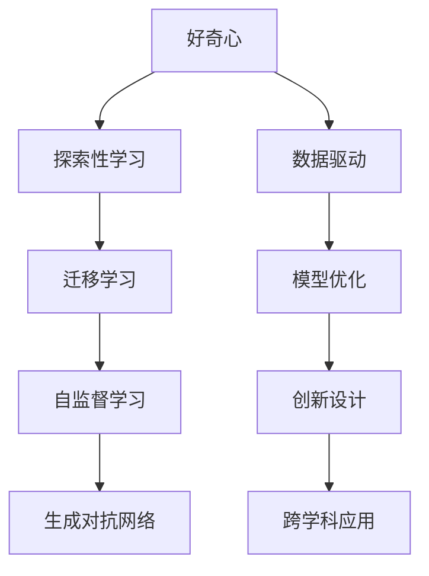

                 

# 好奇心：探索世界的钥匙

> 关键词：好奇心, 探索, 人工智能, 学习, 认知, 创新, 研究, 技术

## 1. 背景介绍

### 1.1 问题由来
好奇心（Curiosity）是人类本源性的探索欲，它驱动我们探索未知世界，寻找新的答案和解决方式。在科技迅猛发展的今天，好奇心正日益成为推动技术创新和知识进步的关键动力。特别在人工智能（AI）领域，好奇心的驱使下，研究人员不断突破技术边界，打造智能应用。本文将深入探讨好奇心在AI领域的作用及其对技术进步的推动意义。

### 1.2 问题核心关键点
好奇心驱动的AI研究集中在以下几个方面：
- 数据驱动的模型优化
- 新领域和任务的知识迁移
- 模型和系统的创新设计
- 跨学科技术的融合应用

### 1.3 问题研究意义
好奇心的追求，使得AI研究人员不断探索新技术和应用，推动科学技术的快速发展。以AI技术为例，无论是模型结构、训练方式、数据处理还是应用场景，每一次的突破，都离不开好奇心的驱动。好奇心不仅是科研人员的动力源泉，也是技术进步的引擎。

## 2. 核心概念与联系

### 2.1 核心概念概述

为了更好地理解好奇心在AI领域的驱动力，我们先介绍一些核心概念：

- **好奇心（Curiosity）**：指人类渴望了解未知事物的心理倾向，在AI中表现为对新数据、新模型和新任务的探索兴趣。
- **探索性学习（Exploratory Learning）**：指通过尝试不同的输入、策略和模型，寻找最优解决方案的过程。
- **迁移学习（Transfer Learning）**：指将一个领域学到的知识迁移到另一个领域，以解决新问题。
- **自监督学习（Self-Supervised Learning）**：指通过无标签的数据进行学习，无需人工标注。
- **生成对抗网络（Generative Adversarial Networks, GANs）**：一种生成模型，用于创建逼真的数据和图像。

这些概念构成了AI探索和创新的基础，帮助研究人员在新领域中快速学习和应用。

### 2.2 核心概念原理和架构的 Mermaid 流程图



这个流程图展示了好奇心在不同AI概念之间的联系和交互作用：

1. 好奇心驱动探索性学习，通过多样化的输入和策略，挖掘数据的潜在信息。
2. 迁移学习将已有知识迁移到新领域，加速新任务的解决过程。
3. 自监督学习利用未标注数据训练模型，避免人工标注的昂贵成本。
4. 生成对抗网络利用对抗样本，提升模型的生成和识别能力。
5. 数据驱动和模型优化不断改进技术，提升AI系统性能。
6. 创新设计引入新的方法和工具，开拓新的应用场景。
7. 跨学科应用将AI技术与更多领域融合，创造新的价值。

## 3. 核心算法原理 & 具体操作步骤
### 3.1 算法原理概述

好奇心驱动的AI探索，核心在于不断优化数据和模型，寻找最优解决方案。其基本原理是：

1. **数据驱动**：通过大量数据训练模型，发现数据中的潜在规律和模式。
2. **模型优化**：利用新数据和模型架构，迭代更新模型参数，提升模型精度。
3. **探索性学习**：不断尝试不同的输入、策略和模型，寻找新的解决方案。
4. **迁移学习**：在新领域使用已有知识，加速模型学习过程。
5. **自监督学习**：通过无标签数据训练模型，无需标注数据。

### 3.2 算法步骤详解

好奇心驱动的AI探索，可以分为以下几个步骤：

**Step 1: 收集数据**
- 广泛收集与新任务相关的数据，确保数据的多样性和代表性。

**Step 2: 初步探索**
- 使用探索性方法，如随机生成、集成学习等，初步了解数据特性和潜在模式。

**Step 3: 设计模型**
- 根据数据特性，选择合适的模型架构，进行模型设计和参数设定。

**Step 4: 训练和优化**
- 使用数据集对模型进行训练，利用梯度下降等优化算法，迭代更新模型参数。

**Step 5: 迁移学习**
- 将已有模型知识迁移到新领域，使用迁移学习技术，提高新任务性能。

**Step 6: 验证和评估**
- 在新数据上验证模型性能，根据评估结果调整模型和策略。

**Step 7: 创新设计**
- 结合最新研究进展，引入新方法和新工具，优化模型和系统设计。

**Step 8: 应用和部署**
- 将优化后的模型应用到实际场景，进行系统部署和维护。

### 3.3 算法优缺点

好奇心驱动的AI探索，具有以下优点：
1. 数据驱动：利用大量数据，发现潜在模式，提高模型精度。
2. 模型优化：通过迭代优化，不断提升模型性能。
3. 探索性学习：多样化尝试，寻找最优解决方案。
4. 迁移学习：加速新任务解决，减少开发成本。
5. 自监督学习：避免标注成本，提升模型泛化能力。

同时，该方法也存在一些局限性：
1. 数据依赖：依赖高质量标注数据，获取数据成本较高。
2. 模型复杂：模型设计复杂，需投入大量时间和资源。
3. 探索风险：探索过程可能遇到各种问题，需要不断调试和优化。
4. 知识限制：模型可能难以完全理解复杂任务，效果有限。

尽管存在这些局限性，但好奇心的驱动，使得AI探索不断进步，值得投入更多资源。

### 3.4 算法应用领域

好奇心驱动的AI探索，已经广泛应用于各个领域：

- **自动驾驶**：通过自动探索环境和路标，提升驾驶安全性。
- **金融分析**：探索历史数据中的潜在模式，优化投资策略。
- **医疗诊断**：利用患者历史数据，发现新的疾病特征。
- **智能推荐**：根据用户行为探索个性化推荐方案。
- **自然语言处理**：探索新任务和应用，提升语言理解能力。

## 4. 数学模型和公式 & 详细讲解 & 举例说明

### 4.1 数学模型构建

本节通过数学模型和公式，详细讲解好奇心驱动的AI探索原理。

假设输入数据为 $x$，输出为目标变量 $y$。利用一个线性回归模型 $f(x; \theta)$ 进行预测，其中 $\theta$ 为模型参数。数据集 $D$ 包含 $N$ 个样本 $(x_i, y_i)$。模型的最小二乘误差为：

$$
\text{MSE} = \frac{1}{N} \sum_{i=1}^N (y_i - f(x_i; \theta))^2
$$

求解 $\theta$，使其最小化上述误差。

### 4.2 公式推导过程

利用梯度下降算法，求解模型参数 $\theta$。最小化误差函数的梯度为：

$$
\frac{\partial \text{MSE}}{\partial \theta} = \frac{2}{N} \sum_{i=1}^N (y_i - f(x_i; \theta)) f'(x_i; \theta)
$$

根据梯度方向，更新模型参数：

$$
\theta \leftarrow \theta - \eta \frac{\partial \text{MSE}}{\partial \theta}
$$

其中 $\eta$ 为学习率，控制参数更新的步长。

### 4.3 案例分析与讲解

以图像分类为例，假设模型已经学习到一组特征表示 $x_i$，输入一个新图像 $x$，利用已有特征提取器 $f(x)$，通过比较与已知图像的相似度，预测其类别。

假设已知图像数据集为 $D=\{(x_i, y_i)\}_{i=1}^N$，利用神经网络进行特征提取：

$$
f(x; \theta) = W \tanh(B x + C)
$$

其中 $W$, $B$, $C$ 为模型参数。最小化交叉熵损失函数：

$$
\text{CE} = -\frac{1}{N} \sum_{i=1}^N y_i \log f(x_i; \theta)
$$

利用梯度下降算法，不断更新参数：

$$
\theta \leftarrow \theta - \eta \nabla_{\theta}\text{CE}(f(x; \theta))
$$

迭代多次后，模型收敛于最优解，预测新图像类别。

## 5. 项目实践：代码实例和详细解释说明

### 5.1 开发环境搭建

为实现好奇心驱动的AI探索，需要先搭建开发环境。以下是使用Python进行TensorFlow开发的环境配置流程：

1. 安装Anaconda：从官网下载并安装Anaconda，用于创建独立的Python环境。

2. 创建并激活虚拟环境：
```bash
conda create -n tensorflow-env python=3.8 
conda activate tensorflow-env
```

3. 安装TensorFlow：根据CUDA版本，从官网获取对应的安装命令。例如：
```bash
conda install tensorflow=2.6 cudatoolkit=11.3 -c tf -c conda-forge
```

4. 安装TensorBoard：用于可视化模型训练和推理过程。
```bash
pip install tensorboard
```

完成上述步骤后，即可在`tensorflow-env`环境中开始探索性学习。

### 5.2 源代码详细实现

下面以手写数字识别为例，给出使用TensorFlow进行探索性学习的PyTorch代码实现。

首先，定义模型和损失函数：

```python
import tensorflow as tf
from tensorflow import keras

# 定义模型结构
model = keras.Sequential([
    keras.layers.Flatten(input_shape=(28, 28)),
    keras.layers.Dense(128, activation='relu'),
    keras.layers.Dense(10, activation='softmax')
])

# 定义损失函数
loss_fn = keras.losses.SparseCategoricalCrossentropy(from_logits=True)
```

然后，加载和预处理数据：

```python
mnist = keras.datasets.mnist
(train_images, train_labels), (test_images, test_labels) = mnist.load_data()
train_images = train_images / 255.0
test_images = test_images / 255.0
```

接着，进行模型训练：

```python
# 定义优化器
optimizer = keras.optimizers.Adam(learning_rate=0.01)

# 训练模型
for epoch in range(10):
    for i in range(len(train_images)):
        # 随机选择一个训练样本
        x = train_images[i].reshape(1, -1)
        y = train_labels[i]
        
        # 前向传播和后向传播
        with tf.GradientTape() as tape:
            logits = model(x)
            loss_value = loss_fn(y, logits)
        
        # 计算梯度并更新参数
        grads = tape.gradient(loss_value, model.trainable_variables)
        optimizer.apply_gradients(zip(grads, model.trainable_variables))
```

最后，评估模型性能：

```python
# 评估模型
test_loss, test_acc = model.evaluate(test_images, test_labels)
print(f"Test Loss: {test_loss}, Test Accuracy: {test_acc}")
```

以上就是使用TensorFlow进行探索性学习的完整代码实现。可以看到，通过定义模型结构、损失函数和优化器，结合大量训练数据，模型可以逐步优化，提高预测准确率。

### 5.3 代码解读与分析

让我们再详细解读一下关键代码的实现细节：

**定义模型结构**：
- `Sequential`：线性堆叠模型层，按顺序组织模型。
- `Flatten`：将二维输入展开成一维，方便全连接层处理。
- `Dense`：全连接层，通过可学习的权重和偏置计算输出。

**加载和预处理数据**：
- `mnist.load_data()`：加载MNIST手写数字数据集。
- `train_images /= 255.0`：将像素值归一化到0-1之间。

**模型训练**：
- `keras.optimizers.Adam()`：使用Adam优化器，学习率为0.01。
- `tf.GradientTape()`：自动记录梯度计算，方便反向传播。
- `model.evaluate()`：在测试集上评估模型性能。

通过以上步骤，我们可以利用TensorFlow进行探索性学习，逐步优化模型，提高预测准确率。

## 6. 实际应用场景

### 6.1 智能客服系统

好奇心驱动的探索性学习，可以应用于智能客服系统的构建。传统客服往往需要配备大量人力，高峰期响应缓慢，且一致性和专业性难以保证。而使用探索性学习技术，可以自动学习用户意图，匹配最合适的答案模板进行回复。

在技术实现上，可以收集企业内部的历史客服对话记录，将问题和最佳答复构建成监督数据，在此基础上对预训练模型进行微调。探索性学习技术能够自动理解用户意图，匹配最合适的答案模板进行回复。对于客户提出的新问题，还可以接入检索系统实时搜索相关内容，动态组织生成回答。如此构建的智能客服系统，能大幅提升客户咨询体验和问题解决效率。

### 6.2 金融舆情监测

金融机构需要实时监测市场舆论动向，以便及时应对负面信息传播，规避金融风险。传统的人工监测方式成本高、效率低，难以应对网络时代海量信息爆发的挑战。探索性学习技术可应用于金融舆情监测，通过分析市场新闻、评论等文本数据，自动判断舆情趋势和情感变化。

具体而言，可以收集金融领域相关的新闻、报道、评论等文本数据，并对其进行情感标注。在此基础上对预训练语言模型进行探索性学习，使其能够自动判断文本属于何种情感倾向，情感变化趋势，以便金融机构及时采取措施。

### 6.3 个性化推荐系统

当前的推荐系统往往只依赖用户的历史行为数据进行物品推荐，无法深入理解用户的真实兴趣偏好。探索性学习技术可应用于个性化推荐系统，通过分析用户行为数据，自动学习用户兴趣点，并根据新数据动态调整推荐策略。

在实践中，可以收集用户浏览、点击、评论、分享等行为数据，提取和用户交互的物品标题、描述、标签等文本内容。将文本内容作为模型输入，用户的后续行为（如是否点击、购买等）作为监督信号，在此基础上进行探索性学习。探索性学习技术能够从文本内容中准确把握用户的兴趣点，结合推荐算法生成个性化推荐列表。

### 6.4 未来应用展望

随着探索性学习技术的不断发展，未来将在更多领域得到应用，为传统行业带来变革性影响。

在智慧医疗领域，探索性学习技术可应用于医疗问答、病历分析、药物研发等应用，提升医疗服务的智能化水平，辅助医生诊疗，加速新药开发进程。

在智能教育领域，探索性学习技术可应用于作业批改、学情分析、知识推荐等方面，因材施教，促进教育公平，提高教学质量。

在智慧城市治理中，探索性学习技术可应用于城市事件监测、舆情分析、应急指挥等环节，提高城市管理的自动化和智能化水平，构建更安全、高效的未来城市。

此外，在企业生产、社会治理、文娱传媒等众多领域，探索性学习技术也将不断涌现，为经济社会发展注入新的动力。相信随着技术的日益成熟，探索性学习技术将成为人工智能落地应用的重要范式，推动人工智能技术向更广阔的领域加速渗透。

## 7. 工具和资源推荐

### 7.1 学习资源推荐

为了帮助开发者系统掌握探索性学习理论基础和实践技巧，这里推荐一些优质的学习资源：

1. 《深度学习》系列书籍：全面介绍了深度学习的原理、模型和应用，适合初学者和进阶者学习。

2. TensorFlow官方文档：TensorFlow的官方文档，提供了丰富的API和样例代码，是学习探索性学习的重要资源。

3. 《神经网络与深度学习》课程：由吴恩达开设的Coursera课程，涵盖了神经网络、深度学习等前沿知识。

4. PyTorch官方文档：PyTorch的官方文档，提供了丰富的模型和工具，支持探索性学习的研究和实践。

5. Kaggle：数据科学竞赛平台，提供了大量的数据集和样例代码，适合进行探索性学习训练和验证。

通过对这些资源的学习实践，相信你一定能够快速掌握探索性学习技术，并用于解决实际的AI问题。

### 7.2 开发工具推荐

高效的开发离不开优秀的工具支持。以下是几款用于探索性学习开发的常用工具：

1. TensorFlow：谷歌推出的开源深度学习框架，支持分布式训练和模型部署。

2. PyTorch：Facebook开发的开源深度学习框架，灵活动态的计算图，适合快速迭代研究。

3. Jupyter Notebook：交互式编程环境，支持Python、R等语言的代码块执行，便于研究和开发。

4. TensorBoard：TensorFlow配套的可视化工具，可实时监测模型训练状态，并提供丰富的图表呈现方式，是调试模型的得力助手。

5. Weights & Biases：模型训练的实验跟踪工具，可以记录和可视化模型训练过程中的各项指标，方便对比和调优。

合理利用这些工具，可以显著提升探索性学习任务的开发效率，加快创新迭代的步伐。

### 7.3 相关论文推荐

探索性学习技术的发展源于学界的持续研究。以下是几篇奠基性的相关论文，推荐阅读：

1. AlexNet：AlexNet在2012年ImageNet竞赛中的胜利，标志着深度学习的崛起。

2. RNNs for Sequence Modeling：RNN在语音识别和自然语言处理中的应用，展示了序列建模的重要性。

3. Generative Adversarial Networks：生成对抗网络（GANs）的提出，改变了生成模型和图像生成技术。

4. Self-Supervised Feature Learning：自监督特征学习（SSL）的提出，使得无标签数据也能用于模型训练。

5. Exploratory Data Analysis：探索性数据分析（EDA）的介绍，提供了数据预处理的系统方法。

这些论文代表了解索性学习技术的发展脉络。通过学习这些前沿成果，可以帮助研究者把握学科前进方向，激发更多的创新灵感。

## 8. 总结：未来发展趋势与挑战

### 8.1 研究成果总结

本文对好奇心驱动的AI探索性学习进行了全面系统的介绍。首先阐述了探索性学习在AI领域的作用及其对技术进步的推动意义，明确了探索性学习在数据驱动、模型优化、探索新任务等方面的应用。其次，从原理到实践，详细讲解了探索性学习的数学模型和算法步骤，给出了探索性学习任务开发的完整代码实例。同时，本文还广泛探讨了探索性学习在智能客服、金融舆情、个性化推荐等多个行业领域的应用前景，展示了探索性学习技术的巨大潜力。此外，本文精选了探索性学习的各类学习资源，力求为读者提供全方位的技术指引。

通过本文的系统梳理，可以看到，好奇心驱动的AI探索性学习正成为推动AI技术发展的重要驱动力，其广泛应用将带来深远的影响。

### 8.2 未来发展趋势

展望未来，探索性学习技术将呈现以下几个发展趋势：

1. 数据驱动的深度学习：利用大数据、大模型进行探索性学习，提升模型性能。

2. 自监督学习的广泛应用：自监督学习在无标签数据上的高效应用，将进一步推动探索性学习的发展。

3. 生成对抗网络的融合：GANs在生成图像、语音等领域的应用，将进一步提升探索性学习的生成能力。

4. 强化学习的引入：结合强化学习，探索性学习将更加注重决策过程和行为优化。

5. 多模态学习的拓展：探索性学习将从单模态拓展到多模态，融合视觉、语音、文本等多种信息。

6. 实时化的探索：探索性学习将更加注重实时性，结合边缘计算、实时数据流等技术，进行实时探索和决策。

以上趋势凸显了探索性学习技术的广阔前景，必将进一步推动AI技术的创新和应用。

### 8.3 面临的挑战

尽管探索性学习技术已经取得了瞩目成就，但在迈向更加智能化、普适化应用的过程中，仍面临诸多挑战：

1. 数据依赖：依赖高质量标注数据，获取数据成本较高。

2. 模型复杂：模型设计复杂，需投入大量时间和资源。

3. 探索风险：探索过程可能遇到各种问题，需要不断调试和优化。

4. 知识限制：模型可能难以完全理解复杂任务，效果有限。

5. 伦理和安全问题：探索性学习可能生成有害信息，需要严格控制和管理。

6. 技术集成：探索性学习与其他技术集成应用，需要统一接口和标准。

正视探索性学习面临的这些挑战，积极应对并寻求突破，将使探索性学习技术更加成熟，更具应用价值。

### 8.4 研究展望

面向未来，探索性学习技术的突破点包括：

1. 自监督学习与深度学习的融合：进一步提升无标签数据利用效率。

2. 多模态数据融合：将图像、语音、文本等多种信息融合，提升探索能力。

3. 实时化探索：利用实时数据流进行实时探索和决策。

4. 可解释性研究：提升模型的可解释性，增强决策透明度和信任度。

5. 跨领域应用：结合领域知识，探索跨学科应用，拓展应用范围。

6. 伦理和安全保障：建立伦理和安全保障机制，确保探索性学习的应用安全。

这些研究方向和突破点将推动探索性学习技术向更加智能化、普适化的方向发展，为未来的AI应用提供新的动力。

## 9. 附录：常见问题与解答

**Q1: 探索性学习是否适用于所有AI任务？**

A: 探索性学习适用于大部分AI任务，特别是数据标注成本高、标注数据少的情况。但对于一些特定领域，如医疗、法律等，探索性学习效果可能有限，需要进行任务特定优化。

**Q2: 探索性学习与深度学习的区别是什么？**

A: 探索性学习是一种数据驱动的学习方法，主要通过无监督和半监督数据进行探索，发现数据中的潜在规律和模式。深度学习则是一种参数驱动的方法，通过大量标注数据训练模型，优化模型参数以提高性能。

**Q3: 探索性学习如何应对数据不足问题？**

A: 探索性学习可以通过数据增强、迁移学习等方法，利用无标签数据和已有知识进行探索。此外，结合生成对抗网络（GANs）等技术，可以生成更多数据进行探索。

**Q4: 探索性学习在实际应用中面临哪些挑战？**

A: 探索性学习面临数据依赖、模型复杂、探索风险、知识限制等多重挑战。解决这些挑战需要不断优化数据预处理、模型设计和探索策略。

**Q5: 探索性学习的应用场景有哪些？**

A: 探索性学习适用于智能客服、金融舆情、个性化推荐、医疗诊断等多个领域，通过自动探索和决策，提升系统性能和应用价值。

---

作者：禅与计算机程序设计艺术 / Zen and the Art of Computer Programming

