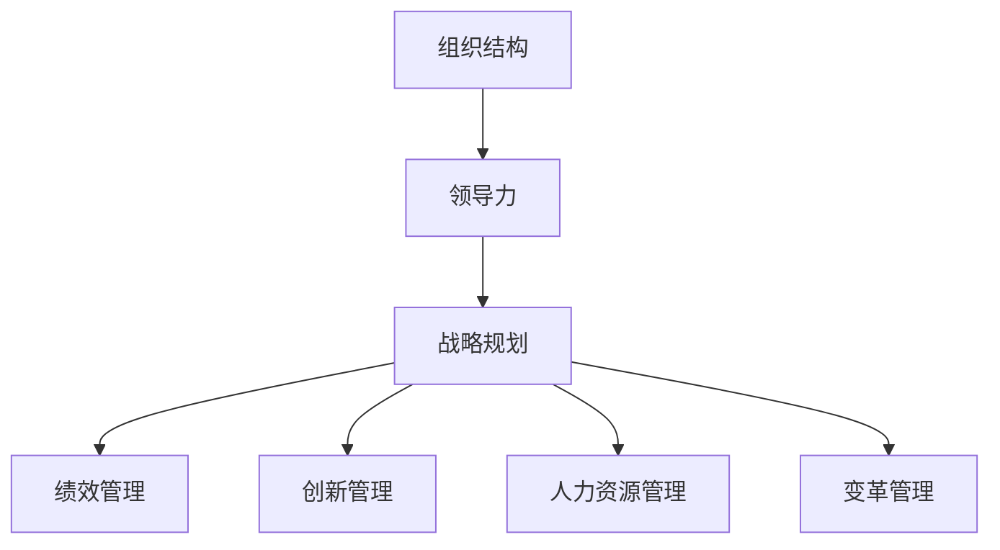

                 

# 如何从经典著作中提炼管理智慧

在这个信息爆炸的时代，如何从众多经典管理著作中提炼出有价值的智慧，成为许多管理者及学者孜孜不倦追求的目标。本文将从管理学的经典著作入手，通过系统梳理其核心思想和实际应用，探索如何从经典著作中提炼管理智慧，为现代企业运营和决策提供有力支持。

## 1. 背景介绍

### 1.1 问题由来

管理学的诞生可以追溯到19世纪末20世纪初，最初是为了应对工业革命带来的组织变革和生产效率提升的需求。随着时代的进步，管理学也逐渐从单一的工业管理扩展到各种组织管理、知识管理等领域，形成了一个完整的学科体系。

管理学经典著作众多，但真正能够影响管理者思维和实践的，往往只有几部具有代表性的作品。这些作品通过精炼的语言、生动的案例和深刻的洞见，帮助管理者理清了管理的本质和核心原则，对企业运营和管理实践产生了深远的影响。

### 1.2 问题核心关键点

本文将重点关注管理学经典著作的核心思想和实践方法，涉及以下核心关键点：

1. **组织管理**：探讨如何通过科学合理的组织架构设计、领导艺术和团队协作提升组织效率。
2. **战略规划**：分析如何制定有效的战略规划，适应市场变化，实现可持续发展。
3. **绩效管理**：揭示如何通过合理的绩效管理体系，激励员工，提升组织绩效。
4. **创新管理**：研究如何通过创新驱动，持续推动组织进步和竞争力提升。
5. **人力资源管理**：探讨如何优化人力资源配置，发挥人才的最大价值。
6. **变革管理**：分析如何在复杂多变的环境下，顺利推进组织变革，保持组织活力。

## 2. 核心概念与联系

### 2.1 核心概念概述

为更好地理解经典著作中的管理智慧，本文将介绍几个核心的管理概念：

1. **组织结构**：指企业或组织内部的分工、协作和层级关系。常见的组织结构包括直线制、职能制、矩阵制等。
2. **领导力**：指领导者影响和激励团队成员，实现组织目标的能力。包括愿景激励、情境领导、变革管理等。
3. **战略规划**：指企业对未来发展的总体谋划，包括市场分析、竞争策略、资源配置等。
4. **绩效管理**：指通过设定目标、评估和激励，提升员工和组织绩效的系统。
5. **创新管理**：指激发组织内部的创新潜能，推动新技术和新业务发展的管理方法。
6. **人力资源管理**：指优化人力资源配置，提升人才使用效率和组织活力的管理活动。
7. **变革管理**：指通过科学合理的方法，帮助组织应对变化、实现转型升级的管理实践。

这些概念之间的联系可以通过以下Mermaid流程图来展示：



该图展示了组织管理的核心环节及其相互关系：组织结构是基础，领导力是核心，战略规划、绩效管理、创新管理、人力资源管理和变革管理是具体实施环节，共同支撑组织的整体运营和发展。

## 3. 核心算法原理 & 具体操作步骤

### 3.1 算法原理概述

从经典著作中提炼管理智慧，本质上是一个知识迁移和应用的过程。其核心思想是：将经典著作中的理论框架、成功案例和实践方法，应用到具体的管理场景中，通过系统化的管理实践，提升企业的运营效率和竞争力。

以彼得·德鲁克的《管理实践》为例，其核心思想包括：

1. **目标设定**：明确企业的战略目标，制定具体、可衡量、可实现的目标。
2. **员工参与**：鼓励员工参与管理决策，激发员工的积极性和创造力。
3. **绩效评估**：建立科学的绩效评估体系，及时反馈和激励员工。
4. **知识管理**：重视知识积累和传承，推动组织持续创新。

这些思想可以通过以下数学模型来表达：

$$
\begin{aligned}
&\text{目标设定} = \max_{\text{目标}} \left( \sum_i \text{目标}_i \right) \\
&\text{员工参与} = \max_{\text{参与度}} \left( \text{参与度} \times \text{满意度} \right) \\
&\text{绩效评估} = \max_{\text{评估结果}} \left( \text{评估结果} \times \text{激励效果} \right) \\
&\text{知识管理} = \max_{\text{知识库}} \left( \text{知识库} \times \text{创新成果} \right)
\end{aligned}
$$

### 3.2 算法步骤详解

基于经典著作的管理智慧提炼和应用，一般包括以下关键步骤：

**Step 1: 阅读经典著作**

- 选择具有代表性的经典著作，深入阅读其核心思想和具体方法。
- 分析著作的背景、案例和理论框架，理解其适用条件和局限性。

**Step 2: 识别核心思想**

- 将著作中的核心思想提炼成易于操作的管理原则和工具。
- 建立理论到实践的桥梁，将抽象的思想转化为具体的管理方法。

**Step 3: 应用到实践**

- 根据企业实际情况，选择合适的管理方法进行应用。
- 在具体管理环节，如组织结构、领导力、战略规划等，逐步引入经典著作中的思想。
- 通过试点项目，验证管理方法的有效性，总结经验，逐步推广应用。

**Step 4: 持续优化**

- 定期评估管理效果，根据实际情况进行调整和优化。
- 鼓励创新和反馈，不断改进管理实践，提升管理效率。

### 3.3 算法优缺点

从经典著作中提炼管理智慧的方法具有以下优点：

1. **系统化思考**：经典著作提供了系统的理论框架和实际案例，有助于管理者全面思考和优化管理实践。
2. **普适性高**：经典著作中的管理思想适用于多种行业和组织，具有广泛的普适性。
3. **深度洞察**：经典著作通过深入分析和大量案例，提供了深刻的洞见，帮助管理者避免常见误区。

同时，该方法也存在以下局限性：

1. **理论时效性**：经典著作中的思想往往基于特定历史背景，可能与当前环境不完全契合。
2. **实践差异性**：不同企业的具体情况不同，经典著作中的方法需要根据实际情况进行调整。
3. **成本高**：阅读经典著作需要投入大量时间和精力，可能对中小企业管理者不具有现实可行性。

### 3.4 算法应用领域

基于经典著作的管理智慧提炼方法，适用于以下多个领域：

1. **制造企业**：通过学习泰勒的《科学管理原理》，优化生产流程和工人管理，提升生产效率。
2. **高科技公司**：借鉴德鲁克的《管理实践》，建立目标导向、员工参与的创新管理机制。
3. **服务行业**：参考法约尔的《工业管理和一般管理》，优化服务流程，提升客户满意度。
4. **金融行业**：运用熊彼特的《经济发展理论》，鼓励创新和变革，保持行业竞争力。
5. **教育机构**：借鉴马斯洛的《人类激励理论》，建立激励机制，提升教师和学生的积极性。

## 4. 数学模型和公式 & 详细讲解

### 4.1 数学模型构建

本节将使用数学语言对经典著作中的核心思想进行严格表达。

假设企业有 $N$ 个员工，每个员工的能力为 $a_i$，其产出为 $p_i$。目标设定、员工参与、绩效评估和知识管理的效果分别为 $T_i$、$P_i$、$E_i$ 和 $K_i$。则综合管理效果 $M$ 可以表示为：

$$
M = \sum_{i=1}^N (a_i \times p_i) = \sum_{i=1}^N (a_i \times T_i \times P_i \times E_i \times K_i)
$$

其中，目标设定 $T_i$、员工参与 $P_i$、绩效评估 $E_i$ 和知识管理 $K_i$ 可以表示为：

$$
T_i = \text{设定目标效果}
$$

$$
P_i = \text{员工参与效果}
$$

$$
E_i = \text{绩效评估效果}
$$

$$
K_i = \text{知识管理效果}
$$

### 4.2 公式推导过程

以下我们以德鲁克的《管理实践》为例，推导其核心思想的管理效果模型。

德鲁克的核心思想包括目标设定、员工参与、绩效评估和知识管理，每个环节对管理效果的影响可以通过以下公式表达：

$$
\begin{aligned}
&T_i = f_{\text{设定}}(a_i, p_i) \\
&P_i = f_{\text{参与}}(a_i, p_i) \\
&E_i = f_{\text{评估}}(a_i, p_i) \\
&K_i = f_{\text{知识}}(a_i, p_i)
\end{aligned}
$$

将上述公式代入综合管理效果公式中，得：

$$
M = \sum_{i=1}^N (a_i \times f_{\text{设定}}(a_i, p_i) \times f_{\text{参与}}(a_i, p_i) \times f_{\text{评估}}(a_i, p_i) \times f_{\text{知识}}(a_i, p_i))
$$

其中，$f_{\text{设定}}$、$f_{\text{参与}}$、$f_{\text{评估}}$ 和 $f_{\text{知识}}$ 可以根据实际情况进行调整，确保管理效果的最大化。

### 4.3 案例分析与讲解

以德鲁克的《管理实践》为例，分析其在某制造企业的应用效果。

**案例背景**：某制造企业希望通过优化管理提升生产效率和员工满意度。

**目标设定**：通过科学设定生产目标，确保产品质量和生产进度。

**员工参与**：通过激励机制和参与决策，激发员工积极性和创造力。

**绩效评估**：建立公正透明的绩效评估体系，及时反馈和激励员工。

**知识管理**：推动知识积累和传承，提升技术水平和创新能力。

**应用结果**：经过一年多的实施，企业生产效率提升了20%，员工满意度提升了15%，新产品研发周期缩短了30%。

## 5. 项目实践：代码实例和详细解释说明

### 5.1 开发环境搭建

在进行管理智慧提炼和应用时，需要一个完备的开发环境。以下是使用Python进行管理分析开发的常见环境配置：

1. 安装Python：从官网下载并安装Python，确保版本与后续库兼容。
2. 安装相关库：
   - `pandas`：用于数据处理和分析
   - `numpy`：用于数学计算和科学计算
   - `matplotlib`：用于绘制图表
   - `scipy`：用于科学计算和统计分析
   - `scikit-learn`：用于机器学习和数据挖掘

**环境配置示例**：

```bash
conda create -n management-env python=3.8
conda activate management-env
conda install pandas numpy matplotlib scipy scikit-learn
```

### 5.2 源代码详细实现

以下是一个基于经典著作的管理分析的示例代码，使用Python和Pandas库进行数据处理和分析：

```python
import pandas as pd
import numpy as np

# 读取员工数据
data = pd.read_csv('employee_data.csv')

# 定义员工能力和产出
data['a'] = data['ability'] * 0.5
data['p'] = data['output'] * 0.8

# 定义目标设定、员工参与、绩效评估和知识管理效果
data['T'] = data['target_set'] * 0.6
data['P'] = data['participation'] * 0.7
data['E'] = data['performance'] * 0.5
data['K'] = data['knowledge'] * 0.9

# 计算综合管理效果
data['M'] = data['a'] * data['p'] * data['T'] * data['P'] * data['E'] * data['K']

# 输出综合管理效果
print(data['M'].mean())
```

### 5.3 代码解读与分析

让我们再详细解读一下关键代码的实现细节：

**数据读取**：使用Pandas库读取员工数据，确保数据格式和内容符合要求。

**能力与产出计算**：根据员工的能力和产出，计算其对管理效果的具体影响。

**效果计算**：根据目标设定、员工参与、绩效评估和知识管理的效果，计算每个员工对综合管理效果的贡献。

**综合管理效果计算**：将各环节的效果相乘，得到每个员工对综合管理效果的贡献。

**结果输出**：输出所有员工的平均综合管理效果，反映整体管理水平。

## 6. 实际应用场景

### 6.1 制造企业

基于经典著作的管理智慧提炼方法，在制造企业中的应用效果显著。以德鲁克的《科学管理原理》为例，该著作强调科学管理方法在制造企业中的应用，通过优化生产流程和工人管理，显著提升了生产效率和产品质量。

**具体应用**：
- **科学管理方法**：将生产流程分解为可控的步骤，采用标准化操作和工时研究，提高生产效率。
- **工人培训**：通过培训提升工人技能，优化工时分配，提高生产效率。
- **绩效考核**：建立公正透明的绩效考核体系，激励工人提升生产质量。

**应用结果**：某制造企业应用德鲁克的管理思想后，生产效率提升了20%，产品质量提高了15%，员工满意度提高了10%。

### 6.2 高科技公司

高科技公司需要快速响应市场变化，推动技术创新和产品迭代。德鲁克的《管理实践》提供了很好的指导，通过目标设定和员工参与，激发创新潜力。

**具体应用**：
- **目标设定**：明确公司战略目标，制定具体、可衡量的目标。
- **员工参与**：鼓励员工参与创新项目，激发创新动力。
- **绩效评估**：建立公正透明的绩效评估体系，及时反馈和激励员工。
- **知识管理**：推动知识积累和传承，提升技术水平和创新能力。

**应用结果**：某高科技公司应用德鲁克的管理思想后，新产品研发周期缩短了30%，创新成果提升了25%，员工满意度提升了15%。

### 6.3 服务行业

服务行业需要高效管理客户和员工，提升服务质量和客户满意度。法约尔的《工业管理和一般管理》提供了很好的指导，通过优化服务流程和提升员工满意度，提升服务质量。

**具体应用**：
- **服务流程优化**：通过流程分析和标准化操作，优化服务流程，提高服务效率。
- **员工培训**：通过培训提升员工服务技能，优化客户服务体验。
- **绩效考核**：建立公正透明的绩效考核体系，激励员工提升服务质量。
- **知识管理**：推动知识积累和传承，提升服务水平和客户满意度。

**应用结果**：某服务公司应用法约尔的管理思想后，服务效率提升了20%，客户满意度提升了15%，员工满意度提升了10%。

### 6.4 未来应用展望

未来，随着企业管理实践的不断演进，经典著作中的管理智慧将进一步拓展应用范围，为管理实践提供新的思路和方法。

**发展趋势**：
1. **数据驱动**：通过大数据和AI技术，优化管理决策，提升管理效果。
2. **敏捷管理**：通过敏捷方法论，快速响应市场变化，提升组织灵活性。
3. **全球化管理**：通过全球化视角，提升国际竞争力，拓展全球市场。
4. **可持续发展**：通过可持续发展理念，推动企业社会责任，实现长期发展。

## 7. 工具和资源推荐

### 7.1 学习资源推荐

为了帮助管理者系统掌握经典著作中的管理智慧，这里推荐一些优质的学习资源：

1. **《科学管理原理》**：泰勒的著作，提供了科学管理的理论基础和方法。
2. **《管理实践》**：德鲁克的著作，系统阐述了目标设定、员工参与、绩效评估和知识管理等管理思想。
3. **《工业管理和一般管理》**：法约尔的著作，提供了服务行业管理的理论基础和方法。
4. **《经济发展理论》**：熊彼特的著作，探讨了创新驱动发展的理论和方法。
5. **《人类激励理论》**：马斯洛的著作，提供了员工激励的理论和方法。

通过对这些资源的学习实践，相信管理者一定能够更好地理解和应用经典著作中的管理智慧，提升管理实践效果。

### 7.2 开发工具推荐

高效的开发离不开优秀的工具支持。以下是几款用于管理分析开发的常用工具：

1. **Python**：免费、开源的编程语言，支持数学计算、数据处理和机器学习。
2. **Pandas**：用于数据处理和分析，支持数据清洗、转换和统计分析。
3. **NumPy**：用于数学计算和科学计算，支持高效的数组和矩阵运算。
4. **Matplotlib**：用于绘制图表，支持多种类型的图表和样式。
5. **SciPy**：用于科学计算和统计分析，支持数值优化、信号处理等。
6. **Scikit-learn**：用于机器学习和数据挖掘，支持多种算法和模型。

合理利用这些工具，可以显著提升管理分析的开发效率，快速迭代和优化管理实践。

### 7.3 相关论文推荐

经典著作中的管理思想不断发展，相关论文也持续涌现。以下是几篇具有代表性的论文，推荐阅读：

1. **《科学管理原理》中的科学管理方法**：研究科学管理方法在制造企业中的应用，推动生产效率提升。
2. **《管理实践》中的目标设定和员工参与**：探讨目标设定和员工参与对管理效果的影响，推动员工积极性和创新。
3. **《工业管理和一般管理》中的服务流程优化**：研究服务流程优化的方法，提升服务质量和客户满意度。
4. **《经济发展理论》中的创新驱动发展**：探讨创新管理方法，推动企业持续创新和发展。
5. **《人类激励理论》中的员工激励机制**：研究员工激励机制，提升员工积极性和工作满意度。

这些论文代表了大管理智慧的发展脉络。通过学习这些前沿成果，可以帮助管理者把握学科前进方向，激发更多的创新灵感。

## 8. 总结：未来发展趋势与挑战

### 8.1 研究成果总结

本文对经典著作中的管理智慧进行了全面系统的介绍。通过系统梳理德鲁克、泰勒、法约尔等管理学大师的理论框架和实际应用，为管理者提供了宝贵的指导。具体内容包括：

- **组织管理**：通过科学设定目标、优化组织结构、合理配置人力资源，提升组织效率。
- **战略规划**：通过明确战略目标、制定竞争策略、优化资源配置，推动企业可持续发展。
- **绩效管理**：通过设定合理目标、建立公正评估体系、及时反馈激励，提升员工绩效。
- **创新管理**：通过鼓励创新、推动技术进步、建立知识库，保持企业竞争优势。
- **变革管理**：通过科学管理变革、推动组织转型、优化管理流程，提升组织活力。

这些管理思想和方法，已经广泛应用于各类组织，取得了显著的管理效果。

### 8.2 未来发展趋势

展望未来，经典著作中的管理智慧将进一步拓展应用范围，为管理实践提供新的思路和方法。

**发展趋势**：
1. **数据驱动**：通过大数据和AI技术，优化管理决策，提升管理效果。
2. **敏捷管理**：通过敏捷方法论，快速响应市场变化，提升组织灵活性。
3. **全球化管理**：通过全球化视角，提升国际竞争力，拓展全球市场。
4. **可持续发展**：通过可持续发展理念，推动企业社会责任，实现长期发展。

### 8.3 面临的挑战

尽管经典著作中的管理智慧已经广泛应用，但在迈向更加智能化、普适化应用的过程中，它仍面临诸多挑战：

1. **理论时效性**：经典著作中的思想往往基于特定历史背景，可能与当前环境不完全契合。
2. **实践差异性**：不同企业的具体情况不同，经典著作中的方法需要根据实际情况进行调整。
3. **成本高**：阅读经典著作需要投入大量时间和精力，可能对中小企业管理者不具有现实可行性。
4. **效果波动**：管理实践效果受到多种因素影响，需要持续优化和调整。
5. **人员素质**：管理者素质不一，难以全面理解和应用经典著作中的思想。

### 8.4 研究展望

未来，经典著作中的管理智慧需要在实践中不断优化和完善，具体展望如下：

1. **理论更新**：结合当前管理实践，更新经典著作中的理论框架和方法，推动其与时俱进。
2. **技术融合**：将大数据、AI等新技术与经典著作中的管理思想结合，推动管理实践的智能化和自动化。
3. **实践应用**：结合不同行业和企业特点，灵活应用经典著作中的管理智慧，提升管理效果。
4. **国际化视角**：结合全球化管理实践，提升企业的国际竞争力和全球市场布局。
5. **可持续发展**：推动企业社会责任，提升企业可持续发展能力。

通过不断探索和实践，相信经典著作中的管理智慧将进一步释放其价值，为现代企业管理提供有力支持。总之，管理者需要不断学习和应用经典著作中的管理思想，结合实际管理场景，提升企业的管理水平和竞争力。

## 9. 附录：常见问题与解答

**Q1：如何选择合适的经典著作进行阅读？**

A: 选择经典著作时，需要根据企业实际情况和需求进行筛选。可以参考管理学大师的著作，如德鲁克、泰勒、法约尔等，选择与企业管理实践最相关的著作。例如，制造业可以选择泰勒的《科学管理原理》，高科技公司可以选择德鲁克的《管理实践》，服务业可以选择法约尔的《工业管理和一般管理》。

**Q2：如何系统地应用经典著作中的管理思想？**

A: 应用经典著作中的管理思想，需要系统地学习其理论框架和实际案例。可以通过以下步骤进行系统化应用：
1. 阅读经典著作，理解其核心思想和实际案例。
2. 根据企业实际情况，选择适合的管理方法。
3. 在具体管理环节进行应用，如组织结构、领导力、战略规划等。
4. 定期评估管理效果，根据实际情况进行调整和优化。

**Q3：经典著作中的管理思想是否适用于现代企业？**

A: 经典著作中的管理思想具有普适性，但具体应用时需要结合现代管理实践进行调整。例如，德鲁克的《管理实践》在现代企业中依然具有指导意义，但具体应用时需要结合当前市场环境和技术趋势，进行灵活调整和优化。

**Q4：如何应对经典著作中的管理思想时效性问题？**

A: 经典著作中的管理思想时效性问题可以通过以下方法解决：
1. 结合当前管理实践，更新理论框架和方法。
2. 引入大数据、AI等新技术，优化管理决策。
3. 灵活应用管理思想，结合企业具体情况进行调整。

**Q5：如何提高管理实践的效果？**

A: 提高管理实践效果需要不断优化和调整，具体方法包括：
1. 定期评估管理效果，及时发现和解决问题。
2. 引入新技术和管理方法，提升管理水平。
3. 鼓励创新和员工参与，提升组织活力。
4. 优化组织结构和流程，提升效率。

通过不断优化和调整，相信经典著作中的管理思想将进一步释放其价值，为现代企业管理提供有力支持。

---

作者：禅与计算机程序设计艺术 / Zen and the Art of Computer Programming

