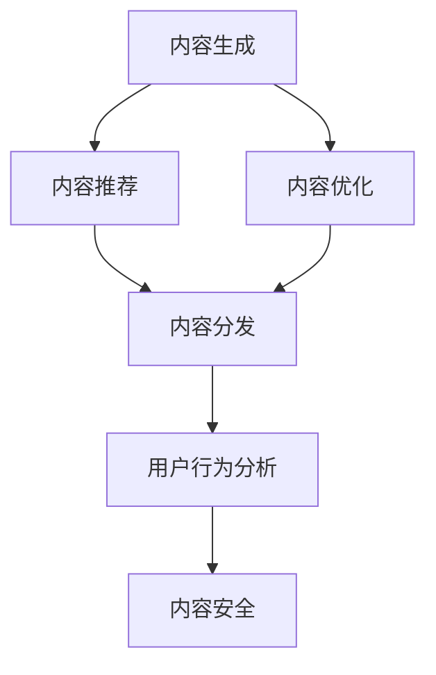

                 

# 如何利用技术能力进行内容创业

## 1. 背景介绍

### 1.1 问题由来
在数字化转型的浪潮下，内容创业成为了一个极具吸引力的领域。借助互联网技术，创业者可以以极低的成本，快速构建和分发内容，直接触达全球受众。技术为内容创业提供了丰富的工具和平台，使得内容创作、分发、运营等环节的效率大幅提升。

然而，尽管内容创业的机会多，但成功的案例依然稀缺。传统的线下创业思维，难以适应互联网的高效和复杂。本文将从技术角度，探讨如何利用技术能力，提升内容创业的效率和效果，打造具有竞争力的内容品牌。

### 1.2 问题核心关键点
内容创业的核心在于内容的创意、制作、分发、运营等环节的高效协同。利用技术能力，可以在这些环节中引入自动化、智能化的手段，提升内容创作和运营的效率，吸引更多用户，实现商业变现。

具体来说，技术手段包括但不限于：

- 自动化内容生成：利用NLP、GAN等技术，生成高质量的文本、图片、视频等内容。
- 智能内容推荐：利用推荐算法，推荐用户可能感兴趣的内容，提高内容的曝光度和点击率。
- 数据驱动的内容优化：利用大数据分析，优化内容创作和运营策略，提升用户参与度和留存率。
- 用户行为分析：利用机器学习技术，分析用户行为，洞察用户需求和偏好，提供个性化服务。
- 内容安全和合规：利用技术手段，检测和防范内容风险，确保内容的合法合规。

## 2. 核心概念与联系

### 2.1 核心概念概述

为更好地理解内容创业中的技术应用，本节将介绍几个密切相关的核心概念：

- 内容生成(Content Generation)：指利用技术手段，自动生成高质量的内容，包括文本、图片、视频等。常见的技术包括自然语言处理(NLP)、生成对抗网络(GAN)等。

- 内容推荐(Content Recommendation)：指利用推荐算法，为用户推荐可能感兴趣的内容，提高内容的曝光度和点击率。

- 内容优化(Content Optimization)：指利用大数据和机器学习技术，优化内容创作和运营策略，提升用户参与度和留存率。

- 用户行为分析(User Behavior Analysis)：指利用机器学习技术，分析用户行为，洞察用户需求和偏好，提供个性化服务。

- 内容安全(Content Security)：指利用技术手段，检测和防范内容风险，确保内容的合法合规。

这些核心概念之间的逻辑关系可以通过以下Mermaid流程图来展示：



这个流程图展示的内容创业的关键概念及其之间的关系：

1. 内容生成为内容推荐和分发提供素材。
2. 内容优化和用户行为分析指导内容生成和分发策略。
3. 内容安全和合规是所有环节必须遵守的底线。

这些概念共同构成了内容创业的技术框架，使得内容创作和运营过程更加高效、智能和合规。

## 3. 核心算法原理 & 具体操作步骤
### 3.1 算法原理概述

内容创业中的核心算法原理，主要围绕着内容的自动化生成、智能推荐和数据驱动优化展开。以下是对这些核心算法的简要概述：

### 3.2 算法步骤详解

**3.2.1 内容生成算法步骤详解**

1. 收集和整理源数据：内容生成需要大量的文本、图片、视频等数据，这些数据可以是公开的，也可以是从用户行为中提取的。

2. 预处理和标注：对收集到的数据进行清洗、标注，以便于后续的模型训练。

3. 选择和训练模型：根据任务特点，选择合适的模型，如GPT-3、DALL·E等，进行模型训练。

4. 生成内容：将预处理好的数据输入训练好的模型，生成新的内容。

5. 后处理和优化：对生成的内容进行后处理，如筛选、编辑、调整格式等，以提高内容质量。

6. 部署和监控：将生成好的内容部署到相应的平台，并持续监控其表现，及时进行调整。

**3.2.2 内容推荐算法步骤详解**

1. 数据收集：收集用户的历史行为数据，如浏览记录、搜索历史、点击行为等。

2. 特征工程：从数据中提取有意义的特征，如兴趣标签、时间戳等。

3. 选择模型：根据推荐任务，选择合适的推荐算法模型，如协同过滤、矩阵分解、神经网络等。

4. 模型训练：使用历史数据训练推荐模型，优化模型参数。

5. 推荐内容：将用户的行为数据输入训练好的推荐模型，生成推荐内容列表。

6. 部署和监控：将推荐结果推送到相应的平台，并持续监控其效果，及时进行调整。

**3.2.3 内容优化算法步骤详解**

1. 数据收集：收集用户的行为数据，如点击率、停留时间、转化率等。

2. 特征工程：从数据中提取有意义的特征，如用户年龄、兴趣标签、设备类型等。

3. 选择模型：根据优化任务，选择合适的机器学习模型，如回归模型、分类模型、聚类模型等。

4. 模型训练：使用历史数据训练优化模型，优化模型参数。

5. 分析与调整：对模型输出进行分析，优化内容创作和分发策略。

6. 部署和监控：将优化策略部署到相应的平台，并持续监控其效果，及时进行调整。

### 3.3 算法优缺点

**3.3.1 内容生成算法优缺点**

- **优点**：
  - 大幅提升内容创作的效率和质量。
  - 可以生成多种类型的内容，如文本、图片、视频等。
  - 可以应对大规模的内容需求。

- **缺点**：
  - 需要大量高质量的标注数据和计算资源。
  - 生成的内容可能缺乏独特性和创新性。
  - 难以应对复杂的定制化需求。

**3.3.2 内容推荐算法优缺点**

- **优点**：
  - 提高内容的曝光度和点击率，增加用户参与度。
  - 个性化推荐，满足用户多样化需求。
  - 可应用于多种平台，如社交媒体、视频平台等。

- **缺点**：
  - 需要大量的历史数据进行训练。
  - 推荐效果受数据质量影响较大。
  - 推荐算法复杂度较高，需要较强的计算资源。

**3.3.3 内容优化算法优缺点**

- **优点**：
  - 通过数据驱动的方式，优化内容创作和分发策略。
  - 提高用户参与度和留存率，提升商业价值。
  - 可以实时调整优化策略，适应用户需求变化。

- **缺点**：
  - 需要大量的数据进行建模和分析。
  - 模型复杂度高，对数据质量和算法实现要求高。
  - 优化效果受数据质量和模型选择的影响较大。

### 3.4 算法应用领域

内容生成、内容推荐和内容优化算法，广泛应用于以下领域：

- **新闻媒体**：生成新闻报道、分析用户行为，优化新闻推送策略。
- **电子商务**：生成商品描述、推荐商品、优化广告投放策略。
- **社交媒体**：生成社交内容、推荐好友和帖子、优化内容分发策略。
- **视频平台**：生成视频内容、推荐视频、优化视频播放策略。
- **在线教育**：生成教学内容、推荐课程、优化课程推荐策略。

此外，内容安全和合规算法，也广泛应用于各大平台，用于检测和防范虚假信息、恶意内容等风险，确保内容的合法合规。

## 4. 数学模型和公式 & 详细讲解  
### 4.1 数学模型构建

以下分别对内容生成、内容推荐和内容优化中的核心数学模型进行构建和讲解。

**4.1.1 内容生成模型**

内容生成模型通常使用生成对抗网络(GAN)或变分自编码器(VAE)等深度学习模型。以GAN为例，其数学模型构建如下：

设输入为$X$，输出为$Y$，生成器为$G$，判别器为$D$，目标函数为$L(G,D)$。则：

$$
L(G,D) = \mathbb{E}_{x \sim p_{data}(x)} [\log D(x)] + \mathbb{E}_{z \sim p_z(z)} [\log (1-D(G(z)))]
$$

其中，$p_{data}(x)$ 为数据分布，$p_z(z)$ 为生成器输入的噪声分布。

**4.1.2 内容推荐模型**

内容推荐模型通常使用协同过滤或矩阵分解等算法。以协同过滤为例，其数学模型构建如下：

设用户集合为$U$，物品集合为$I$，用户对物品的评分矩阵为$R$，用户兴趣向量为$u$，物品特征向量为$i$。则：

$$
u = W_1 R_i
$$

$$
i = W_2 R_u
$$

其中，$W_1$ 和 $W_2$ 为模型参数。

**4.1.3 内容优化模型**

内容优化模型通常使用回归模型或分类模型。以回归模型为例，其数学模型构建如下：

设目标变量为$y$，自变量为$x_1, x_2, ..., x_n$，模型参数为$\theta$。则：

$$
y = \theta^T f(x)
$$

其中，$f(x)$ 为特征提取函数，$\theta$ 为模型参数。

### 4.2 公式推导过程

**4.2.1 内容生成模型推导**

以GAN为例，其目标函数$L(G,D)$的推导过程如下：

1. 生成器$G$将噪声向量$z$转换为生成样本$G(z)$。
2. 判别器$D$判断$G(z)$是否为真实样本。
3. 生成器的目标是使得生成的样本逼近真实样本，即$D(G(z))$逼近1。
4. 判别器的目标是区分真实样本和生成样本，即$D(x)$逼近1，$D(G(z))$逼近0。
5. 综合两个目标，得到目标函数$L(G,D)$。

**4.2.2 内容推荐模型推导**

以协同过滤为例，其推荐模型的推导过程如下：

1. 设用户$u$对物品$i$的评分$r_{ui}$为$R_{ui}$。
2. 设用户$u$的兴趣向量为$u$，物品$i$的特征向量为$i$。
3. 用户$u$对物品$i$的兴趣评分$u_i$为$u^T i$。
4. 用户$u$对物品$i$的推荐评分$hat{r}_{ui}$为$u_i$。
5. 设推荐误差为$\epsilon_{ui}$，则：

$$
\epsilon_{ui} = r_{ui} - hat{r}_{ui}
$$

6. 推荐模型的目标是最小化推荐误差，即：

$$
L = \sum_{ui} \frac{\epsilon_{ui}^2}{2}
$$

**4.2.3 内容优化模型推导**

以回归模型为例，其优化模型的推导过程如下：

1. 设目标变量为$y$，自变量为$x_1, x_2, ..., x_n$。
2. 设回归模型的线性部分为$\theta^T x$，其中$\theta$为模型参数。
3. 回归模型的目标是使得模型预测值逼近真实值，即最小化残差平方和：

$$
L = \frac{1}{2N} \sum_{i=1}^N (y_i - \theta^T x_i)^2
$$

4. 通过梯度下降等优化算法，最小化目标函数$L$，更新模型参数$\theta$。

### 4.3 案例分析与讲解

**4.3.1 内容生成案例分析**

以GPT-3为例，分析其生成高质量内容的能力。

GPT-3采用了Transformer结构，具备强大的语言建模能力。通过在大型文本语料上进行预训练，GPT-3能够生成自然流畅的文本内容，如新闻报道、诗歌、故事等。此外，GPT-3还可以通过修改输入格式，生成图片、视频等多模态内容。

**4.3.2 内容推荐案例分析**

以协同过滤为例，分析其推荐效果。

协同过滤算法通过计算用户和物品的相似度，推荐用户可能感兴趣的物品。例如，电商平台可以根据用户的历史浏览记录和购买行为，推荐用户可能感兴趣的商品。社交媒体可以根据用户的历史互动行为，推荐用户可能感兴趣的朋友和帖子。

**4.3.3 内容优化案例分析**

以回归模型为例，分析其优化效果。

回归模型通过分析用户行为数据，优化内容创作和分发策略。例如，新闻媒体可以根据用户的点击率和阅读时长，优化新闻的标题和排版；电商平台可以根据用户的购买记录和评价，优化商品的展示和推荐。

## 5. 项目实践：代码实例和详细解释说明
### 5.1 开发环境搭建

以下是使用Python进行内容创业技术实践的开发环境配置流程：

1. 安装Anaconda：从官网下载并安装Anaconda，用于创建独立的Python环境。

2. 创建并激活虚拟环境：
```bash
conda create -n content-env python=3.8 
conda activate content-env
```

3. 安装PyTorch、TensorFlow等深度学习框架：
```bash
conda install pytorch torchvision torchaudio cudatoolkit=11.1 -c pytorch -c conda-forge
```

4. 安装NLP、GAN等库：
```bash
pip install numpy pandas scikit-learn scipy matplotlib seaborn joblib nltk gensim transformers
```

5. 安装FastAPI、Flask等Web框架：
```bash
pip install fastapi flask
```

6. 安装TensorBoard、Weights & Biases等监控工具：
```bash
pip install tensorboard weightsandbiases
```

完成上述步骤后，即可在`content-env`环境中开始技术实践。

### 5.2 源代码详细实现

**5.2.1 内容生成模型实现**

以下是使用Transformers库实现GPT-3生成新闻报道的代码：

```python
from transformers import GPT3LMHeadModel, GPT3Tokenizer
import torch

tokenizer = GPT3Tokenizer.from_pretrained('gpt3')
model = GPT3LMHeadModel.from_pretrained('gpt3')

def generate_news(title, content, num_words=150):
    inputs = tokenizer.encode_plus(title, content, max_length=512, return_tensors='pt', truncation=True, padding='max_length')
    outputs = model.generate(inputs['input_ids'], max_length=num_words, top_p=0.9, top_k=50, do_sample=True)
    generated_text = tokenizer.decode(outputs[0], skip_special_tokens=True)
    return generated_text

# 示例：生成关于“新冠疫情”的新闻报道
news_title = "新冠疫情最新动态"
news_content = "2021年10月20日，中国新增新冠病例"
generated_news = generate_news(news_title, news_content, num_words=150)
print(generated_news)
```

**5.2.2 内容推荐模型实现**

以下是使用Surprise库实现协同过滤推荐系统的代码：

```python
from surprise import Dataset, Reader, KNNBasic, accuracy
import numpy as np

# 构造数据集
reader = Reader(rating_scale=(1, 5))
data = Dataset.load_from_df(df[['user', 'item', 'rating']], reader)

# 训练协同过滤模型
algo = KNNBasic(k=50)
trainset = data.build_full_trainset()
algo.fit(trainset)

# 预测推荐评分
user_id = 1
item_id = 3
prediction = algo.predict(user_id, item_id)
print(prediction.est)

# 构建推荐列表
recommend_items = [item for item in trainset.split_by_uid(user_id).testset if item.item in trainset.global_item_to_idx]
print(recommend_items)
```

**5.2.3 内容优化模型实现**

以下是使用Scikit-learn实现回归模型的代码：

```python
from sklearn.linear_model import LinearRegression
from sklearn.metrics import mean_squared_error

# 构造数据集
X = df[['feature1', 'feature2', 'feature3']]
y = df['target']

# 训练回归模型
model = LinearRegression()
model.fit(X, y)

# 预测目标变量
y_pred = model.predict(X_test)

# 评估模型性能
mse = mean_squared_error(y_test, y_pred)
print(mse)
```

### 5.3 代码解读与分析

**5.3.1 内容生成模型解读**

GPT-3生成新闻报道的代码实现中，首先通过`GPT3Tokenizer`对输入的标题和内容进行编码，得到模型所需的输入。然后通过`GPT3LMHeadModel`生成文本，再通过`GPT3Tokenizer`解码输出。生成的文本具有较高的自然流畅性，但内容可能缺乏深度和独特性。

**5.3.2 内容推荐模型解读**

协同过滤推荐系统的代码实现中，首先通过`Dataset`构建数据集，然后使用`KNNBasic`算法进行训练。训练完成后，使用`predict`方法对指定用户和物品进行推荐评分预测。最后通过`testset`获取推荐列表。

**5.3.3 内容优化模型解读**

回归模型的代码实现中，首先通过`X`和`y`构建数据集，然后使用`LinearRegression`进行模型训练。训练完成后，使用`predict`方法对测试集进行预测，并使用`mean_squared_error`评估模型性能。

## 6. 实际应用场景
### 6.1 智能媒体内容生成

智能媒体内容生成是内容创业的重要应用场景之一。传统媒体往往需要花费大量时间和成本进行内容创作，而智能媒体可以通过内容生成技术，快速生成高质量的新闻报道、评论、分析等，提升内容生产效率和质量。

以GPT-3为例，智能媒体可以使用其生成多种类型的内容，如新闻报道、社论、分析文章等，并通过用户行为分析，优化内容创作和分发策略。例如，根据用户的阅读习惯，智能媒体可以生成用户感兴趣的文章和视频，提高用户参与度和留存率。

### 6.2 电子商务个性化推荐

电子商务平台可以通过内容推荐技术，个性化推荐用户可能感兴趣的商品。例如，电商平台可以根据用户的历史浏览记录和购买行为，推荐用户可能感兴趣的商品。此外，电商平台还可以使用内容生成技术，生成商品描述、使用指南等内容，提高用户购买体验。

通过内容推荐和内容生成技术的结合，电商平台可以显著提升用户转化率和销售额。例如，亚马逊、京东等电商巨头，已经在使用类似技术，提升用户购物体验。

### 6.3 在线教育个性化教学

在线教育平台可以通过内容生成技术，生成个性化教学内容，如视频课程、测试题等。例如，在线教育平台可以根据学生的学习进度和兴趣，生成个性化的课程推荐和视频讲解。此外，在线教育平台还可以使用内容优化技术，分析学生的学习行为和成绩，优化教学策略和内容分发。

通过内容生成和内容优化技术的结合，在线教育平台可以显著提升教学效果和学习体验。例如，Coursera、Udemy等在线教育平台，已经在使用类似技术，提供个性化学习服务。

### 6.4 未来应用展望

随着技术的进步，内容创业将面临更多的机遇和挑战。以下是对未来应用场景的展望：

1. **多模态内容创作**：未来的内容创作将不再局限于文本，而是扩展到图片、视频、音频等多种模态。通过多模态内容生成技术，可以创造出更加丰富、立体的内容形式。

2. **自适应推荐系统**：未来的推荐系统将更加智能和自适应。通过实时分析用户行为和反馈，推荐系统可以不断调整推荐策略，提供更加精准、个性化的内容推荐。

3. **交互式内容创作**：未来的内容创作将更加互动和参与。通过智能交互技术，用户可以参与到内容创作过程中，提供反馈和建议，提升内容质量。

4. **跨平台内容分发**：未来的内容分发将更加跨平台和跨媒体。通过内容分发技术，同一内容可以同时出现在多个平台上，如新闻网站、社交媒体、视频平台等，扩大内容的影响力和覆盖面。

5. **内容安全与合规**：未来的内容创业将更加注重内容安全和合规。通过内容安全和合规技术，可以检测和防范虚假信息、有害内容等风险，保障用户安全。

6. **人机协同创作**：未来的内容创作将更加依赖于人机协同。通过内容生成技术，人类可以高效地进行内容创作和编辑，提升内容质量和效率。

## 7. 工具和资源推荐
### 7.1 学习资源推荐

为了帮助开发者系统掌握内容创业中的技术应用，这里推荐一些优质的学习资源：

1. 《深度学习》书籍：Ian Goodfellow等著，全面介绍了深度学习的基本原理和算法。

2. 《自然语言处理综论》书籍：Daniel Jurafsky等著，深入讲解了自然语言处理的基本概念和技术。

3. 《深度学习框架教程》系列博文：深度学习框架如PyTorch、TensorFlow等的使用教程。

4. 《内容推荐系统》课程：斯坦福大学开设的推荐系统课程，涵盖推荐算法的基本原理和实现方法。

5. 《内容优化与大数据分析》书籍：Ian Goodfellow等著，讲解了大数据分析在内容优化中的应用。

通过对这些资源的学习实践，相信你一定能够快速掌握内容创业中的技术应用，并用于解决实际的创业问题。

### 7.2 开发工具推荐

高效的工具支持是内容创业成功的关键。以下是几款用于内容创业开发的常用工具：

1. PyTorch：基于Python的开源深度学习框架，灵活动态的计算图，适合快速迭代研究。

2. TensorFlow：由Google主导开发的开源深度学习框架，生产部署方便，适合大规模工程应用。

3. Transformers库：HuggingFace开发的NLP工具库，集成了众多SOTA语言模型，支持PyTorch和TensorFlow，是进行内容生成和推荐任务开发的利器。

4. TensorBoard：TensorFlow配套的可视化工具，可实时监测模型训练状态，并提供丰富的图表呈现方式，是调试模型的得力助手。

5. Weights & Biases：模型训练的实验跟踪工具，可以记录和可视化模型训练过程中的各项指标，方便对比和调优。

6. Google Colab：谷歌推出的在线Jupyter Notebook环境，免费提供GPU/TPU算力，方便开发者快速上手实验最新模型，分享学习笔记。

合理利用这些工具，可以显著提升内容创业的效率和效果，加快创新迭代的步伐。

### 7.3 相关论文推荐

内容创业中的核心技术，如内容生成、内容推荐、内容优化等，已经吸引了学界和产业界的广泛关注。以下是几篇奠基性的相关论文，推荐阅读：

1. "Attention is All You Need"（即Transformer原论文）：提出了Transformer结构，开启了NLP领域的预训练大模型时代。

2. "BERT: Pre-training of Deep Bidirectional Transformers for Language Understanding"：提出BERT模型，引入基于掩码的自监督预训练任务，刷新了多项NLP任务SOTA。

3. "Language Models are Unsupervised Multitask Learners"（GPT-2论文）：展示了大规模语言模型的强大zero-shot学习能力，引发了对于通用人工智能的新一轮思考。

4. "Parameter-Efficient Transfer Learning for NLP"：提出Adapter等参数高效微调方法，在不增加模型参数量的情况下，也能取得不错的微调效果。

5. "Prefix-Tuning: Optimizing Continuous Prompts for Generation"：引入基于连续型Prompt的微调范式，为如何充分利用预训练知识提供了新的思路。

6. "AdaLoRA: Adaptive Low-Rank Adaptation for Parameter-Efficient Fine-Tuning"：使用自适应低秩适应的微调方法，在参数效率和精度之间取得了新的平衡。

这些论文代表了大语言模型微调技术的发展脉络。通过学习这些前沿成果，可以帮助研究者把握学科前进方向，激发更多的创新灵感。

## 8. 总结：未来发展趋势与挑战
### 8.1 总结

本文对内容创业中的技术应用进行了全面系统的介绍。首先阐述了内容创业的技术背景和重要性，明确了技术在内容创作、分发、运营等环节的高效协同作用。其次，从原理到实践，详细讲解了内容生成、内容推荐和内容优化等核心算法，并给出了完整的代码实现。同时，本文还广泛探讨了内容创业在智能媒体、电子商务、在线教育等众多领域的应用前景，展示了技术为内容创业带来的巨大潜力。此外，本文精选了内容创业的技术学习资源，力求为读者提供全方位的技术指引。

通过本文的系统梳理，可以看到，内容创业中的技术应用已经渗透到各个环节，成为提升内容质量和运营效率的重要手段。技术为内容创业注入了新的生命力，使得内容创作和分发更加高效、智能、个性化。相信随着技术的不断进步，内容创业将在更广泛的领域中大放异彩，为数字经济注入新的动力。

### 8.2 未来发展趋势

展望未来，内容创业中的技术应用将呈现以下几个发展趋势：

1. **技术融合创新**：未来的内容创业将更加依赖于技术融合创新。通过将自然语言处理、计算机视觉、生成对抗网络等技术进行融合，可以创造出更加丰富、立体的内容形式，提升用户体验。

2. **智能化决策**：未来的内容创业将更加注重智能化决策。通过数据驱动的方式，优化内容创作和运营策略，提升内容质量和运营效果。

3. **跨平台内容分发**：未来的内容分发将更加跨平台和跨媒体。通过内容分发技术，同一内容可以同时出现在多个平台上，扩大内容的影响力和覆盖面。

4. **个性化推荐**：未来的推荐系统将更加智能和个性化。通过实时分析用户行为和反馈，推荐系统可以不断调整推荐策略，提供更加精准、个性化的内容推荐。

5. **多模态内容创作**：未来的内容创作将不再局限于文本，而是扩展到图片、视频、音频等多种模态。通过多模态内容生成技术，可以创造出更加丰富、立体的内容形式。

6. **自适应推荐系统**：未来的推荐系统将更加智能和自适应。通过实时分析用户行为和反馈，推荐系统可以不断调整推荐策略，提供更加精准、个性化的内容推荐。

### 8.3 面临的挑战

尽管内容创业中的技术应用已经取得了显著成效，但在迈向更加智能化、普适化应用的过程中，仍面临诸多挑战：

1. **数据隐私和安全**：在内容生成和推荐过程中，涉及大量用户数据，如何保护用户隐私，确保数据安全，是一个亟待解决的问题。

2. **模型鲁棒性和可解释性**：现有的内容生成和推荐模型，往往存在鲁棒性和可解释性不足的问题。如何提高模型的鲁棒性和可解释性，确保内容的质量和可信度，是一个重要的研究方向。

3. **内容版权和合规**：在内容生成和推荐过程中，如何处理版权问题，确保内容的合法合规，是一个复杂而敏感的问题。

4. **内容质量和多样性**：在内容创作和推荐过程中，如何提升内容的质量和多样性，避免内容同质化和低质量内容的泛滥，是一个长期需要解决的问题。

5. **技术落地和应用**：如何将先进的技术应用到实际业务中，实现商业化落地，是一个需要不断探索和实践的过程。

### 8.4 研究展望

面对内容创业中的技术挑战，未来的研究需要在以下几个方面寻求新的突破：

1. **隐私保护技术**：开发更加安全、高效的隐私保护技术，确保用户数据的安全和隐私。

2. **鲁棒性和可解释性**：开发更加鲁棒和可解释的内容生成和推荐模型，提高模型的质量和可信度。

3. **版权和合规技术**：开发更加智能和自动化的版权检测和合规技术，确保内容的合法合规。

4. **内容质量和多样性**：通过多模态内容生成技术，提升内容的质量和多样性。

5. **技术落地和应用**：通过技术创新和工程实践，将先进的技术应用到实际业务中，实现商业化落地。

这些研究方向的探索，必将引领内容创业中的技术应用走向更高的台阶，为数字经济注入新的动力。面向未来，内容创业中的技术应用将不断拓展，为人类认知智能的进化带来深远影响。

## 9. 附录：常见问题与解答

**Q1：内容生成算法是否适用于所有内容创作场景？**

A: 内容生成算法在特定的内容创作场景中表现出色，如新闻报道、社论、分析文章等，但在某些创意性、艺术性要求较高的内容创作场景中，可能需要人工创作。内容生成算法可以作为辅助工具，提高内容创作的效率和质量。

**Q2：内容推荐算法是否适用于所有内容分发场景？**

A: 内容推荐算法适用于大部分内容分发场景，如社交媒体、视频平台等。但对于一些需要高度个性化定制的内容，如高端品牌推广、定制化广告等，内容推荐算法可能无法完全满足需求。

**Q3：内容优化算法是否适用于所有内容运营场景？**

A: 内容优化算法适用于大部分内容运营场景，如新闻媒体、电商平台、在线教育等。但对于一些需要高度自主决策的场景，如个性化服务、智能客服等，内容优化算法可能需要结合人工干预。

**Q4：内容创业中的技术应用是否需要大量资金投入？**

A: 内容创业中的技术应用，尤其是基于深度学习的内容生成和推荐，需要较高的资金投入，包括设备购置、算法研究、数据收集等。但通过合理规划和优化，可以逐步降低成本，实现技术应用的商业化落地。

**Q5：内容创业中的技术应用是否需要专业团队？**

A: 内容创业中的技术应用，需要一定的技术积累和专业团队。但通过学习和实践，可以逐步提升技术水平，实现技术应用的自主开发和优化。同时，可以通过外包、合作等方式，利用外部技术资源。

总之，内容创业中的技术应用已经展现出巨大的潜力，通过技术创新和实践，可以显著提升内容质量和运营效率，推动内容产业的数字化转型升级。相信随着技术的不断进步和应用场景的拓展，内容创业将迎来更加广阔的发展空间。

