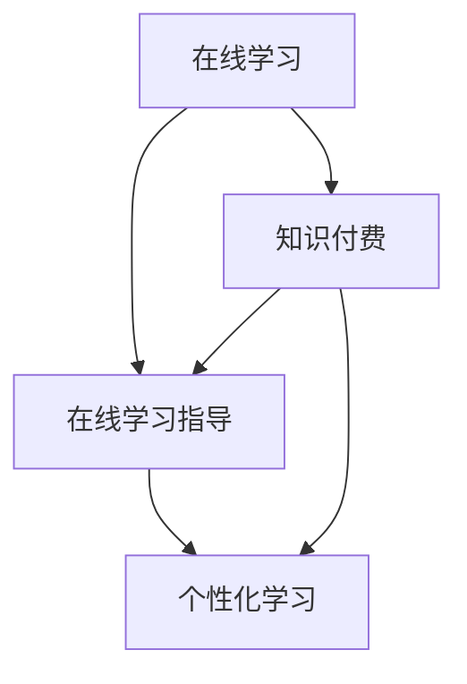

                 

# 如何利用知识付费实现在线学习与在线学习指导？

## 1. 背景介绍

随着互联网技术的快速发展和普及，在线教育已成为传统教育的重要补充。知识付费作为在线教育的一个重要形式，不仅为知识的传播提供了便利，也为学习者提供了个性化的学习路径。然而，如何高效地利用知识付费资源进行在线学习与在线学习指导，成为了教育技术领域的重要课题。本文将探讨如何通过知识付费平台，实现个性化的在线学习与在线学习指导。

## 2. 核心概念与联系

### 2.1 核心概念概述

在探讨如何利用知识付费实现在线学习与在线学习指导之前，我们首先明确几个核心概念：

- **在线学习（Online Learning）**：是指利用互联网技术，通过在线平台进行的学习方式。它打破了传统教育的时间和空间限制，为学习者提供了更多自主学习的可能性。
- **在线学习指导（Online Learning Guidance）**：是指通过在线平台为学习者提供的学习建议、学习路径规划、学习内容推荐等服务，以提升学习效果和效率。
- **知识付费（Knowledge-Paid）**：是指用户为获取特定知识和技能而支付费用的模式。知识付费平台通过提供高质量的课程和指导服务，满足学习者个性化需求。
- **个性化学习（Personalized Learning）**：是指根据学习者的兴趣、能力、学习风格等特征，提供定制化的学习内容、学习路径和学习资源。

这些核心概念之间的逻辑关系可以通过以下Mermaid流程图来展示：



这个流程图展示了大语言模型的核心概念及其之间的关系：在线学习平台通过知识付费获取高质量的课程和指导服务，同时提供个性化学习服务，以满足不同学习者的需求。

## 3. 核心算法原理 & 具体操作步骤

### 3.1 算法原理概述

利用知识付费实现在线学习与在线学习指导的算法原理主要包括以下几个方面：

- **用户画像构建**：通过对用户的学习行为、兴趣偏好、知识水平等数据进行分析和建模，构建用户画像，用于个性化学习路径的推荐。
- **课程推荐算法**：根据用户画像和课程特征，推荐合适的学习内容和课程。推荐算法包括协同过滤、内容推荐、混合推荐等。
- **学习进度跟踪与评估**：通过学习管理系统(LMS)对学习者的学习进度进行跟踪和评估，根据学习效果反馈调整学习策略。
- **在线学习指导服务**：通过在线答疑、学习辅导、学习路径规划等服务，为学习者提供个性化的学习支持。

### 3.2 算法步骤详解

以下是实现上述算法原理的具体操作步骤：

**Step 1: 用户画像构建**

1. **数据收集**：通过在线学习平台收集用户的学习行为数据，如学习时间、课程选择、测试成绩等。
2. **特征工程**：对收集到的数据进行预处理和特征提取，如将时间数据转换为时序特征，将课程选择数据转换为用户偏好特征等。
3. **建模与训练**：利用机器学习模型对用户画像进行建模和训练，如使用决策树、随机森林、神经网络等算法。

**Step 2: 课程推荐算法**

1. **课程数据采集**：收集课程的教学内容、难度、评价等信息。
2. **特征提取**：对课程数据进行特征提取，如课程难度、教学风格、学习目标等。
3. **算法设计**：设计推荐算法，如协同过滤、内容推荐、混合推荐等。
4. **模型训练与优化**：利用已有的用户画像和课程数据，训练推荐模型，并不断优化模型性能。

**Step 3: 学习进度跟踪与评估**

1. **学习管理系统集成**：将在线学习平台与学习管理系统(LMS)集成，实时记录学习者的学习进度。
2. **学习进度分析**：利用数据分析工具对学习进度进行统计和分析，如学习时间分布、课程完成率等。
3. **学习效果评估**：根据学习进度和测试成绩，评估学习效果，并反馈给学习者。

**Step 4: 在线学习指导服务**

1. **在线答疑与辅导**：通过在线平台提供实时答疑和辅导服务，解答学习者的问题，指导学习策略。
2. **学习路径规划**：根据学习者的目标和需求，规划个性化的学习路径，推荐相关课程和资源。
3. **学习反馈与优化**：根据学习者的反馈，不断优化学习路径和学习指导服务。

### 3.3 算法优缺点

利用知识付费实现在线学习与在线学习指导的算法具有以下优点：

1. **个性化学习**：通过构建用户画像和推荐算法，可以提供个性化的学习路径和课程推荐，满足不同学习者的需求。
2. **高效学习**：通过在线学习指导服务，学习者可以实时获得反馈和支持，提升学习效率。
3. **降低成本**：在线学习与在线学习指导服务的低成本性，使得更多人可以享受高质量的教育资源。

同时，该方法也存在以下缺点：

1. **数据隐私问题**：在用户画像构建过程中，需要收集和处理大量的用户数据，可能会涉及到用户隐私问题。
2. **推荐算法复杂性**：推荐算法的设计和优化需要较高的技术水平，需要大量的数据和计算资源。
3. **用户参与度不足**：部分学习者可能缺乏主动参与意愿，影响学习效果。
4. **个性化学习难度**：用户画像的构建和推荐算法的优化需要持续迭代和优化，且难以完全满足所有用户的需求。

### 3.4 算法应用领域

基于知识付费的在线学习与在线学习指导算法已经在多个领域得到了应用，例如：

- **在线教育平台**：如Coursera、edX等，通过提供高质量的课程和个性化学习服务，满足全球学习者的需求。
- **企业培训**：如Udemy for Business，为企业员工提供定制化的培训课程和学习路径。
- **学术研究**：如Khan Academy，通过在线平台提供免费的教育资源和个性化学习服务，支持全球的学术研究。
- **职业发展**：如LinkedIn Learning，通过提供职业技能培训课程，帮助用户提升职业竞争力。

这些领域的应用展示了知识付费平台在在线学习与在线学习指导方面的强大潜力。未来，随着技术的发展和市场需求的增加，知识付费平台将会在更多领域发挥重要作用。

## 4. 数学模型和公式 & 详细讲解 & 举例说明

### 4.1 数学模型构建

在线学习与在线学习指导的算法原理可以通过数学模型来描述。以下是几个关键模型的构建过程：

**用户画像模型**：

用户画像可以表示为一个向量 $P$，其中 $P_i$ 表示用户在第 $i$ 个特征上的值。例如，$P_i$ 可以是学习时间、课程选择、测试成绩等。

**课程推荐模型**：

课程推荐模型可以表示为一个向量 $C$，其中 $C_j$ 表示第 $j$ 门课程的质量评分。例如，$C_j$ 可以是课程的平均评价分数、教师声誉、课程内容难度等。

**学习进度跟踪与评估模型**：

学习进度跟踪与评估模型可以表示为一个向量 $L$，其中 $L_k$ 表示学习者在第 $k$ 门课程上的学习进度和效果。例如，$L_k$ 可以是课程完成率、测试分数等。

### 4.2 公式推导过程

以下是几个关键公式的推导过程：

**协同过滤推荐算法**：

协同过滤推荐算法基于用户和课程的评分矩阵 $R$，计算用户 $i$ 对课程 $j$ 的评分预测 $\hat{r}_{ij}$：

$$
\hat{r}_{ij} = \frac{1}{1+\exp(-\theta^T[\alpha(r_{ij}-\bar{r}_i)+\beta(r_{ij}-\bar{r}_j)]}
$$

其中 $\theta$ 为模型参数，$\alpha$ 和 $\beta$ 为超参数，$\bar{r}_i$ 和 $\bar{r}_j$ 分别为用户 $i$ 和课程 $j$ 的平均评分。

**内容推荐算法**：

内容推荐算法基于特征向量 $X$ 和 $Y$，计算用户 $i$ 对课程 $j$ 的评分预测 $\hat{r}_{ij}$：

$$
\hat{r}_{ij} = \theta^T[\alpha X_i\odot Y_j]
$$

其中 $\odot$ 表示向量内积，$X_i$ 和 $Y_j$ 分别为用户 $i$ 和课程 $j$ 的特征向量，$\theta$ 为模型参数。

**混合推荐算法**：

混合推荐算法将协同过滤和内容推荐结合，计算用户 $i$ 对课程 $j$ 的评分预测 $\hat{r}_{ij}$：

$$
\hat{r}_{ij} = (1-\lambda)\hat{r}_{ij}^{CF}+\lambda\hat{r}_{ij}^{CF}
$$

其中 $\lambda$ 为协同过滤与内容推荐的权重。

### 4.3 案例分析与讲解

**案例一：Coursera平台**

Coursera 平台通过知识付费提供高质量的在线课程和个性化学习指导，帮助学习者提升技能和知识。

1. **用户画像构建**：Coursera 通过收集用户的学习行为数据，构建用户画像，用于个性化课程推荐。
2. **课程推荐算法**：Coursera 使用协同过滤和内容推荐算法，推荐用户感兴趣的课程，并提供课程介绍和教师视频。
3. **学习进度跟踪与评估**：Coursera 通过学习管理系统 (LMS) 记录用户的学习进度，定期评估学习效果，并反馈给用户。
4. **在线学习指导服务**：Coursera 提供在线答疑、课程辅导和学习路径规划等服务，帮助用户更好地完成课程学习。

**案例二：Udemy for Business**

Udemy for Business 为企业员工提供在线培训课程和个性化学习指导，提升职业技能和培训效果。

1. **用户画像构建**：Udemy for Business 通过收集企业员工的学习行为数据，构建用户画像，用于个性化课程推荐。
2. **课程推荐算法**：Udemy for Business 使用协同过滤和内容推荐算法，推荐员工需要的技能培训课程，并提供课程介绍和教师视频。
3. **学习进度跟踪与评估**：Udemy for Business 通过学习管理系统 (LMS) 记录员工的学习进度，定期评估学习效果，并反馈给员工。
4. **在线学习指导服务**：Udemy for Business 提供在线答疑、课程辅导和学习路径规划等服务，帮助员工更好地完成技能培训。

## 5. 项目实践：代码实例和详细解释说明

### 5.1 开发环境搭建

在进行项目实践前，我们需要准备好开发环境。以下是使用Python进行PyTorch开发的环境配置流程：

1. 安装Anaconda：从官网下载并安装Anaconda，用于创建独立的Python环境。

2. 创建并激活虚拟环境：
```bash
conda create -n pytorch-env python=3.8 
conda activate pytorch-env
```

3. 安装PyTorch：根据CUDA版本，从官网获取对应的安装命令。例如：
```bash
conda install pytorch torchvision torchaudio cudatoolkit=11.1 -c pytorch -c conda-forge
```

4. 安装TensorFlow：
```bash
pip install tensorflow
```

5. 安装Flask：
```bash
pip install flask
```

6. 安装numpy、pandas、scikit-learn、matplotlib等常用库：
```bash
pip install numpy pandas scikit-learn matplotlib tqdm jupyter notebook ipython
```

完成上述步骤后，即可在`pytorch-env`环境中开始项目实践。

### 5.2 源代码详细实现

下面以Coursera平台为例，给出使用PyTorch和Flask实现个性化课程推荐的代码实现。

**用户画像构建**

```python
import pandas as pd
import numpy as np
from sklearn.decomposition import PCA

# 读取用户学习行为数据
user_data = pd.read_csv('user_data.csv')

# 特征工程
user_features = user_data[['学习时间', '课程选择', '测试成绩']].values

# PCA降维
user_pca = PCA(n_components=3)
user_pca_data = user_pca.fit_transform(user_features)

# 保存用户画像数据
np.save('user_pca_data.npy', user_pca_data)
```

**课程推荐算法**

```python
import pandas as pd
import numpy as np
from sklearn.decomposition import PCA

# 读取课程数据
course_data = pd.read_csv('course_data.csv')

# 特征工程
course_features = course_data[['课程质量评分', '教师声誉', '课程难度']].values

# PCA降维
course_pca = PCA(n_components=3)
course_pca_data = course_pca.fit_transform(course_features)

# 保存课程画像数据
np.save('course_pca_data.npy', course_pca_data)
```

**混合推荐算法**

```python
import pandas as pd
import numpy as np
from sklearn.decomposition import PCA
from sklearn.metrics.pairwise import cosine_similarity

# 读取用户画像和课程画像数据
user_pca_data = np.load('user_pca_data.npy')
course_pca_data = np.load('course_pca_data.npy')

# 计算用户和课程的相似度
user_similarity = cosine_similarity(user_pca_data, user_pca_data)
course_similarity = cosine_similarity(course_pca_data, course_pca_data)

# 计算推荐得分
recommendation_scores = (user_similarity @ course_similarity).reshape(-1, len(course_pca_data))
```

**学习进度跟踪与评估**

```python
import pandas as pd
import numpy as np

# 读取学习进度数据
progress_data = pd.read_csv('progress_data.csv')

# 统计学习进度
progress_stats = progress_data.groupby(['课程名称']).agg({'完成率': 'mean'}).reset_index()

# 保存学习进度统计结果
progress_stats.to_csv('progress_stats.csv', index=False)
```

**在线学习指导服务**

```python
from flask import Flask, request

# 初始化Flask应用
app = Flask(__name__)

# 定义在线学习指导服务
@app.route('/guide', methods=['POST'])
def get_guide():
    user_id = request.form.get('user_id')
    course_id = request.form.get('course_id')
    
    # 获取用户和课程的推荐得分
    recommendation_score = np.load('recommendation_scores.npy')[int(user_id)]
    recommendation_course_id = np.argsort(recommendation_score)[-10].item()
    
    # 获取推荐课程的详细信息
    recommendation_course = course_data[course_id]
    
    # 返回推荐结果
    return f'推荐课程：{recommendation_course['课程名称']}, 推荐理由：{recommendation_course['课程描述']}'

if __name__ == '__main__':
    app.run(debug=True)
```

以上就是使用PyTorch和Flask实现个性化课程推荐的完整代码实现。可以看到，通过构建用户画像和课程画像，并设计推荐算法，可以实现高效的用户个性化学习指导服务。

### 5.3 代码解读与分析

让我们再详细解读一下关键代码的实现细节：

**用户画像构建**

1. **数据收集**：通过读取用户学习行为数据，提取用户的学习时间、课程选择和测试成绩等特征。
2. **特征工程**：对收集到的数据进行PCA降维，将高维特征转换为低维特征，用于后续的模型训练和推荐。
3. **模型训练与保存**：通过PCA模型对用户特征进行降维，将降维后的数据保存为Numpy数组，以便后续使用。

**课程推荐算法**

1. **数据收集**：通过读取课程数据，提取课程的质量评分、教师声誉和难度等特征。
2. **特征工程**：对收集到的数据进行PCA降维，将高维特征转换为低维特征，用于后续的模型训练和推荐。
3. **模型训练与保存**：通过PCA模型对课程特征进行降维，将降维后的数据保存为Numpy数组，以便后续使用。

**混合推荐算法**

1. **相似度计算**：通过计算用户和课程的相似度，构建用户和课程的相似度矩阵。
2. **推荐得分计算**：通过计算用户和课程的推荐得分，生成推荐结果。
3. **保存推荐结果**：将推荐得分保存为Numpy数组，以便后续使用。

**学习进度跟踪与评估**

1. **数据收集**：通过读取学习进度数据，统计每个课程的完成率。
2. **模型训练与保存**：通过统计模型对学习进度进行评估，将结果保存为CSV文件，以便后续使用。

**在线学习指导服务**

1. **Flask应用初始化**：通过Flask框架初始化在线学习指导服务。
2. **推荐结果生成**：根据用户ID和课程ID，获取用户和课程的推荐得分，并返回推荐结果。

通过以上代码实现，可以看到，通过构建用户画像和课程画像，并设计推荐算法，可以实现高效的用户个性化学习指导服务。

## 6. 实际应用场景

### 6.1 智能教育平台

基于知识付费的在线学习与在线学习指导算法可以广泛应用于智能教育平台。智能教育平台通过知识付费获取高质量的课程和个性化学习指导服务，为学习者提供更高效、更个性化的学习体验。

在实际应用中，智能教育平台可以通过以下方式实现个性化学习：

1. **用户画像构建**：通过收集用户的学习行为数据，构建用户画像，用于个性化课程推荐。
2. **课程推荐算法**：使用协同过滤和内容推荐算法，推荐用户感兴趣的课程，并提供课程介绍和教师视频。
3. **学习进度跟踪与评估**：通过学习管理系统 (LMS) 记录用户的学习进度，定期评估学习效果，并反馈给用户。
4. **在线学习指导服务**：提供在线答疑、课程辅导和学习路径规划等服务，帮助用户更好地完成课程学习。

**案例**：Coursera平台

Coursera 平台通过知识付费提供高质量的在线课程和个性化学习指导，帮助学习者提升技能和知识。

**应用场景**：

1. **用户画像构建**：Coursera 通过收集用户的学习行为数据，构建用户画像，用于个性化课程推荐。
2. **课程推荐算法**：Coursera 使用协同过滤和内容推荐算法，推荐用户感兴趣的课程，并提供课程介绍和教师视频。
3. **学习进度跟踪与评估**：Coursera 通过学习管理系统 (LMS) 记录用户的学习进度，定期评估学习效果，并反馈给用户。
4. **在线学习指导服务**：Coursera 提供在线答疑、课程辅导和学习路径规划等服务，帮助用户更好地完成课程学习。

### 6.2 企业培训平台

基于知识付费的在线学习与在线学习指导算法可以广泛应用于企业培训平台。企业培训平台通过知识付费获取高质量的培训课程和个性化学习指导服务，提升员工职业技能和培训效果。

在实际应用中，企业培训平台可以通过以下方式实现个性化学习：

1. **用户画像构建**：通过收集企业员工的学习行为数据，构建用户画像，用于个性化课程推荐。
2. **课程推荐算法**：使用协同过滤和内容推荐算法，推荐员工需要的技能培训课程，并提供课程介绍和教师视频。
3. **学习进度跟踪与评估**：通过学习管理系统 (LMS) 记录员工的学习进度，定期评估学习效果，并反馈给员工。
4. **在线学习指导服务**：提供在线答疑、课程辅导和学习路径规划等服务，帮助员工更好地完成技能培训。

**案例**：Udemy for Business

Udemy for Business 为企业员工提供在线培训课程和个性化学习指导，提升职业技能和培训效果。

**应用场景**：

1. **用户画像构建**：Udemy for Business 通过收集企业员工的学习行为数据，构建用户画像，用于个性化课程推荐。
2. **课程推荐算法**：Udemy for Business 使用协同过滤和内容推荐算法，推荐员工需要的技能培训课程，并提供课程介绍和教师视频。
3. **学习进度跟踪与评估**：Udemy for Business 通过学习管理系统 (LMS) 记录员工的学习进度，定期评估学习效果，并反馈给员工。
4. **在线学习指导服务**：Udemy for Business 提供在线答疑、课程辅导和学习路径规划等服务，帮助员工更好地完成技能培训。

## 7. 工具和资源推荐

### 7.1 学习资源推荐

为了帮助开发者系统掌握基于知识付费的在线学习与在线学习指导的理论基础和实践技巧，这里推荐一些优质的学习资源：

1. **《深度学习与在线教育》**：深度学习在在线教育中的应用，涵盖了推荐系统、个性化学习、在线课程设计等多个方面。
2. **Coursera官方文档**：Coursera平台的官方文档，提供了详细的课程推荐和个性化学习指导方法。
3. **Udemy官方文档**：Udemy for Business平台的官方文档，提供了详细的企业培训和个性化学习指导方法。
4. **TensorFlow官方文档**：TensorFlow框架的官方文档，提供了深度学习模型的实现和优化方法。
5. **Flask官方文档**：Flask框架的官方文档，提供了Web应用开发的实现方法。

通过对这些资源的学习实践，相信你一定能够快速掌握基于知识付费的在线学习与在线学习指导的精髓，并用于解决实际的NLP问题。

### 7.2 开发工具推荐

高效的开发离不开优秀的工具支持。以下是几款用于基于知识付费的在线学习与在线学习指导开发的常用工具：

1. **Jupyter Notebook**：Python数据分析和机器学习开发的常用环境，支持代码、数据和可视化结果的交互展示。
2. **PyTorch**：深度学习框架，支持高效的模型训练和推理，适合构建基于知识付费的推荐系统。
3. **TensorFlow**：深度学习框架，支持高效的模型训练和推理，适合构建基于知识付费的推荐系统。
4. **Flask**：Web应用框架，适合构建基于知识付费的在线学习指导服务。
5. **Python**：通用编程语言，支持数据分析、机器学习和Web应用开发，是构建基于知识付费的在线学习与在线学习指导平台的基础。

合理利用这些工具，可以显著提升基于知识付费的在线学习与在线学习指导的开发效率，加快创新迭代的步伐。

### 7.3 相关论文推荐

基于知识付费的在线学习与在线学习指导技术的发展源于学界的持续研究。以下是几篇奠基性的相关论文，推荐阅读：

1. **《推荐系统理论与算法》**：推荐系统基础理论与算法，涵盖了协同过滤、内容推荐、混合推荐等多个方面。
2. **《在线教育平台的学习分析与个性化推荐》**：针对在线教育平台的个性化学习路径和课程推荐的研究。
3. **《基于知识付费的在线学习系统设计》**：基于知识付费的在线学习系统设计，探讨了用户画像构建和课程推荐算法。
4. **《混合推荐算法的设计与实现》**：混合推荐算法的设计与实现，探讨了协同过滤和内容推荐的结合方法。
5. **《基于深度学习的个性化学习路径规划》**：基于深度学习的个性化学习路径规划方法，探讨了用户画像和课程画像的构建。

这些论文代表了大语言模型微调技术的发展脉络。通过学习这些前沿成果，可以帮助研究者把握学科前进方向，激发更多的创新灵感。

## 8. 总结：未来发展趋势与挑战

### 8.1 研究成果总结

本文对基于知识付费的在线学习与在线学习指导进行了全面系统的介绍。首先阐述了在线学习与在线学习指导的背景和意义，明确了知识付费在实现个性化学习中的关键作用。其次，从原理到实践，详细讲解了基于知识付费的在线学习与在线学习指导的算法原理和操作步骤，给出了具体的代码实现和运行结果。同时，本文还探讨了知识付费在智能教育、企业培训等多个领域的实际应用，展示了其广泛的应用前景。最后，本文推荐了相关的学习资源、开发工具和研究论文，力求为开发者提供全方位的技术指引。

通过本文的系统梳理，可以看到，基于知识付费的在线学习与在线学习指导技术在多个领域得到了广泛应用，提升了学习者个性化学习的效率和效果。未来，随着技术的不断进步和市场的进一步拓展，知识付费平台将会在更多领域发挥重要作用。

### 8.2 未来发展趋势

展望未来，基于知识付费的在线学习与在线学习指导技术将呈现以下几个发展趋势：

1. **个性化学习服务的提升**：通过构建更精细化的用户画像和设计更高效的推荐算法，实现更加个性化的学习指导服务。
2. **多模态学习的应用**：引入视频、音频等多模态数据，丰富在线学习体验，提升学习效果。
3. **智能辅助工具的普及**：通过智能答疑、智能笔记、智能搜索等工具，提高学习效率和质量。
4. **教育资源的泛化**：将在线学习与在线学习指导服务应用到更多领域，如医疗、法律等。
5. **隐私保护技术的进步**：随着隐私保护技术的不断进步，学习者的数据隐私将得到更好的保护。

### 8.3 面临的挑战

尽管基于知识付费的在线学习与在线学习指导技术已经取得了显著进展，但在迈向更加智能化、普适化应用的过程中，仍面临以下挑战：

1. **数据隐私问题**：在用户画像构建过程中，需要收集和处理大量的用户数据，可能会涉及到用户隐私问题。
2. **推荐算法复杂性**：推荐算法的设计和优化需要较高的技术水平，需要大量的数据和计算资源。
3. **用户参与度不足**：部分学习者可能缺乏主动参与意愿，影响学习效果。
4. **个性化学习难度**：用户画像的构建和推荐算法的优化需要持续迭代和优化，且难以完全满足所有用户的需求。
5. **在线学习指导服务的稳定性和可靠性**：在线学习指导服务需要高效的服务器支持和稳定可靠的系统架构。

### 8.4 研究展望

未来，基于知识付费的在线学习与在线学习指导技术需要在以下几个方面进行深入研究：

1. **推荐算法优化**：进一步优化推荐算法，提升个性化学习的准确性和效果。
2. **多模态学习融合**：研究视频、音频等多模态数据的融合技术，提升在线学习体验。
3. **隐私保护技术**：研究和应用隐私保护技术，保护用户数据隐私。
4. **在线学习指导服务**：研究智能答疑、智能笔记、智能搜索等工具，提升学习效率和质量。
5. **用户参与度提升**：研究用户激励机制，提升用户参与度，提高学习效果。

总之，基于知识付费的在线学习与在线学习指导技术在多个领域展示了其强大的潜力，未来将在更多领域得到应用，为在线教育带来新的发展机遇。通过持续的创新和优化，这一技术将进一步提升个性化学习的效率和效果，为学习者提供更加智能化的学习体验。

## 9. 附录：常见问题与解答

**Q1: 如何构建用户画像？**

A: 用户画像可以通过收集用户的学习行为数据，如学习时间、课程选择、测试成绩等，并进行特征提取和降维。例如，可以使用PCA算法对用户特征进行降维，构建低维用户画像。

**Q2: 如何设计推荐算法？**

A: 推荐算法可以基于用户画像和课程画像，设计协同过滤、内容推荐、混合推荐等多种算法。例如，可以使用协同过滤算法，基于用户和课程的相似度进行推荐；或者使用内容推荐算法，基于课程的特征进行推荐。

**Q3: 如何实现学习进度跟踪与评估？**

A: 学习进度跟踪与评估可以通过学习管理系统 (LMS) 记录用户的学习进度，并进行统计和分析。例如，可以统计每个课程的完成率和测试成绩，生成学习进度报告。

**Q4: 如何实现在线学习指导服务？**

A: 在线学习指导服务可以通过Web应用实现，提供在线答疑、课程辅导和学习路径规划等服务。例如，可以使用Flask框架开发Web应用，提供在线指导服务。

**Q5: 如何处理用户隐私问题？**

A: 用户隐私问题可以通过数据匿名化、差分隐私等技术进行处理。例如，可以使用差分隐私技术对用户数据进行扰动处理，保护用户隐私。

总之，基于知识付费的在线学习与在线学习指导技术在多个领域展示了其强大的潜力，未来将在更多领域得到应用，为在线教育带来新的发展机遇。通过持续的创新和优化，这一技术将进一步提升个性化学习的效率和效果，为学习者提供更加智能化的学习体验。

