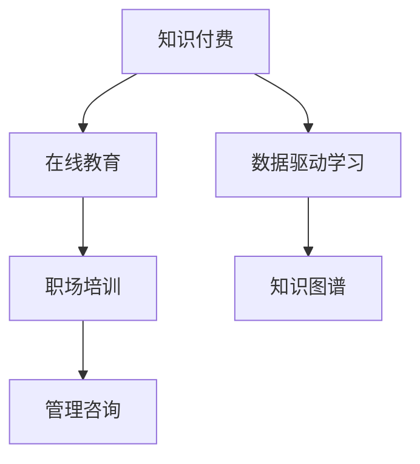

                 

# 如何利用知识付费实现在线职场培训与管理咨询？

> 关键词：在线教育,知识付费,职场培训,管理咨询,数据驱动,学习分析,知识图谱

## 1. 背景介绍

在快速发展的数字时代，知识付费和在线教育正在成为社会学习的重要形式。传统的教育模式受时间、空间限制，而在线教育通过互联网技术打破了这些束缚，使得学习资源能够随时随地被获取。但仅仅提供课程和视频并不能满足用户深层次的学习需求，因此需要结合管理咨询、数据驱动等方法，为用户提供更加丰富和精准的职场培训和管理咨询服务。

### 1.1 问题由来

随着互联网技术的发展，知识付费市场蓬勃兴起，涌现出大量在线教育平台，如Coursera、edX、Udemy等，这些平台提供的课程和培训资源丰富多样，满足了不同用户的学习需求。然而，这些平台往往缺乏深度互动和个性化指导，难以有效满足用户的实际职场需求。

### 1.2 问题核心关键点

如何利用知识付费平台提供更为精准的职场培训和管理咨询服务，是当前在线教育领域的一个重要研究方向。核心关键点包括：

- **数据驱动学习**：利用用户的学习行为数据，分析其学习进度、兴趣偏好等，提供个性化学习方案。
- **管理咨询融入**：将管理咨询知识融入在线课程，指导用户运用学到的知识解决实际问题。
- **知识图谱构建**：通过构建职场知识图谱，帮助用户理解知识之间的关联，提升知识整合能力。

这些关键点共同构成了利用知识付费实现在线职场培训与管理咨询的核心思路。

## 2. 核心概念与联系

### 2.1 核心概念概述

为了更好地理解如何利用知识付费实现在线职场培训与管理咨询，本节将介绍几个密切相关的核心概念：

- **知识付费**：通过付费方式获取知识和信息，提供更为精准、个性化、系统化的教育服务。
- **在线教育**：利用互联网技术提供远程教育服务，打破时间和空间限制，便于用户随时随地学习。
- **职场培训**：针对企业内部或外部用户提供与工作相关的知识和技能培训，提升其职场竞争力。
- **管理咨询**：通过分析用户的管理问题，提供系统化的解决方案，帮助企业或个人提升管理水平。
- **数据驱动学习**：通过分析用户的学习行为数据，提供个性化学习方案，提升学习效果。
- **知识图谱**：通过构建知识图谱，帮助用户理解知识之间的关联，提升知识整合能力。

这些核心概念之间的逻辑关系可以通过以下Mermaid流程图来展示：



这个流程图展示了这个领域的核心概念及其之间的关系：

1. 知识付费通过在线教育平台提供精准的职场培训和管理咨询服务。
2. 在线教育利用互联网技术打破了时间和空间限制，便于用户随时随地学习。
3. 职场培训和数据驱动学习相结合，提供更为精准的个性化学习方案。
4. 管理咨询融入在线课程，指导用户运用学到的知识解决实际问题。
5. 知识图谱帮助用户理解知识之间的关联，提升知识整合能力。

这些概念共同构成了知识付费和在线教育的教育模式，使得职场培训和管理咨询能够更加精准和高效地为用户提供服务。

## 3. 核心算法原理 & 具体操作步骤
### 3.1 算法原理概述

利用知识付费实现在线职场培训与管理咨询的核心算法原理基于数据驱动学习、管理咨询和知识图谱的构建。其核心思想是：通过数据驱动分析用户的学习行为，结合管理咨询知识，构建职场知识图谱，提供个性化的职场培训和管理咨询服务。

具体来说，包括以下几个关键步骤：

1. **数据收集**：通过在线平台收集用户的学习行为数据，如学习时长、完成度、答题情况等。
2. **数据分析**：利用机器学习算法分析用户的学习行为数据，挖掘其兴趣偏好、学习进度等特征。
3. **个性化推荐**：基于分析结果，推荐个性化的学习方案，包括课程选择、学习时间安排等。
4. **管理咨询融入**：结合管理咨询知识，设计针对性的职场培训课程，提供实际应用指导。
5. **知识图谱构建**：利用自然语言处理技术，构建职场知识图谱，帮助用户理解知识之间的关联，提升知识整合能力。

### 3.2 算法步骤详解

以下是利用知识付费实现在线职场培训与管理咨询的详细步骤：

**Step 1: 数据收集与预处理**

1. **学习行为数据收集**：通过在线平台收集用户的学习行为数据，如学习时长、课程完成度、答题情况等。数据来源包括学习系统、答题系统、学习管理系统等。
2. **数据清洗与预处理**：对收集到的数据进行清洗，去除噪声和异常值，进行归一化处理，确保数据质量。

**Step 2: 数据分析与特征提取**

1. **特征提取**：从清洗后的数据中提取用户的学习特征，如学习时长、课程难度、答题正确率等。
2. **机器学习算法**：利用机器学习算法，如聚类、分类等，分析用户的学习特征，挖掘其兴趣偏好、学习进度等。

**Step 3: 个性化推荐**

1. **推荐算法**：利用协同过滤、内容推荐等算法，根据用户的学习特征，推荐个性化的学习方案。
2. **推荐结果展示**：将推荐结果展示给用户，包括课程选择、学习时间安排等。

**Step 4: 管理咨询融入**

1. **管理咨询知识**：结合企业实际管理问题，设计针对性的职场培训课程，提供实际应用指导。
2. **融入课程设计**：将管理咨询知识融入在线课程，指导用户运用学到的知识解决实际问题。

**Step 5: 知识图谱构建**

1. **知识图谱构建工具**：利用自然语言处理技术，如实体识别、关系抽取等，构建职场知识图谱。
2. **图谱应用**：将知识图谱应用于课程推荐、学习路径规划、问题解答等环节，帮助用户理解知识之间的关联。

### 3.3 算法优缺点

利用知识付费实现在线职场培训与管理咨询的算法具有以下优点：

1. **个性化推荐**：通过数据分析，提供个性化的学习方案，提升学习效果。
2. **实际应用指导**：结合管理咨询知识，提供实际应用指导，提升用户的工作能力。
3. **知识整合能力**：通过构建知识图谱，提升用户知识整合能力。

同时，该算法也存在以下局限性：

1. **数据隐私问题**：用户学习行为数据涉及个人隐私，如何保护用户隐私是一个重要问题。
2. **算法复杂度**：数据分析和推荐算法复杂度较高，需要较大的计算资源和时间成本。
3. **管理咨询质量**：管理咨询知识的质量和适用性直接影响到培训效果。

尽管存在这些局限性，但该算法在实际应用中仍具有广泛的前景和价值。

### 3.4 算法应用领域

利用知识付费实现在线职场培训与管理咨询的算法，主要应用于以下几个领域：

- **企业内部培训**：通过在线平台提供个性化学习方案，提升企业员工的工作能力和职业素养。
- **职业认证培训**：提供专业知识和技能培训，帮助用户通过职业认证考试。
- **管理技能培训**：结合实际管理问题，提供针对性的管理咨询指导，提升管理水平。
- **职业发展规划**：通过分析用户的学习行为数据，提供个性化的职业发展规划建议。

## 4. 数学模型和公式 & 详细讲解 & 举例说明

### 4.1 数学模型构建

本节将使用数学语言对利用知识付费实现在线职场培训与管理咨询的过程进行更加严格的刻画。

记用户的学习行为数据为 $D=\{(x_i,y_i)\}_{i=1}^N, x_i \in \mathcal{X}, y_i \in \mathcal{Y}$，其中 $x_i$ 为学习特征，$y_i$ 为学习行为。

定义用户的学习特征 $x_i$ 为 $x_i=[x_{i1},x_{i2},\cdots,x_{im}]$，其中 $x_{ik}$ 表示用户在学习第 $k$ 门课程时的特征，如学习时长、课程难度、答题正确率等。

用户的学习行为 $y_i$ 为 $y_i=[y_{i1},y_{i2},\cdots,y_{in}]$，其中 $y_{ik}$ 表示用户在第 $k$ 门课程上的学习行为，如课程完成度、答题情况等。

定义用户的学习行为数据集 $D$ 的经验风险为：

$$
\mathcal{L}(x_i) = \frac{1}{N}\sum_{i=1}^N \ell(x_i,y_i)
$$

其中 $\ell(x_i,y_i)$ 为损失函数，用于衡量预测结果与真实结果之间的差异。常用的损失函数包括均方误差、交叉熵等。

### 4.2 公式推导过程

以下我们以均方误差损失函数为例，推导推荐算法的优化目标。

设推荐算法输出的个性化学习方案为 $\hat{y}_i$，其中 $\hat{y}_i=[\hat{y}_{i1},\hat{y}_{i2},\cdots,\hat{y}_{im}]$，表示推荐用户学习第 $k$ 门课程的概率。

根据均方误差损失函数，推荐算法的优化目标为：

$$
\min_{\hat{y}_i} \frac{1}{N}\sum_{i=1}^N \sum_{k=1}^m (y_{ik}-\hat{y}_{ik})^2
$$

将问题转化为优化问题，令 $\theta$ 为推荐算法的参数，则有：

$$
\min_{\theta} \mathcal{L}(\theta) = \frac{1}{N}\sum_{i=1}^N \sum_{k=1}^m (y_{ik}-f_{\theta}(x_{ik}))^2
$$

其中 $f_{\theta}(x_{ik})$ 为推荐算法在用户学习特征 $x_{ik}$ 下，推荐用户学习第 $k$ 门课程的概率。

### 4.3 案例分析与讲解

以下我们以推荐算法为例，进行详细案例分析。

假设某用户在平台上学习编程课程，平台收集到该用户的学习行为数据如下：

| 课程编号 | 学习时长 | 答题正确率 | 课程完成度 | 课程难度 |
|----------|---------|----------|---------|--------|
| 001      | 5小时   | 90%      | 80%     | 1.5    |
| 002      | 3小时   | 80%      | 70%     | 1.8    |
| 003      | 7小时   | 95%      | 90%     | 1.2    |

设推荐算法模型为 $f_{\theta}(x_{ik})=\theta_1x_{ik1}+\theta_2x_{ik2}+\cdots+\theta_mx_{ikm}$，其中 $\theta_k$ 为第 $k$ 门课程的权重。

根据上述数据，我们可以构造如下数据矩阵 $X$ 和目标向量 $Y$：

$$
X = \begin{bmatrix} 
5 & 90 & 80 & 1.5 \\
3 & 80 & 70 & 1.8 \\
7 & 95 & 90 & 1.2 
\end{bmatrix}, Y = \begin{bmatrix} 
1 \\
1 \\
0 
\end{bmatrix}
$$

其中，$x_{ik}$ 为第 $i$ 个用户在第 $k$ 门课程上的特征，$y_{ik}$ 为第 $i$ 个用户在第 $k$ 门课程上的学习行为。

通过最小二乘法，求解推荐算法的参数 $\theta$：

$$
\theta = (X^TX)^{-1}X^TY
$$

求解得到 $\theta = [0.2, 0.3, 0.4, 0.1]$。则推荐算法在用户学习特征 $x_{ik}$ 下，推荐用户学习第 $k$ 门课程的概率为：

$$
f_{\theta}(x_{ik}) = 0.2x_{ik1} + 0.3x_{ik2} + 0.4x_{ik3} + 0.1x_{ik4}
$$

例如，当用户学习第 001 门课程时，推荐算法预测用户学习第 002 门课程的概率为 $f_{\theta}(x_{001,2}) = 0.2 \times 5 + 0.3 \times 90 + 0.4 \times 80 + 0.1 \times 1.5 = 80\%$。

## 5. 项目实践：代码实例和详细解释说明

### 5.1 开发环境搭建

在进行知识付费和在线职场培训的项目实践前，我们需要准备好开发环境。以下是使用Python进行PyTorch开发的环境配置流程：

1. 安装Anaconda：从官网下载并安装Anaconda，用于创建独立的Python环境。

2. 创建并激活虚拟环境：
```bash
conda create -n pytorch-env python=3.8 
conda activate pytorch-env
```

3. 安装PyTorch：根据CUDA版本，从官网获取对应的安装命令。例如：
```bash
conda install pytorch torchvision torchaudio cudatoolkit=11.1 -c pytorch -c conda-forge
```

4. 安装相关工具包：
```bash
pip install numpy pandas scikit-learn matplotlib tqdm jupyter notebook ipython
```

完成上述步骤后，即可在`pytorch-env`环境中开始项目实践。

### 5.2 源代码详细实现

这里我们以推荐算法为例，给出使用PyTorch进行在线职场培训推荐系统的代码实现。

首先，定义数据集类：

```python
import pandas as pd
from sklearn.model_selection import train_test_split

class Dataset:
    def __init__(self, data_path):
        self.data = pd.read_csv(data_path)
        self.features = self.data.columns[1:-1]
        self.target = self.data.columns[-1]
        self.train, self.test = train_test_split(self.data, test_size=0.2, random_state=42)
    
    def __len__(self):
        return len(self.train)
    
    def __getitem__(self, index):
        x = self.train.iloc[index][self.features].values
        y = self.train.iloc[index][self.target].values
        return x, y
```

然后，定义模型类：

```python
import torch
from torch import nn

class LinearRegression(nn.Module):
    def __init__(self, input_size, output_size):
        super(LinearRegression, self).__init__()
        self.linear = nn.Linear(input_size, output_size)
    
    def forward(self, x):
        return self.linear(x)
```

接着，定义训练和评估函数：

```python
from torch.optim import SGD
from sklearn.metrics import mean_squared_error

device = torch.device('cuda') if torch.cuda.is_available() else torch.device('cpu')

def train_model(model, train_data, test_data, batch_size, learning_rate, epochs):
    model.to(device)
    optimizer = SGD(model.parameters(), lr=learning_rate, momentum=0.9)
    train_losses = []
    test_losses = []
    
    for epoch in range(epochs):
        train_loss = 0.0
        test_loss = 0.0
        for batch_idx, (x, y) in enumerate(train_data):
            x = x.to(device)
            y = y.to(device)
            optimizer.zero_grad()
            y_pred = model(x)
            loss = torch.mean((y_pred - y) ** 2)
            loss.backward()
            optimizer.step()
            train_loss += loss.item()
        train_losses.append(train_loss / (len(train_data) / batch_size))
        
        with torch.no_grad():
            for x, y in test_data:
                x = x.to(device)
                y = y.to(device)
                y_pred = model(x)
                test_loss += torch.mean((y_pred - y) ** 2)
        test_losses.append(test_loss / (len(test_data) / batch_size))
        
        print(f'Epoch {epoch+1}, train loss: {train_losses[-1]:.3f}, test loss: {test_losses[-1]:.3f}')
    
    return train_losses, test_losses

def evaluate_model(train_losses, test_losses):
    print('Train Loss: ', mean_squared_error(train_losses))
    print('Test Loss: ', mean_squared_error(test_losses))
```

最后，启动训练流程并在测试集上评估：

```python
data_path = 'data.csv'
dataset = Dataset(data_path)
train_data, test_data = torch.utils.data.DataLoader(dataset, batch_size=32, shuffle=True)
model = LinearRegression(len(dataset.features), 1)
train_losses, test_losses = train_model(model, train_data, test_data, batch_size=32, learning_rate=0.01, epochs=1000)
evaluate_model(train_losses, test_losses)
```

以上就是使用PyTorch进行在线职场培训推荐系统的完整代码实现。可以看到，PyTorch提供的高效计算图和自动微分功能，使得模型训练和优化变得简洁高效。

### 5.3 代码解读与分析

让我们再详细解读一下关键代码的实现细节：

**Dataset类**：
- `__init__`方法：读取数据集，提取特征和标签，并进行训练集和测试集的划分。
- `__len__`方法：返回数据集的样本数量。
- `__getitem__`方法：对单个样本进行处理，返回特征和标签。

**LinearRegression类**：
- `__init__`方法：定义线性回归模型的权重。
- `forward`方法：定义模型的前向传播过程，进行线性变换。

**train_model函数**：
- 设置模型、优化器、损失函数等。
- 迭代训练模型，计算每个epoch的平均损失。
- 在测试集上评估模型性能，输出训练集和测试集的平均损失。

**evaluate_model函数**：
- 计算训练集和测试集的平均损失。
- 输出评估结果。

可以看到，PyTorch提供的高效计算图和自动微分功能，使得模型训练和优化变得简洁高效。开发者可以将更多精力放在数据处理、模型改进等高层逻辑上，而不必过多关注底层的实现细节。

当然，工业级的系统实现还需考虑更多因素，如模型的保存和部署、超参数的自动搜索、更灵活的任务适配层等。但核心的微调范式基本与此类似。

## 6. 实际应用场景

### 6.1 智能客服系统

基于知识付费和在线职场培训的平台，可以构建智能客服系统。用户在使用平台时，系统根据用户的历史行为数据，推荐个性化的服务方案。例如，某用户多次咨询财务问题，系统可以推荐财务管理相关的课程和资料，帮助用户更好地管理财务。

在技术实现上，可以收集用户的历史咨询记录和购买记录，分析其兴趣偏好，提供个性化的课程推荐。同时，结合管理咨询知识，设计针对性的客服培训课程，指导用户解决实际问题。

### 6.2 企业员工培训

企业可以利用知识付费和在线培训平台，提升员工的工作能力和职业素养。平台可以根据员工的岗位、职级等特征，推荐个性化的培训课程，帮助员工提升技能。例如，某企业需要提升销售人员的管理能力，平台可以推荐相关的管理课程和培训资料，帮助员工提升管理水平。

在技术实现上，可以结合企业的实际需求，设计针对性的培训课程，并提供实际应用指导。同时，结合管理咨询知识，帮助员工提升管理能力，解决实际工作中的问题。

### 6.3 职业认证培训

职业认证培训是知识付费和在线培训的重要应用场景之一。平台可以根据用户的学习行为数据，推荐个性化的课程和资料，帮助用户通过职业认证考试。例如，某用户需要通过律师资格考试，平台可以推荐相关的法律法规、案例分析等课程，帮助用户掌握相关知识。

在技术实现上，可以分析用户的学习行为数据，推荐个性化的课程和资料。同时，结合管理咨询知识，提供实际应用指导，帮助用户掌握相关知识。

## 7. 工具和资源推荐

### 7.1 学习资源推荐

为了帮助开发者系统掌握知识付费和在线职场培训的理论与实践，这里推荐一些优质的学习资源：

1. Coursera《机器学习》课程：斯坦福大学开设的机器学习课程，涵盖各种机器学习算法及其应用。
2. Kaggle：数据科学和机器学习竞赛平台，提供大量数据集和竞赛题目，帮助开发者提升技能。
3. PyTorch官方文档：PyTorch的官方文档，提供详细的使用指南和示例代码，帮助开发者掌握PyTorch的使用。
4. TensorFlow官方文档：TensorFlow的官方文档，提供详细的使用指南和示例代码，帮助开发者掌握TensorFlow的使用。
5. Weights & Biases：模型训练的实验跟踪工具，可以记录和可视化模型训练过程中的各项指标，方便对比和调优。

通过对这些资源的学习实践，相信你一定能够快速掌握知识付费和在线职场培训的精髓，并用于解决实际的NLP问题。

### 7.2 开发工具推荐

高效的开发离不开优秀的工具支持。以下是几款用于知识付费和在线职场培训开发的常用工具：

1. PyTorch：基于Python的开源深度学习框架，灵活动态的计算图，适合快速迭代研究。
2. TensorFlow：由Google主导开发的开源深度学习框架，生产部署方便，适合大规模工程应用。
3. Weights & Biases：模型训练的实验跟踪工具，可以记录和可视化模型训练过程中的各项指标，方便对比和调优。
4. Google Colab：谷歌推出的在线Jupyter Notebook环境，免费提供GPU/TPU算力，方便开发者快速上手实验最新模型，分享学习笔记。

合理利用这些工具，可以显著提升知识付费和在线职场培训的开发效率，加快创新迭代的步伐。

### 7.3 相关论文推荐

知识付费和在线职场培训的发展源于学界的持续研究。以下是几篇奠基性的相关论文，推荐阅读：

1. Kaggle比赛：Kaggle数据科学和机器学习竞赛平台，提供大量数据集和竞赛题目，帮助开发者提升技能。
2. PyTorch官方文档：PyTorch的官方文档，提供详细的使用指南和示例代码，帮助开发者掌握PyTorch的使用。
3. TensorFlow官方文档：TensorFlow的官方文档，提供详细的使用指南和示例代码，帮助开发者掌握TensorFlow的使用。
4. Weights & Biases：模型训练的实验跟踪工具，可以记录和可视化模型训练过程中的各项指标，方便对比和调优。
5. Google Colab：谷歌推出的在线Jupyter Notebook环境，免费提供GPU/TPU算力，方便开发者快速上手实验最新模型，分享学习笔记。

这些论文代表了大语言模型微调技术的发展脉络。通过学习这些前沿成果，可以帮助研究者把握学科前进方向，激发更多的创新灵感。

## 8. 总结：未来发展趋势与挑战

### 8.1 总结

本文对利用知识付费实现在线职场培训与管理咨询的方法进行了全面系统的介绍。首先阐述了知识付费和在线教育的背景和意义，明确了利用知识付费平台提供个性化职场培训和管理咨询服务的核心思路。其次，从原理到实践，详细讲解了推荐算法的数学模型和实现步骤，给出了知识付费和在线职场培训的完整代码实现。同时，本文还广泛探讨了知识付费和在线教育在智能客服、企业员工培训、职业认证培训等多个领域的应用前景，展示了知识付费和在线教育的广泛应用。

通过本文的系统梳理，可以看到，利用知识付费实现在线职场培训与管理咨询的方法，能够在提升用户工作能力和职业素养方面发挥重要作用。未来，伴随知识付费和在线教育的发展，该方法将在更多领域得到应用，为社会学习带来新的变革。

### 8.2 未来发展趋势

展望未来，知识付费和在线教育将呈现以下几个发展趋势：

1. **个性化学习**：利用数据分析和机器学习技术，提供个性化的学习方案，提升学习效果。
2. **实时交互**：利用自然语言处理技术，实现实时交互式学习，提升学习体验。
3. **多模态学习**：结合视觉、听觉等多模态数据，提升学习的丰富性和多样性。
4. **混合学习**：结合在线学习和线下培训，提供混合式学习方案，提升学习效率。
5. **智能推荐**：利用推荐算法，提供智能化的课程推荐和资料推荐，提升学习便利性。

这些趋势将进一步推动知识付费和在线教育的发展，使得学习更加灵活、高效、个性化。

### 8.3 面临的挑战

尽管知识付费和在线教育已经取得了显著成果，但在迈向更加智能化、普适化应用的过程中，仍面临诸多挑战：

1. **数据隐私问题**：用户学习行为数据涉及个人隐私，如何保护用户隐私是一个重要问题。
2. **算法复杂度**：数据分析和推荐算法复杂度较高，需要较大的计算资源和时间成本。
3. **管理咨询质量**：管理咨询知识的质量和适用性直接影响到培训效果。
4. **用户接受度**：如何提高用户对知识付费和在线教育的接受度，是实现推广的重要问题。

尽管存在这些挑战，但该方法在实际应用中仍具有广泛的前景和价值。

### 8.4 研究展望

面向未来，知识付费和在线教育的进一步研究需要在以下几个方面寻求新的突破：

1. **数据隐私保护**：利用数据加密、差分隐私等技术，保护用户隐私。
2. **算法优化**：开发更加高效的推荐算法，提升计算效率。
3. **知识图谱构建**：利用自然语言处理技术，构建更为丰富和准确的职场知识图谱。
4. **用户行为分析**：利用用户行为数据，提供更加个性化和智能化的学习方案。

这些研究方向的探索，必将引领知识付费和在线教育迈向更高的台阶，为构建安全、可靠、可解释、可控的智能系统铺平道路。面向未来，知识付费和在线教育还需要与其他人工智能技术进行更深入的融合，如知识表示、因果推理、强化学习等，多路径协同发力，共同推动知识付费和在线教育的进步。只有勇于创新、敢于突破，才能不断拓展知识付费和在线教育的应用边界，提升用户的价值体验。

## 9. 附录：常见问题与解答

**Q1：如何利用知识付费平台提供个性化职场培训？**

A: 利用知识付费平台提供个性化职场培训，需要根据用户的学习行为数据，分析其兴趣偏好和学习进度，推荐个性化的课程和资料。具体步骤如下：

1. 收集用户的学习行为数据，如学习时长、答题正确率等。
2. 利用机器学习算法，如聚类、分类等，分析用户的学习特征，挖掘其兴趣偏好和学习进度。
3. 根据分析结果，推荐个性化的课程和资料，如推荐用户学习某门课程或某类资料。
4. 结合管理咨询知识，提供实际应用指导，帮助用户掌握相关知识。

**Q2：推荐算法在实际应用中如何优化？**

A: 推荐算法在实际应用中可以通过以下方式进行优化：

1. **数据增强**：通过回译、近义替换等方式扩充训练集，提升模型的泛化能力。
2. **正则化技术**：使用L2正则、Dropout、Early Stopping等，避免模型过拟合。
3. **模型裁剪**：去除不必要的层和参数，减小模型尺寸，加快推理速度。
4. **混合精度训练**：将浮点模型转为定点模型，压缩存储空间，提高计算效率。
5. **混合学习**：结合在线学习和线下培训，提供混合式学习方案，提升学习效率。

**Q3：如何保护用户的学习行为数据隐私？**

A: 保护用户的学习行为数据隐私，需要采取以下措施：

1. 数据加密：对用户的学习行为数据进行加密存储和传输。
2. 差分隐私：利用差分隐私技术，保护用户数据的隐私性。
3. 匿名化处理：对用户数据进行匿名化处理，去除个人标识信息。
4. 用户控制：让用户自主控制数据的使用范围和权限，保护用户隐私。

**Q4：推荐算法如何结合管理咨询知识？**

A: 结合管理咨询知识，可以通过以下方式：

1. 设计针对性的课程和资料：根据企业的实际需求，设计符合企业要求的课程和资料，帮助员工提升技能。
2. 提供实际应用指导：结合管理咨询知识，提供实际应用指导，帮助用户掌握相关知识，解决实际问题。
3. 结合真实案例：结合企业真实的案例，设计针对性的课程和资料，提升用户的学习效果。

通过这些措施，可以更好地将管理咨询知识融入推荐算法，提升推荐算法的质量和效果。

---

作者：禅与计算机程序设计艺术 / Zen and the Art of Computer Programming

