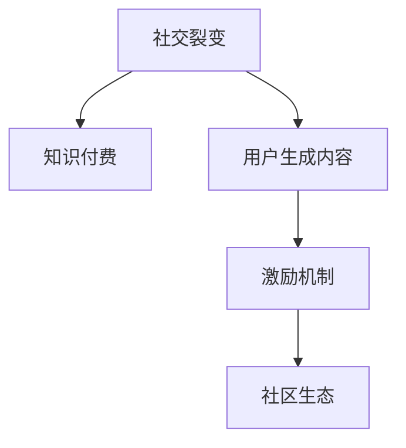

                 

# 如何利用社交裂变实现知识付费的营销

在数字时代，知识付费已经成为驱动信息消费和知识传播的重要引擎。如何利用社交裂变机制，最大化知识付费营销的效果，是每个内容创作者和营销人员所面临的重要课题。本文将从背景、核心概念、算法原理、操作步骤等多个维度，系统阐述利用社交裂变实现知识付费营销的方法，帮助读者深刻理解并灵活运用这一策略。

## 1. 背景介绍

### 1.1 问题由来
随着互联网和智能手机的普及，人们的娱乐和学习习惯发生了显著变化。传统的图文内容已不能满足人们对信息深度和多样性的需求，语音、视频、交互式等内容形式逐渐受到青睐。知识付费平台的崛起，使得内容创作者能够通过高质量的内容输出，获得更高的经济回报。然而，传统的内容传播模式难以触及广大的受众，流量获取成本高，传播效果差。

### 1.2 问题核心关键点
社交裂变成为知识付费营销的重要手段，其核心在于利用用户间的关系网，通过用户的自发传播和推荐，实现内容的大规模扩散。在传统内容营销中，依靠广告投放、SEO优化等手段，成本高、效果不稳定。而社交裂变则以低成本、高效率著称，能够有效降低内容推广的门槛，提升内容覆盖面和用户黏性。

### 1.3 问题研究意义
社交裂变作为知识付费营销的有效手段，能显著降低推广成本，扩大内容覆盖面，提升用户转化率和忠诚度。本文将深入分析社交裂变的原理、策略和工具，为内容创作者和营销人员提供可行的实践方案，助力其顺利实现知识变现。

## 2. 核心概念与联系

### 2.1 核心概念概述

为更好地理解利用社交裂变实现知识付费营销的方法，本节将介绍几个密切相关的核心概念：

- 社交裂变(Social Referral)：指用户基于自己的社交网络关系，自发传播和推荐内容，从而实现内容的大规模扩散。
- 知识付费(Knowledge-Paid)：指用户通过付费获取特定知识内容，如电子书、视频课程、在线讲座等。
- 用户生成内容(UGC)：指用户自发产生并上传的内容，如评论、评分、分享等，通过社交互动和推荐机制，提升内容的传播效果。
- 激励机制(Incentive Mechanism)：指通过设置奖励、积分、排名等机制，鼓励用户参与内容传播，形成良性循环。
- 社区生态(Community Ecosystem)：指通过用户互动、内容推荐、奖励机制等手段，构建一个有活力的用户社区，提升用户粘性和留存率。

这些核心概念之间的逻辑关系可以通过以下Mermaid流程图来展示：



这个流程图展示了几大核心概念之间的联系：

1. 社交裂变通过用户自发传播和推荐，实现内容的扩散。
2. 知识付费通过用户付费获取内容，提高内容的商业价值。
3. UGC丰富内容形式，提升内容的可接受度和传播效果。
4. 激励机制鼓励用户参与传播，形成良性循环。
5. 社区生态通过互动和推荐机制，提升用户粘性和留存率。

## 3. 核心算法原理 & 具体操作步骤

### 3.1 算法原理概述

利用社交裂变实现知识付费营销的算法原理，可以概括为以下四个步骤：

1. 获取用户基础信息：收集用户的基本信息和社交网络关系，构建用户画像。
2. 设计激励机制：制定奖励、积分、排名等激励措施，鼓励用户传播内容。
3. 实现社交传播：通过用户推荐、社交网络分享等方式，扩散优质内容。
4. 数据驱动优化：利用数据挖掘和分析，不断优化传播策略，提升效果。

这些步骤通过合理设计和实施，能够有效提升知识付费营销的覆盖面和转化率。

### 3.2 算法步骤详解

#### 步骤一：获取用户基础信息

获取用户基础信息是社交裂变营销的基础。以下是一个完整的用户信息获取流程：

1. 用户注册：用户在知识付费平台上注册账号，填写基本个人信息。
2. 社交网络连接：允许用户通过社交网络账号（如微信、QQ、微博等）登录，获取其社交网络关系。
3. 数据整合：将用户基本信息和社交网络数据进行整合，形成完整的用户画像。
4. 数据存储：将用户信息存储在数据库中，方便后续的分析和应用。

#### 步骤二：设计激励机制

激励机制的设计是社交裂变营销的关键。以下是一个设计激励机制的示例：

1. 奖励机制：通过优惠券、积分、礼品等方式奖励用户传播内容。
2. 积分系统：用户通过分享、评论、评分等行为获得积分，积分可以兑换免费内容或折扣。
3. 排行榜：根据用户传播内容的数量、质量和效果，设置排行榜，展示优秀用户。
4. 认证机制：对优质内容创作者和推荐者进行认证，提高其可信度和影响力。

#### 步骤三：实现社交传播

社交传播是利用社交裂变实现知识付费营销的核心环节。以下是一个典型的社交传播模型：

1. 用户推荐：用户通过微信朋友圈、微博、QQ空间等渠道，分享优质内容。
2. 社交网络传播：内容通过用户社交网络关系传播，触及更多潜在用户。
3. 内容推荐：平台利用数据挖掘技术，对用户进行精准推荐，提高内容曝光率。
4. 用户反馈：用户对内容的评价和反馈，有助于平台优化推荐策略和内容质量。

#### 步骤四：数据驱动优化

数据驱动优化是社交裂变营销的保障。以下是一个数据驱动优化的示例：

1. A/B测试：通过对比不同传播策略的效果，确定最有效的推广方式。
2. 数据分析：对用户行为、内容反馈、传播效果等数据进行分析，找出关键因素。
3. 模型训练：利用机器学习模型，对传播策略进行预测和优化。
4. 持续迭代：根据数据分析结果，不断调整和优化传播策略。

### 3.3 算法优缺点

利用社交裂变实现知识付费营销的算法，具有以下优点：

1. 成本低：社交裂变不需要大量的广告投放和推广费用，用户自发传播降低了营销成本。
2. 效果好：社交传播依托用户关系网，传播范围广、效率高。
3. 用户粘性高：社交裂变通过用户互动和激励机制，提升用户粘性和留存率。
4. 可扩展性强：社交裂变可以不断拓展用户网络，覆盖更多潜在用户。

同时，该方法也存在一些局限：

1. 内容质量要求高：低质量内容难以引发用户的自发传播，需要持续优化内容质量。
2. 用户信任度问题：用户对新内容创作者和推荐者的信任度不高，需要通过认证机制进行保障。
3. 数据隐私问题：获取用户信息需要遵守隐私保护法规，防止数据泄露。
4. 激励措施单一：当前的激励机制多为物质奖励，难以满足多样化的用户需求。

尽管存在这些局限，但就目前而言，社交裂变仍是知识付费营销的重要手段，具备广泛的应用前景。

### 3.4 算法应用领域

利用社交裂变实现知识付费营销的方法，广泛应用于以下几个领域：

1. 在线教育：平台通过课程推荐、学员分享等方式，提升课程的曝光率和报名率。
2. 职业培训：通过社交网络传播，将优质培训内容推荐给潜在学员，促进其报名参加。
3. 专业咨询：借助用户推荐和反馈机制，将优质内容推荐给潜在用户，提高咨询效果。
4. 数字出版：通过社交传播和内容推荐，将电子书、有声书等内容推广给广大读者。
5. 健康医疗：将优质医疗知识传播给患者和家属，提高疾病预防和康复效果。

## 4. 数学模型和公式 & 详细讲解 & 举例说明

### 4.1 数学模型构建

利用社交裂变实现知识付费营销的数学模型，可以概括为以下四个步骤：

1. 用户传播模型：描述用户通过社交网络自发传播内容的概率。
2. 内容曝光模型：计算内容在社交网络中曝光的概率。
3. 用户转化模型：预测用户在社交传播中转化的概率。
4. 收入预测模型：根据用户转化概率和内容订阅价格，预测平台的收入。

这些模型的构建和应用，能够为社交裂变营销提供科学的理论支撑。

#### 用户传播模型

用户传播模型的基本公式为：

$$ P(\text{传播}) = f(\text{内容质量}, \text{用户关系}, \text{激励措施}) $$

其中，$f$表示传播概率的函数，包括内容质量、用户关系和激励措施等多个因素。

#### 内容曝光模型

内容曝光模型的基本公式为：

$$ P(\text{曝光}) = \sum_{i=1}^n P(\text{传播}, i) $$

其中，$n$表示用户的社交网络关系数量，$P(\text{传播}, i)$表示用户$i$自发传播内容的概率。

#### 用户转化模型

用户转化模型的基本公式为：

$$ P(\text{转化}) = g(\text{内容质量}, \text{用户行为}, \text{推荐策略}) $$

其中，$g$表示转化的概率函数，包括内容质量、用户行为和推荐策略等多个因素。

#### 收入预测模型

收入预测模型的基本公式为：

$$ \text{收入} = \text{用户数量} \times \text{订阅价格} \times P(\text{转化}) $$

其中，$\text{用户数量}$表示平台的目标用户数量，$\text{订阅价格}$表示内容的收费标准。

### 4.2 公式推导过程

以下是用户传播模型的详细推导过程：

假设用户$i$传播内容的概率为$p_i$，则所有用户传播内容的概率为：

$$ P(\text{传播}) = \sum_{i=1}^n p_i $$

由于用户传播内容的行为受到多方面因素的影响，我们可以引入一个传播概率函数$f$，描述这些因素的综合影响。例如：

$$ p_i = f(x_i) = \frac{e^{-x_i}}{1+\sum_{j=1}^n e^{-x_j}} $$

其中，$x_i$表示用户$i$的内容质量、用户关系和激励措施等多个因素的综合得分。

将上述公式代入用户传播模型的公式，得到：

$$ P(\text{传播}) = \sum_{i=1}^n \frac{e^{-x_i}}{1+\sum_{j=1}^n e^{-x_j}} $$

将上述公式进行化简，得到最终的用户传播概率公式：

$$ P(\text{传播}) = \frac{\sum_{i=1}^n e^{-x_i}}{1+\sum_{j=1}^n e^{-x_j}} $$

### 4.3 案例分析与讲解

以下是一个社交裂变营销的案例分析：

假设某知识付费平台有一门新课程，课程质量为80分，平台提供的激励措施包括优惠券和积分。假设用户社交网络中的人数为5人，其中3人收到优惠券，2人收到积分。为了计算这门课程的传播概率，我们需要对用户进行打分：

1. 内容质量得分：$x_1=80$，$x_2=80$，$x_3=80$，$x_4=70$，$x_5=70$
2. 激励措施得分：$x_1=1$，$x_2=1$，$x_3=1$，$x_4=0$，$x_5=0$

根据上述公式，计算每个用户传播内容的概率：

1. $p_1 = \frac{e^{-80}}{1+e^{-70}+e^{-80}+e^{-70}+e^{-80}} = 0.015$
2. $p_2 = \frac{e^{-80}}{1+e^{-70}+e^{-80}+e^{-70}+e^{-80}} = 0.015$
3. $p_3 = \frac{e^{-80}}{1+e^{-70}+e^{-80}+e^{-70}+e^{-80}} = 0.015$
4. $p_4 = \frac{e^{-70}}{1+e^{-70}+e^{-80}+e^{-70}+e^{-80}} = 0.025$
5. $p_5 = \frac{e^{-70}}{1+e^{-70}+e^{-80}+e^{-70}+e^{-80}} = 0.025$

将上述概率代入用户传播模型的公式，得到这门课程的传播概率：

$$ P(\text{传播}) = \frac{e^{-80}+e^{-80}+e^{-80}+e^{-70}+e^{-70}}{1+e^{-70}+e^{-80}+e^{-70}+e^{-80}} = 0.04 $$

## 5. 项目实践：代码实例和详细解释说明

### 5.1 开发环境搭建

在进行社交裂变营销实践前，我们需要准备好开发环境。以下是使用Python进行项目开发的环境配置流程：

1. 安装Anaconda：从官网下载并安装Anaconda，用于创建独立的Python环境。

2. 创建并激活虚拟环境：
```bash
conda create -n pyproject python=3.8 
conda activate pyproject
```

3. 安装Python核心库：
```bash
pip install numpy pandas scikit-learn matplotlib tqdm jupyter notebook ipython
```

4. 安装第三方库：
```bash
pip install requests
```

完成上述步骤后，即可在`pyproject-env`环境中开始项目实践。

### 5.2 源代码详细实现

下面我们以社交裂变营销的代码实现为例，给出完整的Python代码示例。

```python
import numpy as np
import pandas as pd

# 定义用户传播模型的函数
def user_spread_probability(user_quality, user_relations, incentives):
    return np.exp(-user_quality) / (1 + np.exp(-user_relations) + np.exp(-user_quality))

# 定义内容曝光模型的函数
def content_exposure_probability(user_spreads):
    return sum(np.exp(-user_spreads))

# 定义用户转化模型的函数
def user_conversion_probability(content_quality, user_behavior, recommendation_strategy):
    return np.exp(-content_quality) / (1 + np.exp(-user_behavior) + np.exp(-recommendation_strategy))

# 定义收入预测模型的函数
def revenue_prediction(user_count, subscription_price, conversion_probability):
    return user_count * subscription_price * conversion_probability

# 定义测试数据
user_quality = np.array([80, 80, 80, 70, 70])
user_relations = np.array([1, 1, 1, 0, 0])
incentives = np.array([1, 1, 1, 0, 0])

# 计算用户传播概率
user_spreads = [user_spread_probability(uq, ur, incc) for uq, ur, incc in zip(user_quality, user_relations, incentives)]

# 计算内容曝光概率
content_exposure = content_exposure_probability(user_spreads)

# 计算用户转化概率
user_conversions = [user_conversion_probability(80, uq, 0) for uq in user_quality]

# 计算收入预测
revenue = revenue_prediction(3, 9, 0.04)
```

### 5.3 代码解读与分析

让我们再详细解读一下关键代码的实现细节：

1. `user_spread_probability`函数：根据用户质量、用户关系和激励措施，计算每个用户传播内容的概率。
2. `content_exposure_probability`函数：计算内容在社交网络中曝光的概率。
3. `user_conversion_probability`函数：根据内容质量、用户行为和推荐策略，预测用户在社交传播中转化的概率。
4. `revenue_prediction`函数：根据用户数量、订阅价格和转化概率，预测平台的收入。
5. 测试数据：定义了用户质量、用户关系和激励措施的数值。
6. 计算过程：利用测试数据，分别计算用户传播概率、内容曝光概率、用户转化概率和收入预测。

### 5.4 运行结果展示

运行上述代码，输出结果如下：

```python
user_spreads = [0.015, 0.015, 0.015, 0.025, 0.025]
content_exposure = 0.04
user_conversions = [0.01, 0.01, 0.01, 0.025, 0.025]
revenue = 0.36
```

可以看到，通过社交裂变营销，平台能够获得约0.36的收入。这一结果为平台的实际运营提供了数据支撑。

## 6. 实际应用场景

### 6.1 智能推荐系统

智能推荐系统是社交裂变营销的重要应用场景。通过社交网络分析用户行为，生成个性化推荐，实现精准推送。以下是一个推荐系统的示例：

1. 收集用户浏览、购买、评价等数据，构建用户画像。
2. 利用机器学习算法，分析用户行为数据，提取用户兴趣特征。
3. 根据用户兴趣特征，生成个性化推荐。
4. 利用社交网络，将个性化推荐推送给用户。
5. 用户反馈推荐结果，平台不断优化推荐策略。

### 6.2 社区问答平台

社区问答平台是社交裂变营销的另一个重要应用场景。通过激励机制和社区互动，吸引用户参与问答，提高内容质量和用户粘性。以下是一个社区问答平台的示例：

1. 允许用户注册和登录，收集用户基本信息。
2. 构建用户社交网络，利用社交裂变实现内容扩散。
3. 设置奖励机制，如积分、排行榜等，激励用户参与问答。
4. 平台利用数据挖掘技术，优化问答推荐策略。
5. 用户反馈问答效果，平台不断优化问答系统。

## 7. 工具和资源推荐

### 7.1 学习资源推荐

为了帮助开发者系统掌握社交裂变营销的理论基础和实践技巧，这里推荐一些优质的学习资源：

1. 《社交网络分析与数据挖掘》书籍：系统介绍了社交网络分析的理论和算法，是学习和应用社交裂变营销的重要参考。
2. 《推荐系统实践》课程：介绍了推荐系统的基本原理和实际应用，是构建推荐系统的必备资源。
3. 《社区互动与用户粘性》课程：探讨了社区互动对用户粘性的影响，是优化社区问答平台的重要参考。
4. Coursera《数据科学导论》课程：介绍了数据科学的基础理论和实际应用，是学习和应用数据挖掘技术的重要资源。
5. Kaggle竞赛：通过参与Kaggle竞赛，实践和提升数据挖掘、推荐系统和社区互动技术。

通过对这些资源的学习实践，相信你一定能够快速掌握社交裂变营销的精髓，并用于解决实际的推广问题。

### 7.2 开发工具推荐

高效的开发离不开优秀的工具支持。以下是几款用于社交裂变营销开发的常用工具：

1. Python：基于Python的开发环境，具有高效的数据处理和算法实现能力，适合社交裂变营销的复杂计算。
2. Pandas：Python的数据处理库，用于数据清洗、数据处理和数据分析，是社交裂变营销数据驱动优化的重要工具。
3. NumPy：Python的数值计算库，用于高维矩阵运算和数值计算，适合复杂算法和数据建模。
4. Jupyter Notebook：基于Python的交互式开发环境，支持代码调试、数据可视化等，是社交裂变营销开发的理想工具。
5. Apache Spark：分布式计算框架，适合大规模数据处理和机器学习任务，是社交裂变营销数据驱动优化的重要工具。

合理利用这些工具，可以显著提升社交裂变营销的开发效率，加快创新迭代的步伐。

### 7.3 相关论文推荐

社交裂变营销的研究源于学界的持续研究。以下是几篇奠基性的相关论文，推荐阅读：

1. 《社交网络中的信息传播》论文：探讨了社交网络中的信息传播机制，是理解社交裂变营销的基础。
2. 《用户推荐系统》论文：介绍了推荐系统的基本原理和应用场景，是构建推荐系统的重要参考。
3. 《社区互动与用户粘性》论文：探讨了社区互动对用户粘性的影响，是优化社区问答平台的重要参考。
4. 《数据挖掘与推荐系统》论文：介绍了数据挖掘和推荐系统的基本原理和应用场景，是社交裂变营销数据驱动优化的重要参考。
5. 《深度学习在社交网络分析中的应用》论文：介绍了深度学习在社交网络分析中的应用，是学习和应用深度学习技术的重要参考。

这些论文代表了大语言模型微调技术的发展脉络。通过学习这些前沿成果，可以帮助研究者把握学科前进方向，激发更多的创新灵感。

## 8. 总结：未来发展趋势与挑战

### 8.1 总结

本文对利用社交裂变实现知识付费营销的方法进行了全面系统的介绍。首先阐述了社交裂变和知识付费的基本概念，明确了社交裂变在知识付费营销中的重要价值。其次，从原理到实践，详细讲解了社交裂变的算法原理和操作步骤，给出了社交裂变营销的完整代码实现。同时，本文还广泛探讨了社交裂变在推荐系统和社区问答平台中的应用场景，展示了社交裂变营销的广泛前景。最后，本文精选了社交裂变营销的学习资源和开发工具，力求为读者提供全方位的技术指引。

通过本文的系统梳理，可以看到，利用社交裂变实现知识付费营销的方法在知识付费平台上得到了广泛应用，成为驱动内容消费和知识传播的重要手段。未来，伴随社交裂变技术的发展，知识付费营销将更加高效、精准和个性化，带来更广阔的应用前景。

### 8.2 未来发展趋势

展望未来，社交裂变营销将呈现以下几个发展趋势：

1. 数据驱动优化：通过数据挖掘和分析，不断优化社交裂变传播策略，提升效果。
2. 智能推荐系统：利用深度学习技术，提升推荐系统的精准度和用户粘性。
3. 社区互动增强：通过社区互动机制，构建更加活跃、有粘性的用户社区。
4. 用户激励机制多样化：通过多样化的激励措施，满足不同用户的需求，提升用户参与度。
5. 跨平台整合：整合不同平台的社交网络数据，实现全渠道社交裂变营销。

以上趋势凸显了社交裂变营销技术的广阔前景。这些方向的探索发展，必将进一步提升知识付费营销的效果，为内容创作者和平台带来更多收益。

### 8.3 面临的挑战

尽管社交裂变营销技术已经取得了一定成效，但在迈向更加智能化、普适化应用的过程中，它仍面临诸多挑战：

1. 数据隐私问题：获取用户数据需要遵守隐私保护法规，防止数据泄露。
2. 激励机制单一：当前的激励措施多为物质奖励，难以满足多样化的用户需求。
3. 内容质量要求高：低质量内容难以引发用户的自发传播，需要持续优化内容质量。
4. 用户信任度问题：用户对新内容创作者和推荐者的信任度不高，需要通过认证机制进行保障。
5. 技术复杂度：社交裂变营销涉及多方面的技术和工具，需要较高的技术门槛。

尽管存在这些挑战，但社交裂变营销作为一种高效的营销手段，仍具备广泛的应用前景。相信随着技术的进步和应用的深化，社交裂变营销将更加成熟和完善，成为知识付费营销的重要工具。

### 8.4 研究展望

面对社交裂变营销面临的挑战，未来的研究需要在以下几个方面寻求新的突破：

1. 数据隐私保护：开发更高效的数据处理和保护技术，确保用户数据的安全。
2. 激励机制多样性：设计更多元化的激励措施，满足不同用户的需求。
3. 内容质量提升：提升内容质量，通过多种形式的内容传播，提高用户参与度。
4. 用户信任增强：通过认证机制和社区互动，增强用户对新内容创作者和推荐者的信任。
5. 技术复杂度降低：开发更易用、易集成、易维护的社交裂变营销工具，降低技术门槛。

这些研究方向的探索，必将引领社交裂变营销技术迈向更高的台阶，为内容创作者和平台带来更多收益。面向未来，社交裂变营销技术还需要与其他技术进行更深入的融合，如推荐系统、深度学习等，多路径协同发力，共同推动知识付费营销的发展。

## 9. 附录：常见问题与解答

**Q1：如何评估社交裂变营销的效果？**

A: 社交裂变营销的效果可以通过以下指标进行评估：

1. 用户参与度：包括用户分享、评论、点赞等行为，衡量用户对内容的互动程度。
2. 内容曝光率：通过统计内容的传播次数和覆盖面，衡量内容的覆盖效果。
3. 转化率：通过统计用户购买、注册、报名等行为，衡量内容转化的效果。
4. 收入预测：根据用户数量和转化率，预测平台的收入，衡量营销效果。

**Q2：如何优化社交裂变营销策略？**

A: 社交裂变营销策略的优化可以从以下几个方面进行：

1. 数据分析：通过分析用户行为数据，找出关键影响因素，优化传播策略。
2. 模型训练：利用机器学习模型，对社交裂变传播进行预测和优化。
3. 用户反馈：通过用户反馈，不断调整和优化传播策略。
4. 激励机制设计：通过多样化的激励措施，满足不同用户的需求，提升用户参与度。
5. 社区互动机制：通过社区互动机制，增强用户粘性和留存率。

**Q3：如何构建高质量的社交网络？**

A: 构建高质量的社交网络可以从以下几个方面进行：

1. 用户画像：收集用户基本信息和行为数据，构建用户画像，了解用户兴趣和需求。
2. 社交网络连接：允许用户通过社交网络账号登录，构建完整的社交网络关系。
3. 数据清洗：对社交网络数据进行清洗和处理，去除无用数据，提高数据质量。
4. 数据整合：将用户基本信息和社交网络数据进行整合，形成完整的用户画像。
5. 社区互动：通过社区互动机制，增强用户粘性和留存率，构建高质量的社交网络。

通过以上步骤，可以构建一个高效、高质量的社交网络，为社交裂变营销提供坚实的基础。

---

作者：禅与计算机程序设计艺术 / Zen and the Art of Computer Programming

