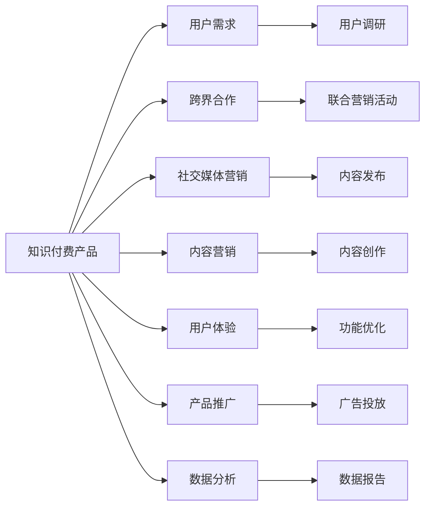

                 

# 如何利用跨界合作推广知识付费产品

> 关键词：知识付费, 跨界合作, 社交媒体, 内容营销, 用户体验, 产品推广, 数据分析

## 1. 背景介绍

在数字化时代，知识付费成为了一个热门话题，人们对高质量知识的渴望和愿意为此支付的意愿不断提升。但如何在竞争激烈的知识付费市场中脱颖而出，如何有效推广知识付费产品，成为了众多企业面临的挑战。本文将探讨如何通过跨界合作，结合多种营销策略，有效推广知识付费产品，以期为相关企业提供有价值的参考。

## 2. 核心概念与联系

### 2.1 核心概念概述

为了深入理解如何利用跨界合作推广知识付费产品，本节将介绍几个关键概念：

- **知识付费**：指用户通过支付一定费用获取特定知识、技能或信息的商业模式。典型的知识付费形式包括在线课程、电子书、专业咨询等。
- **跨界合作**：指不同行业或领域的企业间，基于共同的利益目标，合作开展营销、技术开发、产品推广等活动。
- **社交媒体营销**：指通过社交平台（如微信、微博、抖音等）发布内容，与目标受众互动，提升品牌知名度和用户粘性。
- **内容营销**：指通过发布有价值的内容（如博客、视频、案例研究等），吸引用户关注，增强品牌信任度，促进转化。
- **用户体验**：指用户在使用产品或服务时的主观感受，包括易用性、功能性、互动性等。
- **产品推广**：指通过各种手段（如广告、活动、合作等），增加产品曝光度，吸引潜在用户关注和付费。
- **数据分析**：指通过收集、处理和分析用户行为数据，了解用户需求和行为规律，优化产品和服务。

### 2.2 核心概念原理和架构的 Mermaid 流程图



## 3. 核心算法原理 & 具体操作步骤

### 3.1 算法原理概述

知识付费产品的推广可以通过多种方式进行，其中跨界合作结合社交媒体、内容营销、用户体验优化、产品推广和数据分析等策略，可以形成一套综合性的推广方案。其核心思想是通过合作，提升产品知名度和用户粘性，同时通过数据分析不断优化产品，实现更高效的推广效果。

### 3.2 算法步骤详解

1. **用户调研与需求分析**：
   - 通过调查问卷、用户访谈等方式，了解目标用户的需求、偏好和痛点，为后续推广活动提供依据。
   - 使用数据分析工具，如Google Analytics、Mixpanel等，收集用户行为数据，分析用户转化路径和行为特征。

2. **选择合适的跨界合作对象**：
   - 根据知识付费产品的定位和目标用户群体，选择具有相似用户基础和品牌影响力的合作方。
   - 分析合作伙伴的市场表现、用户互动数据、社会影响等指标，筛选出适合的合作对象。

3. **联合营销活动的策划与执行**：
   - 与合作方共同策划联合营销活动，如举办线上线下活动、联合发布内容、共同开发新产品等。
   - 制定详细的活动计划，明确各方的责任和角色，确保活动顺利进行。

4. **社交媒体与内容营销**：
   - 通过社交媒体平台发布有价值的内容，如课程介绍、用户评价、专家访谈等，吸引用户关注。
   - 利用内容营销策略，发布高质量的博客、视频、案例研究等内容，增强品牌信任度。

5. **用户体验优化**：
   - 根据用户调研结果，优化产品界面和功能，提高用户使用体验。
   - 在产品中引入用户反馈机制，及时收集用户意见和建议，进行迭代改进。

6. **产品推广与数据分析**：
   - 通过多种渠道（如搜索引擎优化、付费广告、合作伙伴推广等）增加产品曝光度。
   - 利用数据分析工具，监控关键指标（如用户注册数、课程购买率、用户留存率等），评估推广效果。
   - 根据数据分析结果，调整推广策略，优化用户体验。

### 3.3 算法优缺点

跨界合作推广知识付费产品的优点包括：

- **资源整合**：通过跨界合作，整合双方的资源和技术优势，提升推广效果。
- **品牌效应**：借助合作方的品牌影响力，快速提升产品知名度。
- **用户粘性**：通过多样化的推广手段，增强用户对产品的粘性。

缺点包括：

- **协调难度**：跨界合作涉及多方利益，协调和沟通成本较高。
- **效果难以量化**：不同合作方的推广效果难以统一衡量，难以精确评估整体效果。
- **风险共担**：合作过程中，双方需要共同承担风险和成本，合作失败可能导致资源浪费。

### 3.4 算法应用领域

跨界合作推广知识付费产品的方法可以应用于多种领域和场景，如：

- **在线教育**：与教育机构、专业网站合作，共同开发课程和活动，提升课程曝光度。
- **科技资讯**：与科技媒体、博客网站合作，发布高质量内容，吸引科技爱好者关注。
- **职业技能培训**：与行业协会、培训机构合作，推出专业课程和认证，提升培训效果。
- **健康管理**：与健康管理平台、健身房合作，推出健康课程和活动，提高用户健康意识。
- **生活技能培训**：与生活技能网站、线下培训中心合作，推出实用课程和活动，满足用户多样化需求。

## 4. 数学模型和公式 & 详细讲解

### 4.1 数学模型构建

为了更系统地理解跨界合作推广知识付费产品的原理，我们假设知识付费产品的推广效果可以用以下数学模型表示：

$$
R = C \times P \times U \times A \times D
$$

其中，$R$表示产品总注册数，$C$表示用户调研结果，$P$表示合作伙伴影响力，$U$表示用户体验优化，$A$表示产品推广效果，$D$表示数据分析结果。

### 4.2 公式推导过程

通过逐步分析各个变量对产品注册数的贡献，我们可以得到以下公式：

$$
R = \left( \sum_{i=1}^{n} C_i \times P_i \times U_i \times A_i \times D_i \right)^{\frac{1}{n}}
$$

其中，$n$表示合作方的数量。通过最大化该公式，可以优化知识付费产品的推广效果。

### 4.3 案例分析与讲解

以在线教育平台“慕课网”为例，其与知名IT培训机构“CSDN学院”合作，推出一系列IT技能课程。双方共同策划线上线下活动，发布高质量内容，优化用户体验，通过数据分析持续优化推广策略。通过这些措施，产品注册量和课程购买率显著提升，合作效果显著。

## 5. 项目实践：代码实例和详细解释说明

### 5.1 开发环境搭建

1. 安装Python：在网站服务器或本地计算机上安装Python解释器，如Python 3.6或以上版本。
2. 安装Flask：使用pip命令安装Flask框架，用于开发知识付费平台的后端API接口。
3. 安装SQLAlchemy：使用pip命令安装SQLAlchemy库，用于管理数据库。
4. 安装Redis：安装Redis数据库，用于缓存用户数据和统计信息。
5. 安装相关依赖：如Jinja2、WTForms等，用于提高开发效率。

### 5.2 源代码详细实现

以下是使用Flask和SQLAlchemy开发知识付费平台后端API接口的示例代码：

```python
from flask import Flask, request, jsonify
from flask_sqlalchemy import SQLAlchemy
from flask_redis import FlaskRedis

app = Flask(__name__)
app.config['SQLALCHEMY_DATABASE_URI'] = 'sqlite:///./db.sqlite3'
app.config['SQLALCHEMY_TRACK_MODIFICATIONS'] = False
app.config['REDIS_HOST'] = 'localhost'
app.config['REDIS_PORT'] = 6379
app.config['REDIS_URL'] = 'redis://localhost:6379'

db = SQLAlchemy(app)
redis_store = FlaskRedis(app)

class User(db.Model):
    id = db.Column(db.Integer, primary_key=True)
    username = db.Column(db.String(50), unique=True)
    email = db.Column(db.String(50))
    password = db.Column(db.String(100))

@app.route('/user/login', methods=['POST'])
def login():
    data = request.json
    username = data['username']
    password = data['password']
    user = User.query.filter_by(username=username).first()
    if user and user.password == password:
        token = generate_token(username)
        redis_store.set(username, token, ex=3600)
        return jsonify({'token': token})
    else:
        return jsonify({'error': 'Invalid username or password'}), 401

@app.route('/user/logout', methods=['POST'])
def logout():
    data = request.json
    username = data['username']
    token = generate_token(username)
    redis_store.delete(username)
    return jsonify({'message': 'Logout success'})

def generate_token(username):
    # 生成token的逻辑
    return token

@app.route('/user/info', methods=['GET'])
def get_user_info():
    data = request.args
    username = data['username']
    token = request.headers.get('Authorization')
    if token:
        redis_store.get(username, ex=3600)
        user = User.query.filter_by(username=username).first()
        if user:
            return jsonify(user.to_json())
        else:
            return jsonify({'error': 'User not found'}), 404
    else:
        return jsonify({'error': 'No token provided'}), 401

if __name__ == '__main__':
    app.run(debug=True)
```

### 5.3 代码解读与分析

**Flask后端API接口**：
- 使用Flask框架开发知识付费平台的后端API接口，提供用户登录、注册、信息查询等基本功能。
- 使用SQLAlchemy管理用户数据，通过ORM方式简化数据库操作。
- 使用Flask-Redis缓存用户登录信息，提高系统响应速度。

**代码分析**：
- 通过Flask框架的装饰器和路由功能，实现API接口的快速开发。
- 使用ORM方式操作数据库，提高代码的可读性和可维护性。
- 通过Flask-Redis缓存用户登录信息，减少数据库访问次数，提高系统效率。

### 5.4 运行结果展示

**API接口测试**：
- 使用Postman或类似的工具，测试API接口的功能。
- 使用SQLAlchemy和Flask-Redis库，验证数据存储和缓存的效果。
- 使用用户登录、信息查询等接口，验证系统功能的正确性。

## 6. 实际应用场景

### 6.1 智能课程推荐

知识付费平台可以利用跨界合作和数据分析技术，为用户推荐个性化的智能课程。通过与教育机构、培训机构合作，共同开发课程内容，结合用户的学习历史、兴趣爱好等数据，为用户推荐最合适的课程。

### 6.2 内容创作与分享

知识付费平台可以与内容创作者合作，推出独家内容。创作者发布高质量的博客、视频、案例研究等内容，吸引用户关注和付费。平台可以根据用户的浏览历史和偏好，推荐相关内容，增强用户粘性。

### 6.3 社交互动与社区建设

知识付费平台可以与社交媒体平台合作，建立知识社区。用户可以在社区内分享学习心得、提问解答，与其他用户互动交流。平台可以通过数据分析，了解用户兴趣和需求，优化社区内容和功能，提升用户满意度。

### 6.4 未来应用展望

未来，跨界合作推广知识付费产品将更加广泛地应用，带来更多创新和突破：

1. **虚拟现实与增强现实**：通过虚拟现实和增强现实技术，提升用户的沉浸式学习体验。
2. **人工智能与自然语言处理**：结合人工智能和自然语言处理技术，提供更加智能化的课程推荐和内容生成。
3. **区块链技术**：利用区块链技术，增强课程和认证的信任度，防止内容侵权和数据篡改。
4. **全球化市场**：与国际教育机构合作，推出多语言课程，开拓全球市场。
5. **跨界融合**：结合其他领域的知识和技能，推出跨学科课程，满足多样化需求。

## 7. 工具和资源推荐

### 7.1 学习资源推荐

1. **《如何写好代码》**：一本关于代码编写和项目管理的经典书籍，适合开发人员和项目经理。
2. **《数据科学实战》**：介绍数据科学工具和技术的实用教程，适合数据科学家和工程师。
3. **《用户心理学》**：分析用户行为和心理，提升用户体验的实用指南，适合产品经理和市场分析师。
4. **《社交媒体营销》**：讲解社交媒体营销策略和工具的实用教程，适合市场营销人员和社交媒体运营人员。
5. **《数据分析实战》**：介绍数据分析工具和技术的实用教程，适合数据分析师和数据工程师。

### 7.2 开发工具推荐

1. **GitHub**：全球最大的代码托管平台，提供代码管理和版本控制功能。
2. **Jupyter Notebook**：轻量级的交互式编程环境，适合快速原型开发和数据探索。
3. **Google Colab**：谷歌提供的在线Jupyter Notebook环境，免费提供GPU/TPU算力，适合机器学习和深度学习开发。
4. **PyCharm**：功能强大的Python IDE，适合Python开发和数据分析。
5. **Visual Studio Code**：轻量级的代码编辑器，支持多种编程语言和插件，适合代码编写和调试。

### 7.3 相关论文推荐

1. **《跨界合作：一种新的营销策略》**：介绍跨界合作在营销中的作用和效果，适合市场营销和企业管理人员。
2. **《知识付费：行业趋势与发展前景》**：分析知识付费行业的趋势和发展前景，适合行业分析师和企业管理人员。
3. **《用户体验设计：理论与实践》**：介绍用户体验设计的理论和方法，适合产品经理和设计师。
4. **《人工智能在营销中的应用》**：介绍人工智能技术在营销中的应用，适合市场营销和技术研发人员。
5. **《数据驱动的产品推广策略》**：介绍数据驱动的产品推广策略，适合产品营销人员和数据分析师。

## 8. 总结：未来发展趋势与挑战

### 8.1 总结

本文深入探讨了如何利用跨界合作推广知识付费产品的方法。通过用户调研、合作伙伴选择、联合营销活动策划、社交媒体和内容营销、用户体验优化、产品推广和数据分析等策略，详细讲解了知识付费产品推广的各个环节。通过对多个实际案例的分析，展示了跨界合作在知识付费推广中的应用效果。

通过本文的系统梳理，可以看到，跨界合作是一种高效、灵活的营销策略，能够整合多方资源，提升产品知名度和用户粘性，优化推广效果。未来，随着技术的不断进步和市场的不断拓展，跨界合作必将带来更多创新和突破，为知识付费行业的发展注入新的活力。

### 8.2 未来发展趋势

未来，跨界合作推广知识付费产品将呈现以下几个发展趋势：

1. **技术融合**：跨界合作将更加注重技术与业务融合，结合人工智能、大数据、区块链等前沿技术，提升产品智能化水平。
2. **用户体验优化**：用户需求的个性化和多样化将驱动跨界合作更加注重用户体验，通过多渠道、多触点、多场景的营销策略，提升用户满意度和忠诚度。
3. **全球化市场**：随着全球化的推进，跨界合作将拓展到更多国家和地区，为全球用户提供高品质的知识付费产品。
4. **跨领域融合**：跨界合作将突破传统的行业界限，结合其他领域的知识和技能，推出更加多样化和跨学科的课程，满足用户的多样化需求。

### 8.3 面临的挑战

尽管跨界合作推广知识付费产品具有诸多优势，但在实践中仍面临以下挑战：

1. **数据隐私与安全**：跨界合作涉及多个方和数据，如何保障用户数据隐私和安全是一个重要问题。
2. **利益分配不均**：不同合作方的利益诉求不同，如何平衡各方利益，制定合理的合作协议，是推广过程中需要解决的问题。
3. **市场竞争激烈**：知识付费市场竞争激烈，如何在众多竞争者中脱颖而出，是一个复杂的问题。
4. **用户需求多变**：用户需求和市场变化迅速，如何灵活调整营销策略，保持产品和服务的竞争力，是一个持续的挑战。

### 8.4 研究展望

未来的研究可以从以下几个方向进行探索：

1. **个性化推荐系统**：结合人工智能和大数据技术，构建更加精准的用户画像，提供个性化的课程推荐。
2. **跨领域知识融合**：结合其他领域的知识和技能，推出跨学科课程，提升用户的综合能力。
3. **社交媒体互动**：通过社交媒体平台，建立知识社区，增强用户互动和粘性。
4. **全球化推广**：结合国际教育机构和平台，推出多语言课程，开拓全球市场。
5. **数据分析与优化**：通过数据分析工具，持续优化产品推广策略，提升推广效果。

总之，跨界合作是知识付费产品推广的重要手段，通过多方合作、多种策略的综合应用，可以提升产品知名度和用户粘性，优化推广效果，推动知识付费行业的健康发展。

## 9. 附录：常见问题与解答

**Q1：知识付费产品如何选择合适的跨界合作对象？**

A: 选择合适的跨界合作对象需要考虑以下因素：
1. 合作伙伴的用户基础和品牌影响力是否与产品目标用户群体相匹配。
2. 合作伙伴的市场表现、用户互动数据、社会影响等指标是否符合预期。
3. 合作伙伴的合作意愿和资源能力是否能够支撑合作项目的实施。

**Q2：如何进行用户调研和需求分析？**

A: 用户调研和需求分析可以通过以下步骤进行：
1. 设计问卷和访谈提纲，了解用户基本信息、学习目标和需求。
2. 使用数据分析工具，收集和分析用户行为数据，了解用户兴趣和偏好。
3. 进行A/B测试，验证不同营销策略的效果，优化推广方案。

**Q3：如何评估跨界合作的推广效果？**

A: 评估跨界合作的推广效果可以通过以下指标进行：
1. 产品注册量和课程购买率等关键指标的变化情况。
2. 用户互动数据（如评论、分享、点赞等）的变化情况。
3. 数据分析结果（如用户留存率、转化率等）的变化情况。

**Q4：如何优化用户体验？**

A: 优化用户体验可以通过以下方法进行：
1. 提供简洁、易用的界面设计，优化用户交互流程。
2. 引入用户反馈机制，及时收集用户意见和建议，进行迭代改进。
3. 优化课程内容和推荐算法，提升课程质量和用户体验。

**Q5：如何利用数据分析进行推广优化？**

A: 利用数据分析进行推广优化可以通过以下步骤进行：
1. 收集用户行为数据，包括注册、浏览、购买等关键行为。
2. 进行数据清洗和预处理，去除噪声和异常数据。
3. 使用数据分析工具，进行用户细分和行为分析，发现用户需求和兴趣点。
4. 根据分析结果，优化推广策略和产品内容，提高转化率和用户满意度。

---

作者：禅与计算机程序设计艺术 / Zen and the Art of Computer Programming

