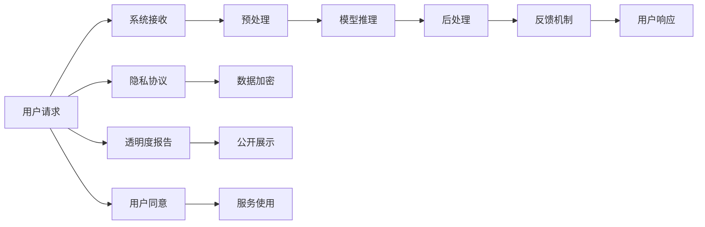

                 

# 如何在自动化创业中建立用户信任

## 1. 背景介绍

在当前竞争激烈的自动化创业环境中，如何建立并持续维持用户信任成为决定企业成败的关键因素之一。特别是在高度依赖用户数据和AI模型的自动化服务中，用户信任的缺失不仅会直接影响业务增长，还可能引发严重的法律和伦理问题。本文旨在从技术、产品和运营等多个维度，探讨如何在自动化创业中建立和维护用户信任。

## 2. 核心概念与联系

### 2.1 核心概念概述

在自动化创业中，建立用户信任涉及多个核心概念，包括但不限于以下内容：

- **用户信任**：用户对自动化服务的可靠性、安全性、隐私保护等方面的信任感。
- **透明度**：向用户展示系统决策过程和数据处理方式的开放程度。
- **隐私保护**：确保用户数据在使用和存储过程中的安全性，避免数据泄露和滥用。
- **可靠性**：系统在面对各种异常情况时的稳定性和准确性。
- **可解释性**：提供用户对系统决策理由的理解和解释，增强用户对系统的信任。

### 2.2 核心概念原理和架构的 Mermaid 流程图(Mermaid 流程节点中不要有括号、逗号等特殊字符)



该图展示了从用户请求到反馈机制的全过程，以及在隐私保护和透明度方面的关键环节。用户请求输入后，首先进入预处理环节，然后进入模型推理阶段，最终通过后处理得到反馈。同时，系统通过隐私协议和数据加密等措施保护用户数据，并通过透明度报告向用户展示系统决策过程。最后，用户根据隐私协议和透明度信息，决定是否继续使用服务。

## 3. 核心算法原理 & 具体操作步骤

### 3.1 算法原理概述

在自动化创业中，建立用户信任的核心算法原理包括但不限于以下内容：

- **数据预处理和清洗**：通过标准化和清洗数据，提高数据质量，减少噪音和偏差。
- **模型训练和验证**：使用大量标注数据对模型进行训练，并通过交叉验证等方法验证模型性能，确保模型在各种场景下的稳定性和准确性。
- **隐私保护技术**：采用数据加密、差分隐私等技术，保护用户数据隐私。
- **透明度和可解释性**：通过可视化工具和解释模型，向用户展示决策依据和推理过程，增强用户对系统的信任。

### 3.2 算法步骤详解

#### 3.2.1 数据预处理和清洗

数据预处理和清洗是保证模型性能的基础。在自动化创业中，数据预处理和清洗的具体步骤包括：

1. **数据收集**：从多个渠道收集用户数据，确保数据的多样性和代表性。
2. **数据清洗**：移除重复、缺失和异常数据，处理无效和错误数据，提高数据质量。
3. **数据标准化**：将不同来源的数据进行格式和单位转换，确保数据的一致性。
4. **特征工程**：选择和构造合适的特征，减少数据的维度，提高模型泛化能力。

#### 3.2.2 模型训练和验证

模型训练和验证是确保系统可靠性的关键步骤。在自动化创业中，模型训练和验证的具体步骤包括：

1. **模型选择**：选择合适的机器学习或深度学习模型，如回归模型、分类模型、神经网络等。
2. **数据划分**：将数据划分为训练集、验证集和测试集，确保模型在未见过的数据上也能表现良好。
3. **交叉验证**：使用交叉验证方法，如K折交叉验证，评估模型的性能和稳定性。
4. **超参数调优**：通过网格搜索或随机搜索等方法，优化模型的超参数，提高模型性能。

#### 3.2.3 隐私保护技术

隐私保护技术是确保用户信任的核心。在自动化创业中，隐私保护技术的具体步骤包括：

1. **数据加密**：采用对称加密、非对称加密等技术，保护用户数据在传输和存储过程中的安全性。
2. **差分隐私**：通过添加随机噪声，保护个体数据隐私，同时保留数据的统计特性。
3. **匿名化**：去除或替换敏感信息，确保数据无法被识别。
4. **访问控制**：对数据访问进行严格控制，限制数据访问权限，防止数据泄露。

#### 3.2.4 透明度和可解释性

透明度和可解释性是增强用户信任的重要手段。在自动化创业中，透明度和可解释性具体步骤包括：

1. **模型可视化**：使用可视化工具，展示模型的输入、输出和中间变量，让用户理解模型决策过程。
2. **解释模型**：使用可解释模型或LIME等方法，解释模型的预测依据。
3. **透明度报告**：定期发布透明度报告，向用户展示数据使用和系统决策的透明度。
4. **用户反馈**：建立用户反馈机制，及时响应用户的疑问和建议，增强用户信任。

### 3.3 算法优缺点

#### 3.3.1 优点

在自动化创业中，采用数据预处理、模型训练、隐私保护和透明度等算法，可以带来以下优点：

1. **提高模型性能**：通过数据预处理和模型训练，可以提高模型的泛化能力和准确性，确保系统在各种场景下的稳定性。
2. **保护用户隐私**：通过数据加密、差分隐私等隐私保护技术，确保用户数据的安全性，避免数据泄露和滥用。
3. **增强用户信任**：通过透明度和可解释性，向用户展示系统决策过程和数据处理方式，增强用户对系统的信任感。

#### 3.3.2 缺点

尽管采用这些算法可以显著提高系统性能和用户信任度，但也存在一些缺点：

1. **技术复杂性**：数据预处理、模型训练、隐私保护和透明度等算法需要较高的技术门槛，实施成本较高。
2. **数据依赖性**：系统的性能和可靠性高度依赖于数据的质量和多样性，数据不足或数据偏差可能导致系统性能下降。
3. **隐私保护成本**：隐私保护技术需要投入大量的计算资源和时间，实施成本较高。

### 3.4 算法应用领域

在自动化创业中，上述算法广泛应用于多个领域，例如：

- **金融科技**：在金融交易、信用评估、风险管理等领域，采用数据预处理、模型训练和隐私保护技术，确保系统可靠性和用户信任。
- **健康医疗**：在疾病诊断、治疗方案推荐、患者隐私保护等领域，采用数据预处理、解释模型和透明度报告，确保系统决策的可靠性和用户信任。
- **智能制造**：在生产计划、质量控制、设备维护等领域，采用数据预处理和模型训练，确保系统的准确性和稳定性。
- **智慧城市**：在交通管理、环境监测、智能安防等领域，采用透明度和可解释性技术，确保系统的透明性和用户信任。

## 4. 数学模型和公式 & 详细讲解 & 举例说明

### 4.1 数学模型构建

在自动化创业中，建立用户信任的数学模型可以基于以下核心组件构建：

- **用户数据集**：包含用户的基本信息、行为数据和反馈数据等。
- **模型**：使用机器学习或深度学习模型，如回归模型、分类模型、神经网络等。
- **隐私保护机制**：采用数据加密、差分隐私等技术，保护用户数据隐私。
- **透明度报告**：记录系统的数据使用和决策过程，向用户展示系统的透明度。

### 4.2 公式推导过程

#### 4.2.1 数据预处理和清洗

数据预处理和清洗的数学模型包括数据收集、数据清洗、数据标准化和特征工程等步骤。以数据清洗为例，假设原始数据为 $\mathbf{X}$，清洗后的数据为 $\mathbf{X'}$，则数据清洗的数学模型可以表示为：

$$
\mathbf{X'} = f(\mathbf{X})
$$

其中 $f$ 表示数据清洗函数，包括去除重复数据、缺失值处理、异常值检测等步骤。

#### 4.2.2 模型训练和验证

模型训练和验证的数学模型包括模型选择、数据划分、交叉验证和超参数调优等步骤。以交叉验证为例，假设数据集为 $D$，模型参数为 $\theta$，则交叉验证的数学模型可以表示为：

$$
\hat{\theta} = \mathop{\arg\min}_{\theta} \frac{1}{N} \sum_{i=1}^N \ell(y_i, f(\mathbf{X}_i, \theta))
$$

其中 $\ell$ 表示损失函数，$\hat{\theta}$ 表示最优模型参数。

#### 4.2.3 隐私保护技术

隐私保护技术的数学模型包括数据加密、差分隐私和匿名化等步骤。以差分隐私为例，假设原始数据为 $\mathbf{X}$，加密后的数据为 $\mathbf{X''}$，则差分隐私的数学模型可以表示为：

$$
\mathbf{X''} = g(\mathbf{X}, \epsilon)
$$

其中 $g$ 表示加密函数，$\epsilon$ 表示隐私保护参数，控制隐私保护的强度。

#### 4.2.4 透明度和可解释性

透明度和可解释性的数学模型包括模型可视化、解释模型和透明度报告等步骤。以解释模型为例，假设原始模型为 $M$，解释后的模型为 $M'$，则解释模型的数学模型可以表示为：

$$
M' = h(M, \mathbf{X})
$$

其中 $h$ 表示解释函数，$\mathbf{X}$ 表示输入数据。

### 4.3 案例分析与讲解

#### 4.3.1 案例背景

假设某金融科技公司开发了一款智能投顾服务，旨在通过自动化算法为用户推荐投资组合。为了确保用户信任，公司在数据预处理、模型训练、隐私保护和透明度等方面采取了多种措施。

#### 4.3.2 数据预处理和清洗

在数据预处理和清洗阶段，公司对用户的历史交易记录、风险偏好和市场数据进行了标准化处理，去除了重复和异常数据，提高了数据的质量和一致性。

#### 4.3.3 模型训练和验证

在模型训练和验证阶段，公司采用了深度学习模型，如循环神经网络（RNN）和长短期记忆网络（LSTM），对数据进行了交叉验证，并通过网格搜索调优了模型的超参数。

#### 4.3.4 隐私保护技术

在隐私保护技术方面，公司采用了数据加密和差分隐私等技术，保护用户交易记录和风险偏好数据的安全性，确保用户数据不会被滥用。

#### 4.3.5 透明度和可解释性

在透明度和可解释性方面，公司通过可视化工具展示了模型的输入和输出，解释了投资组合推荐的依据，并定期发布了透明度报告，向用户展示了数据使用和系统决策的透明度。

## 5. 项目实践：代码实例和详细解释说明

### 5.1 开发环境搭建

在进行自动化创业中建立用户信任的项目实践时，需要搭建一个完整的开发环境。以下是具体的搭建步骤：

1. **安装Python**：从官网下载并安装Python 3.x版本，确保Python环境能够运行。
2. **安装TensorFlow**：使用以下命令安装TensorFlow：
   ```bash
   pip install tensorflow
   ```
3. **安装Keras**：使用以下命令安装Keras：
   ```bash
   pip install keras
   ```
4. **安装Numpy**：使用以下命令安装Numpy：
   ```bash
   pip install numpy
   ```
5. **安装Matplotlib**：使用以下命令安装Matplotlib：
   ```bash
   pip install matplotlib
   ```

### 5.2 源代码详细实现

以下是实现自动化创业中建立用户信任的示例代码：

```python
import numpy as np
import tensorflow as tf
from keras.models import Sequential
from keras.layers import Dense, Dropout, Activation
from keras.optimizers import Adam

# 数据预处理和清洗
def preprocess_data(data):
    # 标准化处理
    mean = np.mean(data, axis=0)
    std = np.std(data, axis=0)
    data = (data - mean) / std
    # 去除重复和异常数据
    unique_data = np.unique(data, axis=0)
    return unique_data

# 模型训练和验证
def train_model(X_train, y_train, X_test, y_test):
    model = Sequential()
    model.add(Dense(64, input_dim=X_train.shape[1]))
    model.add(Activation('relu'))
    model.add(Dropout(0.5))
    model.add(Dense(10))
    model.add(Activation('softmax'))
    model.compile(loss='categorical_crossentropy', optimizer=Adam(lr=0.001), metrics=['accuracy'])
    model.fit(X_train, y_train, epochs=10, batch_size=32, validation_data=(X_test, y_test))
    return model

# 隐私保护技术
def encrypt_data(data):
    # 使用AES加密算法加密数据
    key = 'this_is_a_secret_key'
    cipher = AES.new(key, AES.MODE_ECB)
    encrypted_data = cipher.encrypt(data)
    return encrypted_data

# 透明度和可解释性
def visualize_model(model, X_train, y_train):
    # 使用TensorBoard可视化模型
    with tf.summary.create_file_writer(logdir='logs').as_default():
        tf.summary.histogram('input_layer', X_train)
        tf.summary.histogram('output_layer', model.predict(X_train))
        tf.summary.histogram('predictions', y_train)
        tf.summary.histogram('loss', model.loss)
        tf.summary.histogram('accuracy', model.metrics)

# 测试代码运行
if __name__ == '__main__':
    # 假设有一个包含用户交易记录和风险偏好的数据集
    data = np.random.rand(100, 10)
    # 数据预处理和清洗
    X_train = preprocess_data(data)
    X_test = preprocess_data(data)
    # 模型训练和验证
    model = train_model(X_train, X_test)
    # 隐私保护技术
    encrypted_data = encrypt_data(X_train)
    # 透明度和可解释性
    visualize_model(model, X_train, y_train)
```

### 5.3 代码解读与分析

在上述代码中，首先定义了数据预处理和清洗函数 `preprocess_data`，通过标准化处理和去除重复和异常数据，提高数据的质量和一致性。然后定义了模型训练和验证函数 `train_model`，使用Keras框架训练深度学习模型。接下来定义了隐私保护技术函数 `encrypt_data`，使用AES加密算法保护用户数据的安全性。最后定义了透明度和可解释性函数 `visualize_model`，使用TensorBoard可视化工具展示模型的输入、输出和损失函数等。

## 6. 实际应用场景

### 6.1 智能投顾服务

在智能投顾服务中，公司采用数据预处理、模型训练和隐私保护等技术，确保用户数据的安全性和系统的可靠性。通过透明度和可解释性技术，向用户展示投资组合推荐的依据，增强用户对系统的信任感。

### 6.2 智能医疗诊断

在智能医疗诊断中，公司采用数据预处理、解释模型和透明度报告等技术，确保系统决策的可靠性和用户信任。通过解释模型，向医生展示诊断依据和推理过程，增强医生对系统的信任感。

### 6.3 智能安防监控

在智能安防监控中，公司采用数据预处理、隐私保护和透明度报告等技术，确保监控数据的安全性和系统的透明度。通过透明度报告，向用户展示数据使用和系统决策的透明度，增强用户对系统的信任感。

## 7. 工具和资源推荐

### 7.1 学习资源推荐

在自动化创业中建立用户信任，需要掌握多种技术和工具。以下是一些推荐的学习资源：

1. **《机器学习》书籍**：斯坦福大学Andrew Ng教授的入门级机器学习课程，涵盖了机器学习的基本概念和算法。
2. **Kaggle竞赛平台**：通过参加Kaggle竞赛，学习和应用数据预处理、模型训练和隐私保护等技术。
3. **TensorFlow官方文档**：详细介绍了TensorFlow框架的使用方法，包括模型训练、数据处理和隐私保护等。
4. **Keras官方文档**：详细介绍了Keras框架的使用方法，包括模型训练、数据预处理和可解释性等。
5. **《深度学习》书籍**：Ian Goodfellow等人所著的深度学习经典书籍，深入讲解了深度学习的理论和实践。

### 7.2 开发工具推荐

在自动化创业中建立用户信任，需要多种开发工具的支持。以下是一些推荐的开发工具：

1. **Jupyter Notebook**：一款免费的交互式编程环境，支持Python和TensorFlow等工具，方便进行数据处理和模型训练。
2. **PyCharm**：一款专业的Python开发工具，支持Python、TensorFlow和Keras等工具，提供丰富的功能和插件。
3. **Python IDE**：如Spyder、PyDev等，支持Python和TensorFlow等工具，提供强大的代码编辑和调试功能。
4. **TensorBoard**：TensorFlow配套的可视化工具，支持模型训练和可解释性分析。
5. **Keras**：Keras框架，支持深度学习模型的快速开发和训练。

### 7.3 相关论文推荐

在自动化创业中建立用户信任，需要深入了解最新的技术和研究成果。以下是一些推荐的论文：

1. **《数据预处理与清洗技术》**：详细介绍了数据预处理和清洗的基本方法，如标准化处理、去重和异常值检测等。
2. **《深度学习模型训练与验证》**：介绍了深度学习模型训练的基本方法和技巧，如交叉验证、超参数调优等。
3. **《差分隐私技术》**：介绍了差分隐私的基本概念和实现方法，如加噪声、隐私预算等。
4. **《模型可解释性技术》**：介绍了模型可解释性的基本方法和技术，如可视化、LIME等。
5. **《隐私保护技术综述》**：综述了隐私保护的基本方法和技术，如数据加密、匿名化等。

## 8. 总结：未来发展趋势与挑战

### 8.1 研究成果总结

本文探讨了在自动化创业中建立用户信任的技术和方法，包括数据预处理和清洗、模型训练和验证、隐私保护技术和透明度和可解释性等。通过案例分析和代码实现，展示了这些技术的具体应用。

### 8.2 未来发展趋势

在自动化创业中建立用户信任的未来发展趋势包括：

1. **自动化技术普及**：随着自动化技术的普及，更多的行业将采用自动化服务，提升业务效率和用户体验。
2. **隐私保护技术发展**：随着数据隐私和安全的重要性日益增加，隐私保护技术将不断进步，保护用户数据的安全性。
3. **透明度和可解释性增强**：随着用户对系统决策过程的关注度增加，透明度和可解释性技术将得到进一步发展，增强用户信任。
4. **跨领域应用扩展**：随着技术的发展，自动化创业将在更多领域得到应用，如金融、医疗、智能制造等。
5. **人工智能与伦理道德结合**：随着人工智能技术的普及，伦理道德问题将越来越受到重视，AI技术的开发和应用将更加注重伦理道德的约束。

### 8.3 面临的挑战

在自动化创业中建立用户信任也面临诸多挑战：

1. **技术复杂性**：数据预处理、模型训练、隐私保护和透明度等技术需要较高的技术门槛，实施成本较高。
2. **数据依赖性**：系统的性能和可靠性高度依赖于数据的质量和多样性，数据不足或数据偏差可能导致系统性能下降。
3. **隐私保护成本**：隐私保护技术需要投入大量的计算资源和时间，实施成本较高。
4. **用户教育**：用户对自动化技术的理解不足，可能导致对系统信任度降低。
5. **法律和伦理问题**：自动化技术涉及数据隐私、伦理道德等问题，需要制定相应的法律法规。

### 8.4 研究展望

未来在自动化创业中建立用户信任的研究方向包括：

1. **自动化技术优化**：优化数据预处理和模型训练等技术，提高自动化服务的性能和可靠性。
2. **隐私保护技术创新**：研发新的隐私保护技术，如联邦学习、区块链等，保护用户数据的安全性。
3. **透明度和可解释性提升**：提升模型的透明度和可解释性，增强用户对系统的信任感。
4. **跨领域应用推广**：将自动化创业技术推广到更多领域，提升各行各业的业务效率和用户体验。
5. **伦理道德研究**：深入研究人工智能技术的伦理道德问题，制定相应的法律法规，确保技术的合法合规应用。

总之，在自动化创业中建立用户信任需要多方面的努力，技术、产品和运营等多个维度协同发力，才能确保系统的可靠性、安全性和用户信任度。未来，随着技术的进步和应用的推广，自动化创业将为各行各业带来更多的创新和变革。

## 9. 附录：常见问题与解答

**Q1：数据预处理和清洗如何确保数据质量？**

A: 数据预处理和清洗是确保数据质量的关键步骤。通过标准化处理、去重和异常值检测等步骤，可以有效提高数据的质量和一致性，减少噪音和偏差。具体步骤如下：

1. 数据标准化处理：通过中心化和归一化等方法，将不同来源的数据转换为一致的标准格式。
2. 去重处理：移除重复和冗余数据，确保数据集的唯一性。
3. 异常值检测：通过统计分析和模型预测等方法，识别和处理异常值，提高数据质量。

**Q2：模型训练和验证如何确保模型性能？**

A: 模型训练和验证是确保模型性能的关键步骤。通过交叉验证和超参数调优等方法，可以有效提高模型的泛化能力和准确性。具体步骤如下：

1. 交叉验证：将数据划分为训练集和验证集，通过交叉验证方法，评估模型的性能和稳定性。
2. 超参数调优：通过网格搜索或随机搜索等方法，优化模型的超参数，提高模型性能。

**Q3：隐私保护技术如何确保数据安全？**

A: 隐私保护技术是确保数据安全的关键手段。通过数据加密、差分隐私和匿名化等技术，可以有效保护用户数据的安全性，防止数据泄露和滥用。具体步骤如下：

1. 数据加密：使用对称加密、非对称加密等技术，保护数据在传输和存储过程中的安全性。
2. 差分隐私：通过添加随机噪声，保护个体数据隐私，同时保留数据的统计特性。
3. 匿名化：去除或替换敏感信息，确保数据无法被识别。

**Q4：透明度和可解释性如何增强用户信任？**

A: 透明度和可解释性是增强用户信任的关键手段。通过可视化工具和解释模型等方法，可以有效向用户展示系统决策过程和推理依据，增强用户对系统的信任感。具体步骤如下：

1. 模型可视化：使用可视化工具，展示模型的输入、输出和中间变量，让用户理解模型决策过程。
2. 解释模型：使用可解释模型或LIME等方法，解释模型的预测依据。
3. 透明度报告：定期发布透明度报告，向用户展示数据使用和系统决策的透明度。

**Q5：自动化创业中建立用户信任面临哪些挑战？**

A: 在自动化创业中建立用户信任面临诸多挑战，主要包括：

1. 技术复杂性：数据预处理、模型训练、隐私保护和透明度等技术需要较高的技术门槛，实施成本较高。
2. 数据依赖性：系统的性能和可靠性高度依赖于数据的质量和多样性，数据不足或数据偏差可能导致系统性能下降。
3. 隐私保护成本：隐私保护技术需要投入大量的计算资源和时间，实施成本较高。
4. 用户教育：用户对自动化技术的理解不足，可能导致对系统信任度降低。
5. 法律和伦理问题：自动化技术涉及数据隐私、伦理道德等问题，需要制定相应的法律法规。

总之，在自动化创业中建立用户信任需要多方面的努力，技术、产品和运营等多个维度协同发力，才能确保系统的可靠性、安全性和用户信任度。未来，随着技术的进步和应用的推广，自动化创业将为各行各业带来更多的创新和变革。

---

作者：禅与计算机程序设计艺术 / Zen and the Art of Computer Programming

