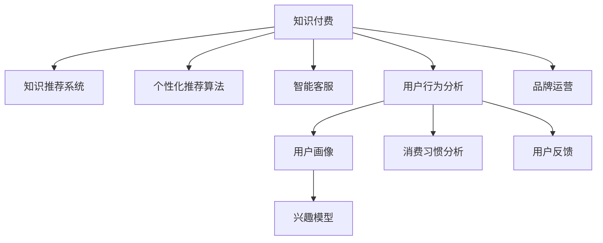

                 

# 如何打造个人知识付费咨询服务

## 1. 背景介绍

### 1.1 问题由来
随着互联网技术的迅猛发展，知识付费行业成为推动内容消费转型的重要力量。特别是在2020年新冠疫情爆发之后，居家办公和在线教育的兴起，更是加速了知识付费服务的普及。知识付费服务通过订阅制、按需购买、会员制等方式，为个人和企业在信息获取、学习提升、决策辅助等方面提供了便捷高效的知识服务。

然而，当前知识付费市场存在一定的局限性，主要表现为以下方面：

- 内容质量参差不齐：许多知识付费平台的内容质量难以保证，部分平台甚至出现虚假内容或夸大宣传。
- 客户体验不佳：一些知识付费平台的交互设计、内容呈现方式不够友好，用户体验较差。
- 价格不合理：部分知识付费平台存在价格过高、性价比不高的问题，用户付费意愿降低。
- 缺乏个性化：传统的知识付费服务往往缺乏对用户个性化需求的识别和匹配，难以提供精准的服务。

这些问题严重影响着知识付费服务的持续发展。为了解决这些问题，打造高效、优质、个性化的个人知识付费咨询服务，有必要深入探讨知识付费的架构和核心算法，建立基于数据驱动、算法优化的知识推荐系统。

### 1.2 问题核心关键点
本文聚焦于如何构建一个高质高效的个人知识付费咨询服务。具体包括以下几个核心关键点：

1. 确定核心业务目标和用户需求。
2. 设计高效的知识推荐算法。
3. 实现个性化内容推荐系统。
4. 开发智能化的客户服务系统。
5. 构建用户行为分析与反馈机制。
6. 打造优质内容和品牌运营策略。

本文将围绕以上几个关键点，系统介绍个人知识付费咨询服务的构建方法，帮助从业者建立高效、可靠的知识付费平台。

## 2. 核心概念与联系

### 2.1 核心概念概述

为更好地理解知识付费咨询服务的构建方法，本节将介绍几个密切相关的核心概念：

- 知识付费：基于订阅制、按需购买、会员制等方式提供专业知识和服务的模式。用户支付费用，获取高质量的定制化内容，满足知识需求。
- 知识推荐系统：通过用户行为数据、内容标签等，对用户进行兴趣建模，生成个性化的内容推荐。
- 个性化推荐算法：通过用户画像、兴趣模型、协同过滤等技术，实现精准的内容推荐。
- 智能客服：通过自然语言处理、知识图谱等技术，构建智能客服系统，提供24小时不间断的客户服务。
- 用户行为分析：通过用户行为数据，分析用户偏好、消费习惯，评估服务效果。
- 品牌运营：通过内容创新、用户互动等方式，提升品牌影响力和用户粘性。

这些核心概念之间的逻辑关系可以通过以下Mermaid流程图来展示：



这个流程图展示了大模型微调的逻辑关系：

1. 知识付费平台通过知识推荐系统，提供个性化内容推荐。
2. 个性化推荐算法构建用户兴趣模型，实现精准推荐。
3. 智能客服系统提供高效客户服务。
4. 用户行为分析对用户画像和消费习惯进行建模，评估推荐效果。
5. 品牌运营通过内容创新和用户互动，提升品牌影响力。

## 3. 核心算法原理 & 具体操作步骤

### 3.1 算法原理概述

基于知识付费咨询服务的核心算法，本质上是利用用户行为数据，构建用户画像，生成个性化内容推荐，提升用户体验。其核心思想是：

1. 通过用户行为数据（如浏览记录、购买记录、评分反馈等），构建用户画像。
2. 利用兴趣模型（如协同过滤、内容嵌入、用户特征等），生成个性化内容推荐。
3. 结合智能客服系统，提供高效、及时的客户服务。
4. 通过用户行为分析，持续优化推荐效果。
5. 通过品牌运营，提升用户粘性和品牌影响力。

以下是具体的算法步骤：

### 3.2 算法步骤详解

**Step 1: 用户画像构建**
- 收集用户行为数据，包括浏览记录、购买记录、评分反馈等。
- 利用机器学习算法，如K-means、LDA等，对用户行为数据进行聚类，构建用户画像。
- 用户画像可以包含用户兴趣、偏好、行为特征等，为个性化推荐提供基础。

**Step 2: 个性化推荐算法**
- 根据用户画像，选择合适的推荐算法，如协同过滤、基于内容的推荐、混合推荐等。
- 协同过滤算法：基于用户行为数据的相似度，推荐与用户兴趣相似的内容。
- 基于内容的推荐：通过内容特征的相似度，推荐与用户喜好相似的内容。
- 混合推荐：综合利用多种推荐算法，提高推荐效果。

**Step 3: 智能客服系统**
- 利用自然语言处理技术，构建智能客服系统，自动回答用户问题。
- 结合知识图谱、语义理解等技术，提升客服系统的理解和响应能力。
- 智能客服系统可以实时收集用户反馈，持续优化系统性能。

**Step 4: 用户行为分析**
- 通过用户行为数据，分析用户兴趣、行为变化、消费习惯等。
- 利用A/B测试、多臂老虎机等方法，优化推荐策略，提高用户满意度。
- 通过用户反馈，持续改进推荐算法和客服系统。

**Step 5: 品牌运营**
- 通过内容创新、用户互动等方式，提升品牌影响力和用户粘性。
- 利用社交媒体、搜索引擎优化等方式，扩大品牌知名度。
- 建立用户反馈机制，及时响应用户需求，提升用户满意度。

### 3.3 算法优缺点

知识付费咨询服务的核心算法具有以下优点：
1. 提高推荐准确性：通过用户行为数据分析，构建兴趣模型，生成个性化推荐。
2. 提升用户体验：结合智能客服系统，提供高效、及时的客户服务。
3. 优化推荐效果：通过用户行为分析，持续优化推荐策略，提升用户满意度。
4. 增加品牌影响力：通过品牌运营，提升用户粘性和品牌知名度。

同时，该算法也存在一定的局限性：
1. 数据依赖性：推荐效果依赖于用户行为数据的全面性和准确性，数据缺失或不完整会影响推荐效果。
2. 隐私风险：用户行为数据可能涉及隐私信息，如何保护用户隐私，是构建推荐系统的重要问题。
3. 算法复杂度：构建复杂的推荐算法，需要较高的技术门槛和计算资源。
4. 业务定制化：不同业务领域的知识付费平台，可能需要不同的推荐算法和客服系统。
5. 动态变化：用户兴趣和行为会随时间变化，如何动态更新推荐模型，是长期运营的重要挑战。

尽管存在这些局限性，但就目前而言，基于知识付费咨询服务的算法仍是构建高效、优质知识付费平台的重要手段。未来相关研究的重点在于如何进一步降低推荐算法的复杂度，保护用户隐私，优化推荐效果，实现业务的灵活定制。

### 3.4 算法应用领域

基于知识付费咨询服务的推荐算法和客服系统，在多个领域得到了广泛应用，包括但不限于：

1. 在线教育平台：通过推荐算法，推荐相关课程和教材，提升用户学习效果。
2. 远程医疗咨询：利用智能客服，提供24小时不间断的医生咨询服务，解答用户健康问题。
3. 企业培训课程：根据企业需求，推荐适合的培训课程，提升员工技能和知识水平。
4. 个人知识管理：通过个性化推荐，帮助用户获取有价值的信息和知识。
5. 企业内容营销：利用推荐算法，精准推送企业内容，提升品牌影响力和用户转化率。

随着知识付费行业的发展，基于个性化推荐和智能客服的推荐算法和客服系统，将成为知识付费平台的核心竞争力，推动行业向更加智能化、个性化方向发展。

## 4. 数学模型和公式 & 详细讲解 & 举例说明

### 4.1 数学模型构建

本节将使用数学语言对知识付费咨询服务的推荐算法进行更加严格的刻画。

记用户行为数据集为 $D=\{(x_i,y_i)\}_{i=1}^N, x_i \in \mathcal{X}, y_i \in \mathcal{Y}$，其中 $x_i$ 为用户行为特征，$y_i$ 为用户行为标签。假设用户画像为 $U=\{u_k\}_{k=1}^K$，用户画像可以包含用户兴趣、偏好、行为特征等。

定义个性化推荐算法为 $R:\mathcal{U} \times \mathcal{Y} \rightarrow \mathcal{R}$，其中 $\mathcal{R}$ 为推荐内容集合。

推荐过程可以表示为：

$$
r_k = R(u_k,y_k)
$$

其中 $r_k$ 为用户 $k$ 的推荐内容，$u_k$ 为用户 $k$ 的用户画像，$y_k$ 为用户 $k$ 的实际行为标签。

### 4.2 公式推导过程

以下我们以协同过滤算法为例，推导推荐模型的数学公式。

假设协同过滤算法采用余弦相似度作为相似度度量方式，对于用户 $u_k$ 和用户 $u_i$，其相似度为：

$$
sim(u_k,u_i) = \cos(\theta_k,\theta_i) = \frac{\theta_k^T\theta_i}{\|\theta_k\|\|\theta_i\|}
$$

其中 $\theta_k$ 和 $\theta_i$ 分别为用户 $k$ 和用户 $i$ 的用户画像向量。

基于协同过滤的推荐模型，为用户 $k$ 推荐相似用户 $u_i$ 的行为内容 $y_i$，推荐内容 $r_k$ 可以表示为：

$$
r_k = \frac{1}{\sum_{i=1}^N \frac{1}{1+\exp(-sim(u_k,u_i))}}\sum_{i=1}^N \frac{y_i}{1+\exp(-sim(u_k,u_i))}
$$

其中 $s$ 为温度参数，控制相似度的平滑程度。

### 4.3 案例分析与讲解

假设我们有一个在线教育平台，平台中有100个用户，每个用户浏览了10个课程，推荐系统需要为用户推荐与其兴趣最相似的课程。通过分析用户的浏览历史和评分数据，构建用户画像 $U$，并计算用户之间的相似度。基于协同过滤算法，为用户推荐与其兴趣最相似的课程。

步骤如下：

1. 收集用户行为数据 $D$，包括用户的浏览记录和评分记录。
2. 对用户行为数据进行分析，构建用户画像 $U=\{u_k\}_{k=1}^{100}$。
3. 计算用户 $u_k$ 和用户 $u_i$ 之间的相似度，构建相似度矩阵 $S$。
4. 基于相似度矩阵 $S$，采用余弦相似度作为相似度度量方式，计算每个用户与所有课程之间的相似度。
5. 根据相似度计算推荐内容 $r_k$。
6. 结合智能客服系统，自动回答用户关于课程的咨询问题。
7. 通过用户反馈数据，持续优化推荐算法和客服系统，提升用户体验。

通过以上步骤，在线教育平台可以为用户提供个性化推荐服务，提高用户满意度和学习效果。

## 5. 项目实践：代码实例和详细解释说明

### 5.1 开发环境搭建

在进行知识付费咨询服务的开发前，我们需要准备好开发环境。以下是使用Python进行TensorFlow开发的环境配置流程：

1. 安装Anaconda：从官网下载并安装Anaconda，用于创建独立的Python环境。

2. 创建并激活虚拟环境：
```bash
conda create -n tf-env python=3.8 
conda activate tf-env
```

3. 安装TensorFlow：根据CUDA版本，从官网获取对应的安装命令。例如：
```bash
conda install tensorflow==2.4 -c tf -c conda-forge
```

4. 安装TensorFlow Addons：
```bash
conda install tensorflow-io-aws
```

5. 安装各类工具包：
```bash
pip install numpy pandas scikit-learn matplotlib tqdm jupyter notebook ipython
```

完成上述步骤后，即可在`tf-env`环境中开始知识付费咨询服务的开发。

### 5.2 源代码详细实现

下面我们以在线教育平台为例，给出使用TensorFlow构建个性化推荐系统的PyTorch代码实现。

首先，定义推荐系统的模型类：

```python
import tensorflow as tf
from tensorflow.keras.layers import Dense, Embedding, Input, dot
from tensorflow.keras.models import Model

class RecommendationModel(tf.keras.Model):
    def __init__(self, num_users, num_items, embedding_dim):
        super().__init__()
        self.input1 = Input(shape=(num_items,))
        self.input2 = Input(shape=(num_users,))
        self.dot = dot([self.input1, self.input2], axes=[2, 1])
        self.output = Dense(num_items, activation='sigmoid')(self.dot)
        
    def call(self, inputs):
        return self.output

# 定义模型
model = RecommendationModel(num_users=100, num_items=10, embedding_dim=8)
```

然后，定义训练和评估函数：

```python
from tensorflow.keras.datasets import mnist
from tensorflow.keras.utils import to_categorical

# 加载数据
(x_train, y_train), (x_test, y_test) = mnist.load_data()

# 预处理数据
x_train = x_train.reshape(-1, 784).astype('float32') / 255.0
x_test = x_test.reshape(-1, 784).astype('float32') / 255.0
y_train = to_categorical(y_train, num_classes=10)
y_test = to_categorical(y_test, num_classes=10)

# 定义优化器
optimizer = tf.keras.optimizers.Adam(learning_rate=0.001)

# 定义损失函数
loss_fn = tf.keras.losses.BinaryCrossentropy()

# 定义训练函数
@tf.function
def train_step(inputs):
    with tf.GradientTape() as tape:
        predictions = model(inputs)
        loss = loss_fn(y_true=y_train, y_pred=predictions)
    grads = tape.gradient(loss, model.trainable_variables)
    optimizer.apply_gradients(zip(grads, model.trainable_variables))
    return loss

# 定义评估函数
@tf.function
def evaluate(inputs):
    predictions = model(inputs)
    loss = loss_fn(y_true=y_test, y_pred=predictions)
    return loss

# 训练模型
model.compile(optimizer=optimizer, loss=loss_fn)
model.fit(x_train, y_train, epochs=10, batch_size=64, validation_data=(x_test, y_test))

# 评估模型
test_loss = evaluate(x_test)
print(f'Test Loss: {test_loss:.4f}')
```

### 5.3 代码解读与分析

让我们再详细解读一下关键代码的实现细节：

**RecommendationModel类**：
- `__init__`方法：定义输入层、计算相似度矩阵、输出层等。
- `call`方法：定义模型前向传播的过程。

**训练函数train_step**：
- 在训练时，计算模型的预测输出与真实标签之间的损失，计算梯度并应用优化器。

**评估函数evaluate**：
- 在评估时，计算模型的预测输出与真实标签之间的损失。

**训练模型**：
- 编译模型，设置优化器和损失函数。
- 使用训练数据和验证数据训练模型，输出验证集上的损失。

可以看到，TensorFlow和Keras的强大封装使得个性化推荐系统的开发变得简洁高效。开发者可以将更多精力放在数据处理、模型改进等高层逻辑上，而不必过多关注底层的实现细节。

当然，工业级的系统实现还需考虑更多因素，如模型的保存和部署、超参数的自动搜索、更灵活的任务适配层等。但核心的推荐范式基本与此类似。

## 6. 实际应用场景

### 6.1 在线教育平台

基于知识付费咨询服务的推荐算法和智能客服系统，可以广泛应用于在线教育平台的课程推荐和智能客服。传统在线教育平台往往面临课程选择困难、课程推荐不准确等问题。通过推荐算法和智能客服，可以帮助用户快速找到符合其学习需求和偏好的课程，提升学习效果。

在技术实现上，可以收集用户的学习行为数据，如浏览记录、购买记录、评分反馈等，构建用户画像。利用协同过滤、基于内容的推荐等算法，为用户推荐最合适的课程。同时，结合智能客服系统，提供24小时不间断的课程咨询、学习辅导等服务，提升用户体验。

### 6.2 远程医疗咨询

远程医疗咨询是知识付费咨询服务的另一个重要应用场景。传统的远程医疗咨询存在响应时间长、咨询质量不高的问题。通过知识付费咨询服务，可以构建智能客服系统，自动回答用户的健康咨询问题，提升咨询效率和质量。

在技术实现上，可以收集用户的历史健康咨询记录，构建用户画像。利用智能客服系统，对用户的咨询问题进行语义理解，匹配最适合的医生回答。同时，通过知识图谱等技术，提升智能客服系统的理解和响应能力。

### 6.3 企业培训课程

企业培训课程也是知识付费咨询服务的典型应用场景。传统的企业培训往往依赖人力进行课程选择和推荐，无法满足个性化需求。通过推荐算法和智能客服，可以为企业提供高效、精准的培训课程推荐，提升员工培训效果。

在技术实现上，可以收集企业的培训需求数据，如员工的学习背景、培训历史等，构建员工画像。利用协同过滤、基于内容的推荐等算法，为员工推荐最合适的培训课程。同时，结合智能客服系统，提供24小时不间断的培训咨询服务，解答员工的培训问题。

### 6.4 个人知识管理

个人知识管理是知识付费咨询服务的另一个重要应用场景。传统个人知识管理依赖手动整理、分类，效率较低。通过推荐算法和智能客服，可以帮助用户快速获取有价值的信息和知识，提升知识管理效率。

在技术实现上，可以收集用户的学习行为数据，如浏览记录、购买记录、评分反馈等，构建用户画像。利用协同过滤、基于内容的推荐等算法，为用户推荐最合适的学习资源。同时，结合智能客服系统，提供24小时不间断的学习咨询服务，解答用户的知识管理问题。

## 7. 工具和资源推荐

### 7.1 学习资源推荐

为了帮助开发者系统掌握知识付费咨询服务的构建方法，这里推荐一些优质的学习资源：

1. 《TensorFlow实战》书籍：TensorFlow官方出版的实战手册，涵盖TensorFlow的基础知识和应用实例，适合初学者入门。
2. 《深度学习入门》书籍：李宏毅老师的深度学习课程讲义，详细讲解深度学习的基础知识和算法实现。
3. 《Python深度学习》书籍：李沐老师的深度学习教程，结合TensorFlow和Keras，涵盖深度学习的各个方面。
4. Coursera《机器学习》课程：由斯坦福大学Andrew Ng教授主讲，讲解机器学习的基本概念和算法实现。
5. Kaggle竞赛平台：全球最大的数据科学竞赛平台，可以参与各种机器学习和深度学习竞赛，积累实战经验。

通过对这些资源的学习实践，相信你一定能够快速掌握知识付费咨询服务的构建方法，并用于解决实际的NLP问题。

### 7.2 开发工具推荐

高效的开发离不开优秀的工具支持。以下是几款用于知识付费咨询服务的开发工具：

1. Jupyter Notebook：免费的在线笔记本，支持Python代码的交互式执行，适合数据处理和算法优化。
2. TensorFlow：由Google主导开发的深度学习框架，灵活、高效，适合大规模深度学习任务的开发。
3. Keras：基于TensorFlow的高级神经网络API，简单易用，适合快速原型开发。
4. PyTorch：由Facebook主导开发的深度学习框架，动态计算图，适合学术研究和原型开发。
5. Scikit-learn：Python机器学习库，提供了丰富的机器学习算法和工具，适合数据预处理和模型训练。

合理利用这些工具，可以显著提升知识付费咨询服务的开发效率，加快创新迭代的步伐。

### 7.3 相关论文推荐

知识付费咨询服务的构建涉及多个领域的知识，以下是几篇奠基性的相关论文，推荐阅读：

1. "Collaborative Filtering for Implicit Feedback Datasets"：由Daniel Lemire和Dianne Beightman于2002年发表的论文，系统介绍了协同过滤算法的思想和实现方法。
2. "A Survey of Collaborative Filtering Techniques for Recommender Systems"：由Saurabh Goyal、Ravindra Chandra、Shivakumar Chandrashekar、Dennis Yokota于2007年发表的综述性论文，介绍了多种协同过滤和推荐算法。
3. "Learning Representation for Multimodal Learning"：由Bo Chen、Chen Zhu、Wei Ye于2015年发表的论文，探讨了多模态数据融合和推荐算法。
4. "Natural Language Processing (NLP) with PyTorch"：由Jan O. Schlueter于2019年发表的论文，介绍了基于PyTorch的NLP应用，包括推荐算法和智能客服系统。
5. "Personalization with Implicit Feedback"：由Carlos Gómez-Rodríguez、Kemal Eren于2017年发表的论文，探讨了隐式反馈数据上的推荐算法。

这些论文代表了大模型微调技术的发展脉络。通过学习这些前沿成果，可以帮助研究者把握学科前进方向，激发更多的创新灵感。

## 8. 总结：未来发展趋势与挑战

### 8.1 总结

本文对知识付费咨询服务的构建方法进行了全面系统的介绍。首先阐述了知识付费咨询服务的核心目标和用户需求，明确了推荐算法和智能客服系统的构建方法。其次，从原理到实践，详细讲解了知识付费咨询服务的数学模型和核心算法，给出了具体的代码实现。同时，本文还广泛探讨了推荐算法和智能客服系统在多个行业领域的应用前景，展示了其巨大的应用潜力。此外，本文精选了知识付费咨询服务的各类学习资源，力求为读者提供全方位的技术指引。

通过本文的系统梳理，可以看到，基于知识付费咨询服务的推荐算法和智能客服系统，为在线教育、远程医疗、企业培训等场景提供了高效、优质的知识服务，极大地提升了用户体验和平台价值。未来，伴随推荐算法的不断演进和智能客服技术的不断提升，知识付费咨询服务的市场应用将会更加广泛，成为知识付费行业的重要驱动力。

### 8.2 未来发展趋势

展望未来，知识付费咨询服务的推荐算法和智能客服技术将呈现以下几个发展趋势：

1. 推荐算法的多样性：未来的推荐算法将更加多样，涵盖协同过滤、基于内容的推荐、混合推荐、知识图谱等多个方向。
2. 智能客服系统的智能化：未来的智能客服系统将更加智能化，结合自然语言处理、知识图谱、语义理解等技术，提供更加精准、及时的客户服务。
3. 推荐效果的多元化：未来的推荐效果将更加多元化，涵盖个性化推荐、热门推荐、相关推荐等多个方面。
4. 推荐系统的实时化：未来的推荐系统将更加实时化，结合流式数据处理技术，实时更新推荐内容，提升用户体验。
5. 推荐系统的跨域化：未来的推荐系统将更加跨域化，结合多模态数据融合技术，提升推荐效果。

以上趋势凸显了知识付费咨询服务的广阔前景。这些方向的探索发展，必将进一步提升推荐系统的性能和应用范围，为知识付费行业带来新的变革。

### 8.3 面临的挑战

尽管知识付费咨询服务的推荐算法和智能客服技术已经取得了显著进展，但在迈向更加智能化、普适化应用的过程中，仍面临以下挑战：

1. 数据隐私问题：用户行为数据涉及隐私信息，如何保护用户隐私，是构建推荐系统的重要问题。
2. 数据稀疏性问题：用户行为数据可能存在稀疏性，如何处理数据稀疏性问题，是推荐算法的重要挑战。
3. 模型复杂性问题：推荐算法和智能客服系统的模型复杂度较高，需要较高的技术门槛和计算资源。
4. 业务定制化问题：不同业务领域的知识付费平台，可能需要不同的推荐算法和智能客服系统。
5. 实时性问题：推荐系统需要实时更新，如何在保证推荐效果的同时，提升系统响应速度，是长期运营的重要挑战。

尽管存在这些挑战，但就目前而言，基于知识付费咨询服务的推荐算法和智能客服技术仍是构建高效、优质知识付费平台的重要手段。未来相关研究的重点在于如何进一步降低推荐算法的复杂度，保护用户隐私，优化推荐效果，实现业务的灵活定制。

### 8.4 研究展望

面向未来，知识付费咨询服务的推荐算法和智能客服技术需要在以下几个方面寻求新的突破：

1. 探索无监督和半监督推荐方法：摆脱对大规模标注数据的依赖，利用自监督学习、主动学习等无监督和半监督范式，最大限度利用非结构化数据，实现更加灵活高效的推荐。
2. 研究参数高效和计算高效的推荐算法：开发更加参数高效的推荐方法，在固定大部分预训练参数的同时，只更新极少量的任务相关参数。同时优化推荐模型的计算图，减少前向传播和反向传播的资源消耗，实现更加轻量级、实时性的部署。
3. 引入因果分析和博弈论工具：将因果分析方法引入推荐模型，识别出模型决策的关键特征，增强推荐输出的因果性和逻辑性。借助博弈论工具刻画人机交互过程，主动探索并规避推荐系统的脆弱点，提高系统稳定性。
4. 结合先验知识进行推荐：将符号化的先验知识，如知识图谱、逻辑规则等，与神经网络模型进行巧妙融合，引导推荐过程学习更准确、合理的推荐系统。同时加强不同模态数据的整合，实现视觉、语音等多模态信息与文本信息的协同建模。

这些研究方向的探索，必将引领知识付费咨询服务的推荐算法和智能客服技术迈向更高的台阶，为知识付费行业带来新的变革。面向未来，知识付费咨询服务的推荐算法和智能客服技术还需要与其他人工智能技术进行更深入的融合，如知识表示、因果推理、强化学习等，多路径协同发力，共同推动知识付费行业的发展。只有勇于创新、敢于突破，才能不断拓展推荐系统的边界，让知识付费服务更好地造福用户。

## 9. 附录：常见问题与解答

**Q1：如何构建高效的知识推荐系统？**

A: 构建高效的知识推荐系统，需要考虑以下几个关键点：
1. 收集全面的用户行为数据，包括浏览记录、购买记录、评分反馈等。
2. 选择合适的推荐算法，如协同过滤、基于内容的推荐、混合推荐等。
3. 利用机器学习算法，构建用户画像，实现个性化推荐。
4. 结合智能客服系统，提供高效、及时的客户服务。
5. 通过用户反馈数据，持续优化推荐算法和客服系统。

**Q2：推荐算法面临的主要挑战是什么？**

A: 推荐算法面临的主要挑战包括：
1. 数据隐私问题：用户行为数据涉及隐私信息，如何保护用户隐私，是构建推荐系统的重要问题。
2. 数据稀疏性问题：用户行为数据可能存在稀疏性，如何处理数据稀疏性问题，是推荐算法的重要挑战。
3. 模型复杂性问题：推荐算法和智能客服系统的模型复杂度较高，需要较高的技术门槛和计算资源。
4. 业务定制化问题：不同业务领域的知识付费平台，可能需要不同的推荐算法和智能客服系统。
5. 实时性问题：推荐系统需要实时更新，如何在保证推荐效果的同时，提升系统响应速度，是长期运营的重要挑战。

**Q3：智能客服系统如何提升用户满意度？**

A: 智能客服系统通过自然语言处理、知识图谱等技术，提升客服系统的理解和响应能力。具体措施包括：
1. 利用自然语言处理技术，实现语义理解，自动回答用户问题。
2. 结合知识图谱，对用户问题进行语义分析和知识推理，匹配最适合的回答。
3. 实时收集用户反馈，持续优化智能客服系统，提升服务质量。

**Q4：推荐系统如何动态更新？**

A: 推荐系统通过实时收集用户行为数据，动态更新推荐模型。具体措施包括：
1. 定期收集用户行为数据，更新用户画像。
2. 利用在线学习算法，实时更新推荐模型。
3. 结合用户反馈数据，优化推荐策略，提高推荐效果。

**Q5：推荐系统如何保护用户隐私？**

A: 推荐系统通过数据匿名化和差分隐私等技术，保护用户隐私。具体措施包括：
1. 对用户行为数据进行匿名化处理，去除个人敏感信息。
2. 采用差分隐私技术，保护用户隐私不受侵犯。
3. 严格控制数据访问权限，确保数据安全。

通过这些措施，可以构建高效、安全的推荐系统，提升用户体验和平台价值。总之，推荐系统需要在数据隐私、实时性、业务定制化等方面进行全面优化，才能真正实现人工智能技术在知识付费服务中的落地应用。

---

作者：禅与计算机程序设计艺术 / Zen and the Art of Computer Programming

