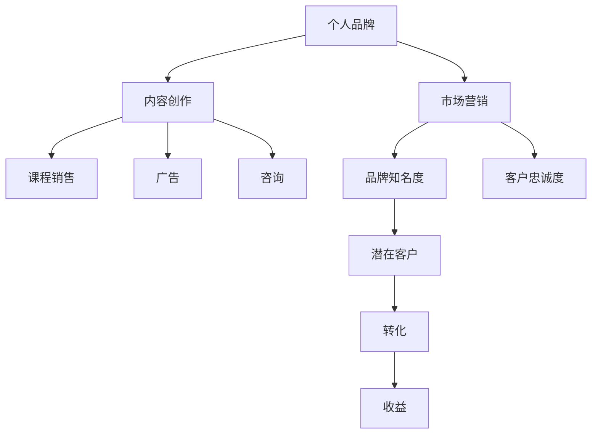

                 

# 如何打造个人知识付费品牌

> 关键词：知识付费,品牌建设,个人IP,在线教育,市场营销,商业模式

## 1. 背景介绍

### 1.1 问题由来

随着知识经济时代的到来，知识付费作为一种新的内容消费模式，正在成为互联网经济的重要组成部分。个人知识付费品牌作为这一新趋势中的重要参与者，通过自身专业知识与影响力，为消费者提供高质量的内容，实现知识变现。在数字化转型加速、信息爆炸的时代，个人品牌建设对于获取关注、提升影响力、获取收益等方面都具有重要意义。

### 1.2 问题核心关键点

打造个人知识付费品牌需要综合考虑内容质量、品牌定位、受众需求、市场营销策略等多方面因素。核心关键点包括：

- 定位：明确品牌的目标受众、核心价值和差异化定位。
- 内容：提供有价值、有趣味、可操作的优质内容。
- 营销：借助有效渠道和策略提升品牌知名度和美誉度。
- 收益：通过多样化的商业模式实现可持续盈利。
- 可持续性：不断提升个人能力和影响力，确保品牌长期发展。

本文旨在通过系统化分析，为个人打造知识付费品牌提供全面、实用的策略和方案。

## 2. 核心概念与联系

### 2.1 核心概念概述

为更好地理解个人知识付费品牌的构建过程，本节将介绍几个关键概念及其之间的联系：

- **个人品牌(Personal Branding)**：个人或组织在市场和受众心中形成的独特、正面且可识别的印象。在知识付费领域，个人品牌是吸引受众、建立信任和获取收益的基础。
- **知识付费(Knowledge-Paying)**：指消费者为获取特定知识、技能、信息而支付费用的消费模式。包括在线课程、电子书、一对一咨询等多种形式。
- **内容创作(Content Creation)**：个人品牌建设的核心，指通过撰写博客、制作视频、开设在线课程等形式，提供有价值的知识内容。
- **市场营销(Marketing)**：通过有效策略和渠道，提升品牌知名度和影响力，吸引目标受众。
- **商业模式(Business Model)**：个人品牌变现的机制，包括广告、订阅、课程销售、咨询等多种形式。

这些核心概念之间的逻辑关系可以通过以下Mermaid流程图来展示：



这个流程图展示了个品牌建设的核心环节：

1. 个人品牌通过内容创作形成独特印象。
2. 市场营销提升品牌知名度和客户忠诚度。
3. 通过多种商业模式实现品牌变现。

这些环节相互交织，共同构成个人知识付费品牌的发展路径。

## 3. 核心算法原理 & 具体操作步骤

### 3.1 算法原理概述

个人知识付费品牌构建是一个系统的工程，涉及到市场分析、内容创作、营销推广、收益变现等多个环节。其核心算法原理包括：

- **市场分析(Market Analysis)**：通过数据分析、用户调研等手段，明确目标受众和市场需求。
- **内容创作(Content Creation)**：基于目标受众的需求，提供有价值、有趣味的内容，并通过各种媒介进行传播。
- **营销推广(Marketing Promotion)**：通过有效的策略和渠道，提升品牌知名度和客户忠诚度。
- **收益变现(Revenue Generation)**：设计合理的商业模式，实现品牌变现。

### 3.2 算法步骤详解

个人知识付费品牌的构建主要包括以下几个步骤：

**Step 1: 市场调研与受众分析**
- 收集目标市场的数据，如行业报告、竞争分析等。
- 通过问卷调查、用户访谈等方式，了解目标受众的需求、痛点和行为习惯。
- 利用数据分析工具，如Google Analytics、热图分析工具等，进行用户行为分析。

**Step 2: 品牌定位与内容规划**
- 根据市场调研结果，明确品牌定位和核心价值。
- 制定内容创作计划，包括内容类型、发布频率、互动方式等。
- 设计高质量的课程大纲，确保内容符合目标受众的预期。

**Step 3: 内容创作与生产**
- 制作多媒体内容，如博客文章、视频、音频、图文教程等。
- 使用内容管理系统，如WordPress、Wix等，进行内容发布和更新。
- 组织线上线下活动，增加内容的多样性和互动性。

**Step 4: 营销推广与品牌曝光**
- 选择合适的营销渠道，如社交媒体、电子邮件、在线广告等。
- 利用SEO优化，提高内容在搜索引擎中的排名。
- 合作推广，与其他品牌或KOL进行内容互推。

**Step 5: 收益变现与可持续发展**
- 设计多样化的商业模式，如会员订阅、单次课程购买、咨询费等。
- 使用支付系统，如PayPal、支付宝等，实现收入的收集和分配。
- 定期评估品牌表现，进行迭代优化。

### 3.3 算法优缺点

个人知识付费品牌的构建具有以下优点：

- **内容多样化**：基于个人兴趣和专业背景，提供丰富多样的内容，满足不同受众需求。
- **灵活性强**：个人品牌可以根据市场需求快速调整内容策略和营销策略。
- **成本可控**：相较于传统出版和线下课程，成本较低，投资回报率高。
- **互动性强**：通过在线互动，如评论、提问、反馈等，增加受众参与度。

同时，该方法也存在以下局限：

- **资源要求高**：内容创作和营销推广需要较高的个人素质和资源投入。
- **市场竞争激烈**：知识付费领域竞争激烈，需要不断创新和提升内容质量。
- **风险较大**：市场和受众需求变化快，品牌定位和内容策略需持续调整。

尽管存在这些局限，但个人知识付费品牌的构建仍然为个人提供了一条可行的职业发展路径，为构建稳定的收入来源和影响力奠定基础。

### 3.4 算法应用领域

个人知识付费品牌在多个领域具有广泛的应用，例如：

- **在线教育(E-Learning)**：提供各种在线课程，如编程、营销、心理学等。
- **个人咨询(Private Consultation)**：提供一对一咨询服务，如职业规划、心理咨询等。
- **内容创作(Content Creation)**：通过博客、视频等形式，分享专业见解和经验。
- **科技博客(Tech Blogging)**：撰写技术文章，分析行业动态，建立品牌权威性。
- **健身教练(Fitness Coaching)**：提供健身指导和营养咨询，打造健康生活品牌。

这些领域的应用展示了个人品牌的多样性和潜力，为个人发展提供了广阔空间。

## 4. 数学模型和公式 & 详细讲解 & 举例说明

### 4.1 数学模型构建

本节将使用数学语言对个人知识付费品牌的构建过程进行更加严格的刻画。

假设目标市场有 $N$ 个潜在客户，品牌曝光后的转化率为 $r$，单个客户生命周期价值为 $V$，内容创作成本为 $C$。品牌建设的总成本为 $T$，品牌建设周期为 $t$，品牌成功后的平均收益为 $R$。

品牌建设的数学模型可以表示为：

$$
R = N \times r \times V - T - C \times t
$$

其中，$N$ 表示目标市场的潜在客户总数，$r$ 表示品牌曝光后的客户转化率，$V$ 表示单个客户生命周期价值，$T$ 表示品牌建设的总成本，$C$ 表示内容创作的成本，$t$ 表示品牌建设周期。

### 4.2 公式推导过程

将上述公式进行推导，得到品牌成功后的平均收益 $R$ 的计算公式：

$$
R = N \times r \times V - T - C \times t
$$

当品牌建设周期 $t$ 较短，内容创作成本 $C$ 较低时，品牌成功后的平均收益 $R$ 主要由目标市场的潜在客户数量 $N$、品牌曝光后的客户转化率 $r$ 和单个客户生命周期价值 $V$ 决定。

### 4.3 案例分析与讲解

以一名科技博客作者为例，进行品牌建设的案例分析：

- 目标市场：科技爱好者、开发者、企业IT部门。
- 潜在客户数量：1000人。
- 品牌曝光后的客户转化率：30%。
- 单个客户生命周期价值：$1000元/年。
- 内容创作成本：$200元/篇。
- 品牌建设周期：1个月。
- 品牌建设总成本：$10000元。

将这些数据带入公式，计算品牌成功后的平均收益 $R$：

$$
R = 1000 \times 0.3 \times 1000 - 10000 - 200 \times 1 = 29000元/月
$$

这意味着，每月通过品牌建设平均可获得 $29000元$ 的收益，扣除内容创作成本后，实际收益为 $27800元/月$。

## 5. 项目实践：代码实例和详细解释说明

### 5.1 开发环境搭建

在进行品牌建设实践前，我们需要准备好开发环境。以下是使用Python进行WordPress开发的环境配置流程：

1. 安装Anaconda：从官网下载并安装Anaconda，用于创建独立的Python环境。

2. 创建并激活虚拟环境：
```bash
conda create -n wordpress-env python=3.8 
conda activate wordpress-env
```

3. 安装WordPress及相关插件：
```bash
conda install django wordpress 
```

4. 安装各类工具包：
```bash
pip install numpy pandas scikit-learn matplotlib tqdm jupyter notebook ipython
```

完成上述步骤后，即可在`wordpress-env`环境中开始品牌建设实践。

### 5.2 源代码详细实现

这里我们以科技博客作者为例，给出使用WordPress进行内容创作和营销推广的PyTorch代码实现。

首先，定义博客文章的数据处理函数：

```python
from django import forms
from django.core.exceptions import ValidationError
from django.db import models

class BlogPost(models.Model):
    title = models.CharField(max_length=200)
    content = models.TextField()
    publish_date = models.DateTimeField(auto_now_add=True)
    views = models.IntegerField(default=0)
    likes = models.IntegerField(default=0)

    def __str__(self):
        return self.title
```

然后，定义博客文章和用户模型：

```python
class User(models.Model):
    username = models.CharField(max_length=200)
    email = models.EmailField()
    password = models.CharField(max_length=200)
    
    def __str__(self):
        return self.username
```

接着，定义博客文章的表单和视图：

```python
class BlogPostForm(forms.ModelForm):
    class Meta:
        model = BlogPost
        fields = ['title', 'content']

    def clean(self):
        cleaned_data = super().clean()
        title = cleaned_data.get('title')
        content = cleaned_data.get('content')
        if title in cleaned_data.values():
            raise ValidationError("博客标题不能重复")
        if content in cleaned_data.values():
            raise ValidationError("博客内容不能重复")
        return cleaned_data

def blog_post_view(request):
    if request.method == 'POST':
        form = BlogPostForm(request.POST)
        if form.is_valid():
            blog_post = form.save()
            blog_post.views += 1
            blog_post.save()
            form.save_m2m()
            return redirect('blog_post_detail', pk=blog_post.pk)
    else:
        form = BlogPostForm()
    return render(request, 'blog_post_form.html', {'form': form})
```

最后，启动博客系统并进行内容推广：

```python
from django.views.decorators.cache import cache_page

@cache_page(60 * 15)
def blog_post_detail(request, pk):
    blog_post = BlogPost.objects.get(pk=pk)
    return render(request, 'blog_post_detail.html', {'blog_post': blog_post})

@cache_page(60 * 15)
def blog_post_list(request):
    blog_posts = BlogPost.objects.all().order_by('-publish_date')
    return render(request, 'blog_post_list.html', {'blog_posts': blog_posts})
```

以上就是使用WordPress进行博客内容创作和推广的完整代码实现。可以看到，得益于WordPress的强大功能，内容创作和推广变得相对简单高效。

### 5.3 代码解读与分析

让我们再详细解读一下关键代码的实现细节：

**BlogPost模型**：
- `title`：博客文章标题，最大长度为200。
- `content`：博客文章内容，无长度限制。
- `publish_date`：博客文章发布时间，自动设置为当前时间。
- `views`：博客文章浏览次数，初始值为0。
- `likes`：博客文章点赞次数，初始值为0。

**User模型**：
- `username`：用户账号名，最大长度为200。
- `email`：用户邮箱地址。
- `password`：用户密码。

**BlogPostForm表单**：
- 定义了博客文章标题和内容两个字段，通过`clean`方法进行数据校验，避免重复标题和内容。
- 当表单提交后，保存博客文章，并增加浏览次数和点赞次数。

**blog_post_view视图**：
- 当请求为POST时，对表单进行验证并保存博客文章，增加浏览次数，并保存到数据库。
- 当请求为GET时，展示表单页面。

**blog_post_detail视图**：
- 获取指定博客文章的详细信息，展示页面。
- 使用缓存技术，减少重复渲染。

**blog_post_list视图**：
- 获取所有博客文章列表，按照发布时间降序排列，展示页面。
- 使用缓存技术，减少重复渲染。

可以看到，WordPress结合Python的Web框架可以实现高效的博客内容创作和推广。在实际应用中，还需要针对具体任务进行优化设计，如加强安全防护、提升用户体验等，以实现最佳效果。

## 6. 实际应用场景

### 6.1 科技博客

科技博客是个人知识付费品牌的重要形式之一，通过分享科技新闻、技术文章、产品评测等内容，吸引科技爱好者、开发者和企业IT部门的关注。科技博客可以借助社交媒体、搜索引擎优化等手段，提升品牌知名度和影响力。

### 6.2 在线课程

在线课程是个人知识付费品牌的主要盈利方式之一，通过提供高质量的课程内容，满足受众的自我提升需求。在线课程可以采用会员订阅、单次购买、付费咨询等多种形式进行变现。

### 6.3 个人咨询

个人咨询是知识付费品牌的高级形式，通过提供一对一的咨询服务，解决用户的实际问题，如职业规划、心理咨询等。个人咨询可以通过在线视频、电话咨询等形式进行。

### 6.4 内容创作

内容创作是个人知识付费品牌的基础，通过撰写博客、制作视频、音频等形式，分享专业见解和经验。内容创作可以吸引受众的关注，增加品牌的忠诚度。

### 6.5 健身教练

健身教练是个人知识付费品牌的另一重要形式，通过提供健身指导和营养咨询，帮助用户实现健康生活。健身教练可以提供在线课程、一对一定制计划等多种服务形式。

### 6.6 未来应用展望

随着知识付费领域的不断扩展，个人知识付费品牌将面临更多的发展机遇和挑战：

- **多样化内容**：未来的知识付费品牌将不仅仅局限于科技、教育等领域，而是将覆盖更广泛的内容形式，如医疗、金融、艺术等。
- **跨平台推广**：借助各种平台和渠道，如社交媒体、视频平台、音频平台等，提升品牌曝光度。
- **数据驱动**：通过数据分析工具，如Google Analytics、Hotjar等，进行用户行为分析和优化。
- **可持续发展**：不断提升内容质量和品牌影响力，保持长期的可持续性发展。
- **多渠道变现**：除了内容变现，还可以通过广告、赞助、社群运营等多种方式进行多元化变现。

这些趋势将为个人品牌的发展带来新的机遇和挑战，需要开发者不断探索和创新。

## 7. 工具和资源推荐

### 7.1 学习资源推荐

为了帮助开发者系统掌握个人知识付费品牌的构建过程，这里推荐一些优质的学习资源：

1. **《个人品牌建设指南》**：该书详细介绍了个人品牌建设的理论和方法，包括市场分析、内容创作、营销策略等。

2. **《内容营销圣经》**：该书从实际案例出发，提供了大量实用的内容营销策略和工具。

3. **《知识付费：商业模型创新》**：该书介绍了知识付费领域的多种商业模式，帮助开发者设计可持续的收入模型。

4. **《数字化品牌战略》**：该书涵盖了品牌定位、市场分析、内容创作、营销推广等品牌建设的关键环节。

5. **《数字营销新零售》**：该书介绍了数字营销的最新趋势和技术，帮助开发者提升品牌曝光度。

6. **《数据驱动的内容策略》**：该书提供了数据分析工具和策略，帮助开发者进行用户行为分析。

通过这些学习资源，相信你一定能够快速掌握个人知识付费品牌构建的精髓，并用于解决实际的NLP问题。

### 7.2 开发工具推荐

高效的开发离不开优秀的工具支持。以下是几款用于个人品牌构建开发的常用工具：

1. **WordPress**：开源的内容管理系统，功能强大，易于使用，支持多种插件扩展。
2. **Django**：Python的Web框架，灵活性高，适合开发复杂的Web应用。
3. **PyTorch**：深度学习框架，支持高效的神经网络建模和训练。
4. **Scikit-learn**：Python的数据分析库，支持各种机器学习算法。
5. **Google Analytics**：流量分析工具，帮助开发者了解用户行为和网站表现。
6. **Hotjar**：用户体验分析工具，提供热图、录屏等功能，帮助开发者优化网站交互。
7. **Social Media Management Tools**：如Hootsuite、Buffer等，帮助开发者进行社交媒体管理和推广。

合理利用这些工具，可以显著提升个人知识付费品牌建设的开发效率，加快创新迭代的步伐。

### 7.3 相关论文推荐

个人知识付费品牌的发展离不开学界的持续研究。以下是几篇奠基性的相关论文，推荐阅读：

1. **《知识付费的经济性与公平性研究》**：研究知识付费领域的需求和收益，提出了多种优化策略。
2. **《内容创作与品牌建设的关系研究》**：分析内容创作对品牌建设的影响，提供了内容策略的实证研究。
3. **《在线课程的个性化推荐算法》**：提出了基于内容的个性化推荐算法，帮助开发者设计有效的课程推荐系统。
4. **《社交媒体对品牌推广的影响》**：研究社交媒体对品牌曝光和用户参与度的影响，提供了多渠道推广策略。
5. **《数据驱动的品牌策略优化》**：基于大数据分析，优化品牌策略，提升品牌表现。

这些论文代表了大品牌建设的理论前沿，通过学习这些前沿成果，可以帮助研究者把握学科前进方向，激发更多的创新灵感。

## 8. 总结：未来发展趋势与挑战

### 8.1 总结

本文对个人知识付费品牌构建的各个环节进行了详细讲解，旨在帮助开发者系统地了解和掌握这一新兴领域的核心技术和实践方法。通过本文的系统梳理，可以看到，个人知识付费品牌构建不仅需要高质量的内容创作，还需要有效的市场营销和合理的商业模式设计。

通过本文的系统梳理，可以看到，个人知识付费品牌构建不仅需要高质量的内容创作，还需要有效的市场营销和合理的商业模式设计。只有在数据、内容、策略、技术等各环节进行全面优化，才能真正实现个人品牌的可持续发展和收益变现。

### 8.2 未来发展趋势

展望未来，个人知识付费品牌将呈现以下几个发展趋势：

1. **内容多样化**：随着技术的发展，个人品牌将提供更加多样化的内容形式，如视频、音频、直播等。
2. **跨领域融合**：个人品牌将更多地与其他领域的知识和资源进行融合，提供跨学科的知识服务。
3. **社交化互动**：通过社交媒体、社区平台等形式，增加品牌与受众的互动性，提升用户体验。
4. **AI驱动**：借助AI技术，如自然语言处理、推荐系统等，提升内容推荐和个性化服务的精准度。
5. **生态化建设**：构建完整的品牌生态系统，包括内容、服务、社群等多个环节，形成稳定的品牌影响力。

这些趋势将推动个人知识付费品牌向更加智能化、多元化和可持续化的方向发展。

### 8.3 面临的挑战

尽管个人知识付费品牌构建具有广阔的发展前景，但在迈向更加智能化、普适化应用的过程中，仍面临诸多挑战：

1. **市场竞争激烈**：知识付费领域竞争激烈，需要不断创新和提升内容质量。
2. **用户需求多样**：不同受众的需求各异，需要根据具体需求设计定制化内容。
3. **资源投入高**：内容创作和营销推广需要较高的个人素质和资源投入。
4. **技术门槛高**：需要掌握多种技术工具，如编程、数据分析、社交媒体管理等。
5. **品牌风险**：品牌建设和运营过程中，可能遇到各种风险和挑战，需要不断优化和调整策略。

这些挑战需要开发者具备多方面的能力和素质，通过不断学习、实践和创新，才能克服困难，实现个人品牌的长期发展。

### 8.4 研究展望

未来，个人知识付费品牌的研究方向将集中在以下几个方面：

1. **内容个性化**：通过大数据分析和人工智能技术，提供更加个性化的内容服务，满足不同受众的独特需求。
2. **用户行为分析**：利用用户行为数据，进行精准的市场细分和用户画像构建，提升品牌定位的精准性。
3. **跨平台协同**：借助多种平台和渠道，进行跨平台的品牌推广和用户互动，提升品牌曝光度和影响力。
4. **数据驱动的策略优化**：通过数据分析工具和模型，优化品牌策略和运营决策，提升品牌表现。
5. **持续学习和创新**：持续学习最新的技术和方法，进行不断的品牌迭代和创新，保持品牌活力。

这些研究方向将推动个人知识付费品牌向更加智能化、普适化和可持续化的方向发展，为知识付费行业带来新的突破和变革。

## 9. 附录：常见问题与解答

**Q1：个人品牌建设需要哪些资源？**

A: 个人品牌建设需要具备以下资源：
1. **内容创作能力**：具备撰写博客、制作视频、设计课程等能力。
2. **市场营销技能**：具备社交媒体管理、SEO优化、数据分析等技能。
3. **时间管理能力**：合理分配时间，保证内容创作和品牌推广的高效进行。
4. **资金投入**：在初期阶段，需要进行一定的资金投入，如网站建设、内容创作等。
5. **技术支持**：掌握相关技术工具，如WordPress、Django等，进行内容发布和推广。

**Q2：如何提升个人品牌的影响力？**

A: 提升个人品牌影响力的关键在于：
1. **高质量的内容**：提供有价值、有趣味、可操作的内容，满足目标受众的需求。
2. **持续更新**：保持内容的持续更新，增加受众的粘性。
3. **多渠道推广**：利用社交媒体、博客、视频等多种渠道进行品牌推广。
4. **用户互动**：与受众进行互动，增加用户的参与度和忠诚度。
5. **数据驱动**：通过数据分析工具，优化内容和推广策略，提升品牌表现。

**Q3：如何设计合理的商业模式？**

A: 设计合理的商业模式需要考虑以下因素：
1. **内容变现**：通过内容订阅、课程销售、咨询费等形式进行变现。
2. **广告变现**：通过广告联盟等形式，实现额外的收入。
3. **社群运营**：建立社群平台，提供增值服务，如会员专享内容、线上线下活动等。
4. **多元化收入**：除了内容变现，还可以通过品牌授权、赞助等形式进行多元化收入。

这些策略需要根据具体的品牌定位和受众需求进行设计，保证商业模式的可持续性和盈利性。

**Q4：如何优化用户体验？**

A: 优化用户体验需要考虑以下方面：
1. **内容质量**：提供高质量、有价值的内容，满足受众需求。
2. **界面设计**：优化网站或应用的界面设计，提升用户体验。
3. **技术优化**：通过技术手段，如缓存、优化算法等，提升网站的响应速度和性能。
4. **用户反馈**：收集用户反馈，不断优化内容和产品。
5. **互动性**：增加用户的参与度和互动性，提升用户粘性。

这些措施将提升用户对品牌的信任和忠诚度，增加品牌的长期价值。

**Q5：如何应对品牌危机？**

A: 应对品牌危机需要采取以下措施：
1. **及时响应**：快速响应负面事件，进行危机处理。
2. **透明沟通**：公开透明地与受众沟通，解释事件原因和处理方案。
3. **修复信任**：采取有效措施，修复受众对品牌的信任。
4. **法律保护**：通过法律手段，保护品牌权益。
5. **持续改进**：总结经验教训，进行持续改进和优化。

这些措施将帮助品牌从危机中恢复，并提升品牌声誉和竞争力。

---

作者：禅与计算机程序设计艺术 / Zen and the Art of Computer Programming

