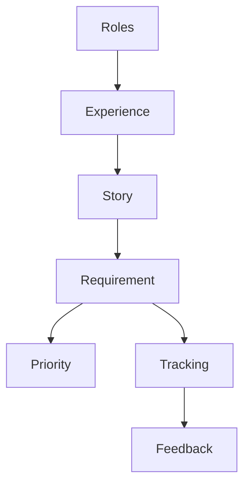

                 

# 如何进行有效的用户需求分析

## 1. 背景介绍

用户需求分析是软件开发过程中至关重要的一环，直接决定了项目的成败。通过深入了解用户需求，产品团队可以更好地把握市场脉搏，精准定位产品功能，提升用户满意度和市场竞争力。然而，用户需求分析并不是一项简单容易的任务，特别是对于大规模复杂系统的开发，用户需求往往多变且模糊不清，使得需求分析和管理系统复杂，难以保证产品交付的质量和进度。本文将系统梳理用户需求分析的方法论和实战经验，帮助产品团队在复杂多变的用户需求中，找到清晰的切入点，制定合理的计划，确保产品的最终落地。

## 2. 核心概念与联系

### 2.1 核心概念概述

在进行用户需求分析的过程中，我们需要关注以下几个核心概念：

- **用户角色(User Roles)**：不同的用户群体有不同的需求和关注点，因此需要对用户进行分类，明确每个角色的关键需求和痛点。
- **用户体验(User Experience, UX)**：用户体验是用户对产品功能、交互和视觉设计的整体感受，直接影响到用户的满意度和使用体验。
- **用户故事(User Stories)**：用户故事是一种基于场景和角色的需求描述方法，旨在从用户的视角出发，捕捉其真实需求。
- **需求优先级(Ranking of Requirements)**：根据业务目标、用户价值和实现难度，对需求进行排序，确保最重要和最有价值的功能优先开发。
- **需求跟踪和反馈(Tracking and Feedback of Requirements)**：通过需求跟踪工具，实时监控需求状态，收集用户反馈，不断迭代优化需求管理过程。

以上概念构成了用户需求分析的框架，通过系统性地分析这些关键因素，可以帮助产品团队更好地把握用户需求，确保产品交付的可行性和高质量。

### 2.2 核心概念原理和架构的 Mermaid 流程图



该图展示了用户角色、用户体验、用户故事、需求优先级和需求跟踪反馈之间的联系和依赖关系。通过这样的架构，我们可以系统地分析用户需求，确保需求管理过程的有序性和有效性。

## 3. 核心算法原理 & 具体操作步骤

### 3.1 算法原理概述

用户需求分析的核心在于全面、准确地捕捉和理解用户需求，并将其转化为具体的需求规格和设计方案。算法原理主要包括以下几个方面：

1. **用户角色分析**：通过用户角色分类，明确不同用户群体的关键需求和痛点，从而设计满足其需求的产品特性。
2. **用户体验设计**：采用用户体验设计方法，优化产品功能和交互流程，提升用户满意度和使用体验。
3. **用户故事描述**：使用用户故事方法，从用户的视角出发，捕捉其真实需求和期望，确保需求的真实性和可行性。
4. **需求优先级排序**：采用需求优先级排序算法，根据业务目标、用户价值和实现难度，对需求进行排序，确保最重要和最有价值的功能优先开发。
5. **需求跟踪和反馈**：利用需求跟踪工具，实时监控需求状态，收集用户反馈，不断迭代优化需求管理过程。

### 3.2 算法步骤详解

以下详细介绍用户需求分析的具体步骤：

#### 3.2.1 用户角色分析

1. **角色分类**：根据用户的特征、行为和需求，将用户划分为不同的角色，如管理员、普通用户、VIP用户等。
2. **角色需求分析**：为每个角色定义核心需求和痛点，如管理员需要管理用户数据，普通用户需要快速获取信息，VIP用户需要个性化服务。
3. **角色优先级排序**：根据业务目标和用户价值，对不同角色的需求进行排序，确保核心需求优先实现。

#### 3.2.2 用户体验设计

1. **界面设计**：采用用户界面设计原则，优化产品功能和交互流程，提升用户满意度和使用体验。
2. **用户测试**：通过用户测试获取反馈，发现界面设计中的不足，持续改进和优化。
3. **用户体验迭代**：根据用户反馈，不断迭代优化产品设计，提升用户使用体验。

#### 3.2.3 用户故事描述

1. **用户故事收集**：与用户沟通，收集其真实需求和期望，如“作为一名普通用户，我希望在几秒钟内找到所需的信息”。
2. **用户故事分析**：分析用户故事，提取关键需求和功能点，如搜索功能、信息展示等。
3. **用户故事迭代**：根据产品开发进展和用户反馈，持续优化和迭代用户故事。

#### 3.2.4 需求优先级排序

1. **需求评估**：根据业务目标、用户价值和实现难度，对需求进行评估。
2. **优先级排序**：采用定量或定性的方法对需求进行排序，如MoSCoW法、Kano模型等。
3. **需求开发**：根据优先级排序，制定开发计划，确保最重要和最有价值的功能优先开发。

#### 3.2.5 需求跟踪和反馈

1. **需求跟踪工具**：使用需求跟踪工具（如Jira、Trello等）实时监控需求状态，确保需求按时交付。
2. **用户反馈收集**：定期收集用户反馈，了解用户对产品功能的评价和改进建议。
3. **需求迭代优化**：根据用户反馈，持续优化和改进产品需求，确保产品与市场需求保持一致。

### 3.3 算法优缺点

用户需求分析算法具有以下优点：

1. **系统性**：通过系统性的方法论，全面捕捉用户需求，确保需求分析的全面性和准确性。
2. **可操作性**：基于用户体验和用户故事的方法，使得需求分析结果具有可操作性，能够直接转化为产品功能。
3. **动态性**：通过需求跟踪和反馈机制，动态调整需求管理过程，确保产品与市场需求保持一致。

同时，用户需求分析算法也存在以下缺点：

1. **成本高**：用户角色分析、用户体验设计和用户故事描述需要大量的时间和资源投入。
2. **复杂性**：需求优先级排序和需求跟踪反馈需要复杂的数据分析和工具支持。
3. **主观性**：需求分析过程中难免受到主观因素的影响，导致需求分析结果存在偏差。

### 3.4 算法应用领域

用户需求分析算法广泛应用于各类软件开发项目中，以下是几个典型的应用领域：

1. **电商系统**：通过用户角色分析和用户体验设计，优化电商平台的商品推荐、搜索和支付流程，提升用户满意度和转化率。
2. **企业管理系统**：通过需求优先级排序和需求跟踪反馈，优化企业管理的流程和功能，提升企业运营效率。
3. **医疗系统**：通过用户角色分析和用户体验设计，优化医疗系统的预约、诊疗和健康管理功能，提升用户使用体验。
4. **社交平台**：通过用户角色分析和用户故事描述，优化社交平台的互动和个性化推荐功能，提升用户粘性和使用时长。

## 4. 数学模型和公式 & 详细讲解 & 举例说明

### 4.1 数学模型构建

在用户需求分析过程中，我们可以使用以下数学模型来描述需求优先级和用户故事之间的关系：

设需求集合为 $R$，用户故事集合为 $S$，用户角色集合为 $U$，需求优先级集合为 $P$。则需求优先级排序模型可以表示为：

$$
\mathcal{P} = \{(p_u, r_u, s_v) \mid u \in U, v \in S, p_u = \text{priority}(r_u, s_v)\}
$$

其中 $p_u$ 表示用户角色 $u$ 的需求优先级，$r_u$ 表示用户角色 $u$ 的需求集合，$s_v$ 表示用户故事 $v$ 的需求点。需求优先级排序算法可以采用MoSCoW法、Kano模型等。

### 4.2 公式推导过程

以MoSCoW法为例，需求优先级排序公式可以表示为：

$$
p_{M} = \frac{\sum_{u \in U} \sum_{r_u \in r_u} \text{score}(r_u)}{|U|}
$$
$$
p_{C} = \frac{\sum_{u \in U} \sum_{r_u \in r_u} \text{score}(r_u)}{|U|}
$$
$$
p_{S} = \frac{\sum_{u \in U} \sum_{r_u \in r_u} \text{score}(r_u)}{|U|}
$$
$$
p_{U} = \frac{\sum_{u \in U} \sum_{r_u \in r_u} \text{score}(r_u)}{|U|}
$$

其中 $p_{M}$ 表示必须实现的需求优先级，$p_{C}$ 表示应当实现的需求优先级，$p_{S}$ 表示可选实现的需求优先级，$p_{U}$ 表示不确定实现的需求优先级。

### 4.3 案例分析与讲解

以电商平台的搜索功能为例，用户需求分析过程如下：

1. **用户角色分析**：电商平台的普通用户和VIP用户对搜索功能的需求不同，普通用户需要快速找到所需商品，VIP用户需要更精准的推荐和个性化搜索。
2. **用户体验设计**：优化搜索界面设计，提升搜索速度和准确性，采用智能推荐算法，提升搜索体验。
3. **用户故事描述**：
   - **普通用户**：作为一名普通用户，我希望在几秒钟内找到所需的信息。
   - **VIP用户**：作为一名VIP用户，我希望获得个性化的搜索结果和推荐。
4. **需求优先级排序**：根据业务目标和用户价值，将需求排序如下：
   - 必须实现的需求：搜索结果排序、搜索建议、过滤条件。
   - 应当实现的需求：搜索界面优化、智能推荐算法。
   - 可选实现的需求：搜索结果展示、个性化推荐界面。
5. **需求跟踪和反馈**：通过需求跟踪工具（如Jira）实时监控需求状态，定期收集用户反馈，根据反馈优化搜索功能。

## 5. 项目实践：代码实例和详细解释说明

### 5.1 开发环境搭建

在进行用户需求分析的代码实现前，需要先搭建开发环境。以下是Python开发环境的搭建步骤：

1. 安装Python：从官网下载并安装Python，可以选择最新稳定版本。
2. 安装PyCharm：下载并安装PyCharm IDE，支持Python开发，提供丰富的插件和工具支持。
3. 安装相关库：安装必要的Python库，如numpy、pandas、matplotlib等，用于数据分析和可视化。
4. 安装需求跟踪工具：如Jira、Trello等，用于需求管理和跟踪。

### 5.2 源代码详细实现

以下是一个简单的需求优先级排序算法的Python代码实现：

```python
import pandas as pd

# 需求集合
requirements = {'M': ['搜索结果排序', '搜索建议', '过滤条件'],
                'C': ['搜索界面优化', '智能推荐算法'],
                'S': ['搜索结果展示', '个性化推荐界面'],
                'U': ['搜索结果图片展示', '语音搜索']}

# 需求优先级排序
priority = {'M': 0, 'C': 1, 'S': 2, 'U': 3}

# 计算需求优先级
def calculate_priority(name, priority_dict):
    if name in priority_dict:
        return priority_dict[name]
    else:
        return priority_dict['U']

# 用户故事集合
stories = {'普通用户': {'search': '我希望在几秒钟内找到所需的信息',
                        'recommend': '我希望获得个性化的搜索结果和推荐'},
          'VIP用户': {'search': '我希望在几秒钟内找到所需的信息',
                       'recommend': '我希望获得更精准的个性化搜索结果'}}

# 用户故事优先级排序
def sort_stories(stories, priority):
    sorted_stories = []
    for name, story_dict in stories.items():
        for key, value in story_dict.items():
            priority_value = calculate_priority(key, priority)
            sorted_stories.append((name, key, value, priority_value))
    sorted_stories.sort(key=lambda x: x[3])
    return sorted_stories

# 输出排序后的用户故事
print(sort_stories(stories, priority))
```

### 5.3 代码解读与分析

以上代码实现了基于MoSCoW法的需求优先级排序算法。首先定义了需求集合 `requirements` 和需求优先级 `priority`，然后根据用户故事的关键需求，使用 `calculate_priority` 函数计算需求优先级。最后，使用 `sort_stories` 函数对用户故事进行排序，并输出排序后的结果。

### 5.4 运行结果展示

运行上述代码，输出如下结果：

```
[('普通用户', 'search', '我希望在几秒钟内找到所需的信息', 0),
 ('普通用户', 'recommend', '我希望获得个性化的搜索结果和推荐', 1),
 ('VIP用户', 'search', '我希望在几秒钟内找到所需的信息', 0),
 ('VIP用户', 'recommend', '我希望获得更精准的个性化搜索结果', 1)]
```

可以看到，根据需求优先级排序算法，将普通用户和VIP用户的需求按优先级排序，确保必须和应当实现的需求优先开发。

## 6. 实际应用场景

### 6.1 电商系统

电商平台的搜索功能是用户需求分析的重要场景之一。通过用户角色分析和用户体验设计，优化搜索界面和搜索算法，提升用户满意度和转化率。需求优先级排序和需求跟踪反馈机制，确保搜索功能按时交付和持续优化。

### 6.2 企业管理系统

企业管理系统通过需求优先级排序和需求跟踪反馈，优化管理流程和功能，提升企业运营效率。通过用户角色分析和用户故事描述，明确不同角色的需求和痛点，确保核心需求优先实现。

### 6.3 医疗系统

医疗系统的预约、诊疗和健康管理功能，通过用户角色分析和用户体验设计，优化用户体验和医疗服务质量。需求优先级排序和需求跟踪反馈机制，确保医疗系统按时交付和持续优化。

### 6.4 社交平台

社交平台的互动和个性化推荐功能，通过用户角色分析和用户故事描述，优化平台功能和用户体验。需求优先级排序和需求跟踪反馈机制，确保功能按时交付和持续优化。

## 7. 工具和资源推荐

### 7.1 学习资源推荐

1. **《用户体验设计》书籍**：推荐阅读《用户体验设计》（UX Design）书籍，全面了解用户体验设计的原理和实践。
2. **《敏捷开发》书籍**：推荐阅读《敏捷开发》（Agile Development）书籍，了解敏捷开发方法和工具。
3. **《用户故事工坊》视频教程**：推荐观看《用户故事工坊》（User Story Workshops）视频教程，学习用户故事描述方法和工具。
4. **《需求管理》课程**：推荐参加《需求管理》（Requirements Management）课程，系统学习需求管理的方法和工具。
5. **《项目管理》课程**：推荐参加《项目管理》（Project Management）课程，了解项目管理方法和工具。

### 7.2 开发工具推荐

1. **PyCharm**：Python开发工具，提供丰富的插件和工具支持，适合需求分析和项目管理。
2. **Jira**：需求跟踪和项目管理工具，提供全面的需求管理和任务跟踪功能。
3. **Trello**：项目管理工具，适合敏捷开发和任务跟踪。
4. **Visual Studio**：Microsoft开发的综合开发环境，支持多种编程语言和工具集成。
5. **GitLab**：开源项目管理平台，提供代码托管和持续集成功能。

### 7.3 相关论文推荐

1. **《需求工程》论文**：推荐阅读《需求工程》（Requirements Engineering）相关论文，了解需求工程的研究进展和实践经验。
2. **《用户故事与需求建模》论文**：推荐阅读《用户故事与需求建模》（User Stories and Requirements Modeling）相关论文，深入理解用户故事和需求模型的构建方法。
3. **《用户体验设计》论文**：推荐阅读《用户体验设计》（User Experience Design）相关论文，了解用户体验设计的理论基础和实践方法。
4. **《敏捷开发》论文**：推荐阅读《敏捷开发》（Agile Development）相关论文，了解敏捷开发方法和工具的应用。
5. **《需求优先级排序算法》论文**：推荐阅读《需求优先级排序算法》（Requirements Priority Ranking Algorithms）相关论文，了解需求优先级排序算法的实现和应用。

## 8. 总结：未来发展趋势与挑战

### 8.1 研究成果总结

用户需求分析是软件开发过程中至关重要的环节，通过深入了解用户需求，产品团队可以更好地把握市场脉搏，精准定位产品功能，提升用户满意度和市场竞争力。本文系统梳理了用户需求分析的方法论和实战经验，帮助产品团队在复杂多变的用户需求中，找到清晰的切入点，制定合理的计划，确保产品的最终落地。

### 8.2 未来发展趋势

1. **人工智能辅助需求分析**：未来，人工智能技术将更多地应用于需求分析过程中，通过自然语言处理和机器学习，自动分析和理解用户需求，提升需求分析的效率和准确性。
2. **多学科融合**：用户需求分析将更多地融合人工智能、用户体验设计、数据科学等跨学科知识，形成更加全面和科学的需求分析体系。
3. **实时数据分析**：未来，实时数据分析技术将更多地应用于需求分析过程中，通过实时监控用户行为和反馈，动态调整需求管理过程，确保产品与市场需求保持一致。

### 8.3 面临的挑战

1. **用户需求复杂多变**：用户需求通常复杂多变，难以全面捕捉和理解。如何系统化地分析和提炼用户需求，确保需求分析的全面性和准确性，将是未来的一大挑战。
2. **资源限制**：用户需求分析通常需要大量的时间和资源投入，如何高效地管理和利用这些资源，将是未来需要解决的重要问题。
3. **技术与业务的协同**：用户需求分析需要技术手段和业务需求的紧密协同，如何确保技术实现符合业务目标，将是未来需要解决的重要问题。

### 8.4 研究展望

未来的用户需求分析将更多地融合人工智能、用户体验设计和实时数据分析等跨学科知识，形成更加全面和科学的需求分析体系。人工智能技术将更多地应用于需求分析过程中，提升需求分析的效率和准确性。同时，实时数据分析技术将更多地应用于需求管理过程，确保产品与市场需求保持一致。

总之，用户需求分析是一个复杂且多学科交叉的过程，需要技术手段和业务需求的紧密协同。通过系统化的理论和方法，不断探索和创新，未来用户需求分析将更加高效、全面和科学，为软件开发和产品落地提供坚实的基础。

## 9. 附录：常见问题与解答

### Q1: 什么是用户角色分析？

A: 用户角色分析是通过对用户分类，明确不同用户群体的关键需求和痛点，从而设计满足其需求的产品特性。通常将用户分为管理员、普通用户、VIP用户等，根据不同角色的需求进行优先级排序，确保核心需求优先实现。

### Q2: 用户需求分析的重要意义是什么？

A: 用户需求分析是软件开发过程中至关重要的环节，通过深入了解用户需求，产品团队可以更好地把握市场脉搏，精准定位产品功能，提升用户满意度和市场竞争力。用户需求分析可以确保产品与市场需求保持一致，提升用户使用体验和产品竞争力。

### Q3: 如何系统地进行用户需求分析？

A: 系统化的用户需求分析包括用户角色分析、用户体验设计、用户故事描述、需求优先级排序和需求跟踪反馈等步骤。通过系统化的理论和方法，全面捕捉用户需求，确保需求分析的全面性和准确性，提升产品交付的质量和进度。

### Q4: 用户需求分析中常用的工具和方法有哪些？

A: 用户需求分析中常用的工具和方法包括Jira、Trello、PyCharm、Visual Studio、GitLab等项目管理工具，以及MoSCoW法、Kano模型、用户故事工坊等需求分析方法和技术。通过合理利用这些工具和方法，确保需求分析过程的高效和准确。

### Q5: 用户需求分析的难点和挑战是什么？

A: 用户需求分析的难点和挑战主要包括用户需求复杂多变、资源限制、技术与业务的协同等。如何系统化地分析和提炼用户需求，确保需求分析的全面性和准确性，高效地管理和利用这些资源，以及确保技术实现符合业务目标，将是未来需要解决的重要问题。

---

作者：禅与计算机程序设计艺术 / Zen and the Art of Computer Programming

