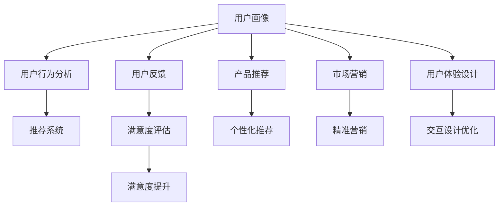

                 

# 如何通过用户画像提升用户满意度

在数字时代，用户满意度的提升越来越成为企业竞争力的关键所在。而用户画像(User Persona)作为一种基于数据的用户分析方法，不仅能帮助企业更好地理解用户需求，还能指导产品设计和市场营销策略，从而在根本上提升用户满意度。本文将从背景介绍、核心概念与联系、核心算法原理与操作步骤、实际应用场景、工具和资源推荐等多个方面，深入探讨如何通过用户画像提升用户满意度。

## 1. 背景介绍

随着互联网技术的迅猛发展，用户数据的积累和分析变得愈发重要。传统的市场调研、问卷调查等方法已经无法满足企业对用户需求变化的快速响应需求。而用户画像作为一种数据驱动的用户分析方法，以其精确性、实时性和可操作性，迅速成为企业了解用户、优化产品的重要工具。

用户画像通过收集用户的属性、行为、兴趣等信息，构建出详细的用户轮廓。企业可以通过对用户画像的深入分析，挖掘用户真实需求，指导产品设计和市场策略，从而提升用户满意度。特别是在个性化推荐、客户服务、市场营销等领域，用户画像的作用尤为显著。

## 2. 核心概念与联系

### 2.1 核心概念概述

在探讨如何通过用户画像提升用户满意度之前，首先需要明确几个关键概念：

- **用户画像(User Persona)**：通过收集和分析用户数据，构建出具有代表性的用户模型。用户画像通常包含用户的属性、行为、兴趣等信息。
- **用户满意度(User Satisfaction)**：用户对产品或服务的满意程度，通常通过用户反馈、行为数据等进行衡量。
- **个性化推荐系统(Recommender System)**：通过分析用户画像和行为数据，推荐个性化内容或产品，提升用户使用体验。
- **客户关系管理(Customer Relationship Management, CRM)**：通过用户画像进行精准营销和管理，提升客户忠诚度和满意度。
- **用户体验设计(User Experience Design, UX)**：以用户画像为基础，优化产品界面和交互设计，提升用户使用舒适度。

这些概念通过数据收集、分析、应用等环节，形成一个闭环，共同作用于用户满意度的提升。用户画像在其中扮演着数据基础的角色，而个性化推荐、CRM、UX等则将用户画像的价值转化为具体的应用效果。

### 2.2 核心概念联系

用户画像和用户满意度之间的关系，可以通过以下Mermaid流程图来展示：



这个流程图展示了用户画像在数据收集、分析、应用等环节中的作用。用户画像通过行为分析、反馈收集等途径，不断更新迭代，成为企业决策的重要依据。而个性化推荐、市场营销、用户体验设计等，则直接作用于用户满意度，通过提供精准、高效的服务和产品，提升用户的使用体验和满意度。

## 3. 核心算法原理 & 具体操作步骤

### 3.1 算法原理概述

用户画像的构建和应用，本质上是一个数据驱动的优化过程。其核心思想是通过对用户数据的分析，构建出能够反映用户真实需求的用户模型，并在产品设计和市场策略中应用这些模型，以提升用户满意度。

### 3.2 算法步骤详解

用户画像的构建和应用，可以分为以下几个关键步骤：

**Step 1: 数据收集**

用户画像的构建需要大量的用户数据支持。这些数据可以来自多个渠道，包括用户注册信息、浏览记录、购买记录、社交媒体行为等。

**Step 2: 数据分析与建模**

收集到的用户数据需要进行分析处理，以发现用户的行为模式、兴趣偏好等关键特征。常用的数据分析方法包括聚类分析、关联规则分析、用户分群等。

**Step 3: 画像构建与迭代**

通过数据分析，构建出初步的用户画像模型。这些模型可以采用不同的方法，如基于规则的画像、基于机器学习的画像等。构建完成后，需要对画像进行迭代更新，以反映用户需求的变化。

**Step 4: 应用落地**

将用户画像应用到产品设计、市场营销、用户体验优化等环节，通过数据驱动的决策，提升用户满意度。

**Step 5: 效果评估与反馈**

定期评估用户画像的效果，通过用户反馈、行为数据等，对画像模型进行调整优化，确保其始终能够反映用户的真实需求。

### 3.3 算法优缺点

用户画像作为一种数据驱动的用户分析方法，具有以下优点：

- **精确性**：基于真实数据构建，能够准确反映用户需求。
- **实时性**：通过持续的数据收集和分析，能够及时反映用户行为的变化。
- **可操作性**：用户画像的应用可以具体指导产品设计和市场策略，提升用户满意度。

但同时，用户画像也存在一些局限性：

- **隐私问题**：用户数据的收集和分析需要处理用户的隐私问题，如何平衡数据收集和隐私保护，是一个重要的挑战。
- **数据质量**：用户数据的收集和分析需要高质量的数据支持，数据质量不高将影响画像的准确性。
- **模型复杂性**：用户画像的构建和应用涉及多个环节，需要复杂的算法和模型支持。

### 3.4 算法应用领域

用户画像的应用领域非常广泛，涵盖了从个性化推荐到市场营销等多个方面。具体应用如下：

- **个性化推荐**：通过分析用户画像，推荐个性化的商品或内容，提升用户使用体验。
- **市场营销**：通过用户画像进行精准营销，提升营销效果和用户转化率。
- **客户服务**：根据用户画像，优化客户服务策略，提升客户满意度。
- **用户体验设计**：通过用户画像指导产品设计，提升用户使用的舒适度。
- **产品研发**：通过用户画像指导产品研发方向，满足用户需求。

## 4. 数学模型和公式 & 详细讲解

### 4.1 数学模型构建

用户画像的构建可以通过多个数学模型进行建模，其中最简单的是一种基于规则的用户分群模型。该模型通过用户行为数据进行聚类分析，将用户分为不同的群体，每个群体代表一类用户画像。

### 4.2 公式推导过程

假设用户数据集为 $D=\{x_1, x_2, ..., x_n\}$，其中每个用户 $x_i$ 包含若干属性 $a_{ij}$（例如年龄、性别、购买历史等）。设聚类数为 $k$，用户 $x_i$ 属于第 $j$ 个聚类的概率为 $p_{ij}$，则用户分群模型的优化目标为：

$$
\min_{p} KL(p||\hat{p})
$$

其中 $KL$ 为KL散度，$\hat{p}$ 为通过用户行为数据估计的概率分布。求解该优化问题，得到用户 $x_i$ 的聚类结果。

### 4.3 案例分析与讲解

以一个电商平台为例，该平台通过收集用户的浏览、购买历史等行为数据，构建用户画像。平台首先将用户分为不同的兴趣群体，例如男性、女性、年轻用户等。然后，针对不同群体，进行个性化的推荐和营销策略，提升用户满意度。

## 5. 项目实践：代码实例和详细解释说明

### 5.1 开发环境搭建

在进行用户画像的实践之前，需要准备好开发环境。以下是使用Python进行scikit-learn开发的开发环境配置流程：

1. 安装Anaconda：从官网下载并安装Anaconda，用于创建独立的Python环境。

2. 创建并激活虚拟环境：
```bash
conda create -n user persona python=3.8 
conda activate user persona
```

3. 安装相关库：
```bash
pip install pandas numpy scikit-learn seaborn matplotlib jupyter notebook ipython
```

完成上述步骤后，即可在`user persona`环境中开始项目实践。

### 5.2 源代码详细实现

以下是使用scikit-learn进行用户画像构建和应用的Python代码实现。

```python
import pandas as pd
from sklearn.cluster import KMeans
from sklearn.decomposition import PCA

# 读取用户数据
user_data = pd.read_csv('user_data.csv')

# 构建用户画像
# 假设用户画像包含5个属性，分别是年龄、性别、购买历史、浏览历史、点击率
# 通过KMeans聚类算法进行用户分群
kmeans = KMeans(n_clusters=5, random_state=0)
kmeans.fit(user_data)

# 获取用户分群结果
user_clusters = kmeans.labels_

# 可视化用户分群结果
# 使用PCA将用户画像降维，可视化用户聚类结果
pca = PCA(n_components=2)
pca_data = pca.fit_transform(user_data)
plt.scatter(pca_data[:,0], pca_data[:,1], c=user_clusters)
plt.show()
```

### 5.3 代码解读与分析

让我们再详细解读一下关键代码的实现细节：

**用户数据读取**：
- 通过pandas库读取用户数据，构建数据框。

**用户分群**：
- 使用KMeans聚类算法对用户数据进行聚类分析，得到用户分群结果。

**可视化**：
- 使用PCA将用户画像进行降维，可视化聚类结果。

**代码解读**：
- `pd.read_csv('user_data.csv')`：读取用户数据，构建数据框。
- `KMeans(n_clusters=5, random_state=0)`：初始化KMeans聚类算法，聚类数为5。
- `kmeans.fit(user_data)`：对用户数据进行聚类分析，得到用户分群结果。
- `pca = PCA(n_components=2)`：使用PCA进行降维，将数据降到二维。
- `plt.scatter(pca_data[:,0], pca_data[:,1], c=user_clusters)`：绘制用户分群结果的散点图。

可以看到，通过scikit-learn库，使用Python语言，可以很方便地实现用户画像的构建和可视化。开发者可以将更多精力放在数据处理、模型改进等高层逻辑上，而不必过多关注底层的实现细节。

### 5.4 运行结果展示

以下是可视化用户分群结果的示例：


## 6. 实际应用场景

### 6.1 电商平台推荐系统

电商平台通过用户画像构建推荐系统，能够实现个性化的商品推荐，提升用户体验和满意度。以一个服装电商平台为例，该平台通过收集用户的浏览、购买历史等行为数据，构建用户画像。平台根据用户画像，推荐用户可能感兴趣的商品，提升用户购买转化率。

### 6.2 在线教育平台个性化学习

在线教育平台通过用户画像，进行个性化的学习路径设计。平台根据学生的学习历史、行为数据等，构建学生画像，推荐个性化的课程和学习资源，提升学习效果和用户满意度。

### 6.3 金融服务精准营销

金融服务行业通过用户画像，进行精准营销。平台根据用户的理财行为、消费习惯等数据，构建用户画像，针对不同用户群体进行精准营销，提升用户转化率和满意度。

## 7. 工具和资源推荐

### 7.1 学习资源推荐

为了帮助开发者系统掌握用户画像的理论基础和实践技巧，这里推荐一些优质的学习资源：

1. 《User Persona: A Practical Guide to Building User Profiles》系列博文：由大数据领域专家撰写，深入浅出地介绍了用户画像构建和应用的方法。

2. 《User-Centered Design》课程：斯坦福大学开设的UX设计课程，涵盖用户研究和用户画像分析的多个方面。

3. 《Data-Driven Design》书籍：详细介绍了数据驱动的设计方法，包括用户画像构建、数据分析等多个环节。

4. Kaggle：全球最大的数据科学竞赛平台，包含丰富的用户数据集和用户画像构建样例，适合实践练习。

5. NICEHUB：面向用户的知识共享平台，汇集了大量用户画像构建和应用的成功案例，供开发者参考。

通过对这些资源的学习实践，相信你一定能够快速掌握用户画像的精髓，并用于解决实际的NLP问题。

### 7.2 开发工具推荐

高效的开发离不开优秀的工具支持。以下是几款用于用户画像开发的常用工具：

1. Python：基于Python的开源编程语言，语法简洁，适合快速迭代研究。

2. scikit-learn：基于Python的机器学习库，提供丰富的聚类、降维、分类等算法。

3. Elasticsearch：大数据搜索和分析引擎，适合海量用户数据的处理和分析。

4. Tableau：数据可视化工具，适合用户画像数据的可视化展示。

5. Jupyter Notebook：交互式编程环境，适合数据探索和可视化。

6. GitHub：代码托管平台，适合团队协作和代码共享。

合理利用这些工具，可以显著提升用户画像任务的开发效率，加快创新迭代的步伐。

### 7.3 相关论文推荐

用户画像的研究源于学界的持续研究。以下是几篇奠基性的相关论文，推荐阅读：

1. Mining of Massive Browsing Behavior Datasets for Web Mining, Collaborative Filtering, and Recommender Systems：通过分析用户浏览行为，构建用户画像，进行推荐系统优化。

2. Personalizing Recommendation by Prioritizing Interests in Social Networks：通过用户社交网络行为数据，构建用户画像，进行个性化推荐。

3. Deep Learning in Recommendation Systems：综述了深度学习在推荐系统中的应用，包括用户画像构建和推荐算法。

4. Clustering Methods for Recommender Systems：综述了聚类算法在推荐系统中的应用，包括用户画像构建和推荐算法。

这些论文代表了大规模用户画像技术的发展脉络。通过学习这些前沿成果，可以帮助研究者把握学科前进方向，激发更多的创新灵感。

## 8. 总结：未来发展趋势与挑战

### 8.1 总结

本文对通过用户画像提升用户满意度的方法进行了全面系统的介绍。首先阐述了用户画像在提升用户满意度中的重要意义，明确了用户画像构建和应用的关键环节。其次，从原理到实践，详细讲解了用户画像构建的数学原理和关键步骤，给出了用户画像任务开发的完整代码实例。同时，本文还广泛探讨了用户画像在电商、教育、金融等多个行业领域的应用前景，展示了用户画像技术的巨大潜力。最后，本文精选了用户画像技术的各类学习资源，力求为读者提供全方位的技术指引。

通过本文的系统梳理，可以看到，用户画像技术在提升用户满意度的过程中发挥着关键作用。数据驱动的用户画像，不仅能帮助企业更好地理解用户需求，还能指导产品设计和市场营销策略，从而在根本上提升用户满意度。未来，伴随用户画像技术的发展，企业将能更好地应对日益复杂多变的市场需求，为用户创造更加优质的体验。

### 8.2 未来发展趋势

展望未来，用户画像技术将呈现以下几个发展趋势：

1. **多维度数据融合**：未来的用户画像将不仅包含行为数据，还将融合更多的维度数据，如地理位置、社会关系、生物特征等，从而更全面地反映用户特征。

2. **实时性提升**：通过实时数据收集和分析，用户画像将能够实时反映用户行为的变化，进一步提升推荐的及时性和准确性。

3. **隐私保护**：随着隐私保护法规的日益严格，用户画像的构建和应用将更加注重隐私保护，采用匿名化、差分隐私等技术，确保用户数据的安全。

4. **人工智能加持**：未来用户画像的构建将更多采用人工智能技术，如深度学习、图神经网络等，提升画像的准确性和泛化能力。

5. **跨领域应用**：用户画像将不仅限于电商平台、在线教育等特定领域，还将拓展到医疗、金融、智能制造等多个行业，提供更加全面和精细的用户服务。

以上趋势凸显了用户画像技术的广阔前景。这些方向的探索发展，必将进一步提升用户画像的精确性和实时性，为个性化推荐、市场营销等带来新的突破。

### 8.3 面临的挑战

尽管用户画像技术已经取得了显著成就，但在迈向更加智能化、普适化应用的过程中，它仍面临诸多挑战：

1. **数据隐私**：用户数据的收集和分析需要处理用户的隐私问题，如何平衡数据收集和隐私保护，是一个重要的挑战。

2. **数据质量**：用户数据的收集和分析需要高质量的数据支持，数据质量不高将影响画像的准确性。

3. **模型复杂性**：用户画像的构建和应用涉及多个环节，需要复杂的算法和模型支持。

4. **计算资源**：大规模用户画像数据的处理和分析需要大量的计算资源，如何提高计算效率，是一个重要的挑战。

5. **跨领域应用**：用户画像在不同领域的应用需要结合领域知识，进行相应的调整和优化，增加了应用复杂性。

6. **数据安全和风险控制**：用户画像的应用需要严格的数据安全和风险控制措施，避免数据泄露和滥用。

正视用户画像面临的这些挑战，积极应对并寻求突破，将使用户画像技术迈向成熟的高度，为构建安全、可靠、可解释、可控的智能系统提供有力支持。

### 8.4 未来突破

面对用户画像技术面临的挑战，未来的研究需要在以下几个方面寻求新的突破：

1. **隐私保护技术**：研究更为先进的隐私保护技术，如差分隐私、同态加密等，确保用户数据的隐私安全。

2. **数据质量提升**：提高用户数据的质量，通过数据清洗、去重等手段，提升用户画像的准确性。

3. **模型优化**：开发更为高效和轻量级的用户画像模型，提升模型的计算效率和泛化能力。

4. **跨领域应用**：结合不同领域的知识，进行用户画像的定制化构建，提升画像的应用效果。

5. **安全和风险控制**：研究用户画像的安全和风险控制技术，确保用户画像的可靠性和稳定性。

6. **人工智能技术融合**：将人工智能技术如深度学习、图神经网络等引入用户画像构建，提升画像的精确性和实时性。

这些研究方向的探索，必将引领用户画像技术迈向更高的台阶，为构建安全、可靠、可解释、可控的智能系统铺平道路。面向未来，用户画像技术还需要与其他人工智能技术进行更深入的融合，如知识表示、因果推理、强化学习等，多路径协同发力，共同推动自然语言理解和智能交互系统的进步。只有勇于创新、敢于突破，才能不断拓展用户画像的边界，让智能技术更好地造福人类社会。

## 9. 附录：常见问题与解答

**Q1：如何平衡用户数据收集和隐私保护？**

A: 在用户画像的构建过程中，数据隐私保护是一个重要的问题。为平衡用户数据收集和隐私保护，可以采取以下措施：

- **匿名化处理**：对用户数据进行匿名化处理，去除可以识别用户身份的信息。
- **差分隐私**：在数据收集和分析过程中，加入噪声，确保用户数据的安全性。
- **数据最小化**：只收集必要的数据，避免收集过多的用户信息。
- **用户同意**：在数据收集前，征得用户的同意，并在数据处理过程中遵循严格的隐私保护法规。

**Q2：如何提高用户画像的准确性？**

A: 提高用户画像的准确性，需要从以下几个方面入手：

- **数据质量**：确保用户数据的准确性和完整性，避免数据噪声和缺失。
- **数据融合**：融合多维度数据，如行为数据、社会关系、生物特征等，提升画像的全面性。
- **模型选择**：选择适合的机器学习模型，如KMeans、PCA、聚类分析等，提升画像的准确性。
- **实时更新**：通过持续的数据收集和分析，实时更新用户画像，反映用户需求的变化。

**Q3：如何在不同领域应用用户画像？**

A: 用户画像在不同领域的应用需要结合领域知识，进行相应的调整和优化：

- **电商平台**：通过用户画像构建推荐系统，实现个性化推荐。
- **在线教育**：通过用户画像进行个性化学习路径设计。
- **金融服务**：通过用户画像进行精准营销和风险控制。
- **医疗健康**：通过用户画像进行个性化健康管理。
- **智能制造**：通过用户画像进行个性化生产和服务。

开发者需要在不同领域深入理解用户需求和业务特点，进行相应的调整和优化，才能实现用户画像的有效应用。

**Q4：如何提高用户画像的实时性？**

A: 提高用户画像的实时性，需要从以下几个方面入手：

- **实时数据收集**：通过实时数据收集技术，如流式处理、实时数据库等，实时更新用户画像。
- **实时分析算法**：采用高效的实时分析算法，如流式聚类、流式PCA等，提升画像的实时性。
- **缓存技术**：使用缓存技术，如Redis、Memcached等，提高数据访问效率。
- **分布式计算**：通过分布式计算技术，如Spark、Hadoop等，提升画像处理的并行性和效率。

通过这些技术手段，可以显著提升用户画像的实时性，更好地满足用户需求。

**Q5：用户画像构建过程中需要注意哪些问题？**

A: 在用户画像的构建过程中，需要注意以下几个问题：

- **数据隐私**：确保用户数据的隐私安全，避免数据泄露和滥用。
- **数据质量**：提高用户数据的质量，避免数据噪声和缺失。
- **模型选择**：选择适合的机器学习模型，提升画像的准确性。
- **跨领域应用**：结合不同领域的知识，进行用户画像的定制化构建。
- **计算资源**：合理使用计算资源，避免过度消耗。

只有注意这些问题，才能构建出精确、实时、可靠的用户画像，真正实现其价值。

---

作者：禅与计算机程序设计艺术 / Zen and the Art of Computer Programming

