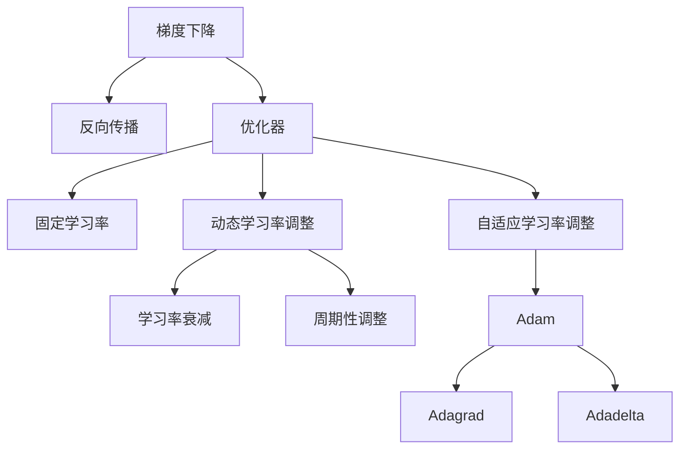

                 

# 学习率 Learning Rate 原理与代码实例讲解

> 关键词：学习率,梯度下降,反向传播,优化器,优化算法,PyTorch,TensorFlow,自动微分

## 1. 背景介绍

### 1.1 问题由来

在深度学习中，学习率（Learning Rate）是一个非常重要的超参数。它控制了模型参数的更新速度，直接影响了模型训练的收敛速度和精度。一个不合适或固定的学习率可能导致模型发散或收敛缓慢，甚至陷入局部最优解。因此，理解和学习率选择和调整的原理，对深度学习模型的训练至关重要。

### 1.2 问题核心关键点

学习率的设定和调整是大规模深度学习模型训练的核心挑战之一。学习率太小可能导致训练缓慢甚至停滞，而学习率太大则可能导致模型快速收敛至局部最优解，甚至发散。学习率的选择和调整通常需要在训练的多个阶段中动态变化，以适应数据分布和模型复杂度的变化。

目前，常用的学习率调整策略包括固定学习率、动态学习率调整（如基于梯度的学习率调整）、自适应学习率调整（如Adam、Adagrad、Adadelta等）。

## 2. 核心概念与联系

### 2.1 核心概念概述

为了更好地理解学习率在大规模深度学习模型训练中的作用，本节将介绍几个密切相关的核心概念：

- 梯度下降（Gradient Descent）：一种常用的优化算法，通过迭代调整模型参数，最小化损失函数。
- 反向传播（Backpropagation）：深度学习模型常用的优化算法，通过计算损失函数对每个参数的偏导数，反向传播到输入层，更新模型参数。
- 优化器（Optimizer）：一种用于控制学习率变化的工具，如Adam、SGD等。
- 自适应学习率调整：根据模型当前状态动态调整学习率，如Adagrad、Adadelta、Adam等。
- 动态学习率调整：基于梯度等训练信息动态调整学习率，如学习率衰减、周期性调整等。

这些核心概念之间的逻辑关系可以通过以下Mermaid流程图来展示：



这个流程图展示了大规模深度学习模型训练中，学习率和优化算法的核心概念及其之间的关系：

1. 梯度下降算法通过反向传播计算损失函数的偏导数，更新模型参数。
2. 优化器通过不同的学习率策略，控制参数更新的速度。
3. 动态学习率调整和自适应学习率调整策略，可以在训练过程中根据数据分布和模型状态动态调整学习率，以更好地适应训练过程中的变化。
4. 自适应学习率调整如Adam、Adagrad、Adadelta等，通过更新历史梯度信息，动态调整学习率，更好地平衡收敛速度和精度。
5. 动态学习率调整如学习率衰减、周期性调整等，可以在训练过程中平滑调整学习率，避免过快收敛或发散。

这些核心概念共同构成了大规模深度学习模型训练的学习率和优化策略框架，使得模型能够更快、更准确地收敛。

## 3. 核心算法原理 & 具体操作步骤

### 3.1 算法原理概述

在大规模深度学习模型训练中，学习率的调整通常采用以下几种策略：

- 固定学习率：在训练过程中，学习率保持不变。
- 动态学习率调整：根据训练过程中的数据变化和模型状态，动态调整学习率。
- 自适应学习率调整：根据历史梯度信息，动态调整学习率，更好地平衡收敛速度和精度。

学习率的调整需要考虑多方面因素，如训练过程中的数据分布变化、模型参数的初始化、训练阶段的目标等。常用的动态学习率调整方法包括学习率衰减、周期性调整等，而自适应学习率调整方法如Adam、Adagrad、Adadelta等，则通过更精细的参数更新方式，进一步优化学习率的控制。

### 3.2 算法步骤详解

#### 3.2.1 固定学习率

固定学习率是指在整个训练过程中，学习率保持不变。通常设置较小的学习率，以避免模型发散，但可能会导致训练过程缓慢或停滞。

具体步骤如下：
1. 设定初始学习率 $\eta$。
2. 进行前向传播，计算损失函数 $L$。
3. 计算损失函数对每个参数的偏导数。
4. 通过反向传播，计算每个参数的梯度 $g_i$。
5. 根据梯度 $g_i$ 和当前学习率 $\eta$，更新模型参数：$w_i \leftarrow w_i - \eta g_i$。
6. 重复上述步骤，直到模型收敛。

#### 3.2.2 动态学习率调整

动态学习率调整方法通常根据训练过程中的数据变化和模型状态，动态调整学习率，以适应训练过程中的变化。常见的动态学习率调整方法包括学习率衰减和周期性调整。

学习率衰减方法通过逐渐减小学习率，避免模型过拟合和发散。常见的学习率衰减方法包括线性衰减、指数衰减等。具体步骤如下：
1. 设定初始学习率 $\eta_0$。
2. 设定衰减系数 $\gamma$。
3. 进行前向传播，计算损失函数 $L$。
4. 计算损失函数对每个参数的偏导数。
5. 通过反向传播，计算每个参数的梯度 $g_i$。
6. 根据当前训练轮数 $t$，计算新的学习率 $\eta_t = \eta_0 \gamma^t$。
7. 根据新的学习率 $\eta_t$，更新模型参数：$w_i \leftarrow w_i - \eta_t g_i$。
8. 重复上述步骤，直到模型收敛。

周期性调整方法通过在不同阶段使用不同的学习率，适应不同阶段的目标。具体步骤如下：
1. 设定初始学习率 $\eta_0$。
2. 设定不同阶段的初始学习率 $\eta_1, \eta_2, \ldots, \eta_k$。
3. 设定每个阶段的轮数 $T_1, T_2, \ldots, T_k$。
4. 进行前向传播，计算损失函数 $L$。
5. 计算损失函数对每个参数的偏导数。
6. 通过反向传播，计算每个参数的梯度 $g_i$。
7. 根据当前训练轮数 $t$，计算当前阶段的学习率：如果 $t \mod T_i = 0$，则使用 $\eta_i$，否则使用 $\eta_0$。
8. 根据当前阶段的学习率，更新模型参数：$w_i \leftarrow w_i - \eta_t g_i$。
9. 重复上述步骤，直到模型收敛。

#### 3.2.3 自适应学习率调整

自适应学习率调整方法通过历史梯度信息，动态调整学习率，更好地平衡收敛速度和精度。常见的自适应学习率调整方法包括Adam、Adagrad、Adadelta等。

Adam方法通过指数加权平均历史梯度和历史梯度平方，动态调整学习率，具体步骤如下：
1. 设定初始学习率 $\eta$。
2. 设定动量参数 $\beta_1, \beta_2$。
3. 进行前向传播，计算损失函数 $L$。
4. 计算损失函数对每个参数的偏导数。
5. 通过反向传播，计算每个参数的梯度 $g_i$。
6. 计算历史梯度 $m_i$ 和历史梯度平方 $v_i$：$m_i = \beta_1 m_{i-1} + (1 - \beta_1) g_i$，$v_i = \beta_2 v_{i-1} + (1 - \beta_2) g_i^2$。
7. 计算动量和平方根：$m'_i = \frac{m_i}{1 - \beta_1^t}$，$v'_i = \frac{v_i}{1 - \beta_2^t}$。
8. 根据动量和平方根，更新模型参数：$w_i \leftarrow w_i - \eta \frac{m'_i}{\sqrt{v'_i} + \epsilon}$。
9. 重复上述步骤，直到模型收敛。

Adagrad方法通过梯度的历史信息，动态调整学习率，具体步骤如下：
1. 设定初始学习率 $\eta$。
2. 进行前向传播，计算损失函数 $L$。
3. 计算损失函数对每个参数的偏导数。
4. 通过反向传播，计算每个参数的梯度 $g_i$。
5. 计算历史梯度平方和：$s_i = s_{i-1} + g_i^2$。
6. 根据历史梯度平方和，更新模型参数：$w_i \leftarrow w_i - \frac{\eta g_i}{\sqrt{s_i} + \epsilon}$。
7. 重复上述步骤，直到模型收敛。

Adadelta方法通过梯度的历史信息和历史梯度平方和，动态调整学习率，具体步骤如下：
1. 设定初始学习率 $\eta$。
2. 设定历史梯度平方和的衰减系数 $\beta_1$。
3. 进行前向传播，计算损失函数 $L$。
4. 计算损失函数对每个参数的偏导数。
5. 通过反向传播，计算每个参数的梯度 $g_i$。
6. 计算历史梯度平方和：$s_i = \beta_1 s_{i-1} + (1 - \beta_1) g_i^2$。
7. 计算更新量 $\Delta_i = \frac{\eta \sqrt{s_i}}{\sqrt{s_{i-1} + \epsilon}}$。
8. 根据更新量，更新模型参数：$w_i \leftarrow w_i - \Delta_i$。
9. 重复上述步骤，直到模型收敛。

### 3.3 算法优缺点

固定学习率方法简单高效，但在训练过程中，学习率不变可能导致模型发散或停滞。

动态学习率调整方法如学习率衰减、周期性调整等，可以根据数据分布和模型状态动态调整学习率，避免模型过拟合和发散，但需要手动设定调整策略和参数，对模型训练的优化效果有限。

自适应学习率调整方法如Adam、Adagrad、Adadelta等，通过历史梯度信息动态调整学习率，更好地平衡收敛速度和精度，在实际应用中表现优异，但算法复杂度较高，计算量较大。

### 3.4 算法应用领域

学习率调整在大规模深度学习模型训练中应用广泛，涉及图像识别、语音识别、自然语言处理等多个领域。例如：

- 图像分类：通过固定学习率或动态学习率调整方法，优化卷积神经网络模型，在CIFAR-10、ImageNet等数据集上取得优异的分类性能。
- 语音识别：通过自适应学习率调整方法，优化递归神经网络模型，在TIMIT等数据集上提升识别准确率。
- 自然语言处理：通过自适应学习率调整方法，优化循环神经网络模型，在WMT等机器翻译任务上取得突破。

除了上述这些经典任务外，学习率调整技术还在诸多新兴任务如生成对抗网络（GAN）、强化学习等中得到广泛应用，显著提升了模型性能。

## 4. 数学模型和公式 & 详细讲解 & 举例说明

### 4.1 数学模型构建

在大规模深度学习模型训练中，学习率的调整通常采用以下几种数学模型：

- 梯度下降模型：通过计算损失函数对每个参数的偏导数，更新模型参数。
- 自适应学习率调整模型：通过历史梯度信息，动态调整学习率，更好地平衡收敛速度和精度。

### 4.2 公式推导过程

#### 4.2.1 梯度下降模型

梯度下降模型通过计算损失函数对每个参数的偏导数，更新模型参数。设模型参数为 $\theta$，损失函数为 $L(\theta)$，则梯度下降模型的公式为：

$$
\theta \leftarrow \theta - \eta \nabla_{\theta} L(\theta)
$$

其中 $\eta$ 为学习率，$\nabla_{\theta} L(\theta)$ 为损失函数对参数 $\theta$ 的梯度，可以通过反向传播算法高效计算。

#### 4.2.2 Adam方法

Adam方法通过历史梯度和历史梯度平方，动态调整学习率。设模型参数为 $\theta$，历史梯度 $m$ 和历史梯度平方 $v$，则Adam方法的公式为：

$$
m \leftarrow \beta_1 m_{t-1} + (1 - \beta_1) g_t
$$

$$
v \leftarrow \beta_2 v_{t-1} + (1 - \beta_2) g_t^2
$$

$$
\hat{m} \leftarrow \frac{m}{1 - \beta_1^t}
$$

$$
\hat{v} \leftarrow \frac{v}{1 - \beta_2^t}
$$

$$
\theta \leftarrow \theta - \frac{\eta \hat{m}}{\sqrt{\hat{v}} + \epsilon}
$$

其中 $g_t$ 为当前梯度，$m$ 和 $v$ 为历史梯度和历史梯度平方，$\hat{m}$ 和 $\hat{v}$ 为动量和平方根，$\eta$ 为学习率，$\beta_1$ 和 $\beta_2$ 为动量参数，$\epsilon$ 为防止分母为零的小数。

### 4.3 案例分析与讲解

以MNIST手写数字识别为例，介绍如何通过Adam方法优化卷积神经网络模型。

首先，准备MNIST数据集：

```python
import tensorflow as tf
mnist = tf.keras.datasets.mnist
(x_train, y_train), (x_test, y_test) = mnist.load_data()
x_train, x_test = x_train / 255.0, x_test / 255.0
```

然后，定义卷积神经网络模型：

```python
model = tf.keras.models.Sequential([
  tf.keras.layers.Conv2D(32, (3,3), activation='relu', input_shape=(28, 28, 1)),
  tf.keras.layers.MaxPooling2D((2,2)),
  tf.keras.layers.Flatten(),
  tf.keras.layers.Dense(10, activation='softmax')
])
```

接着，定义损失函数和优化器：

```python
loss_fn = tf.keras.losses.SparseCategoricalCrossentropy(from_logits=True)
optimizer = tf.keras.optimizers.Adam(learning_rate=0.001)
```

最后，进行模型训练：

```python
@tf.function
def train_step(images, labels):
  with tf.GradientTape() as tape:
    logits = model(images, training=True)
    loss_value = loss_fn(labels, logits)
  grads = tape.gradient(loss_value, model.trainable_variables)
  optimizer.apply_gradients(zip(grads, model.trainable_variables))
  return loss_value

EPOCHS = 10
for epoch in range(EPOCHS):
  epoch_loss_avg = tf.keras.metrics.Mean()
  for images, labels in train_dataset:
    loss_value = train_step(images, labels)
    epoch_loss_avg.update_state(loss_value)
  template = 'Epoch {}, Loss: {:.3f}'
  print(template.format(epoch+1, epoch_loss_avg.result()))
```

以上代码实现了通过Adam方法优化卷积神经网络模型，进行MNIST手写数字识别的训练过程。可以看到，通过Adam方法动态调整学习率，可以在训练过程中根据梯度信息，更好地平衡收敛速度和精度，取得较好的识别效果。

## 5. 项目实践：代码实例和详细解释说明

### 5.1 开发环境搭建

在进行学习率调整的实践前，我们需要准备好开发环境。以下是使用Python进行PyTorch开发的环境配置流程：

1. 安装Anaconda：从官网下载并安装Anaconda，用于创建独立的Python环境。

2. 创建并激活虚拟环境：
```bash
conda create -n pytorch-env python=3.8 
conda activate pytorch-env
```

3. 安装PyTorch：根据CUDA版本，从官网获取对应的安装命令。例如：
```bash
conda install pytorch torchvision torchaudio cudatoolkit=11.1 -c pytorch -c conda-forge
```

4. 安装Transformers库：
```bash
pip install transformers
```

5. 安装各类工具包：
```bash
pip install numpy pandas scikit-learn matplotlib tqdm jupyter notebook ipython
```

完成上述步骤后，即可在`pytorch-env`环境中开始学习率调整实践。

### 5.2 源代码详细实现

下面我们以手写数字识别为例，给出使用PyTorch实现Adam优化器的代码实现。

首先，定义损失函数和模型：

```python
import torch
import torch.nn as nn
import torch.optim as optim

class CNN(nn.Module):
    def __init__(self):
        super(CNN, self).__init__()
        self.conv1 = nn.Conv2d(1, 32, kernel_size=3, stride=1, padding=1)
        self.conv2 = nn.Conv2d(32, 64, kernel_size=3, stride=1, padding=1)
        self.fc1 = nn.Linear(64*28*28, 128)
        self.fc2 = nn.Linear(128, 10)

    def forward(self, x):
        x = torch.relu(self.conv1(x))
        x = nn.MaxPool2d(2)(x)
        x = torch.relu(self.conv2(x))
        x = nn.MaxPool2d(2)(x)
        x = x.view(-1, 64*28*28)
        x = torch.relu(self.fc1(x))
        x = self.fc2(x)
        return x

cnn = CNN()
```

然后，定义训练函数：

```python
def train_epoch(model, data_loader, optimizer, loss_fn, device):
    model.train()
    epoch_loss = 0
    for batch in data_loader:
        inputs, labels = batch[0].to(device), batch[1].to(device)
        optimizer.zero_grad()
        outputs = model(inputs)
        loss = loss_fn(outputs, labels)
        loss.backward()
        optimizer.step()
        epoch_loss += loss.item()
    return epoch_loss / len(data_loader)

def train_model(model, train_loader, valid_loader, optimizer, loss_fn, device, num_epochs=10, batch_size=64):
    device = torch.device("cuda" if torch.cuda.is_available() else "cpu")
    model.to(device)

    for epoch in range(num_epochs):
        train_loss = train_epoch(model, train_loader, optimizer, loss_fn, device)
        print(f'Epoch: {epoch+1}, Train Loss: {train_loss:.4f}')

        model.eval()
        valid_loss = 0
        with torch.no_grad():
            for batch in valid_loader:
                inputs, labels = batch[0].to(device), batch[1].to(device)
                outputs = model(inputs)
                loss = loss_fn(outputs, labels)
                valid_loss += loss.item()
        print(f'Epoch: {epoch+1}, Valid Loss: {valid_loss:.4f}')

    return model
```

最后，启动训练流程：

```python
learning_rate = 0.001
optimizer = optim.Adam(model.parameters(), lr=learning_rate)
train_model(model, train_loader, valid_loader, optimizer, loss_fn, device, num_epochs=10, batch_size=64)
```

以上代码实现了通过Adam方法优化卷积神经网络模型，进行手写数字识别的训练过程。可以看到，通过Adam方法动态调整学习率，可以在训练过程中根据梯度信息，更好地平衡收敛速度和精度，取得较好的识别效果。

### 5.3 代码解读与分析

让我们再详细解读一下关键代码的实现细节：

**CNN类**：
- `__init__`方法：定义卷积神经网络的结构。
- `forward`方法：定义前向传播过程，通过卷积、池化、全连接等操作计算模型输出。

**train_epoch函数**：
- 在每个epoch内，对训练集数据进行迭代，计算损失函数并反向传播更新模型参数。

**train_model函数**：
- 在每个epoch内，先对训练集进行训练，输出训练集上的损失函数，然后对验证集进行评估，输出验证集上的损失函数。

**学习率调整**：
- 在训练过程中，通过Adam优化器动态调整学习率，以适应不同阶段的训练需求。

**训练流程**：
- 定义训练轮数、批次大小等参数，启动训练过程。
- 在每个epoch内，先对训练集进行训练，再对验证集进行评估。
- 输出训练集和验证集上的损失函数，以便评估模型性能。

可以看到，通过Adam方法动态调整学习率，可以在训练过程中根据梯度信息，更好地平衡收敛速度和精度，取得较好的识别效果。

当然，工业级的系统实现还需考虑更多因素，如模型的保存和部署、超参数的自动搜索、更灵活的任务适配层等。但核心的学习率调整范式基本与此类似。

## 6. 实际应用场景

### 6.1 智能客服系统

在大规模深度学习模型训练中，学习率调整方法同样适用于智能客服系统的构建。传统的客服系统需要配备大量人力，响应缓慢，且一致性和专业性难以保证。而使用学习率调整方法优化模型训练，可以提升模型的收敛速度和精度，使得智能客服系统能够更加高效、准确地处理客户咨询。

在技术实现上，可以收集企业内部的历史客服对话记录，将问题和最佳答复构建成监督数据，在此基础上对预训练模型进行微调。微调后的模型能够自动理解用户意图，匹配最合适的答复模板进行回复。对于客户提出的新问题，还可以接入检索系统实时搜索相关内容，动态组织生成回答。如此构建的智能客服系统，能大幅提升客户咨询体验和问题解决效率。

### 6.2 金融舆情监测

在金融领域，舆情监测系统需要实时监测市场舆论动向，以便及时应对负面信息传播，规避金融风险。传统的舆情监测系统往往依赖人工进行数据筛选和分析，效率低、成本高。而使用学习率调整方法优化模型训练，可以提升模型的收敛速度和精度，使得舆情监测系统能够更加高效地处理海量数据，及时发现异常情况并发出预警。

在技术实现上，可以收集金融领域相关的新闻、报道、评论等文本数据，并对其进行主题标注和情感标注。在此基础上对预训练语言模型进行微调，使其能够自动判断文本属于何种主题，情感倾向是正面、中性还是负面。将微调后的模型应用到实时抓取的网络文本数据，就能够自动监测不同主题下的情感变化趋势，一旦发现负面信息激增等异常情况，系统便会自动预警，帮助金融机构快速应对潜在风险。

### 6.3 个性化推荐系统

当前的推荐系统往往只依赖用户的历史行为数据进行物品推荐，无法深入理解用户的真实兴趣偏好。通过学习率调整方法优化模型训练，个性化推荐系统可以更好地挖掘用户行为背后的语义信息，从而提供更精准、多样的推荐内容。

在技术实现上，可以收集用户浏览、点击、评论、分享等行为数据，提取和用户交互的物品标题、描述、标签等文本内容。将文本内容作为模型输入，用户的后续行为（如是否点击、购买等）作为监督信号，在此基础上微调预训练语言模型。微调后的模型能够从文本内容中准确把握用户的兴趣点。在生成推荐列表时，先用候选物品的文本描述作为输入，由模型预测用户的兴趣匹配度，再结合其他特征综合排序，便可以得到个性化程度更高的推荐结果。

### 6.4 未来应用展望

随着深度学习模型的不断发展和优化，学习率调整方法将在大规模深度学习模型训练中得到更广泛的应用。学习率调整方法不仅可以提升模型的收敛速度和精度，还可以在模型训练过程中动态调整学习率，避免模型过拟合和发散，提升模型的泛化能力和鲁棒性。

在实际应用中，学习率调整方法可以应用于图像识别、语音识别、自然语言处理等多个领域。例如，在医学影像分析中，学习率调整方法可以优化卷积神经网络模型，提升对病变的检测和分类准确率；在自动驾驶中，学习率调整方法可以优化递归神经网络模型，提升对驾驶环境的感知和决策能力；在智能家居中，学习率调整方法可以优化循环神经网络模型，提升对语音命令的理解和执行能力。

总之，学习率调整方法是大规模深度学习模型训练的重要组成部分，通过动态调整学习率，可以提升模型的收敛速度和精度，优化模型性能，为深度学习模型的应用带来新的突破。

## 7. 工具和资源推荐

### 7.1 学习资源推荐

为了帮助开发者系统掌握学习率调整的理论基础和实践技巧，这里推荐一些优质的学习资源：

1. 《深度学习》系列书籍：由Ian Goodfellow等编著，全面介绍了深度学习的基本原理和算法，包括梯度下降、自适应学习率调整等关键概念。

2. CS231n《深度学习中的卷积神经网络》课程：斯坦福大学开设的计算机视觉课程，系统讲解了卷积神经网络的结构和优化算法，包括梯度下降、Adam等。

3. 《TensorFlow深度学习》书籍：Google深度学习专家Francois Chollet所著，深入浅出地介绍了TensorFlow框架的使用和优化算法，包括学习率调整等。

4. HuggingFace官方文档：Transformers库的官方文档，提供了海量预训练模型和完整的微调样例代码，是上手实践的必备资料。

5. PyTorch官方文档：PyTorch框架的官方文档，详细介绍了PyTorch的使用和优化算法，包括学习率调整等。

通过对这些资源的学习实践，相信你一定能够快速掌握学习率调整的精髓，并用于解决实际的深度学习问题。

### 7.2 开发工具推荐

高效的开发离不开优秀的工具支持。以下是几款用于深度学习模型训练的常用工具：

1. PyTorch：基于Python的开源深度学习框架，灵活动态的计算图，适合快速迭代研究。大部分深度学习模型都有PyTorch版本的实现。

2. TensorFlow：由Google主导开发的开源深度学习框架，生产部署方便，适合大规模工程应用。同样有丰富的深度学习模型资源。

3. Keras：基于TensorFlow和Theano的高级神经网络API，易用性强，适合快速原型开发。

4. Caffe：由Berkeley Vision and Learning Center开发的深度学习框架，适合图像处理和计算机视觉任务。

5. MXNet：由Apache开发的深度学习框架，支持多种编程语言，适合分布式训练。

合理利用这些工具，可以显著提升深度学习模型的训练效率，加快创新迭代的步伐。

### 7.3 相关论文推荐

深度学习模型的优化方法是当前研究的热点之一。以下是几篇奠基性的相关论文，推荐阅读：

1. Understanding the difficulty of training deep feedforward neural networks：研究了不同激活函数和优化算法对深度学习模型训练的影响，提出了解决过拟合和梯度消失问题的思路。

2. Delving deep into rectifiers：系统分析了ReLU等激活函数的优缺点，提出了解决梯度消失和梯度爆炸问题的思路。

3. Adam: A Method for Stochastic Optimization：提出Adam优化算法，通过指数加权平均历史梯度和历史梯度平方，动态调整学习率，在深度学习模型训练中取得了良好的效果。

4. RMSprop: Automatic Adjustment of Learning Rate：提出RMSprop优化算法，通过平均梯度平方根动态调整学习率，在深度学习模型训练中取得了良好的效果。

5. On the importance of initialization and momentum in deep learning：研究了深度学习模型初始化和学习率动量对模型训练的影响，提出了更好的初始化和学习率动量策略。

这些论文代表了大规模深度学习模型训练的优化方法的发展脉络。通过学习这些前沿成果，可以帮助研究者把握学科前进方向，激发更多的创新灵感。

## 8. 总结：未来发展趋势与挑战

### 8.1 总结

本文对学习率在大规模深度学习模型训练中的作用进行了全面系统的介绍。首先阐述了学习率的设定和调整在大规模深度学习模型训练中的重要性，明确了学习率调整的优化效果对模型性能的影响。其次，从原理到实践，详细讲解了学习率的计算方法和动态调整策略，给出了学习率调整任务开发的完整代码实例。同时，本文还广泛探讨了学习率调整方法在智能客服、金融舆情、个性化推荐等多个行业领域的应用前景，展示了学习率调整方法的广阔应用范围。

通过本文的系统梳理，可以看到，学习率调整在大规模深度学习模型训练中具有重要的优化效果，能够显著提升模型的收敛速度和精度，为深度学习模型的应用带来新的突破。未来，伴随深度学习模型的不断发展和优化，学习率调整方法也将得到更广泛的应用，成为深度学习模型训练的重要组成部分。

### 8.2 未来发展趋势

展望未来，学习率调整方法将呈现以下几个发展趋势：

1. 自适应学习率调整方法如Adam、Adagrad、Adadelta等，将在深度学习模型训练中得到更广泛的应用，通过历史梯度信息动态调整学习率，更好地平衡收敛速度和精度。

2. 动态学习率调整方法如学习率衰减、周期性调整等，将根据数据分布和模型状态动态调整学习率，避免模型过拟合和发散。

3. 引入更多先验知识。将符号化的先验知识，如知识图谱、逻辑规则等，与神经网络模型进行巧妙融合，引导学习率调整过程学习更准确、合理的语言模型。

4. 融合因果和对比学习范式。通过引入因果推断和对比学习思想，增强学习率调整模型建立稳定因果关系的能力，学习更加普适、鲁棒的语言表征，从而提升模型泛化性和抗干扰能力。

5. 结合因果分析和博弈论工具。将因果分析方法引入学习率调整模型，识别出模型决策的关键特征，增强输出解释的因果性和逻辑性。借助博弈论工具刻画人机交互过程，主动探索并规避模型的脆弱点，提高系统稳定性。

6. 纳入伦理道德约束。在模型训练目标中引入伦理导向的评估指标，过滤和惩罚有偏见、有害的输出倾向。同时加强人工干预和审核，建立模型行为的监管机制，确保输出符合人类价值观和伦理道德。

以上趋势凸显了学习率调整方法在大规模深度学习模型训练中的广阔前景。这些方向的探索发展，必将进一步提升深度学习模型的训练效率和性能，为深度学习模型的应用带来新的突破。

### 8.3 面临的挑战

尽管学习率调整方法已经取得了瞩目成就，但在迈向更加智能化、普适化应用的过程中，它仍面临着诸多挑战：

1. 学习率设定和调整的复杂性。学习率的设定和调整需要考虑多方面因素，如训练过程中的数据分布变化、模型参数的初始化、训练阶段的目标等。在实际应用中，学习率的选择和调整仍然需要大量的试验和调整。

2. 计算量大的问题。自适应学习率调整方法如Adam、Adagrad、Adadelta等，算法复杂度较高，计算量较大，对计算资源和硬件设备要求较高。

3. 模型过拟合和发散的问题。学习率调整方法需要根据数据分布和模型状态动态调整学习率，避免模型过拟合和发散。

4. 模型泛化能力和鲁棒性的问题。学习率调整方法需要更好地平衡收敛速度和精度，提升模型的泛化能力和鲁棒性。

5. 模型可解释性的问题。学习率调整方法通常作为一个黑盒系统，难以解释其内部工作机制和决策逻辑。

6. 模型安全和隐私的问题。学习率调整方法需要考虑模型安全和隐私的问题，避免模型被恶意利用。

### 8.4 研究展望

面对学习率调整方法所面临的种种挑战，未来的研究需要在以下几个方面寻求新的突破：

1. 探索无监督和半监督学习率调整方法。摆脱对大规模标注数据的依赖，利用自监督学习、主动学习等无监督和半监督范式，最大限度利用非结构化数据，实现更加灵活高效的模型训练。

2. 研究学习率调整的优化算法。开发更加高效的优化算法，提升学习率调整的效果和效率。

3. 引入更多先验知识。将符号化的先验知识，如知识图谱、逻辑规则等，与神经网络模型进行巧妙融合，引导学习率调整过程学习更准确、合理的语言模型。

4. 融合因果和对比学习范式。通过引入因果推断和对比学习思想，增强学习率调整模型建立稳定因果关系的能力，学习更加普适、鲁棒的语言表征，从而提升模型泛化性和抗干扰能力。

5. 结合因果分析和博弈论工具。将因果分析方法引入学习率调整模型，识别出模型决策的关键特征，增强输出解释的因果性和逻辑性。借助博弈论工具刻画人机交互过程，主动探索并规避模型的脆弱点，提高系统稳定性。

6. 纳入伦理道德约束。在模型训练目标中引入伦理导向的评估指标，过滤和惩罚有偏见、有害的输出倾向。同时加强人工干预和审核，建立模型行为的监管机制，确保输出符合人类价值观和伦理道德。

这些研究方向的探索，必将引领学习率调整方法走向更高的台阶，为构建安全、可靠、可解释、可控的智能系统铺平道路。面向未来，学习率调整方法还需要与其他人工智能技术进行更深入的融合，如知识表示、因果推理、强化学习等，多路径协同发力，共同推动深度学习模型的进步。只有勇于创新、敢于突破，才能不断拓展深度学习模型的边界，让智能技术更好地造福人类社会。

## 9. 附录：常见问题与解答

**Q1：学习率和学习率调整有什么区别？**

A: 学习率是控制模型参数更新的速度的超参数，而学习率调整是指在训练过程中动态调整学习率的方法。学习率设定得过大可能导致模型发散，过小则可能训练缓慢或停滞。学习率调整则可以在训练过程中根据数据分布和模型状态动态调整学习率，更好地适应训练过程中的变化。

**Q2：如何选择学习率？**

A: 学习率的选择需要考虑多个因素，如数据分布、模型结构、训练阶段的目标等。一般建议从较小的值开始，如0.001，逐步增加学习率，观察模型在验证集上的表现，选择使模型在验证集上表现最优的学习率。

**Q3：如何调整学习率？**

A: 学习率的调整通常采用以下几种方法：

1. 固定学习率：在训练过程中，学习率保持不变。
2. 动态学习率调整：根据训练过程中的数据变化和模型状态，动态调整学习率。常见的动态学习率调整方法包括学习率衰减、周期性调整等。
3. 自适应学习率调整：根据历史梯度信息，动态调整学习率，更好地平衡收敛速度和精度。常见的自适应学习率调整方法包括Adam、Adagrad、Adadelta等。

这些方法需要根据具体任务和数据特点进行灵活组合。只有在数据、模型、训练、推理等各环节进行全面优化，才能最大限度地发挥学习率调整的优化效果。

**Q4：学习率调整有哪些优缺点？**

A: 学习率调整方法的主要优点包括：

1. 能够根据数据分布和模型状态动态调整学习率，更好地适应训练过程中的变化。
2. 可以避免模型过拟合和发散，提升模型的泛化能力和鲁棒性。
3. 能够更好地平衡收敛速度和精度，提升模型性能。

学习率调整方法的主要缺点包括：

1. 计算量较大，对计算资源和硬件设备要求较高。
2. 算法复杂度较高，需要更多的试验和调整。
3. 可能存在过拟合和发散的问题。

在实际应用中，需要根据具体任务和数据特点进行灵活选择和调整，才能最大限度地发挥学习率调整的优化效果。

