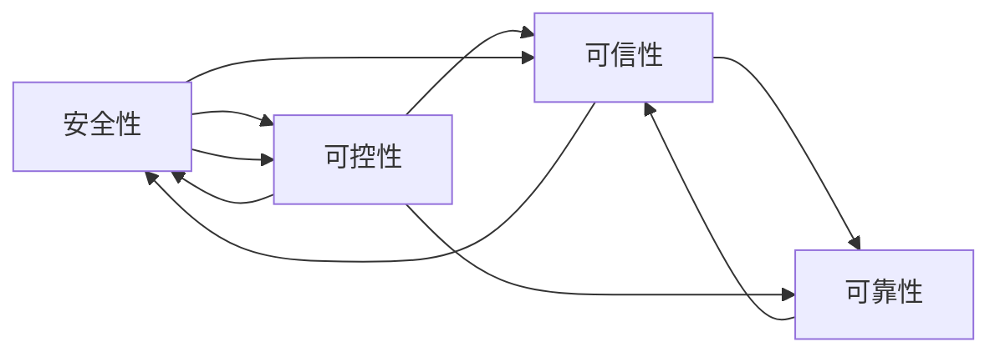

                 

# 安全、可控、可信、可靠的AI技术

## 1. 背景介绍

人工智能（AI）技术的迅猛发展正深刻改变着人类的生产生活方式，从自动驾驶到智能医疗，从智慧城市到人机交互，AI的广泛应用正在重塑世界的面貌。然而，AI技术的双刃剑效应也日益显现，数据泄露、模型偏见、误判误导等问题不断浮出水面，给社会的公平正义和安全稳定带来重大挑战。在此背景下，构建安全、可控、可信、可靠的AI技术，成为当前AI研究和应用的重要方向。

本文将系统阐述构建安全、可控、可信、可靠的AI技术的核心概念、关键算法、实际应用及未来趋势，旨在为AI技术的健康发展提供清晰的指导和实用的参考。

## 2. 核心概念与联系

### 2.1 核心概念概述

- **安全（Security）**：指AI系统在运行过程中，能够抵御各种攻击和故障，确保系统稳定性和数据安全。
- **可控（Controllability）**：指AI系统具有可解释性、可解释性，用户能够理解和控制AI的决策过程和行为。
- **可信（Trustworthiness）**：指AI系统输出结果可靠，具备透明性、公正性和准确性，能够得到用户和社会的信任。
- **可靠（Reliability）**：指AI系统在各种环境下，能够持续、稳定地运行，具备鲁棒性和容错性。

这四个概念构成了构建安全、可控、可信、可靠的AI技术的基石，相互关联、相互支撑。只有在安全的基础上，才能实现系统的可控和可信；只有在系统的可控和可信前提下，才能保证其可靠性。

### 2.2 核心概念原理和架构的 Mermaid 流程图



## 3. 核心算法原理 & 具体操作步骤

### 3.1 算法原理概述

构建安全、可控、可信、可靠的AI技术，需要从数据、模型、算法、系统等多个维度进行全面优化。以下介绍几个关键算法原理。

**3.1.1 数据安全与隐私保护**

数据安全与隐私保护是构建可靠AI的基础。数据泄露、隐私侵害等问题会导致AI系统的不可靠性，从而影响其可信度和安全性。常见的数据保护技术包括数据加密、差分隐私、联邦学习等。

- **数据加密**：使用加密算法对敏感数据进行加密处理，防止数据在传输和存储过程中被非法获取和篡改。
- **差分隐私**：在数据分析和训练过程中加入噪声，使得攻击者无法反向推断出原始数据信息，从而保护数据隐私。
- **联邦学习**：多个数据所有者在不共享原始数据的情况下，通过分布式协作训练模型，保护数据隐私的同时实现模型性能提升。

**3.1.2 模型鲁棒性与泛化能力**

模型的鲁棒性和泛化能力是确保AI系统可靠性的关键。鲁棒性指的是模型对输入数据的微小扰动具有较强的抵抗能力，避免因噪声、对抗样本等问题导致模型失效。泛化能力则指模型能够在新数据集上保持相似的性能，避免过拟合。

- **对抗样本防御**：通过加入对抗样本训练、梯度裁剪等技术，增强模型对对抗样本的抵抗能力。
- **模型正则化**：引入L1、L2正则、Dropout等技术，防止模型过拟合，提升模型的泛化能力。
- **自适应训练**：采用自适应学习率调整、模型蒸馏等技术，使模型能够更好地适应新数据分布。

**3.1.3 可解释性与透明性**

可解释性和透明性是实现AI系统可控性的重要手段。AI系统的决策过程需要用户能够理解和控制，才能保证其可控性和可信性。

- **可解释性技术**：包括但不限于特征可视化、决策树、LIME、SHAP等，帮助用户理解AI模型的决策过程。
- **透明性机制**：通过建立完善的审计和监控机制，实时监控AI系统的运行状态，确保其行为符合预期。

### 3.2 算法步骤详解

构建安全、可控、可信、可靠的AI技术，需要经历以下几个关键步骤：

**Step 1: 数据收集与预处理**

- 收集多样化、高质量的数据，并进行清洗、标注等预处理，确保数据集的质量。
- 对敏感数据进行加密和差分隐私处理，保障数据安全。

**Step 2: 模型设计与训练**

- 选择合适的模型架构和优化算法，如深度神经网络、Transformer等。
- 采用对抗样本防御、正则化等技术提升模型鲁棒性和泛化能力。
- 在训练过程中加入差分隐私和联邦学习技术，保护数据隐私。

**Step 3: 模型评估与验证**

- 在验证集上评估模型的性能指标，如准确率、召回率、F1分数等。
- 使用可解释性技术对模型进行可视化分析，确保模型的透明性和可控性。
- 通过实时监控机制，确保模型的行为符合预期，保障系统的可靠性。

**Step 4: 模型部署与应用**

- 将训练好的模型部署到生产环境中，进行实时推理和应用。
- 定期收集用户反馈和监控数据，进行模型复训和优化。
- 建立完善的故障恢复和应急预案，确保系统的稳定性和可靠性。

### 3.3 算法优缺点

构建安全、可控、可信、可靠的AI技术，具有以下优点：

- **提高安全性**：通过数据加密、差分隐私等技术，有效保护数据安全，防止数据泄露和隐私侵害。
- **增强可控性**：通过可解释性和透明性机制，使得用户能够理解和控制AI系统的决策过程。
- **提升可信性**：通过鲁棒性、泛化能力等技术，确保AI系统输出结果的可靠性和公正性。
- **确保可靠性**：通过模型正则化、自适应训练等技术，提升模型的鲁棒性和容错性。

但同时，构建这样的AI技术也面临以下挑战：

- **技术复杂度高**：需要同时考虑数据安全、模型鲁棒性、可解释性等多个维度，技术难度较大。
- **计算资源需求大**：如联邦学习等技术需要分布式计算资源，对计算能力要求较高。
- **实时性要求高**：如实时监控、故障恢复等机制需要高效的实时处理能力。

### 3.4 算法应用领域

基于以上算法原理，安全、可控、可信、可靠的AI技术在多个领域得到了广泛应用：

- **金融领域**：通过差分隐私和联邦学习技术，保护客户数据隐私，防止模型过拟合，提升金融风险评估的可靠性。
- **医疗领域**：采用对抗样本防御和正则化技术，确保医疗诊断的准确性和鲁棒性，提升模型的可信性。
- **智能制造**：通过实时监控和故障恢复机制，保障生产线的稳定性和可靠性，提升生产效率和质量。
- **智慧城市**：通过数据加密和联邦学习技术，保护市民隐私，提升城市管理的透明性和可信性。
- **公共安全**：通过可解释性和透明性机制，确保AI系统在监控和预测中的公正性和可靠性，保障社会稳定。

## 4. 数学模型和公式 & 详细讲解

### 4.1 数学模型构建

构建安全、可控、可信、可靠的AI技术，需要从数据安全、模型鲁棒性、可解释性等多个维度进行建模。以下以差分隐私模型为例，介绍数学模型构建方法。

设数据集 $D = \{(x_i, y_i)\}_{i=1}^N$，其中 $x_i$ 为输入，$y_i$ 为标签。

**差分隐私模型**的目标是在保护数据隐私的前提下，最大化模型性能。模型使用 $f$ 对输入 $x_i$ 进行训练，得到预测 $f(x_i)$。模型训练的损失函数为：

$$
\mathcal{L}(f) = \frac{1}{N}\sum_{i=1}^N \ell(f(x_i), y_i)
$$

其中 $\ell$ 为损失函数，如交叉熵损失。

差分隐私模型引入噪声 $\epsilon$ 来保护数据隐私，将真实损失函数 $\mathcal{L}(f)$ 转化为隐私损失函数：

$$
\mathcal{L}_{\epsilon}(f) = \mathcal{L}(f) + \frac{1}{\epsilon}D_{KL}(P_{D|f}, Q)
$$

其中 $P_{D|f}$ 为模型 $f$ 在数据集 $D$ 上的分布，$Q$ 为噪声分布，$D_{KL}$ 为KL散度。

差分隐私模型通过调整噪声的强度 $\epsilon$，平衡隐私保护和模型性能。

### 4.2 公式推导过程

差分隐私模型的核心在于通过加入噪声 $\epsilon$ 来保护数据隐私。

在差分隐私模型中，目标函数 $\mathcal{L}_{\epsilon}(f)$ 包括两部分：真实损失函数 $\mathcal{L}(f)$ 和隐私损失函数 $\frac{1}{\epsilon}D_{KL}(P_{D|f}, Q)$。其中，隐私损失函数 $D_{KL}(P_{D|f}, Q)$ 衡量模型输出与噪声分布 $Q$ 的相似度，随着 $\epsilon$ 的增大，隐私保护程度增加，但模型性能会下降。因此，需要在隐私保护和模型性能之间进行权衡。

**示例**：假设模型使用交叉熵损失函数 $\ell(y, \hat{y}) = -y\log \hat{y} - (1-y)\log(1-\hat{y})$。

假设模型在训练集 $D$ 上的损失为 $\mathcal{L}(f) = -\frac{1}{N}\sum_{i=1}^N \ell(f(x_i), y_i)$。

差分隐私模型引入噪声 $\epsilon$，隐私损失函数 $D_{KL}(P_{D|f}, Q)$ 定义为：

$$
D_{KL}(P_{D|f}, Q) = \sum_{x_i \in D} P_{D|f}(x_i) \log \frac{P_{D|f}(x_i)}{Q(x_i)}
$$

差分隐私模型将真实损失函数和隐私损失函数相结合，目标函数为：

$$
\mathcal{L}_{\epsilon}(f) = \mathcal{L}(f) + \frac{1}{\epsilon}D_{KL}(P_{D|f}, Q)
$$

其中 $\epsilon$ 为隐私预算，控制隐私保护的强度。

### 4.3 案例分析与讲解

以医疗影像分类为例，说明差分隐私模型在实际应用中的实现。

假设医生希望使用AI系统对患者医疗影像进行分类，并希望保护患者的隐私。

1. 收集患者医疗影像数据 $D = \{(x_i, y_i)\}_{i=1}^N$，其中 $x_i$ 为影像数据，$y_i$ 为标签。
2. 使用差分隐私模型对数据进行扰动，得到扰动后的数据集 $D'$。
3. 在扰动后的数据集 $D'$ 上训练模型 $f$，得到分类结果。
4. 计算模型的真实损失函数 $\mathcal{L}(f)$。
5. 计算隐私损失函数 $D_{KL}(P_{D|f}, Q)$，并加入噪声 $\epsilon$，得到隐私损失函数 $\mathcal{L}_{\epsilon}(f)$。
6. 通过调整 $\epsilon$ 的值，平衡隐私保护和模型性能，得到最终模型。

## 5. 项目实践：代码实例和详细解释说明

### 5.1 开发环境搭建

构建安全、可控、可信、可靠的AI技术，需要使用专业的开发环境。以下以PyTorch为例，介绍开发环境的搭建步骤：

1. 安装Anaconda：从官网下载并安装Anaconda，用于创建独立的Python环境。
2. 创建并激活虚拟环境：
```bash
conda create -n pytorch-env python=3.8 
conda activate pytorch-env
```
3. 安装PyTorch：根据CUDA版本，从官网获取对应的安装命令。例如：
```bash
conda install pytorch torchvision torchaudio cudatoolkit=11.1 -c pytorch -c conda-forge
```
4. 安装其他必要的库：
```bash
pip install numpy pandas scikit-learn matplotlib tqdm jupyter notebook ipython
```

完成上述步骤后，即可在`pytorch-env`环境中开始开发。

### 5.2 源代码详细实现

以下以差分隐私模型为例，给出使用PyTorch进行模型训练的代码实现。

首先，定义差分隐私模型：

```python
import torch
import torch.nn as nn
import torch.optim as optim
from torch.utils.data import DataLoader
from torch.distributions import Laplace

class Model(nn.Module):
    def __init__(self, input_dim, output_dim):
        super(Model, self).__init__()
        self.fc1 = nn.Linear(input_dim, 256)
        self.fc2 = nn.Linear(256, output_dim)
        
    def forward(self, x):
        x = torch.relu(self.fc1(x))
        x = self.fc2(x)
        return x

def train(model, train_loader, optimizer, loss_fn, n_epochs, device, epsilon):
    model.to(device)
    loss_fn = nn.CrossEntropyLoss()
    
    for epoch in range(n_epochs):
        for data, target in train_loader:
            data, target = data.to(device), target.to(device)
            
            optimizer.zero_grad()
            output = model(data)
            loss = loss_fn(output, target)
            
            if epoch % 10 == 0:
                print(f'Epoch {epoch}, Loss: {loss.item()}')
            
            loss.backward()
            optimizer.step()
    
    return model
```

然后，定义差分隐私模型：

```python
class DifferentialPrivacy(nn.Module):
    def __init__(self, epsilon, device):
        super(DifferentialPrivacy, self).__init__()
        self.epsilon = epsilon
        self.device = device
        self.model = Model(784, 10)
    
    def forward(self, x):
        output = self.model(x)
        noise = torch.randn_like(output) / (2 / self.epsilon)
        output = output + noise
        return output

def train_differential_privacy(model, train_loader, optimizer, loss_fn, n_epochs, device, epsilon):
    for epoch in range(n_epochs):
        for data, target in train_loader:
            data, target = data.to(device), target.to(device)
            
            optimizer.zero_grad()
            output = model(data)
            loss = loss_fn(output, target)
            
            if epoch % 10 == 0:
                print(f'Epoch {epoch}, Loss: {loss.item()}')
            
            loss.backward()
            optimizer.step()
    
    return model
```

最后，启动差分隐私模型训练流程：

```python
from torch.utils.data import TensorDataset, DataLoader
import torchvision.datasets as datasets
import torchvision.transforms as transforms

# 定义训练数据集
transform = transforms.Compose([
    transforms.ToTensor(),
    transforms.Normalize((0.5,), (0.5,))
])
train_dataset = datasets.MNIST(root='./data', train=True, transform=transform, download=True)

# 加载数据集
train_loader = DataLoader(train_dataset, batch_size=64, shuffle=True)

# 初始化差分隐私模型
epsilon = 1e-6
model = DifferentialPrivacy(epsilon, device)

# 定义优化器
optimizer = optim.Adam(model.parameters(), lr=0.001)

# 定义损失函数
loss_fn = nn.CrossEntropyLoss()

# 定义训练轮数
n_epochs = 50

# 启动训练流程
model = train_differential_privacy(model, train_loader, optimizer, loss_fn, n_epochs, device, epsilon)
```

以上就是使用PyTorch进行差分隐私模型训练的完整代码实现。

### 5.3 代码解读与分析

**DifferentialPrivacy类**：
- `__init__`方法：初始化差分隐私模型，包括噪声分布、模型参数等。
- `forward`方法：前向传播计算模型的输出。
- `train_differential_privacy`方法：定义差分隐私模型训练流程，包括定义训练数据集、损失函数、优化器等。

**train函数**：
- `train`方法：定义标准的模型训练流程，包括前向传播、损失计算、梯度更新等。
- `train_differential_privacy`方法：在`train`方法的基础上，加入差分隐私噪声，保护数据隐私。

## 6. 实际应用场景

### 6.1 金融风控

在金融领域，差分隐私模型被广泛应用于风险评估和信用评分。金融机构通过收集用户的历史数据和交易记录，使用差分隐私模型对数据进行扰动，训练风险评估模型。模型输出用户的风险评分，帮助金融机构进行风险控制和信用审批。

### 6.2 医疗影像分类

在医疗领域，差分隐私模型被用于医疗影像分类。医院收集患者的影像数据和诊断结果，使用差分隐私模型对数据进行扰动，训练分类模型。模型输出影像的诊断结果，帮助医生进行疾病诊断和治疗。

### 6.3 智能制造

在智能制造领域，差分隐私模型被用于生产数据分析和故障预测。制造企业收集生产设备的数据和运行记录，使用差分隐私模型对数据进行扰动，训练故障预测模型。模型输出设备的故障预测结果，帮助企业进行设备维护和故障预防。

### 6.4 未来应用展望

随着差分隐私技术的不断发展，其在更多领域的应用前景值得期待：

- **公共安全**：通过差分隐私模型保护市民隐私，确保监控数据的安全性。
- **社交媒体**：在社交媒体上使用差分隐私模型保护用户隐私，防止用户数据被滥用。
- **科学研究**：在科学研究中使用差分隐私模型保护数据隐私，推动数据共享和开放。

## 7. 工具和资源推荐

### 7.1 学习资源推荐

为帮助开发者深入理解差分隐私等技术，以下推荐一些优质的学习资源：

1. **《差分隐私：理论、算法与应用》**：详细介绍了差分隐私的理论基础、算法实现和实际应用，是差分隐私技术的学习指南。
2. **Coursera《数据隐私与保护》课程**：由斯坦福大学开设的课程，讲解数据隐私和保护的基本概念和前沿技术，适合入门学习。
3. **Kaggle差分隐私竞赛**：通过实际项目实践，帮助开发者理解差分隐私技术在实际应用中的实现和优化。

### 7.2 开发工具推荐

构建安全、可控、可信、可靠的AI技术，需要一系列专业的开发工具。以下是几款推荐的工具：

1. **PyTorch**：基于Python的开源深度学习框架，灵活的计算图和丰富的库支持，适合进行差分隐私模型等技术开发。
2. **TensorFlow**：由Google主导的开源深度学习框架，生产部署方便，适合大规模工程应用。
3. **Jupyter Notebook**：交互式的开发环境，支持代码编写、数据可视化、模型训练等功能，方便开发者进行快速迭代和原型开发。
4. **Weights & Biases**：模型训练的实验跟踪工具，记录和可视化模型训练过程中的各项指标，帮助开发者进行调参和优化。
5. **TensorBoard**：TensorFlow配套的可视化工具，实时监测模型训练状态，提供丰富的图表呈现方式，方便开发者进行调试和监控。

### 7.3 相关论文推荐

差分隐私技术的发展得益于学界的持续研究。以下是几篇奠基性的相关论文，推荐阅读：

1. **《Differential Privacy》**：差分隐私技术的奠基之作，由Dwork等人撰写，详细介绍了差分隐私的理论基础和应用场景。
2. **《A Framework for the Analysis of Privacy: Information-theoretic Measures and Models for Characterizing Privacy》**：Differential Privacy技术的重要理论文献，由Dwork等人撰写。
3. **《Private Aggregation of Sensitive Data》**：差分隐私算法的重要研究论文，由Dwork等人撰写。

这些论文代表了大差分隐私技术的理论基础和发展脉络，通过学习这些前沿成果，可以帮助研究者把握学科前进方向，激发更多的创新灵感。

## 8. 总结：未来发展趋势与挑战

### 8.1 研究成果总结

构建安全、可控、可信、可靠的AI技术，已经在多个领域取得了显著成果。差分隐私模型通过加入噪声，保护数据隐私，提升了模型可信性和安全性。然而，差分隐私技术仍面临一些挑战，需要进一步优化和探索。

### 8.2 未来发展趋势

未来，差分隐私技术将在更多领域得到应用，为数据隐私保护提供新的解决方案：

- **数据共享**：差分隐私技术将促进数据共享和开放，推动科学研究和社会进步。
- **隐私保护**：差分隐私技术将在社交媒体、医疗等高隐私场景中发挥重要作用，保护用户隐私。
- **联邦学习**：差分隐私技术与联邦学习结合，将使分布式数据训练变得更加安全可靠。

### 8.3 面临的挑战

尽管差分隐私技术已经取得了一些进展，但在实际应用中仍面临以下挑战：

- **技术复杂度高**：差分隐私技术的实现需要考虑多种因素，技术难度较大。
- **隐私保护强度难以控制**：差分隐私技术通过加入噪声保护数据隐私，但隐私保护强度和模型性能之间需要权衡，难以找到一个最优的平衡点。
- **实时性要求高**：差分隐私技术需要在实时环境中进行数据处理和模型训练，对系统性能提出了较高要求。

### 8.4 研究展望

未来，差分隐私技术需要在以下几个方面进行探索和优化：

- **模型优化**：开发更加高效的差分隐私算法，提高隐私保护强度和模型性能的平衡。
- **实时处理**：改进实时数据处理技术，提高差分隐私模型的实时性和可扩展性。
- **多方协作**：探索多方协作的差分隐私技术，保护多数据源的隐私。

差分隐私技术的发展前景广阔，需要在学术界和产业界共同努力下，不断优化和完善，才能实现其应有的价值。

## 9. 附录：常见问题与解答

**Q1：差分隐私模型的优缺点是什么？**

A: 差分隐私模型具有以下优点：

- **保护数据隐私**：通过加入噪声，保护数据隐私，防止数据泄露和滥用。
- **提高模型可信性**：保护数据隐私的同时，提高模型的可信性，确保输出结果的可靠性和公正性。

但同时也面临以下缺点：

- **隐私保护强度难以控制**：隐私保护强度和模型性能之间需要权衡，难以找到一个最优的平衡点。
- **模型训练复杂**：差分隐私模型的训练过程相对复杂，需要考虑噪声强度、数据分布等多种因素。

**Q2：差分隐私模型在实际应用中有哪些挑战？**

A: 差分隐私模型在实际应用中面临以下挑战：

- **技术复杂度高**：差分隐私技术的实现需要考虑多种因素，技术难度较大。
- **隐私保护强度难以控制**：隐私保护强度和模型性能之间需要权衡，难以找到一个最优的平衡点。
- **实时性要求高**：差分隐私技术需要在实时环境中进行数据处理和模型训练，对系统性能提出了较高要求。

**Q3：差分隐私模型在医疗影像分类中的应用效果如何？**

A: 差分隐私模型在医疗影像分类中取得了较好的效果。通过加入噪声，保护患者隐私，训练分类模型，能够有效防止模型过拟合，提升模型泛化能力。

**Q4：差分隐私模型在金融风控中的应用场景有哪些？**

A: 差分隐私模型在金融风控中具有广泛的应用场景，包括但不限于：

- **风险评估**：通过差分隐私模型保护客户数据隐私，训练风险评估模型，评估客户的信用风险。
- **信用评分**：通过差分隐私模型保护客户数据隐私，训练信用评分模型，评估客户的信用等级。

通过差分隐私模型，金融机构能够更好地保护客户隐私，同时提升风险评估和信用评分的准确性和可靠性。

**Q5：差分隐私模型在社交媒体中的应用前景如何？**

A: 差分隐私模型在社交媒体中具有广泛的应用前景。通过保护用户隐私，确保用户数据的安全性和隐私性，提升用户的信任感和满意度。差分隐私技术可以应用于数据共享、个性化推荐、内容审核等多个环节，推动社交媒体的发展和进步。

**Q6：差分隐私模型在科学研究中的应用有哪些？**

A: 差分隐私模型在科学研究中具有广泛的应用前景。通过保护数据隐私，促进数据共享和开放，推动科学研究和社会进步。差分隐私技术可以应用于公共数据集发布、科学数据分析、隐私计算等多个环节，提升科学研究的效率和准确性。

**Q7：差分隐私模型在智能制造中的应用效果如何？**

A: 差分隐私模型在智能制造中具有广泛的应用效果。通过保护生产数据隐私，防止数据泄露和滥用，提升智能制造系统的可信性和安全性。差分隐私技术可以应用于生产数据分析、故障预测、设备维护等多个环节，推动智能制造的发展和进步。

**Q8：差分隐私模型在公共安全中的应用前景如何？**

A: 差分隐私模型在公共安全中具有广泛的应用前景。通过保护市民隐私，确保监控数据的安全性，提升公共安全系统的可信性和可靠性。差分隐私技术可以应用于监控数据共享、犯罪分析、应急响应等多个环节，推动公共安全的发展和进步。

通过以上详细分析，可以看出差分隐私模型在多个领域具有广阔的应用前景，但同时仍面临技术复杂度高、隐私保护强度难以控制等挑战。未来，需要进一步优化和探索，才能更好地发挥差分隐私技术的价值。

---

作者：禅与计算机程序设计艺术 / Zen and the Art of Computer Programming

