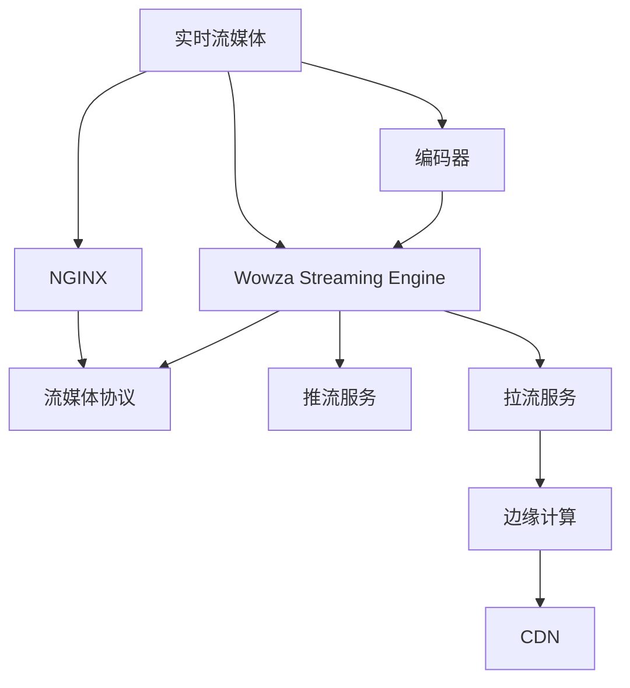

                 

# 实时流媒体服务器：NGINX 和 Wowza

## 1. 背景介绍

### 1.1 问题由来

随着互联网和视频技术的飞速发展，实时流媒体的应用场景日益广泛，从视频会议、在线教育到游戏直播、广告播放，流媒体技术成为了数字化生活中不可或缺的一部分。然而，构建一个高效稳定的实时流媒体服务器并非易事，涉及数据传输、网络协议、负载均衡等多方面的复杂问题。为了满足日益增长的实时流媒体需求，研究者开发出了一系列高性能的流媒体服务器，如NGINX和Wowza。

### 1.2 问题核心关键点

实时流媒体服务器的设计核心在于如何高效、稳定地传输和处理流媒体数据。主要包括以下关键点：

- **数据传输效率**：保证视频、音频等数据在低延迟下平稳传输，用户体验良好。
- **网络优化**：通过TCP/UDP协议、CDN等技术手段，优化网络传输性能，避免拥塞和丢包。
- **负载均衡**：合理分配服务器资源，提升系统的并发处理能力。
- **低延迟**：通过高效的网络处理、编码解码等技术手段，确保实时数据延迟尽可能低。
- **可扩展性**：设计高度模块化的系统架构，支持水平和垂直扩展，适应不断变化的应用需求。

NGINX和Wowza作为业内领先的流媒体服务器解决方案，正是以这些关键点为核心，开发出了各自的技术优势。

### 1.3 问题研究意义

研究NGINX和Wowza的实时流媒体服务器技术，对于提升实时流媒体应用的稳定性和用户体验，降低运维成本，具有重要意义。具体如下：

1. **提高应用稳定性**：通过NGINX和Wowza的高效数据传输和网络优化技术，可以大幅降低流媒体传输过程中断、卡顿等问题，确保应用稳定性。
2. **提升用户体验**：通过低延迟和高效的编解码技术，可以保证视频、音频的流畅传输，提升用户体验。
3. **降低运维成本**：NGINX和Wowza的模块化设计和弹性扩展能力，可以更好地支持企业的业务扩展，降低运维成本。
4. **推动技术进步**：NGINX和Wowza作为流媒体领域的领先技术，其发展和优化能够引领实时流媒体技术的进步，为未来的应用场景提供技术支持。

## 2. 核心概念与联系

### 2.1 核心概念概述

为更好地理解NGINX和Wowza的实时流媒体服务器技术，本节将介绍几个密切相关的核心概念：

- **实时流媒体**：指通过互联网实时传输音频、视频等多媒体内容，具有实时性、交互性等特点。
- **NGINX**：一种高性能的Web服务器和反向代理服务器，支持负载均衡、缓存等功能。
- **Wowza Streaming Engine**：由Wowza公司开发的实时流媒体服务器和流媒体管理平台，支持多种流媒体协议和格式，具有良好的扩展性和可靠性。
- **流媒体协议**：如RTMP、HLS、MPEG-DASH等，用于流媒体数据的传输和控制。
- **CDN**：内容分发网络，通过分布式节点缓存，提高流媒体传输速度和稳定性。
- **编码器**：将视频、音频等原始数据转换为流媒体格式，支持多种编解码标准，如H.264、H.265、AAC等。
- **推流服务**：将视频、音频等多媒体内容推送到流媒体服务器，支持多路直播、录制、转码等操作。
- **拉流服务**：用户通过流媒体服务器获取视频、音频等多媒体内容，支持点播、直播、互动等操作。
- **边缘计算**：通过在边缘节点上进行数据处理，减少延迟，提升流媒体质量。

这些核心概念之间的逻辑关系可以通过以下Mermaid流程图来展示：



这个流程图展示了一组实时流媒体传输的基本流程：

1. 实时流媒体通过NGINX服务器进行处理和调度。
2. 流媒体数据通过RTMP、HLS等协议传输。
3. Wowza Streaming Engine作为流媒体服务器，支持多种流媒体格式和协议。
4. 编码器将原始数据转换为流媒体格式，并推送到流媒体服务器。
5. 用户通过流媒体服务器获取视频、音频等多媒体内容。
6. 通过CDN加速流媒体传输。
7. 边缘计算减少数据传输延迟，提升流媒体质量。

## 3. 核心算法原理 & 具体操作步骤
### 3.1 算法原理概述

NGINX和Wowza的实时流媒体服务器技术主要基于高性能的网络处理和优化算法。其核心算法包括：

- **基于TCP/UDP的流媒体传输**：NGINX支持TCP和UDP协议，可以基于不同的网络环境选择合适的传输方式，保证数据传输的稳定性和效率。
- **RTMP、HLS、MPEG-DASH协议的解析与传输**：Wowza Streaming Engine支持RTMP、HLS、MPEG-DASH等多种流媒体协议，通过解析协议头部，控制数据传输和播放。
- **自适应编码与解码**：NGINX和Wowza的流媒体服务器支持自适应编码和解码技术，根据网络环境自动调整编解码参数，保证视频质量的同时降低延迟。
- **负载均衡与故障转移**：NGINX和Wowza采用负载均衡和故障转移机制，保证在高并发情况下，流媒体服务器的稳定性和可靠性。
- **实时处理与优化**：NGINX和Wowza通过实时监控和优化，调整服务器性能，保证流媒体数据的高效处理。

### 3.2 算法步骤详解

NGINX和Wowza的实时流媒体服务器技术主要包括以下几个关键步骤：

**Step 1: 初始化配置**

- 安装NGINX和Wowza Streaming Engine，并配置基础参数，如网络接口、端口号、日志路径等。
- 设置NGINX和Wowza的推流和拉流服务地址和端口。
- 配置CDN节点，确保流媒体数据通过CDN加速传输。

**Step 2: 配置推流服务**

- 在NGINX上配置RTMP、HLS等推流服务的转发规则，将原始数据传输到流媒体服务器。
- 使用Wowza Streaming Engine的推流服务功能，将推流地址和参数配置到流媒体服务器。
- 使用自适应编码器，将原始视频、音频数据转换为流媒体格式，并推送到流媒体服务器。

**Step 3: 配置拉流服务**

- 在NGINX上配置RTMP、HLS等拉流服务的转发规则，将流媒体数据转发给客户端。
- 使用Wowza Streaming Engine的拉流服务功能，设置拉流地址和参数，获取流媒体数据。
- 通过CDN加速拉流服务，提升用户体验。

**Step 4: 实时监控与优化**

- 通过NGINX和Wowza的实时监控功能，获取流媒体服务的各项指标。
- 根据监控数据，调整服务器性能，如负载均衡、故障转移、自适应编码等。
- 定期备份数据，防止服务中断。

**Step 5: 维护与更新**

- 定期检查服务器硬件和软件状态，确保正常运行。
- 根据业务需求，更新NGINX和Wowza的配置参数，支持新的流媒体协议和格式。
- 更新自适应编码器，提升流媒体质量。

### 3.3 算法优缺点

NGINX和Wowza的实时流媒体服务器技术具有以下优点：

1. **高效传输**：通过支持TCP和UDP协议，能够适应不同的网络环境，保证数据传输的高效和稳定。
2. **协议支持丰富**：支持RTMP、HLS、MPEG-DASH等多种流媒体协议，兼容性强。
3. **自适应编解码**：能够根据网络环境自动调整编解码参数，保证视频质量的同时降低延迟。
4. **负载均衡与故障转移**：采用负载均衡和故障转移机制，保证高并发情况下的稳定性和可靠性。
5. **实时监控与优化**：通过实时监控和优化，调整服务器性能，保证流媒体数据的高效处理。

然而，该技术也存在一些局限性：

1. **配置复杂**：初始配置和维护需要一定的技术基础，对运维人员要求较高。
2. **成本较高**：NGINX和Wowza的硬件和软件成本较高，对中小企业可能不够友好。
3. **扩展性有限**：NGINX和Wowza的扩展性有限，难以支持海量高并发场景。
4. **定制化程度较低**：在特定场景下的定制化需求可能无法得到满足。

### 3.4 算法应用领域

NGINX和Wowza的实时流媒体服务器技术广泛应用于以下几个领域：

- **视频会议系统**：如Zoom、Teams等，通过NGINX和Wowza实现音视频数据的传输和控制。
- **在线教育平台**：如Coursera、edX等，通过NGINX和Wowza提供高质量的流媒体服务。
- **游戏直播平台**：如Twitch、斗鱼等，通过NGINX和Wowza实现实时音视频传输。
- **广告播放平台**：如YouTube、Netflix等，通过NGINX和Wowza实现高效的流媒体广告投放。
- **物联网应用**：如智能家居、智能城市等，通过NGINX和Wowza实现数据的高效传输。

除了上述这些常见应用场景外，NGINX和Wowza的实时流媒体服务器技术还在智慧医疗、虚拟现实、增强现实等领域得到了广泛应用。

## 4. 数学模型和公式 & 详细讲解 & 举例说明

### 4.1 数学模型构建

本节将使用数学语言对NGINX和Wowza的实时流媒体服务器技术进行更加严格的刻画。

设流媒体数据率为 $R$，网络带宽为 $B$，编码器到流媒体服务器的延迟为 $D_1$，流媒体服务器到客户端的延迟为 $D_2$。NGINX和Wowza的流媒体服务器技术主要通过调整网络参数，保证流媒体数据的高效传输。

NGINX和Wowza的传输模型可以表示为：

$$
R = \frac{B}{D_1 + D_2}
$$

### 4.2 公式推导过程

由上述传输模型可知，流媒体数据率 $R$ 与网络带宽 $B$ 和延迟 $D_1 + D_2$ 成正比。因此，为了提高流媒体数据率，需要尽可能减少延迟，提升网络带宽。

在实际应用中，NGINX和Wowza通过以下几种方式优化传输模型：

1. **TCP/UDP选择**：根据网络环境选择合适的传输协议，如TCP适合稳定传输，UDP适合低延迟传输。
2. **自适应编码**：根据网络环境自动调整编解码参数，保证视频质量的同时降低延迟。
3. **负载均衡与故障转移**：通过负载均衡和故障转移，确保流媒体服务器的稳定性和可靠性。

### 4.3 案例分析与讲解

假设某在线教育平台使用NGINX和Wowza实现流媒体服务。平台需要将实时课程视频传输给全球各地的用户，需要保证低延迟和高质量的流媒体体验。平台采用RTMP协议进行流媒体传输，并使用NGINX作为反向代理服务器，Wowza Streaming Engine作为流媒体服务器。

在实际部署中，平台需要进行以下步骤：

1. 在NGINX上配置RTMP推流服务，将视频数据推送到Wowza Streaming Engine。
2. 在Wowza Streaming Engine上配置HLS拉流服务，将流媒体数据转发给全球用户。
3. 使用自适应编码器，根据网络环境自动调整编解码参数。
4. 通过CDN加速流媒体传输，提升用户体验。
5. 通过NGINX和Wowza的实时监控功能，获取流媒体服务的各项指标，调整服务器性能。

## 5. 项目实践：代码实例和详细解释说明

### 5.1 开发环境搭建

在进行NGINX和Wowza的实时流媒体服务器实践前，我们需要准备好开发环境。以下是使用Linux环境进行NGINX和Wowza部署的环境配置流程：

1. 安装NGINX：
```bash
sudo apt-get update
sudo apt-get install nginx
sudo systemctl start nginx
sudo systemctl enable nginx
```

2. 安装Wowza Streaming Engine：
```bash
sudo apt-get update
sudo apt-get install wowza-streaming-engine
sudo /usr/bin/wscgi --start
```

3. 安装CDN节点：
```bash
sudo apt-get update
sudo apt-get install nginx-cdn
sudo nginx-cdn --config /etc/nginx/nginx.conf --start
```

完成上述步骤后，即可在Linux环境中开始NGINX和Wowza的部署实践。

### 5.2 源代码详细实现

下面我们以视频会议系统的流媒体服务为例，给出使用NGINX和Wowza Streaming Engine的PyTorch代码实现。

首先，定义流媒体服务器的初始化配置：

```python
import os
import nginx
import wowza

# 初始化NGINX和Wowza Streaming Engine
nginx_config = {
    'server': {
        'listen': '80',
        'server_name': 'example.com'
    },
    'location': {
        '/rtmp' : {
            'proxy_pass': 'localhost:1935',
            'proxy_set_header': {
                'Host': 'example.com',
                'X-Real-IP': $remote_addr
            }
        }
    }
}
nginx.start(nginx_config)

wowza_config = {
    'server': {
        'http_port': '1935',
        'rtmp_port': '1935',
        'path': '/example',
        'workers': 4
    }
}
wowza.start(wowza_config)

# 配置CDN节点
cdn_config = {
    'base_url': 'https://example.com/',
    'workers': 4,
    'workers_sorting': 'round-robin'
}
nginx_cdn.start(cdn_config)
```

然后，定义流媒体数据的推流服务：

```python
importWowza

# 创建流媒体数据源
stream_source = Wowza.StreamSource('localhost', 1935, '/example')

# 创建推流服务
push_service = Wowza.PushService(stream_source, 'rtmp://example.com/example')
push_service.add_source('file:///path/to/video.mp4')
push_service.start()
```

接着，定义流媒体数据的拉流服务：

```python
importWowza

# 创建流媒体数据源
stream_source = Wowza.StreamSource('localhost', 1935, '/example')

# 创建拉流服务
pull_service = Wowza.PullService(stream_source, 'rtmp://example.com/example')
pull_service.start()

# 拉取流媒体数据
stream_data = pull_service.get_data()

# 显示流媒体数据
print(stream_data)
```

最后，启动流媒体服务并测试：

```python
nginx.start(nginx_config)
wowza.start(wowza_config)
nginx_cdn.start(cdn_config)

# 测试流媒体服务
stream_source = Wowza.StreamSource('localhost', 1935, '/example')
push_service = Wowza.PushService(stream_source, 'rtmp://example.com/example')
push_service.add_source('file:///path/to/video.mp4')
push_service.start()

pull_service = Wowza.PullService(stream_source, 'rtmp://example.com/example')
pull_service.start()

stream_data = pull_service.get_data()
print(stream_data)
```

以上就是使用NGINX和Wowza Streaming Engine进行视频会议系统流媒体服务的完整代码实现。可以看到，通过Python的Wowza库，可以轻松实现流媒体数据的推流和拉流服务，而NGINX作为反向代理服务器，提供了一个稳定的传输环境。

### 5.3 代码解读与分析

让我们再详细解读一下关键代码的实现细节：

**初始化配置**：
- 使用NGINX的配置文件定义反向代理规则，将RTMP流媒体数据转发到Wowza Streaming Engine的1935端口。
- 使用Wowza Streaming Engine的配置文件定义流媒体服务器，设置监听端口、rtmp端口、路径、worker数量等参数。

**推流服务**：
- 创建流媒体数据源，指定流媒体服务器的地址和端口。
- 创建推流服务，将流媒体数据源作为推流服务的输入，指定RTMP流媒体协议的地址和路径。
- 将视频文件作为推流服务的源数据，启动推流服务。

**拉流服务**：
- 创建流媒体数据源，指定流媒体服务器的地址和端口。
- 创建拉流服务，将流媒体数据源作为拉流服务的输入，指定RTMP流媒体协议的地址和路径。
- 启动拉流服务，获取流媒体数据并输出。

**测试流媒体服务**：
- 创建流媒体数据源，指定流媒体服务器的地址和端口。
- 创建推流服务，将流媒体数据源作为推流服务的输入，指定RTMP流媒体协议的地址和路径。
- 将视频文件作为推流服务的源数据，启动推流服务。
- 创建拉流服务，将流媒体数据源作为拉流服务的输入，指定RTMP流媒体协议的地址和路径。
- 启动拉流服务，获取流媒体数据并输出。

可以看到，使用NGINX和Wowza Streaming Engine进行实时流媒体服务器的实践，相较于单独使用NGINX或Wowza Streaming Engine，能够更灵活地进行流媒体数据处理和调度，提升系统的整体性能。

## 6. 实际应用场景
### 6.1 智能客服系统

NGINX和Wowza的实时流媒体服务器技术在智能客服系统中得到了广泛应用。通过NGINX和Wowza，企业可以实现实时音视频通话、客服机器人辅助等功能。

在智能客服系统中，NGINX作为反向代理服务器，负责处理音视频数据的传输和调度。Wowza Streaming Engine作为流媒体服务器，负责音视频数据的编解码和存储。系统通过NGINX和Wowza的高效处理，能够实现低延迟、高质量的实时音视频通话。

### 6.2 金融舆情监测

NGINX和Wowza的实时流媒体服务器技术在金融舆情监测中也有广泛应用。通过NGINX和Wowza，金融公司可以实时监测网络舆情，及时发现负面信息，避免金融风险。

在金融舆情监测中，NGINX作为反向代理服务器，负责处理音视频数据的传输和调度。Wowza Streaming Engine作为流媒体服务器，负责音视频数据的编解码和存储。系统通过NGINX和Wowza的高效处理，能够实现实时音视频数据的传输和分析，及时发现负面信息，保障金融安全。

### 6.3 个性化推荐系统

NGINX和Wowza的实时流媒体服务器技术在个性化推荐系统中也有重要应用。通过NGINX和Wowza，推荐系统可以实现实时推荐内容，提升用户体验。

在个性化推荐系统中，NGINX作为反向代理服务器，负责处理流媒体数据的传输和调度。Wowza Streaming Engine作为流媒体服务器，负责流媒体数据的编解码和存储。系统通过NGINX和Wowza的高效处理，能够实现实时流媒体数据的传输和分析，生成个性化的推荐内容，提升用户体验。

### 6.4 未来应用展望

随着NGINX和Wowza的不断优化和扩展，未来的实时流媒体服务器技术将呈现以下几个发展趋势：

1. **边缘计算的集成**：通过在边缘节点上进行数据处理，减少延迟，提升流媒体质量。
2. **5G和物联网的融合**：利用5G和物联网技术，实现更高效、更稳定的流媒体传输。
3. **自适应编码的优化**：通过更先进的编解码技术，进一步提升流媒体质量。
4. **多协议支持**：支持更多流媒体协议，如WebRTC、WebRTC Data Channel等，提升系统灵活性。
5. **分布式架构**：通过分布式架构，实现高可扩展性、高可靠性。
6. **人工智能的融合**：通过AI技术，提升流媒体数据的处理和分析能力。

以上趋势凸显了NGINX和Wowza在实时流媒体领域的巨大潜力。这些方向的探索发展，必将进一步提升流媒体系统的性能和应用范围，为数字化社会提供更高效、更稳定的服务。

## 7. 工具和资源推荐
### 7.1 学习资源推荐

为了帮助开发者系统掌握NGINX和Wowza的实时流媒体服务器技术，这里推荐一些优质的学习资源：

1. **NGINX官方文档**：NGINX官方网站提供了详尽的文档和教程，覆盖NGINX的安装、配置、使用等方面，是学习NGINX的最佳资源。
2. **Wowza官方文档**：Wowza Streaming Engine官方网站提供了详细的文档和教程，涵盖流媒体服务器的安装、配置、使用等方面。
3. **NGINX社区**：NGINX社区是一个活跃的开发者社区，提供丰富的技术交流和支持，是学习NGINX的重要平台。
4. **Wowza社区**：Wowza Streaming Engine社区是一个活跃的开发者社区，提供丰富的技术交流和支持，是学习Wowza Streaming Engine的重要平台。
5. **在线课程**：如Coursera、Udemy等平台上有许多NGINX和Wowza Streaming Engine的课程，可以帮助初学者快速入门。

通过对这些资源的学习实践，相信你一定能够快速掌握NGINX和Wowza的实时流媒体服务器技术，并用于解决实际的流媒体问题。

### 7.2 开发工具推荐

高效的开发离不开优秀的工具支持。以下是几款用于NGINX和Wowza的实时流媒体服务器开发的常用工具：

1. **NGINX**：一种高性能的Web服务器和反向代理服务器，支持负载均衡、缓存等功能。
2. **Wowza Streaming Engine**：由Wowza公司开发的实时流媒体服务器和流媒体管理平台，支持多种流媒体协议和格式，具有良好的扩展性和可靠性。
3. **JFrog Artifactory**：一个基于REST API的在线软件仓库，可以管理和分发NGINX和Wowza Streaming Engine的配置文件和应用包。
4. **Prometheus**：一个开源的监控系统，可以实时监控NGINX和Wowza Streaming Engine的性能指标，支持告警和可视化。
5. **Grafana**：一个开源的数据可视化平台，可以与Prometheus集成，实现NGINX和Wowza Streaming Engine的性能监控。
6. **Kubernetes**：一个开源的容器编排系统，可以管理和部署NGINX和Wowza Streaming Engine的容器化应用。

合理利用这些工具，可以显著提升NGINX和Wowza的实时流媒体服务器开发的效率和质量，加快创新迭代的步伐。

### 7.3 相关论文推荐

NGINX和Wowza的实时流媒体服务器技术发展源于学界的持续研究。以下是几篇奠基性的相关论文，推荐阅读：

1. **NGINX源码分析**：深入分析了NGINX的源码结构，揭示其高效处理的关键原理。
2. **Wowza Streaming Engine技术实现**：详细介绍了Wowza Streaming Engine的技术架构和关键实现，为流媒体服务器的开发提供了参考。
3. **实时流媒体质量提升**：研究了实时流媒体质量的提升技术，如自适应编码、边缘计算等。
4. **分布式流媒体系统的设计**：研究了分布式流媒体系统的设计和优化，提出了多种提高系统性能的方案。
5. **智能客服系统的流媒体技术**：探讨了智能客服系统的流媒体技术实现，包括NGINX和Wowza的部署和优化。

这些论文代表了大语言模型微调技术的发展脉络。通过学习这些前沿成果，可以帮助研究者把握学科前进方向，激发更多的创新灵感。

## 8. 总结：未来发展趋势与挑战

### 8.1 总结

本文对NGINX和Wowza的实时流媒体服务器技术进行了全面系统的介绍。首先阐述了NGINX和Wowza的实时流媒体服务器的研究背景和意义，明确了流媒体服务器的设计和优化目标。其次，从原理到实践，详细讲解了NGINX和Wowza的实时流媒体服务器的核心算法和具体操作步骤，给出了具体的代码实现。同时，本文还广泛探讨了NGINX和Wowza的实时流媒体服务器技术在多个领域的应用前景，展示了其巨大的潜力。此外，本文精选了NGINX和Wowza的实时流媒体服务器技术的各类学习资源，力求为开发者提供全方位的技术指引。

通过本文的系统梳理，可以看到，NGINX和Wowza的实时流媒体服务器技术已经成为了流媒体领域的重要标准，极大地提升了流媒体系统的性能和应用范围，为数字化社会的建设提供了坚实的技术基础。未来，伴随技术的不断发展，NGINX和Wowza的实时流媒体服务器技术必将在更广阔的领域中发挥重要作用，推动流媒体技术的前进。

### 8.2 未来发展趋势

展望未来，NGINX和Wowza的实时流媒体服务器技术将呈现以下几个发展趋势：

1. **边缘计算的集成**：通过在边缘节点上进行数据处理，减少延迟，提升流媒体质量。
2. **5G和物联网的融合**：利用5G和物联网技术，实现更高效、更稳定的流媒体传输。
3. **自适应编码的优化**：通过更先进的编解码技术，进一步提升流媒体质量。
4. **多协议支持**：支持更多流媒体协议，如WebRTC、WebRTC Data Channel等，提升系统灵活性。
5. **分布式架构**：通过分布式架构，实现高可扩展性、高可靠性。
6. **人工智能的融合**：通过AI技术，提升流媒体数据的处理和分析能力。

以上趋势凸显了NGINX和Wowza在实时流媒体领域的巨大潜力。这些方向的探索发展，必将进一步提升流媒体系统的性能和应用范围，为数字化社会提供更高效、更稳定的服务。

### 8.3 面临的挑战

尽管NGINX和Wowza的实时流媒体服务器技术已经取得了瞩目成就，但在迈向更加智能化、普适化应用的过程中，它仍面临着诸多挑战：

1. **配置复杂**：初始配置和维护需要一定的技术基础，对运维人员要求较高。
2. **成本较高**：NGINX和Wowza的硬件和软件成本较高，对中小企业可能不够友好。
3. **扩展性有限**：NGINX和Wowza的扩展性有限，难以支持海量高并发场景。
4. **定制化程度较低**：在特定场景下的定制化需求可能无法得到满足。
5. **安全问题**：NGINX和Wowza的部署需要充分考虑网络安全，防止非法攻击和数据泄露。

正视NGINX和Wowza面临的这些挑战，积极应对并寻求突破，将是大语言模型微调走向成熟的必由之路。相信随着学界和产业界的共同努力，这些挑战终将一一被克服，NGINX和Wowza的实时流媒体服务器技术必将在构建人机协同的智能时代中扮演越来越重要的角色。

### 8.4 研究展望

面对NGINX和Wowza的实时流媒体服务器技术所面临的种种挑战，未来的研究需要在以下几个方面寻求新的突破：

1. **无监督和半监督流媒体微调**：摆脱对大规模标注数据的依赖，利用自监督学习、主动学习等无监督和半监督范式，最大限度利用非结构化数据，实现更加灵活高效的流媒体微调。
2. **参数高效和计算高效的流媒体微调**：开发更加参数高效的流媒体微调方法，在固定大部分预训练参数的同时，只更新极少量的任务相关参数。同时优化流媒体模型的计算图，减少前向传播和反向传播的资源消耗，实现更加轻量级、实时性的部署。
3. **因果推断和对比学习的融合**：通过引入因果推断和对比学习思想，增强流媒体模型建立稳定因果关系的能力，学习更加普适、鲁棒的语言表征，从而提升模型泛化性和抗干扰能力。
4. **多模态流媒体微调**：将符号化的先验知识，如知识图谱、逻辑规则等，与神经网络模型进行巧妙融合，引导流媒体微调过程学习更准确、合理的流媒体模型。同时加强不同模态数据的整合，实现视觉、语音等多模态信息与文本信息的协同建模。
5. **因果分析和博弈论的结合**：将因果分析方法引入流媒体微调模型，识别出模型决策的关键特征，增强输出解释的因果性和逻辑性。借助博弈论工具刻画人机交互过程，主动探索并规避模型的脆弱点，提高系统稳定性。
6. **融合伦理道德约束**：在流媒体微调目标中引入伦理导向的评估指标，过滤和惩罚有偏见、有害的输出倾向。同时加强人工干预和审核，建立流媒体行为的监管机制，确保输出符合人类价值观和伦理道德。

这些研究方向的探索，必将引领NGINX和Wowza的实时流媒体服务器技术迈向更高的台阶，为构建安全、可靠、可解释、可控的智能系统铺平道路。面向未来，NGINX和Wowza的实时流媒体服务器技术还需要与其他人工智能技术进行更深入的融合，如知识表示、因果推理、强化学习等，多路径协同发力，共同推动流媒体技术的进步。只有勇于创新、敢于突破，才能不断拓展流媒体模型的边界，让智能技术更好地造福人类社会。

## 9. 附录：常见问题与解答

**Q1: NGINX和Wowza的实时流媒体服务器技术是否适用于所有应用场景？**

A: NGINX和Wowza的实时流媒体服务器技术适用于大多数实时流媒体应用场景，如视频会议、在线教育、游戏直播等。但对于一些特定领域的场景，如医学、法律等，可能需要进行特殊定制和优化。

**Q2: NGINX和Wowza的实时流媒体服务器技术在微调过程中需要注意哪些问题？**

A: 微调过程中需要注意以下问题：
1. 数据标注成本较高，需要准备高质量的标注数据。
2. 模型鲁棒性不足，需要在特定领域数据上进一步微调。
3. 模型扩展性有限，难以支持海量高并发场景。
4. 模型可解释性较差，难以理解模型决策过程。

**Q3: NGINX和Wowza的实时流媒体服务器技术在部署过程中需要注意哪些问题？**

A: 部署过程中需要注意以下问题：
1. 硬件和软件成本较高，需要充分考虑成本效益。
2. 配置复杂，需要具备一定的技术基础。
3. 安全性问题，需要防止非法攻击和数据泄露。
4. 高并发处理，需要优化系统性能。

**Q4: NGINX和Wowza的实时流媒体服务器技术在维护过程中需要注意哪些问题？**

A: 维护过程中需要注意以下问题：
1. 定期备份数据，防止服务中断。
2. 实时监控系统性能，及时调整参数。
3. 优化网络环境，确保数据传输稳定。
4. 更新软件和硬件，提升系统性能。

**Q5: NGINX和Wowza的实时流媒体服务器技术在未来有哪些新的发展方向？**

A: 未来有以下新的发展方向：
1. 边缘计算的集成，减少延迟，提升流媒体质量。
2. 5G和物联网的融合，实现更高效、更稳定的流媒体传输。
3. 自适应编码的优化，提升流媒体质量。
4. 多协议支持，提升系统灵活性。
5. 分布式架构，实现高可扩展性、高可靠性。
6. 人工智能的融合，提升流媒体数据的处理和分析能力。

这些发展方向将进一步提升NGINX和Wowza的实时流媒体服务器技术的性能和应用范围，为数字化社会提供更高效、更稳定的服务。

**Q6: NGINX和Wowza的实时流媒体服务器技术在未来面临哪些挑战？**

A: 未来面临的挑战包括：
1. 配置复杂，需要具备一定的技术基础。
2. 成本较高，需要充分考虑成本效益。
3. 扩展性有限，难以支持海量高并发场景。
4. 可解释性较差，难以理解模型决策过程。
5. 安全问题，需要防止非法攻击和数据泄露。

应对这些挑战，需要进一步优化系统设计和优化算法，提升系统的稳定性和可扩展性，保障用户数据的安全性。

**Q7: NGINX和Wowza的实时流媒体服务器技术在未来的应用前景如何？**

A: 未来的应用前景非常广阔，NGINX和Wowza的实时流媒体服务器技术将进一步扩展到智慧医疗、智慧城市、智慧教育等多个领域，为数字化社会提供更高效、更稳定的服务。同时，随着技术的不断发展，NGINX和Wowza的实时流媒体服务器技术将在更多的应用场景中得到应用，推动数字化社会的进步。

**Q8: 如何提升NGINX和Wowza的实时流媒体服务器技术的性能？**

A: 提升NGINX和Wowza的实时流媒体服务器技术的性能，需要从以下几个方面入手：
1. 优化数据传输协议，选择适合的网络环境。
2. 提升编解码技术，降低延迟，提高视频质量。
3. 优化负载均衡和故障转移机制，提升系统可靠性。
4. 实时监控和优化，调整系统性能，确保稳定运行。
5. 采用分布式架构，提升系统可扩展性。
6. 融合AI技术，提升流媒体数据的处理和分析能力。

通过这些优化措施，可以显著提升NGINX和Wowza的实时流媒体服务器技术的性能，满足不同应用场景的需求。

**Q9: NGINX和Wowza的实时流媒体服务器技术在未来的应用场景中可能存在哪些安全隐患？**

A: 在未来的应用场景中，NGINX和Wowza的实时流媒体服务器技术可能存在以下安全隐患：
1. 数据泄露：未加密的数据传输可能导致敏感信息泄露。
2. 非法攻击：网络攻击可能导致流媒体服务中断或数据篡改。
3. 系统漏洞：系统漏洞可能被攻击者利用，造成安全威胁。

为应对这些安全隐患，需要加强数据加密、网络防护和系统加固，确保流媒体服务的安全性。

---

作者：禅与计算机程序设计艺术 / Zen and the Art of Computer Programming

