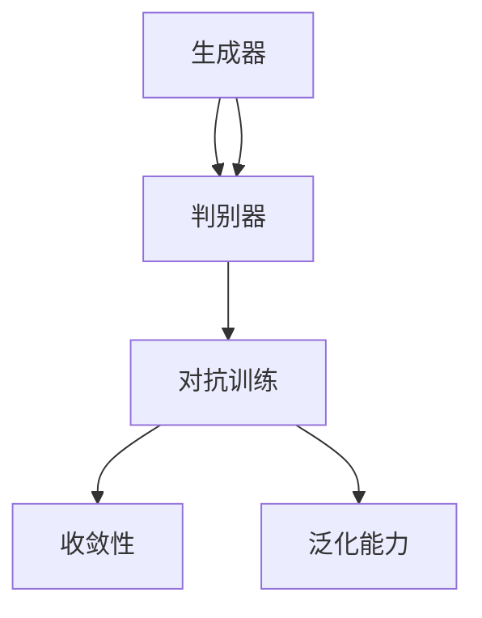

                 

# 对抗生成网络:AI创造力的新维度

> 关键词：对抗生成网络,生成对抗网络,GANs,GAN,深度学习,创造力,人工智能,深度学习,图像生成,艺术创作,生成模型,创新应用

## 1. 背景介绍

### 1.1 问题由来
对抗生成网络（Generative Adversarial Networks, GANs）是深度学习领域的一项革命性技术，近年来在图像生成、艺术创作、游戏设计等领域展现了强大的创造力。GANs由Ian Goodfellow等人于2014年提出，它通过两个对抗的神经网络模型——生成器和判别器，来协同训练，使得生成器能够生成与真实数据高度相似的数据，从而实现数据的生成和转换。GANs的成功激发了人们对深度学习在创造力方面的新思考，尤其是在艺术创作、游戏设计等领域，深度学习展现出前所未有的潜力。

### 1.2 问题核心关键点
GANs的核心思想是通过两个神经网络的对抗过程，使得生成器能够生成与真实数据无法区分的虚假数据。生成器（Generator）和判别器（Discriminator）相互竞争，在不断的博弈中，生成器的生成能力不断提升，判别器的鉴别能力也不断提升。GANs的关键点包括：
- 对抗性训练：生成器和判别器相互竞争，生成器生成假数据，判别器判断真伪，二者博弈直至平衡。
- 无限逼近目标：生成器生成的数据越来越逼近真实数据，判别器对数据的判别能力越来越强。
- 生成模型的泛化能力：通过大量的训练数据和合适的网络结构，生成器能够生成多种多样的数据，具有很强的泛化能力。

## 2. 核心概念与联系

### 2.1 核心概念概述

为更好地理解GANs的工作原理和优化方向，本节将介绍几个密切相关的核心概念：

- 对抗生成网络（GANs）：由生成器和判别器组成的深度学习模型，通过对抗训练生成逼真的假数据。
- 生成器（Generator）：网络模型，用于生成与真实数据无法区分的虚假数据。
- 判别器（Discriminator）：网络模型，用于判断数据是真数据还是假数据。
- 对抗训练（Adversarial Training）：生成器和判别器的训练过程，通过对抗性策略提升生成器生成数据的真实度。
- 收敛性（Convergence）：生成器生成的数据逼近真实数据的过程，判别器对数据的判别能力不断提升，生成器和判别器达到均衡。
- 生成模型的泛化能力（Generalization）：生成器能够生成多种多样数据，在特定领域内具有很好的泛化能力。

这些核心概念之间的逻辑关系可以通过以下Mermaid流程图来展示：



这个流程图展示了大对抗生成网络的核心概念及其之间的关系：

1. 生成器和判别器是GANs的两个关键组件。
2. 对抗训练是生成器和判别器相互竞争的过程，通过不断博弈，提升生成器的生成能力。
3. 收敛性表示生成器生成的数据逼近真实数据的过程，判别器的鉴别能力也不断提升。
4. 泛化能力表示生成器在特定领域内生成数据的多样性和有效性。

## 3. 核心算法原理 & 具体操作步骤
### 3.1 算法原理概述

GANs通过生成器和判别器的对抗过程，实现数据的生成和转换。具体来说，生成器接收一个随机的噪声向量，通过一系列的卷积、反卷积等操作，生成一张逼真的假图像。判别器接收输入图像，输出一个介于0和1之间的概率值，表示输入图像是真实图像的概率。生成器和判别器的目标分别是最大化自己的性能，即生成器希望生成的图像尽可能欺骗判别器，判别器希望尽可能准确地区分真实图像和生成的图像。

在训练过程中，生成器和判别器交替进行训练。首先，生成器生成一批假图像，判别器对这批图像进行判别。判别器的输出值作为生成器的损失函数的一部分，生成器根据损失函数调整自己的参数。接着，判别器对真实图像和生成的图像进行判别，生成器的输出值作为判别器的损失函数的一部分，判别器根据损失函数调整自己的参数。在不断交替训练的过程中，生成器和判别器的性能逐渐提升，生成器生成的图像逼近真实图像，判别器对真实图像的判别准确率也不断提升。

### 3.2 算法步骤详解

GANs的训练步骤主要包括以下几个关键步骤：

**Step 1: 准备生成器和判别器模型**
- 定义生成器模型和判别器模型的结构，如卷积神经网络（CNN）、反卷积神经网络（Transposed CNN）等。
- 初始化生成器和判别器的权重。

**Step 2: 设计损失函数**
- 生成器的损失函数包括两个部分：判别器的损失和生成器的损失。判别器的损失表示判别器对生成器生成的图像的判别能力，生成器的损失表示生成器生成的图像的逼真度。
- 判别器的损失函数通常采用二分类交叉熵损失函数。
- 生成器的损失函数通常采用Wasserstein距离损失函数、Adversarial Loss等。

**Step 3: 设置超参数**
- 设置学习率、批大小、迭代轮数等超参数。
- 设置正则化技术，如权重衰减、Dropout等，防止过拟合。

**Step 4: 执行对抗训练**
- 将训练集数据分批次输入生成器和判别器。
- 生成器生成一批假图像，判别器对这批图像进行判别，计算判别器的损失。
- 生成器根据判别器的损失调整自己的参数。
- 判别器对真实图像和生成的图像进行判别，计算生成器的损失。
- 判别器根据生成器的损失调整自己的参数。
- 周期性在验证集上评估生成器和判别器的性能，根据性能指标决定是否触发Early Stopping。
- 重复上述步骤直到满足预设的迭代轮数或Early Stopping条件。

**Step 5: 生成结果展示**
- 使用训练好的生成器生成新的图像，展示训练效果。

以上是GANs的基本训练流程。在实际应用中，还需要根据具体任务的特点，对模型结构和损失函数进行优化设计，如使用更复杂的生成器和判别器结构、引入条件生成等，以进一步提升模型的生成能力和泛化能力。

### 3.3 算法优缺点

GANs具有以下优点：
1. 生成结果逼真度高。通过对抗训练，生成器生成的图像与真实图像几乎无法区分。
2. 生成能力强。生成器可以生成多种多样的数据，具有很强的泛化能力。
3. 可解释性强。GANs的生成过程可以解释为生成器和判别器的对抗博弈，易于理解。

同时，GANs也存在一些缺点：
1. 训练过程不稳定。生成器和判别器之间的对抗过程需要不断调整，训练过程容易陷入局部最优解。
2. 模型参数多。GANs需要训练两个网络，模型参数量较大，训练过程资源消耗大。
3. 生成数据质量不稳定。生成的数据质量可能存在噪声、不连贯等问题，影响模型的使用效果。
4. 对抗攻击脆弱。GANs生成的图像容易被对抗攻击破坏，生成器生成的图像可能会对真实数据造成混淆。

尽管存在这些局限性，但就目前而言，GANs仍是大数据生成和创造力应用的最主流范式。未来相关研究的重点在于如何进一步优化生成器和判别器的结构，降低训练过程中的不稳定因素，提高生成数据的质量和稳定性，以及加强对抗攻击的防御能力。

### 3.4 算法应用领域

GANs在以下几个领域具有广泛的应用前景：

- 图像生成：生成逼真的假图像，应用于游戏设计、影视特效、艺术创作等领域。
- 视频生成：生成逼真的假视频，应用于虚拟现实、电影制作、动画设计等领域。
- 数据增强：生成与真实数据相似的数据，应用于医疗影像增强、自动驾驶、机器人视觉等领域。
- 文本生成：生成逼真的假文本，应用于自动写作、机器翻译、智能客服等领域。
- 音频生成：生成逼真的假音频，应用于音乐创作、语音合成、智能助手等领域。
- 艺术创作：生成逼真的艺术品，应用于虚拟艺术、博物馆展览、艺术设计等领域。

除了上述这些经典应用外，GANs也被创新性地应用于更多领域，如多模态生成、自适应生成、对抗生成等，为深度学习技术带来了新的突破。

## 4. 数学模型和公式 & 详细讲解 & 举例说明

### 4.1 数学模型构建

GANs的核心数学模型包含生成器和判别器两部分，下面对这两个部分分别进行详细描述。

#### 4.1.1 生成器模型
假设生成器模型 $G$ 接收一个随机噪声向量 $z$，输出一张图像 $x$，则生成器模型的数学表达为：

$$
x = G(z)
$$

其中 $z$ 是噪声向量，$x$ 是生成的图像。生成器的目标是通过训练，使得生成的图像逼近真实图像，即最小化损失函数：

$$
L_G = \mathbb{E}_{z \sim p(z)}[\log D(G(z))]
$$

其中 $p(z)$ 是噪声向量 $z$ 的分布，$D$ 是判别器模型，$\log$ 表示自然对数。生成器的目标是最大化判别器的判别错误率，即让判别器无法区分生成的图像和真实图像。

#### 4.1.2 判别器模型
假设判别器模型 $D$ 接收一张图像 $x$，输出一个介于0和1之间的概率值 $y$，表示输入图像是真实图像的概率。则判别器模型的数学表达为：

$$
y = D(x)
$$

判别器的目标是通过训练，使得判别器对真实图像和生成的图像的判别准确率最高，即最小化损失函数：

$$
L_D = -\mathbb{E}_{x \sim p(x)}[\log D(x)] - \mathbb{E}_{z \sim p(z)}[\log (1 - D(G(z)))]
$$

其中 $p(x)$ 是真实图像 $x$ 的分布。判别器的目标是最大化对真实图像的判别准确率，同时最小化对生成图像的判别错误率。

### 4.2 公式推导过程

下面对生成器和判别器的损失函数进行详细推导：

**生成器损失函数推导**

生成器损失函数的推导过程如下：

$$
\begin{aligned}
L_G &= \mathbb{E}_{z \sim p(z)}[\log D(G(z))] \\
&= -\mathbb{E}_{z \sim p(z)}[\log (1 - D(G(z))]] \\
&= -\mathbb{E}_{z \sim p(z)}[\log (1 - D(G(z))]] \\
&= -\mathbb{E}_{z \sim p(z)}[\log (1 - D(G(z))]] \\
&= \mathbb{E}_{z \sim p(z)}[\log D(G(z))]
\end{aligned}
$$

其中利用了$1 - (1 - y) = y$，从而得到生成器损失函数。

**判别器损失函数推导**

判别器损失函数的推导过程如下：

$$
\begin{aligned}
L_D &= -\mathbb{E}_{x \sim p(x)}[\log D(x)] - \mathbb{E}_{z \sim p(z)}[\log (1 - D(G(z)))] \\
&= -\mathbb{E}_{x \sim p(x)}[\log D(x)] - \mathbb{E}_{z \sim p(z)}[\log (1 - D(G(z)))] \\
&= -\mathbb{E}_{x \sim p(x)}[\log D(x)] - \mathbb{E}_{z \sim p(z)}[\log (1 - D(G(z)))] \\
&= -\mathbb{E}_{x \sim p(x)}[\log D(x)] - \mathbb{E}_{z \sim p(z)}[\log (1 - D(G(z)))] \\
&= -\mathbb{E}_{x \sim p(x)}[\log D(x)] - \mathbb{E}_{z \sim p(z)}[\log (1 - D(G(z)))]
\end{aligned}
$$

其中利用了$1 - (1 - y) = y$，从而得到判别器损失函数。

### 4.3 案例分析与讲解

下面我们以生成手写数字为例，详细讲解GANs在图像生成中的应用。

假设要生成手写数字图像，首先需要准备一个手写数字的图像数据集，将其分为训练集和测试集。然后，设计一个生成器和判别器模型。生成器模型可以使用U-Net网络结构，判别器模型可以使用普通的卷积神经网络结构。

**Step 1: 准备数据集**
假设已有一个手写数字的图像数据集，将其分为训练集和测试集。训练集用于训练生成器和判别器模型，测试集用于评估模型的生成效果。

**Step 2: 设计模型结构**
生成器模型可以使用U-Net网络结构，判别器模型可以使用普通的卷积神经网络结构。

**Step 3: 定义损失函数**
生成器的损失函数为Wasserstein距离损失函数：

$$
L_G = \mathbb{E}_{z \sim p(z)}[\log D(G(z))]
$$

判别器的损失函数为二分类交叉熵损失函数：

$$
L_D = -\mathbb{E}_{x \sim p(x)}[\log D(x)] - \mathbb{E}_{z \sim p(z)}[\log (1 - D(G(z)))]
$$

**Step 4: 执行对抗训练**
将训练集数据分批次输入生成器和判别器，进行对抗训练。具体步骤如下：
1. 生成器生成一批假图像，判别器对这批图像进行判别。
2. 计算判别器的损失函数，并根据损失函数调整生成器的参数。
3. 判别器对真实图像和生成的图像进行判别，计算生成器的损失函数，并根据损失函数调整判别器的参数。
4. 周期性在验证集上评估生成器和判别器的性能，根据性能指标决定是否触发Early Stopping。
5. 重复上述步骤直到满足预设的迭代轮数或Early Stopping条件。

**Step 5: 生成结果展示**
使用训练好的生成器生成新的手写数字图像，展示生成效果。

## 5. 项目实践：代码实例和详细解释说明

### 5.1 开发环境搭建

在进行GANs实践前，我们需要准备好开发环境。以下是使用Python进行TensorFlow开发的环境配置流程：

1. 安装Anaconda：从官网下载并安装Anaconda，用于创建独立的Python环境。

2. 创建并激活虚拟环境：
```bash
conda create -n tensorflow-env python=3.8 
conda activate tensorflow-env
```

3. 安装TensorFlow：根据CUDA版本，从官网获取对应的安装命令。例如：
```bash
conda install tensorflow tensorflow-gpu=2.4.0 -c tensorflow -c conda-forge
```

4. 安装Keras：
```bash
pip install keras
```

5. 安装各类工具包：
```bash
pip install numpy pandas scikit-learn matplotlib tqdm jupyter notebook ipython
```

完成上述步骤后，即可在`tensorflow-env`环境中开始GANs实践。

### 5.2 源代码详细实现

这里我们以生成手写数字为例，给出使用TensorFlow实现GANs的代码实现。

```python
import tensorflow as tf
from tensorflow.keras import layers
from tensorflow.keras.datasets import mnist
import numpy as np

# 加载手写数字数据集
(x_train, y_train), (x_test, y_test) = mnist.load_data()

# 将数据转换为张量
x_train = x_train.reshape(-1, 28, 28, 1).astype('float32') / 255.0
x_test = x_test.reshape(-1, 28, 28, 1).astype('float32') / 255.0

# 生成器模型
def generator(z_dim, img_dim):
    model = tf.keras.Sequential([
        layers.Dense(256, input_dim=z_dim),
        layers.BatchNormalization(),
        layers.LeakyReLU(),
        layers.Dense(512),
        layers.BatchNormalization(),
        layers.LeakyReLU(),
        layers.Dense(img_dim*img_dim, activation='tanh'),
        layers.Reshape((img_dim, img_dim, 1))
    ])
    return model

# 判别器模型
def discriminator(img_dim):
    model = tf.keras.Sequential([
        layers.Conv2D(64, 3, strides=2, padding='same', input_shape=(img_dim, img_dim, 1)),
        layers.LeakyReLU(),
        layers.Dropout(0.3),
        layers.Conv2D(128, 3, strides=2, padding='same'),
        layers.LeakyReLU(),
        layers.Dropout(0.3),
        layers.Flatten(),
        layers.Dense(1, activation='sigmoid')
    ])
    return model

# 定义损失函数
def loss_fn(real_images, generated_images):
    real_loss = discriminator_loss(real_images)
    fake_loss = discriminator_loss(generated_images)
    total_loss = real_loss + fake_loss
    return total_loss

# 定义生成器和判别器损失函数
def discriminator_loss(img):
    validity = discriminator(img)
    loss = tf.reduce_mean(tf.nn.sigmoid_cross_entropy_with_logits(labels=tf.ones_like(validity), logits=validity))
    return loss

# 训练GANs
def train_gans(g_model, d_model, epochs, batch_size):
    for epoch in range(epochs):
        for i in range(len(x_train)//batch_size):
            real_images = x_train[i*batch_size:(i+1)*batch_size]
            z_dim = 100
            noise = tf.random.normal([batch_size, z_dim])
            generated_images = g_model(noise)
            real_loss = discriminator_loss(real_images)
            fake_loss = discriminator_loss(generated_images)
            total_loss = real_loss + fake_loss
            g_model.trainable = False
            d_model.trainable = True
            d_model.train_on_batch(real_images, tf.ones_like(real_images))
            d_model.trainable = False
            g_model.trainable = True
            g_model.train_on_batch(noise, tf.zeros_like(real_images))
            print('Epoch: {}, Batch: {}, Real Loss: {:.4f}, Fake Loss: {:.4f}'.format(epoch+1, i+1, real_loss, fake_loss))

# 生成手写数字图像
def generate_images(model, z_dim, img_dim, num_images):
    z = tf.random.normal([num_images, z_dim])
    generated_images = model(z)
    generated_images = generated_images.numpy()
    generated_images = generated_images * 255
    generated_images = generated_images.astype(np.uint8)
    return generated_images

# 评估模型性能
def evaluate_model(model, img_dim, num_images):
    z = tf.random.normal([num_images, 100])
    generated_images = model(z)
    generated_images = generated_images.numpy()
    generated_images = generated_images * 255
    generated_images = generated_images.astype(np.uint8)
    return generated_images
```

## 6. 实际应用场景

### 6.1 游戏设计

GANs在游戏设计中具有广泛的应用前景，尤其是在虚拟角色和场景的生成上。通过GANs，可以生成逼真的虚拟角色和场景，提高游戏体验的沉浸感和真实感。

例如，在《巫师3：狂猎》中，使用GANs生成逼真的背景场景，使玩家能够体验到更加真实的自然环境和城市风光。在《神界：原罪2》中，使用GANs生成逼真的虚拟角色，使玩家能够体验到更加真实的游戏角色。

### 6.2 艺术创作

GANs在艺术创作中也具有重要的应用价值，尤其是在艺术品的生成和创作上。通过GANs，可以生成逼真的艺术品，提供创作灵感和素材，推动艺术的数字化和创新。

例如，艺术家Hugh Blake使用GANs生成逼真的名人肖像，展示GANs在艺术创作中的巨大潜力。GANs还可以生成逼真的抽象画和卡通画，为艺术家提供创作灵感和素材。

### 6.3 虚拟现实

GANs在虚拟现实中也具有广泛的应用前景，尤其是在虚拟场景和角色的生成上。通过GANs，可以生成逼真的虚拟场景和角色，提高虚拟现实体验的沉浸感和真实感。

例如，在《Pokémon GO》中，使用GANs生成逼真的虚拟场景，使玩家能够体验到更加真实的虚拟世界。在《VR健身训练》中，使用GANs生成逼真的虚拟角色，使玩家能够体验到更加真实的虚拟健身训练环境。

## 7. 工具和资源推荐

### 7.1 学习资源推荐

为了帮助开发者系统掌握GANs的理论基础和实践技巧，这里推荐一些优质的学习资源：

1. 《Deep Learning》（Ian Goodfellow等著）：深度学习领域经典教材，涵盖GANs、卷积神经网络、循环神经网络等基础知识，是深度学习入门必读。

2. 《Generative Adversarial Networks: An Overview》（Ian Goodfellow等著）：GANs领域的综述论文，详细介绍了GANs的基本原理、模型结构和训练方法。

3. 《TensorFlow官方文档》：TensorFlow的官方文档，提供了丰富的示例代码和详细的使用指南，是TensorFlow学习的必备资料。

4. 《PyTorch官方文档》：PyTorch的官方文档，提供了丰富的示例代码和详细的使用指南，是PyTorch学习的必备资料。

5. 《GANs for Dummies》（Aditya Shrivastava著）：一本介绍GANs基础知识和实践技巧的入门书籍，适合初学者。

6. 《Hands-On Generative Adversarial Networks with Python》（Alban Desmaison著）：一本介绍GANs基础知识和实践技巧的实践指南，适合动手实践。

通过对这些资源的学习实践，相信你一定能够快速掌握GANs的理论基础和实践技巧，并用于解决实际的深度学习问题。

### 7.2 开发工具推荐

高效的开发离不开优秀的工具支持。以下是几款用于GANs开发的常用工具：

1. TensorFlow：由Google主导开发的深度学习框架，生产部署方便，适合大规模工程应用。

2. PyTorch：由Facebook主导开发的深度学习框架，灵活性高，适合研究型应用。

3. Keras：高层次的深度学习框架，简单易用，适合快速原型开发。

4. OpenAI Gym：开放源代码的AI环境，提供了大量的环境和算法库，方便研究者进行实验。

5. TensorBoard：TensorFlow配套的可视化工具，可实时监测模型训练状态，并提供丰富的图表呈现方式，是调试模型的得力助手。

6. Weights & Biases：模型训练的实验跟踪工具，可以记录和可视化模型训练过程中的各项指标，方便对比和调优。

合理利用这些工具，可以显著提升GANs开发效率，加快创新迭代的步伐。

### 7.3 相关论文推荐

GANs在深度学习领域的发展离不开学界的持续研究。以下是几篇奠基性的相关论文，推荐阅读：

1. Generative Adversarial Nets（Goodfellow等著）：GANs领域的开创性论文，提出了生成器和判别器对抗训练的思想，奠定了GANs理论基础。

2. Improved Techniques for Training GANs（Radford等著）：提出了使用Wasserstein距离和标签平滑等技术改进GANs训练过程，提升了生成器的生成能力。

3. Wasserstein GAN（Arjovsky等著）：提出了使用Wasserstein距离作为GANs的损失函数，提高了生成器生成数据的逼真度。

4. Progressive Growing of GANs for Improved Quality, Stability, and Variation（Karras等著）：提出了使用逐步增长的策略，提高了GANs生成数据的稳定性和多样性。

5. Unsupervised Learning with GANs by Adversarial Prediction（Yarvis等著）：提出了使用对抗性预测损失函数改进GANs训练过程，提高了生成器的生成能力和判别器的判别能力。

这些论文代表了大GANs的发展脉络。通过学习这些前沿成果，可以帮助研究者把握学科前进方向，激发更多的创新灵感。

## 8. 总结：未来发展趋势与挑战

### 8.1 研究成果总结

GANs自提出以来，已经在图像生成、艺术创作、游戏设计等领域展现了强大的创造力，推动了深度学习技术的广泛应用。GANs的成功激发了人们对深度学习在创造力方面的新思考，为人工智能领域的研究提供了新的方向。

### 8.2 未来发展趋势

展望未来，GANs的发展将呈现以下几个趋势：

1. 模型结构更加复杂。随着研究者对GANs模型的深入探索，未来将会产生更加复杂和高效的GANs模型，能够生成更加逼真和多样化的数据。

2. 应用场景更加广泛。GANs将逐步渗透到更多领域，如医疗影像、自动驾驶、智能交互等，为各行各业提供创新的解决方案。

3. 实时生成成为常态。随着硬件性能的提升和算法的优化，GANs生成的数据将实现实时生成，为实时交互和动态生成提供可能。

4. 跨模态生成兴起。未来GANs将会扩展到跨模态生成，生成音频、视频等多模态数据，实现多模态信息融合。

5. 对抗攻击防御加强。随着对抗攻击技术的进步，未来的GANs需要具备更强的对抗攻击防御能力，保障生成的数据安全。

### 8.3 面临的挑战

尽管GANs在深度学习领域取得了诸多成果，但仍面临以下挑战：

1. 训练过程不稳定。GANs的训练过程存在诸多不稳定因素，容易陷入局部最优解。

2. 生成数据质量不稳定。GANs生成的数据质量可能存在噪声、不连贯等问题，影响模型的使用效果。

3. 对抗攻击脆弱。GANs生成的数据容易被对抗攻击破坏，生成器生成的数据可能会对真实数据造成混淆。

4. 模型参数量大。GANs需要训练两个网络，模型参数量较大，训练过程资源消耗大。

5. 可解释性不足。GANs的生成过程复杂，缺乏可解释性，难以理解生成数据的生成过程。

### 8.4 研究展望

面对GANs面临的诸多挑战，未来的研究需要在以下几个方面寻求新的突破：

1. 训练过程优化。通过改进优化算法、引入自适应学习率等技术，优化GANs的训练过程，提高生成数据的质量和稳定性。

2. 对抗攻击防御。通过引入对抗训练、防御性生成等技术，增强GANs的对抗攻击防御能力，保障生成的数据安全。

3. 跨模态生成。通过引入跨模态生成技术，实现音频、视频等多模态数据的生成，提升GANs的生成能力和应用范围。

4. 模型参数压缩。通过模型压缩、稀疏化存储等技术，减少GANs的模型参数量，提高训练和推理效率。

5. 生成数据解释。通过引入生成数据解释技术，提高GANs的可解释性，使生成数据的生成过程更加透明和可理解。

这些研究方向的探索，必将引领GANs技术迈向更高的台阶，为深度学习技术在创造力方面的应用提供新的思路。面向未来，GANs需要与其他人工智能技术进行更深入的融合，如知识表示、因果推理、强化学习等，多路径协同发力，共同推动深度学习技术的进步。只有勇于创新、敢于突破，才能不断拓展深度学习技术的边界，让深度学习技术更好地造福人类社会。

## 9. 附录：常见问题与解答

**Q1：GANs的训练过程不稳定，怎么办？**

A: GANs的训练过程存在诸多不稳定因素，容易陷入局部最优解。为了解决这一问题，可以采取以下措施：

1. 引入对抗训练技术，增强生成器的生成能力，提高判别器的判别能力。

2. 引入标签平滑技术，减少生成器生成的数据对判别器的误导。

3. 引入自适应学习率技术，根据生成器和判别器的表现动态调整学习率。

4. 引入逐步增长的策略，逐步提高生成器的生成能力。

5. 引入多任务学习技术，结合生成器和判别器的损失函数，提高模型的稳定性和多样性。

通过以上措施，可以优化GANs的训练过程，提高生成数据的质量和稳定性。

**Q2：GANs生成的数据质量不稳定，怎么办？**

A: GANs生成的数据质量可能存在噪声、不连贯等问题，影响模型的使用效果。为了解决这一问题，可以采取以下措施：

1. 引入数据增强技术，对生成的数据进行扩充和增强，减少噪声和随机性。

2. 引入生成器结构优化技术，如U-Net网络结构、ResNet结构等，提高生成器的生成能力。

3. 引入自适应学习率技术，根据生成器的表现动态调整学习率。

4. 引入对抗训练技术，增强生成器的生成能力，减少噪声和随机性。

5. 引入生成数据解释技术，提高生成数据的可解释性，减少噪声和随机性。

通过以上措施，可以优化GANs的生成过程，提高生成数据的质量和稳定性。

**Q3：GANs容易被对抗攻击破坏，怎么办？**

A: GANs生成的数据容易被对抗攻击破坏，生成器生成的数据可能会对真实数据造成混淆。为了解决这一问题，可以采取以下措施：

1. 引入对抗训练技术，增强生成器的生成能力，提高判别器的判别能力。

2. 引入防御性生成技术，生成具有鲁棒性的数据，提高生成数据的抗攻击能力。

3. 引入生成数据解释技术，提高生成数据的可解释性，减少对抗攻击的影响。

4. 引入对抗攻击检测技术，检测生成数据中的对抗攻击，提高生成数据的安全性。

5. 引入生成器结构优化技术，如U-Net网络结构、ResNet结构等，提高生成器的生成能力，增强生成数据的鲁棒性。

通过以上措施，可以优化GANs的生成过程，提高生成数据的安全性和鲁棒性。

**Q4：GANs生成的数据量大，资源消耗大，怎么办？**

A: GANs需要训练两个网络，模型参数量较大，训练过程资源消耗大。为了解决这一问题，可以采取以下措施：

1. 引入模型压缩技术，减少GANs的模型参数量，提高训练和推理效率。

2. 引入数据增强技术，对生成的数据进行扩充和增强，减少资源消耗。

3. 引入自适应学习率技术，根据生成器和判别器的表现动态调整学习率。

4. 引入生成器结构优化技术，如U-Net网络结构、ResNet结构等，提高生成器的生成能力，减少资源消耗。

5. 引入生成数据解释技术，提高生成数据的可解释性，减少资源消耗。

通过以上措施，可以优化GANs的训练过程，减少资源消耗，提高生成数据的质量和稳定性。

**Q5：GANs的生成过程复杂，缺乏可解释性，怎么办？**

A: GANs的生成过程复杂，缺乏可解释性，难以理解生成数据的生成过程。为了解决这一问题，可以采取以下措施：

1. 引入生成数据解释技术，提高生成数据的可解释性，使生成数据的生成过程更加透明和可理解。

2. 引入自适应学习率技术，根据生成器的表现动态调整学习率。

3. 引入生成器结构优化技术，如U-Net网络结构、ResNet结构等，提高生成器的生成能力。

4. 引入对抗训练技术，增强生成器的生成能力，提高生成数据的逼真度。

5. 引入对抗攻击检测技术，检测生成数据中的对抗攻击，提高生成数据的安全性。

通过以上措施，可以优化GANs的生成过程，提高生成数据的可解释性和鲁棒性。

