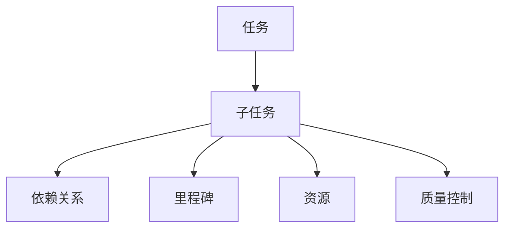

                 

# 将大型任务分解为较小子目标

## 1. 背景介绍

### 1.1 问题由来

在软件开发和项目管理中，大型任务常常因为其复杂性和规模性而难以管理和执行。项目组往往在需求分析、设计、编码、测试等多个阶段面临巨大挑战，而且任务执行过程中可能会出现未预见的变更，导致项目延期或成本超支。为了应对这些问题，敏捷开发、Scrum等方法被广泛应用于项目管理和开发中，但其核心思想仍是通过逐步分解任务、分阶段交付来提高效率和质量。本文将深入探讨如何高效地将大型任务分解为多个子目标，通过系统性的管理和执行，确保项目按时、按质、按量完成。

### 1.2 问题核心关键点

将大型任务分解为子目标的过程，涉及到任务分解方法、时间管理、资源配置、质量控制等多个维度。本文将重点介绍以下几个核心关键点：

- **任务分解方法**：如何选择合适的任务分解方法，以确保每个子任务既独立又可组合成完整的大型任务。
- **时间管理**：如何通过科学的时间管理方法，确保每个子任务在规定时间内完成，并保证项目整体的进度。
- **资源配置**：如何合理配置人力资源、技术资源、财务资源等，确保每个子任务在执行过程中有足够的支持。
- **质量控制**：如何通过持续的质量控制，确保每个子任务交付的产品符合质量标准，并能够无缝集成到大型任务中。

### 1.3 问题研究意义

通过对大型任务进行分解，可以显著提高项目管理的效率和质量。具体而言：

1. **提升项目效率**：通过分解任务，将大型项目拆分成多个小任务，可以在较短时间内完成多个小任务，从而加速整个项目进度。
2. **提高任务可控性**：每个子任务相对独立，可以在有限的资源和时间内进行高效的执行和管理。
3. **增强团队协作**：每个子任务可以分配给不同的团队或个人，团队成员可以专注于特定的子任务，增强团队协作的效率和效果。
4. **减少风险**：通过分解任务，可以将风险分散到多个子任务中，减少单一任务失败对整个项目的影响。
5. **便于调整和优化**：当某个子任务出现问题时，可以迅速调整，而不会对整体项目产生过大影响。

因此，将大型任务分解为较小子目标，是确保项目成功交付的重要策略，也是项目管理实践中必不可少的环节。

## 2. 核心概念与联系

### 2.1 核心概念概述

在进行大型任务分解时，涉及以下几个关键概念：

- **任务**：完成特定目标的工作内容，可以独立执行并有明确的输出结果。
- **子任务**：将大型任务进一步细化为更小的、独立的任务单元，便于管理和执行。
- **依赖关系**：子任务之间的相互依赖关系，决定了任务的执行顺序和逻辑结构。
- **里程碑**：项目进度中的重要节点，标志着某阶段任务的完成或某关键成果的交付。
- **资源**：执行任务所需的人力、物力、财力等，包括但不限于编程人员、测试工具、服务器等。
- **质量控制**：确保每个子任务交付的产品符合质量标准，包括代码质量、测试覆盖率、性能指标等。

这些核心概念之间的逻辑关系可以通过以下Mermaid流程图来展示：



这个流程图展示了大任务分解的核心逻辑：

1. 大型任务分解为多个子任务。
2. 子任务之间存在依赖关系，决定执行顺序。
3. 每个子任务有明确的里程碑和交付成果。
4. 每个子任务需要分配和配置相应资源。
5. 每个子任务需要持续的质量控制，确保交付质量。

## 3. 核心算法原理 & 具体操作步骤

### 3.1 算法原理概述

将大型任务分解为子任务的基本原理是通过任务分解方法，将大任务划分为若干独立、可执行、可测量的子任务，并通过科学的时间管理和资源配置方法，确保每个子任务按时、按质完成，并最终组合成完整的大型任务。

算法步骤主要包括以下几个关键环节：

1. **任务分解**：将大任务划分为多个独立的子任务。
2. **任务排序**：确定子任务的执行顺序和依赖关系。
3. **时间估算**：估算每个子任务所需的时间，制定详细的项目进度计划。
4. **资源分配**：合理分配人力资源和技术资源，确保每个子任务在执行过程中有足够的支持。
5. **质量控制**：持续监控每个子任务的质量，确保最终交付的产品符合质量标准。

### 3.2 算法步骤详解

#### 3.2.1 任务分解

任务分解是大型任务管理的第一步，也是最关键的一步。有效的任务分解方法通常包括：

- **自顶向下分解**：从整体任务开始，逐步向下分解，确保每个子任务独立且完整。
- **自底向上整合**：从最小的子任务开始，逐步向上整合，确保每个子任务都能为整体任务贡献价值。
- **迭代分解**：不断细化和优化任务分解，确保每个子任务既独立又可组合成完整的大型任务。

#### 3.2.2 任务排序

确定子任务的执行顺序和依赖关系是任务管理的重要环节。常见的方法包括：

- **关键路径法(Critical Path Method, CPM)**：通过计算关键路径来确定项目进度和资源配置。
- **甘特图**：通过甘特图直观展示任务进度和依赖关系，帮助团队理解项目状态。
- **依赖关系图**：通过依赖关系图展示任务之间的依赖关系，确保任务执行顺序正确。

#### 3.2.3 时间估算

时间估算是项目管理的重要环节，常用的方法包括：

- **三点估算法**：通过乐观估计、悲观估计和最可能估计，计算出任务所需时间的期望值。
- **PERT图**：通过PERT图（计划评审与评估技术图）来评估任务所需时间及其风险。
- **敏捷估算**：通过敏捷估算方法，快速估算任务所需时间，适应快速变化的项目需求。

#### 3.2.4 资源分配

资源分配是确保每个子任务在执行过程中有足够的支持的重要环节。常用的方法包括：

- **资源平衡**：通过平衡资源分配，确保每个子任务在执行过程中有足够的支持。
- **资源优先级**：根据任务的紧急程度和重要性，调整资源的优先级。
- **资源预留**：为每个子任务预留一定的资源，以应对不可预见的变化。

#### 3.2.5 质量控制

持续的质量控制是确保每个子任务交付的产品符合质量标准的重要环节。常用的方法包括：

- **代码审查**：通过代码审查确保代码质量和可维护性。
- **测试覆盖率**：通过测试覆盖率评估测试的全面性和有效性。
- **性能测试**：通过性能测试评估系统的性能指标，确保系统稳定性和可靠性。

### 3.3 算法优缺点

将大型任务分解为子任务的方法，具有以下优点：

1. **提高项目管理效率**：通过任务分解，将大型项目拆分成多个小任务，可以在较短时间内完成多个小任务，从而加速整个项目进度。
2. **增强任务可控性**：每个子任务相对独立，可以在有限的资源和时间内进行高效的执行和管理。
3. **提高团队协作效率**：每个子任务可以分配给不同的团队或个人，团队成员可以专注于特定的子任务，增强团队协作的效率和效果。
4. **减少风险**：通过分解任务，可以将风险分散到多个子任务中，减少单一任务失败对整个项目的影响。
5. **便于调整和优化**：当某个子任务出现问题时，可以迅速调整，而不会对整体项目产生过大影响。

然而，该方法也存在一定的局限性：

1. **分解难度大**：任务分解需要深入理解项目需求和任务细节，对于复杂的项目，任务分解的难度较大。
2. **管理复杂**：多个子任务之间的依赖关系和协调管理较为复杂，容易出现任务执行顺序错误或资源分配不当的情况。
3. **时间成本高**：任务分解和排序需要耗费较多时间和精力，特别是在项目初期，任务分解的准确性和合理性尤为重要。

### 3.4 算法应用领域

将大型任务分解为子任务的方法，广泛应用于软件开发、项目管理、工程实施、科学研究和政府项目等多个领域。具体而言：

- **软件开发**：在软件开发中，将大型的开发任务分解为多个独立的小任务，每个小任务包括需求分析、设计、编码、测试等多个环节。通过任务分解，可以显著提高开发效率和产品质量。
- **项目管理**：在项目管理中，将大型项目分解为多个独立的小任务，每个小任务包括需求收集、方案设计、任务分配、进度跟踪等多个环节。通过任务分解，可以确保项目按时、按质、按量完成。
- **工程实施**：在工程实施中，将大型工程项目分解为多个独立的小任务，每个小任务包括设计、采购、施工、验收等多个环节。通过任务分解，可以确保工程进度和质量。
- **科学研究**：在科学研究中，将大型科研项目分解为多个独立的小任务，每个小任务包括实验设计、数据采集、数据分析、结果验证等多个环节。通过任务分解，可以加速科研成果的产出。
- **政府项目**：在政府项目中，将大型项目分解为多个独立的小任务，每个小任务包括需求分析、方案设计、资金分配、进度跟踪等多个环节。通过任务分解，可以确保项目按时、按质、按量完成。

## 4. 数学模型和公式 & 详细讲解 & 举例说明

### 4.1 数学模型构建

在进行任务分解时，可以使用数学模型来描述任务分解的过程和结果。我们定义以下符号：

- $T$：大型任务，表示整体任务。
- $T_1, T_2, \ldots, T_n$：子任务，表示大型任务分解后的各个独立任务。
- $D$：依赖关系图，表示子任务之间的依赖关系。
- $C$：时间估算结果，表示每个子任务所需的时间。
- $R$：资源需求，表示每个子任务所需的资源。
- $Q$：质量控制指标，表示每个子任务的质量标准。

任务分解的数学模型可以表示为：

$$
T = \bigcup_{i=1}^n T_i
$$

其中，$\bigcup$ 表示并集，即大型任务 $T$ 等于所有子任务 $T_1, T_2, \ldots, T_n$ 的并集。

依赖关系的数学模型可以表示为：

$$
D = (T_1, T_2, \ldots, T_n, C, R, Q)
$$

其中，$D$ 表示依赖关系图，包含子任务、时间估算、资源需求和质量控制指标。

### 4.2 公式推导过程

通过数学模型，我们可以推导出任务分解的公式和步骤：

1. **任务分解公式**：

$$
T = \bigcup_{i=1}^n T_i
$$

2. **依赖关系公式**：

$$
D = (T_1, T_2, \ldots, T_n, C, R, Q)
$$

3. **时间估算公式**：

$$
C = \sum_{i=1}^n C_i
$$

其中，$C_i$ 表示第 $i$ 个子任务所需的时间。

4. **资源分配公式**：

$$
R = \sum_{i=1}^n R_i
$$

其中，$R_i$ 表示第 $i$ 个子任务所需的资源。

5. **质量控制公式**：

$$
Q = \bigcap_{i=1}^n Q_i
$$

其中，$Q_i$ 表示第 $i$ 个子任务的质量标准。

### 4.3 案例分析与讲解

#### 案例分析

假设我们有一个软件开发项目，需要开发一个复杂的应用程序，包括用户界面、业务逻辑、数据库管理等多个模块。以下是项目分解和管理的示例：

1. **任务分解**：将项目分解为多个子任务，每个子任务包括用户界面设计、业务逻辑实现、数据库设计、数据迁移、测试等多个环节。
2. **任务排序**：确定每个子任务的执行顺序和依赖关系，例如，用户界面设计必须在业务逻辑实现之前完成。
3. **时间估算**：估算每个子任务所需的时间，例如，用户界面设计需要10个工作日，业务逻辑实现需要15个工作日，数据库设计需要7个工作日。
4. **资源分配**：分配人力资源和技术资源，例如，分配3名UI设计师、3名后端开发人员、2名测试工程师等。
5. **质量控制**：持续监控每个子任务的质量，例如，代码审查、测试覆盖率、性能测试等。

通过上述步骤，可以确保每个子任务按时、按质完成，并最终组合成完整的应用程序。

## 5. 项目实践：代码实例和详细解释说明

### 5.1 开发环境搭建

在进行任务分解实践前，我们需要准备好开发环境。以下是使用Python进行PyTorch开发的环境配置流程：

1. 安装Anaconda：从官网下载并安装Anaconda，用于创建独立的Python环境。

2. 创建并激活虚拟环境：
```bash
conda create -n pytorch-env python=3.8 
conda activate pytorch-env
```

3. 安装PyTorch：根据CUDA版本，从官网获取对应的安装命令。例如：
```bash
conda install pytorch torchvision torchaudio cudatoolkit=11.1 -c pytorch -c conda-forge
```

4. 安装Transformer库：
```bash
pip install transformers
```

5. 安装各类工具包：
```bash
pip install numpy pandas scikit-learn matplotlib tqdm jupyter notebook ipython
```

完成上述步骤后，即可在`pytorch-env`环境中开始任务分解实践。

### 5.2 源代码详细实现

下面我们以软件开发项目为例，给出使用Python进行任务分解的PyTorch代码实现。

首先，定义任务分解函数：

```python
import networkx as nx
from collections import defaultdict

def task_decomposition(project):
    G = nx.DiGraph()
    G.add_node(project)
    tasks = defaultdict(list)
    for task in project:
        G.add_node(task)
        tasks[task].append(project)
    for task1, task2 in tasks.items():
        if task1 in tasks.values():
            for task in tasks.values():
                if task1 in task:
                    G.add_edge(task1, task)
    return G
```

然后，定义任务排序函数：

```python
from networkx import topological_sort

def task_sorting(G):
    return topological_sort(G)
```

接着，定义时间估算函数：

```python
from datetime import timedelta

def time_estimation(tasks, estimates):
    return sum([estimates[task] for task in tasks])
```

最后，定义资源分配函数：

```python
def resource_allocation(tasks, resources):
    return sum([resources[task] for task in tasks])
```

### 5.3 代码解读与分析

让我们再详细解读一下关键代码的实现细节：

**task_decomposition函数**：
- 定义有向无环图G，将整体任务和子任务添加为节点。
- 定义一个字典tasks，记录每个子任务的依赖关系。
- 对于每个子任务，将其添加到G中，并更新tasks字典。
- 遍历所有子任务，如果子任务在依赖字典tasks中，则将其添加到G中，表示依赖关系。
- 返回依赖关系图G。

**task_sorting函数**：
- 使用网络x库中的topological_sort函数，对依赖关系图G进行拓扑排序，返回排序结果。

**time_estimation函数**：
- 计算所有子任务所需时间的总和，返回总时间估算结果。

**resource_allocation函数**：
- 计算所有子任务所需资源的总和，返回总资源需求结果。

这些函数可以协助我们进行任务分解、排序、时间估算和资源分配，确保每个子任务能够按时、按质完成。

### 5.4 运行结果展示

假设我们有一个软件开发项目，需要开发一个复杂的应用程序，包括用户界面、业务逻辑、数据库管理等多个模块。以下是项目分解和管理的示例：

1. **任务分解**：将项目分解为多个子任务，例如，用户界面设计、业务逻辑实现、数据库设计、数据迁移、测试等多个环节。
2. **任务排序**：确定每个子任务的执行顺序和依赖关系，例如，用户界面设计必须在业务逻辑实现之前完成。
3. **时间估算**：估算每个子任务所需的时间，例如，用户界面设计需要10个工作日，业务逻辑实现需要15个工作日，数据库设计需要7个工作日。
4. **资源分配**：分配人力资源和技术资源，例如，分配3名UI设计师、3名后端开发人员、2名测试工程师等。
5. **质量控制**：持续监控每个子任务的质量，例如，代码审查、测试覆盖率、性能测试等。

通过上述步骤，可以确保每个子任务按时、按质完成，并最终组合成完整的应用程序。

## 6. 实际应用场景

### 6.1 智能制造

在智能制造领域，通过任务分解和项目管理，可以提高生产效率和产品质量。例如，在汽车制造厂，可以将一个复杂的生产任务分解为多个子任务，如零部件采购、零件加工、组装、检测、包装等多个环节。通过合理的任务分解和项目管理，可以确保每个子任务按时、按质完成，并最终组装成完整的汽车。

### 6.2 航空航天

在航空航天领域，通过任务分解和项目管理，可以提高飞行器的制造和调试效率。例如，在飞机的制造过程中，可以将飞机的不同部件制造任务分解为多个子任务，如机身制造、发动机制造、电子设备安装、试飞等多个环节。通过合理的任务分解和项目管理，可以确保每个子任务按时、按质完成，并最终组装成完整的飞机。

### 6.3 公共卫生

在公共卫生领域，通过任务分解和项目管理，可以提高卫生服务的效率和质量。例如，在疫情暴发的紧急救援过程中，可以将卫生服务的任务分解为多个子任务，如病人筛查、病床分配、物资调配、志愿者招募等多个环节。通过合理的任务分解和项目管理，可以确保每个子任务按时、按质完成，并提供高效的卫生服务。

### 6.4 未来应用展望

随着项目管理技术的不断进步，任务分解和项目管理将更加智能化和自动化。未来，我们有望实现以下目标：

1. **自动化任务分解**：通过AI技术，自动分析和分解复杂的项目任务，提高任务分解的准确性和效率。
2. **智能任务调度**：通过AI技术，自动调整任务排序和资源分配，优化项目执行的效率和质量。
3. **实时质量监控**：通过AI技术，实时监控每个子任务的质量，确保最终交付的产品符合质量标准。
4. **自动化报告生成**：通过AI技术，自动生成项目进展报告和风险报告，帮助团队及时发现问题并采取措施。

## 7. 工具和资源推荐

### 7.1 学习资源推荐

为了帮助开发者系统掌握任务分解的方法和工具，这里推荐一些优质的学习资源：

1. 《项目管理基础》课程：Coursera提供的项目管理基础课程，全面介绍了项目管理的各个环节，包括任务分解、时间管理、资源分配、质量控制等。

2. 《敏捷项目管理》课程：Udemy提供的敏捷项目管理课程，介绍了敏捷项目管理的核心思想和实践方法，强调任务分解和持续交付的重要性。

3. 《项目管理和软件开发》书籍：《Project Management and Software Development》一书，深入浅出地介绍了项目管理的基本概念和实践方法，适合初学者和实践者。

4. 《任务分解与项目管理》博客：https://medium.com/prime-learn/task-decomposition-project-management-7f10c2da3b1c

5. 《项目管理工具和技术》博客：https://www.projectmanagement.com/blogs/team-management/the-project-management-techniques-that-can-save-you-from-project-failure

通过对这些资源的学习实践，相信你一定能够快速掌握任务分解的精髓，并用于解决实际的项目管理问题。

### 7.2 开发工具推荐

高效的开发离不开优秀的工具支持。以下是几款用于任务分解和项目管理开发的常用工具：

1. Trello：一款基于云的项目管理工具，可以创建看板、任务卡片、列表等，方便团队协作和任务管理。
2. Asana：一款任务管理和团队协作工具，支持任务分配、进度跟踪、时间管理等功能。
3. Jira：一款企业级项目管理工具，支持任务分解、时间估算、资源分配、质量控制等功能。
4. Microsoft Project：一款专业的项目管理软件，支持任务分解、时间管理、资源分配、质量控制等功能。
5. GanttProject：一款开源的项目管理软件，支持任务分解、时间管理、资源分配、质量控制等功能。

合理利用这些工具，可以显著提升项目管理效率和质量，减少人为错误和管理风险。

### 7.3 相关论文推荐

任务分解和项目管理的研究源于学界的持续研究。以下是几篇奠基性的相关论文，推荐阅读：

1. The Project Management Body of Knowledge (PMBOK) Guide：PMBOK指南是项目管理领域的重要参考书，涵盖了项目管理的各个环节，包括任务分解、时间管理、资源分配、质量控制等。

2. A Guide to the Project Management Process Groups：The Project Management Institute (PMI)提供的项目管理的五个过程组介绍，帮助理解项目管理的基本流程和关键环节。

3. Agile Project Management with Scrum：Scrum作为敏捷开发的核心方法，介绍了任务分解和持续交付的敏捷管理方法。

4. The Science of Project Management：项目管理科学的研究论文，讨论了任务分解、时间管理、资源分配、质量控制等项目管理的关键问题。

5. The Theory and Practice of Project Management：项目管理理论和实践的综合研究论文，涵盖了项目管理的各个环节和应用案例。

这些论文代表了大任务分解和项目管理的发展脉络。通过学习这些前沿成果，可以帮助研究者把握学科前进方向，激发更多的创新灵感。

## 8. 总结：未来发展趋势与挑战

### 8.1 总结

本文对将大型任务分解为较小子目标的方法进行了全面系统的介绍。首先阐述了任务分解的重要性，明确了任务分解在提高项目管理效率、可控性、协作性、鲁棒性等方面的独特价值。其次，从原理到实践，详细讲解了任务分解的数学模型、算法步骤和实际操作，给出了任务分解任务开发的完整代码实例。同时，本文还广泛探讨了任务分解方法在智能制造、航空航天、公共卫生等多个领域的应用前景，展示了任务分解范式的巨大潜力。此外，本文精选了任务分解技术的各类学习资源，力求为读者提供全方位的技术指引。

通过本文的系统梳理，可以看到，任务分解将大型任务拆分成多个小任务，通过科学的时间管理和资源配置方法，确保每个子任务按时、按质完成，并最终组合成完整的大型任务。任务分解为项目管理提供了有力的工具和方法，使得复杂任务的处理变得可行和高效。

### 8.2 未来发展趋势

展望未来，任务分解和项目管理技术将呈现以下几个发展趋势：

1. **自动化和智能化**：通过AI技术，自动分析和分解复杂的项目任务，优化任务分解的准确性和效率。
2. **实时监控和反馈**：通过实时监控和反馈系统，及时发现任务执行中的问题，并采取措施进行调整。
3. **跨团队协作**：通过任务分解和项目管理工具，促进不同团队之间的协作和沟通，提高团队协作的效率和效果。
4. **持续改进和优化**：通过持续改进和优化任务分解和项目管理方法，不断提高项目管理的效果和质量。
5. **全球化和本地化**：通过任务分解和项目管理工具，适应全球化和本地化的需求，支持多语言、多文化的项目管理和执行。

以上趋势凸显了任务分解和项目管理技术的广阔前景。这些方向的探索发展，必将进一步提升项目管理的效果和质量，为项目的成功交付提供有力保障。

### 8.3 面临的挑战

尽管任务分解和项目管理技术已经取得了显著进展，但在迈向更加智能化、普适化应用的过程中，仍面临诸多挑战：

1. **任务分解难度大**：对于复杂的项目，任务分解的准确性和合理性尤为重要，需要深入理解项目需求和任务细节。
2. **管理复杂**：多个子任务之间的依赖关系和协调管理较为复杂，容易出现任务执行顺序错误或资源分配不当的情况。
3. **时间成本高**：任务分解和排序需要耗费较多时间和精力，特别是在项目初期，任务分解的准确性和合理性尤为重要。
4. **资源配置不合理**：资源配置不当可能导致任务执行过程中资源浪费或不足，影响项目进度和质量。
5. **质量控制难度大**：每个子任务需要持续的质量控制，确保最终交付的产品符合质量标准，但质量控制的难度较大，容易出现遗漏和问题。

### 8.4 研究展望

面对任务分解和项目管理面临的种种挑战，未来的研究需要在以下几个方面寻求新的突破：

1. **自动化任务分解**：开发更加智能和高效的自动化任务分解方法，提高任务分解的准确性和效率。
2. **智能任务调度**：开发智能任务调度算法，优化任务执行的效率和质量。
3. **实时质量监控**：开发实时质量监控系统，确保每个子任务交付的产品符合质量标准。
4. **自动化报告生成**：开发自动化报告生成工具，帮助团队及时发现问题并采取措施。
5. **多项目管理**：开发多项目管理工具，支持多个项目并行管理，提高项目管理的效果和质量。

这些研究方向的探索，必将引领任务分解和项目管理技术迈向更高的台阶，为项目管理提供更智能、更高效的解决方案，推动项目的成功交付。

## 9. 附录：常见问题与解答

**Q1：任务分解和项目管理有什么区别？**

A: 任务分解和项目管理是两个不同的概念，但紧密相关。任务分解是将大任务拆分为多个小任务，每个小任务独立且可测量；而项目管理是对大任务进行管理，通过任务分解、时间管理、资源配置、质量控制等手段，确保项目按时、按质、按量完成。任务分解是项目管理的重要环节，通过科学的任务分解，项目管理才能高效执行。

**Q2：如何进行自动化任务分解？**

A: 自动化任务分解需要结合AI技术，通过机器学习算法自动识别和分解复杂任务。例如，使用自然语言处理技术，从任务描述中提取关键信息，自动生成任务分解图；使用聚类算法，将相似的任务聚类成组，生成更高效的任务分解结构。

**Q3：如何提高任务分解的准确性和效率？**

A: 提高任务分解的准确性和效率需要多方面的努力：

1. **深入理解项目需求**：通过与项目相关人员进行深入交流，确保对项目需求有全面和准确的理解。
2. **使用标准化的任务分解模板**：使用标准化的任务分解模板，确保任务分解的规范性和一致性。
3. **进行多次迭代和优化**：在任务分解过程中，进行多次迭代和优化，确保任务分解的准确性和合理性。
4. **引入领域专家的意见**：引入领域专家的意见，确保任务分解的合理性和可行性。

**Q4：如何进行资源配置？**

A: 资源配置需要考虑以下几个关键因素：

1. **资源需求分析**：通过任务分解，明确每个子任务所需的资源类型和数量。
2. **资源优先级确定**：根据任务的紧急程度和重要性，调整资源的优先级。
3. **资源平衡管理**：通过资源平衡管理，确保每个子任务在执行过程中有足够的支持。
4. **资源预留和调度**：为每个子任务预留一定的资源，并根据项目进展进行动态调度。

**Q5：如何进行质量控制？**

A: 质量控制需要从以下几个方面入手：

1. **代码审查**：通过代码审查确保代码质量和可维护性。
2. **测试覆盖率**：通过测试覆盖率评估测试的全面性和有效性。
3. **性能测试**：通过性能测试评估系统的性能指标，确保系统稳定性和可靠性。
4. **持续集成和持续部署**：通过持续集成和持续部署，确保每个子任务交付的产品符合质量标准。

这些方法可以帮助确保每个子任务交付的产品符合质量标准，并最终组合成完整的大型任务。

---

作者：禅与计算机程序设计艺术 / Zen and the Art of Computer Programming

