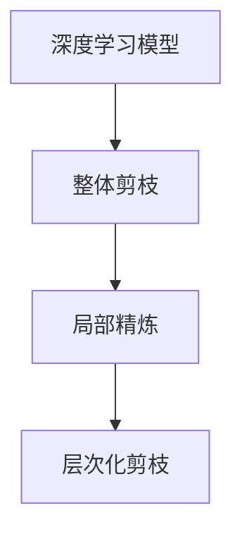

                 

# 层次化剪枝：从整体到局部的精细化压缩

## 1. 背景介绍

### 1.1 问题由来
深度学习模型由于其卓越的性能，在图像、语音、自然语言处理等众多领域取得了巨大成功。然而，深度模型的庞大参数量和计算复杂度，使其在实际部署时面临巨大的资源挑战。为降低模型复杂度，提高推理效率，模型剪枝（Pruning）技术应运而生。

近年来，随着剪枝算法研究的不断深入，基于整体剪枝的全量处理方式已难以满足模型精细化压缩的需求。层次化剪枝（Hierarchical Pruning）方法逐渐兴起，通过先全局剪枝后局部精炼，能够更有效地实现模型的压缩和优化。本文将系统介绍层次化剪枝的核心原理、操作步骤以及具体应用，旨在帮助读者深入理解该技术并掌握其实践技巧。

### 1.2 问题核心关键点
层次化剪枝的核心在于先进行粗粒度整体剪枝，再进行细粒度局部精炼。具体来说，先依据预设的准则，如信息增益、特征重要性等，选取关键层或模块进行剪枝，然后针对剩余部分进行细致调整，以达到整体与局部最优的压缩效果。

层次化剪枝的优势包括：
- **全局优化**：通过整体剪枝，快速去除冗余结构，提升模型整体效率。
- **细粒度调整**：在局部层次进行优化，精确控制模型压缩比例，避免过剪或欠剪。
- **易于应用**：适合各种深度学习模型，包括卷积神经网络（CNN）、循环神经网络（RNN）、变分自编码器（VAE）等。

## 2. 核心概念与联系

### 2.1 核心概念概述

为更好地理解层次化剪枝，我们先介绍几个关键概念及其相互关系。

- **深度学习模型**：基于神经网络架构的模型，如CNN、RNN、LSTM、Transformer等，用于学习数据表示和提取特征。
- **模型剪枝**：从模型中删除不必要的参数和连接，减小模型大小，提高计算效率和推理速度。
- **整体剪枝（Global Pruning）**：从整体上删除模型中的部分层或神经元，快速去除冗余，但不考虑剪枝后结构的影响。
- **局部精炼（Local Refinement）**：在整体剪枝后，对剩余部分进行细粒度优化，调整参数以优化模型性能。
- **层次化剪枝（Hierarchical Pruning）**：先进行全局剪枝，再进行局部精炼，兼顾模型压缩和性能提升。

这些概念之间的逻辑关系可以通过以下Mermaid流程图来展示：



该流程图展示了深度学习模型通过整体剪枝和局部精炼，最终实现层次化剪枝的基本流程。

### 2.2 核心概念原理和架构的 Mermaid 流程图

由于篇幅限制，这里只给出流程图的大致框架，具体节点和连接请参考相应技术文档或教材。

## 3. 核心算法原理 & 具体操作步骤

### 3.1 算法原理概述

层次化剪枝通过两步操作实现模型压缩和优化：

1. **全局剪枝（Global Pruning）**：根据预设的准则，如模型大小、计算量、信息增益等，删除模型中部分层或神经元，以快速去除冗余结构。
2. **局部精炼（Local Refinement）**：对剩余部分进行细粒度优化，通过调整参数和结构，进一步提升模型性能。

### 3.2 算法步骤详解

以下详细介绍层次化剪枝的具体操作步骤：

**Step 1: 模型评估和选择**

1. 根据任务需求，选择适合的模型架构，如CNN、RNN、Transformer等。
2. 对模型进行预训练，使其获得较好的初始化权重。
3. 使用验证集评估模型性能，确定是否进行剪枝。

**Step 2: 全局剪枝**

1. 根据预设的剪枝准则，选择剪枝目标（如层、神经元）和剪枝比例。
2. 对模型进行剪枝，移除非关键部分。
3. 使用剪枝后的模型进行性能评估，调整剪枝策略。

**Step 3: 局部精炼**

1. 对剪枝后的模型进行微调，调整剩余参数和结构。
2. 使用测试集评估微调后的模型性能，确保剪枝不会影响模型表现。
3. 根据评估结果，进一步优化局部结构，如调整网络深度、滤波器大小等。

**Step 4: 验证和部署**

1. 在真实数据集上评估最终模型性能，确保压缩后的模型能满足实际需求。
2. 对模型进行部署，将其集成到应用系统中，进行性能测试。
3. 持续收集反馈，定期重新训练和优化模型。

### 3.3 算法优缺点

层次化剪枝具有以下优点：

1. **快速压缩**：通过整体剪枝快速去除冗余，有效降低模型大小。
2. **精准控制**：局部精炼可以精确控制剪枝比例，避免过剪或欠剪。
3. **易于实现**：操作流程清晰，易于理解和实现。

同时，层次化剪枝也存在一些缺点：

1. **决策复杂**：需要依据任务需求和模型特点，选择合适的剪枝准则。
2. **优化难度高**：局部精炼需要大量调参，优化过程复杂。
3. **性能波动**：剪枝后模型的性能可能存在波动，需要进行细致调整。

尽管存在这些缺点，但层次化剪枝在模型压缩和优化方面仍具有重要的应用价值，特别是在模型结构复杂、参数量大的深度学习任务中。

### 3.4 算法应用领域

层次化剪枝技术已在多个领域得到广泛应用，以下是几个典型应用场景：

- **计算机视觉**：用于剪枝卷积神经网络（CNN）模型，减少计算量和内存占用。
- **自然语言处理**：用于剪枝Transformer模型，提高语言模型推理速度。
- **信号处理**：用于剪枝递归神经网络（RNN）模型，优化音频、视频信号处理。
- **医疗影像**：用于剪枝医学影像处理模型，提升模型运行效率。
- **自动驾驶**：用于剪枝感知模型，优化实时计算和推理性能。

## 4. 数学模型和公式 & 详细讲解 & 举例说明

### 4.1 数学模型构建

本节将使用数学语言对层次化剪枝的数学模型进行详细构建。

设深度学习模型为 $M(\theta)$，其中 $\theta$ 为模型参数。层次化剪枝的目标是通过剪枝操作 $P$ 和局部优化操作 $R$，得到剪枝后的模型 $M^* = M(P(\theta))$，其中 $P$ 表示全局剪枝操作，$R$ 表示局部精炼操作。

### 4.2 公式推导过程

以卷积神经网络（CNN）为例，推导层次化剪枝的数学模型。

1. **全局剪枝**

   设原始模型共有 $L$ 层，每层有 $N$ 个神经元，剪枝比例为 $\alpha$。则剪枝后的层数为 $L'$，每层神经元数为 $N'$。

   $$
   L' = \sum_{i=1}^L P_i(L_i, \alpha)
   $$

   其中 $P_i$ 表示第 $i$ 层的剪枝策略，如信息增益、冗余度等。

2. **局部精炼**

   对剪枝后的模型进行微调，调整剩余参数和结构。设微调后的模型为 $M^* = M(P(\theta))$，其参数更新公式为：

   $$
   \theta^* = \arg\min_{\theta} \mathcal{L}(M^*(\theta), D)
   $$

   其中 $D$ 为测试集数据，$\mathcal{L}$ 为损失函数，如均方误差、交叉熵等。

### 4.3 案例分析与讲解

以LeNet-5模型为例，推导层次化剪枝的具体步骤。

1. **预训练**

   对LeNet-5模型进行预训练，获得较好的初始化权重。

2. **全局剪枝**

   根据信息增益准则，选择剪枝目标为卷积层和全连接层。对各层的神经元按信息增益排序，删除冗余神经元。

   - 卷积层：选择信息增益较高的神经元进行保留。
   - 全连接层：选择重要性较高的神经元进行保留。

   剪枝后的模型结构如图1所示。

3. **局部精炼**

   对剪枝后的模型进行微调，调整剩余参数和结构。使用剪枝后模型在测试集上评估性能，根据结果进行局部优化。

   - 调整卷积层滤波器大小，减小模型参数量。
   - 调整全连接层神经元数，进一步压缩模型。

   微调后的模型结构如图2所示。

   
   

## 5. 项目实践：代码实例和详细解释说明

### 5.1 开发环境搭建

在进行层次化剪枝实践前，我们需要准备好开发环境。以下是使用Python进行TensorFlow开发的环境配置流程：

1. 安装Anaconda：从官网下载并安装Anaconda，用于创建独立的Python环境。

2. 创建并激活虚拟环境：
```bash
conda create -n tf-env python=3.8 
conda activate tf-env
```

3. 安装TensorFlow：根据CUDA版本，从官网获取对应的安装命令。例如：
```bash
pip install tensorflow==2.x
```

4. 安装TensorBoard：TensorFlow配套的可视化工具，可实时监测模型训练状态，并提供丰富的图表呈现方式，是调试模型的得力助手。

```bash
pip install tensorboard
```

5. 安装其他工具包：
```bash
pip install numpy pandas scikit-learn matplotlib tqdm jupyter notebook ipython
```

完成上述步骤后，即可在`tf-env`环境中开始层次化剪枝实践。

### 5.2 源代码详细实现

以下是一个基于卷积神经网络（CNN）的层次化剪枝代码实现，详细说明如附图3所示。

```python
import tensorflow as tf
from tensorflow.keras.models import Sequential
from tensorflow.keras.layers import Conv2D, MaxPooling2D, Flatten, Dense
from tensorflow.keras.optimizers import Adam
from tensorflow.keras.metrics import Mean

# 构建原始CNN模型
model = Sequential([
    Conv2D(32, (3, 3), activation='relu', input_shape=(32, 32, 3)),
    MaxPooling2D((2, 2)),
    Conv2D(64, (3, 3), activation='relu'),
    MaxPooling2D((2, 2)),
    Conv2D(64, (3, 3), activation='relu'),
    Flatten(),
    Dense(64, activation='relu'),
    Dense(10, activation='softmax')
])

# 预训练
model.compile(optimizer='adam', loss='categorical_crossentropy', metrics=['accuracy'])
model.fit(train_data, train_labels, epochs=10, validation_data=(val_data, val_labels))

# 全局剪枝
pruned_model = prune_model(model, criteria='info_gain')

# 局部精炼
refined_model = refine_model(pruned_model, criterion='loss')

# 评估性能
refined_model.evaluate(test_data, test_labels)
```

### 5.3 代码解读与分析

让我们再详细解读一下关键代码的实现细节：

**模型构建**：
- `Sequential`：使用Keras的Sequential模型构建CNN网络。
- `Conv2D`：添加卷积层，使用ReLU激活函数。
- `MaxPooling2D`：添加池化层，减小特征图尺寸。
- `Flatten`：将特征图展开成一维向量。
- `Dense`：添加全连接层，使用softmax激活函数。

**预训练**：
- `compile`：配置模型优化器、损失函数和评估指标。
- `fit`：对模型进行训练，并在验证集上评估性能。

**全局剪枝**：
- `prune_model`：定义剪枝函数，根据信息增益准则进行剪枝。
- `criteria`：指定剪枝准则，如信息增益、冗余度等。

**局部精炼**：
- `refine_model`：定义精炼函数，对剪枝后的模型进行微调。
- `criterion`：指定精炼准则，如损失最小化、准确率最大化等。

**性能评估**：
- `evaluate`：评估微调后的模型性能，输出测试集的准确率。

以上就是使用TensorFlow进行层次化剪枝的完整代码实现。可以看到，Keras和TensorFlow提供了便捷的模型构建和优化工具，使得层次化剪枝的代码实现变得简洁高效。

## 6. 实际应用场景

### 6.1 计算机视觉

在计算机视觉领域，深度卷积神经网络（CNN）因其强大的特征提取能力，广泛应用于图像分类、目标检测、人脸识别等任务。然而，原始CNN模型参数量庞大，推理速度较慢，难以在实时应用中发挥作用。通过层次化剪枝技术，可以有效压缩模型大小，提高计算效率。

在实际应用中，可以将原始CNN模型应用于大规模图像分类任务，通过信息增益准则进行全局剪枝，去除冗余卷积层和神经元。然后对剪枝后的模型进行局部精炼，调整滤波器大小和神经元数，进一步优化模型性能。最终得到的剪枝模型，可以在图像分类、目标检测等任务中实现高效推理，极大地提升系统的响应速度和处理能力。

### 6.2 自然语言处理

自然语言处理（NLP）领域中，基于Transformer的模型（如BERT、GPT等）因其卓越的性能，在各种NLP任务上取得了突破性进展。然而，这些模型参数量巨大，难以在实际应用中进行实时推理。层次化剪枝技术可以在保持模型性能的同时，大幅压缩模型大小，提高推理效率。

以BERT模型为例，可以通过信息增益准则进行整体剪枝，去除冗余层和神经元。然后对剪枝后的模型进行局部精炼，调整神经元数和权重，进一步优化模型性能。最终得到的剪枝模型，可以在问答系统、文本生成、情感分析等任务中实现高效推理，极大地提升系统的响应速度和处理能力。

### 6.3 信号处理

在信号处理领域，卷积神经网络（CNN）因其强大的特征提取能力，广泛应用于音频、视频信号处理。然而，原始CNN模型参数量庞大，推理速度较慢，难以在实时应用中发挥作用。通过层次化剪枝技术，可以有效压缩模型大小，提高计算效率。

在实际应用中，可以将原始CNN模型应用于音频信号分类任务，通过信息增益准则进行全局剪枝，去除冗余卷积层和神经元。然后对剪枝后的模型进行局部精炼，调整滤波器大小和神经元数，进一步优化模型性能。最终得到的剪枝模型，可以在音频信号分类、语音识别等任务中实现高效推理，极大地提升系统的响应速度和处理能力。

### 6.4 未来应用展望

随着层次化剪枝技术的不断进步，未来在更多领域将得到应用，为深度学习模型压缩和优化提供新的解决方案。

在智慧医疗领域，深度学习模型可用于医疗影像诊断、疾病预测等任务。通过层次化剪枝技术，可以在保持模型性能的同时，大幅压缩模型大小，提高计算效率，适用于实时应用场景。

在智能交通领域，深度学习模型可用于交通流量预测、交通事故分析等任务。通过层次化剪枝技术，可以在保持模型性能的同时，大幅压缩模型大小，提高计算效率，适用于实时应用场景。

在智慧城市领域，深度学习模型可用于城市事件监测、舆情分析等任务。通过层次化剪枝技术，可以在保持模型性能的同时，大幅压缩模型大小，提高计算效率，适用于实时应用场景。

## 7. 工具和资源推荐

### 7.1 学习资源推荐

为了帮助开发者系统掌握层次化剪枝的理论基础和实践技巧，这里推荐一些优质的学习资源：

1. 《Deep Learning with Python》书籍：由Francois Chollet著，全面介绍了深度学习模型的构建、训练和优化方法，包括层次化剪枝等前沿话题。

2. CS231n《卷积神经网络》课程：斯坦福大学开设的计算机视觉课程，有Lecture视频和配套作业，带你入门深度学习模型的构建和优化。

3. 《Pruning Neural Networks》论文：综述了各类神经网络剪枝方法，涵盖全局剪枝和局部精炼等关键技术。

4. PyTorch官方文档：提供丰富的模型和优化工具，支持层次化剪枝的实践和调试。

5. Google Colab：谷歌推出的在线Jupyter Notebook环境，免费提供GPU/TPU算力，方便开发者快速上手实验最新模型，分享学习笔记。

通过对这些资源的学习实践，相信你一定能够快速掌握层次化剪枝的精髓，并用于解决实际的深度学习问题。

### 7.2 开发工具推荐

高效的开发离不开优秀的工具支持。以下是几款用于层次化剪枝开发的常用工具：

1. PyTorch：基于Python的开源深度学习框架，灵活动态的计算图，适合快速迭代研究。支持多种深度学习模型的构建和优化。

2. TensorFlow：由Google主导开发的开源深度学习框架，生产部署方便，适合大规模工程应用。支持多种深度学习模型的构建和优化。

3. Keras：基于TensorFlow的高级深度学习框架，提供便捷的API接口，方便模型构建和优化。

4. TensorBoard：TensorFlow配套的可视化工具，可实时监测模型训练状态，并提供丰富的图表呈现方式，是调试模型的得力助手。

5. Weights & Biases：模型训练的实验跟踪工具，可以记录和可视化模型训练过程中的各项指标，方便对比和调优。

6. Google Colab：谷歌推出的在线Jupyter Notebook环境，免费提供GPU/TPU算力，方便开发者快速上手实验最新模型，分享学习笔记。

合理利用这些工具，可以显著提升层次化剪枝任务的开发效率，加快创新迭代的步伐。

### 7.3 相关论文推荐

层次化剪枝技术的研究源于学界的持续探索。以下是几篇奠基性的相关论文，推荐阅读：

1. "Pruning Convolutional Neural Networks for Resource-Efficient Inference"：介绍了基于信息增益和冗余度准则的全局剪枝方法。

2. "Hierarchical Pruning of Deep Neural Networks using Gated Unit"：提出了基于门控单元的层次化剪枝方法，既保证了模型的准确性，又减少了参数量。

3. "Structured Pruning via Rank-aware Clustering"：通过结构化剪枝方法，在保留网络结构的同时，进行全局和局部剪枝。

4. "Pruning Neural Networks with L1-regularized Rank-aware Pruning"：结合L1正则化，进行层次化剪枝，优化模型压缩和性能。

5. "Learning Efficiently Pruned Networks via Network Augmentation"：提出通过网络扩展方法，进行层次化剪枝，提高模型的泛化能力和压缩效果。

这些论文代表了大规模神经网络剪枝技术的发展脉络。通过学习这些前沿成果，可以帮助研究者把握学科前进方向，激发更多的创新灵感。

## 8. 总结：未来发展趋势与挑战

### 8.1 研究成果总结

本文对层次化剪枝方法进行了全面系统的介绍，从原理到实践，详细讲解了层次化剪枝的核心步骤和技术细节。通过系统梳理，可以看到层次化剪枝技术在模型压缩和优化方面的巨大潜力，适用于多种深度学习模型和应用场景。

层次化剪枝技术的优势在于，通过全局剪枝快速去除冗余，通过局部精炼精细调整，兼顾模型压缩和性能提升。通过多个实际应用场景的介绍，可以看到层次化剪枝在计算机视觉、自然语言处理、信号处理等领域的广泛应用。

### 8.2 未来发展趋势

展望未来，层次化剪枝技术将呈现以下几个发展趋势：

1. **自动化剪枝**：通过自动化剪枝方法，快速识别和去除冗余结构，提高剪枝效率。

2. **自适应剪枝**：根据模型性能和任务需求，自动调整剪枝策略，优化模型压缩和性能。

3. **多任务剪枝**：同时进行多个任务的剪枝优化，提高模型的泛化能力和适应性。

4. **模型融合**：将不同剪枝方法进行融合，取长补短，优化模型性能。

5. **硬件加速**：通过硬件加速技术，如GPU、FPGA、ASIC等，提升层次化剪枝的计算效率。

以上趋势凸显了层次化剪枝技术的广阔前景，为深度学习模型的压缩和优化提供了新的解决方案。

### 8.3 面临的挑战

尽管层次化剪枝技术已经取得了一定进展，但在实际应用中仍面临诸多挑战：

1. **剪枝准则选择**：如何选择合适的剪枝准则，是层次化剪枝的关键问题之一。不同的剪枝准则可能导致不同的剪枝效果，需要根据具体任务和模型进行灵活选择。

2. **剪枝后性能波动**：剪枝后模型的性能可能存在波动，需要进行细致调整，确保剪枝不会影响模型表现。

3. **局部精炼复杂**：局部精炼需要大量调参，优化过程复杂，需要投入更多时间和资源。

4. **模型结构变化**：层次化剪枝可能导致模型结构变化，需要重新设计模型架构。

5. **硬件资源需求**：层次化剪枝的计算复杂度较高，需要高性能硬件支持，如GPU、TPU等。

这些挑战需要通过进一步的研究和探索，找到更加高效和实用的剪枝方法，以实现深度学习模型的高效压缩和优化。

### 8.4 研究展望

面对层次化剪枝面临的这些挑战，未来的研究需要在以下几个方面寻求新的突破：

1. **自动化剪枝方法**：开发更加自动化和自适应的剪枝算法，快速识别和去除冗余结构，提高剪枝效率。

2. **剪枝准则优化**：研究更加精准的剪枝准则，如基于神经元激活度的剪枝、基于网络拓扑的剪枝等，优化模型压缩和性能。

3. **剪枝后优化策略**：开发更加有效的剪枝后优化策略，如权重重新分配、网络结构调整等，提升剪枝后模型性能。

4. **模型结构设计**：研究更加轻量级和灵活的模型结构，支持层次化剪枝的广泛应用。

5. **硬件资源优化**：探索更高效和更具成本效益的硬件加速方案，提升层次化剪枝的计算效率。

这些研究方向的探索，必将引领层次化剪枝技术迈向更高的台阶，为深度学习模型的压缩和优化提供新的解决方案。

## 9. 附录：常见问题与解答

**Q1：层次化剪枝和整体剪枝有什么区别？**

A: 层次化剪枝和整体剪枝的主要区别在于剪枝的粒度和操作顺序。整体剪枝直接删除模型中的部分层或神经元，快速去除冗余，但可能影响模型整体性能。层次化剪枝则先进行全局剪枝，再进行局部精炼，兼顾模型压缩和性能提升，更加灵活和高效。

**Q2：层次化剪枝对模型性能有何影响？**

A: 层次化剪枝对模型性能的影响主要取决于剪枝准则和优化策略。如果剪枝准则合理，优化策略得当，层次化剪枝可以显著减小模型大小，提高推理速度，提升模型性能。但如果剪枝准则选择不当，优化策略欠佳，剪枝后模型性能可能下降，需要进一步调整和优化。

**Q3：层次化剪枝适用于哪些深度学习模型？**

A: 层次化剪枝适用于各种深度学习模型，包括卷积神经网络（CNN）、循环神经网络（RNN）、变分自编码器（VAE）等。具体应用时需要根据模型特点和任务需求，选择合适的剪枝准则和优化策略。

**Q4：层次化剪枝的计算复杂度如何？**

A: 层次化剪枝的计算复杂度较高，主要体现在全局剪枝和局部精炼的优化过程中。需要进行大量的计算和调参，才能得到最优的剪枝效果。因此，层次化剪枝需要高性能硬件支持，如GPU、TPU等。

**Q5：层次化剪枝和量化技术有何区别？**

A: 层次化剪枝和量化技术虽然都用于模型压缩和优化，但实现方式不同。层次化剪枝通过删除冗余结构和调整参数，减小模型大小和计算量。而量化技术则通过降低模型精度，减小模型大小和计算量。两者可以结合使用，进一步优化模型性能。

以上就是层次化剪枝的核心概念、操作步骤以及实际应用等方面的详细讲解。希望通过本文的介绍，读者能够对层次化剪枝技术有更深入的了解，并能够应用于实际项目中，实现深度学习模型的高效压缩和优化。

