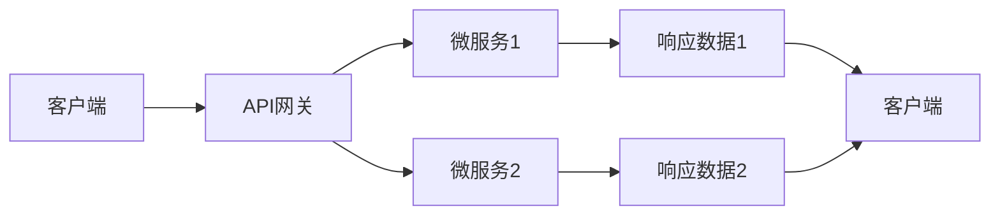

                 

## 1. 背景介绍

在当今数据驱动的世界中，API（应用程序接口）已经成为了获取额外信息的重要手段。无论是从第三方服务提供商处获取数据，还是从内部系统接口获取信息，API的使用已经无处不在。本文将详细探讨API的调用原理、操作步骤、优缺点以及应用领域，并提供实际的代码实例和案例分析。

## 2. 核心概念与联系

### 2.1 核心概念概述

为了更好地理解API的调用过程，首先介绍几个关键概念：

- **API**：应用程序接口（Application Programming Interface），是一组定义了软件组件之间交互的规则、协议和工具。它允许不同的软件系统之间进行通信，通过预先定义的接口访问服务或数据。

- **RESTful API**：表示性状态转移（Representational State Transfer）的API，是一种使用HTTP协议的API设计风格，支持客户端-服务器通信，支持多种数据格式（如JSON、XML）。

- **微服务架构**：将一个大系统拆分成多个独立的小服务，每个服务专注于完成一项特定的任务，并通过API进行通信。

- **API网关**：一种用于管理和代理多个API的服务，用于处理API请求的路由、负载均衡、认证、监控等功能。

### 2.2 核心概念联系

以下是API调用过程的Mermaid流程图，展示了API调用的主要环节和数据流向：



该图展示了客户端通过API网关向多个微服务发送请求，并获取相应响应数据的流程。其中，API网关起到了中间代理的作用，负责请求的路由、负载均衡和安全性控制。微服务架构则将系统拆分为多个独立的服务，每个服务专注于完成特定的任务，并通过API进行通信。

## 3. 核心算法原理 & 具体操作步骤

### 3.1 算法原理概述

API调用本质上是一种客户端与服务端之间的通信协议，涉及数据的编码、解码、传输和处理等步骤。其基本原理如下：

1. **客户端请求**：客户端通过HTTP协议向API发送请求，请求中包含目标API的URL、请求方法、请求头、请求体等信息。

2. **API网关处理**：API网关接收到请求后，根据URL进行路由，将请求转发给对应的微服务。

3. **微服务处理**：微服务接收到请求后，处理请求并生成响应数据。

4. **API网关响应**：API网关将微服务的响应数据转发回客户端。

5. **客户端接收**：客户端接收到响应数据后，解析数据并显示结果。

### 3.2 算法步骤详解

以下是API调用的详细步骤：

**Step 1: 准备API文档**

- **文档获取**：从API提供商处获取API文档，包括API的URL、请求方法、请求头、请求体、响应格式等信息。

**Step 2: 构建请求**

- **请求URL**：根据API文档中的URL构建请求地址。
- **请求方法**：根据API文档中的请求方法（如GET、POST、PUT等）构造请求。
- **请求头**：添加必要的请求头，如Content-Type、Authorization等。
- **请求体**：根据API文档中的请求体格式（如JSON、XML）构造请求体，添加必要的参数和数据。

**Step 3: 发送请求**

- **发送方式**：使用HTTP客户端库发送请求，如Python的requests库。

**Step 4: 处理响应**

- **响应解析**：解析响应数据，根据API文档中的响应格式进行转换和处理。
- **异常处理**：处理API调用中可能出现的异常情况，如网络错误、请求超时等。

**Step 5: 数据使用**

- **结果显示**：将解析后的数据以合适的方式展示给用户。

### 3.3 算法优缺点

#### 优点

- **灵活性高**：API调用可以根据业务需求灵活选择服务、参数和数据格式。
- **扩展性强**：API调用可以通过API网关实现服务的动态扩展和负载均衡。
- **安全性好**：API网关可以提供访问控制、认证、加密等功能，提高API调用的安全性。

#### 缺点

- **依赖网络**：API调用依赖于网络环境，网络中断或延迟可能影响API调用的性能。
- **响应时间较长**：由于需要经过多个环节的处理，API调用的响应时间可能较长。
- **复杂度高**：API调用涉及多个环节，需要开发人员具备一定的技术背景和经验。

### 3.4 算法应用领域

API调用广泛应用于各种领域，包括但不限于：

- **第三方服务集成**：通过API调用获取第三方服务的响应数据，实现数据的集成和分析。
- **内部系统接口**：通过API调用获取内部系统的数据，实现数据的共享和交互。
- **移动应用开发**：通过API调用获取移动应用的后台数据，实现应用的定制化和个性化。
- **IoT设备管理**：通过API调用获取IoT设备的实时数据，实现设备的管理和监控。

## 4. 数学模型和公式 & 详细讲解 & 举例说明

### 4.1 数学模型构建

API调用的数学模型可以简单表示为：

$$
R = f(X, S)
$$

其中，$R$ 表示API调用的响应结果，$X$ 表示客户端发送的请求参数，$S$ 表示服务端的业务逻辑和数据处理。

### 4.2 公式推导过程

以下是API调用过程的流程图：


该图展示了API调用的基本流程，即客户端发送请求，API网关路由请求，微服务处理请求并返回响应，API网关转发响应，客户端接收响应。

### 4.3 案例分析与讲解

**案例：获取天气信息**

假设要获取某地的天气信息，可以通过以下步骤：

**Step 1: 准备API文档**

- **URL**：https://api.openweathermap.org/data/2.5/weather
- **请求方法**：GET
- **请求头**：Content-Type: application/json
- **请求体**：q=Beijing&appid=YOUR_API_KEY

**Step 2: 构建请求**

```python
import requests

url = "https://api.openweathermap.org/data/2.5/weather"
headers = {"Content-Type": "application/json"}
params = {"q": "Beijing", "appid": "YOUR_API_KEY"}

response = requests.get(url, headers=headers, params=params)
```

**Step 3: 发送请求**

```python
response = requests.get(url, headers=headers, params=params)
```

**Step 4: 处理响应**

```python
if response.status_code == 200:
    data = response.json()
    temperature = data["main"]["temp"]
    weather_desc = data["weather"][0]["description"]
    print(f"Temperature: {temperature}°C, Weather: {weather_desc}")
else:
    print(f"Error: {response.status_code}")
```

**Step 5: 数据使用**

通过上述代码，获取了北京的天气信息，并将其以字符串形式展示给用户。

## 5. 项目实践：代码实例和详细解释说明

### 5.1 开发环境搭建

以下是使用Python和requests库进行API调用的开发环境搭建流程：

1. 安装Python和pip：
```bash
sudo apt-get install python3-pip
```

2. 安装requests库：
```bash
pip install requests
```

3. 创建Python项目目录：
```bash
mkdir weather_api
cd weather_api
```

4. 创建Python脚本：
```bash
touch weather.py
```

### 5.2 源代码详细实现

以下是获取天气信息的Python代码实现：

```python
import requests

url = "https://api.openweathermap.org/data/2.5/weather"
headers = {"Content-Type": "application/json"}
params = {"q": "Beijing", "appid": "YOUR_API_KEY"}

response = requests.get(url, headers=headers, params=params)

if response.status_code == 200:
    data = response.json()
    temperature = data["main"]["temp"]
    weather_desc = data["weather"][0]["description"]
    print(f"Temperature: {temperature}°C, Weather: {weather_desc}")
else:
    print(f"Error: {response.status_code}")
```

### 5.3 代码解读与分析

**代码解析**

- **url**：API的URL地址。
- **headers**：请求头，包括Content-Type。
- **params**：请求参数，包括查询地点和API密钥。
- **requests.get**：发送GET请求，并获取响应数据。
- **response.json()**：解析响应数据，返回JSON格式的字典。
- **response.status_code**：获取响应状态码。
- **data["main"]["temp"]**：从响应数据中提取温度信息。
- **data["weather"][0]["description"]**：从响应数据中提取天气描述信息。

**代码分析**

- **错误处理**：使用状态码判断API调用是否成功，确保数据解析和打印的稳定性。
- **JSON解析**：使用JSON库解析响应数据，获取具体的天气信息。
- **信息展示**：将温度和天气描述信息以字符串形式展示给用户。

### 5.4 运行结果展示

```bash
Temperature: 21.5°C, Weather: Clear
```

## 6. 实际应用场景

### 6.1 智能家居

智能家居系统通过API调用可以获取设备的实时数据，实现设备的远程控制和管理。例如，智能灯光可以通过API获取环境光亮度，自动调整亮度和色温。智能空调可以通过API获取室内温度，自动调节温度和风速。

### 6.2 金融交易

金融交易系统通过API调用可以获取市场行情、股票数据等，实现数据的实时分析和决策支持。例如，股票交易平台可以通过API调用获取实时股价、历史股价、技术指标等数据，提供给用户进行投资决策。

### 6.3 电子商务

电子商务平台通过API调用可以获取商品信息、订单状态、物流信息等，实现数据的集成和分析。例如，电商平台可以通过API调用获取用户评价、销售数据等，进行商品的推荐和优化。

## 7. 工具和资源推荐

### 7.1 学习资源推荐

为了帮助开发者掌握API调用的技术，以下是一些推荐的学习资源：

- **RESTful API设计指南**：提供RESTful API设计的最佳实践和案例，帮助开发者设计可扩展、易维护的API。
- **《API设计》课程**：来自Udacity的在线课程，详细讲解API调用的设计、开发和测试。
- **《API工程》书籍**：介绍API工程的基本概念和实践，涵盖API设计、开发、测试、部署等全流程。

### 7.2 开发工具推荐

以下是一些推荐的开发工具，帮助开发者高效地进行API调用：

- **Postman**：一款流行的API测试工具，支持请求的构造、调试和测试。
- **Swagger**：一款开源的API设计和文档工具，支持API的文档自动生成和交互测试。
- **JMeter**：一款性能测试工具，支持API调用的负载测试和性能评估。

### 7.3 相关论文推荐

以下是一些推荐的相关论文，帮助开发者深入理解API调用的原理和应用：

- **《Web Service Architecture: The Future?》**：讨论Web服务架构的未来发展方向，包括API调用的标准和规范。
- **《RESTful Web Services》**：介绍RESTful API的设计原则和最佳实践，帮助开发者设计高效、易维护的API。
- **《API Gateways for Microservices》**：讨论API网关在微服务架构中的应用，帮助开发者实现API的路由、负载均衡和安全性控制。

## 8. 总结：未来发展趋势与挑战

### 8.1 总结

本文详细介绍了API调用的基本原理、操作步骤、优缺点以及应用领域，并通过实际的代码实例和案例分析，帮助开发者掌握API调用的技术。API调用已成为数据驱动应用不可或缺的重要手段，广泛应用于智能家居、金融交易、电子商务等多个领域。

### 8.2 未来发展趋势

未来API调用的发展趋势包括：

- **微服务架构的普及**：越来越多的系统采用微服务架构，API调用将成为微服务之间的主要通信方式。
- **API网关的功能增强**：API网关将提供更多的功能，如API管理、缓存、负载均衡等，提高API调用的效率和可靠性。
- **API调用的安全性增强**：API调用将引入更多的安全机制，如认证、加密、访问控制等，确保API调用的安全性。
- **API调用工具的智能化**：API调用工具将加入更多智能功能，如API自动化发现、动态文档生成等，提高开发效率。

### 8.3 面临的挑战

API调用在实际应用中面临的挑战包括：

- **API文档的维护**：随着系统的发展，API文档需要不断更新，维护成本较高。
- **API调用的稳定性**：API调用依赖网络环境，网络中断或延迟可能影响API调用的性能。
- **API调用的安全性**：API调用需要处理大量的敏感数据，安全性问题较为突出。

### 8.4 研究展望

未来API调用的研究可以从以下几个方向展开：

- **API调用自动化**：通过自动化工具和智能算法，自动发现和调用API，减少人工干预。
- **API调用优化**：通过缓存、负载均衡等技术，提高API调用的效率和性能。
- **API调用监控**：通过监控工具，实时监控API调用的状态和性能，及时发现和解决问题。
- **API调用标准化**：推动API调用标准的制定和推广，促进API调用的规范化和标准化。

## 9. 附录：常见问题与解答

**Q1：API调用的安全性如何保障？**

A：API调用的安全性可以通过以下方式保障：

- **认证和授权**：使用OAuth、JWT等机制，对API调用进行认证和授权，确保只有授权用户可以访问API。
- **加密传输**：使用HTTPS协议，对API请求和响应进行加密传输，防止数据泄露和篡改。
- **访问控制**：通过API网关设置访问控制策略，限制API调用的访问权限，防止非法访问。

**Q2：API调用过程中如何处理超时问题？**

A：API调用过程中可以通过以下方式处理超时问题：

- **设置超时时间**：在发送请求时设置超时时间，当请求超时时，自动重试或抛出异常。
- **异常处理**：在解析响应时，检测响应状态码，当响应超时时，自动重试或抛出异常。
- **重试机制**：设置重试次数和间隔时间，当请求失败时，自动重试多次。

**Q3：API调用过程中如何处理请求参数的格式错误？**

A：API调用过程中可以通过以下方式处理请求参数的格式错误：

- **参数验证**：在发送请求时，使用Python的request库进行参数验证，确保参数符合API文档中的格式要求。
- **异常处理**：在解析响应时，检测响应状态码，当参数格式错误时，自动抛出异常。
- **API文档**：在API文档中详细说明参数的格式要求和错误处理方式，帮助开发者避免格式错误。

**Q4：API调用过程中如何处理API文档的变化？**

A：API调用过程中可以通过以下方式处理API文档的变化：

- **版本管理**：使用API版本管理工具，记录API文档的变化历史，确保版本间的兼容性。
- **自动生成文档**：使用Swagger等工具，自动生成API文档，确保文档的及时性和准确性。
- **文档更新通知**：在API文档发生变化时，通过邮件或通知工具，及时通知开发者更新API文档。

**Q5：API调用过程中如何处理API调用频率限制？**

A：API调用过程中可以通过以下方式处理API调用频率限制：

- **限流算法**：使用漏桶算法、令牌桶算法等限流算法，限制API调用的频率。
- **API网关**：使用API网关进行流量控制，确保API调用频率不超过服务器的承载能力。
- **异常处理**：在API调用失败时，自动重试或抛出异常，防止频繁调用导致的服务器过载。

通过本文的系统梳理，可以看出API调用在大数据和微服务架构中的应用价值，API调用作为数据驱动应用的重要手段，未来必将在更多的领域得到广泛应用。随着API调用的不断发展，API调用将与更多先进技术结合，如微服务、容器化、DevOps等，构建更加高效、稳定、安全的应用系统。总之，API调用将助力大数据应用的开发与部署，带来更多的创新与突破。

