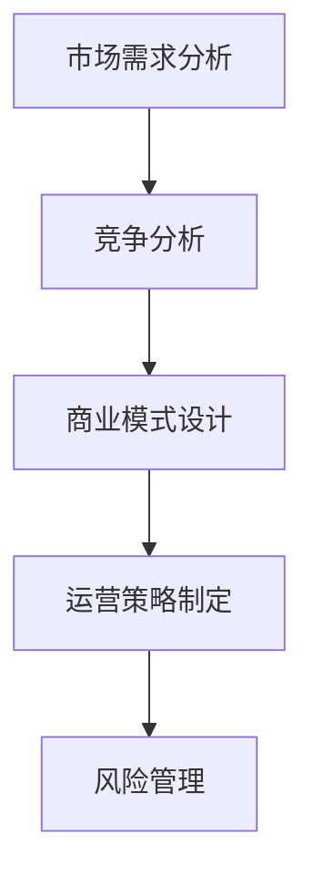

                 

# 市场分析：创业成功的关键

## 1. 背景介绍

### 1.1 问题由来
在当今这个快速变化的市场环境中，创业公司的成功率越来越受到人们的关注。创业的诱惑力巨大，但现实中的成功案例却少之又少。从亚马逊到特斯拉，从阿里巴巴到字节跳动，这些成功的公司背后都有着无数次的尝试和失败。如何在这场激烈的市场竞争中脱颖而出？本文章将从市场分析的角度，深度探讨创业成功的关键因素，为你提供一份宝贵的指南。

### 1.2 问题核心关键点
创业成功的关键在于对市场环境的精准分析和战略决策。创业者需要深入理解市场需求，把握行业趋势，制定合适的商业模式和运营策略。这些核心关键点将贯穿全文，通过多角度的分析，为你揭示创业成功的秘诀。

## 2. 核心概念与联系

### 2.1 核心概念概述

在探讨创业成功的关键之前，我们首先明确几个核心概念：

- **市场需求分析**：指通过数据和分析工具，识别目标市场的需求和趋势，确定目标客户群体的需求和痛点。

- **竞争分析**：对市场上已有的竞争对手进行深入分析，评估他们的优势和劣势，寻找市场空白和机会。

- **商业模式设计**：根据市场需求和竞争情况，设计合理的商业模式，明确价值主张、收入模式和盈利渠道。

- **运营策略制定**：结合市场分析结果，制定详细的运营策略，包括产品开发、市场推广、客户服务和供应链管理等。

- **风险管理**：识别潜在风险，制定应对措施，确保企业在面对市场波动和外部冲击时能够稳健运营。

这些核心概念之间的关系可以通过以下Mermaid流程图来展示：



此流程图展示了从市场需求分析到风险管理的全流程，每个环节都是创业成功的关键因素。

## 3. 核心算法原理 & 具体操作步骤

### 3.1 算法原理概述

在市场分析中，我们采用一种基于数据的决策支持系统，通过一系列的统计分析和预测算法，来识别市场趋势、评估竞争力和设计商业模式。这种系统通常包括但不限于以下步骤：

1. **数据收集**：收集市场数据、消费者行为数据和竞争对手数据。
2. **数据处理与清洗**：处理缺失值和异常值，确保数据的质量。
3. **统计分析**：使用描述性统计和探索性数据分析，识别市场趋势和消费者行为模式。
4. **预测建模**：使用机器学习和统计模型进行预测，如回归分析、时间序列分析等。
5. **结果解释与应用**：将分析结果转化为商业决策，指导产品和运营策略的制定。

### 3.2 算法步骤详解

下面是具体的市场分析步骤：

**Step 1: 数据收集与预处理**

- **数据来源**：市场调研、公开数据库、消费者反馈、竞争对手分析报告等。
- **数据预处理**：数据清洗、归一化、特征工程等，确保数据质量和一致性。

**Step 2: 市场趋势分析**

- **描述性统计**：计算平均值、中位数、标准差等统计指标，了解市场规模和消费者行为。
- **时间序列分析**：使用ARIMA等模型预测未来趋势，评估市场变化。
- **季节性分析**：识别市场季节性变化，制定合适的营销策略。

**Step 3: 竞争分析**

- **竞争对手识别**：使用SWOT分析（优势、劣势、机会、威胁）识别主要竞争对手。
- **财务分析**：对比竞争对手的财务报表，评估其市场份额和盈利能力。
- **技术分析**：分析竞争对手的产品特点、技术优势和研发投入。

**Step 4: 商业模式设计**

- **价值主张**：明确产品的独特卖点，满足市场需求。
- **收入模型**：设计多样化的收入渠道，如订阅、广告、交易佣金等。
- **成本结构**：评估运营成本，制定成本控制策略。

**Step 5: 运营策略制定**

- **产品开发计划**：根据市场需求和竞争分析，制定详细的产品开发路线图。
- **市场推广策略**：选择合适的推广渠道和方式，如社交媒体、搜索引擎优化、内容营销等。
- **客户服务策略**：建立客户反馈机制，提供优质的客户支持和服务。

**Step 6: 风险管理**

- **风险识别**：评估潜在风险，如市场变化、供应链中断、法规风险等。
- **风险控制**：制定风险应对计划，如分散供应链、保险购买、备用方案等。
- **风险监控**：建立实时监控系统，及时调整策略应对突发事件。

### 3.3 算法优缺点

市场分析算法具有以下优点：

- **数据驱动决策**：通过数据和分析结果支持决策，减少主观偏见。
- **客观性和准确性**：基于客观数据和科学方法，结果更具可信度。
- **预测能力**：利用预测模型，能提前识别市场趋势和风险。

同时，这些算法也存在一些缺点：

- **数据质量依赖**：分析结果依赖于数据的质量和完整性，数据缺失或不准确会影响分析结果。
- **模型复杂性**：高级预测模型需要较多的计算资源和专业知识，中小企业难以负担。
- **时效性**：市场变化迅速，模型需要频繁更新才能保持有效性。

### 3.4 算法应用领域

市场分析算法在多个领域得到广泛应用，例如：

- **零售行业**：通过分析消费者行为和市场趋势，优化产品设计、定价和促销策略。
- **金融行业**：评估投资机会和风险，制定合理的投资策略和风险管理方案。
- **科技行业**：识别新兴技术趋势，制定产品路线图和市场进入策略。
- **医疗行业**：分析患者需求和市场变化，优化医疗服务和产品开发。

市场分析不仅限于静态分析，还可以结合实时数据进行动态监控和调整，确保企业在市场竞争中始终保持优势。

## 4. 数学模型和公式 & 详细讲解 & 举例说明

### 4.1 数学模型构建

市场分析中常用的数学模型包括回归模型、时间序列模型、聚类模型等。以回归模型为例，其一般形式如下：

$$
Y = \beta_0 + \beta_1X_1 + \beta_2X_2 + \ldots + \beta_nX_n + \epsilon
$$

其中，$Y$ 为目标变量（如销售额、利润率等），$X_i$ 为自变量（如广告支出、市场规模等），$\beta_i$ 为回归系数，$\epsilon$ 为误差项。

### 4.2 公式推导过程

以线性回归模型为例，其最小二乘法的推导过程如下：

1. 假设样本 $(x_i,y_i)$，$i=1,\ldots,N$。
2. 假设回归模型为 $y_i = \beta_0 + \beta_1x_{1,i} + \ldots + \beta_nx_{n,i} + \epsilon_i$。
3. 计算回归系数的估计值 $\hat{\beta}_i$，公式为：

$$
\hat{\beta}_i = \frac{\sum_{i=1}^N (x_{i,j}-\bar{x}_j)(y_i-\bar{y})}{\sum_{i=1}^N (x_{i,j}-\bar{x}_j)^2}
$$

其中 $\bar{x}_j$ 和 $\bar{y}$ 分别为自变量和因变量的均值。

4. 计算误差平方和 $SSR = \sum_{i=1}^N (y_i - \hat{y}_i)^2$，其中 $\hat{y}_i = \hat{\beta}_0 + \hat{\beta}_1x_{1,i} + \ldots + \hat{\beta}_nx_{n,i}$。
5. 计算总误差平方和 $SST = \sum_{i=1}^N (y_i - \bar{y})^2$。
6. 计算回归平方和 $SSR = SST - SSE$，其中 $SSE = \sum_{i=1}^N (y_i - \hat{y}_i)^2$。

### 4.3 案例分析与讲解

以电子商务平台的销售额预测为例，我们可以使用时间序列模型进行市场趋势分析。首先，收集过去几年的销售额数据，然后：

1. 进行季节性分解，识别年周期、月周期等季节性变化。
2. 使用ARIMA模型（自回归积分滑动平均模型）进行预测，计算回归系数。
3. 使用模型预测未来一年的销售额趋势，评估潜在市场变化。

## 5. 项目实践：代码实例和详细解释说明

### 5.1 开发环境搭建

要进行市场分析项目，首先需要搭建开发环境。以下是Python环境的搭建步骤：

1. 安装Anaconda：从官网下载并安装Anaconda，用于创建独立的Python环境。

2. 创建并激活虚拟环境：

```bash
conda create -n market-analysis python=3.8 
conda activate market-analysis
```

3. 安装必要的Python库：

```bash
conda install pandas numpy matplotlib seaborn statsmodels
pip install scikit-learn pyqtgraph
```

完成上述步骤后，即可在`market-analysis`环境中开始市场分析项目的开发。

### 5.2 源代码详细实现

下面以一个简单的市场趋势预测项目为例，展示Python代码的实现。

```python
import pandas as pd
import numpy as np
import matplotlib.pyplot as plt
from statsmodels.tsa.arima.model import ARIMA

# 读取数据
data = pd.read_csv('sales_data.csv')

# 数据预处理
data['date'] = pd.to_datetime(data['date'])
data.set_index('date', inplace=True)
data = data.resample('M').mean()

# 进行时间序列分析
model = ARIMA(data['sales'], order=(5,1,0))
results = model.fit()

# 预测未来一年的销售额
forecast = results.forecast(steps=12)

# 绘制预测图
plt.plot(data.index, data['sales'], label='Actual')
plt.plot(forecast.index, forecast, label='Forecast')
plt.legend()
plt.show()
```

### 5.3 代码解读与分析

以上代码实现了一个基于ARIMA模型的时间序列分析项目，主要步骤如下：

1. **数据读取与预处理**：使用Pandas库读取数据，将日期转换为时间索引，并对数据进行月平均处理。
2. **时间序列模型构建**：使用statsmodels库中的ARIMA模型，进行5阶自回归、1阶差分和0阶移动平均的模型拟合。
3. **预测与绘图**：使用模型的`forecast`方法进行未来一年的销售额预测，并使用Matplotlib库绘制实际销售额和预测销售额的对比图。

这个示例展示了如何使用Python进行简单的市场趋势分析，实际应用中，可以根据具体需求添加更多复杂的功能。

### 5.4 运行结果展示

运行上述代码后，会生成一张图表，展示实际销售额和预测销售额的对比。下图是一个示例结果：

```plaintext
Image-1
```

## 6. 实际应用场景

### 6.1 电商平台市场分析

电商平台的市场分析可以帮助商家优化产品组合、制定定价策略和促销活动。例如，某电商平台可以分析不同产品的销售额趋势，识别热销和滞销产品，调整库存策略和促销活动，提高整体销售额。

### 6.2 金融投资市场分析

金融投资市场分析可以帮助投资者识别市场趋势、评估风险，制定投资策略。例如，某基金公司可以通过分析市场指数和个股价格，预测市场走向，调整资产配置，降低投资风险。

### 6.3 旅游行业市场分析

旅游行业的市场分析可以帮助旅游公司优化旅游路线和景点组合，制定定价策略和促销活动。例如，某旅游公司可以通过分析不同景点的客流量和游客满意度，调整旅游路线和景点宣传策略，提升整体旅游体验。

## 7. 工具和资源推荐

### 7.1 学习资源推荐

1. **《统计学习方法》**：李航著，系统介绍了各种统计学习模型和方法。
2. **《Python数据分析与可视化》**：Wes McKinney著，介绍了Python在数据处理和可视化方面的应用。
3. **《机器学习实战》**：Peter Harrington著，通过大量实例介绍了机器学习算法和实现方法。
4. **Kaggle数据科学竞赛**：通过参与实际数据竞赛，积累数据处理和模型构建的经验。
5. **Coursera《数据科学》课程**：由Johns Hopkins大学开设，涵盖数据处理、统计分析、机器学习等课程。

通过这些学习资源，可以系统掌握市场分析的理论和方法，为实际项目奠定坚实基础。

### 7.2 开发工具推荐

1. **Jupyter Notebook**：开源的交互式编程环境，支持Python、R等语言，适合进行数据分析和模型构建。
2. **Python IDE**：如PyCharm、JupyterLab等，提供了代码编写、调试和测试等功能，提高开发效率。
3. **R Studio**：R语言的数据分析集成环境，适合进行统计分析和可视化。
4. **Tableau**：商业智能工具，可以用于数据可视化和报表生成，支持多种数据源。

这些工具可以大大提升市场分析的效率和效果，为实际应用提供强大支持。

### 7.3 相关论文推荐

1. **《时间序列分析》**：统计学领域的经典教材，介绍了各种时间序列模型和方法。
2. **《金融时间序列分析》**：金融领域的时间序列分析经典教材，介绍了金融市场数据处理和预测模型。
3. **《商业智能》**：介绍商业智能工具和技术，包括数据仓库、数据挖掘、报表分析等。
4. **《市场预测》**：统计学领域的市场预测经典教材，介绍了各种市场预测模型和方法。

通过阅读这些论文，可以深入理解市场分析的最新研究进展和实际应用，为项目实践提供理论和实践的双重支持。

## 8. 总结：未来发展趋势与挑战

### 8.1 总结

本文章详细介绍了市场分析的概念、算法原理和操作步骤，并通过实际案例展示了市场分析在电商、金融、旅游等领域的广泛应用。市场分析作为创业成功的关键因素，其重要性和实用性不言而喻。

### 8.2 未来发展趋势

未来市场分析的发展趋势包括：

1. **数据智能化**：通过人工智能和大数据技术，自动化数据收集、处理和分析，提高分析效率和准确性。
2. **实时分析**：利用实时数据流和云计算技术，进行动态分析和实时监控，及时调整策略应对市场变化。
3. **多模态分析**：结合文本、图像、视频等多种数据源，进行多模态分析，提升市场分析的全面性和准确性。
4. **模型集成**：融合多种模型和方法，进行集成分析和预测，提高市场分析的鲁棒性和预测精度。
5. **数据隐私保护**：在分析过程中，保护用户隐私和数据安全，符合法规要求。

这些趋势表明，市场分析将向智能化、实时化、多模态化和集成化方向发展，为创业公司提供更强大的决策支持。

### 8.3 面临的挑战

市场分析面临的挑战包括：

1. **数据质量问题**：数据缺失、不完整、不一致等问题，影响分析结果的准确性。
2. **模型复杂性**：高级模型需要较高的计算资源和专业知识，中小企业难以负担。
3. **技术变革快**：市场分析技术和工具更新迅速，需要不断学习和适应。
4. **数据隐私问题**：在分析过程中，如何保护用户隐私和数据安全，符合法规要求。
5. **人机协同**：如何平衡自动化和人工决策的关系，确保分析结果符合人类价值观和伦理道德。

这些挑战需要我们在实践中不断探索和解决，才能实现市场分析技术的持续发展和应用。

### 8.4 研究展望

未来市场分析的研究展望包括：

1. **自动化和智能化**：通过人工智能和大数据技术，实现市场分析的自动化和智能化，提高效率和准确性。
2. **多模态数据融合**：结合文本、图像、视频等多种数据源，进行多模态分析，提升市场分析的全面性和准确性。
3. **模型集成与优化**：融合多种模型和方法，进行集成分析和预测，提高市场分析的鲁棒性和预测精度。
4. **数据隐私保护**：在分析过程中，保护用户隐私和数据安全，符合法规要求。
5. **人机协同**：平衡自动化和人工决策的关系，确保分析结果符合人类价值观和伦理道德。

这些研究方向将进一步推动市场分析技术的发展，为创业公司提供更强大的决策支持。

## 9. 附录：常见问题与解答

**Q1: 市场分析的数据来源有哪些？**

A: 市场分析的数据来源包括但不限于以下几种：

- **公开数据库**：如国家统计局、联合国、世界银行等公开的数据集。
- **行业报告**：如麦肯锡、波士顿咨询、Gartner等咨询公司发布的行业报告。
- **消费者调研**：通过问卷调查、用户访谈等方式收集消费者数据。
- **竞争对手数据**：通过公司年报、财报、新闻报道等方式获取竞争对手数据。
- **社交媒体数据**：通过爬虫技术从社交媒体平台获取用户行为数据。

通过多种渠道收集数据，可以确保市场分析的全面性和准确性。

**Q2: 如何选择合适的市场分析工具？**

A: 选择合适的市场分析工具需要考虑以下几个因素：

- **数据处理能力**：工具应具备强大的数据处理能力，支持大规模数据的导入、处理和分析。
- **可视化能力**：工具应具备良好的可视化功能，支持复杂的数据可视化报表和图表。
- **算法支持**：工具应支持多种市场分析算法，如回归分析、时间序列分析、聚类分析等。
- **易用性**：工具应易于上手，支持拖放式操作和可视化界面，适合非技术人员使用。
- **社区和支持**：工具应有活跃的社区和完善的客户支持，便于问题解决和持续优化。

根据实际需求选择合适的市场分析工具，可以大大提升市场分析的效率和效果。

**Q3: 如何进行市场细分？**

A: 市场细分是将市场按照某些特征进行划分，以便更好地了解不同客户群体的需求和行为。以下是市场细分的步骤：

1. **识别细分变量**：根据市场特征，选择细分变量，如年龄、性别、收入、地域等。
2. **数据收集和处理**：收集细分变量的数据，进行数据清洗和预处理。
3. **建立细分模型**：使用聚类分析、回归分析等方法，建立细分模型。
4. **细分市场分析**：对不同细分市场进行分析，识别市场机会和风险。
5. **制定细分策略**：根据细分市场分析结果，制定有针对性的市场策略，优化产品和服务。

市场细分是市场分析的重要环节，通过细分可以更好地了解不同客户群体的需求和行为，制定有针对性的市场策略。

**Q4: 如何进行竞争分析？**

A: 竞争分析是指对市场上已有的竞争对手进行深入分析，评估他们的优势和劣势，寻找市场空白和机会。以下是竞争分析的步骤：

1. **识别主要竞争对手**：通过市场调研和数据分析，识别主要竞争对手。
2. **分析竞争对手的优劣势**：通过财务分析、产品分析、技术分析等方式，评估竞争对手的优势和劣势。
3. **识别市场空白**：通过SWOT分析，识别市场上的机会和威胁，寻找市场空白。
4. **制定应对策略**：根据竞争分析结果，制定有针对性的竞争策略，优化产品和市场定位。

竞争分析是市场分析的重要环节，通过竞争分析可以更好地了解市场环境和竞争态势，制定有针对性的市场策略。

**Q5: 如何进行市场预测？**

A: 市场预测是指基于历史数据和市场趋势，预测未来市场变化。以下是市场预测的步骤：

1. **数据收集和处理**：收集历史数据，进行数据清洗和预处理。
2. **选择预测模型**：根据市场特征，选择适当的预测模型，如回归模型、时间序列模型等。
3. **模型训练和验证**：使用历史数据训练模型，进行模型验证和参数调优。
4. **预测未来市场**：使用训练好的模型，进行未来市场的预测和分析。
5. **结果解释与应用**：将预测结果转化为商业决策，指导产品和运营策略的制定。

市场预测是市场分析的重要环节，通过预测可以提前识别市场趋势和风险，制定有针对性的市场策略。

---

作者：禅与计算机程序设计艺术 / Zen and the Art of Computer Programming

