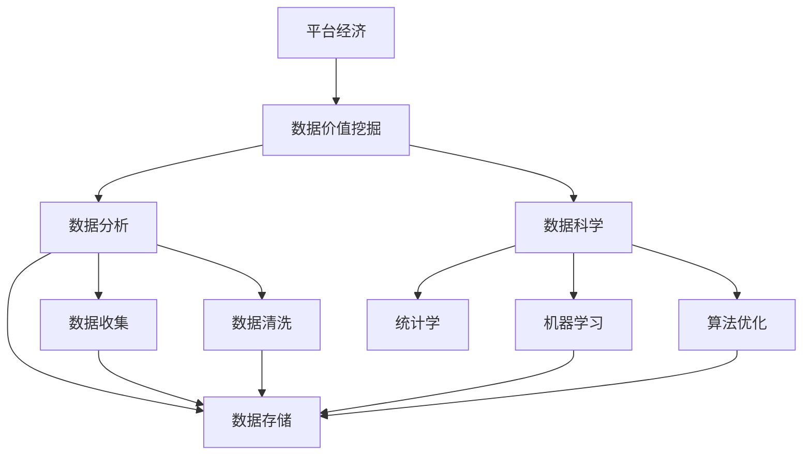

                 

# 平台经济的数据价值挖掘：如何发掘数据的潜在价值？

> 关键词：平台经济, 数据价值挖掘, 数据分析, 数据科学, 算法优化

## 1. 背景介绍

在当今数字化时代，平台经济（Platform Economy）已经成为了驱动全球经济增长的新引擎。无论是电商、社交媒体、在线教育还是共享经济，平台经济不仅改变了人们的生活和工作方式，也带来了巨大的数据资源。然而，如何高效、准确地从这些海量数据中挖掘出有价值的信息，成为平台经济中最重要的挑战之一。

### 1.1 问题由来

随着平台经济的不断发展，数据量呈指数级增长。根据《2021年全球平台经济报告》，全球平台经济市场规模已达到11万亿美元，预计未来五年复合增速将超过14%。这些数据不仅来自用户行为记录、交易数据、交互日志，还包括用户的评价、反馈、搜索记录等多维度的信息。然而，如何从这些数据中提取有用的知识、洞察业务机会、预测市场趋势，成为了平台企业必须面对的重要问题。

### 1.2 问题核心关键点

数据价值挖掘的核心关键点在于如何高效、精确地从海量数据中提取有用的信息。这不仅涉及到数据收集、清洗、存储的技术手段，也涉及到数据处理、分析、可视化的算法模型。以下将详细探讨如何发掘数据的潜在价值。

## 2. 核心概念与联系

### 2.1 核心概念概述

为更好地理解平台经济中的数据价值挖掘，本节将介绍几个关键概念：

- **平台经济**：指通过互联网技术连接供需双方，实现资源共享、交易撮合的经济形态。平台经济的核心在于连接、匹配和优化资源配置。

- **数据价值挖掘**：指通过技术手段，从大量数据中提取有价值的信息，以辅助决策、优化运营、提升用户体验。

- **数据分析**：指对数据进行收集、处理、分析和可视化的过程，旨在发现数据背后的规律和趋势。

- **数据科学**：涵盖了数据挖掘、数据分析、机器学习、统计学等多个学科，旨在通过数据驱动的方式解决实际问题。

- **算法优化**：指对数据处理、分析算法进行改进，提高其效率、准确性和可解释性。

这些核心概念之间的逻辑关系可以通过以下Mermaid流程图来展示：



这个流程图展示了平台经济、数据价值挖掘、数据分析、数据科学和算法优化之间的逻辑关系：

1. **平台经济**：通过互联网技术连接供需双方，形成数据资源。
2. **数据价值挖掘**：从平台产生的数据中提取有价值的信息。
3. **数据分析**：对数据进行收集、处理、分析和可视化。
4. **数据科学**：通过多学科手段解决实际问题，涵盖数据挖掘、机器学习、统计学等。
5. **算法优化**：改进数据处理和分析的算法，提高效率和准确性。

## 3. 核心算法原理 & 具体操作步骤

### 3.1 算法原理概述

数据价值挖掘的核心算法原理主要包括以下几个方面：

- **数据预处理**：包括数据收集、清洗、标准化等步骤，保证数据的完整性和一致性。
- **特征工程**：通过选择、构建、组合特征，提高模型的预测能力和泛化性能。
- **机器学习模型**：包括监督学习、无监督学习、半监督学习等算法，用于提取数据中的规律和模式。
- **优化算法**：通过调参、正则化等手段，提高模型的泛化性能和计算效率。
- **模型评估**：通过交叉验证、ROC曲线等手段，评估模型的性能和稳定性。

### 3.2 算法步骤详解

数据价值挖掘的一般步骤如下：

**Step 1: 数据收集与清洗**
- 收集平台产生的多源数据，包括用户行为数据、交易数据、交互日志等。
- 进行数据清洗，去除缺失值、异常值，标准化数据格式。

**Step 2: 特征工程**
- 选择合适的特征，如用户属性、行为特征、交易特征等。
- 通过特征选择、特征构造、特征组合等手段，生成更有意义的新特征。

**Step 3: 模型选择与训练**
- 选择合适的机器学习算法，如回归、分类、聚类等。
- 设置模型参数，进行交叉验证，选择最优模型。
- 使用训练数据集训练模型。

**Step 4: 模型评估与优化**
- 使用测试数据集评估模型性能，如准确率、召回率、F1值等。
- 根据评估结果，调整模型参数，优化模型性能。

**Step 5: 结果解读与应用**
- 对模型预测结果进行解释，提取有用的业务洞察。
- 将模型应用到实际业务场景，如推荐系统、风险控制、客户分析等。

### 3.3 算法优缺点

数据价值挖掘算法具有以下优点：

- **高准确性**：通过大量数据训练，模型的预测能力较高，可以提供较为准确的业务洞察。
- **灵活性**：可以根据不同的业务需求选择不同的算法和特征，满足多场景的需求。
- **可解释性**：通过特征选择、模型评估等手段，可以对模型的预测结果进行解释和理解。

同时，该算法也存在一些局限性：

- **数据依赖性**：算法的效果高度依赖于数据的质量和数量，数据偏差可能影响模型效果。
- **计算资源消耗大**：大规模数据集的处理需要较高的计算资源和时间成本。
- **模型复杂度**：复杂模型可能存在过拟合风险，需要仔细调参和评估。

### 3.4 算法应用领域

数据价值挖掘算法在平台经济中的应用非常广泛，例如：

- **用户行为分析**：通过分析用户的行为数据，如点击、浏览、购买等，了解用户偏好和行为规律，优化产品设计和用户体验。
- **推荐系统**：根据用户的历史行为和兴趣，推荐个性化的商品、内容、服务，提高用户满意度和平台收益。
- **风险控制**：通过分析交易数据、行为数据等，预测和控制风险，如信用评分、欺诈检测等。
- **市场趋势预测**：通过分析市场数据、用户数据等，预测市场趋势，优化产品策略和营销活动。
- **客户分析与细分**：通过分析用户属性、行为数据等，进行客户细分和画像，提升客户关系管理。

这些应用场景展示了数据价值挖掘算法在平台经济中的广泛应用，通过提取和分析数据，平台企业可以优化运营、提升效率、增加收益。

## 4. 数学模型和公式 & 详细讲解 & 举例说明

### 4.1 数学模型构建

本节将使用数学语言对平台经济中数据价值挖掘的算法进行严格描述。

设平台上的用户数据集为 $D=\{(x_i,y_i)\}_{i=1}^N, x_i \in \mathbb{R}^d, y_i \in \{0,1\}$，其中 $x_i$ 为输入特征向量，$y_i$ 为标签。假设选择的机器学习模型为 $M$，目标是找到最优模型参数 $\theta$，使得模型在测试集 $D_{test}$ 上的预测性能最佳。

定义模型 $M$ 在输入 $x$ 上的预测结果为 $M(x)=\mathbb{E}[y|x]$，其中 $\mathbb{E}[\cdot]$ 表示期望。

### 4.2 公式推导过程

数据价值挖掘的目标是最大化模型在测试集上的预测性能。假设我们选择的损失函数为均方误差损失（Mean Squared Error, MSE），则模型训练的目标函数为：

$$
\mathcal{L}(\theta) = \frac{1}{2N_{test}}\sum_{i=1}^{N_{test}} \left(y_i - M(x_i)\right)^2
$$

其中 $N_{test}$ 为测试集样本数。

通过最小化损失函数，我们可以得到模型的参数 $\theta$。具体来说，假设我们选择的优化算法为梯度下降（Gradient Descent），则每次迭代的更新公式为：

$$
\theta \leftarrow \theta - \eta \nabla_{\theta}\mathcal{L}(\theta)
$$

其中 $\eta$ 为学习率，$\nabla_{\theta}\mathcal{L}(\theta)$ 为损失函数对参数 $\theta$ 的梯度。

### 4.3 案例分析与讲解

以用户行为分析为例，假设我们需要分析用户的点击行为，预测用户是否会购买某商品。

首先，我们收集平台上的用户点击数据 $D=\{(x_i,y_i)\}_{i=1}^N$，其中 $x_i$ 为用户的点击行为特征，如点击时间、点击位置等，$y_i$ 为是否购买商品的标签。

然后，我们设计特征工程，选择用户属性、点击行为特征等作为输入特征。通过数据清洗，去除缺失值、异常值，标准化数据格式。

接着，我们选择合适的机器学习模型，如逻辑回归、决策树等，进行模型训练。通过交叉验证，选择最优模型参数 $\theta$。

最后，我们使用测试集 $D_{test}$ 评估模型性能，如准确率、召回率、F1值等。根据评估结果，调整模型参数，优化模型性能。

## 5. 项目实践：代码实例和详细解释说明

### 5.1 开发环境搭建

在进行数据价值挖掘的实践前，我们需要准备好开发环境。以下是使用Python进行PyTorch开发的环境配置流程：

1. 安装Anaconda：从官网下载并安装Anaconda，用于创建独立的Python环境。

2. 创建并激活虚拟环境：
```bash
conda create -n pytorch-env python=3.8 
conda activate pytorch-env
```

3. 安装PyTorch：根据CUDA版本，从官网获取对应的安装命令。例如：
```bash
conda install pytorch torchvision torchaudio cudatoolkit=11.1 -c pytorch -c conda-forge
```

4. 安装Transformers库：
```bash
pip install transformers
```

5. 安装各类工具包：
```bash
pip install numpy pandas scikit-learn matplotlib tqdm jupyter notebook ipython
```

完成上述步骤后，即可在`pytorch-env`环境中开始数据价值挖掘的实践。

### 5.2 源代码详细实现

这里我们以推荐系统为例，给出使用Transformers库对BERT模型进行推荐系统微调的PyTorch代码实现。

首先，定义推荐系统任务的数据处理函数：

```python
from transformers import BertTokenizer
from torch.utils.data import Dataset
import torch

class RecommendationDataset(Dataset):
    def __init__(self, user_ids, item_ids, interaction_matrix):
        self.user_ids = user_ids
        self.item_ids = item_ids
        self.interaction_matrix = interaction_matrix
        
    def __len__(self):
        return len(self.user_ids)
    
    def __getitem__(self, item):
        user_id = self.user_ids[item]
        item_id = self.item_ids[item]
        
        # 对用户和物品进行编码
        user_embedding = encoder.encode(user_id, add_special_tokens=True)
        item_embedding = encoder.encode(item_id, add_special_tokens=True)
        
        # 将编码后的向量拼接，作为输入
        input_ids = torch.tensor(user_embedding + item_embedding, dtype=torch.long)
        
        return {'input_ids': input_ids}
```

然后，定义模型和优化器：

```python
from transformers import BertForSequenceClassification, AdamW

model = BertForSequenceClassification.from_pretrained('bert-base-cased', num_labels=len(item_ids))

optimizer = AdamW(model.parameters(), lr=2e-5)
```

接着，定义训练和评估函数：

```python
from torch.utils.data import DataLoader
from tqdm import tqdm
from sklearn.metrics import classification_report

device = torch.device('cuda') if torch.cuda.is_available() else torch.device('cpu')
model.to(device)

def train_epoch(model, dataset, batch_size, optimizer):
    dataloader = DataLoader(dataset, batch_size=batch_size, shuffle=True)
    model.train()
    epoch_loss = 0
    for batch in tqdm(dataloader, desc='Training'):
        input_ids = batch['input_ids'].to(device)
        model.zero_grad()
        outputs = model(input_ids)
        loss = outputs.loss
        epoch_loss += loss.item()
        loss.backward()
        optimizer.step()
    return epoch_loss / len(dataloader)

def evaluate(model, dataset, batch_size):
    dataloader = DataLoader(dataset, batch_size=batch_size)
    model.eval()
    preds, labels = [], []
    with torch.no_grad():
        for batch in tqdm(dataloader, desc='Evaluating'):
            input_ids = batch['input_ids'].to(device)
            outputs = model(input_ids)
            batch_preds = outputs.logits.argmax(dim=1).to('cpu').tolist()
            batch_labels = batch_labels.to('cpu').tolist()
            for pred, label in zip(batch_preds, batch_labels):
                preds.append(pred)
                labels.append(label)
                
    print(classification_report(labels, preds))
```

最后，启动训练流程并在测试集上评估：

```python
epochs = 5
batch_size = 16

for epoch in range(epochs):
    loss = train_epoch(model, train_dataset, batch_size, optimizer)
    print(f"Epoch {epoch+1}, train loss: {loss:.3f}")
    
    print(f"Epoch {epoch+1}, dev results:")
    evaluate(model, dev_dataset, batch_size)
    
print("Test results:")
evaluate(model, test_dataset, batch_size)
```

以上就是使用PyTorch对BERT进行推荐系统微调的完整代码实现。可以看到，得益于Transformers库的强大封装，我们可以用相对简洁的代码完成BERT模型的加载和微调。

### 5.3 代码解读与分析

让我们再详细解读一下关键代码的实现细节：

**RecommendationDataset类**：
- `__init__`方法：初始化用户ID、物品ID和交互矩阵等关键组件。
- `__len__`方法：返回数据集的样本数量。
- `__getitem__`方法：对单个样本进行处理，将用户ID和物品ID转换为编码向量，拼接后作为模型输入。

**训练和评估函数**：
- 使用PyTorch的DataLoader对数据集进行批次化加载，供模型训练和推理使用。
- 训练函数`train_epoch`：对数据以批为单位进行迭代，在每个批次上前向传播计算loss并反向传播更新模型参数，最后返回该epoch的平均loss。
- 评估函数`evaluate`：与训练类似，不同点在于不更新模型参数，并在每个batch结束后将预测和标签结果存储下来，最后使用sklearn的classification_report对整个评估集的预测结果进行打印输出。

**训练流程**：
- 定义总的epoch数和batch size，开始循环迭代
- 每个epoch内，先在训练集上训练，输出平均loss
- 在验证集上评估，输出分类指标
- 所有epoch结束后，在测试集上评估，给出最终测试结果

可以看到，PyTorch配合Transformers库使得BERT微调的代码实现变得简洁高效。开发者可以将更多精力放在数据处理、模型改进等高层逻辑上，而不必过多关注底层的实现细节。

当然，工业级的系统实现还需考虑更多因素，如模型的保存和部署、超参数的自动搜索、更灵活的任务适配层等。但核心的微调范式基本与此类似。

## 6. 实际应用场景

### 6.1 智能客服系统

基于大语言模型微调的对话技术，可以广泛应用于智能客服系统的构建。传统客服往往需要配备大量人力，高峰期响应缓慢，且一致性和专业性难以保证。而使用微调后的对话模型，可以7x24小时不间断服务，快速响应客户咨询，用自然流畅的语言解答各类常见问题。

在技术实现上，可以收集企业内部的历史客服对话记录，将问题和最佳答复构建成监督数据，在此基础上对预训练对话模型进行微调。微调后的对话模型能够自动理解用户意图，匹配最合适的答案模板进行回复。对于客户提出的新问题，还可以接入检索系统实时搜索相关内容，动态组织生成回答。如此构建的智能客服系统，能大幅提升客户咨询体验和问题解决效率。

### 6.2 金融舆情监测

金融机构需要实时监测市场舆论动向，以便及时应对负面信息传播，规避金融风险。传统的人工监测方式成本高、效率低，难以应对网络时代海量信息爆发的挑战。基于大语言模型微调的文本分类和情感分析技术，为金融舆情监测提供了新的解决方案。

具体而言，可以收集金融领域相关的新闻、报道、评论等文本数据，并对其进行主题标注和情感标注。在此基础上对预训练语言模型进行微调，使其能够自动判断文本属于何种主题，情感倾向是正面、中性还是负面。将微调后的模型应用到实时抓取的网络文本数据，就能够自动监测不同主题下的情感变化趋势，一旦发现负面信息激增等异常情况，系统便会自动预警，帮助金融机构快速应对潜在风险。

### 6.3 个性化推荐系统

当前的推荐系统往往只依赖用户的历史行为数据进行物品推荐，无法深入理解用户的真实兴趣偏好。基于大语言模型微调技术，个性化推荐系统可以更好地挖掘用户行为背后的语义信息，从而提供更精准、多样的推荐内容。

在实践中，可以收集用户浏览、点击、评论、分享等行为数据，提取和用户交互的物品标题、描述、标签等文本内容。将文本内容作为模型输入，用户的后续行为（如是否点击、购买等）作为监督信号，在此基础上微调预训练语言模型。微调后的模型能够从文本内容中准确把握用户的兴趣点。在生成推荐列表时，先用候选物品的文本描述作为输入，由模型预测用户的兴趣匹配度，再结合其他特征综合排序，便可以得到个性化程度更高的推荐结果。

### 6.4 未来应用展望

随着大语言模型微调技术的发展，其在平台经济中的应用前景广阔，未来可能会带来更多的创新和变革。

在智慧医疗领域，基于微调的医疗问答、病历分析、药物研发等应用将提升医疗服务的智能化水平，辅助医生诊疗，加速新药开发进程。

在智能教育领域，微调技术可应用于作业批改、学情分析、知识推荐等方面，因材施教，促进教育公平，提高教学质量。

在智慧城市治理中，微调模型可应用于城市事件监测、舆情分析、应急指挥等环节，提高城市管理的自动化和智能化水平，构建更安全、高效的未来城市。

此外，在企业生产、社会治理、文娱传媒等众多领域，基于大模型微调的人工智能应用也将不断涌现，为NLP技术带来了全新的突破。随着预训练模型和微调方法的不断进步，相信NLP技术将在更广阔的应用领域大放异彩。

## 7. 工具和资源推荐

### 7.1 学习资源推荐

为了帮助开发者系统掌握数据价值挖掘的理论基础和实践技巧，这里推荐一些优质的学习资源：

1. 《数据科学与人工智能入门》系列博文：由数据科学领域知名专家撰写，系统介绍了数据科学的基本概念、方法论和技术实现，适合初学者入门。

2. 《深度学习与数据科学》课程：由Coursera开设的深度学习课程，由斯坦福大学教授讲授，涵盖了深度学习、机器学习、数据分析等核心内容。

3. 《Python数据科学手册》书籍：由Python数据科学社区知名专家撰写，详细介绍了Python在数据科学中的应用，包括数据处理、特征工程、模型优化等。

4. Kaggle平台：全球最大的数据科学竞赛平台，提供丰富的数据集和实战项目，是提升数据挖掘技能的绝佳平台。

5. TensorFlow官方文档：TensorFlow作为主流的深度学习框架，提供了全面的教程和示例，适合深入学习。

通过对这些资源的学习实践，相信你一定能够快速掌握数据价值挖掘的精髓，并用于解决实际的业务问题。

### 7.2 开发工具推荐

高效的开发离不开优秀的工具支持。以下是几款用于数据价值挖掘开发的常用工具：

1. PyTorch：基于Python的开源深度学习框架，灵活动态的计算图，适合快速迭代研究。

2. TensorFlow：由Google主导开发的开源深度学习框架，生产部署方便，适合大规模工程应用。

3. Pandas：Python的数据分析库，提供了强大的数据处理和分析功能，适合数据清洗、特征工程等任务。

4. Jupyter Notebook：Python交互式开发环境，支持代码、数据、文档的混合展示，方便协作开发。

5. Scikit-learn：Python的机器学习库，提供了丰富的模型选择和评估功能，适合快速原型开发。

合理利用这些工具，可以显著提升数据价值挖掘的开发效率，加快创新迭代的步伐。

### 7.3 相关论文推荐

数据价值挖掘技术的发展源于学界的持续研究。以下是几篇奠基性的相关论文，推荐阅读：

1. "The Master Algorithm"：由诺贝尔经济学奖得主Herbert A. Simon所著，探讨了数据驱动决策的理论基础和方法。

2. "Data Mining: Concepts and Techniques"：由Jeffrey Heer和Edgar Gröll所著，系统介绍了数据挖掘的基本概念、技术和应用。

3. "Deep Learning"：由Ian Goodfellow、Yoshua Bengio和Aaron Courville所著，深入讲解了深度学习的基本原理、算法和应用。

4. "Data Science for Business"：由Foster Provost和Tom Fawcett所著，介绍了数据科学在商业决策中的应用案例和方法论。

5. "Python Data Science Handbook"：由Jake VanderPlas所著，详细介绍了Python在数据科学中的应用，包括数据处理、特征工程、模型优化等。

这些论文代表了大数据科学和人工智能的研究方向，通过学习这些前沿成果，可以帮助研究者把握学科前进方向，激发更多的创新灵感。

## 8. 总结：未来发展趋势与挑战

### 8.1 总结

本文对平台经济中的数据价值挖掘方法进行了全面系统的介绍。首先阐述了平台经济和大数据资源的概念，明确了数据价值挖掘在平台经济中的重要意义。其次，从原理到实践，详细讲解了数据价值挖掘的数学模型和核心算法，给出了数据价值挖掘任务开发的完整代码实例。同时，本文还广泛探讨了数据价值挖掘方法在智能客服、金融舆情、个性化推荐等多个领域的应用前景，展示了数据价值挖掘方法的广泛适用性。

通过本文的系统梳理，可以看到，数据价值挖掘技术正在成为平台经济中不可或缺的组成部分，通过高效、准确地从海量数据中提取有用信息，平台企业可以优化运营、提升用户体验、增加收益。未来，随着数据规模的持续扩大和算力的不断提升，数据价值挖掘技术必将迎来更加广阔的发展前景。

### 8.2 未来发展趋势

展望未来，数据价值挖掘技术将呈现以下几个发展趋势：

1. **数据规模持续增长**：随着平台经济的发展，数据量将呈指数级增长。大数据技术将进一步发展，支持更大规模、更复杂的数据处理需求。

2. **算法多样化**：未来将出现更多高效、精确、可解释的算法，如因果推断、对比学习、联邦学习等，推动数据价值挖掘技术的不断进步。

3. **自动化和智能化**：自动化工具和智能化算法将提高数据价值挖掘的效率和准确性，帮助平台企业快速获取洞察，做出更优的决策。

4. **多模态融合**：数据来源和形式将更加多样化，未来需要支持多模态数据融合，如文本、图像、视频等，提供更全面的业务洞察。

5. **实时化处理**：平台经济中对数据处理的时效性要求越来越高，未来需要支持实时数据处理和分析，及时响应业务需求。

6. **隐私与安全**：数据隐私和安全问题将越来越受到关注，未来需要支持数据匿名化、隐私保护等技术，确保数据使用的合规性。

### 8.3 面临的挑战

尽管数据价值挖掘技术已经取得了显著进展，但在迈向更加智能化、普适化应用的过程中，它仍面临诸多挑战：

1. **数据质量问题**：数据质量差、数据偏差等会导致模型效果不稳定，需要进一步提高数据收集和清洗的自动化程度。

2. **计算资源消耗大**：大规模数据集的处理需要高算力和存储资源，需要优化算法和硬件资源的使用。

3. **模型复杂度**：复杂模型可能导致过拟合或欠拟合，需要精心调参和优化。

4. **可解释性不足**：模型往往是"黑盒"系统，难以解释其内部工作机制和决策逻辑。

5. **安全与隐私**：数据使用过程中可能存在隐私泄露和安全风险，需要采取技术手段保障数据安全。

### 8.4 研究展望

面对数据价值挖掘面临的挑战，未来的研究需要在以下几个方面寻求新的突破：

1. **无监督和半监督学习**：探索无监督和半监督学习方法，降低对标注数据的依赖，提高模型泛化能力。

2. **因果推断**：引入因果推断方法，提高模型预测的准确性和可靠性。

3. **多模态融合**：支持多模态数据融合，提供更全面的业务洞察。

4. **联邦学习**：引入联邦学习技术，实现数据隐私保护的同时，支持模型训练。

5. **实时化处理**：支持实时数据处理和分析，提高决策的时效性。

6. **可解释性增强**：通过可解释性增强技术，提高模型的透明性和可理解性。

这些研究方向将推动数据价值挖掘技术向更高层次发展，为平台经济中的数据应用提供更强的技术支撑。

## 9. 附录：常见问题与解答

**Q1：平台企业如何获取高质量的数据资源？**

A: 平台企业可以从多个渠道获取高质量的数据资源：

1. 内部数据：收集平台用户的行为数据、交易数据、交互日志等，构建丰富的数据资源库。
2. 公共数据：利用政府和第三方机构提供的数据资源，如公开的金融数据、教育数据、社交媒体数据等。
3. 外部合作：与其他企业或机构合作，共享数据资源，形成更完整的数据画像。
4. 数据采购：购买第三方数据服务，获取高质量的数据资源。

通过多渠道获取数据资源，平台企业可以构建更加丰富、全面的数据资源库，支持更多的业务应用。

**Q2：如何进行数据预处理？**

A: 数据预处理是数据价值挖掘的重要环节，包括以下步骤：

1. 数据清洗：去除缺失值、异常值，处理数据格式不统一等问题。
2. 数据标准化：对数据进行归一化、标准化等处理，提高数据质量和一致性。
3. 特征工程：选择、构建、组合特征，生成更有意义的新特征，提高模型的预测能力。
4. 数据可视化：通过数据可视化工具，直观展示数据分布和趋势，辅助业务洞察。

在实际应用中，需要根据具体任务和数据特点，灵活应用上述步骤，确保数据预处理的有效性。

**Q3：如何选择最优的机器学习模型？**

A: 选择最优的机器学习模型需要综合考虑多个因素，包括数据特征、业务需求、计算资源等：

1. 数据特征：根据数据的分布、维度等特征，选择合适的模型，如回归模型、分类模型、聚类模型等。
2. 业务需求：根据业务需求，选择最适合的模型，如推荐系统、风险控制、客户分析等。
3. 计算资源：根据计算资源的限制，选择计算效率高、泛化能力强的模型，如梯度提升树、随机森林、深度学习模型等。

在实际应用中，需要结合具体业务需求和数据特点，灵活选择和调整模型，确保模型的有效性。

**Q4：如何评估模型的性能？**

A: 评估模型的性能需要综合考虑多个指标，如准确率、召回率、F1值、ROC曲线等：

1. 准确率：模型正确预测的样本数占总样本数的比例。
2. 召回率：模型正确预测的正样本数占实际正样本数的比例。
3. F1值：准确率和召回率的调和平均数，综合评估模型的性能。
4. ROC曲线：以假正率为横轴，真正率为纵轴，评估模型在不同阈值下的性能。

在实际应用中，需要根据具体业务需求和数据特点，选择最合适的评估指标，确保模型的有效性。

**Q5：如何提高数据价值挖掘的效率？**

A: 提高数据价值挖掘的效率需要综合考虑多个因素，包括算法优化、数据预处理、模型选择等：

1. 算法优化：选择高效、精确的算法，如因果推断、对比学习等，提高模型的泛化能力和计算效率。
2. 数据预处理：优化数据预处理流程，提高数据清洗和特征工程的自动化程度，减少人工干预。
3. 模型选择：根据具体任务和数据特点，选择最适合的模型，提高模型的预测能力和泛化能力。

在实际应用中，需要综合考虑多个因素，灵活调整数据预处理和模型选择，确保数据价值挖掘的效率和准确性。

---

作者：禅与计算机程序设计艺术 / Zen and the Art of Computer Programming

