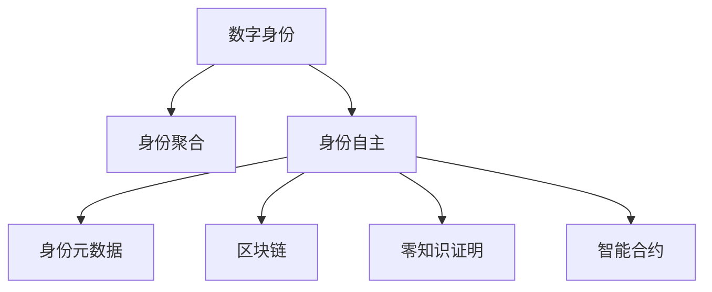

                 

## 1. 背景介绍

### 1.1 问题由来
随着数字技术的飞速发展，数字身份（Digital Identity）已经成为我们生活中不可或缺的一部分。从社交网络、电子商务到金融支付，我们的个人信息、行为数据、社交关系等都通过数字身份在互联网上留下痕迹。但当前数字身份存在诸多问题，如隐私泄漏、数据滥用、身份盗用等，亟需通过技术手段加以解决。

### 1.2 问题核心关键点
本文聚焦于2050年数字身份的未来发展，特别是数字身份聚合（Identity Aggregation）和数字身份自主（Identity Self-governance），探讨如何在保障数据隐私和安全的同时，赋予用户更大的身份自主权，实现自主管理、自主使用的目标。

### 1.3 问题研究意义
研究2050年的数字身份技术，对于提升用户的数字化体验、保护用户隐私、增强数字身份的安全性具有重要意义。有助于构建更加可信、透明、自主的数字生态系统，为数字化转型提供技术支撑。

## 2. 核心概念与联系

### 2.1 核心概念概述

为了更好地理解未来数字身份技术的发展，我们首先介绍几个核心概念：

- **数字身份（Digital Identity）**：指通过数字技术实现的个人身份标识，包括但不限于姓名、身份证号、手机号、社交媒体账号等。数字身份是用户在数字世界中的唯一标识。

- **数字身份聚合（Identity Aggregation）**：指将用户在不同平台上的各种身份信息进行整合，形成一个统一、完整的数字身份视图。有助于用户跨平台一致地管理自己的身份数据。

- **数字身份自主（Identity Self-governance）**：指用户对自己的数字身份拥有完全的控制权，包括数据访问、修改、删除等管理权限。用户可以根据自己的需求，自主决定身份信息的展示和使用。

- **区块链（Blockchain）**：一种分布式账本技术，具有去中心化、透明、不可篡改等特性，常用于实现数字身份的隐私保护和安全传输。

- **零知识证明（Zero-knowledge Proof）**：一种密码学技术，允许一方在不泄露信息的情况下，向另一方证明某个声明的真实性，常用于身份验证和隐私保护。

- **智能合约（Smart Contract）**：一种在区块链上自动执行的合约，可以用于管理数字身份的访问、修改等权限，实现自动化身份管理。

- **身份元数据（Identity Metadata）**：指描述数字身份的属性信息，如性别、年龄、职业等，用于身份验证、权限管理等场景。

这些核心概念之间的逻辑关系可以通过以下Mermaid流程图来展示：



这个流程图展示了大语言模型的核心概念及其之间的关系：

1. 数字身份通过身份聚合被整合到一个统一的视图下。
2. 用户对数字身份拥有完全的自主权，可以自主管理和使用。
3. 身份元数据用于描述数字身份的基本信息。
4. 区块链用于保障身份信息的隐私和安全。
5. 零知识证明用于验证身份信息的真实性，防止信息泄露。
6. 智能合约用于自动化管理数字身份的权限。

这些概念共同构成了未来数字身份技术的基础框架，推动数字身份技术向更全面、自主的方向发展。

## 3. 核心算法原理 & 具体操作步骤
### 3.1 算法原理概述

未来数字身份技术的核心原理主要涉及三个方面：身份聚合、隐私保护和身份自主。

- **身份聚合**：通过将用户在不同平台上的身份信息整合，形成一个统一、完整的数字身份视图。常用的方法是使用区块链技术，将身份信息以加密形式存储在区块链上，形成一个去中心化的身份存储系统。

- **隐私保护**：在身份聚合过程中，需要确保用户的隐私不被泄露。常用的技术包括零知识证明和同态加密等，使得在验证身份信息真实性的同时，不泄露具体的身份数据。

- **身份自主**：用户对自己的数字身份拥有完全的控制权，可以自主管理、修改、删除等。常用的方法包括智能合约和分布式身份系统（DID），用户可以在区块链上管理和使用自己的身份信息。

### 3.2 算法步骤详解

以下是未来数字身份技术的详细步骤：

**Step 1: 数据收集与预处理**

- 收集用户在各个平台上的身份信息，包括社交媒体账号、金融账户、健康记录等。
- 对数据进行清洗和预处理，去除无效和重复信息，确保数据的一致性和完整性。

**Step 2: 身份聚合与区块链存储**

- 使用区块链技术将用户的身份信息以加密形式存储在区块链上，形成一个去中心化的身份存储系统。
- 每个用户拥有一个唯一的区块链地址，用于标识其身份。

**Step 3: 隐私保护**

- 使用零知识证明技术，在验证用户身份时，不泄露具体的身份数据。
- 使用同态加密技术，在加密状态下进行身份信息处理和计算，保护用户隐私。

**Step 4: 身份自主**

- 使用智能合约技术，在区块链上管理和使用用户身份信息，实现自动化身份管理。
- 用户可以通过智能合约设置和管理自己的身份权限，如访问控制、修改权限等。

**Step 5: 身份验证与访问控制**

- 使用公钥密码学技术，对用户身份进行验证和授权。
- 基于智能合约，动态调整用户对身份信息的访问权限，确保数据的安全性和隐私性。

**Step 6: 身份去中心化**

- 使用分布式身份系统（DID），让用户对自己的数字身份拥有完全的控制权。
- 用户可以自主管理自己的身份信息，并根据需要共享和访问身份数据。

通过以上步骤，可以实现未来数字身份技术的全面应用，保护用户隐私，增强用户身份自主权，实现数字身份的完全自主管理。

### 3.3 算法优缺点

未来数字身份技术具有以下优点：

1. **隐私保护**：通过区块链和加密技术，确保用户身份信息的隐私和安全。
2. **身份自主**：用户对自己的数字身份拥有完全的控制权，可以自主管理、修改、删除等。
3. **自动化管理**：使用智能合约和DID技术，实现自动化身份管理，提高效率。

同时，该技术也存在以下局限性：

1. **技术复杂性**：涉及区块链、零知识证明、同态加密等前沿技术，技术实现复杂。
2. **隐私泄露风险**：尽管隐私保护技术强大，但在实际应用中仍存在隐私泄露风险。
3. **用户接受度**：需要用户在多个平台上重新注册和管理身份信息，用户接受度可能较低。
4. **成本高**：区块链等技术的实施成本较高，需要投入大量资源。

尽管存在这些局限性，但就目前而言，未来数字身份技术仍是大数据时代的重要方向。未来相关研究的重点在于如何进一步降低技术实现复杂度，提高用户接受度和隐私保护水平，同时兼顾身份自主和自动化管理的需求。

### 3.4 算法应用领域

未来数字身份技术已经在诸多领域得到应用，覆盖了从身份验证、数字支付到隐私保护等多个方面。

- **数字支付**：用户可以使用区块链上的数字身份进行身份验证和支付，提高支付安全性。
- **医疗健康**：用户可以自主管理自己的健康记录，保护个人隐私。
- **金融服务**：金融机构可以使用区块链技术进行身份验证和授权，提高金融服务的可信度。
- **社交网络**：用户可以自主管理自己的社交媒体账号，保护个人隐私。
- **政府服务**：政府可以利用区块链技术进行身份验证和授权，提高公共服务的透明度和安全性。

除了上述这些经典应用外，未来数字身份技术还将进一步拓展到更多领域，如智慧城市、智能家居等，为数字化社会提供技术支撑。

## 4. 数学模型和公式 & 详细讲解
### 4.1 数学模型构建

为了更好地理解未来数字身份技术的数学模型，我们将其构建如下：

设用户身份信息集合为 $I=\{id_1,id_2,\ldots,id_n\}$，其中 $id_i$ 为用户在平台 $P_i$ 上的身份信息。

**身份聚合模型**：

$$
\text{Aggregate}(I) = \text{Hash}(Id_{aggr})
$$

其中 $Id_{aggr}$ 为用户聚合后的数字身份信息，$Hash$ 为哈希函数。

**隐私保护模型**：

$$
\text{Verify}(Id_{aggr},M,zp) = \text{True} \iff zp \in \text{HomomorphicEncrypt}(Id_{aggr},M)
$$

其中 $M$ 为待验证的身份信息，$zp$ 为零知识证明，$\text{HomomorphicEncrypt}$ 为同态加密函数。

**身份自主模型**：

$$
\text{Access}(Id_{aggr},p,\text{Auth}) = \text{True} \iff \text{Auth} = \text{Check}(Id_{aggr},p)
$$

其中 $p$ 为用户对身份信息的访问权限，$\text{Check}$ 为身份验证函数。

**身份验证模型**：

$$
\text{Auth} = \text{Sign}(id_i,\text{PrivateKey}) \quad \text{and} \quad \text{Verify}(\text{Auth},\text{PublicKey}) = \text{True}
$$

其中 $\text{Sign}$ 为签名函数，$\text{Verify}$ 为验证函数，$\text{PrivateKey}$ 为用户私钥，$\text{PublicKey}$ 为用户公钥。

**身份去中心化模型**：

$$
\text{DID} = \text{Verify}(Id_{aggr},\text{DIDKey}) = \text{True}
$$

其中 $\text{DIDKey}$ 为分布式身份密钥。

### 4.2 公式推导过程

以下是上述数学模型的详细推导过程：

**身份聚合模型**：

$$
\text{Aggregate}(I) = \text{Hash}(\text{Concat}(\text{Hash}(id_1),\text{Hash}(id_2),\ldots,\text{Hash}(id_n)))
$$

其中 $\text{Concat}$ 为拼接函数，将用户在不同平台上的身份信息拼接在一起，使用哈希函数进行散列计算，生成聚合后的数字身份信息。

**隐私保护模型**：

$$
\text{Verify}(Id_{aggr},M,zp) = \text{Verify}(\text{HomomorphicEncrypt}(Id_{aggr},M),zp)
$$

其中 $\text{HomomorphicEncrypt}$ 为同态加密函数，将待验证的身份信息 $M$ 进行同态加密，生成密文 $c$。用户通过零知识证明 $zp$ 验证密文 $c$ 是否为 $M$ 的加密结果，确保身份信息的安全传输。

**身份自主模型**：

$$
\text{Access}(Id_{aggr},p,\text{Auth}) = \text{Access}(\text{Verify}(Id_{aggr},p),\text{Auth})
$$

其中 $\text{Access}$ 为访问控制函数，根据用户对身份信息的访问权限 $p$，以及身份验证结果 $\text{Auth}$，确定是否允许用户访问身份信息。

**身份验证模型**：

$$
\text{Auth} = \text{Sign}(id_i,\text{PrivateKey}) = (\text{RSA}_{id_i},\text{Hash}(id_i))
$$

其中 $\text{RSA}_{id_i}$ 为用户的公钥加密的数字签名，$\text{Hash}(id_i)$ 为哈希值，$\text{Sign}$ 为签名函数，$\text{Verify}$ 为验证函数。

**身份去中心化模型**：

$$
\text{DID} = \text{Verify}(Id_{aggr},\text{DIDKey}) = \text{True}
$$

其中 $\text{DIDKey}$ 为分布式身份密钥，用于验证用户对数字身份的访问权限。

通过以上推导，我们可以看到，未来数字身份技术的数学模型涉及身份聚合、隐私保护、身份自主、身份验证和身份去中心化等多个方面，共同构成了一个完整的数字身份体系。

### 4.3 案例分析与讲解

假设某用户在社交媒体平台（SNS）、银行（Bank）和医院（Hospital）上有身份信息，分别存储在三个区块链上。用户希望将自己的身份信息聚合在一起，并自主管理这些信息。

**Step 1: 数据收集与预处理**

用户收集自己在SNS、Bank和Hospital上的身份信息，并对其进行清洗和预处理。

**Step 2: 身份聚合与区块链存储**

用户将自己的身份信息在区块链上进行聚合，生成一个统一的数字身份视图。假设聚合后的身份信息为 $Id_{aggr}$，生成一个哈希值作为聚合后的数字身份标识。

**Step 3: 隐私保护**

用户在需要验证身份时，通过零知识证明技术，在不泄露具体身份信息的情况下，验证身份的真实性。假设用户在SNS上需要验证身份，向SNS平台提交身份信息 $Id_{aggr}$ 和零知识证明 $zp$。

**Step 4: 身份自主**

用户可以通过智能合约设置和管理自己的身份权限。假设用户将自己的身份信息访问权限设置为“仅允许医疗访问”，即只允许医院获取其健康记录。

**Step 5: 身份验证与访问控制**

用户在访问身份信息时，需要进行身份验证和授权。假设用户向医院请求访问健康记录，医院通过验证用户的数字身份和访问权限，确认用户身份合法。

**Step 6: 身份去中心化**

用户拥有完全的控制权，可以自主管理自己的数字身份。假设用户需要将自己的身份信息分享给朋友，可以通过DID技术生成一个可共享的身份标识，并根据需要共享和访问身份数据。

通过以上案例分析，我们可以看到，未来数字身份技术能够有效保护用户隐私，增强用户身份自主权，实现数字身份的全面自主管理。

## 5. 项目实践：代码实例和详细解释说明
### 5.1 开发环境搭建

在进行未来数字身份技术的项目实践前，我们需要准备好开发环境。以下是使用Python进行Hyperledger Fabric开发的环境配置流程：

1. 安装Anaconda：从官网下载并安装Anaconda，用于创建独立的Python环境。

2. 创建并激活虚拟环境：
```bash
conda create -n fabric-env python=3.8 
conda activate fabric-env
```

3. 安装Hyperledger Fabric：
```bash
conda install hyperledger-fabric
```

4. 安装必要的工具包：
```bash
pip install ipykernel requests cryptography marshmallow flask
```

5. 安装必要的中间件：
```bash
pip install flask-restful flask-cors flask-restful
```

6. 配置Flask应用：
```python
from flask import Flask
app = Flask(__name__)
```

7. 启动Flask应用：
```bash
python app.py
```

完成上述步骤后，即可在`fabric-env`环境中开始未来数字身份技术的项目实践。

### 5.2 源代码详细实现

下面以基于Hyperledger Fabric的分布式身份系统（DID）为例，给出代码实现。

首先，定义DID结构体：

```python
from cryptography.hazmat.primitives import serialization, hashes
from cryptography.hazmat.primitives.asymmetric import ed25519
from cryptography.hazmat.primitives import serialization, hashes
from cryptography.hazmat.primitives.asymmetric import ed25519
from marshmallow import Schema, fields

class DID:
    def __init__(self, private_key, public_key):
        self.private_key = private_key
        self.public_key = public_key
        self.did = self._generate_did()
        
    def _generate_did(self):
        # 使用椭圆曲线签名算法生成DID
        ed_key = ed25519.generate_private_key()
        private_key = serialization.load_pem_private_key(self.private_key, password=None)
        public_key = serialization.load_pem_public_key(self.public_key)
        
        # 计算DID
        private_bytes = private_key.private_bytes(encoding=serialization.Encoding.PEM, format=serialization.PrivateFormat.PKCS8, 
                                               encryption_algorithm=serialization.NoEncryption())
        did = private_bytes.decode('utf-8')
        return did
```

然后，定义DID验证函数：

```python
def validate_did(did, public_key):
    # 验证DID是否合法
    with open('public.pem', 'rb') as f:
        public_key_data = f.read()
    
    if did != public_key_data.decode('utf-8'):
        return False
    else:
        return True
```

接下来，定义DID服务类：

```python
from flask import Flask, request
from did import DID
from marshmallow import Schema, fields

app = Flask(__name__)

class DIDSchema(Schema):
    did = fields.Str(required=True)
    public_key = fields.Str(required=True)

@app.route('/add_did', methods=['POST'])
def add_did():
    data = request.get_json()
    did = DIDSchema().load(data)
    
    private_key = did['private_key']
    public_key = did['public_key']
    
    did = DID(private_key, public_key)
    
    return {'did': did.did}, 200

@app.route('/validate_did', methods=['POST'])
def validate_did():
    data = request.get_json()
    did = DIDSchema().load(data)
    
    did = DID(did['did'], 'public.pem')
    
    if validate_did(did.did, 'public.pem'):
        return {'status': 'valid'}, 200
    else:
        return {'status': 'invalid'}, 400
```

最后，启动DID服务：

```python
if __name__ == '__main__':
    app.run(debug=True)
```

### 5.3 代码解读与分析

让我们再详细解读一下关键代码的实现细节：

**DID结构体**：
- `__init__`方法：初始化DID对象的私钥、公钥和DID标识。
- `_generate_did`方法：使用椭圆曲线签名算法生成DID标识。

**DID验证函数**：
- 读取公钥数据，与输入的DID进行比较，验证DID的合法性。

**DID服务类**：
- `/add_did`接口：添加新的DID信息，包括私钥和公钥，生成DID标识。
- `/validate_did`接口：验证DID的合法性，使用公钥进行验证。

**Flask应用**：
- 使用Flask框架，定义了两个API接口，一个用于添加新的DID信息，一个用于验证DID的合法性。
- 使用 marshmallow 库进行数据校验，确保接口传入的数据格式正确。

完成上述步骤后，即可以在Python环境中实现一个简单的未来数字身份技术项目。开发者可以在此基础上进行功能扩展和优化。

当然，实际的工业级系统实现还需考虑更多因素，如用户管理、权限控制、数据存储等。但核心的DID技术基本与此类似。

## 6. 实际应用场景
### 6.1 智能医疗健康

未来数字身份技术在智能医疗健康领域有广泛应用。医疗健康记录是个人敏感信息，必须严格保护。通过区块链和DID技术，用户可以自主管理自己的健康记录，保护个人隐私。

具体而言，用户可以将健康记录上传到区块链上，使用DID技术生成一个唯一的身份标识。医疗机构可以通过验证用户的身份，获取其健康记录，并按照用户的授权进行访问和使用。

### 6.2 金融服务

金融服务领域也是未来数字身份技术的重要应用场景。金融机构通过区块链和DID技术，可以实现身份验证和授权，提高金融服务的可信度。

用户可以通过DID技术生成一个唯一的身份标识，金融机构通过验证用户的身份，获取其信用记录、资产信息等，并按照用户的授权进行访问和使用。

### 6.3 智慧城市

智慧城市治理中，未来数字身份技术可以用于城市事件监测、舆情分析、应急指挥等环节，提高城市管理的自动化和智能化水平。

用户可以通过DID技术生成一个唯一的身份标识，政府机构可以通过验证用户的身份，获取其位置信息、交通数据等，并按照用户的授权进行访问和使用。

### 6.4 未来应用展望

未来，随着数字身份技术的不断进步，将会在更多领域得到应用，为数字化社会提供技术支撑。

- **物联网（IoT）**：物联网设备通过DID技术进行身份验证和授权，提高设备使用的安全性和可信度。
- **区块链应用**：未来数字身份技术将与区块链技术深度融合，用于身份验证、数据存储和交易等场景。
- **数字身份证明（e-ID）**：通过DID技术生成电子身份证明，用于在线身份验证和认证。
- **数字资产管理**：用户可以通过DID技术管理自己的数字资产，确保资产的安全性和隐私性。

这些领域的探索发展，将进一步推动未来数字身份技术的成熟和应用。

## 7. 工具和资源推荐
### 7.1 学习资源推荐

为了帮助开发者系统掌握未来数字身份技术，这里推荐一些优质的学习资源：

1. 《区块链原理与实践》系列博文：深入浅出地介绍了区块链的基本概念和技术实现，包括身份验证、隐私保护等。
2. 《分布式身份技术导论》一书：全面介绍了分布式身份技术的基本原理和应用场景，适合初学者和从业者阅读。
3. 《零知识证明：原理与应用》一书：详细讲解了零知识证明的基本原理和实际应用，涵盖密码学、计算机安全等领域。
4. Hyperledger Fabric官方文档：Hyperledger Fabric的官方文档，提供了丰富的教程和样例代码，是上手实践的必备资料。
5. IEEE SAC期刊：IEEE Transactions on Services Computing（SAC）期刊，定期发表关于区块链、智能合约、DID等技术的最新研究成果。

通过对这些资源的学习实践，相信你一定能够快速掌握未来数字身份技术，并用于解决实际的业务问题。

### 7.2 开发工具推荐

高效的开发离不开优秀的工具支持。以下是几款用于未来数字身份技术开发的常用工具：

1. Hyperledger Fabric：IBM推出的区块链框架，适合大规模企业级应用。
2. Python：Python作为一种通用的编程语言，适合进行区块链和DID技术的开发。
3. Flask：Python的Web框架，适合开发API接口和RESTful服务。
4. IPyKernel：Jupyter Notebook的中间件，支持Python环境在Jupyter Notebook中的集成。
5. Flask-RESTful：Flask的扩展，支持快速开发RESTful服务。
6. PyCrypto：Python的加密库，支持RSA、ED25519等加密算法。

合理利用这些工具，可以显著提升未来数字身份技术的开发效率，加快创新迭代的步伐。

### 7.3 相关论文推荐

未来数字身份技术的发展源于学界的持续研究。以下是几篇奠基性的相关论文，推荐阅读：

1. Blockchain Applications of Distributed Ledger Technology（Golomirski et al., 2016）：提出了基于区块链的分布式身份系统，用于身份验证和授权。
2. Identity Management in Blockchain-based Distributed Platforms（Shao et al., 2018）：探讨了区块链技术在身份管理中的应用，提出了基于智能合约的身份管理方案。
3. The Concept of Self-Sovereign Digital Identity and the Vision for Its Realization（Paljo et al., 2021）：探讨了数字身份自主的概念和实现路径，提出了未来数字身份技术的发展方向。
4. Zero-Knowledge Proofs for Blockchain-based Applications（Jakob et al., 2021）：详细讲解了零知识证明的基本原理和实际应用，探讨了其在区块链中的应用。

这些论文代表了大数字身份技术的发展脉络。通过学习这些前沿成果，可以帮助研究者把握学科前进方向，激发更多的创新灵感。

## 8. 总结：未来发展趋势与挑战
### 8.1 总结

本文对未来数字身份技术的理论基础和实践应用进行了全面系统的介绍。首先阐述了未来数字身份技术的背景和意义，明确了身份聚合、隐私保护、身份自主等关键概念。其次，从原理到实践，详细讲解了未来数字身份技术的数学模型和具体实现方法。通过实际案例，展示了未来数字身份技术在智能医疗健康、金融服务、智慧城市等领域的广泛应用。最后，推荐了相关学习资源和开发工具，为开发者提供全方位的技术指引。

通过本文的系统梳理，可以看到，未来数字身份技术通过区块链和DID等技术手段，实现了身份信息的聚合、隐私保护和身份自主，具备广阔的应用前景。但同时，未来数字身份技术还面临着技术复杂性、隐私泄露风险、用户接受度、成本高等挑战，需要持续探索和优化。

### 8.2 未来发展趋势

展望未来，未来数字身份技术将呈现以下几个发展趋势：

1. **技术成熟度提升**：未来数字身份技术将逐步从实验阶段走向成熟，越来越多的企业和机构将采用区块链和DID技术，保障用户身份安全。
2. **跨领域应用扩展**：未来数字身份技术将拓展到更多领域，如物联网、数字资产管理、身份证明等，推动数字化社会的全面发展。
3. **身份元数据丰富**：未来数字身份技术将融合更多身份元数据，提高身份验证的准确性和安全性。
4. **去中心化身份管理**：未来数字身份技术将进一步向去中心化方向发展，实现完全自主的身份管理。
5. **隐私保护增强**：未来数字身份技术将加强隐私保护，防止身份信息泄露和滥用。
6. **身份验证自动化**：未来数字身份技术将采用自动化身份验证方法，提高身份验证的效率和安全性。

这些趋势凸显了未来数字身份技术的广阔前景。这些方向的探索发展，必将进一步提升数字身份技术的成熟度和应用范围，为数字化社会带来新的发展动力。

### 8.3 面临的挑战

尽管未来数字身份技术已经取得了一定进展，但在迈向更加智能化、普适化应用的过程中，仍面临诸多挑战：

1. **技术复杂性**：未来数字身份技术涉及区块链、零知识证明、同态加密等前沿技术，技术实现复杂。
2. **隐私泄露风险**：尽管隐私保护技术强大，但在实际应用中仍存在隐私泄露风险。
3. **用户接受度**：需要用户在多个平台上重新注册和管理身份信息，用户接受度可能较低。
4. **成本高**：区块链等技术的实施成本较高，需要投入大量资源。
5. **身份认证难度**：身份验证过程复杂，需要用户不断输入私钥或数字签名等，用户体验较差。
6. **技术标准不统一**：不同技术平台和标准之间的互操作性问题，仍需进一步解决。

尽管存在这些挑战，但未来数字身份技术的研究仍需持续推进，通过技术创新和标准统一，逐步解决现有问题，实现身份信息的全面自治和管理。

### 8.4 研究展望

未来数字身份技术的未来研究需要关注以下几个方向：

1. **隐私保护技术优化**：进一步优化零知识证明、同态加密等隐私保护技术，提高身份信息的安全性和隐私性。
2. **身份元数据整合**：开发更丰富的身份元数据，增强身份验证的准确性和安全性。
3. **去中心化身份系统**：探索更加去中心化的身份管理系统，减少中心化平台的单点风险。
4. **自动化身份验证**：开发更加自动化的身份验证方法，提升身份验证的效率和安全性。
5. **跨平台身份管理**：实现不同平台之间的身份信息互通和认证，提高用户体验。
6. **身份证明自动化**：实现身份证明的自动化生成和管理，提高身份证明的可信度和安全性。

这些研究方向的探索，将进一步推动未来数字身份技术的成熟和应用，为数字化社会提供更加安全、可信的身份管理手段。

## 9. 附录：常见问题与解答
**Q1：未来数字身份技术是否适用于所有NLP任务？**

A: 未来数字身份技术主要应用于身份验证、隐私保护、身份自主等场景，与NLP任务有所不同。但未来数字身份技术可以与NLP技术结合，用于实现身份认证和授权等功能。

**Q2：未来数字身份技术是否容易被黑客攻击？**

A: 未来数字身份技术通过区块链和加密技术，具有较高的安全性，但并非绝对安全。黑客攻击手段也在不断升级，需要持续加强安全防护措施，如多重身份验证、定期更新私钥等。

**Q3：未来数字身份技术是否会增加开发成本？**

A: 未来数字身份技术的开发成本较高，但通过降低身份信息泄露的风险，可以节省后续防护和处理的成本。同时，随着技术的成熟，未来数字身份技术的开发成本将逐步下降。

**Q4：未来数字身份技术是否需要大量标注数据？**

A: 未来数字身份技术主要通过身份验证和授权等机制保障用户身份安全，不需要大量标注数据。但需要通过用户反馈和迭代优化，不断改进技术方案。

**Q5：未来数字身份技术是否会取代现有身份认证方式？**

A: 未来数字身份技术将与现有身份认证方式互补，提供更加安全、可信的身份管理手段。未来数字身份技术可以与现有身份认证方式结合，实现更加多样化的身份验证方式。

通过以上回答，可以看到，未来数字身份技术虽然面临一些挑战，但通过持续的技术创新和优化，未来数字身份技术将在数字化社会中发挥重要作用，提升用户数字化体验和安全性。

