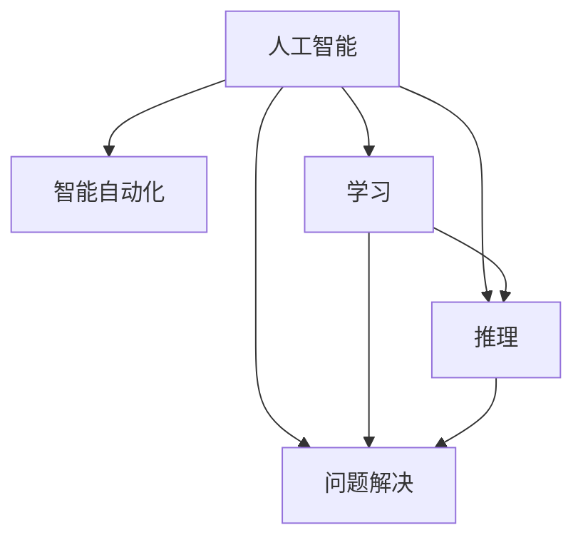

                 

## 1. 背景介绍

1956年，达特茅斯会议的召开标志着人工智能（AI）的诞生。这次会议汇集了包括麦卡锡、明斯基在内的众多顶尖学者，首次提出"人工智能"（Artificial Intelligence）一词，并在会上明确提出了AI的三项主要研究目标：让机器模拟人的学习、推理、问题解决能力，从而实现智能自动化。会议宣言指出："AI 是让机器执行通常需要智能的人类的任务"。

### 1.1 问题由来
1950年，Alan Turing在论文《计算机器与智能》中提出了著名的“图灵测试”，定义了智能行为的标准，开创了AI研究的新纪元。1956年，John McCarthy等人在达特茅斯会议上发表了《人工智能科学》宣言，提出要使机器像人一样思考，首次将人工智能上升到了科学研究高度。

### 1.2 问题核心关键点
会议提出的三项主要研究目标，即学习、推理和问题解决，成为了AI研究的核心方向：
1. **学习**：使机器通过经验积累提高能力，如机器学习、深度学习等。
2. **推理**：让机器模拟人的逻辑思维和推断过程，如知识表示、逻辑推理等。
3. **问题解决**：让机器具备处理特定问题的能力，如搜索算法、启发式算法等。

这三个目标相互交织，共同推动了AI技术的发展。本节将重点探讨这三个目标及其相互关系。

### 1.3 问题研究意义
达特茅斯会议的宣言为AI研究设定了明确的学术目标，并奠定了理论基础。此后几十年间，AI技术经历了多次起伏，但始终围绕着这三个核心目标展开，不断推动技术创新和应用拓展。了解宣言的核心思想，有助于把握AI研究的主线和发展方向。

## 2. 核心概念与联系

### 2.1 核心概念概述

本节将介绍几个与1956年达特茅斯会议宣言密切相关的核心概念，包括人工智能、智能自动化、学习、推理和问题解决，并探讨它们之间的联系。

- **人工智能**：指通过机器模拟人的智能行为，使机器能够执行通常需要智能的人类任务。
- **智能自动化**：利用人工智能技术实现自动化过程，使机器能够自主完成复杂任务。
- **学习**：机器通过数据、经验积累知识，提升解决问题的能力。
- **推理**：机器通过逻辑、规则、算法进行推断，得出结论或解决问题。
- **问题解决**：机器应用学习到的知识和推理能力，解决特定问题。

### 2.2 核心概念原理和架构的 Mermaid 流程图



这个流程图展示了各个核心概念之间的关系。可以看出，学习、推理和问题解决都是人工智能的组成部分，共同支撑了智能自动化的实现。

## 3. 核心算法原理 & 具体操作步骤

### 3.1 算法原理概述

AI的三个核心目标—学习、推理和问题解决—可以通过多种算法和技术手段实现。其中，学习算法主要利用数据驱动的机器学习、深度学习等方法，而推理和问题解决则涉及逻辑推理、搜索算法、启发式算法等多种技术。

### 3.2 算法步骤详解

以机器学习算法为例，其基本步骤如下：

1. **数据准备**：收集与任务相关的数据，进行清洗、预处理。
2. **特征工程**：提取数据中的关键特征，构建模型输入。
3. **模型训练**：利用训练集对模型进行训练，调整参数。
4. **模型评估**：在测试集上评估模型性能，选择合适的模型。
5. **模型应用**：将训练好的模型应用于实际问题中，完成智能自动化。

以推理算法为例，其基本步骤如下：

1. **知识表示**：将问题抽象为逻辑表达式，用符号表示。
2. **逻辑推理**：利用推理规则对逻辑表达式进行推导，得出结论。
3. **问题求解**：应用逻辑推理结果，解决具体问题。

### 3.3 算法优缺点

AI算法具有以下优点：

- **高效性**：机器学习算法能够快速处理大量数据，得出高效的结果。
- **准确性**：深度学习等模型在特定任务上能够达到高精度。
- **可扩展性**：算法可以在大规模系统中应用，实现智能自动化。

同时，也存在一些缺点：

- **依赖数据**：学习算法高度依赖数据质量，数据偏差可能导致错误结果。
- **复杂性**：算法实现复杂，对数据处理、特征工程要求高。
- **解释性不足**：一些模型如深度学习具有黑盒特性，难以解释其决策过程。

### 3.4 算法应用领域

AI算法在多个领域得到了广泛应用，包括但不限于：

- **医疗**：利用AI进行疾病诊断、药物研发等。
- **金融**：进行风险评估、欺诈检测等。
- **制造**：实现智能制造、质量检测等。
- **交通**：优化交通管理、自动驾驶等。
- **教育**：提供个性化学习、智能辅导等。

## 4. 数学模型和公式 & 详细讲解 & 举例说明

### 4.1 数学模型构建

以监督学习为例，其基本数学模型为：

$$
\hat{y} = f(\vec{x};\theta) = \sum_{i=1}^n w_i f_i(\vec{x})
$$

其中，$\vec{x}$ 为输入特征向量，$\hat{y}$ 为预测输出，$f_i$ 为第 $i$ 个特征函数，$w_i$ 为权重系数，$\theta$ 为模型参数。

### 4.2 公式推导过程

以线性回归为例，其目标是最小化预测值与真实值之间的平方误差：

$$
\min_{\theta} \frac{1}{2m} \sum_{i=1}^m (\hat{y}_i - y_i)^2
$$

其中，$m$ 为样本数量，$\hat{y}_i$ 为第 $i$ 个样本的预测值，$y_i$ 为真实值。

通过梯度下降等优化算法，求解上述目标函数，得到最优参数 $\theta$：

$$
\theta = \left( \sum_{i=1}^m x_i x_i^T \right)^{-1} \sum_{i=1}^m x_i y_i
$$

### 4.3 案例分析与讲解

以图像分类为例，其任务是将输入图像分类到不同的类别中。将图像特征作为输入向量，利用神经网络模型进行训练，得到最优参数 $\theta$。通过测试集评估模型性能，选择合适的模型。最终将训练好的模型应用于实际分类任务中，完成智能自动化。

## 5. 项目实践：代码实例和详细解释说明

### 5.1 开发环境搭建

为了进行项目实践，我们需要搭建好开发环境。以下是Python环境搭建步骤：

1. 安装Anaconda：从官网下载并安装Anaconda，用于创建独立的Python环境。
2. 创建并激活虚拟环境：
```bash
conda create -n py3_env python=3.8 
conda activate py3_env
```
3. 安装必要的Python库：
```bash
pip install numpy pandas sklearn scikit-learn matplotlib
```

### 5.2 源代码详细实现

以下是使用TensorFlow实现图像分类的示例代码：

```python
import tensorflow as tf
from tensorflow.keras import datasets, layers, models

# 加载数据集
(train_images, train_labels), (test_images, test_labels) = datasets.cifar10.load_data()

# 数据预处理
train_images = train_images / 255.0
test_images = test_images / 255.0

# 构建模型
model = models.Sequential([
    layers.Conv2D(32, (3, 3), activation='relu', input_shape=(32, 32, 3)),
    layers.MaxPooling2D((2, 2)),
    layers.Conv2D(64, (3, 3), activation='relu'),
    layers.MaxPooling2D((2, 2)),
    layers.Conv2D(64, (3, 3), activation='relu'),
    layers.Flatten(),
    layers.Dense(64, activation='relu'),
    layers.Dense(10)
])

# 编译模型
model.compile(optimizer='adam',
              loss=tf.keras.losses.SparseCategoricalCrossentropy(from_logits=True),
              metrics=['accuracy'])

# 训练模型
history = model.fit(train_images, train_labels, epochs=10, 
                    validation_data=(test_images, test_labels))

# 评估模型
test_loss, test_acc = model.evaluate(test_images,  test_labels, verbose=2)
print(test_acc)
```

### 5.3 代码解读与分析

上述代码实现了使用TensorFlow进行图像分类的过程。关键步骤如下：

1. 加载数据集：使用CIFAR-10数据集，包含60000张32x32像素的彩色图像，10个类别。
2. 数据预处理：将图像像素值归一化到[0, 1]范围内。
3. 构建模型：使用卷积神经网络模型，包括卷积层、池化层、全连接层等。
4. 编译模型：指定优化器、损失函数和评价指标。
5. 训练模型：使用训练集进行模型训练，设置训练轮数。
6. 评估模型：使用测试集评估模型性能，输出准确率。

## 6. 实际应用场景

### 6.1 智能客服系统

基于AI技术的智能客服系统，能够自动处理客户咨询，提升服务效率和质量。具体实现如下：

1. **数据准备**：收集历史客服对话记录，提取问题和回答。
2. **特征工程**：提取文本特征，如TF-IDF、词袋模型等。
3. **模型训练**：利用文本分类模型进行训练，得到最优参数。
4. **模型应用**：将训练好的模型应用于新客户咨询，完成智能回答。

### 6.2 金融风险评估

金融领域可以利用AI进行风险评估和欺诈检测，提升金融安全。具体实现如下：

1. **数据准备**：收集金融交易数据，包括交易金额、时间、地点等。
2. **特征工程**：提取关键特征，如交易金额、时间间隔等。
3. **模型训练**：利用分类模型进行训练，得到最优参数。
4. **模型应用**：将训练好的模型应用于实时交易监测，及时发现异常交易。

### 6.3 智能制造

AI技术在智能制造中应用广泛，包括质量检测、故障诊断等。具体实现如下：

1. **数据准备**：收集生产数据，如温度、压力、振动等。
2. **特征工程**：提取关键特征，如特征提取算法、时序模型等。
3. **模型训练**：利用预测模型进行训练，得到最优参数。
4. **模型应用**：将训练好的模型应用于生产监控，及时发现异常情况。

### 6.4 未来应用展望

未来，AI技术将在更多领域得到应用，如自动驾驶、智能家居、医疗健康等。具体展望如下：

- **自动驾驶**：利用AI进行环境感知、路径规划、决策控制等，实现自动驾驶。
- **智能家居**：通过语音、图像等输入，实现智能家居控制和环境感知。
- **医疗健康**：利用AI进行疾病诊断、药物研发、智能诊断等，提升医疗服务水平。

## 7. 工具和资源推荐

### 7.1 学习资源推荐

为了帮助开发者掌握AI技术，以下是几个优质的学习资源：

1. 《深度学习》课程：斯坦福大学开设的深度学习课程，涵盖了深度学习的基本理论和应用。
2. 《TensorFlow官方文档》：TensorFlow官方文档，提供了详尽的使用指南和示例代码。
3. 《动手学深度学习》：深度学习领域的经典教材，涵盖了深度学习的基本理论和实践。
4. Kaggle平台：数据科学和机器学习竞赛平台，提供了大量的数据集和模型竞赛，是实战学习的绝佳资源。
5. Coursera平台：提供多门高质量的AI和机器学习课程，涵盖从入门到进阶的各个层次。

### 7.2 开发工具推荐

以下是几个常用的AI开发工具：

1. TensorFlow：谷歌开源的深度学习框架，功能强大，支持多种模型和算法。
2. PyTorch：Facebook开源的深度学习框架，灵活易用，支持动态计算图。
3. Scikit-learn：Python的机器学习库，提供了丰富的算法和工具。
4. Keras：高级神经网络API，支持TensorFlow和Theano等后端，易于使用。
5. Jupyter Notebook：交互式数据科学笔记本，便于快速开发和实验。

### 7.3 相关论文推荐

以下是几篇经典的AI研究论文，推荐阅读：

1. Deep Blue：IBM开发的国际象棋AI，首次在特定领域取得突破。
2. AlphaGo：DeepMind开发的围棋AI，实现了人工智能在复杂领域的胜利。
3. GPT-3：OpenAI发布的通用语言模型，展示了大规模预训练模型的能力。
4. Transformer：Google提出的Transformer模型，开创了现代NLP模型的新纪元。
5. Reinforcement Learning：深度强化学习理论，广泛应用于游戏、机器人等领域。

## 8. 总结：未来发展趋势与挑战

### 8.1 总结

1956年达特茅斯会议的宣言标志着人工智能的诞生，提出了人工智能的三项主要研究目标：学习、推理和问题解决。AI技术在多个领域得到了广泛应用，并不断推动技术创新和应用拓展。

### 8.2 未来发展趋势

未来，AI技术将呈现以下几个发展趋势：

1. **深度学习与推理的结合**：深度学习模型将更多地结合逻辑推理，提升智能系统的决策能力。
2. **多模态融合**：AI系统将更多地融合视觉、听觉、语言等多种模态信息，提升感知和理解能力。
3. **自适应学习**：AI系统将具备自适应学习能力，能够不断学习新知识，适应数据分布的变化。
4. **联邦学习**：通过分布式训练和边缘计算，AI系统将具备更好的数据隐私保护和实时性。
5. **增强学习**：通过与环境互动，AI系统将具备更强的决策优化能力。

### 8.3 面临的挑战

尽管AI技术取得了巨大进展，但在实际应用中仍面临诸多挑战：

1. **数据隐私**：数据隐私和安全问题始终困扰AI应用，需要在保护隐私的前提下进行数据处理。
2. **模型可解释性**：许多AI模型如深度学习具有黑盒特性，难以解释其决策过程，需要提升模型可解释性。
3. **公平性与伦理**：AI系统可能存在偏见，导致不公平的决策，需要建立公平性评估机制。
4. **数据质量**：数据质量和多样性对AI模型效果至关重要，需要持续优化数据收集和处理流程。
5. **计算资源**：大规模深度学习模型需要大量的计算资源，如何提高计算效率，降低资源成本，是重要的研究方向。

### 8.4 研究展望

未来，AI研究需要在以下几个方向寻求新的突破：

1. **多领域知识融合**：将符号化的先验知识与神经网络模型结合，提升模型的综合能力。
2. **因果推理与解释**：通过引入因果推理，提升模型决策的合理性和可解释性。
3. **跨模态智能**：将视觉、听觉、语言等多种模态信息融合，提升智能系统的感知和理解能力。
4. **自适应学习与动态调整**：使AI系统具备自适应学习能力，能够不断学习新知识，适应数据分布的变化。
5. **模型压缩与优化**：通过模型压缩和优化，提升AI模型的计算效率和实时性。

## 9. 附录：常见问题与解答

**Q1：达特茅斯会议宣言中的“学习”具体指什么？**

A: “学习”是指机器通过数据、经验积累知识，提升解决问题的能力。具体实现方式包括机器学习、深度学习等。

**Q2：机器学习和深度学习有什么区别？**

A: 机器学习是让机器通过数据学习规律，做出预测或决策；深度学习是机器学习的一种特殊形式，通过多层神经网络进行特征提取和抽象，实现复杂的数据建模和预测。

**Q3：如何训练一个高效的神经网络模型？**

A: 训练高效的神经网络模型需要考虑以下几个方面：
1. 数据准备：收集高质量的数据，并进行清洗和预处理。
2. 模型选择：选择适合任务的神经网络模型，如卷积神经网络、循环神经网络等。
3. 超参数调优：通过网格搜索、随机搜索等方式，找到最优的超参数组合。
4. 正则化技术：使用L2正则、Dropout等技术，防止过拟合。
5. 模型评估：使用验证集和测试集评估模型性能，选择合适的模型。

**Q4：AI在医疗领域的应用前景是什么？**

A: AI在医疗领域的应用前景广阔，包括疾病诊断、药物研发、智能诊断等。AI可以帮助医生提高诊断准确性，加速新药开发进程，提升医疗服务水平。

**Q5：AI在金融风险评估中的作用是什么？**

A: AI在金融风险评估中的应用包括交易监控、欺诈检测、信用评分等。AI可以通过分析交易数据，识别异常行为，及时发现潜在风险，提升金融安全。

---

作者：禅与计算机程序设计艺术 / Zen and the Art of Computer Programming

