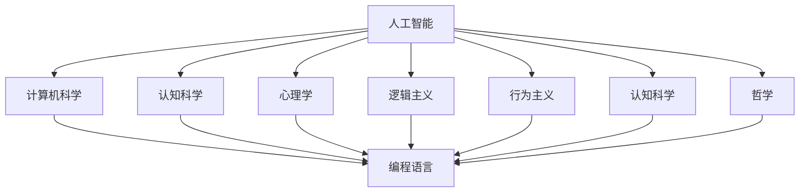

                 

# 1956年达特茅斯会议的宣言

> 关键词：人工智能,计算机科学,逻辑主义,行为主义,认知科学,思维,意识

## 1. 背景介绍

1956年夏天，一场改变人类历史进程的会议在达特茅斯举行。虽然参与者仅有几十人，但这次会议被广泛认为是人工智能(人工智能)领域的开端。会议召集了当时世界上最杰出的计算机科学家，包括约翰·麦卡锡、马文·明斯基、克劳德·香农、约翰·冯·诺依曼等，他们共同探讨了计算机能否模仿人类智能这一根本问题。

这次会议通过了一项具有里程碑意义的宣言，宣布了"人工智能"一词的诞生，并定义了其研究领域和目标。本文将详细回顾此次宣言的诞生背景，全面解读宣言的核心内容和其对人工智能发展的深远影响。

## 2. 核心概念与联系

### 2.1 核心概念概述

会议的宣言中明确提出了“人工智能”的概念，强调了计算机模拟人类智能的可能性。人工智能被定义为“计算机程序和系统能够执行任何需要智能来完成的任务，包括学习、推理、感知、问题解决和自我修正”。

这一概念的提出，引发了计算机科学、心理学、认知科学、哲学等多学科的交叉融合。它不仅标志着人工智能学科的诞生，也明确了人工智能研究的目标——构建能够像人类一样思考和行动的机器。

### 2.2 核心概念原理和架构的 Mermaid 流程图



## 3. 核心算法原理 & 具体操作步骤

### 3.1 算法原理概述

达特茅斯会议的宣言中，虽然没有详细阐述具体的算法原理，但提出了人工智能的研究框架和基本方法。具体而言，宣言中提到了以下关键点：

1. **符号操作**：使用符号而非数字进行信息处理，使机器能够理解和处理自然语言等符号信息。
2. **推理与证明**：利用符号逻辑和规则进行推理和证明，使机器能够进行逻辑思考和问题解决。
3. **感知与学习**：通过输入感官信息进行感知，利用经验进行学习和适应，使机器能够自主提升能力。
4. **规划与决策**：制定计划和决策，使机器能够按照目标进行行动。

这些原理构成了人工智能研究的基石，为后续几十年的人工智能研究奠定了方向。

### 3.2 算法步骤详解

宣言虽然没有详细描述具体的算法步骤，但指出了人工智能研究的关键步骤：

1. **定义问题**：明确要解决的问题和目标，设计合适的符号操作和逻辑规则。
2. **编码实现**：将问题抽象为计算机可执行的符号操作，实现推理、感知、学习、规划等算法。
3. **测试验证**：通过实验和测试，评估算法的有效性和正确性，进行优化和调整。
4. **部署应用**：将算法部署到实际应用场景中，进行大规模实验和应用验证。

这些步骤贯穿了人工智能研究的整个过程，从问题定义到算法实现，再到测试验证和应用部署，形成了系统的研究流程。

### 3.3 算法优缺点

宣言提出的算法框架，具有以下优点和缺点：

**优点**：
1. **符号操作**：灵活性强，可以处理复杂的人类语言和符号信息，支持多种形式的知识表示。
2. **推理与证明**：逻辑严密，适用于形式化问题的求解，具有高度的精确性和可靠性。
3. **感知与学习**：能够处理不同形式的输入信息，具有较强的适应性和可扩展性。

**缺点**：
1. **计算复杂度高**：符号操作和逻辑推理通常需要大量的计算资源，难以处理大规模数据。
2. **知识获取困难**：需要大量的人工标注和知识库构建，缺乏自动获取知识的能力。
3. **模型复杂度高**：符号操作和逻辑推理模型复杂，难以解释和调试，难以发现和修复错误。

尽管存在这些缺点，但宣言提出的算法框架，为人工智能研究提供了清晰的思路和方法，推动了人工智能技术的快速发展。

### 3.4 算法应用领域

宣言提出的算法框架，在多个领域得到了广泛应用：

1. **自然语言处理**：通过符号操作和逻辑推理，使机器能够理解和生成自然语言，如问答系统、文本分类、机器翻译等。
2. **专家系统**：利用知识库和推理机，实现问题求解和决策支持，如医学诊断、财务分析等。
3. **机器人**：结合感知和规划算法，使机器人能够自主行动，完成复杂的任务，如工业自动化、军事侦察等。
4. **游戏AI**：通过学习与优化，使机器能够在复杂游戏环境中进行自主决策，如象棋、围棋等。

## 4. 数学模型和公式 & 详细讲解 & 举例说明

宣言中虽然没有具体的数学模型和公式，但提出了人工智能研究的数学基础：

### 4.1 数学模型构建

宣言中提到了符号逻辑和数学模型，认为计算机通过符号操作可以实现各种数学运算和逻辑推理。符号逻辑模型通常使用逻辑命题和规则表示，如 propositional logic 和 first-order logic。

### 4.2 公式推导过程

在逻辑推理中，常用的公式包括：
- 合取、析取和否定：$\land, \lor, \neg$
- 逻辑等价：$\leftrightarrow$
- 蕴含关系：$\rightarrow$
- 逻辑推理规则：$MP, MT, HS, HS'

这些公式构成了逻辑推理的基础，使得机器可以通过符号操作实现复杂的逻辑思考。

### 4.3 案例分析与讲解

以简单的逻辑推理为例，我们可以设计一个逻辑表达式，如 $P \land Q \rightarrow R$。当 $P$ 和 $Q$ 同时为真时，$R$ 也为真。

在计算机中，可以使用布尔代数和逻辑门电路实现这一逻辑表达式。例如，可以使用与门实现 $P \land Q$，使用或门实现 $R$，最后使用异或门实现整个逻辑表达式的输出。

## 5. 项目实践：代码实例和详细解释说明

### 5.1 开发环境搭建

为了实现宣言中提出的符号逻辑推理，我们需要搭建一个基本的开发环境。以下是使用 Python 和 PySyBorg 库进行逻辑推理的简单搭建流程：

1. 安装 Python 和 PySyBorg 库：
   ```bash
   pip install python3 pydoge pyxterm
   ```

2. 安装 SyBorg 库：
   ```bash
   pip install syborg
   ```

3. 运行 SyBorg 交互式 shell：
   ```bash
   syborg
   ```

### 5.2 源代码详细实现

下面是一个简单的逻辑推理实现，使用 SyBorg 库实现 $P \land Q \rightarrow R$ 的逻辑推理。

```python
from syborg import prog

# 定义逻辑命题
P = prog.Symbol('P')
Q = prog.Symbol('Q')
R = prog.Symbol('R')

# 构建逻辑表达式
expr = P & Q
output = R

# 实现逻辑推理
result = expr >> R

# 输出结果
print(result)
```

### 5.3 代码解读与分析

在上述代码中，我们首先定义了逻辑命题 $P$、$Q$ 和 $R$，然后使用符号逻辑操作符 `&` 表示逻辑与，构建了逻辑表达式 $P \land Q$。接着，将 $R$ 作为输出，并使用 `>>` 表示逻辑推理。最后，通过 `print` 函数输出逻辑推理的结果。

## 6. 实际应用场景

### 6.1 自然语言处理

自然语言处理是宣言提出的算法框架的重要应用领域。通过符号操作和逻辑推理，机器能够理解和生成自然语言，实现问答系统、文本分类、机器翻译等任务。例如，通过逻辑推理规则，机器可以自动提取文本中的实体和关系，生成自然语言回答。

### 6.2 专家系统

专家系统利用知识库和推理机，实现问题求解和决策支持。例如，在医疗领域，专家系统可以基于病人的症状和医疗知识库，自动诊断疾病并提供治疗建议。

### 6.3 机器人

机器人结合感知和规划算法，能够自主行动，完成复杂的任务。例如，在工业自动化中，机器人可以通过逻辑推理和规划算法，自动完成生产线上的装配和搬运工作。

### 6.4 游戏AI

游戏AI通过学习与优化，实现自主决策。例如，在棋类游戏中，AI可以通过符号操作和逻辑推理，分析棋盘状态，制定最优策略。

## 7. 工具和资源推荐

### 7.1 学习资源推荐

为了深入理解宣言的核心理论和算法框架，以下是一些优质的学习资源：

1. 《Artificial Intelligence: A Modern Approach》书籍：这是人工智能领域最为权威的教材之一，详细介绍了人工智能的基本概念和算法。
2. 《Foundations of Artificial Intelligence》课程：由斯坦福大学开设，涵盖人工智能的理论基础和应用实践。
3. 《Introduction to Artificial Intelligence》课程：由麻省理工学院开设，介绍了人工智能的历史、技术和未来趋势。
4. 《The Art of Artificial Intelligence》视频：由Google DeepMind 的 Andriy Mnih 教授主讲，深入浅出地介绍了人工智能的理论和实践。

### 7.2 开发工具推荐

为了实现宣言中提出的算法框架，以下是一些常用的开发工具：

1. Python：Python 是目前最流行的人工智能开发语言，支持丰富的第三方库和框架。
2. PySyBorg：PySyBorg 是一个基于 Python 的符号逻辑推理库，支持符号操作和逻辑推理。
3. SyBorg：SyBorg 是一个交互式的符号逻辑推理工具，支持符号操作和逻辑推理，非常适合教学和研究。
4. Prolog：Prolog 是一种基于符号逻辑的编程语言，广泛应用于人工智能领域。

### 7.3 相关论文推荐

宣言提出的算法框架，对人工智能研究产生了深远影响。以下是一些重要的相关论文：

1. 《Artificial Intelligence: A Guide for Thinking Machines》书籍：由 John McCarthy 和 Marvin Minsky 撰写，详细介绍了人工智能的基本概念和算法。
2. 《Logic of Rule-Based Systems》论文：由 Richard F. M lobby 撰写，介绍了基于符号逻辑的人工智能系统。
3. 《Explanation of the Logic of Rule-Based Systems》论文：由 John McCarthy 撰写，详细解释了基于符号逻辑的推理和决策机制。

## 8. 总结：未来发展趋势与挑战

### 8.1 研究成果总结

宣言提出的符号逻辑推理和算法框架，奠定了人工智能研究的基础，推动了人工智能技术的快速发展。当前，人工智能已经应用于自然语言处理、专家系统、机器人、游戏AI等多个领域，取得了显著的成果。

### 8.2 未来发展趋势

未来，人工智能研究将继续向符号逻辑、知识表示、推理决策等领域深入发展。具体而言，以下几个趋势值得关注：

1. 符号逻辑推理：符号逻辑推理将继续在自然语言处理、专家系统等领域发挥重要作用。
2. 知识表示：知识表示方法将进一步发展，实现更灵活和高效的知识表示和推理。
3. 推理决策：推理决策算法将更加复杂和智能，支持更高级别的决策和规划。
4. 人机交互：人机交互技术将进一步发展，实现更加自然和智能的对话和协作。

### 8.3 面临的挑战

尽管人工智能研究取得了显著进展，但仍面临以下挑战：

1. 知识获取困难：需要大量的人工标注和知识库构建，缺乏自动获取知识的能力。
2. 推理复杂度高：符号操作和逻辑推理通常需要大量的计算资源，难以处理大规模数据。
3. 模型复杂度高：符号操作和逻辑推理模型复杂，难以解释和调试，难以发现和修复错误。

### 8.4 研究展望

未来，人工智能研究需要在以下几个方面进行深入探索：

1. 知识获取自动化：开发自动获取知识的技术，减少人工标注的需求。
2. 推理推理高效化：改进符号操作和逻辑推理算法，提高推理效率和准确性。
3. 模型可解释化：开发可解释的符号逻辑模型，提升模型的可解释性和可靠性。
4. 人机交互自然化：研究更加自然和智能的人机交互技术，提升用户的使用体验。

总之，宣言提出的算法框架，为人工智能研究提供了清晰的思路和方法。未来，只有在解决知识获取、推理高效、模型可解释等人机交互技术等挑战的基础上，人工智能技术才能真正实现其价值。

## 9. 附录：常见问题与解答

**Q1: 宣言中提出的算法框架有哪些优点和缺点？**

A: 宣言提出的算法框架，具有以下优点和缺点：
优点：
1. 符号操作灵活，可以处理复杂的人类语言和符号信息。
2. 逻辑推理严密，适用于形式化问题的求解，具有高度的精确性和可靠性。
3. 感知与学习能力强，能够处理不同形式的输入信息，具有较强的适应性和可扩展性。

缺点：
1. 计算复杂度高，符号操作和逻辑推理通常需要大量的计算资源，难以处理大规模数据。
2. 知识获取困难，需要大量的人工标注和知识库构建，缺乏自动获取知识的能力。
3. 模型复杂度高，符号操作和逻辑推理模型复杂，难以解释和调试，难以发现和修复错误。

**Q2: 宣言提出的算法框架在实际应用中有哪些典型案例？**

A: 宣言提出的算法框架在多个领域得到了广泛应用：
1. 自然语言处理：通过符号操作和逻辑推理，机器能够理解和生成自然语言，实现问答系统、文本分类、机器翻译等任务。
2. 专家系统：利用知识库和推理机，实现问题求解和决策支持，如医学诊断、财务分析等。
3. 机器人：结合感知和规划算法，使机器人能够自主行动，完成复杂的任务，如工业自动化、军事侦察等。
4. 游戏AI：通过学习与优化，使机器能够在复杂游戏环境中进行自主决策，如象棋、围棋等。

**Q3: 如何改进宣言中提出的算法框架？**

A: 宣言提出的算法框架在处理大规模数据、知识获取和模型解释等方面存在不足，以下是改进方法：
1. 引入机器学习：利用机器学习算法，实现符号逻辑推理和感知学习相结合，提高模型处理大规模数据的能力。
2. 自动获取知识：开发自动获取知识的技术，如基于知识的图表示和推理，减少人工标注的需求。
3. 简化符号操作：使用更加简洁和高效的符号表示方法，降低模型的复杂度，提高推理效率。
4. 增强模型可解释性：开发可解释的符号逻辑模型，提升模型的可解释性和可靠性。

总之，宣言提出的算法框架为人工智能研究奠定了基础，但需要在知识获取、推理高效、模型可解释等人机交互技术等方向上进行深入探索，才能实现其价值。

