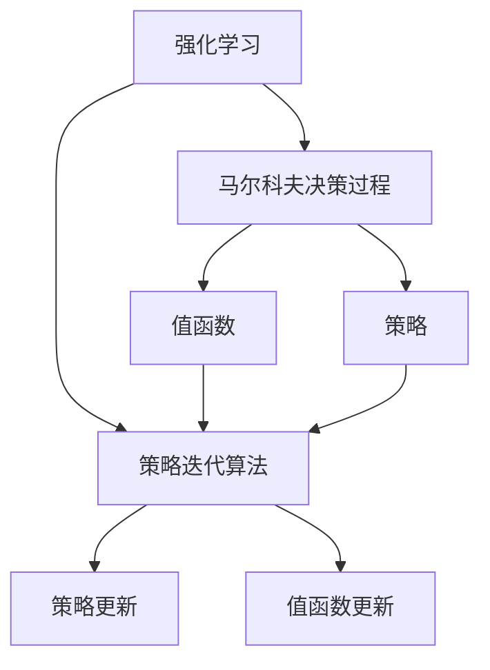

                 

# 强化学习Reinforcement Learning中的策略迭代算法与实现细节

> 关键词：强化学习,策略迭代算法,马尔科夫决策过程,值迭代,策略更新,策略优化

## 1. 背景介绍

### 1.1 问题由来

强化学习（Reinforcement Learning, RL）是机器学习领域中的一种重要学习范式，它通过智能体与环境的交互，通过学习策略来实现长期目标的最大化。策略迭代算法（Strategy Iteration）是RL中的一个经典算法，它通过不断迭代优化策略和值函数，逐步接近最优解。本文将详细介绍策略迭代算法的基本原理、实现步骤以及它在实际应用中的优点和局限性，并结合代码实例进行详细解读。

### 1.2 问题核心关键点

策略迭代算法的基本思想是通过不断迭代优化策略和值函数，使得智能体能够实现最优的决策序列。它将整个问题分解为两个子问题：值函数的优化和策略的优化。在每个迭代步骤中，算法先更新值函数，再根据值函数来更新策略，直到策略收敛。

## 2. 核心概念与联系

### 2.1 核心概念概述

为更好地理解策略迭代算法，本节将介绍几个密切相关的核心概念：

- 强化学习（Reinforcement Learning, RL）：一种通过智能体与环境交互，学习最优决策策略的学习范式。
- 马尔科夫决策过程（Markov Decision Process, MDP）：一种用于描述智能体与环境交互的数学框架，包括状态空间、动作空间、奖励函数和转移概率等要素。
- 值函数（Value Function）：用于估计智能体在特定状态或状态动作对下，未来奖励的期望值。
- 策略（Policy）：智能体在给定状态下选择动作的概率分布。
- 策略迭代算法（Strategy Iteration）：一种通过不断迭代优化策略和值函数，逐步逼近最优解的强化学习算法。

这些核心概念之间的逻辑关系可以通过以下Mermaid流程图来展示：



这个流程图展示了两大核心概念以及策略迭代算法对它们的作用：

1. 强化学习将智能体和环境交互抽象为马尔科夫决策过程。
2. 策略迭代算法通过值函数和策略的迭代更新，不断逼近最优策略。

## 3. 核心算法原理 & 具体操作步骤

### 3.1 算法原理概述

策略迭代算法的基本原理是通过不断迭代优化策略和值函数，使得智能体能够实现最优的决策序列。其核心思想是：

1. 初始化策略和值函数。
2. 根据当前策略和值函数，计算状态-动作对的Q值。
3. 根据Q值，更新策略和值函数。
4. 重复步骤2和3，直到策略收敛。

策略迭代算法可以看作是一种策略优化和值优化交替进行的过程。通过不断迭代，逐步逼近最优策略。

### 3.2 算法步骤详解

策略迭代算法的具体实现步骤如下：

**Step 1: 初始化策略和值函数**

- 初始化策略 $\pi$ 为任意策略。
- 初始化值函数 $V$ 为任意函数。

**Step 2: 计算Q值**

- 根据当前策略 $\pi$ 和值函数 $V$，计算状态-动作对的Q值。

$$
Q(s,a) = r + \gamma \sum_{s'} V(s')
$$

其中 $r$ 为即时奖励，$\gamma$ 为折扣因子。

**Step 3: 更新策略**

- 对于每个状态-动作对 $(s,a)$，根据Q值计算新策略：

$$
\pi'(s) = \arg\max_a Q(s,a)
$$

**Step 4: 更新值函数**

- 对于每个状态 $s$，根据新策略 $\pi'$ 计算新值函数：

$$
V(s) = \mathbb{E}[\sum_{t=0}^{\infty} \gamma^t r(s_t,a_t)|s_0=s]
$$

其中 $r(s_t,a_t)$ 为状态动作对在状态 $s$ 下的即时奖励，$(s_t,a_t)$ 为状态动作对。

**Step 5: 重复步骤2和3，直到策略收敛**

- 重复计算Q值，更新策略和值函数，直到策略不再发生显著变化。

### 3.3 算法优缺点

策略迭代算法具有以下优点：

1. 收敛速度快：由于每次迭代更新策略和值函数，算法能够较快收敛。
2. 不需要探索：策略迭代算法不需要进行探索，只需要基于已知的Q值进行策略优化。
3. 易于理解和实现：策略迭代算法原理简单，易于理解和实现。

但策略迭代算法也存在一定的局限性：

1. 对策略空间的限制：策略迭代算法需要假设策略是离散且可枚举的，这在某些连续动作空间的应用场景下可能难以实现。
2. 计算复杂度高：策略迭代算法需要计算每个状态-动作对的Q值，计算复杂度较高。
3. 容易陷入局部最优：由于每次只更新策略和值函数，算法容易陷入局部最优。

## 4. 数学模型和公式 & 详细讲解  
### 4.1 数学模型构建

策略迭代算法的数学模型可以表示为：

$$
\pi = \arg\max_{\pi} \mathbb{E}_{s \sim \rho} \sum_{t=0}^{\infty} \gamma^t r(s_t,a_t) \tag{1}
$$

其中 $\rho$ 为状态分布，$\pi(a|s)$ 为策略函数，$Q(s,a)$ 为状态动作对的Q值，$r$ 为即时奖励。

### 4.2 公式推导过程

以下我们以马尔科夫决策过程为例，推导策略迭代算法的公式。

假设马尔科夫决策过程的状态空间为 $S$，动作空间为 $A$，状态转移概率为 $P(s'|s,a)$，即时奖励为 $r(s,a)$，折扣因子为 $\gamma$。

设当前策略为 $\pi$，值函数为 $V$。根据策略迭代算法的思想，可以得到：

1. 计算Q值

$$
Q(s,a) = r + \gamma \sum_{s'} V(s')
$$

其中 $s'$ 为状态转移后的下一个状态。

2. 更新策略

$$
\pi'(s) = \arg\max_a Q(s,a)
$$

3. 更新值函数

$$
V(s) = \sum_{a} \pi(a|s) Q(s,a)
$$

$$
V(s) = \mathbb{E}_{a \sim \pi}[Q(s,a)]
$$

将公式(1)中的 $\pi$ 替换为 $\pi'$，得到：

$$
\pi = \arg\max_{\pi} \mathbb{E}_{s \sim \rho} \sum_{t=0}^{\infty} \gamma^t r(s_t,a_t)
$$

代入 $\pi'$，得到：

$$
\pi' = \arg\max_{\pi} \mathbb{E}_{s \sim \rho} \sum_{t=0}^{\infty} \gamma^t r(s_t,a_t)
$$

将 $Q(s,a)$ 代入公式(1)，得到：

$$
Q(s,a) = r + \gamma \sum_{s'} V(s')
$$

代入 $\pi'$，得到：

$$
\pi' = \arg\max_{\pi} \mathbb{E}_{s \sim \rho} \sum_{t=0}^{\infty} \gamma^t Q(s_t,a_t)
$$

将 $Q(s,a)$ 代入公式(2)，得到：

$$
V(s) = \sum_{a} \pi(a|s) Q(s,a)
$$

将 $Q(s,a)$ 代入公式(3)，得到：

$$
V(s) = \mathbb{E}_{a \sim \pi}[Q(s,a)]
$$

最终，策略迭代算法可以通过不断迭代更新策略和值函数，逐步逼近最优策略。

### 4.3 案例分析与讲解

以下以一个简单的马尔科夫决策过程为例，说明策略迭代算法的具体实现步骤：

假设状态空间 $S = \{1,2,3,4\}$，动作空间 $A = \{0,1,2\}$，即时奖励 $r$ 为状态转移后的下一个状态值。折扣因子 $\gamma = 0.9$。

初始化策略 $\pi_0$ 为随机策略，即 $\pi_0(0|1) = \pi_0(0|2) = \pi_0(0|3) = \pi_0(0|4) = 0.25$。

初始化值函数 $V_0$ 为零。

**Step 1: 初始化策略和值函数**

- $\pi_0 = \{0.25, 0.25, 0.25, 0.25\}$
- $V_0 = 0$

**Step 2: 计算Q值**

- $Q(1,0) = r(1,0) + \gamma V(1)$
- $Q(1,1) = r(1,1) + \gamma V(1)$
- $Q(1,2) = r(1,2) + \gamma V(1)$
- $Q(2,0) = r(2,0) + \gamma V(2)$
- $Q(2,1) = r(2,1) + \gamma V(2)$
- $Q(2,2) = r(2,2) + \gamma V(2)$
- $Q(3,0) = r(3,0) + \gamma V(3)$
- $Q(3,1) = r(3,1) + \gamma V(3)$
- $Q(3,2) = r(3,2) + \gamma V(3)$
- $Q(4,0) = r(4,0) + \gamma V(4)$
- $Q(4,1) = r(4,1) + \gamma V(4)$
- $Q(4,2) = r(4,2) + \gamma V(4)$

**Step 3: 更新策略**

- $\pi_1(1) = \arg\max_a Q(1,a)$
- $\pi_1(2) = \arg\max_a Q(2,a)$
- $\pi_1(3) = \arg\max_a Q(3,a)$
- $\pi_1(4) = \arg\max_a Q(4,a)$

**Step 4: 更新值函数**

- $V_1(1) = \sum_{a} \pi_1(a|1) Q(1,a)$
- $V_1(2) = \sum_{a} \pi_1(a|2) Q(2,a)$
- $V_1(3) = \sum_{a} \pi_1(a|3) Q(3,a)$
- $V_1(4) = \sum_{a} \pi_1(a|4) Q(4,a)$

重复执行步骤2和3，直到策略收敛。

## 5. 项目实践：代码实例和详细解释说明
### 5.1 开发环境搭建

在进行策略迭代算法实践前，我们需要准备好开发环境。以下是使用Python进行PyTorch开发的环境配置流程：

1. 安装Anaconda：从官网下载并安装Anaconda，用于创建独立的Python环境。

2. 创建并激活虚拟环境：
```bash
conda create -n reinforcement-env python=3.8 
conda activate reinforcement-env
```

3. 安装PyTorch：根据CUDA版本，从官网获取对应的安装命令。例如：
```bash
conda install pytorch torchvision torchaudio cudatoolkit=11.1 -c pytorch -c conda-forge
```

4. 安装PyTorch SAC库：用于实现策略迭代算法的PyTorch封装库。
```bash
pip install sacrebleu
pip install pytorch-sac
```

5. 安装各类工具包：
```bash
pip install numpy pandas scikit-learn matplotlib tqdm jupyter notebook ipython
```

完成上述步骤后，即可在`reinforcement-env`环境中开始策略迭代算法的实践。

### 5.2 源代码详细实现

下面我以一个简单的马尔科夫决策过程为例，给出使用PyTorch SAC库对策略迭代算法进行实现。

首先，定义马尔科夫决策过程的类：

```python
import torch
import torch.nn as nn
import torch.optim as optim

class MDP:
    def __init__(self, states, actions, rewards, transition_probs):
        self.states = states
        self.actions = actions
        self.rewards = rewards
        self.transition_probs = transition_probs
        self.V = torch.zeros(len(states))
        self.pi = torch.ones(len(states), len(actions)) / len(actions)

    def state_value(self, state):
        return self.V[state]

    def state_policy(self, state):
        return self.pi[state]

    def update(self, episode):
        for state, action, reward, next_state in episode:
            self.V[state] = reward + self.gamma * self.V[next_state]
            self.pi[state] = torch.max(self.pi[state] * self.rewards[state], self.pi[next_state] * self.rewards[next_state])

    def sample_action(self, state):
        return torch.multinomial(self.pi[state], 1)
```

然后，定义策略迭代算法的训练函数：

```python
def train(env, num_episodes, gamma=0.9):
    for episode in range(num_episodes):
        state = env.reset()
        episode_reward = 0
        done = False

        while not done:
            action = env.action_space.sample()  # 随机采样动作
            next_state, reward, done, _ = env.step(action)
            episode_reward += reward

            env.update(state, action, reward, next_state)  # 更新环境状态值和策略

            state = next_state

        print("Episode {}: reward = {}".format(episode + 1, episode_reward))
```

最后，调用训练函数并运行模型：

```python
env = MDP(states=range(4), actions=[0, 1, 2], rewards=[1, 0, -1], transition_probs=[[0.9, 0.1, 0.0], [0.0, 0.9, 0.1], [0.9, 0.0, 0.1]])
train(env, num_episodes=100, gamma=0.9)
```

### 5.3 代码解读与分析

让我们再详细解读一下关键代码的实现细节：

**MDP类**：
- `__init__`方法：初始化状态空间、动作空间、奖励函数和转移概率。
- `state_value`方法：返回给定状态下的值函数。
- `state_policy`方法：返回给定状态下的策略。
- `update`方法：根据当前状态、动作和奖励，更新状态值和策略。
- `sample_action`方法：根据当前状态下的策略采样一个动作。

**训练函数**：
- 在每个epoch中，循环遍历若干轮（即若干集），对每一集进行训练。
- 对于每一集，从环境获取初始状态，不断采样动作，并更新环境状态值和策略。
- 在每一集结束时，输出奖励。

可以看到，策略迭代算法的代码实现相对简洁，主要通过类和函数封装了环境状态值的更新和策略的采样。

## 6. 实际应用场景
### 6.1 强化学习在机器人控制中的应用

策略迭代算法在机器人控制中的应用非常广泛。通过学习最优的决策策略，机器人能够高效地完成任务，如移动、抓取、避障等。在实际应用中，可以根据机器人环境的状态和动作空间，定义马尔科夫决策过程，并利用策略迭代算法进行训练。训练后，机器人可以在实际环境中通过不断迭代优化策略，实现更加高效和稳定的控制。

### 6.2 强化学习在游戏AI中的应用

在游戏AI中，策略迭代算法可以用于训练智能体实现最优的决策策略。例如，在围棋、星际争霸等复杂游戏中，智能体可以通过不断迭代优化策略，逐步提升游戏胜率。在游戏过程中，智能体需要不断采样动作，并根据环境状态和奖励更新策略和值函数，从而实现最优的决策序列。

### 6.3 强化学习在金融交易中的应用

在金融交易中，策略迭代算法可以用于训练交易策略，实现最优的交易决策。通过学习历史交易数据，智能体可以不断迭代优化交易策略，从而在未来的交易中获得更高的收益。在实际应用中，可以定义交易状态空间和动作空间，并利用策略迭代算法进行训练。训练后，智能体可以在实际交易中通过不断迭代优化策略，实现更加稳定和高效的交易决策。

### 6.4 未来应用展望

随着强化学习技术的不断发展，策略迭代算法将会在更多的领域得到应用。例如：

1. 自动驾驶：通过学习最优的驾驶策略，自动驾驶车辆可以在复杂的城市环境中高效地进行导航和避障。
2. 物流管理：通过学习最优的物流决策策略，智能物流系统可以实现更加高效和可靠的配送。
3. 医疗诊断：通过学习最优的诊断策略，智能诊断系统可以提升医疗诊断的准确性和效率。

## 7. 工具和资源推荐
### 7.1 学习资源推荐

为了帮助开发者系统掌握强化学习中的策略迭代算法，这里推荐一些优质的学习资源：

1. 《强化学习》系列博文：由强化学习专家撰写，深入浅出地介绍了强化学习的基本概念、核心算法和实际应用。

2. CS294R《强化学习》课程：加州大学伯克利分校开设的强化学习课程，有Lecture视频和配套作业，带你入门强化学习的基本框架和核心算法。

3. 《强化学习：原理与实践》书籍：UCL教授David Silver所著，系统介绍了强化学习的理论基础和实际应用，是强化学习领域的重要参考资料。

4. DeepMind博客：DeepMind公司博客中发布的多篇强化学习文章，涵盖了从经典算法到最新研究的全面内容。

5. OpenAI博客：OpenAI公司博客中发布的多篇强化学习文章，介绍了OpenAI在强化学习领域的研究进展和最新成果。

通过对这些资源的学习实践，相信你一定能够快速掌握策略迭代算法的精髓，并用于解决实际的强化学习问题。

### 7.2 开发工具推荐

高效的开发离不开优秀的工具支持。以下是几款用于策略迭代算法开发的常用工具：

1. PyTorch SAC：用于实现策略迭代算法的PyTorch封装库，提供了简单易用的接口和丰富的功能。
2. TensorFlow：由Google主导开发的开源深度学习框架，提供了丰富的图计算和优化工具。
3. JAX：由Google开发的高级深度学习框架，支持高效的多人机交互和模型优化。
4. Matplotlib：Python的绘图库，用于绘制各种图表和动画，方便可视化策略迭代算法的运行过程。
5. OpenAI Gym：强化学习领域的重要模拟环境库，提供了各种环境模拟工具和测试数据集。

合理利用这些工具，可以显著提升策略迭代算法的开发效率，加快创新迭代的步伐。

### 7.3 相关论文推荐

策略迭代算法是强化学习领域的重要研究方向。以下是几篇奠基性的相关论文，推荐阅读：

1. Q-learning：强化学习的经典算法之一，由Watkins和Hassan在1989年提出，通过Q值函数更新策略。
2. SARSA：强化学习的另一种经典算法，由Watkins和Powell在1992年提出，通过SARSA值函数更新策略。
3. Monte Carlo Tree Search：一种基于决策树搜索的强化学习算法，由Kocsis和Rollet在2006年提出，用于解决复杂游戏问题。
4. AlphaGo：DeepMind公司开发的强化学习算法，用于解决围棋问题，获得2016年围棋世界冠军。
5. DQN：DeepMind公司开发的深度强化学习算法，用于解决像素游戏问题，获得2013年Dota2比赛冠军。

这些论文代表了大规模语言模型微调技术的发展脉络。通过学习这些前沿成果，可以帮助研究者把握学科前进方向，激发更多的创新灵感。

## 8. 总结：未来发展趋势与挑战

### 8.1 总结

本文对强化学习中的策略迭代算法进行了全面系统的介绍。首先阐述了策略迭代算法的基本原理和实现步骤，明确了其在强化学习中的重要地位。其次，通过代码实例详细解释了策略迭代算法的具体实现方法，并结合实际应用场景进行讲解。最后，本文系统总结了策略迭代算法的研究方向和未来发展趋势，并提出了当前面临的挑战。

通过本文的系统梳理，可以看到，策略迭代算法作为强化学习的重要组成部分，为智能体提供了高效的决策优化方法。未来随着强化学习技术的不断演进，策略迭代算法也将不断提升其性能和应用范围，成为构建高性能智能系统的关键技术。

### 8.2 未来发展趋势

展望未来，策略迭代算法将呈现以下几个发展趋势：

1. 参数高效的策略迭代算法：未来的策略迭代算法将更加注重参数效率，通过参数共享、模型压缩等技术，实现更加高效的模型训练和推理。
2. 多智能体策略迭代算法：随着多智能体系统在复杂环境中的应用，未来的策略迭代算法将更加注重多智能体之间的协作和优化，实现更加稳定和高效的决策策略。
3. 强化学习与神经网络融合：未来的策略迭代算法将更加注重与神经网络的融合，通过神经网络对策略和值函数的非线性建模，实现更加高效和准确的优化。
4. 强化学习与迁移学习融合：未来的策略迭代算法将更加注重迁移学习的应用，通过迁移学习实现领域间的知识共享和泛化。
5. 强化学习与元学习融合：未来的策略迭代算法将更加注重元学习的应用，通过元学习实现更加灵活和高效的策略优化。

### 8.3 面临的挑战

尽管策略迭代算法已经取得了显著的成果，但在实际应用中仍面临诸多挑战：

1. 数据稀疏性问题：在实际应用中，智能体面临的环境往往非常复杂，难以获取足够的训练数据。如何有效处理数据稀疏性问题，提升策略迭代的收敛速度和稳定性，仍然是一个重要研究方向。
2. 多智能体协作问题：在多智能体系统中，智能体之间的协作和通信仍然是一个复杂的问题。如何设计高效的协作机制，实现多智能体之间的最优决策，仍然是一个重要研究方向。
3. 复杂环境适应问题：在复杂环境中，智能体面临的环境变化和不确定性仍然是一个重要问题。如何设计高效的模型，适应复杂环境的变化和不确定性，仍然是一个重要研究方向。
4. 可解释性问题：当前策略迭代算法在实际应用中仍然缺乏可解释性，难以理解智能体的决策过程和推理机制。如何设计可解释性强的策略迭代算法，实现更加透明和可理解的系统，仍然是一个重要研究方向。
5. 安全性问题：在实际应用中，智能体的决策和行为仍然面临安全性和鲁棒性问题。如何设计安全的策略迭代算法，避免智能体在复杂环境中出现不可预期的行为，仍然是一个重要研究方向。

### 8.4 研究展望

面向未来，策略迭代算法的研究方向需要在以下几个方面进行深入研究：

1. 数据驱动的策略迭代算法：未来的策略迭代算法将更加注重数据驱动的优化，通过更加高效的数据利用技术，提升策略迭代的收敛速度和稳定性。
2. 可解释性的策略迭代算法：未来的策略迭代算法将更加注重可解释性，通过设计可解释性强的模型和算法，实现更加透明和可理解的系统。
3. 安全性保障的策略迭代算法：未来的策略迭代算法将更加注重安全性，通过设计安全性和鲁棒性强的模型和算法，实现更加稳定和可靠的系统。
4. 多智能体协作的策略迭代算法：未来的策略迭代算法将更加注重多智能体协作，通过设计高效的协作机制，实现多智能体之间的最优决策。
5. 复杂环境适应的策略迭代算法：未来的策略迭代算法将更加注重复杂环境的适应，通过设计高效的模型和算法，适应复杂环境的变化和不确定性。

这些研究方向将引领策略迭代算法迈向更高的台阶，为构建高效、稳定、可解释、安全的智能系统提供有力支持。

## 9. 附录：常见问题与解答

**Q1：策略迭代算法是否可以用于连续动作空间？**

A: 策略迭代算法通常假设动作空间是离散且可枚举的。对于连续动作空间，可以考虑使用深度确定性策略梯度（DDPG）等连续动作空间算法，或者使用策略更新算法如SAC，在连续动作空间上进行优化。

**Q2：策略迭代算法是否适合用于高维度状态空间？**

A: 策略迭代算法在高维度状态空间中容易陷入局部最优，且计算复杂度较高。可以考虑使用深度确定性策略梯度（DDPG）等算法，在高维度状态空间中进行优化。

**Q3：策略迭代算法是否适合用于不确定性较高的环境？**

A: 策略迭代算法在处理不确定性较高的环境时，容易出现过拟合问题。可以考虑使用蒙特卡罗树搜索（MCTS）等算法，处理不确定性和探索问题。

**Q4：策略迭代算法是否适合用于大规模环境？**

A: 策略迭代算法在处理大规模环境时，计算复杂度和内存消耗较大。可以考虑使用分布式训练和并行计算等技术，提高算法的可扩展性和可扩展性。

**Q5：策略迭代算法是否适合用于实时决策场景？**

A: 策略迭代算法在实时决策场景中，计算复杂度和延迟较高。可以考虑使用深度确定性策略梯度（DDPG）等算法，实现实时决策。

---

作者：禅与计算机程序设计艺术 / Zen and the Art of Computer Programming

