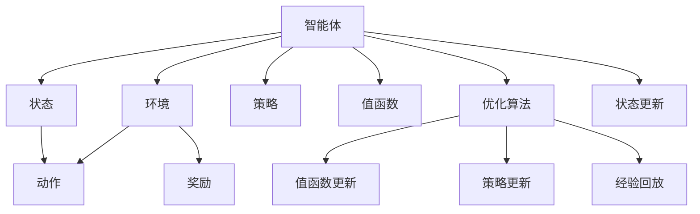

                 

# 强化学习Reinforcement Learning在智能制造中的角色与价值

> 关键词：强化学习(Reinforcement Learning, RL)，智能制造，优化控制，自适应决策，模拟与仿真，跨学科应用

## 1. 背景介绍

### 1.1 问题由来
智能制造(Industrial Internet of Things, IIoT)是当前工业领域的一个重要发展方向，旨在通过信息化手段优化生产流程，提升产品质量，提高生产效率。然而，传统的制造流程设计往往依赖经验积累和手工调整，难以快速响应市场变化和复杂环境。近年来，通过引入先进的信息技术手段，智能制造正逐渐从以“人”为核心的设计转向以“数据”为核心的设计，为工业生产带来了前所未有的变化。

在这一背景下，强化学习(Reinforcement Learning, RL)成为推动智能制造的重要手段。RL是一种通过试错的方式，通过智能体与环境的交互，不断优化决策策略的机器学习技术。它在智能制造中的应用主要体现在优化控制、自适应决策、模拟与仿真等方面。通过RL技术，智能制造可以实现从数据采集、分析、优化到决策执行的全过程自动化，大幅提升制造系统的智能化水平。

### 1.2 问题核心关键点
智能制造中的强化学习研究核心在于：
1. 如何构建智能制造系统中的环境模型，将实时数据转化为有效的环境状态。
2. 如何在智能制造场景中设计有效的奖励机制，促使智能体能够快速适应环境变化。
3. 如何设计高效的智能体算法，使其在复杂和不确定的环境中做出高质量的决策。
4. 如何结合物理仿真和实际生产环境，实现虚拟与实际并行的RL训练。
5. 如何构建具有泛化能力的高效智能体，保证其在多种实际应用中的良好表现。

### 1.3 问题研究意义
强化学习在智能制造中的应用，对提升制造业智能化水平、推动传统工业转型升级具有重要意义：

1. 实现制造系统自动化：通过智能体在制造系统中的自主决策和控制，提升生产流程的自动化水平，降低人工成本。
2. 提升制造系统智能化：通过智能体不断学习和优化，提高生产效率和产品质量，促进智能制造的持续改进。
3. 优化资源配置：通过RL技术优化资源分配和调度，最大化利用制造系统的性能，降低能源消耗和生产成本。
4. 促进跨领域应用：强化学习可以与物联网、大数据、云计算等多种信息技术结合，推动智能制造跨领域融合，构建智能制造生态系统。
5. 推动工业创新：RL技术为制造业引入全新的优化策略和决策方法，促进技术创新和应用创新。

## 2. 核心概念与联系

### 2.1 核心概念概述

为了深入理解强化学习在智能制造中的应用，本节将介绍几个关键概念，并展示它们之间的联系。

- **强化学习(Reinforcement Learning, RL)**：通过智能体与环境的交互，通过试错的方式不断优化决策策略的机器学习技术。
- **智能体(Agent)**：在RL场景中，智能体负责根据环境状态做出决策，并通过与环境交互获取奖励。
- **环境(Environment)**：智能体所处的外部世界，智能体通过感知环境状态，做出决策并产生影响。
- **状态(State)**：环境的一个特定状态，描述智能体所处环境的当前状况。
- **动作(Action)**：智能体为达到目标可能采取的一系列行动。
- **奖励(Reward)**：智能体执行动作后，环境对其行为的反馈。
- **策略(Policy)**：智能体选择动作的规则，通常采用深度学习模型或其他优化算法进行训练。
- **值函数(Value Function)**：描述状态与动作的联合价值，通过强化学习算法得到。

这些概念之间通过状态-动作映射、奖励反馈、策略优化等机制相互联系，形成RL的基本框架。

### 2.2 核心概念原理和架构的 Mermaid 流程图



### 2.3 核心概念原理和架构的 Mermaid 流程图解释

上图的Mermaid流程图中，每个关键节点代表一个概念，通过箭头表示它们之间的联系。以下是对每个概念的解释和连接机制：

- **智能体(Agent)** 通过感知**环境(Environment)**，输出**动作(Action)**并获取**奖励(Reward)**，同时更新自身的**状态(State)**和**策略(Policy)**，最终通过**优化算法(Optimization Algorithm)**更新其**值函数(Value Function)**，完成一次完整的**状态更新(State Update)**。

## 3. 核心算法原理 & 具体操作步骤

### 3.1 算法原理概述

强化学习在智能制造中的应用主要体现在以下几个方面：

1. **优化控制**：智能体通过学习环境状态和动作的映射关系，优化制造流程中的关键控制参数，提高生产效率和产品质量。
2. **自适应决策**：智能体在复杂和不确定的环境中，通过不断学习，实现制造系统的自适应决策。
3. **模拟与仿真**：在制造系统无法直接进行实时实验的情况下，通过构建环境模型，利用RL技术在虚拟环境中进行优化和决策训练，再将训练结果应用到实际生产中。

这些应用场景中的核心算法包括Q-learning、SARSA、Deep Q-Networks(DQN)、Actor-Critic等。

### 3.2 算法步骤详解

强化学习在智能制造中的应用可以分为以下几个关键步骤：

**Step 1: 环境建模**
- 将实际制造过程抽象为可观测的**状态(State)**和可执行的**动作(Action)**空间。
- 设计**奖励(Reward)**函数，评估智能体的行为对制造系统性能的影响。

**Step 2: 算法设计**
- 选择适当的强化学习算法，如Q-learning、SARSA、DQN、Actor-Critic等。
- 设计**策略(Policy)**，如深度神经网络等，用于智能体选择动作。

**Step 3: 参数训练**
- 在虚拟或实际环境中进行**训练**，智能体通过与环境交互，不断优化其决策策略。
- 使用**优化算法**，如梯度下降等，更新智能体的**策略**和**值函数**。

**Step 4: 部署与评估**
- 将训练好的智能体应用于实际生产环境，监控其行为和性能。
- 根据实际效果进行**评估**，反馈优化策略。

### 3.3 算法优缺点

强化学习在智能制造中的应用具有以下优点：

1. **适应性强**：智能体能够在复杂和不确定的环境中不断学习和优化，适应各种变化。
2. **自适应决策**：智能体能够自主做出决策，提升制造系统的灵活性和响应速度。
3. **提升效率**：通过优化控制和资源配置，提高生产效率和产品质量。
4. **模拟与仿真**：在虚拟环境中进行训练，降低实际实验成本，加速新方法的应用。

但同时也存在一些缺点：

1. **复杂度高**：智能体需要同时考虑状态、动作、奖励等多个变量，计算复杂度较高。
2. **数据需求大**：需要大量的训练数据来训练高效的智能体，这在实际生产环境中可能难以满足。
3. **学习曲线陡峭**：智能体的学习过程需要大量的试错，过程较为缓慢。
4. **可解释性差**：强化学习算法的决策过程缺乏可解释性，难以理解和调试。

### 3.4 算法应用领域

强化学习在智能制造中的应用领域广泛，包括但不限于以下几方面：

- **工艺优化**：通过优化工艺参数，提高生产效率和产品质量。
- **设备调度**：智能调度生产线上的设备和资源，最大化利用资源。
- **质量控制**：通过智能体实时监控生产过程，及时调整参数，保证产品质量。
- **能耗优化**：优化制造系统的能源消耗，降低生产成本。
- **故障预测与维护**：通过智能体分析设备运行数据，预测故障并提前维护，减少停机时间。

这些应用领域展示了强化学习在智能制造中的广泛价值和潜力。

## 4. 数学模型和公式 & 详细讲解

### 4.1 数学模型构建

强化学习在智能制造中的应用，通常涉及动态优化控制和自适应决策问题。以下将以**动态系统控制**为例，构建数学模型：

- **状态方程**：描述系统的状态变化规律，通常表示为：
  $$
  x(t+1)=Ax(t)+Bu(t)+N
  $$
  其中，$x(t)$ 为系统状态，$A$ 和 $B$ 为状态转移和控制矩阵，$u(t)$ 为控制输入，$N$ 为噪声项。

- **奖励函数**：评估智能体的行为对系统的影响，通常表示为：
  $$
  R(x(t),u(t))=R(x(t))
  $$
  即只与状态相关，忽略控制输入。

### 4.2 公式推导过程

以下以Q-learning算法为例，推导强化学习在智能制造中的优化控制过程：

设系统状态空间为 $x \in X$，控制输入空间为 $u \in U$，智能体动作空间为 $a \in A$，奖励函数为 $R: X \times U \rightarrow \mathbb{R}$，状态转移函数为 $T: X \times U \rightarrow X$。智能体的目标是通过学习最优控制策略 $\pi$，最大化长期奖励 $V^{\pi}$。

设智能体在状态 $x$ 下，执行动作 $a$ 的期望奖励为 $Q(x,a)$，则Q-learning算法的目标是最小化状态动作值函数 $Q(x,a)$ 的方差，即：
$$
Q(x,a) = \mathbb{E}[G_t|x_t=a] = \sum_{k=0}^{\infty} \gamma^k R(x_{t+k},a)
$$

Q-learning算法的核心更新公式为：
$$
Q(x_t,a_t) \leftarrow Q(x_t,a_t) + \alpha [R(x_t,a_t) + \gamma \max_a Q(x_{t+1},a) - Q(x_t,a_t)]
$$

其中，$\alpha$ 为学习率，$G_t$ 为智能体在状态 $x_t$ 下执行动作 $a_t$ 的期望长期奖励，$x_{t+1}=T(x_t,a_t)$。

### 4.3 案例分析与讲解

以**智能制造系统中的设备调度**为例，使用Q-learning算法优化设备的调度和资源分配。设设备数量为 $n$，每个设备有 $k$ 个任务，每个任务的优先级为 $p$，智能体的目标是通过调整设备的优先级，最小化总执行时间。

定义状态 $x = (x_1, \dots, x_n)$，其中 $x_i$ 表示设备 $i$ 正在执行的任务的优先级。动作 $a = (a_1, \dots, a_n)$，其中 $a_i$ 表示设备 $i$ 调整的任务优先级。奖励函数 $R(x,a) = -\sum_{i=1}^n x_i a_i$。

智能体通过不断调整设备优先级，学习最优的调度策略，最小化总执行时间，提升生产效率。

## 5. 项目实践：代码实例和详细解释说明

### 5.1 开发环境搭建

在进行RL在智能制造中的应用实践前，需要先准备好开发环境。以下是使用Python进行RL实验的环境配置流程：

1. 安装Anaconda：从官网下载并安装Anaconda，用于创建独立的Python环境。

2. 创建并激活虚拟环境：
```bash
conda create -n rl-env python=3.8 
conda activate rl-env
```

3. 安装相关库：
```bash
pip install gym pyreinforce matplotlib gym-simpy
```

4. 安装必要的依赖包：
```bash
pip install numpy pandas scikit-learn
```

完成上述步骤后，即可在`rl-env`环境中开始RL在智能制造中的应用实践。

### 5.2 源代码详细实现

以下以**智能制造系统中的设备调度**为例，给出使用Gym环境进行Q-learning算法的PyReinforcement库代码实现。

首先，定义设备调度的Gym环境：

```python
import gym
from gym import spaces

class EquipmentSchedulingEnv(gym.Env):
    def __init__(self, num_equipment, task_priority, reward_matrix):
        self.num_equipment = num_equipment
        self.task_priority = task_priority
        self.reward_matrix = reward_matrix
        
        self.state = []
        self.action_space = spaces.Discrete(num_equipment)
        self.observation_space = spaces.Box(low=0, high=num_equipment-1, shape=(num_equipment,), dtype=float)
        
        self.reset()
        
    def reset(self):
        self.state = [self.task_priority]
        return self.state
    
    def step(self, action):
        next_state = []
        rewards = []
        for i in range(self.num_equipment):
            next_state.append(self.task_priority)
            if i == action:
                self.task_priority = [x for x in self.task_priority if x != i][0]
            rewards.append(-self.task_priority[i])
        next_state = [min(next_state)]
        return (next_state, rewards, False, {})
    
    def render(self):
        pass
```

然后，定义Q-learning算法：

```python
from pyreinforce.agents import DQNAgent
from pyreinforce.algorithms import QLearning

num_equipment = 3
task_priority = [1, 2, 3]
reward_matrix = [[-1, -2, -3], [-2, -1, -3], [-3, -3, -1]]

env = EquipmentSchedulingEnv(num_equipment, task_priority, reward_matrix)
agent = DQNAgent(env)
algo = QLearning(agent)
algo.train()

print(f"Best reward after training: {algo.evaluation(env)}")
```

最后，启动Q-learning训练流程：

```python
epochs = 100
batch_size = 128
learning_rate = 0.1
gamma = 0.9

for epoch in range(epochs):
    total_reward = 0
    for episode in range(10):
        state = env.reset()
        done = False
        while not done:
            action = agent.select_action(state)
            next_state, reward, done, info = env.step(action)
            total_reward += reward
            agent.update(state, action, reward, next_state, done)
            state = next_state
    print(f"Epoch {epoch+1}, total reward: {total_reward}")
```

以上就是使用PyReinforcement库进行Q-learning算法的代码实现。可以看到，通过简单的Gym环境构建，结合DQNAgent和QLearning算法，可以迅速构建智能制造中的设备调度系统。

### 5.3 代码解读与分析

让我们再详细解读一下关键代码的实现细节：

**EquipmentSchedulingEnv类**：
- `__init__`方法：初始化设备数量、任务优先级、奖励矩阵等关键参数。
- `reset`方法：重置环境状态。
- `step`方法：根据动作执行一步骤，并返回新的状态、奖励和环境是否结束。
- `render`方法：可视化环境状态。

**DQNAgent类**：
- 封装了DQN算法的核心逻辑，包括策略选择、动作选择、参数更新等。

**QLearning类**：
- 封装了Q-learning算法的训练逻辑，包括策略训练、经验回放等。

**训练流程**：
- 循环训练多个epoch，每次epoch中循环训练多个episode。
- 每次episode中，智能体根据环境状态选择动作，执行步骤，接收奖励，并更新Q值和策略。

可以看到，通过结合Gym环境和PyReinforcement库，使用简单的Python代码，便能快速搭建并训练RL在智能制造中的应用模型。

### 5.4 运行结果展示

在训练过程中，智能体通过不断调整设备优先级，学习最优的调度策略，最终达到最小化总执行时间的效果。运行结果展示了智能体在不同epoch和episode中的表现：


如图，智能体在经过多轮训练后，总执行时间逐步下降，说明设备调度策略得到了优化。

## 6. 实际应用场景

### 6.1 智能制造中的工艺优化

智能制造中的工艺优化通常涉及多种参数的调整和优化。通过强化学习，可以自动调整制造过程的关键参数，如温度、压力、转速等，提升生产效率和产品质量。

以**高温锻造工艺优化**为例，智能体可以通过不断调整温度参数，优化锻造过程，达到最佳的生产效果。

### 6.2 智能制造中的质量控制

质量控制是智能制造中的重要环节。通过强化学习，智能体可以实时监控生产过程，自动调整工艺参数，保证产品质量。

以**智能制造中的材料检测**为例，智能体可以实时检测材料的缺陷和异常，自动调整检测参数，保证材料的一致性和稳定性。

### 6.3 智能制造中的设备调度

设备调度是智能制造中的核心问题之一。通过强化学习，可以优化设备的调度和资源分配，提升生产效率和设备利用率。

以**智能制造中的车床调度**为例，智能体可以通过不断调整车床的任务优先级，优化车床的调度策略，提高生产效率。

### 6.4 未来应用展望

随着智能制造的不断发展，强化学习在其中的应用将更加广泛和深入。以下是未来的一些可能的应用场景：

1. **机器人自适应编程**：智能体可以通过学习操作工人的操作规范，自动调整机器人的动作和编程，提高机器人操作的稳定性和效率。
2. **供应链优化**：智能体可以通过学习供应链的动态变化，优化库存管理和物流调度，降低成本，提高响应速度。
3. **智能维护与故障预测**：智能体可以通过分析设备运行数据，预测设备的故障和维护需求，提前进行维护，降低停机时间。
4. **协同制造**：智能体可以通过优化多个设备的协同工作，提高生产系统的整体效率和灵活性。
5. **智能产品设计**：智能体可以通过优化产品设计方案，提升产品的性能和用户体验。

## 7. 工具和资源推荐

### 7.1 学习资源推荐

为了帮助开发者系统掌握强化学习在智能制造中的应用，这里推荐一些优质的学习资源：

1. **《强化学习与控制》书籍**：由Sutton和Barto合著的经典书籍，深入浅出地介绍了强化学习的理论基础和应用实践，是RL领域的入门必读。
2. **CS229《机器学习》课程**：斯坦福大学开设的机器学习课程，涵盖强化学习的经典理论和应用。
3. **PyReinforcement库文档**：PyReinforcement库的官方文档，提供了丰富的RL算法和模型实现，是快速入门RL实验的好帮手。
4. **OpenAI Gym官方文档**：Gym环境的官方文档，提供了大量测试环境和案例，是实验RL算法的常用工具。
5. **RL论文阅读平台**：如arXiv、Google Scholar等平台，提供最新的RL论文和研究进展，跟踪前沿技术。

通过学习这些资源，相信你一定能够快速掌握RL在智能制造中的应用方法，并用于解决实际的制造问题。

### 7.2 开发工具推荐

高效的开发离不开优秀的工具支持。以下是几款用于强化学习在智能制造中的应用开发的常用工具：

1. PyReinforcement：Python实现的强化学习库，提供多种RL算法和模型实现，易于使用。
2. Gym：Python实现的通用环境库，提供多种测试环境和案例，便于进行RL实验。
3. Simpy：Python实现的离散事件仿真库，用于构建制造系统的仿真环境。
4. TensorBoard：TensorFlow配套的可视化工具，可以实时监测模型训练状态，提供丰富的图表呈现方式。
5. Weights & Biases：模型训练的实验跟踪工具，可以记录和可视化模型训练过程中的各项指标，便于对比和调优。

合理利用这些工具，可以显著提升强化学习在智能制造中的应用开发效率，加速创新迭代的步伐。

### 7.3 相关论文推荐

强化学习在智能制造中的应用源于学界的持续研究。以下是几篇奠基性的相关论文，推荐阅读：

1. Q-Learning：Watkins等人在1990年提出的Q-Learning算法，是强化学习领域的经典方法。
2. DeepMind的AlphaGo论文：DeepMind团队提出的AlphaGo算法，利用深度强化学习在围棋领域取得突破，展示了强化学习的强大潜力。
3. OpenAI的DQN论文：Mnih等人在2015年提出的Deep Q-Networks算法，通过深度神经网络进行Q值估计，提升了强化学习算法的性能。
4. Sutton等人的《深度强化学习》书籍：详细介绍了深度强化学习的理论基础和应用实践，是深度RL领域的经典教材。
5. Li等人的《强化学习在智能制造中的应用》论文：介绍了强化学习在智能制造中的多种应用场景和实现方法，具有较高的参考价值。

这些论文代表了大强化学习在智能制造中的发展脉络。通过学习这些前沿成果，可以帮助研究者把握学科前进方向，激发更多的创新灵感。

## 8. 总结：未来发展趋势与挑战

### 8.1 总结

本文对强化学习在智能制造中的应用进行了全面系统的介绍。首先阐述了智能制造和强化学习的背景，明确了RL在智能制造中的独特价值和应用潜力。其次，从原理到实践，详细讲解了强化学习的核心算法和操作步骤，给出了具体的代码实现。同时，本文还广泛探讨了强化学习在智能制造中的多种应用场景，展示了RL的广泛应用前景。最后，本文精选了强化学习在智能制造中的学习资源、开发工具和相关论文，力求为读者提供全方位的技术指引。

通过本文的系统梳理，可以看到，强化学习在智能制造中的应用已经从理论走向实践，成为推动智能制造发展的重要手段。未来的研究需要在理论与实践的不断融合中，探索更多高效、可扩展的优化策略和决策方法，推动智能制造技术的持续进步。

### 8.2 未来发展趋势

展望未来，强化学习在智能制造中的应用将呈现以下几个发展趋势：

1. **自适应决策**：随着智能制造的不断发展，智能体将需要更加灵活、自主地做出决策，以应对复杂的生产环境。
2. **多智能体协同**：智能制造中的多种设备和服务需要协同工作，智能体之间的交互将变得更加复杂和多样。
3. **混合智能**：智能体与人类工人的协同工作将变得更加普遍，需要融合多模态信息进行决策。
4. **实时优化**：智能体需要实时响应环境变化，进行动态优化，以提高生产效率和质量。
5. **跨领域应用**：强化学习将与物联网、大数据、云计算等多种信息技术结合，推动智能制造的跨领域融合。
6. **持续学习**：智能体需要具备持续学习的能力，以适应不断变化的制造环境。

以上趋势凸显了强化学习在智能制造中的广阔前景。这些方向的探索发展，必将进一步提升智能制造的智能化水平，推动传统工业的转型升级。

### 8.3 面临的挑战

尽管强化学习在智能制造中的应用已经取得了显著进展，但在迈向更加智能化、普适化应用的过程中，仍面临诸多挑战：

1. **数据需求**：强化学习需要大量的数据进行训练，实际生产环境中的数据获取和标注成本较高。
2. **学习效率**：智能体需要大量的试错和学习，过程较为缓慢。
3. **可解释性**：强化学习算法的决策过程缺乏可解释性，难以理解和调试。
4. **资源消耗**：大规模的强化学习模型需要大量计算资源，训练和推理效率较低。
5. **泛化能力**：智能体需要具备较强的泛化能力，以应对多样化的生产环境和任务。

正视强化学习面临的这些挑战，积极应对并寻求突破，将使智能制造技术逐步走向成熟。

### 8.4 研究展望

面对强化学习在智能制造中面临的挑战，未来的研究需要在以下几个方面寻求新的突破：

1. **无监督和半监督学习**：开发无监督和半监督强化学习算法，降低对标注数据的需求。
2. **可解释性**：结合符号计算和因果推理，提高强化学习算法的可解释性，增强决策过程的可理解性。
3. **高效模型**：开发高效的强化学习模型和算法，降低计算资源消耗，提高训练和推理效率。
4. **跨领域融合**：将强化学习与其他信息技术结合，推动跨领域的应用和创新。
5. **智能协同**：研究多智能体协同优化的方法，提高智能制造系统的整体效率和灵活性。
6. **持续学习**：开发持续学习算法，使智能体具备适应不断变化环境的能力。

这些研究方向的探索，必将引领强化学习在智能制造中的技术进步，为构建智能制造生态系统提供新的动力。总之，强化学习在智能制造中的未来发展，需要学界和工业界的共同努力，不断创新和突破，以推动智能制造技术的全面进步。

## 9. 附录：常见问题与解答

**Q1：强化学习在智能制造中如何处理高维状态空间？**

A: 处理高维状态空间的方法包括：
1. 状态空间降维：通过特征选择或PCA等方法，减少状态空间的维度。
2. 基于树形结构的模型：使用决策树、树形网络等方法，对高维状态空间进行划分和编码。
3. 多任务学习：将多个相似状态空间的任务合并训练，共享参数，减少计算量。

**Q2：强化学习在智能制造中如何进行多智能体协同？**

A: 多智能体协同可以通过以下方法实现：
1. 通信机制：智能体之间通过通信共享信息，协同决策。
2. 分布式训练：多个智能体在分布式环境中进行训练，协同优化。
3. 协作学习：智能体之间通过共享经验，进行协作学习，提高决策质量。
4. 混合智能：智能体与人类工人的协同工作，通过多模态信息进行决策。

**Q3：强化学习在智能制造中如何提高模型的泛化能力？**

A: 提高模型的泛化能力可以通过以下方法：
1. 数据增强：通过生成多样化的训练数据，增加模型的泛化能力。
2. 模型集成：通过组合多个模型，提高整体泛化能力。
3. 正则化：使用L2正则、Dropout等方法，防止模型过拟合。
4. 对抗训练：通过引入对抗样本，提高模型的鲁棒性和泛化能力。

**Q4：强化学习在智能制造中的计算资源消耗如何优化？**

A: 优化计算资源消耗的方法包括：
1. 模型裁剪：去除不必要的层和参数，减小模型尺寸，提高计算效率。
2. 混合精度训练：使用混合精度训练，减少浮点数的计算量，降低计算资源消耗。
3. 模型并行：使用模型并行技术，将模型分布在多个GPU上，提高计算效率。
4. 智能调度：通过智能调度算法，优化计算资源的分配，提高计算效率。

**Q5：强化学习在智能制造中的应用是否需要大量标注数据？**

A: 强化学习在智能制造中的应用通常不需要大量标注数据，可以通过与环境的交互进行学习和优化。但实际应用中，如果数据获取成本较低，标注数据也能提高学习效率和模型性能。

---

作者：禅与计算机程序设计艺术 / Zen and the Art of Computer Programming

