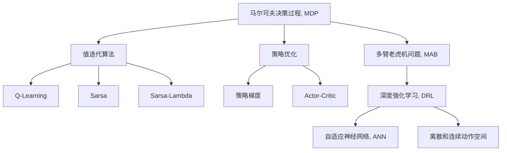

                 

# 强化学习原理与代码实例讲解

> 关键词：强化学习, 深度强化学习, 策略优化, 马尔可夫决策过程, 多臂老虎机问题, Q-Learning, Deep Q-Learning, Actor-Critic 方法, 自适应神经网络, 深度增强学习, 离散和连续动作空间, 环境建模, 智能控制, 强化学习库

## 1. 背景介绍

### 1.1 问题由来

强化学习(Reinforcement Learning, RL)是一种从环境中不断尝试，并通过观察环境反馈来学习最优策略的机器学习方法。其核心理念是：通过与环境的交互，智能体(Agent)学习从当前状态到最优策略的映射，从而在环境中最大化奖励。

RL 由《人工通用性》(Artificial General Intelligence, AGI)创始人赫伯特·西蒙(Herbert Simon)提出，经过四十多年的研究，现已成为人工智能研究的重要分支。

RL 领域的首个里程碑工作由美国学者理查德·赛托普(Richard Sutton)和安德鲁·巴顿(Antonio Barto)提出，包括马尔可夫决策过程(Markov Decision Process, MDP)和值迭代等基本概念。

时至今日，强化学习已广泛应用于自动驾驶、机器人控制、自然语言处理(NLP)、游戏AI等领域，并取得了巨大的成功。

## 2. 核心概念与联系

### 2.1 核心概念概述

为更好地理解强化学习的原理和应用，本节将介绍几个密切相关的核心概念：

- 马尔可夫决策过程(Markov Decision Process, MDP)：一种描述智能体与环境交互的数学模型。其中环境由状态集合、动作集合、奖励函数、转移概率组成。
- 值迭代算法：求解MDP最优策略的基本方法，包括Q-Learning、Sarsa、Sarsa-Lambda等。
- 策略优化：求解MDP最优策略的高级方法，如策略梯度、Actor-Critic等。
- 多臂老虎机问题(Multi-Arm Bandit, MAB)：RL中最经典的问题之一，用于测试算法的探索和利用之间的平衡。
- 深度强化学习(Deep Reinforcement Learning, DRL)：使用深度神经网络对策略和/或值函数进行逼近，以提升模型的泛化能力。
- 自适应神经网络(Adaptive Neural Network)：一种根据学习情况动态调整神经网络参数的方法，用于提升深度强化学习的效果。
- 离散和连续动作空间：在RL中，动作空间可以是离散的(如选择某些操作)，也可以是连续的(如控制某个参数)。

这些核心概念之间的逻辑关系可以通过以下Mermaid流程图来展示：



这个流程图展示了几大核心概念及其之间的关系：

1. MDP 是强化学习的数学基础，描述智能体与环境的交互模型。
2. 值迭代算法是求解MDP最优策略的基本方法。
3. 策略优化是求解MDP最优策略的高级方法，能够处理连续动作空间。
4. 多臂老虎机问题是RL中的一个经典问题，用于测试算法的探索和利用之间的平衡。
5. DRL 通过深度神经网络增强模型的泛化能力。
6. ANN 是优化深度强化学习效果的一种动态调参方法。
7. 离散和连续动作空间是描述动作空间的两种基本类型。

这些概念共同构成了强化学习的学习和应用框架，使其能够在各种场景下发挥强大的决策能力。通过理解这些核心概念，我们可以更好地把握强化学习的核心原理和优化方向。

## 3. 核心算法原理 & 具体操作步骤
### 3.1 算法原理概述

强化学习的核心思想是：智能体通过与环境的交互，学习如何根据当前状态选择最优动作，从而最大化长期奖励。基本流程如下：

1. 环境初始化：设定一个初始状态 $s_0$。
2. 动作选择：智能体根据当前状态 $s_t$ 和策略 $π$ 选择动作 $a_t$。
3. 状态转移：环境根据动作 $a_t$ 转移到新状态 $s_{t+1}$，并产生奖励 $r_{t+1}$。
4. 策略更新：智能体根据新状态 $s_{t+1}$ 和奖励 $r_{t+1}$ 更新策略 $π$。
5. 迭代执行：重复上述步骤，直至达到预设的停止条件。

其中，策略 $π$ 是智能体从当前状态到动作的映射。对于动作选择，常见的策略类型包括贪心策略、ε-贪心策略、随机策略等。对于策略更新，常见的算法包括值迭代、策略梯度、Actor-Critic 等。

### 3.2 算法步骤详解

**Step 1: 定义环境**
- 设定环境的各个组成部分：状态集合 $S$、动作集合 $A$、奖励函数 $R$、转移概率 $P$ 等。
- 根据任务特点设计环境，设定初始状态 $s_0$ 和终止状态 $s_T$。

**Step 2: 设定策略和优化目标**
- 选择策略 $π$，可以是一个简单的贪心策略、一个策略梯度方法或Actor-Critic方法等。
- 设定优化目标 $J(π)$，通常为期望累积奖励。

**Step 3: 值迭代算法**
- 定义状态-动作值函数 $Q$ 或状态值函数 $V$，分别表示从状态到动作值和状态值的估计。
- 选择合适的值迭代方法，如Q-Learning、Sarsa、Sarsa-Lambda等，对值函数进行迭代优化。
- 根据优化结果更新策略 $π$。

**Step 4: 策略优化算法**
- 定义策略梯度方法或Actor-Critic方法，优化策略 $π$。
- 选择合适的优化器，如Adam、RMSprop等。
- 根据优化器输出更新策略参数。

**Step 5: 迭代执行**
- 根据当前策略 $π$ 选择动作 $a_t$。
- 环境转移至新状态 $s_{t+1}$，产生奖励 $r_{t+1}$。
- 使用值迭代或策略优化方法更新策略 $π$。
- 重复执行直至达到停止条件。

以上是强化学习的常见算法流程，不同算法在具体实现细节上有一些差异。

### 3.3 算法优缺点

强化学习的优点包括：

1. 数据依赖小：强化学习可以从数据驱动到模型驱动，不需要大量的标注数据。
2. 模型通用性强：强化学习算法可应用于多种复杂环境，如自动驾驶、机器人控制等。
3. 鲁棒性好：强化学习模型具有较强的泛化能力，可以适应不同的环境条件和奖励函数。

同时，强化学习也存在一些缺点：

1. 数据利用率低：强化学习模型在训练过程中需要消耗大量计算资源，效率较低。
2. 模型复杂度高：强化学习模型一般较复杂，需要较强的硬件资源支持。
3. 优化问题困难：强化学习问题通常是非凸的，存在局部最优解的问题。

尽管存在这些局限性，但强化学习依然是当前解决复杂智能决策问题的重要工具。未来相关研究的重点在于如何进一步提高强化学习的学习效率和鲁棒性，以及如何与深度学习等其他技术结合，形成更强大的智能决策系统。

### 3.4 算法应用领域

强化学习在众多领域中已得到了广泛的应用，例如：

- 自动驾驶：通过与模拟环境交互，学习最优驾驶策略。
- 机器人控制：学习如何在不同环境下操作机器人执行任务。
- 游戏AI：学习在复杂游戏中取胜的策略。
- 金融交易：学习在动态市场中进行买卖决策。
- 自然语言处理：学习最优的翻译策略。
- 供应链管理：学习如何优化物流和库存管理。
- 智能推荐：学习如何根据用户行为进行个性化推荐。

除了上述这些经典应用外，强化学习还被创新性地应用到更多场景中，如自主导航、自然语言生成、智能调度等，为智能系统的智能化和自动化提供了新的路径。

## 4. 数学模型和公式 & 详细讲解  
### 4.1 数学模型构建

强化学习的数学模型可以通过马尔可夫决策过程(MDP)来描述。一个MDP由以下四个组成部分组成：

- 状态集合 $S$：环境的所有可能状态，例如游戏中的位置。
- 动作集合 $A$：智能体可执行的所有动作，例如游戏中的移动方向。
- 奖励函数 $R$：从当前状态 $s_t$ 和动作 $a_t$ 到下一个状态 $s_{t+1}$ 的奖励。
- 转移概率 $P$：给定当前状态 $s_t$ 和动作 $a_t$，转移到下一个状态 $s_{t+1}$ 的概率。

定义智能体的状态值函数 $V$ 和动作值函数 $Q$ 如下：

$$
V(s_t) = \mathbb{E}[G_t|s_t]
$$

$$
Q(s_t, a_t) = \mathbb{E}[G_t|s_t, a_t]
$$

其中，$G_t$ 为从当前状态 $s_t$ 开始，智能体在未来某步时刻的期望累积奖励。

### 4.2 公式推导过程

以下是Q-Learning算法的详细推导过程：

假设当前状态为 $s_t$，智能体选择动作 $a_t$，在下一个状态 $s_{t+1}$ 下获得奖励 $r_{t+1}$，智能体继续在状态 $s_{t+1}$ 中选择动作 $a_{t+1}$，以此类推。则Q-Learning算法的目标是最小化Q值函数，即：

$$
Q_{s_t, a_t} \leftarrow (1 - \alpha) Q_{s_t, a_t} + \alpha (r_{t+1} + \gamma \max_{a_{t+1}} Q_{s_{t+1}, a_{t+1}})
$$

其中，$\alpha$ 为学习率，$\gamma$ 为折扣因子，表示未来奖励的重要性。

为了最小化期望累计奖励，可以通过值迭代的方式求解最优的Q值函数 $Q^*$，即：

$$
Q^*_{s_t, a_t} = \max_{a_{t+1}} Q^*_{s_{t+1}, a_{t+1}} + r_{t+1} + \gamma Q^*_{s_{t+1}, a_{t+1}}
$$

将上式代入Q-Learning算法，并递归展开，可以得到：

$$
Q_{s_t, a_t} \leftarrow (1 - \alpha) Q_{s_t, a_t} + \alpha (r_{t+1} + \gamma \max_{a_{t+1}} Q_{s_{t+1}, a_{t+1}})
$$

其中，$\max_{a_{t+1}} Q_{s_{t+1}, a_{t+1}}$ 可以通过状态值函数 $V_{s_{t+1}}$ 求得：

$$
\max_{a_{t+1}} Q_{s_{t+1}, a_{t+1}} = \max_{a_{t+1}} (Q_{s_{t+1}, a_{t+1}} + \gamma V_{s_{t+1}})
$$

因此，最终的Q-Learning算法可以表示为：

$$
Q_{s_t, a_t} \leftarrow (1 - \alpha) Q_{s_t, a_t} + \alpha (r_{t+1} + \gamma \max_{a_{t+1}} (Q_{s_{t+1}, a_{t+1}} + \gamma V_{s_{t+1}}))
$$

这便是Q-Learning算法的详细推导过程。

### 4.3 案例分析与讲解

**案例1：多臂老虎机问题(MAB)**
多臂老虎机问题是强化学习中的一个经典问题，智能体需要选择多臂中的某个，以期望获得最大奖励。

假设每个臂 $i$ 在状态 $t$ 下产生奖励的概率为 $p_i$，智能体的目标是最大化累计奖励。

假设智能体在状态 $t$ 下选择动作 $a_t = i$，则状态转移到状态 $s_{t+1}$，并产生奖励 $r_{t+1} \sim p_i$。

定义Q值函数 $Q_t(i)$ 表示在状态 $t$ 下选择动作 $i$ 的期望累计奖励。则Q-Learning算法的目标是最小化Q值函数，即：

$$
Q_{t, i} \leftarrow (1 - \alpha) Q_{t, i} + \alpha (r_{t+1} + \gamma \max_{j \neq i} Q_{t+1, j})
$$

其中，$r_{t+1}$ 为智能体选择动作 $i$ 后获得的奖励，$\max_{j \neq i} Q_{t+1, j}$ 表示在状态 $t+1$ 下选择其他动作的最大Q值。

**案例2：自动驾驶问题**
自动驾驶问题是一个复杂的多智能体系统，智能体需要考虑多个状态和动作，并与其他智能体（如其他车辆、行人）交互。

定义状态 $s_t$ 为当前位置和速度等，动作 $a_t$ 为加速、刹车、转向等，奖励 $r_t$ 为安全到达终点后的奖励。

智能体通过与环境的交互，学习最优的驾驶策略，在每个时间步选择动作 $a_t$，并更新状态 $s_{t+1}$。

### 5. 项目实践：代码实例和详细解释说明
### 5.1 开发环境搭建

在进行强化学习项目开发前，我们需要准备好开发环境。以下是使用Python进行TensorFlow进行RL开发的环境配置流程：

1. 安装Anaconda：从官网下载并安装Anaconda，用于创建独立的Python环境。

2. 创建并激活虚拟环境：
```bash
conda create -n tf-rl-env python=3.8 
conda activate tf-rl-env
```

3. 安装TensorFlow：根据CUDA版本，从官网获取对应的安装命令。例如：
```bash
conda install tensorflow tensorflow-estimator
```

4. 安装Gym：
```bash
pip install gym
```

5. 安装各类工具包：
```bash
pip install numpy pandas scikit-learn matplotlib tqdm jupyter notebook ipython
```

完成上述步骤后，即可在`tf-rl-env`环境中开始RL实践。

### 5.2 源代码详细实现

这里我们以Q-Learning算法解决多臂老虎机问题为例，给出使用TensorFlow和Gym库的RL代码实现。

首先，定义多臂老虎机环境：

```python
import gym
from gym import spaces

class BanditEnv(gym.Env):
    def __init__(self, num_arms=10, prob_success=0.5):
        self.num_arms = num_arms
        self.prob_success = prob_success
        self.reward_range = (-1, 1)
        self.action_space = spaces.Discrete(num_arms)
        self.state_space = spaces.Discrete(num_arms)
        self.reset()
        
    def reset(self):
        self.t = 0
        self.reward = 0
        self.action = 0
        return self.t
    
    def step(self, action):
        reward = self.prob_success if action == self.t else 0
        self.t += 1
        self.reward += reward
        return self.t, reward, False, {}
    
    def render(self, mode='human'):
        if mode == 'human':
            print(self.reward)
```

然后，定义Q-Learning算法的模型和优化器：

```python
import tensorflow as tf

class QNetwork(tf.keras.Model):
    def __init__(self, num_arms):
        super().__init__()
        self.num_arms = num_arms
        self.fc1 = tf.keras.layers.Dense(128, activation='relu')
        self.fc2 = tf.keras.layers.Dense(num_arms, activation='linear')

    def call(self, inputs):
        x = self.fc1(inputs)
        x = self.fc2(x)
        return x

model = QNetwork(num_arms=10)

optimizer = tf.keras.optimizers.Adam(learning_rate=0.1)

# 定义损失函数
def get_loss(model, state, action, reward, next_state, is_done):
    q_value = model(tf.cast(state, tf.float32))
    best_q_value = tf.reduce_max(q_value, axis=1)
    q_value = tf.gather_nd(q_value, indices=tf.expand_dims(action, axis=1))
    target = reward + (1 - is_done) * tf.reduce_max(model(tf.cast(next_state, tf.float32)))
    loss = tf.reduce_mean(tf.square(q_value - target))
    return loss

# 定义训练函数
@tf.function
def train(model, optimizer, state, action, reward, next_state, is_done):
    with tf.GradientTape() as tape:
        loss = get_loss(model, state, action, reward, next_state, is_done)
    gradients = tape.gradient(loss, model.trainable_variables)
    optimizer.apply_gradients(zip(gradients, model.trainable_variables))
    return loss.numpy()

# 定义评估函数
def evaluate(model, num_episodes):
    episodes, rewards = [], []
    for i in range(num_episodes):
        state = 0
        total_reward = 0
        for j in range(10):
            action = tf.random.uniform(shape=[1], minval=0, maxval=10, dtype=tf.int32).numpy()[0]
            next_state, reward, done, _ = env.step(action)
            total_reward += reward
            if done:
                episodes.append(i)
                rewards.append(total_reward)
                state = 0
    return episodes, rewards
```

最后，启动训练流程并在测试集上评估：

```python
import numpy as np

# 创建环境
env = BanditEnv()

# 训练函数
def train(num_episodes=1000):
    episodes = []
    rewards = []
    for i in range(num_episodes):
        state = 0
        total_reward = 0
        for j in range(10):
            action = tf.random.uniform(shape=[1], minval=0, maxval=10, dtype=tf.int32).numpy()[0]
            next_state, reward, done, _ = env.step(action)
            total_reward += reward
            if done:
                episodes.append(i)
                rewards.append(total_reward)
                state = 0
        train(model, optimizer, state, action, reward, next_state, is_done)
    return episodes, rewards

# 评估函数
def evaluate(num_episodes=100):
    episodes, rewards = evaluate(model, num_episodes)
    avg_reward = np.mean(rewards)
    std_reward = np.std(rewards)
    print(f"Average Reward: {avg_reward:.2f}, Std. Dev. Reward: {std_reward:.2f}")
```

以上就是使用TensorFlow和Gym库对Q-Learning算法进行多臂老虎机问题的代码实现。可以看到，得益于Gym库的强大封装，我们可以用相对简洁的代码实现多臂老虎机问题的RL模型训练和评估。

### 5.3 代码解读与分析

让我们再详细解读一下关键代码的实现细节：

**BanditEnv类**：
- `__init__`方法：初始化多臂老虎机环境，设定臂的数量和成功概率。
- `reset`方法：重置环境，并返回当前时间步。
- `step`方法：根据动作选择，更新状态和奖励，并返回新状态和奖励。
- `render`方法：打印当前累积奖励。

**QNetwork类**：
- `__init__`方法：定义Q网络的结构。
- `call`方法：定义前向传播过程。

**train函数**：
- 定义损失函数，并使用梯度下降算法更新模型参数。
- 使用TensorFlow的@tf.function装饰器，将训练过程进行自动微分和优化。

**evaluate函数**：
- 使用多臂老虎机环境进行模拟测试，记录每个时间步的动作和奖励。
- 根据测试结果计算平均奖励和标准差。

**训练流程**：
- 定义总的训练轮数和测试次数，开始循环迭代
- 在每个时间步选择动作，并在环境中进行模拟
- 在每个时间步更新模型参数
- 统计训练轮数和测试结果，输出平均奖励和标准差

可以看到，TensorFlow配合Gym库使得强化学习的代码实现变得简洁高效。开发者可以将更多精力放在模型改进和任务优化上，而不必过多关注底层的实现细节。

当然，工业级的系统实现还需考虑更多因素，如模型的保存和部署、超参数的自动搜索、更灵活的任务适配等。但核心的强化学习范式基本与此类似。

## 6. 实际应用场景
### 6.1 智能推荐系统

基于强化学习的推荐系统可以动态调整推荐策略，提升用户的满意度。推荐系统的目标是通过不断学习用户行为，提高推荐的个性化程度。

在实践中，推荐系统可以使用强化学习算法来学习用户的偏好，根据用户的点击、评分等行为数据，动态调整推荐物品的种类和排序。具体而言，推荐系统可以构建一个MDP，每个物品作为状态，选择推荐物品作为动作，用户点击或评分作为奖励，系统根据用户的反馈，更新推荐策略，实现个性化推荐。

### 6.2 自动驾驶

自动驾驶是强化学习的重要应用场景之一，智能体需要学习如何在复杂环境中做出决策，实现最优行驶路径。

在自动驾驶场景中，智能体可以选择不同的速度、加速度、转向角度等动作，每个动作都会影响车辆的位置和方向，并产生相应的奖励（如是否安全到达目的地）。通过与环境交互，智能体可以学习最优的驾驶策略，实现安全、高效的自动驾驶。

### 6.3 医疗健康

在医疗健康领域，强化学习可以用于优化治疗方案，提升医疗效果。

例如，智能体可以学习在某个病症下，如何给病人安排最优的药物组合和剂量，最大化治疗效果，并最小化副作用。具体而言，智能体可以将每个治疗方案作为状态，选择药物和剂量作为动作，医生的评估作为奖励，智能体根据医生的反馈，更新治疗策略，实现个性化的医疗方案。

### 6.4 未来应用展望

随着强化学习的不断发展，其应用场景将更加丰富多样。未来，强化学习有望在更多领域得到应用，为各行各业带来变革性影响。

在智慧医疗领域，强化学习可以用于优化治疗方案，提升医疗效果。在智慧教育领域，强化学习可以用于个性化的教育方案设计，提高教育质量。在智慧城市治理中，强化学习可以用于智能交通调度、环境监测等，提高城市管理的智能化水平。

此外，在企业生产、社会治理、文娱传媒等众多领域，强化学习技术也将不断涌现，为经济社会发展注入新的动力。相信随着技术的日益成熟，强化学习必将在更广阔的应用领域大放异彩，深刻影响人类的生产生活方式。

## 7. 工具和资源推荐
### 7.1 学习资源推荐

为了帮助开发者系统掌握强化学习的理论基础和实践技巧，这里推荐一些优质的学习资源：

1. 《Reinforcement Learning: An Introduction》：这本书是强化学习领域的经典教材，由Sutton和Barto撰写，深入浅出地介绍了强化学习的核心概念和算法。

2. OpenAI Gym：一个用于开发强化学习算法的Python环境，包含多个经典的RL环境，如Pendulum、CartPole等。

3. Udacity强化学习课程：由Google DeepMind员工授课，涵盖强化学习的基本概念和前沿算法。

4. DeepMind系列论文：DeepMind团队在强化学习领域发表的多篇经典论文，包括AlphaGo、DQN等。

5. PyTorch官方文档：PyTorch的官方文档提供了丰富的强化学习教程，包括从基础到高级的实例代码。

6. TensorFlow官方文档：TensorFlow的官方文档详细介绍了TensorFlow在强化学习中的使用，涵盖各种深度强化学习算法。

通过对这些资源的学习实践，相信你一定能够快速掌握强化学习的精髓，并用于解决实际的RL问题。

### 7.2 开发工具推荐

高效的开发离不开优秀的工具支持。以下是几款用于强化学习开发的常用工具：

1. TensorFlow：由Google主导开发的开源深度学习框架，生产部署方便，适合大规模工程应用。

2. PyTorch：基于Python的开源深度学习框架，灵活动态的计算图，适合快速迭代研究。

3. OpenAI Gym：一个用于开发强化学习算法的Python环境，包含多个经典的RL环境。

4. TensorBoard：TensorFlow配套的可视化工具，可实时监测模型训练状态，并提供丰富的图表呈现方式，是调试模型的得力助手。

5. Weights & Biases：模型训练的实验跟踪工具，可以记录和可视化模型训练过程中的各项指标，方便对比和调优。

6. AutoML：自动化机器学习工具，可以自动搜索超参数和模型架构，提升模型训练效率。

合理利用这些工具，可以显著提升强化学习的开发效率，加快创新迭代的步伐。

### 7.3 相关论文推荐

强化学习在众多领域中已得到了广泛的应用，以下是几篇奠基性的相关论文，推荐阅读：

1. Q-Learning: A new framework for reinforcement learning：提出Q-Learning算法，在强化学习领域具有开创性意义。

2. Playing Atari with deep reinforcement learning：提出Deep Q-Networks，将强化学习应用于视频游戏领域。

3. Human-level control through deep reinforcement learning：提出Actor-Critic方法，将强化学习应用于机器人控制领域。

4. Towards generalization with memory-augmented neural networks：提出MemNet，通过增加记忆机制，提升强化学习的泛化能力。

5. Addressing generalization in reinforcement learning with parameter space noise：提出REINFORCE，通过增加参数噪声，提升强化学习的泛化能力。

这些论文代表了大强化学习的发展脉络。通过学习这些前沿成果，可以帮助研究者把握学科前进方向，激发更多的创新灵感。

## 8. 总结：未来发展趋势与挑战

### 8.1 总结

本文对强化学习的基本原理和代码实现进行了全面系统的介绍。首先阐述了强化学习的基本理念和研究背景，明确了强化学习在智能决策系统中的重要作用。其次，从原理到实践，详细讲解了强化学习的基本算法和实现步骤，给出了强化学习任务开发的完整代码实例。同时，本文还广泛探讨了强化学习在智能推荐、自动驾驶、医疗健康等多个领域的应用前景，展示了强化学习范式的巨大潜力。此外，本文精选了强化学习的各类学习资源，力求为读者提供全方位的技术指引。

通过本文的系统梳理，可以看到，强化学习作为一种高效的智能决策工具，正在成为人工智能研究的重要分支，极大地推动了智能决策系统的智能化和自动化。未来，伴随深度学习等其他技术的发展，强化学习将与更多前沿技术结合，形成更强大的智能决策系统。

### 8.2 未来发展趋势

展望未来，强化学习技术将呈现以下几个发展趋势：

1. 深度增强学习：通过深度神经网络增强强化学习模型的泛化能力，处理更加复杂的环境和任务。

2. 多智能体协同：通过多智能体协同学习，提升系统整体的智能水平，解决更加复杂的协作问题。

3. 元学习：通过学习如何学习，实现知识的迁移和复用，提升智能体的学习效率。

4. 元强化学习：结合元学习和强化学习的思想，实现更加高效和鲁棒的智能决策。

5. 在线学习：通过在线学习算法，使得智能体在实际环境中不断学习和优化策略，提升系统适应性。

6. 迁移学习：通过迁移学习，实现不同任务之间的知识迁移，提升系统泛化能力。

以上趋势凸显了强化学习技术的广阔前景。这些方向的探索发展，必将进一步提升强化学习系统的性能和应用范围，为构建智能决策系统提供新的技术路径。

### 8.3 面临的挑战

尽管强化学习技术已经取得了瞩目成就，但在迈向更加智能化、普适化应用的过程中，它仍面临着诸多挑战：

1. 模型复杂度高：强化学习模型一般较复杂，需要较强的硬件资源支持。

2. 数据利用率低：强化学习模型在训练过程中需要消耗大量计算资源，效率较低。

3. 鲁棒性差：强化学习模型在面对新环境或噪声干扰时，容易出现不稳定和过拟合问题。

4. 可解释性不足：强化学习模型通常缺乏可解释性，难以对其决策过程进行分析和调试。

5. 安全性有待保障：强化学习模型在处理敏感信息时，可能存在隐私和安全问题。

6. 计算资源需求高：强化学习模型训练和推理需要大量的计算资源，资源利用率较低。

尽管存在这些挑战，但强化学习依然是当前解决复杂智能决策问题的重要工具。未来相关研究的重点在于如何进一步提高强化学习的学习效率和鲁棒性，以及如何与深度学习等其他技术结合，形成更强大的智能决策系统。

### 8.4 研究展望

面对强化学习所面临的种种挑战，未来的研究需要在以下几个方面寻求新的突破：

1. 探索无监督和半监督强化学习：摆脱对大量标注数据的依赖，利用自监督学习、主动学习等无监督和半监督范式，最大限度利用非结构化数据，实现更加灵活高效的强化学习。

2. 研究参数高效和计算高效的强化学习：开发更加参数高效的强化学习算法，在固定大部分模型参数的情况下，只更新极少量的策略参数。同时优化模型的计算图，减少前向传播和反向传播的资源消耗，实现更加轻量级、实时性的部署。

3. 融合因果和对比学习范式：通过引入因果推断和对比学习思想，增强强化学习模型建立稳定因果关系的能力，学习更加普适、鲁棒的语言表征，从而提升模型泛化性和抗干扰能力。

4. 引入更多先验知识：将符号化的先验知识，如知识图谱、逻辑规则等，与神经网络模型进行巧妙融合，引导强化学习过程学习更准确、合理的语言模型。同时加强不同模态数据的整合，实现视觉、语音等多模态信息与文本信息的协同建模。

5. 结合因果分析和博弈论工具：将因果分析方法引入强化学习模型，识别出模型决策的关键特征，增强输出解释的因果性和逻辑性。借助博弈论工具刻画人机交互过程，主动探索并规避模型的脆弱点，提高系统稳定性。

6. 纳入伦理道德约束：在强化学习模型的训练目标中引入伦理导向的评估指标，过滤和惩罚有偏见、有害的输出倾向。同时加强人工干预和审核，建立模型行为的监管机制，确保输出符合人类价值观和伦理道德。

这些研究方向的探索，必将引领强化学习技术迈向更高的台阶，为构建安全、可靠、可解释、可控的智能系统铺平道路。面向未来，强化学习技术还需要与其他人工智能技术进行更深入的融合，如知识表示、因果推理、强化学习库等，多路径协同发力，共同推动强化学习技术的发展。只有勇于创新、敢于突破，才能不断拓展强化学习技术的边界，让智能系统更好地造福人类社会。

## 9. 附录：常见问题与解答

**Q1：强化学习是否适用于所有任务？**

A: 强化学习适用于大多数任务，特别是涉及智能决策和优化的问题。但对于一些简单的任务，如回归、分类等，强化学习可能不如传统机器学习算法高效。此外，强化学习通常需要大量的计算资源，对于资源受限的环境可能不太适用。

**Q2：如何选择强化学习算法？**

A: 选择强化学习算法需要考虑任务的特点和资源限制。如果任务比较简单，可以选择简单的Q-Learning等值迭代算法。如果任务比较复杂，可以选择Actor-Critic等策略优化算法。如果资源受限，可以选择参数高效的强化学习算法，如REINFORCE、MemNet等。

**Q3：如何评估强化学习模型的效果？**

A: 评估强化学习模型的效果通常使用平均奖励、标准差、累积奖励等指标。可以绘制累积奖励曲线，观察模型的学习过程。同时可以使用A2C、DDPG等高级算法，进行多智能体协同学习，提升模型的效果。

**Q4：如何优化强化学习模型的性能？**

A: 优化强化学习模型的性能通常需要进行超参数调优、模型结构优化、数据增强等。可以使用网格搜索、贝叶斯优化等方法进行超参数调优。同时可以结合多种模型结构，提升模型的泛化能力。

**Q5：如何处理强化学习中的过拟合问题？**

A: 强化学习中的过拟合问题可以通过正则化、dropout、数据增强等方法进行缓解。在训练过程中，可以通过减少过拟合的参数，提升模型的泛化能力。同时可以引入对抗训练等方法，提高模型的鲁棒性。

这些问题的解答，可以帮助开发者更好地理解强化学习的核心原理和实践技巧，并应用于具体的RL任务中。相信通过不断学习和实践，开发者能够逐步掌握强化学习的精髓，推动智能决策系统的进步。

