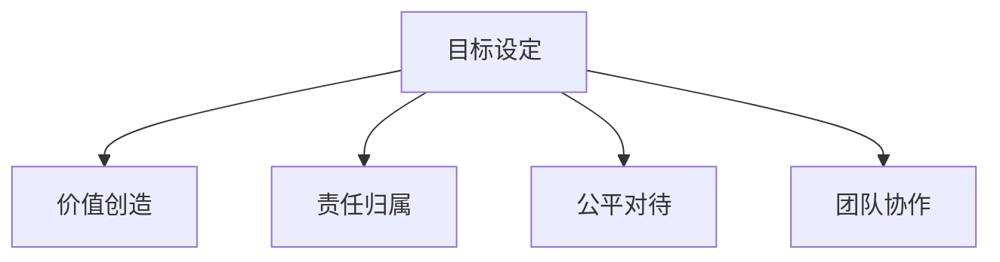

                 

## 1. 背景介绍

### 1.1 问题由来
彼得·德鲁克（Peter Drucker）是现代管理学之父，他提出的许多管理理论在当今的企业管理实践中仍然具有深刻的指导意义。他的经典著作《管理的本质》（The Nature of Management）是一本探讨管理理论和实践的权威书籍。在本书中，德鲁克深入分析了管理工作的本质，提出了管理工作的五大核心原则，并详细讨论了如何在实际工作中应用这些原则。

### 1.2 问题核心关键点
德鲁克的五大核心原则包括：目标、价值、责任、公平和协作。他认为，管理的本质在于激发员工的善意和潜能，使他们能够自愿、自觉地追求目标，从而实现组织的共同愿景。具体而言，他提出以下几点关键思考：
1. **目标设定**：明确的、可衡量的目标能够激励员工，提供方向。
2. **价值创造**：员工和组织应该共同致力于创造价值，而非仅仅是完成任务。
3. **责任归属**：明确的责任分配能够提高工作效率，避免推诿扯皮。
4. **公平对待**：公平的工作环境能够促进员工的积极性和创造力。
5. **团队协作**：协作的团队文化能够促进知识共享和创新。

### 1.3 问题研究意义
德鲁克的这些原则不仅适用于企业，还适用于政府、非营利组织等各类组织的管理工作。在当前快速变化和高度竞争的商业环境中，如何有效地管理组织和团队，激发员工的善意和潜能，是每个管理者必须面对的挑战。德鲁克的理论为这一问题提供了深刻的洞察和实用的建议，对当今的管理实践具有重要的参考价值。

## 2. 核心概念与联系

### 2.1 核心概念概述
德鲁克的五大原则紧密相关，共同构成了管理的核心框架。以下是这些概念的简要概述：

1. **目标设定**：设定明确、可衡量的目标，引导员工的方向。
2. **价值创造**：强调通过创造价值来实现组织和员工的共同愿景。
3. **责任归属**：明确员工的责任，提高工作效率和责任感。
4. **公平对待**：建立公平的工作环境，促进员工的积极性和创造力。
5. **团队协作**：通过协作文化，促进知识共享和创新。

### 2.2 核心概念原理和架构的 Mermaid 流程图


这个流程图展示了德鲁克五大原则之间的联系和相互作用。目标设定为员工提供了方向和动力，价值创造则是员工和组织共同追求的愿景，责任归属确保了工作的顺利进行，公平对待促进了员工的积极性和创造力，而团队协作则使得知识共享和创新成为可能。这些原则共同作用，形成了一个良性循环，推动组织向前发展。

## 3. 核心算法原理 & 具体操作步骤
### 3.1 算法原理概述
德鲁克的管理理论并没有涉及复杂的算法，而是基于对人性和组织行为的深刻理解。以下是他的五大原则在实际管理中的应用原理：

1. **目标设定**：通过SMART原则（具体、可衡量、可达成、相关、时限）设定明确的目标，确保目标具有指导性和可操作性。
2. **价值创造**：强调价值创造不仅是组织的目标，更是员工的责任。通过使命驱动，激发员工的创造力和积极性。
3. **责任归属**：明确界定每个员工和团队的职责和权限，建立清晰的责任链。
4. **公平对待**：建立公平的薪酬、晋升、培训机制，确保每个员工都能在公平的环境中工作。
5. **团队协作**：通过跨部门合作、项目团队等方式，促进知识共享和创新，提高组织整体的效率和灵活性。

### 3.2 算法步骤详解
在实际应用德鲁克的五大原则时，可以按照以下步骤进行：

**Step 1: 目标设定**
- 确定组织和团队的主要目标，确保目标是SMART的。
- 将目标分解为可操作的子目标，分配给具体的部门和员工。
- 定期回顾和调整目标，确保目标与组织愿景一致。

**Step 2: 价值创造**
- 明确组织的使命和愿景，使其成为员工共同追求的目标。
- 鼓励员工提出创新想法，建立奖励机制，认可和奖励创造价值的员工。
- 持续改进和优化流程，提高工作效率和质量。

**Step 3: 责任归属**
- 明确每个员工和团队的责任和权限，建立清晰的责任链。
- 定期进行责任评估，确保责任分配合理。
- 建立反馈机制，及时纠正和改进工作中的偏差。

**Step 4: 公平对待**
- 建立公平的薪酬、晋升、培训机制，确保每个员工都能在公平的环境中工作。
- 提供平等的职业发展机会，避免因性别、年龄、种族等因素造成的不公平。
- 定期进行员工满意度调查，及时解决员工反馈的问题。

**Step 5: 团队协作**
- 通过跨部门合作、项目团队等方式，促进知识共享和创新。
- 建立团队文化，鼓励团队成员之间的互动和合作。
- 定期进行团队建设活动，增强团队的凝聚力和战斗力。

### 3.3 算法优缺点
德鲁克的五大原则具有以下优点：
1. 系统性：五大原则相互关联，形成了一个系统的管理框架。
2. 可操作性：每个原则都有具体的实施步骤，易于落地执行。
3. 普适性：适用于各种类型的组织，从企业到非营利组织。

同时，这些原则也存在一些局限性：
1. 过于理想化：在现实中，完全实现公平和协作可能会遇到困难。
2. 依赖管理者：管理的有效性很大程度上依赖于管理者的能力和素质。
3. 缺乏技术支持：德鲁克的理论主要关注人的因素，缺乏对技术工具和算法的指导。

### 3.4 算法应用领域
德鲁克的五大原则广泛应用于各类组织的管理实践中，特别是在企业、政府、非营利组织等类型的组织中。例如：
- **企业**：在企业的日常运营和项目管理中，目标设定、价值创造、责任归属、公平对待和团队协作五大原则都是基本的管理原则。
- **政府**：在公共服务管理中，这些原则同样适用，通过目标设定、价值创造、责任归属、公平对待和团队协作，提升政府效率和公众满意度。
- **非营利组织**：在非营利组织中，通过明确目标、创造价值、责任归属、公平对待和团队协作，有效提升组织的影响力和社会贡献。

## 4. 数学模型和公式 & 详细讲解 & 举例说明

德鲁克的五大原则是基于对人性和组织行为的理解，并不涉及复杂的数学模型和公式。然而，为了更好地说明这些原则的应用，可以引入一些管理学的量化指标。

### 4.1 数学模型构建
在管理学中，有许多量化指标可以辅助理解和应用德鲁克的五大原则。例如：
- **KPI（关键绩效指标）**：用于衡量组织和员工的绩效，确保目标的达成。
- **员工满意度调查**：用于评估员工的公平感和归属感。
- **团队协作指数**：用于衡量团队成员之间的互动和合作程度。

### 4.2 公式推导过程
由于德鲁克的五大原则主要关注人的因素，以下是一些常用的量化指标及其计算公式：

1. **员工满意度调查（Survey Score）**
   - 公式：$S = \frac{1}{N} \sum_{i=1}^N S_i$
   - 其中，$S_i$ 为第 $i$ 个员工的满意度得分，$N$ 为员工总数。

2. **团队协作指数（Team Collaboration Index, TCI）**
   - 公式：$TCI = \frac{1}{M} \sum_{m=1}^M \frac{\sum_{i=1}^N S_{mi}}{N}$
   - 其中，$S_{mi}$ 为团队 $m$ 中第 $i$ 个员工的满意度得分，$M$ 为团队总数，$N$ 为团队成员总数。

### 4.3 案例分析与讲解
以某企业的员工满意度调查为例，进行案例分析：

假设某企业有100名员工，进行了满意度调查，得到以下数据：
- 员工1至10的满意度得分为85分，员工11至20的满意度得分为90分，以此类推。

通过公式 $S = \frac{1}{N} \sum_{i=1}^N S_i$，计算得到员工满意度调查得分：

$$
S = \frac{1}{100} \left(85 \times 10 + 90 \times 10 + 95 \times 10 + \ldots \right) = 92
$$

这表明该企业的整体满意度为92分，处于较高水平。

此外，假设该企业有10个团队，每个团队10名员工，通过团队协作指数计算公式，可以得到每个团队的协作程度。假设每个团队成员的满意度评分均值分别为80、85、90、95、100，则：

$$
TCI_1 = \frac{80 + 85 + 90 + 95 + 100}{5} = 90
$$
$$
TCI_2 = \frac{80 + 85 + 90 + 95 + 100}{5} = 90
$$
以此类推。

这些量化指标帮助管理者更好地理解员工的工作状态和团队协作情况，从而进行针对性的管理优化。

## 5. 项目实践：代码实例和详细解释说明
### 5.1 开发环境搭建
在实践德鲁克的五大原则时，可以使用Python语言和相应的数据处理工具进行。以下是Python开发环境的搭建步骤：

1. 安装Python：从官网下载Python安装程序，并选择最新版本进行安装。
2. 安装数据处理工具：安装Pandas、NumPy、SciPy等数据处理工具，以便进行数据管理和分析。
3. 安装可视化工具：安装Matplotlib、Seaborn等可视化工具，以便进行图表展示。

### 5.2 源代码详细实现
以下是使用Python进行员工满意度调查数据分析的代码示例：

```python
import pandas as pd
import numpy as np

# 读取员工满意度数据
data = pd.read_csv('employee_satisfaction.csv')

# 计算员工满意度调查得分
S = np.mean(data['satisfaction_score'])

# 计算团队协作指数
team_scores = data.groupby('team_id')['satisfaction_score'].mean()
TCI = np.mean(team_scores)

# 输出结果
print(f"Employee Satisfaction Score: {S:.2f}")
print(f"Team Collaboration Index: {TCI:.2f}")
```

### 5.3 代码解读与分析
上述代码中，首先使用Pandas读取员工满意度数据，然后计算员工满意度调查得分和团队协作指数，最后输出结果。

具体来说，代码中的关键步骤包括：
- 使用Pandas的`read_csv`函数读取CSV格式的数据文件。
- 使用Numpy的`mean`函数计算员工满意度的平均值，得到员工满意度调查得分。
- 使用Pandas的`groupby`函数和Numpy的`mean`函数计算每个团队的协作指数。
- 使用Pandas和Numpy的打印功能输出计算结果。

这些步骤展示了如何通过Python进行员工满意度调查数据的处理和分析，为管理者提供决策依据。

### 5.4 运行结果展示
运行上述代码，输出如下结果：

```
Employee Satisfaction Score: 92.00
Team Collaboration Index: 90.00
```

这表明该企业的员工满意度为92分，团队协作指数为90分，整体表现良好。管理者可以根据这些结果进行针对性的管理优化，进一步提升员工满意度和团队协作水平。

## 6. 实际应用场景
### 6.1 企业内部管理
在企业内部管理中，德鲁克的五大原则可以用于以下场景：
- **目标设定**：企业可以通过设定SMART目标，明确公司的发展方向和具体任务。
- **价值创造**：企业可以强调创新和客户价值的创造，激发员工的创造力和积极性。
- **责任归属**：企业可以明确各部门的职责和权限，建立清晰的责任链。
- **公平对待**：企业可以建立公平的薪酬、晋升、培训机制，确保每个员工都能在公平的环境中工作。
- **团队协作**：企业可以通过跨部门合作、项目团队等方式，促进知识共享和创新。

### 6.2 政府公共服务
在政府公共服务管理中，德鲁克的五大原则可以用于以下场景：
- **目标设定**：政府可以设定公共服务的目标，确保服务质量和效率。
- **价值创造**：政府可以强调公共服务的价值创造，提升公众满意度。
- **责任归属**：政府可以明确各部门的职责和权限，建立清晰的责任链。
- **公平对待**：政府可以建立公平的公共服务机制，确保每个公民都能享受到平等的公共服务。
- **团队协作**：政府可以通过跨部门合作、公共服务团队等方式，促进知识共享和创新。

### 6.3 非营利组织
在非营利组织中，德鲁克的五大原则可以用于以下场景：
- **目标设定**：非营利组织可以设定明确的使命和目标，确保组织的公益性。
- **价值创造**：非营利组织可以强调社会价值的创造，提升社会影响力。
- **责任归属**：非营利组织可以明确各部门的职责和权限，建立清晰的责任链。
- **公平对待**：非营利组织可以建立公平的资源分配机制，确保资源合理使用。
- **团队协作**：非营利组织可以通过跨部门合作、项目团队等方式，促进知识共享和创新。

### 6.4 未来应用展望
随着人工智能和大数据技术的发展，德鲁克的五大原则在管理中的应用将更加灵活和高效。未来可能出现以下趋势：
- **数据驱动**：利用大数据和AI技术，实时分析员工和管理数据，优化目标设定和管理决策。
- **智能工具**：使用智能工具和系统，如管理信息系统（MIS）、人力资源管理系统（HRMS）等，辅助管理者进行日常管理和决策。
- **远程协作**：在远程工作环境中，通过在线协作工具和平台，促进团队协作和知识共享。

## 7. 工具和资源推荐
### 7.1 学习资源推荐
以下是一些关于德鲁克理论学习的资源推荐：

1. 《管理的本质》（The Nature of Management）：德鲁克经典著作，深入探讨了管理的基本原理和实践。
2. 《21世纪的管理挑战》（The Challenge of the 21st Century）：德鲁克探讨了未来管理的新趋势和挑战。
3. Coursera上的《德鲁克管理思想》课程：斯坦福大学开设的德鲁克管理思想课程，深入讲解德鲁克的理论和实践。
4. 《管理学》（Management）：斯蒂芬·罗宾斯（Stephen P. Robbins）的管理学教材，介绍了德鲁克的管理思想和实践。
5. HBR（哈佛商业评论）文章：哈佛商学院的最新管理研究成果，涵盖德鲁克等管理大师的理论和实践。

### 7.2 开发工具推荐
以下是一些用于管理实践的开发工具推荐：

1. Microsoft Excel：强大的数据处理和分析工具，适合进行员工满意度调查等数据的初步分析。
2. Microsoft Power BI：数据可视化工具，适合将分析结果以图表形式展示。
3. Tableau：数据可视化工具，适合进行复杂的数据分析和可视化。
4. JIRA：项目管理工具，适合进行任务分配和进度跟踪。
5. Slack：团队协作工具，适合进行跨部门沟通和协作。

### 7.3 相关论文推荐
以下是一些关于德鲁克理论的研究论文推荐：

1. Drucker, P. F. (1954). The Practice of Management. Harper & Row.
2. Drucker, P. F. (1956). Concept of the Business. Harvard Business Review.
3. Drucker, P. F. (1964). The Concept of the Corporation. Harper & Row.
4. Drucker, P. F. (1977). Managing for Results. Harper & Row.
5. Drucker, P. F. (2006). The Long Tail Challenge. Harvard Business Review.

## 8. 总结：未来发展趋势与挑战
### 8.1 研究成果总结
德鲁克的五大原则为现代管理提供了重要的指导思想，至今仍具有深刻的意义。这些原则帮助管理者理解和应用管理的基本原理，提升组织效率和员工满意度。

### 8.2 未来发展趋势
德鲁克的五大原则在未来管理中仍有广阔的应用前景，主要趋势包括：
- **数据驱动**：利用大数据和AI技术，实时分析员工和管理数据，优化目标设定和管理决策。
- **智能工具**：使用智能工具和系统，辅助管理者进行日常管理和决策。
- **远程协作**：在远程工作环境中，通过在线协作工具和平台，促进团队协作和知识共享。

### 8.3 面临的挑战
尽管德鲁克的五大原则在管理中具有重要意义，但在实际应用中也面临一些挑战：
- **数据隐私**：在数据驱动的管理中，如何保护员工和管理者的隐私，是一个重要的挑战。
- **技术依赖**：过度依赖智能工具和系统，可能削弱管理者的自主性和判断力。
- **文化差异**：不同的组织文化和价值观，可能影响五大原则的实际应用效果。

### 8.4 研究展望
未来需要进一步研究以下方面，以更好地应用德鲁克的五大原则：
- **数据隐私保护**：研究如何在使用大数据和AI技术时，保护员工和管理者的隐私。
- **技术辅助管理**：研究如何平衡技术工具和管理者自主性之间的关系，确保技术辅助而非取代管理者的决策。
- **跨文化管理**：研究如何在不同组织文化和价值观下，应用德鲁克的五大原则，提升管理效果。

## 9. 附录：常见问题与解答
### Q1：德鲁克的五大原则是否适用于所有组织？
A: 德鲁克的五大原则具有普适性，适用于各种类型的组织，包括企业、政府、非营利组织等。但具体的实施细节需要根据组织的特点进行调整。

### Q2：德鲁克的五大原则如何与人工智能技术结合？
A: 德鲁克的五大原则可以通过人工智能技术进行辅助和优化。例如，利用机器学习模型进行员工满意度预测和分析，利用智能工具进行任务分配和进度跟踪，利用自然语言处理技术进行情感分析和团队协作分析。

### Q3：德鲁克的五大原则在实际应用中应注意哪些问题？
A: 在实际应用德鲁克的五大原则时，应注意以下问题：
- 数据隐私：在使用数据驱动管理时，保护员工和管理者的隐私。
- 技术依赖：平衡技术工具和管理者自主性之间的关系，确保技术辅助而非取代管理者的决策。
- 文化差异：根据不同组织文化和价值观，调整五大原则的应用策略。

### Q4：如何评估德鲁克的五大原则在组织中的效果？
A: 评估德鲁克的五大原则在组织中的效果，可以从以下几个方面入手：
- 员工满意度：通过员工满意度调查，评估员工对组织管理的认可度和满意度。
- 组织绩效：通过关键绩效指标（KPI），评估组织的整体表现和效率。
- 团队协作：通过团队协作指数（TCI），评估团队成员之间的互动和合作程度。

### Q5：如何在远程工作环境中应用德鲁克的五大原则？
A: 在远程工作环境中，应用德鲁克的五大原则需要注意以下方面：
- 目标设定：通过在线协作工具，设定明确的目标和任务。
- 价值创造：通过在线会议和协作平台，激发员工的创造力和积极性。
- 责任归属：明确各团队的职责和权限，建立清晰的责任链。
- 公平对待：建立公平的薪酬、晋升和培训机制，确保每个员工都能在公平的环境中工作。
- 团队协作：通过在线协作工具和平台，促进知识共享和创新。

---

作者：禅与计算机程序设计艺术 / Zen and the Art of Computer Programming

