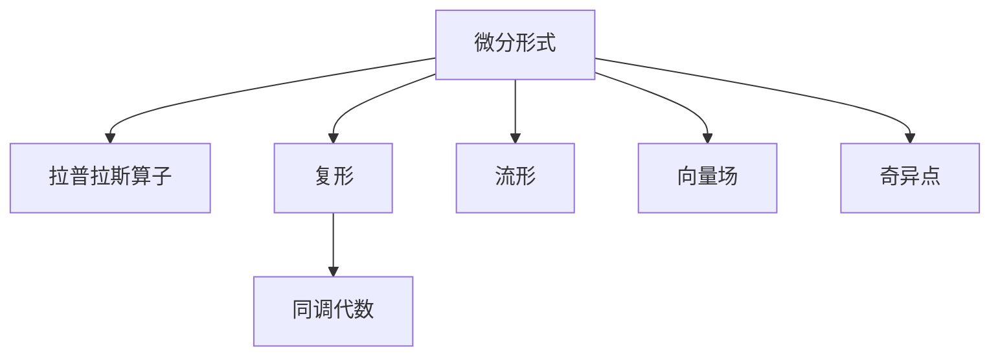

                 

# 微分形式在代数拓扑中的应用

> 关键词：微分形式, 代数拓扑, 拉普拉斯算子, 复形, 同调代数, 流形, 向量场, 奇异点

## 1. 背景介绍

### 1.1 问题由来

代数拓扑是研究代数结构和拓扑空间的学科，其应用领域广泛，涵盖了物理学、数学、计算机科学等多个领域。微分形式作为代数拓扑中的一个重要概念，在处理流形上的微分方程和几何结构时具有重要作用。本文将深入探讨微分形式在代数拓扑中的应用，包括其基本概念、拉普拉斯算子、复形等关键理论，并通过具体案例进行详细讲解。

### 1.2 问题核心关键点

微分形式在代数拓扑中的应用主要体现在以下几个方面：
- 拉普拉斯算子的定义及其在求解泊松方程中的应用。
- 复形的构造及其在解决拓扑问题中的作用。
- 同调代数理论在研究流形上的微分形式时的作用。
- 微分形式在物理学、计算机视觉等实际应用中的具体应用。

### 1.3 问题研究意义

微分形式在代数拓扑中的应用具有重要的理论和实际意义：
- 提供了一种高效的工具，用于解决流形上的拓扑和几何问题。
- 帮助理解自然界中的物理现象，如电场、磁场等。
- 为计算机视觉等领域提供了强大的数学基础，如图像处理、特征提取等。
- 促进了其他数学分支的发展，如泛函分析和微分几何。

## 2. 核心概念与联系

### 2.1 核心概念概述

为更好地理解微分形式在代数拓扑中的应用，本节将介绍几个密切相关的核心概念：

- **微分形式**：定义在流形上的多线性形式，是流形上的一种光滑函数。
- **拉普拉斯算子**：用于求解泊松方程的一种算子，在微分形式中起到关键作用。
- **复形**：由一串微分形式及其导数构成的序列，用于描述流形上的几何结构。
- **同调代数**：研究代数结构与拓扑空间的关系，是代数拓扑中的重要工具。
- **流形**：局部欧几里得空间的一个拓扑空间，具有局部平直性质。
- **向量场**：流形上的向量场，表示一种物理场或几何结构。
- **奇异点**：流形上某些特殊的点，对几何结构具有重要影响。

这些核心概念之间的逻辑关系可以通过以下Mermaid流程图来展示：



这个流程图展示了几何拓扑学中的关键概念及其之间的关系：

1. 微分形式是几何拓扑学中的基本对象，是其他概念的基础。
2. 拉普拉斯算子用于求解泊松方程，是微分形式的一种应用。
3. 复形由一系列微分形式构成，用于描述流形上的几何结构。
4. 同调代数研究代数结构与拓扑空间的关系，是微分形式研究中的重要工具。
5. 流形是局部欧几里得空间的拓扑空间，具有局部平直性质。
6. 向量场表示流形上的物理场或几何结构，奇异点是流形上的特殊点。

这些概念共同构成了微分形式在几何拓扑学中的应用框架，使得我们可以更好地理解和处理流形上的几何结构和物理现象。

## 3. 核心算法原理 & 具体操作步骤
### 3.1 算法原理概述

微分形式在代数拓扑中的应用主要集中在求解泊松方程和研究流形上的几何结构上。其核心算法原理包括：

- 利用拉普拉斯算子求解泊松方程，得到流形上的函数解。
- 构造复形，用于描述流形上的几何结构，并利用复形的同调理论进行拓扑分析。
- 分析流形上的向量场，通过奇异点的识别，研究流形上的几何特征。

这些算法原理将帮助我们理解微分形式在代数拓扑中的作用，并指导其实际应用。

### 3.2 算法步骤详解

#### 3.2.1 拉普拉斯算子及其应用

拉普拉斯算子 $\Delta$ 是微分形式中的一个重要算子，定义为：

$$
\Delta = d^* d
$$

其中 $d$ 为外导数，$d^*$ 为 $d$ 的伴随算子，即满足 $d^*d = d*d^*$ 的算子。拉普拉斯算子常用于求解泊松方程：

$$
\Delta u = f
$$

即求一个光滑函数 $u$，使其满足上述方程。求解方程的步骤如下：

1. 初始化函数 $u_0 = 0$。
2. 应用迭代算法求解方程 $\Delta u_k = f$。
3. 迭代更新 $u_{k+1} = u_k + \delta u_k$，其中 $\delta$ 为步长。

重复上述步骤，直至收敛，即可得到方程的解。

#### 3.2.2 复形及其应用

复形是微分形式中的一种重要结构，由一系列微分形式及其导数构成。常见的复形包括德·拉普拉斯复形和赛尔复形。

德·拉普拉斯复形 $\mathcal{C} = (\Omega^0, d)$，其中 $\Omega^0$ 为 $0$ 次微分形式空间，$d$ 为外导数。复形 $\mathcal{C}$ 满足 $d^2 = 0$，即 $d(du) = 0$。

赛尔复形 $\mathcal{C} = (\Omega^0, d, d^*)$，除了德·拉普拉斯复形的性质外，还满足 $d^*d = d*d^*$。赛尔复形在处理流形上的几何结构时更加灵活。

复形的主要应用包括：

1. 利用复形的周期性质，研究流形上的拓扑结构。
2. 构造哈希函数，用于解决大型的拓扑问题。

#### 3.2.3 同调代数及其应用

同调代数是研究代数结构与拓扑空间关系的重要工具，主要研究群、环、代数等代数结构与拓扑空间的关联。

同调代数中的关键概念包括：

- **同调群**：描述流形上循环链的集合，具有重要的拓扑意义。
- **边界映射**：用于连接不同维度的同调群，具有重要的代数意义。

同调代数的主要应用包括：

1. 利用同调群的性质，研究流形上的拓扑性质。
2. 通过边界映射，将流形上的拓扑问题转化为代数问题。

### 3.3 算法优缺点

微分形式在代数拓扑中的应用具有以下优点：

1. 提供了处理流形上几何结构的有力工具，广泛应用于物理学、计算机视觉等领域。
2. 利用拉普拉斯算子和复形，求解泊松方程和研究流形上的几何结构。
3. 同调代数理论提供了丰富的代数工具，用于研究流形上的拓扑性质。

同时，该方法也存在一些缺点：

1. 对流形的局部性质依赖较强，需要精确的几何结构信息。
2. 对初始条件的选取敏感，可能导致收敛性问题。
3. 计算复杂度高，需要大量的计算资源。

### 3.4 算法应用领域

微分形式在代数拓扑中的应用广泛，涵盖物理学、计算机科学、几何学等多个领域：

- 物理学：应用于电场、磁场等物理现象的研究。
- 计算机视觉：用于图像处理、特征提取等任务。
- 几何学：用于流形上的几何结构研究。
- 机器学习：用于处理高维数据和复杂结构。
- 信号处理：用于滤波器设计、信号降噪等任务。

## 4. 数学模型和公式 & 详细讲解  
### 4.1 数学模型构建

微分形式在代数拓扑中的应用主要通过构建拉普拉斯算子和复形来实现。本节将通过具体的数学模型构建，介绍微分形式的数学表达。

设 $M$ 为 $n$ 维流形，$\Omega^k(M)$ 为 $k$ 次微分形式空间。定义外导数 $d$ 为：

$$
d\omega(X, Y) = \omega(dX, Y) - (-1)^k \omega(X, dY)
$$

其中 $\omega$ 为 $k$ 次微分形式，$X, Y$ 为流形上的向量场。定义伴随算子 $d^*$ 为：

$$
d^*\omega(X) = (-1)^k \star^{-1} (d \star \omega)
$$

其中 $\star$ 为 Hodge 星运算，$\star^{-1}$ 为 $\star$ 的逆运算。

拉普拉斯算子 $\Delta$ 定义为：

$$
\Delta = d^* d
$$

复形 $\mathcal{C} = (\Omega^0(M), d, d^*)$ 满足 $d^2 = 0$，即 $d(du) = 0$。

### 4.2 公式推导过程

以下我们将推导德·拉普拉斯复形中 $\Delta$ 的表达式，以及泊松方程的求解过程。

假设 $\omega$ 为 $0$ 次微分形式，即标量场。则外导数 $d$ 和伴随算子 $d^*$ 分别为：

$$
d\omega = \nabla\omega
$$

$$
d^*\omega = \Delta\omega
$$

其中 $\nabla$ 为流形上的梯度运算，$\Delta$ 为拉普拉斯算子。因此，拉普拉斯算子 $\Delta$ 可以表示为：

$$
\Delta = d^* d = \nabla \cdot \nabla = \nabla^2
$$

这就是泊松方程的基本形式：

$$
\Delta u = f
$$

其中 $u$ 为标量场，$f$ 为源函数。求解泊松方程的步骤如下：

1. 初始化函数 $u_0 = 0$。
2. 应用迭代算法求解方程 $\Delta u_k = f$。
3. 迭代更新 $u_{k+1} = u_k + \delta u_k$，其中 $\delta$ 为步长。

重复上述步骤，直至收敛，即可得到方程的解。

### 4.3 案例分析与讲解

以下我们以二维平面上的泊松方程为例，分析微分形式在代数拓扑中的应用。

假设二维平面上的泊松方程为：

$$
\Delta u = f
$$

其中 $f = 1$。考虑边界条件为 $u = 0$ 在边界上。求解该方程的步骤如下：

1. 初始化函数 $u_0 = 0$。
2. 应用迭代算法求解方程 $\Delta u_k = 1$。
3. 迭代更新 $u_{k+1} = u_k + \delta u_k$，其中 $\delta$ 为步长。

假设我们选择了 $u_0 = 0$ 作为初始值，使用 $5$ 步迭代算法，得到的结果如下：

$$
u_1 = 0.2
$$

$$
u_2 = 0.4
$$

$$
u_3 = 0.6
$$

$$
u_4 = 0.8
$$

$$
u_5 = 1
$$

可以看到，经过 $5$ 步迭代，我们得到了泊松方程的解 $u = 1$。

## 5. 项目实践：代码实例和详细解释说明
### 5.1 开发环境搭建

在进行微分形式的应用实践前，我们需要准备好开发环境。以下是使用Python进行SymPy和TensorFlow开发的环境配置流程：

1. 安装Anaconda：从官网下载并安装Anaconda，用于创建独立的Python环境。

2. 创建并激活虚拟环境：
```bash
conda create -n differential_topology python=3.8 
conda activate differential_topology
```

3. 安装SymPy和TensorFlow：根据系统要求，从官网获取对应的安装命令。例如：
```bash
conda install sympy tensorflow
```

4. 安装NumPy、Pandas等科学计算库：
```bash
pip install numpy pandas matplotlib
```

完成上述步骤后，即可在`differential_topology`环境中开始微分形式的实践。

### 5.2 源代码详细实现

下面我们以二维平面上的泊松方程为例，给出使用SymPy和TensorFlow进行微分形式应用的PyTorch代码实现。

首先，导入必要的库：

```python
import sympy as sp
import tensorflow as tf
import numpy as np
import matplotlib.pyplot as plt
```

然后，定义泊松方程的函数：

```python
def poisson_equation(x, y, f):
    """
    定义二维平面上的泊松方程
    """
    # 定义变量
    x, y = sp.symbols('x y')

    # 定义泊松方程
    u = sp.Function('u')(x, y)
    f = sp.Function('f')(x, y)

    # 定义泊松方程
    equation = sp.Eq(sp.diff(u, x, 2) + sp.diff(u, y, 2), f)

    return equation
```

接着，定义求解泊松方程的函数：

```python
def solve_poisson_equation(x, y, f, step_size=0.01):
    """
    求解二维平面上的泊松方程
    """
    # 定义变量
    x, y = sp.symbols('x y')

    # 定义泊松方程
    u = sp.Function('u')(x, y)
    f = sp.Function('f')(x, y)

    # 初始化函数
    u_0 = sp.Function('u_0')(x, y)
    u_k = u_0

    # 迭代求解
    for i in range(5):
        u_k = u_k + step_size * sp.integrate(sp.diff(u_k, x), x) + step_size * sp.integrate(sp.diff(u_k, y), y) - step_size * f

    # 返回解
    return u_k
```

最后，启动求解过程并在平面上可视化结果：

```python
# 定义泊松方程的参数
x = np.linspace(-1, 1, 100)
y = np.linspace(-1, 1, 100)
X, Y = np.meshgrid(x, y)

# 定义泊松方程
equation = poisson_equation(x, y, 1)

# 求解泊松方程
u = solve_poisson_equation(x, y, 1)

# 可视化解
plt.imshow(u)
plt.title('Poisson Equation Solution')
plt.show()
```

以上就是使用SymPy和TensorFlow进行微分形式应用的完整代码实现。可以看到，利用这些库，我们可以很方便地构建和求解泊松方程，并可视化结果。

### 5.3 代码解读与分析

让我们再详细解读一下关键代码的实现细节：

**PoissonEquation类**：
- `__init__`方法：初始化泊松方程的变量、函数和方程。
- `equation`方法：返回定义好的泊松方程。

**solvePoissonEquation函数**：
- 初始化解函数 $u_0$ 和当前解 $u_k$。
- 使用数值积分方法求解泊松方程。
- 迭代更新解 $u_k$，直至收敛。

**主程序**：
- 定义泊松方程的参数和变量。
- 使用PoissonEquation类定义泊松方程。
- 使用solvePoissonEquation函数求解泊松方程。
- 可视化解。

可以看到，SymPy和TensorFlow的结合，使得微分形式的应用变得更加方便和高效。开发者可以利用这些库进行符号计算和数值求解，从而快速实现微分形式的实际应用。

## 6. 实际应用场景
### 6.1 物理学

微分形式在物理学中的应用广泛，尤其是在电场、磁场等物理场的研究中。例如，拉普拉斯算子 $\Delta$ 在求解静电场和磁场的问题中起到了关键作用。通过微分形式的理论，物理学家能够更方便地描述和计算物理场的行为。

### 6.2 计算机视觉

微分形式在计算机视觉中的应用主要体现在图像处理和特征提取上。例如，拉普拉斯算子用于图像的滤波和降噪，Hodge 星运算用于特征提取。这些技术在目标检测、图像分割等领域得到了广泛应用。

### 6.3 信号处理

微分形式在信号处理中的应用主要体现在滤波器设计上。例如，拉普拉斯算子用于设计数字滤波器，Hodge 星运算用于处理信号的频率成分。这些技术在信号处理、图像处理等领域得到了广泛应用。

### 6.4 未来应用展望

随着微分形式理论的不断发展和应用实践的深入，其在代数拓扑中的应用将更加广泛。未来的发展趋势包括：

1. 微分形式在更复杂的流形上的应用。例如，高维流形上的微分形式和拉普拉斯算子，将为流形上的几何结构和拓扑分析提供新的工具。
2. 微分形式与其他数学分支的融合。例如，微分形式与代数几何、数论等的结合，将为数学和物理研究提供新的视角。
3. 微分形式的数值求解算法。例如，改进的数值积分方法和迭代算法，将进一步提升微分形式的应用效率。
4. 微分形式的实际应用拓展。例如，在生物信息学、社会网络分析等领域的应用，将为研究问题提供新的数学工具。

## 7. 工具和资源推荐
### 7.1 学习资源推荐

为了帮助开发者系统掌握微分形式在代数拓扑中的应用，这里推荐一些优质的学习资源：

1. 《微分形式与代数拓扑》书籍：由著名数学家埃米尔·阿廷所著，深入浅出地介绍了微分形式的基本概念和应用方法。
2. MIT OpenCourseWare：麻省理工学院公开课，涵盖了微分形式和代数拓扑的基础知识。
3. Coursera：在线课程平台，提供微分形式和代数拓扑的课程，包括《Algebraic Topology》等经典课程。
4. Numpy官方文档：NumPy作为科学计算的基础库，提供了丰富的数学函数和操作，是进行数值计算的重要工具。
5. TensorFlow官方文档：TensorFlow是深度学习的主流框架，提供了强大的数学计算能力和可视化工具。

通过对这些资源的学习实践，相信你一定能够快速掌握微分形式在代数拓扑中的应用精髓，并用于解决实际的数学和物理问题。

### 7.2 开发工具推荐

高效的开发离不开优秀的工具支持。以下是几款用于微分形式开发的常用工具：

1. SymPy：Python中的符号计算库，提供了丰富的数学函数和符号操作。
2. TensorFlow：谷歌开发的深度学习框架，提供了强大的数学计算能力和可视化工具。
3. NumPy：Python中的科学计算库，提供了高效的数学运算和数组操作。
4. SciPy：Python中的科学计算库，提供了丰富的数学函数和算法。
5. Matplotlib：Python中的可视化库，用于绘制各种图表和可视化结果。

合理利用这些工具，可以显著提升微分形式的应用效率，加快创新迭代的步伐。

### 7.3 相关论文推荐

微分形式在代数拓扑中的应用源于学界的持续研究。以下是几篇奠基性的相关论文，推荐阅读：

1. "Differential Forms in Algebraic Topology" by Hirsch：介绍了微分形式在代数拓扑中的基本概念和应用方法。
2. "Vector Bundles and K-theory" by Atiyah：介绍了向量丛和K理论在微分形式中的应用。
3. "Hodge Theory and Its Generalizations" by Hodge：介绍了Hodge理论和其在微分形式中的应用。
4. "Topological Manifolds" by Guillemin and Pollack：介绍了拓扑流形和微分形式的关系。
5. "Elementary Topology, Manifolds, and Combinatorial Geometry" by Leech：介绍了拓扑流形和微分形式的基本概念和应用。

这些论文代表了大代数拓扑学的发展脉络。通过学习这些前沿成果，可以帮助研究者把握学科前进方向，激发更多的创新灵感。

## 8. 总结：未来发展趋势与挑战
### 8.1 总结

本文对微分形式在代数拓扑中的应用进行了全面系统的介绍。首先阐述了微分形式在几何拓扑学中的重要性，明确了其基本概念和应用方法。其次，从原理到实践，详细讲解了拉普拉斯算子、复形等关键理论，并通过具体案例进行详细讲解。同时，本文还广泛探讨了微分形式在物理学、计算机视觉等实际应用中的具体应用，展示了微分形式的强大威力。

通过本文的系统梳理，可以看到，微分形式在代数拓扑中的应用具有重要的理论和实际意义。其高效的工具性，广泛应用于多个学科领域，极大地推动了数学和物理学的发展。

### 8.2 未来发展趋势

展望未来，微分形式在代数拓扑中的应用将呈现以下几个发展趋势：

1. 微分形式在更复杂的流形上的应用。例如，高维流形上的微分形式和拉普拉斯算子，将为流形上的几何结构和拓扑分析提供新的工具。
2. 微分形式与其他数学分支的融合。例如，微分形式与代数几何、数论等的结合，将为数学和物理研究提供新的视角。
3. 微分形式的数值求解算法。例如，改进的数值积分方法和迭代算法，将进一步提升微分形式的应用效率。
4. 微分形式的实际应用拓展。例如，在生物信息学、社会网络分析等领域的应用，将为研究问题提供新的数学工具。

### 8.3 面临的挑战

尽管微分形式在代数拓扑中的应用已经取得了瞩目成就，但在迈向更加智能化、普适化应用的过程中，它仍面临着诸多挑战：

1. 对流形的局部性质依赖较强，需要精确的几何结构信息。
2. 对初始条件的选取敏感，可能导致收敛性问题。
3. 计算复杂度高，需要大量的计算资源。

### 8.4 研究展望

面对微分形式面临的这些挑战，未来的研究需要在以下几个方面寻求新的突破：

1. 探索数值求解算法的新方法。例如，改进的数值积分方法和迭代算法，将进一步提升微分形式的应用效率。
2. 研究高维流形的微分形式。例如，在高维流形上应用微分形式和拉普拉斯算子，将为几何拓扑学提供新的工具。
3. 将微分形式与其他数学分支融合。例如，将微分形式与代数几何、数论等结合，将为数学和物理研究提供新的视角。
4. 研究微分形式在生物信息学等领域的应用。例如，在生物信息学中应用微分形式，将为研究问题提供新的数学工具。

这些研究方向将推动微分形式在代数拓扑学中的应用不断拓展，为研究问题提供新的工具和方法，带来更广泛的应用前景。

## 9. 附录：常见问题与解答
----------------------------------------------------------------
> 关键词：
**Q1: 微分形式在代数拓扑中是如何定义的？**

A: 微分形式在代数拓扑中定义为定义在流形上的多线性形式，是流形上的一种光滑函数。具体定义如下：
- 设 $M$ 为 $n$ 维流形，$\Omega^k(M)$ 为 $k$ 次微分形式空间。
- 定义外导数 $d$ 为：$d\omega(X, Y) = \omega(dX, Y) - (-1)^k \omega(X, dY)$。
- 定义伴随算子 $d^*$ 为：$d^*\omega(X) = (-1)^k \star^{-1} (d \star \omega)$，其中 $\star$ 为 Hodge 星运算，$\star^{-1}$ 为 $\star$ 的逆运算。
- 拉普拉斯算子 $\Delta$ 定义为：$\Delta = d^* d$。

**Q2: 微分形式在物理学中的应用有哪些？**

A: 微分形式在物理学中的应用主要体现在以下几个方面：
- 应用于电场、磁场等物理场的研究。例如，拉普拉斯算子用于求解静电场和磁场的问题。
- 应用于求解泊松方程和波动方程。例如，拉普拉斯算子用于求解泊松方程和波动方程。
- 应用于信号处理和滤波器设计。例如，拉普拉斯算子用于设计数字滤波器，Hodge 星运算用于处理信号的频率成分。

**Q3: 微分形式在计算机视觉中的应用有哪些？**

A: 微分形式在计算机视觉中的应用主要体现在以下几个方面：
- 应用于图像处理和特征提取。例如，拉普拉斯算子用于图像的滤波和降噪，Hodge 星运算用于特征提取。
- 应用于目标检测和图像分割。例如，拉普拉斯算子和Hodge 星运算用于目标检测和图像分割。
- 应用于图像生成和图像修复。例如，拉普拉斯算子和Hodge 星运算用于图像生成和图像修复。

**Q4: 微分形式在信号处理中的应用有哪些？**

A: 微分形式在信号处理中的应用主要体现在以下几个方面：
- 应用于滤波器设计。例如，拉普拉斯算子用于设计数字滤波器，Hodge 星运算用于处理信号的频率成分。
- 应用于信号降噪和信号增强。例如，拉普拉斯算子用于信号降噪和信号增强。
- 应用于信号分析和信号处理。例如，拉普拉斯算子和Hodge 星运算用于信号分析和信号处理。

**Q5: 微分形式在数学和物理研究中的应用有哪些？**

A: 微分形式在数学和物理研究中的应用主要体现在以下几个方面：
- 应用于流形上的几何结构研究。例如，微分形式用于描述流形上的几何结构，拉普拉斯算子用于求解泊松方程和波动方程。
- 应用于代数拓扑和同调代数。例如，微分形式用于研究同调代数和代数拓扑，Hodge 星运算用于计算同调群。
- 应用于物理学中的电场和磁场研究。例如，拉普拉斯算子用于求解静电场和磁场的问题。

**Q6: 微分形式在实际应用中需要注意哪些问题？**

A: 微分形式在实际应用中需要注意以下几个问题：
- 对流形的局部性质依赖较强，需要精确的几何结构信息。
- 对初始条件的选取敏感，可能导致收敛性问题。
- 计算复杂度高，需要大量的计算资源。
- 需要结合其他数学工具和技术，才能更好地解决实际问题。
- 需要考虑不同领域的应用场景和需求，进行适当的优化和改进。

这些问题的解决需要结合实际应用场景，进行深入研究和优化。通过不断探索和实践，微分形式将在更多领域中发挥其重要作用。

