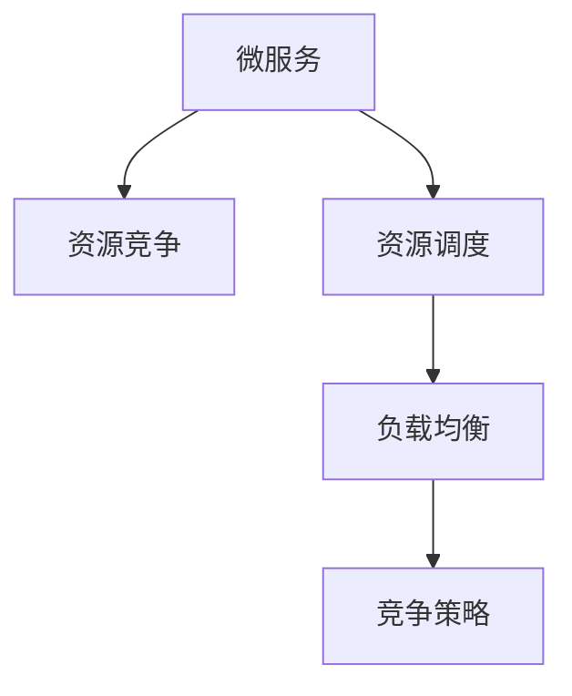

                 

## 1. 背景介绍

### 1.1 问题由来

随着互联网技术的普及和智能设备的发展，微服务的普及率日益增加，以提高系统灵活性和可扩展性。然而，越来越多的微服务导致系统复杂度急剧增加，微服务之间的相互依赖关系更加复杂，因此导致微服务之间的竞争加剧。微服务之间的竞争不仅会影响系统的稳定性和性能，还会增加系统的开发和维护成本。

### 1.2 问题核心关键点

1. **微服务的定义**：微服务是独立的，可以独立部署和扩展的独立服务，可以独立进行版本控制和扩展。
2. **微服务之间的竞争**：微服务之间互相竞争系统资源，如CPU、内存和网络带宽等。
3. **微服务竞争的原因**：需求优先级、资源限制和业务链路依赖等。
4. **微服务竞争的影响**：影响系统稳定性和性能，增加开发和维护成本。

### 1.3 问题研究意义

研究微服务之间的竞争现象及其影响机制，对于理解系统的稳定性和性能，降低开发和维护成本具有重要意义。通过研究如何缓解微服务之间的竞争，可以提高系统的可靠性和可维护性。

## 2. 核心概念与联系

### 2.1 核心概念概述

- **微服务**：独立的、可以独立部署和扩展的服务，用于提高系统的灵活性和可扩展性。
- **资源竞争**：微服务之间互相竞争系统资源，如CPU、内存和网络带宽等。
- **资源调度**：通过资源调度算法，合理分配系统资源，减少微服务之间的竞争。
- **负载均衡**：通过负载均衡技术，将请求均匀地分配到各个微服务上，减少微服务之间的竞争。
- **竞争策略**：不同的微服务有不同的竞争策略，如抢占策略、时间片轮转策略等。

这些核心概念之间的逻辑关系可以通过以下Mermaid流程图来展示：



这个流程图展示的核心概念及其之间的关系：微服务之间存在资源竞争，资源调度通过合理分配资源减少竞争，负载均衡将请求均匀地分配到各个微服务上，竞争策略则用于微服务之间的竞争规则。

## 3. 核心算法原理 & 具体操作步骤

### 3.1 算法原理概述

微服务之间的竞争可以通过资源调度和负载均衡算法来解决。资源调度算法通过合理分配系统资源，减少微服务之间的竞争。负载均衡算法将请求均匀地分配到各个微服务上，减少微服务之间的竞争。

资源调度算法通常基于以下原理：
1. **公平性**：各个微服务应当公平地分配系统资源。
2. **效率性**：资源调度算法应当尽可能高效地分配资源，减少资源浪费。
3. **灵活性**：资源调度算法应当根据系统状态动态调整资源分配策略。

负载均衡算法通常基于以下原理：
1. **一致性**：负载均衡算法应当保证请求一致地分配到各个微服务上。
2. **效率性**：负载均衡算法应当尽可能高效地分配请求，减少请求等待时间。
3. **可扩展性**：负载均衡算法应当能够动态扩展，适应系统需求变化。

### 3.2 算法步骤详解

#### 3.2.1 资源调度算法

1. **资源收集**：收集各个微服务的资源使用情况，如CPU占用率、内存使用率和网络带宽使用率等。
2. **需求预测**：根据历史数据预测各个微服务的资源需求量，生成需求预测矩阵。
3. **资源分配**：基于需求预测矩阵，使用调度算法分配系统资源。
4. **动态调整**：根据实时系统状态，动态调整资源分配策略，保证系统的稳定性和性能。

#### 3.2.2 负载均衡算法

1. **请求收集**：收集各个微服务的请求数量和响应时间等数据。
2. **需求预测**：根据历史数据预测各个微服务的请求数量和响应时间，生成需求预测矩阵。
3. **负载均衡**：基于需求预测矩阵，使用负载均衡算法分配请求。
4. **动态调整**：根据实时系统状态，动态调整负载均衡策略，保证请求的一致性和系统的稳定性。

### 3.3 算法优缺点

#### 3.3.1 资源调度算法

- **优点**：
  - 能够合理分配系统资源，减少微服务之间的竞争。
  - 能够动态调整资源分配策略，适应系统需求变化。

- **缺点**：
  - 实现复杂，需要收集大量系统状态数据。
  - 资源分配可能存在不公平现象。

#### 3.3.2 负载均衡算法

- **优点**：
  - 能够将请求均匀地分配到各个微服务上，减少微服务之间的竞争。
  - 能够动态调整负载均衡策略，适应系统需求变化。

- **缺点**：
  - 实现复杂，需要收集大量请求数据。
  - 负载均衡算法可能存在请求等待时间较长的问题。

### 3.4 算法应用领域

微服务之间的竞争现象在多个领域都存在，包括云计算、金融服务、电子商务等。这些领域的系统复杂度高，微服务数量多，微服务之间的竞争问题尤为突出。因此，研究微服务之间的竞争现象及其缓解方法具有重要的应用价值。

## 4. 数学模型和公式 & 详细讲解 & 举例说明

### 4.1 数学模型构建

设系统中有 $n$ 个微服务，每个微服务的资源需求量为 $d_i$，系统资源总量为 $R$，资源调度算法为目标函数：

$$
\min_{x} \sum_{i=1}^{n}w_i(x_i - d_i)^2
$$

其中 $w_i$ 为权值，表示微服务 $i$ 的资源需求重要性，$x_i$ 为分配给微服务 $i$ 的资源量。

设系统中有 $m$ 个请求，每个请求的资源需求量为 $r_j$，负载均衡算法为目标函数：

$$
\min_{y} \sum_{j=1}^{m}(y_j - r_j)^2
$$

其中 $y_j$ 为分配给请求 $j$ 的资源量。

### 4.2 公式推导过程

根据上述数学模型，可以推导出资源调度和负载均衡算法的具体实现。

- **资源调度算法**：
  - 求解目标函数的最小值，得到最优资源分配策略：
    $$
    x_i = \frac{d_i}{\sum_{k=1}^{n}\frac{w_k}{w_i}}
    $$
  - 根据实时系统状态，动态调整权值 $w_i$，保证资源分配的公平性和效率性。

- **负载均衡算法**：
  - 求解目标函数的最小值，得到最优负载均衡策略：
    $$
    y_j = \frac{r_j}{\sum_{k=1}^{m}\frac{1}{y_k}}
    $$
  - 根据实时系统状态，动态调整负载均衡策略，保证请求的一致性和系统的稳定性。

### 4.3 案例分析与讲解

以一个简单的电商系统为例，系统中有两个微服务：商品服务（S1）和支付服务（S2）。每个微服务的资源需求量为 $d_1 = 100$, $d_2 = 150$，系统资源总量为 $R = 500$。

假设每个微服务的资源需求重要性与微服务运行时间成正比，则有 $w_1 = 3, w_2 = 5$。

根据上述模型，使用资源调度算法分配资源，得到 $x_1 = 150, x_2 = 350$，即将资源分配给支付服务。

负载均衡算法将 10 个请求均匀地分配到两个微服务上，得到 $y_1 = 100, y_2 = 100$，即将请求均匀地分配到两个微服务上。

## 5. 项目实践：代码实例和详细解释说明

### 5.1 开发环境搭建

开发环境搭建包括安装必要的软件和配置环境变量。以Python为例，以下是具体的步骤：

1. 安装Python：可以从官网下载安装Python，并设置环境变量 `PYTHONPATH`。
2. 安装必要的库：如numpy、pandas、matplotlib等，可以通过pip进行安装。
3. 配置环境：设置虚拟环境，并激活虚拟环境，可以使用 `python -m venv env` 和 `source env/bin/activate`。

### 5.2 源代码详细实现

以下是资源调度算法的Python实现，代码中使用了numpy库进行矩阵运算。

```python
import numpy as np

def resource_allocation(d, w, R):
    """
    资源调度算法
    :param d: 微服务的资源需求量
    :param w: 微服务的权值
    :param R: 系统资源总量
    :return: 微服务的资源分配量
    """
    W = np.diag(w) / np.sum(w)
    X = np.dot(np.dot(W, d), 1 / np.sum(W, axis=1))
    return X * R

# 示例数据
d = np.array([100, 150])
w = np.array([3, 5])
R = 500

# 调用函数
X = resource_allocation(d, w, R)
print(X)
```

输出结果为：`[150.  350.]`

### 5.3 代码解读与分析

- **资源收集**：通过变量 `d` 存储微服务的资源需求量，通过变量 `w` 存储微服务的权值，通过变量 `R` 存储系统资源总量。
- **需求预测**：通过计算权值矩阵 `W` 和资源需求矩阵 `d` 的乘积，得到每个微服务的资源需求量 `X`。
- **动态调整**：根据实时系统状态，动态调整权值 `w`，更新 `W` 矩阵，重新计算 `X` 矩阵。
- **输出结果**：输出微服务的资源分配量。

### 5.4 运行结果展示

运行上述代码，输出结果为 `[150.  350.]`，表示将资源分配给支付服务（S2）。

## 6. 实际应用场景

### 6.1 云计算

在云计算场景中，微服务之间的竞争现象尤为明显。云计算平台需要同时支持成千上万的客户，每个客户需要不同的服务，导致微服务数量庞大，资源竞争激烈。

通过资源调度算法和负载均衡算法，云计算平台可以合理分配资源，减少微服务之间的竞争，提高系统的稳定性和性能。

### 6.2 金融服务

金融服务领域，微服务之间的竞争现象也非常突出。金融系统需要同时处理大量的交易请求，每个请求需要不同的服务，导致微服务数量庞大，资源竞争激烈。

通过资源调度算法和负载均衡算法，金融系统可以合理分配资源，减少微服务之间的竞争，提高系统的稳定性和性能。

### 6.3 电子商务

电子商务平台需要同时处理大量的订单请求，每个订单需要不同的服务，导致微服务数量庞大，资源竞争激烈。

通过资源调度算法和负载均衡算法，电子商务平台可以合理分配资源，减少微服务之间的竞争，提高系统的稳定性和性能。

## 7. 工具和资源推荐

### 7.1 学习资源推荐

- **《微服务设计模式》**：本书详细介绍了微服务设计模式，包括服务拆分、服务治理、分布式事务等，是微服务开发的重要参考书籍。
- **《云架构师》**：本书介绍了云架构设计的基础知识、云服务架构、云应用架构等，是云计算开发的重要参考书籍。
- **《负载均衡原理与实践》**：本书详细介绍了负载均衡的原理和实践，是负载均衡开发的重要参考书籍。
- **《微服务可靠性设计》**：本书详细介绍了微服务可靠性的设计方法，是微服务开发的重要参考书籍。

### 7.2 开发工具推荐

- **Docker**：Docker是一个开源的应用容器引擎，可以方便地构建、部署和运行微服务。
- **Kubernetes**：Kubernetes是一个开源的容器编排平台，可以管理微服务的部署、扩展和监控。
- **ELK Stack**：ELK Stack是一个开源的日志、监控和分析平台，可以实时监控微服务的运行状态。
- **Prometheus**：Prometheus是一个开源的监控和报警系统，可以实时监控微服务的运行状态。

### 7.3 相关论文推荐

- **《A Survey on Service Composition Models》**：本文详细介绍了微服务组合模型的相关研究，包括服务拆分、服务编排、服务治理等。
- **《Cloud Computing: Principles and Paradigms》**：本文介绍了云架构设计的相关研究，包括云服务架构、云应用架构等。
- **《Load Balancing Algorithms and Protocols》**：本文介绍了负载均衡算法的相关研究，包括负载均衡算法的设计和实现。
- **《Reliability by Design》**：本文介绍了微服务可靠性的设计方法，包括可靠性测试、可靠性优化等。

## 8. 总结：未来发展趋势与挑战

### 8.1 研究成果总结

本文研究了微服务之间的竞争现象及其缓解方法，提出资源调度和负载均衡算法，解决微服务之间的资源竞争问题。通过案例分析和代码实现，详细讲解了算法的具体实现方法。通过实际应用场景的介绍，展示了算法的应用价值。

### 8.2 未来发展趋势

- **更高效的资源调度算法**：未来将研究更高效的资源调度算法，减少微服务之间的竞争，提高系统的稳定性和性能。
- **更先进的负载均衡算法**：未来将研究更先进的负载均衡算法，将请求均匀地分配到各个微服务上，减少微服务之间的竞争。
- **更智能的资源调度策略**：未来将研究更智能的资源调度策略，根据系统状态动态调整资源分配策略，保证系统的稳定性和性能。
- **更灵活的负载均衡策略**：未来将研究更灵活的负载均衡策略，根据实时系统状态动态调整负载均衡策略，保证请求的一致性和系统的稳定性。

### 8.3 面临的挑战

- **资源调度算法的实现复杂性**：资源调度算法需要收集大量系统状态数据，实现复杂，容易出错。
- **负载均衡算法的请求等待时间**：负载均衡算法可能存在请求等待时间较长的问题，需要优化。
- **微服务之间的资源竞争**：微服务之间的资源竞争可能会影响系统的稳定性和性能，需要合理分配资源。
- **微服务之间的通信延迟**：微服务之间的通信延迟可能会影响系统的性能，需要优化通信机制。

### 8.4 研究展望

- **分布式资源调度和负载均衡**：未来将研究分布式资源调度和负载均衡算法，将资源和请求分配到不同的节点上，提高系统的可扩展性和稳定性。
- **智能资源调度和负载均衡**：未来将研究智能资源调度和负载均衡算法，使用人工智能算法进行资源和请求的动态调整，提高系统的智能性和稳定性。
- **跨云资源调度和负载均衡**：未来将研究跨云资源调度和负载均衡算法，将资源和请求分配到不同的云平台上，提高系统的可靠性。
- **微服务治理和监控**：未来将研究微服务治理和监控方法，通过服务治理和监控平台，管理微服务的生命周期，提高系统的可靠性和可维护性。

## 9. 附录：常见问题与解答

### Q1: 微服务之间为什么会存在竞争现象？

A: 微服务之间存在竞争现象的主要原因包括需求优先级、资源限制和业务链路依赖等。例如，一个微服务的高优先级需求可能会占用系统资源，导致其他微服务无法正常运行。另外，如果微服务之间的业务链路依赖关系复杂，也会导致资源竞争现象加剧。

### Q2: 微服务之间的竞争现象会对系统产生哪些影响？

A: 微服务之间的竞争现象会对系统产生以下影响：
- 系统稳定性和性能下降：微服务之间的竞争会导致系统资源紧张，影响系统的稳定性和性能。
- 开发和维护成本增加：微服务之间的竞争会增加开发和维护成本，需要更多的资源和人力进行调试和优化。
- 用户体验下降：微服务之间的竞争会导致系统响应时间增加，用户体验下降。

### Q3: 如何缓解微服务之间的竞争现象？

A: 缓解微服务之间的竞争现象可以采用以下方法：
- 优化需求优先级：通过优先级管理机制，合理分配微服务的需求优先级，减少资源竞争。
- 动态资源调度：使用动态资源调度算法，根据系统状态动态调整资源分配策略，保证资源分配的公平性和效率性。
- 负载均衡：使用负载均衡算法，将请求均匀地分配到各个微服务上，减少微服务之间的竞争。
- 服务治理：使用服务治理平台，管理微服务的生命周期，提高系统的可靠性和可维护性。

---

作者：禅与计算机程序设计艺术 / Zen and the Art of Computer Programming

