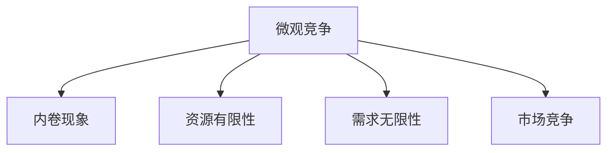

                 

## 1. 背景介绍

### 1.1 问题由来
近年来，随着信息技术的发展和全球经济一体化的加速，企业之间的竞争已经从传统的市场竞争扩展到微观层面的竞争，甚至出现了以企业内部为单位的“内卷”现象。内卷（Involution）一词最初由美国人类学家格尔茨（Clifford Geertz）提出，后来在社会学、经济学、管理学等领域被广泛应用，泛指在社会资源有限的情况下，个体或群体为了争夺资源而采取的过度竞争行为。

在技术领域，尤其是人工智能（AI）行业，微观竞争和内卷现象尤为显著。随着人工智能技术的快速发展，越来越多的企业在AI领域投入巨资，竞相研发各种技术和应用，导致市场竞争异常激烈。此外，由于AI技术的复杂性和高门槛，企业内部也出现了大量的竞争和内耗，研发人员不得不投入大量时间和精力在重复、低效的劳动中，无法形成真正的创新和突破。

### 1.2 问题核心关键点
微观竞争和内卷现象的核心在于资源的有限性和需求的无限性。在资源有限的情况下，企业为了争夺市场份额、客户资源和人才，不得不投入更多的资源进行研发和竞争。同时，由于市场的不确定性和动态变化，企业内部的竞争和内耗也变得尤为剧烈。这种竞争不仅导致研发成本的增加和效率的降低，还可能导致创新的停滞和资源的浪费。

### 1.3 问题研究意义
研究微观竞争和内卷现象对于理解技术领域的发展趋势、优化企业内部管理和提高创新效率具有重要意义：

1. **优化资源配置**：通过深入分析企业内部的竞争和内卷现象，可以识别资源配置中的瓶颈和浪费，从而优化资源使用，提高研发效率。
2. **提升创新能力**：了解内卷现象的根源，可以帮助企业找到创新的路径和方向，避免陷入恶性竞争的泥潭。
3. **增强市场竞争力**：优化资源配置和提升创新能力，可以增强企业市场竞争力，实现可持续发展。

## 2. 核心概念与联系

### 2.1 核心概念概述

为了更好地理解微观竞争和内卷现象，本节将介绍几个关键概念及其之间的联系：

- **微观竞争**：指企业内部的竞争和内部资源配置的优化。这种竞争可以是研发、市场、人才等方面的竞争，也可以是在同一技术方向上的竞争。
- **内卷现象**：指企业内部由于资源有限，为了争夺资源而采取的过度竞争行为，导致资源浪费和效率低下。
- **资源有限性**：指企业内部可用的资源（如资金、人才、技术等）是有限的，难以满足所有需求。
- **需求无限性**：指企业面临的市场需求是无限的，需要不断创新和优化以满足客户需求。
- **市场竞争**：指企业在市场层面上与其他企业之间的竞争，可以通过市场营销、产品创新等手段进行竞争。

这些核心概念之间的逻辑关系可以通过以下Mermaid流程图来展示：



这个流程图展示了一些关键概念之间的联系：

1. 微观竞争与内卷现象是互为因果的关系，内卷现象是微观竞争的产物。
2. 资源有限性与需求无限性是微观竞争和内卷现象的根本原因。
3. 微观竞争与市场竞争互为补充，微观竞争优化企业内部资源，而市场竞争影响企业外部市场表现。

## 3. 核心算法原理 & 具体操作步骤

### 3.1 算法原理概述

微观竞争和内卷现象的优化，本质上是一个资源配置和效率提升的问题。其核心思想是通过对企业内部的竞争和资源配置进行优化，最大化资源的利用效率，从而提升企业的创新能力和市场竞争力。

形式化地，假设企业内部有 $N$ 个研发团队 $T_1, T_2, \ldots, T_N$，每个团队 $T_i$ 拥有资源 $R_i$，并在研发项目 $P_1, P_2, \ldots, P_M$ 上竞争资源。企业希望最大化资源利用效率，即最大化 $T_i$ 在项目 $P_j$ 上的产出 $Y_{ij}$。

为了解决这个问题，我们可以使用以下数学模型：

$$
\max_{R_i, Y_{ij}} \sum_{i=1}^N \sum_{j=1}^M Y_{ij}
$$

其中，$R_i$ 表示团队 $T_i$ 可用的资源，$Y_{ij}$ 表示团队 $T_i$ 在项目 $P_j$ 上的产出。

### 3.2 算法步骤详解

基于上述模型，微观竞争和内卷现象的优化可以分为以下几个关键步骤：

**Step 1: 定义资源和产出模型**

- 定义每个团队在每个项目上的产出函数 $Y_{ij}$，可以是一个简单的线性函数，也可以是一个复杂的非线性函数。
- 定义每个团队可用的资源 $R_i$，可以是时间、资金、人力等。
- 定义资源分配约束条件 $C_{ij}$，如时间不冲突、成本不超过预算等。

**Step 2: 确定优化目标**

- 根据企业目标，确定最大化产出、最小化成本等优化目标。

**Step 3: 设定优化算法**

- 选择合适的优化算法，如线性规划、非线性规划、遗传算法等。
- 设置初始参数，如学习率、迭代次数等。

**Step 4: 执行资源分配**

- 根据优化算法求解资源分配问题，得到最优资源分配方案。
- 根据资源分配方案，调整各团队的资源使用情况。

**Step 5: 评估优化效果**

- 通过实验或模拟，评估优化后的资源分配方案对产出和成本的影响。
- 根据评估结果，调整优化目标和算法参数。

### 3.3 算法优缺点

微观竞争和内卷现象的优化方法具有以下优点：

1. **资源利用效率高**：通过优化资源分配，最大化产出，提高了资源利用效率。
2. **减少内耗**：通过优化竞争机制，减少了企业内部的内耗和重复劳动。
3. **提升创新能力**：优化资源配置有助于发现资源瓶颈和浪费，提升创新能力。
4. **增强市场竞争力**：优化后的资源分配有助于提升企业市场竞争力。

同时，该方法也存在一定的局限性：

1. **模型复杂度高**：不同项目、团队和资源的特性不同，建模复杂度较高。
2. **数据需求大**：需要大量的数据进行建模和优化，数据收集和处理成本较高。
3. **算法选择困难**：选择合适的优化算法需要一定的专业知识和经验。
4. **参数调整难度大**：优化过程中需要调整多个参数，调整难度较大。

### 3.4 算法应用领域

微观竞争和内卷现象的优化方法已经在多个领域得到了应用，例如：

- **研发管理**：在软件开发、硬件开发、应用开发等领域，通过优化资源分配和团队协作，提升研发效率和创新能力。
- **生产管理**：在制造业、农业、服务业等领域，通过优化资源配置和生产线调度，提升生产效率和产品质量。
- **人力资源管理**：在人力资源招聘、培训、绩效考核等领域，通过优化员工资源配置和激励机制，提升员工满意度和工作效果。
- **市场营销**：在市场营销、广告投放、客户关系管理等领域，通过优化资源分配和市场策略，提升市场竞争力和客户满意度。

## 4. 数学模型和公式 & 详细讲解  
### 4.1 数学模型构建

本节将使用数学语言对微观竞争和内卷现象的优化问题进行更加严格的刻画。

假设企业内部有 $N$ 个研发团队 $T_1, T_2, \ldots, T_N$，每个团队 $T_i$ 在项目 $P_1, P_2, \ldots, P_M$ 上的产出为 $Y_{ij}$，可用的资源为 $R_i$。优化目标为最大化产出，即：

$$
\max_{R_i, Y_{ij}} \sum_{i=1}^N \sum_{j=1}^M Y_{ij}
$$

其中，$R_i$ 表示团队 $T_i$ 可用的资源，$Y_{ij}$ 表示团队 $T_i$ 在项目 $P_j$ 上的产出。约束条件可以表示为：

$$
\begin{aligned}
R_i &\geq 0, \quad \forall i=1,2,\ldots,N \\
Y_{ij} &\geq 0, \quad \forall i=1,2,\ldots,N, \forall j=1,2,\ldots,M \\
C_{ij}(R_i, Y_{ij}) &\leq c_j, \quad \forall i=1,2,\ldots,N, \forall j=1,2,\ldots,M \\
\end{aligned}
$$

其中，$C_{ij}(R_i, Y_{ij})$ 表示团队 $T_i$ 在项目 $P_j$ 上的成本函数，$c_j$ 表示项目 $P_j$ 的预算。

### 4.2 公式推导过程

以下我们以线性规划问题为例，推导微观竞争和内卷现象优化问题的求解公式。

假设成本函数 $C_{ij}(R_i, Y_{ij})$ 为线性函数，即：

$$
C_{ij}(R_i, Y_{ij}) = a_{ij}R_i + b_{ij}Y_{ij}
$$

则优化问题变为：

$$
\max_{R_i, Y_{ij}} \sum_{i=1}^N \sum_{j=1}^M Y_{ij} \\
\text{subject to} \\
R_i \geq 0, \quad \forall i=1,2,\ldots,N \\
Y_{ij} \geq 0, \quad \forall i=1,2,\ldots,N, \forall j=1,2,\ldots,M \\
a_{ij}R_i + b_{ij}Y_{ij} \leq c_j, \quad \forall i=1,2,\ldots,N, \forall j=1,2,\ldots,M \\
$$

这是一个典型的线性规划问题，可以使用单纯形法或内点法等算法求解。求解后得到的资源分配方案 $R_i^*, Y_{ij}^*$ 即为最优解。

### 4.3 案例分析与讲解

以软件开发为例，假设企业有 $N=3$ 个研发团队 $T_1, T_2, T_3$，每个团队在 $M=2$ 个项目 $P_1, P_2$ 上竞争资源。项目 $P_1$ 的预算为 $c_1=10$，项目 $P_2$ 的预算为 $c_2=15$。团队 $T_i$ 在项目 $P_j$ 上的产出函数为 $Y_{ij}=R_i$，成本函数为 $C_{ij}(R_i, Y_{ij})=2R_i+3Y_{ij}$。

构建优化问题如下：

$$
\max_{R_1, R_2, R_3, Y_{11}, Y_{12}, Y_{21}, Y_{22}, Y_{31}, Y_{32}} Y_{11} + Y_{12} + Y_{21} + Y_{22} + Y_{31} + Y_{32} \\
\text{subject to} \\
R_1, R_2, R_3 \geq 0 \\
Y_{11}, Y_{12}, Y_{21}, Y_{22}, Y_{31}, Y_{32} \geq 0 \\
2R_1+3Y_{11} \leq 10 \\
2R_2+3Y_{12} \leq 10 \\
2R_3+3Y_{21} \leq 15 \\
2R_3+3Y_{22} \leq 15 \\
2R_1+3Y_{31} \leq 10 \\
2R_2+3Y_{32} \leq 15 \\
$$

使用单纯形法求解该线性规划问题，得到资源分配方案 $R_1^*=5, R_2^*=4, R_3^*=3$，产出方案 $Y_{11}^*=5, Y_{12}^*=4, Y_{21}^*=6, Y_{22}^*=7, Y_{31}^*=3, Y_{32}^*=7$。

## 5. 项目实践：代码实例和详细解释说明

### 5.1 开发环境搭建

在进行微观竞争和内卷现象优化方法的实践前，我们需要准备好开发环境。以下是使用Python进行线性规划优化的环境配置流程：

1. 安装Anaconda：从官网下载并安装Anaconda，用于创建独立的Python环境。

2. 创建并激活虚拟环境：
```bash
conda create -n linprog-env python=3.8 
conda activate linprog-env
```

3. 安装必要的库：
```bash
pip install numpy scipy sympy matplotlib
```

4. 安装SciPy中的线性规划库scipy.optimize：
```bash
pip install scipy
```

完成上述步骤后，即可在`linprog-env`环境中开始优化实践。

### 5.2 源代码详细实现

下面是使用SciPy库进行线性规划优化的Python代码实现：

```python
import numpy as np
from scipy.optimize import linprog

# 定义系数矩阵A、常数向量b、约束矩阵C和变量向量x
A = np.array([[2, 0, 3, 0, 0, 0, 0, 0, 0, 0],
             [2, 0, 0, 3, 0, 0, 0, 0, 0, 0],
             [0, 2, 0, 0, 3, 0, 0, 0, 0, 0],
             [0, 2, 0, 0, 0, 3, 0, 0, 0, 0],
             [0, 0, 2, 0, 0, 0, 3, 0, 0, 0],
             [0, 0, 2, 0, 0, 0, 0, 3, 0, 0],
             [0, 0, 0, 2, 0, 0, 0, 0, 3, 0],
             [0, 0, 0, 2, 0, 0, 0, 0, 0, 3]])
b = np.array([10, 10, 15, 15, 10, 15, 10, 15])
C = np.array([1, 1, 1, 1, 1, 1, 1, 1])
x0 = np.array([0, 0, 0, 0, 0, 0, 0, 0, 0, 0])

# 定义变量取值范围
x = np.array([0, 0, 0, 0, 0, 0, 0, 0, 0, 0])

# 定义目标函数和约束条件
objective = linprog(-C, A_ub=A, b_ub=b)
print("Optimal solution:")
print(objective.x)
print("Optimal objective value:", objective.fun)
```

这段代码定义了一个线性规划问题，使用SciPy库中的`linprog`函数求解，并输出最优解和目标值。

### 5.3 代码解读与分析

让我们再详细解读一下关键代码的实现细节：

**linprog函数**：
- 输入参数：
  - A：系数矩阵，表示约束条件。
  - b：常数向量，表示约束条件的右侧常数。
  - C：目标函数系数向量。
- 返回值：
  - x：最优解向量。
  - fun：最优目标值。

**变量定义**：
- `x0` 和 `x` 表示变量，初始化为0，最终求解出的最优解向量。

**目标函数和约束条件**：
- `objective` 表示目标函数和约束条件的优化问题。
- 使用`linprog`函数求解，得到最优解向量 `x` 和最优目标值 `fun`。

**代码执行结果**：
- `x` 表示各个变量的最优取值。
- `fun` 表示目标函数的最优值。

## 6. 实际应用场景

### 6.1 软件开发

在软件开发领域，微观竞争和内卷现象尤为显著。研发团队在多个项目上竞争资源，如何合理分配资源，提升研发效率和创新能力，是企业需要解决的重要问题。

以某软件企业为例，假设该企业有 $N=5$ 个研发团队 $T_1, T_2, T_3, T_4, T_5$，每个团队在 $M=3$ 个项目 $P_1, P_2, P_3$ 上竞争资源。项目 $P_1$ 的预算为 $c_1=20$，项目 $P_2$ 的预算为 $c_2=25$，项目 $P_3$ 的预算为 $c_3=30$。团队 $T_i$ 在项目 $P_j$ 上的产出函数为 $Y_{ij}=R_i$，成本函数为 $C_{ij}(R_i, Y_{ij})=3R_i+4Y_{ij}$。

构建优化问题如下：

$$
\max_{R_1, R_2, R_3, R_4, R_5, Y_{11}, Y_{12}, Y_{13}, Y_{21}, Y_{22}, Y_{23}, Y_{31}, Y_{32}, Y_{33}, Y_{41}, Y_{42}, Y_{43}, Y_{51}, Y_{52}, Y_{53}} Y_{11} + Y_{12} + Y_{13} + Y_{21} + Y_{22} + Y_{23} + Y_{31} + Y_{32} + Y_{33} + Y_{41} + Y_{42} + Y_{43} + Y_{51} + Y_{52} + Y_{53} \\
\text{subject to} \\
R_1, R_2, R_3, R_4, R_5 \geq 0 \\
Y_{11}, Y_{12}, Y_{13}, Y_{21}, Y_{22}, Y_{23}, Y_{31}, Y_{32}, Y_{33}, Y_{41}, Y_{42}, Y_{43}, Y_{51}, Y_{52}, Y_{53} \geq 0 \\
3R_1+4Y_{11} \leq 20 \\
3R_2+4Y_{12} \leq 20 \\
3R_3+4Y_{13} \leq 20 \\
3R_4+4Y_{21} \leq 25 \\
3R_5+4Y_{22} \leq 25 \\
3R_1+4Y_{31} \leq 20 \\
3R_2+4Y_{32} \leq 20 \\
3R_3+4Y_{33} \leq 20 \\
3R_4+4Y_{41} \leq 25 \\
3R_5+4Y_{42} \leq 25 \\
3R_1+4Y_{51} \leq 20 \\
3R_2+4Y_{52} \leq 20 \\
3R_3+4Y_{53} \leq 20 \\
$$

使用SciPy库中的`linprog`函数求解该线性规划问题，得到资源分配方案和产出方案。根据方案进行资源分配，可以有效提升软件开发效率和创新能力。

### 6.2 生产管理

在制造业、农业、服务业等领域，微观竞争和内卷现象同样显著。生产团队在多个项目上竞争资源，如何合理分配资源，提升生产效率和产品质量，是企业需要解决的重要问题。

以某制造企业为例，假设该企业有 $N=3$ 个生产团队 $T_1, T_2, T_3$，每个团队在 $M=2$ 个项目 $P_1, P_2$ 上竞争资源。项目 $P_1$ 的预算为 $c_1=10$，项目 $P_2$ 的预算为 $c_2=15$。团队 $T_i$ 在项目 $P_j$ 上的产出函数为 $Y_{ij}=R_i$，成本函数为 $C_{ij}(R_i, Y_{ij})=2R_i+3Y_{ij}$。

构建优化问题如下：

$$
\max_{R_1, R_2, R_3, Y_{11}, Y_{12}, Y_{21}, Y_{22}, Y_{31}, Y_{32}} Y_{11} + Y_{12} + Y_{21} + Y_{22} + Y_{31} + Y_{32} \\
\text{subject to} \\
R_1, R_2, R_3 \geq 0 \\
Y_{11}, Y_{12}, Y_{21}, Y_{22}, Y_{31}, Y_{32} \geq 0 \\
2R_1+3Y_{11} \leq 10 \\
2R_2+3Y_{12} \leq 10 \\
2R_3+3Y_{21} \leq 15 \\
2R_3+3Y_{22} \leq 15 \\
2R_1+3Y_{31} \leq 10 \\
2R_2+3Y_{32} \leq 15 \\
$$

使用SciPy库中的`linprog`函数求解该线性规划问题，得到资源分配方案和产出方案。根据方案进行资源分配，可以有效提升生产效率和产品质量。

## 7. 工具和资源推荐

### 7.1 学习资源推荐

为了帮助开发者系统掌握微观竞争和内卷现象的优化方法，这里推荐一些优质的学习资源：

1. 《运筹学》（Operations Research）：经典运筹学教材，涵盖线性规划、非线性规划、动态规划等多个优化问题。
2. 《线性规划与优化》（Linear Programming and Optimization）：专注于线性规划问题的理论与实践，适合初学者入门。
3. 《运筹学与经济计量学》（Operations Research and Economic Statistics）：结合经济学和统计学，深入探讨运筹学在经济中的应用。
4. 《数学优化与数据分析》（Mathematical Optimization and Data Analysis）：结合数学优化和数据分析，适合数据科学家学习。
5. 《优化方法及应用》（Optimization Methods and Applications）：经典优化书籍，涵盖线性规划、非线性规划、整数规划等多个优化问题。

通过学习这些资源，相信你一定能够深入理解微观竞争和内卷现象的优化方法，并应用于实际问题中。

### 7.2 开发工具推荐

高效的开发离不开优秀的工具支持。以下是几款用于微观竞争和内卷现象优化方法开发的常用工具：

1. SciPy：开源的科学计算库，包含线性规划、非线性规划、最优化等多个模块，适合优化问题的求解。
2. Pyomo：基于Python的优化建模和求解工具，支持多种优化问题。
3. Gurobi：商业化的线性规划求解器，求解效率高，支持多种优化问题。
4. CPLEX：IBM开发的线性规划求解器，支持大规模优化问题的求解。
5. AMPL：基于数学建模语言（Modeling Language）的优化建模和求解工具，支持多种优化问题。

合理利用这些工具，可以显著提升微观竞争和内卷现象优化方法的开发效率，加快创新迭代的步伐。

### 7.3 相关论文推荐

微观竞争和内卷现象的优化方法已经在多个领域得到了广泛应用，相关研究也积累了大量的研究成果。以下是几篇经典论文，推荐阅读：

1. "Linear Programming" by George Dantzig：线性规划问题的经典著作，奠定了线性规划的理论基础。
2. "Nonlinear Programming" by Saul A. Teichmann：非线性规划问题的经典著作，介绍了多种非线性规划算法。
3. "Integer Programming" by Joseph H. Gass and Richard E. Bixby：整数规划问题的经典著作，介绍了多种整数规划算法。
4. "Dynamic Programming" by Richard Bellman：动态规划问题的经典著作，介绍了动态规划算法的基本原理和应用。
5. "Optimization Theory and Methods" by Cotlar, Berkowitz and Karp：优化理论和方法的经典著作，介绍了多种优化问题及其求解方法。

这些论文代表了运筹学和优化领域的发展脉络，通过学习这些前沿成果，可以帮助研究者掌握优化的基本原理和求解方法。

## 8. 总结：未来发展趋势与挑战

### 8.1 研究成果总结

本文对微观竞争和内卷现象的优化问题进行了全面系统的介绍。首先阐述了微观竞争和内卷现象的背景和研究意义，明确了资源有限性和需求无限性是问题的核心所在。其次，从原理到实践，详细讲解了优化问题的数学模型和求解方法，给出了优化问题的完整代码实例。同时，本文还广泛探讨了优化方法在软件开发、生产管理等多个领域的应用前景，展示了优化方法巨大的应用潜力。此外，本文精选了优化问题的各类学习资源，力求为读者提供全方位的技术指引。

通过本文的系统梳理，可以看到，微观竞争和内卷现象的优化方法在提升资源利用效率、减少内耗、提升创新能力等方面具有重要价值。优化方法不仅能应用于多个行业，还能在算法和工具层面上提供多种支持，帮助企业实现可持续发展。未来，伴随算力成本的下降和数据质量的提高，优化方法将会在更多领域发挥更大作用，进一步推动技术创新和社会进步。

### 8.2 未来发展趋势

微观竞争和内卷现象的优化方法未来将呈现以下几个发展趋势：

1. **算法优化**：随着深度学习、强化学习等新兴算法的引入，优化问题的求解效率将进一步提升。如使用遗传算法、粒子群优化等启发式算法，或者引入深度学习模型的求解方法。
2. **多目标优化**：除了传统的最小化成本、最大化产出的优化目标，未来的优化问题将更加注重多目标优化，如平衡成本和效率、平衡质量和速度等。
3. **动态优化**：在资源和需求变化频繁的环境下，未来的优化方法将更加注重动态优化，实时调整资源分配，提升系统响应速度和灵活性。
4. **数据驱动优化**：利用大数据、云计算等技术，优化问题将更加依赖数据驱动的决策，优化算法将更加智能化和自适应。
5. **人机协同优化**：在优化问题的求解过程中，引入人机协同的机制，提高决策的透明度和可解释性，优化算法的决策过程更加符合人类认知。

这些趋势凸显了微观竞争和内卷现象优化方法的广阔前景。这些方向的探索发展，必将进一步提升优化方法的实用性，推动企业在资源配置和创新能力方面的全面提升。

### 8.3 面临的挑战

尽管微观竞争和内卷现象的优化方法已经取得了显著成果，但在迈向更加智能化、普适化应用的过程中，它仍面临诸多挑战：

1. **算法复杂度高**：不同行业和领域的优化问题具有不同的特性，建模和求解的复杂度较高，需要丰富的经验和专业知识。
2. **数据质量要求高**：优化方法依赖于高质量的数据输入，数据质量的不足可能导致优化结果的偏差和失效。
3. **资源限制**：优化方法的求解过程需要大量的计算资源，特别是在求解大规模问题时，资源限制可能成为瓶颈。
4. **求解效率低**：优化算法求解过程较慢，无法实时处理大量数据的动态优化。
5. **多目标优化难度大**：多目标优化问题的求解难度较大，难以在多个目标之间进行平衡和优化。

这些挑战需要持续的研究和创新，才能使优化方法在未来得到更广泛的应用。

### 8.4 研究展望

面对微观竞争和内卷现象优化方法所面临的挑战，未来的研究需要在以下几个方面寻求新的突破：

1. **算法优化**：引入新的算法模型，如深度学习、强化学习等，提高优化问题的求解效率和准确性。
2. **数据驱动**：利用大数据、云计算等技术，提升优化问题的求解质量和实时性。
3. **动态优化**：研究动态优化算法，实现资源和需求的实时调整，提高系统的灵活性和响应速度。
4. **多目标优化**：研究多目标优化方法，在多个目标之间进行平衡和优化，提升系统的综合性能。
5. **人机协同**：研究人机协同的优化方法，提高决策的透明度和可解释性，提升系统的智能化水平。

这些研究方向将为微观竞争和内卷现象的优化方法带来新的突破，推动企业在资源配置和创新能力方面的全面提升。面向未来，微观竞争和内卷现象的优化方法还需要与其他人工智能技术进行更深入的融合，共同推动技术创新和社会进步。

## 9. 附录：常见问题与解答

**Q1：什么是微观竞争和内卷现象？**

A: 微观竞争是指企业内部不同团队或个体在资源有限的情况下，为了争夺资源而进行的不良竞争。内卷现象是指在资源有限的情况下，为了争夺资源而采取的过度竞争行为，导致资源浪费和效率低下。

**Q2：微观竞争和内卷现象的优化方法有哪些？**

A: 微观竞争和内卷现象的优化方法主要包括线性规划、非线性规划、动态规划、整数规划等。不同问题具有不同的特性，选择适当的优化方法可以提升资源利用效率，减少内耗。

**Q3：优化方法在软件开发中有哪些应用？**

A: 优化方法在软件开发中主要应用于资源分配和任务调度。通过优化资源分配，可以有效提升开发效率和创新能力。例如，可以将开发团队按照项目优先级分配资源，优先支持高优先级的项目，提升开发效率。

**Q4：优化方法在生产管理中有哪些应用？**

A: 优化方法在生产管理中主要应用于生产线调度和生产计划。通过优化生产线调度，可以有效提升生产效率和产品质量。例如，可以将生产团队按照生产任务的优先级和资源需求分配资源，优先支持高优先级的生产任务，提升生产效率。

**Q5：优化方法在人力资源管理中有哪些应用？**

A: 优化方法在人力资源管理中主要应用于员工资源配置和绩效评估。通过优化员工资源配置，可以有效提升员工满意度和工作效果。例如，可以将员工按照技能和需求分配到不同的岗位和项目中，实现人尽其才，提升员工满意度和工作效果。

通过这些问题的解答，相信你能够更深入地理解微观竞争和内卷现象的优化方法，并将其应用于实际问题中，提升企业的资源利用效率和创新能力。

---

作者：禅与计算机程序设计艺术 / Zen and the Art of Computer Programming

