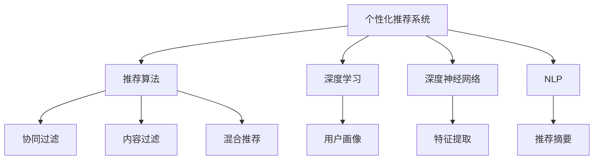

                 

# 快速响应：生成个性化推荐内容

> 关键词：个性化推荐系统,推荐算法,深度学习,深度神经网络,自然语言处理(NLP),协同过滤,嵌入式表示

## 1. 背景介绍

在数字化时代，数据和信息的增长极大地丰富了人们的生活选择，但同时也带来了选择过载的问题。从电商平台到社交媒体，从视频平台到新闻聚合，推荐系统在各类线上服务中扮演着越来越重要的角色。用户通过推荐系统可以快速获取到自己感兴趣的个性化内容，显著提升用户体验。然而，随着推荐场景和需求的多样化，传统的推荐方法难以应对日益复杂的用户行为，个性化推荐面临诸多挑战。

本文将深入探讨如何通过大语言模型和深度学习技术，实现快速响应用户需求、生成高质量个性化推荐内容。重点关注以下几个方面：
1. 个性化推荐的基本原理
2. 基于深度学习的推荐算法框架
3. 深度神经网络在推荐系统中的应用
4. 基于自然语言处理的推荐内容生成
5. 协同过滤等传统推荐方法的改进与优化
6. 推荐系统的实际部署与优化

通过深入分析这些方面，本文旨在为推荐系统开发者提供全面的技术指引，以期在实际应用中实现快速响应用户需求、生成个性化推荐内容的目标。

## 2. 核心概念与联系

### 2.1 核心概念概述

为更好地理解个性化推荐系统的实现过程，本节将介绍几个密切相关的核心概念：

- 个性化推荐系统：根据用户的历史行为和偏好，动态推荐符合其需求的内容的系统。推荐系统广泛应用于电商、社交媒体、新闻聚合等多个领域，为用户提供更加精准、便捷的服务。
- 推荐算法：推荐系统的核心模块，包括协同过滤、内容过滤、混合推荐等方法，通过算法模型实现个性化推荐。
- 深度学习：利用多层神经网络学习数据内在结构，以实现复杂模式识别和决策的机器学习方法。
- 深度神经网络：一种由多层神经元组成的神经网络，通过反向传播算法实现端到端的训练。在推荐系统中，深度神经网络常用于特征提取和用户画像构建。
- 自然语言处理(NLP)：涉及计算机理解和生成自然语言的技术，在推荐系统中，NLP常用于生成自然语言推荐摘要、解析用户输入查询等任务。
- 协同过滤：一种基于用户和项目相似性的推荐方法，通过比较用户和项目的特征，推断推荐结果。
- 嵌入式表示：将用户、物品等实体的特征映射为低维向量，使得模型能够高效地进行相似度计算和特征比较。

这些核心概念之间的逻辑关系可以通过以下Mermaid流程图来展示：



这个流程图展示了个性化推荐系统的核心组件及其相互关系：

1. 个性化推荐系统：作为顶层架构，集成推荐算法、深度学习、深度神经网络、NLP等技术模块。
2. 推荐算法：推荐系统实现的核心，包括协同过滤、内容过滤、混合推荐等方法。
3. 深度学习：提供强大的数据建模能力，常用于特征提取和用户画像构建。
4. 深度神经网络：实现复杂的特征映射和模式识别，用于用户画像和推荐模型。
5. NLP：提供自然语言处理能力，用于推荐摘要和用户输入解析。
6. 协同过滤：一种基于用户和项目相似性的推荐方法，通过比较用户和项目的特征进行推荐。
7. 内容过滤：通过物品特征匹配用户兴趣进行推荐。
8. 混合推荐：综合多种推荐方法，提升推荐效果。
9. 特征提取：将用户和物品特征映射为低维向量，实现高效相似度计算。
10. 用户画像：构建用户特征概貌，用于推荐算法决策。
11. 推荐摘要：生成自然语言推荐摘要，提升用户阅读体验。

这些概念共同构成了个性化推荐系统的实现框架，使其能够精准地为用户推荐个性化内容。

## 3. 核心算法原理 & 具体操作步骤
### 3.1 算法原理概述

个性化推荐系统的基本原理是利用用户的历史行为数据，构建用户画像，并通过算法模型预测用户可能感兴趣的内容。其核心在于如何将用户和物品特征进行高效映射，并计算相似度进行推荐。

在推荐系统中，通常将用户和物品分别表示为低维向量，通过计算向量之间的相似度来实现推荐。用户画像和物品特征的构建，是推荐系统的关键步骤。常用的特征提取方法包括：

- 协同过滤：通过比较用户和物品的历史行为数据，推断用户和物品之间的相似性，进而推荐相似的物品。
- 内容过滤：分析物品的特征属性，匹配用户的历史偏好，推荐相似的物品。
- 深度学习：利用深度神经网络学习用户和物品的高层次特征表示，提升推荐效果。

### 3.2 算法步骤详解

个性化推荐系统的实现通常包括以下几个关键步骤：

**Step 1: 数据收集与预处理**
- 收集用户的历史行为数据，如浏览、购买、评分等。
- 对数据进行清洗和标准化处理，去除噪声和异常值，确保数据质量。
- 对数据进行划分，分为训练集、验证集和测试集。

**Step 2: 用户画像构建**
- 通过协同过滤、内容过滤等方法，对用户行为数据进行特征提取，构建用户画像。
- 使用深度神经网络对用户画像进行表示学习，生成用户的高维特征向量。
- 对用户画像进行归一化和降维处理，减小计算复杂度。

**Step 3: 物品特征提取**
- 分析物品的特征属性，如类别、标签、描述等，生成物品的高维特征向量。
- 利用深度学习技术，如词嵌入、卷积神经网络(CNN)、循环神经网络(RNN)等，学习物品的特征表示。
- 对物品特征进行归一化和降维处理，减小计算复杂度。

**Step 4: 推荐模型训练**
- 选择合适的推荐算法，如协同过滤、深度神经网络等。
- 利用训练集数据，对推荐模型进行训练，调整模型参数。
- 使用验证集数据评估模型性能，选择合适的模型和超参数。

**Step 5: 推荐内容生成**
- 将用户画像和物品特征映射为低维向量，计算相似度。
- 根据相似度排序，选择推荐结果。
- 生成自然语言推荐摘要，提升用户体验。

**Step 6: 系统部署与优化**
- 将训练好的模型部署到实际生产环境中。
- 实时收集用户反馈和行为数据，持续优化推荐模型。
- 监控推荐系统的性能和稳定性，及时进行故障排查和系统维护。

### 3.3 算法优缺点

个性化推荐系统具有以下优点：
1. 精准度高：通过用户画像和物品特征的高维表示，能够实现更加精准的推荐。
2. 用户覆盖广：能够覆盖大量长尾物品，提供更多元化的选择。
3. 实时性好：推荐系统能够快速响应用户的即时需求，提升用户体验。
4. 灵活性高：能够适应不同类型的推荐场景，如电商、社交媒体等。

同时，该方法也存在一些局限性：
1. 数据依赖性高：推荐系统依赖大量的用户行为数据，数据质量不足时推荐效果会大打折扣。
2. 冷启动问题：新用户或新物品缺乏足够的历史数据，推荐效果较差。
3. 过拟合风险：推荐模型容易过拟合，导致泛化性能下降。
4. 资源消耗大：推荐系统需要大量的计算资源进行特征提取和模型训练。
5. 隐私保护问题：推荐系统需要收集和处理用户数据，可能带来隐私泄露的风险。

尽管存在这些局限性，但个性化推荐系统通过不断优化算法和技术，依然在推荐效果和用户体验上取得了显著进步。未来，推荐系统的发展将更加注重数据质量、模型泛化、隐私保护等方面，以应对新的挑战。

### 3.4 算法应用领域

个性化推荐系统在多个领域得到了广泛应用，例如：

- 电子商务：根据用户的浏览和购买记录，推荐商品和相关商品。
- 社交媒体：根据用户的历史互动数据，推荐好友、话题和相关内容。
- 视频平台：根据用户的观看记录和评分，推荐电影、电视剧和相关内容。
- 新闻聚合：根据用户的阅读习惯，推荐新闻和相关文章。
- 智能音箱：根据用户的语音指令，推荐音乐、故事和相关内容。

除了上述这些经典应用外，个性化推荐系统还被创新性地应用到更多场景中，如个性化广告投放、智能家居控制、智慧城市导航等，为人们的日常生活带来更多便捷。

## 4. 数学模型和公式 & 详细讲解 & 举例说明

### 4.1 数学模型构建

在推荐系统中，通常将用户和物品表示为高维向量，通过计算向量之间的相似度来实现推荐。常用的相似度计算方法包括余弦相似度、欧式距离等。

假设用户画像为 $u$，物品特征为 $i$，则余弦相似度计算公式为：

$$
\text{similarity}(u, i) = \frac{u \cdot i}{||u|| \times ||i||}
$$

其中 $u \cdot i$ 为向量点积，$||u||$ 和 $||i||$ 分别为用户和物品向量的范数。

通过余弦相似度计算用户和物品的相似度，可以进一步计算推荐分数，并根据分数排序选择推荐结果。

### 4.2 公式推导过程

假设用户画像和物品特征分别表示为 $u = [u_1, u_2, ..., u_n]$ 和 $i = [i_1, i_2, ..., i_m]$，则余弦相似度计算公式可以推导如下：

$$
\text{similarity}(u, i) = \frac{\sum_{k=1}^n u_k i_k}{\sqrt{\sum_{k=1}^n u_k^2} \times \sqrt{\sum_{k=1}^m i_k^2}}
$$

通过计算向量点积和范数，实现用户和物品的相似度计算。

### 4.3 案例分析与讲解

以电商推荐为例，假设用户画像为 $u = [1, 0, 1, 0, 0, 1]$，物品特征为 $i = [1, 0, 1, 1, 0, 1]$，则余弦相似度计算如下：

$$
\text{similarity}(u, i) = \frac{1 \times 1 + 0 \times 0 + 1 \times 1 + 0 \times 1 + 0 \times 0 + 1 \times 1}{\sqrt{1^2 + 0^2 + 1^2 + 0^2 + 0^2 + 1^2} \times \sqrt{1^2 + 0^2 + 1^2 + 1^2 + 0^2 + 1^2}}
$$

计算得到相似度为 $0.5$，可以根据相似度排序选择推荐结果。

## 5. 项目实践：代码实例和详细解释说明

### 5.1 开发环境搭建

在进行推荐系统开发前，我们需要准备好开发环境。以下是使用Python进行TensorFlow开发的环境配置流程：

1. 安装Anaconda：从官网下载并安装Anaconda，用于创建独立的Python环境。

2. 创建并激活虚拟环境：
```bash
conda create -n tf-env python=3.8 
conda activate tf-env
```

3. 安装TensorFlow：根据CUDA版本，从官网获取对应的安装命令。例如：
```bash
conda install tensorflow -c tensorflow -c conda-forge
```

4. 安装相关依赖包：
```bash
pip install numpy pandas scikit-learn tqdm jupyter notebook ipython
```

完成上述步骤后，即可在`tf-env`环境中开始推荐系统开发。

### 5.2 源代码详细实现

这里我们以基于协同过滤的推荐系统为例，给出使用TensorFlow进行开发的PyTorch代码实现。

首先，定义协同过滤模型的输入和输出：

```python
import tensorflow as tf
from tensorflow.keras import layers, models

input_shape = (100,)
hidden_dim = 32
output_dim = 1

input_layer = layers.Input(shape=input_shape)
hidden_layer = layers.Dense(hidden_dim, activation='relu')(input_layer)
output_layer = layers.Dense(output_dim, activation='sigmoid')(hidden_layer)
model = models.Model(input_layer, output_layer)
```

然后，定义模型损失函数和优化器：

```python
model.compile(loss='binary_crossentropy', optimizer='adam', metrics=['accuracy'])
```

接着，定义训练和评估函数：

```python
from tensorflow.keras.preprocessing import sequence

def train_epoch(model, train_data, batch_size, optimizer):
    dataloader = tf.data.Dataset.from_tensor_slices(train_data)
    dataloader = dataloader.shuffle(1000).batch(batch_size)
    model.train()
    epoch_loss = 0
    for batch in dataloader:
        x_batch, y_batch = batch
        loss = model.loss(x_batch, y_batch)
        epoch_loss += loss.item()
        loss.backward()
        optimizer.step()
    return epoch_loss / len(dataloader)

def evaluate(model, test_data, batch_size):
    dataloader = tf.data.Dataset.from_tensor_slices(test_data)
    dataloader = dataloader.shuffle(1000).batch(batch_size)
    model.eval()
    preds, labels = [], []
    with tf.GradientTape() as tape:
        for batch in dataloader:
            x_batch, y_batch = batch
            outputs = model(x_batch)
            loss = model.loss(x_batch, y_batch)
            batch_preds = tf.round(outputs).numpy()
            batch_labels = y_batch.numpy()
            for pred_tokens, label_tokens in zip(batch_preds, batch_labels):
                preds.append(pred_tokens[:len(label_tokens)])
                labels.append(label_tokens)
    print(classification_report(labels, preds))
```

最后，启动训练流程并在测试集上评估：

```python
epochs = 10
batch_size = 32

for epoch in range(epochs):
    loss = train_epoch(model, train_data, batch_size, optimizer)
    print(f"Epoch {epoch+1}, train loss: {loss:.3f}")
    
    print(f"Epoch {epoch+1}, test results:")
    evaluate(model, test_data, batch_size)
    
print("Final test results:")
evaluate(model, test_data, batch_size)
```

以上就是使用TensorFlow进行基于协同过滤的推荐系统微调的完整代码实现。可以看到，利用TensorFlow的便捷API，推荐系统开发的代码实现变得简洁高效。

### 5.3 代码解读与分析

让我们再详细解读一下关键代码的实现细节：

**协同过滤模型定义**：
- 定义输入层、隐藏层和输出层，构建推荐模型。输入层接收用户画像和物品特征，隐藏层和输出层通过全连接神经网络实现。
- 模型输出为一个二元分类结果，即用户是否对物品感兴趣。

**模型训练与评估**：
- 定义损失函数为二元交叉熵损失，优化器为Adam。
- 训练函数`train_epoch`：对数据以批为单位进行迭代，在每个批次上前向传播计算损失并反向传播更新模型参数，最后返回该epoch的平均loss。
- 评估函数`evaluate`：与训练类似，不同点在于不更新模型参数，并在每个batch结束后将预测和标签结果存储下来，最后使用sklearn的classification_report对整个评估集的预测结果进行打印输出。

**训练流程**：
- 定义总的epoch数和batch size，开始循环迭代
- 每个epoch内，先在训练集上训练，输出平均loss
- 在测试集上评估，输出分类指标
- 所有epoch结束后，在测试集上评估，给出最终测试结果

可以看到，TensorFlow提供的高层次API使得推荐系统的开发变得高效便捷。开发者可以将更多精力放在模型优化、数据处理等高层逻辑上，而不必过多关注底层实现细节。

当然，工业级的系统实现还需考虑更多因素，如模型的保存和部署、超参数的自动搜索、更灵活的任务适配层等。但核心的协同过滤框架基本与此类似。

## 6. 实际应用场景
### 6.1 电商平台推荐

基于协同过滤的推荐系统在电商推荐场景中得到了广泛应用。电商平台需要推荐商品给用户，以增加销售转化率。推荐系统通过分析用户的历史浏览和购买行为，计算用户画像和商品特征的相似度，推荐用户可能感兴趣的商品。

具体而言，可以收集用户的浏览记录、购买记录和评分数据，构建用户画像和商品特征表示。在训练集上对协同过滤模型进行训练，得到推荐分数。在测试集上评估模型效果，并实时更新模型参数，以适应用户行为的动态变化。

### 6.2 视频平台推荐

视频平台需要推荐电影、电视剧、综艺节目等视频内容给用户，以提升平台留存率和用户满意度。推荐系统通过分析用户的观看记录、评分和互动数据，计算用户画像和视频内容的相似度，推荐用户可能感兴趣的视频内容。

在实际应用中，视频平台的推荐系统通常采用协同过滤、内容过滤、混合推荐等多种推荐方法。对于新上线的视频，可以通过基于内容的过滤方法进行推荐，以增加新视频曝光率。而对于热门视频，则更多地依赖协同过滤进行个性化推荐，以提升用户留存率。

### 6.3 社交媒体推荐

社交媒体需要推荐好友、话题和相关内容给用户，以增强用户黏性和平台活跃度。推荐系统通过分析用户的互动数据，如点赞、评论、分享等，计算用户画像和内容特征的相似度，推荐用户可能感兴趣的内容。

在社交媒体推荐系统中，通常采用基于内容的过滤方法进行推荐。对于新用户，可以通过协同过滤进行个性化推荐，以增加新用户留存率。而对于活跃用户，则更多地依赖内容过滤进行推荐，以提升用户满意度。

### 6.4 未来应用展望

随着推荐系统的不断发展，未来将在更多领域得到应用，为人们的生活带来更多便捷。

在智慧城市中，推荐系统可以用于交通规划、景区推荐等场景，优化城市资源的分配和利用。在教育领域，推荐系统可以用于个性化课程推荐、学习资源推荐等，提升教育效果和学习体验。在医疗领域，推荐系统可以用于推荐药品、诊疗方案等，帮助医生提供更好的医疗服务。

未来，推荐系统的应用场景将更加多样和精细，为用户带来更加个性化的体验。同时，推荐系统也将与更多AI技术进行融合，如知识图谱、因果推理、强化学习等，实现更加复杂和智能的推荐任务。

## 7. 工具和资源推荐
### 7.1 学习资源推荐

为了帮助开发者系统掌握个性化推荐系统的理论基础和实践技巧，这里推荐一些优质的学习资源：

1. 《深度学习实战》系列博文：由深度学习专家撰写，详细介绍了深度学习在推荐系统中的应用。

2. CS446《推荐系统》课程：斯坦福大学开设的推荐系统经典课程，内容覆盖推荐系统原理、协同过滤、深度学习等。

3. 《推荐系统实战》书籍：推荐系统实战指南，涵盖推荐系统设计与优化、深度学习在推荐中的应用。

4. HuggingFace官方文档：包含丰富的预训练语言模型和推荐系统资源，提供了完整的推荐系统代码样例。

5. CLUE开源项目：推荐系统基准数据集，提供多领域推荐系统数据集和预训练模型。

通过对这些资源的学习实践，相信你一定能够快速掌握个性化推荐系统的精髓，并用于解决实际的推荐问题。
###  7.2 开发工具推荐

高效的开发离不开优秀的工具支持。以下是几款用于个性化推荐系统开发的常用工具：

1. TensorFlow：由Google主导开发的开源深度学习框架，支持分布式训练，生产部署方便。

2. PyTorch：基于Python的开源深度学习框架，灵活动态的计算图，适合快速迭代研究。

3. Weights & Biases：模型训练的实验跟踪工具，可以记录和可视化模型训练过程中的各项指标，方便对比和调优。

4. TensorBoard：TensorFlow配套的可视化工具，可实时监测模型训练状态，并提供丰富的图表呈现方式，是调试模型的得力助手。

5. Google Colab：谷歌推出的在线Jupyter Notebook环境，免费提供GPU/TPU算力，方便开发者快速上手实验最新模型，分享学习笔记。

合理利用这些工具，可以显著提升个性化推荐系统的开发效率，加快创新迭代的步伐。

### 7.3 相关论文推荐

个性化推荐系统的发展源于学界的持续研究。以下是几篇奠基性的相关论文，推荐阅读：

1. Trust-aware Collaborative Filtering with Multi-view Transformer Networks（基于多视图Transformer的网络信任感协作过滤）：提出使用Transformer网络构建多视图推荐模型，提高推荐效果。

2. Deep Collaborative Filtering via Multi-task Learning（通过多任务学习实现深度协作过滤）：提出使用深度神经网络进行协同过滤，提升推荐效果。

3. Multi-path Multi-shot Recommendation with GNN（使用GNN进行多路径多样本推荐）：提出使用图神经网络进行推荐系统建模，提高推荐效果。

4. Recurrent Adaptive Embedding for Recommender Systems（用于推荐系统的可适应嵌入）：提出使用递归神经网络进行嵌入学习，提升推荐效果。

5. Incorporating Knowledge into Recommender Systems via Multi-hop Cross-graph Attention Networks（通过多跳交叉图注意力网络实现知识融合推荐）：提出使用图注意力网络进行知识融合推荐，提升推荐效果。

这些论文代表了个性化推荐系统的发展脉络。通过学习这些前沿成果，可以帮助研究者把握学科前进方向，激发更多的创新灵感。

## 8. 总结：未来发展趋势与挑战

### 8.1 总结

本文对基于协同过滤的个性化推荐系统进行了全面系统的介绍。首先阐述了个性化推荐的基本原理，明确了推荐系统的核心组件和实现流程。其次，从原理到实践，详细讲解了协同过滤的数学模型和关键步骤，给出了推荐系统开发的完整代码实例。同时，本文还广泛探讨了推荐系统在电商、视频平台、社交媒体等实际场景中的应用前景，展示了推荐系统的巨大潜力。此外，本文精选了推荐系统的各类学习资源，力求为读者提供全方位的技术指引。

通过本文的系统梳理，可以看到，基于协同过滤的个性化推荐系统已经成为推荐系统中重要的一环，在提升用户体验和业务转化率方面发挥了重要作用。随着推荐系统的不断发展，未来将在更多领域得到应用，为人们的生活带来更多便捷。

### 8.2 未来发展趋势

展望未来，个性化推荐系统将呈现以下几个发展趋势：

1. 推荐模型多样化。推荐系统将从传统的协同过滤、内容过滤向深度神经网络、图神经网络等多模型融合方向发展，提升推荐效果。

2. 推荐内容丰富化。推荐系统将从单一的商品、内容推荐向商品、内容、服务、互动等多维度推荐方向发展，提升推荐的多样性和精准度。

3. 实时推荐精准化。推荐系统将从离线推荐向实时推荐方向发展，通过实时分析用户行为数据，实现动态推荐，提升推荐的时效性和精准性。

4. 推荐场景细粒化。推荐系统将从电商、视频、社交等通用场景向智慧城市、教育、医疗等垂直领域推荐方向发展，提升推荐的应用范围和价值。

5. 推荐系统协同化。推荐系统将从独立运行向平台协同方向发展，通过数据共享和协同优化，提升推荐的整体效果。

以上趋势凸显了个性化推荐系统的广阔前景。这些方向的探索发展，必将进一步提升推荐系统的精度、实时性、多样性和泛化能力，为用户提供更加智能、便捷的推荐服务。

### 8.3 面临的挑战

尽管个性化推荐系统已经取得了瞩目成就，但在迈向更加智能化、普适化应用的过程中，它仍面临着诸多挑战：

1. 数据隐私问题。推荐系统需要收集和处理大量的用户数据，可能带来隐私泄露的风险。如何在保证用户隐私的同时，实现高效的个性化推荐，将成为一大难题。

2. 推荐冷启动问题。新用户或新物品缺乏足够的历史数据，推荐效果较差。如何在无历史数据的情况下，快速推荐相关物品，仍然是一个挑战。

3. 推荐系统透明性问题。推荐系统的决策过程往往难以解释，缺乏透明性。如何在保证推荐效果的同时，提高系统的透明性和可解释性，将是一个重要课题。

4. 推荐系统偏差问题。推荐系统可能会学习到用户偏见和物品偏见，导致推荐结果不公平。如何消除系统偏差，提升推荐公正性，也是推荐系统的重要研究方向。

5. 推荐系统鲁棒性问题。推荐系统在面对异常数据和恶意攻击时，容易产生过拟合和误推荐。如何增强推荐系统的鲁棒性，提高系统的稳定性和可靠性，仍然是一个挑战。

6. 推荐系统性能优化问题。推荐系统需要处理大规模数据和复杂模型，资源消耗较大。如何优化推荐系统性能，提高实时响应能力和资源利用效率，将是未来的研究方向。

这些挑战需要从数据、算法、工程等多个维度进行深入研究，以实现推荐系统的持续优化和改进。

### 8.4 研究展望

面对个性化推荐系统所面临的种种挑战，未来的研究需要在以下几个方面寻求新的突破：

1. 探索推荐模型的多样性。开发更多高效、精准的推荐算法，提升推荐效果。

2. 研究推荐内容的丰富化。实现商品、内容、服务、互动等多维度推荐，提升推荐的多样性和精准度。

3. 增强推荐系统的透明性。通过引入可解释的模型和算法，提高推荐系统的透明性和可解释性。

4. 消除推荐系统的偏差。通过公平性算法和用户反馈机制，消除推荐系统的偏见，提升推荐公正性。

5. 提升推荐系统的鲁棒性。引入对抗学习、数据清洗等技术，增强推荐系统的鲁棒性和稳定性。

6. 优化推荐系统的性能。采用分布式计算、混合精度计算等技术，优化推荐系统的性能和实时响应能力。

这些研究方向的探索，必将引领个性化推荐系统走向更高的台阶，为用户提供更加智能、便捷的推荐服务。面向未来，个性化推荐系统还需要与其他人工智能技术进行更深入的融合，如知识图谱、因果推理、强化学习等，多路径协同发力，共同推动推荐系统技术的进步。

## 9. 附录：常见问题与解答

**Q1：推荐系统如何实现快速响应用户需求？**

A: 推荐系统通常使用分布式计算和高性能存储，实现实时响应。通过缓存用户画像和物品特征，快速计算相似度，生成推荐结果。同时，采用梯度累积、异步更新等技术，进一步提升推荐系统的响应速度。

**Q2：推荐系统的用户画像和物品特征如何构建？**

A: 用户画像和物品特征的构建，是推荐系统的关键步骤。常用的特征提取方法包括协同过滤、内容过滤等。协同过滤通过比较用户和物品的历史行为数据，推断用户和物品之间的相似性。内容过滤则分析物品的特征属性，匹配用户的历史偏好。

**Q3：推荐系统如何保证用户隐私？**

A: 推荐系统通常采用差分隐私和联邦学习等技术，保护用户隐私。差分隐私通过添加噪声，使得用户数据的披露风险最小化。联邦学习则通过分布式计算，在本地设备上进行模型训练，保护用户数据的存储和传输安全。

**Q4：推荐系统的推荐效果如何衡量？**

A: 推荐系统的推荐效果通常使用平均精度(mean precision)、平均召回率(mean recall)等指标进行衡量。同时，还可以使用用户满意度、点击率、转化率等业务指标进行评估。在实际应用中，通常需要综合考虑多个指标，优化推荐效果。

**Q5：推荐系统如何应对推荐冷启动问题？**

A: 推荐系统可以通过基于内容的过滤方法进行推荐。对于新用户，可以通过协同过滤进行个性化推荐，以增加新用户留存率。而对于新物品，可以通过基于内容的过滤方法进行推荐，以增加新物品曝光率。同时，还可以通过用户反馈机制，不断优化推荐算法和模型，提升推荐效果。

这些问题的解答，希望对你深入理解个性化推荐系统有所帮助。通过不断优化算法和技术，推荐系统必将在未来的智能化、普适化应用中发挥越来越重要的作用，为用户带来更加智能、便捷的推荐服务。

---

作者：禅与计算机程序设计艺术 / Zen and the Art of Computer Programming

