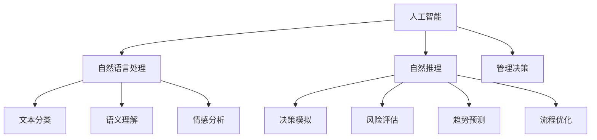

                 

# 思维能力对管理决策的影响

## 1. 背景介绍

### 1.1 问题由来
在当今快速变化的商业环境中，管理决策的速度和质量变得至关重要。面对日益复杂多变的市场环境和多变的客户需求，企业必须迅速做出科学合理的决策，才能保持竞争优势。管理决策的优劣，直接关系到一个企业的兴衰成败。

然而，传统的数据驱动决策方法在处理高度不确定性和复杂性方面存在不足，决策者往往依赖直觉和经验，缺乏系统性和全面性的分析。近年来，随着人工智能和大数据分析技术的兴起，人们开始探索如何通过科学的方法提升管理决策的准确性和速度。

### 1.2 问题核心关键点
如何通过科学的思维能力提升管理决策，成为当前企业管理研究的热点问题。核心在于如何融合人类直觉与数据驱动，让数据不仅在统计分析层面发挥作用，更在思维推理、决策模拟、因果推断等方面提供支撑。

为此，本文将探讨如何通过引入人工智能技术，特别是基于自然语言处理的自然推理能力，来辅助管理决策。具体而言，本文将介绍一种结合自然语言处理与人工智能的自然推理技术，并阐述其在管理决策中的应用，如风险评估、趋势预测、流程优化等。

## 2. 核心概念与联系

### 2.1 核心概念概述

为更好地理解人工智能技术在提升管理决策中的应用，本节将介绍几个密切相关的核心概念：

- 人工智能（Artificial Intelligence, AI）：指通过计算机模拟人类智能行为的技术，包括感知、学习、推理等能力。人工智能在管理决策中的应用，可以帮助企业从海量数据中提取有价值的洞见，辅助决策者进行科学分析。

- 自然语言处理（Natural Language Processing, NLP）：指通过计算机处理和理解人类语言的技术，包括文本分类、语义理解、情感分析等。自然语言处理技术使得机器能够理解和管理自然语言数据，有助于提升决策的智能化水平。

- 自然推理（Natural Reasoning）：指基于自然语言处理和机器学习技术，对语言数据进行深度推理和分析，以辅助决策者理解和判断复杂情境下的决策问题。自然推理技术可以弥补数据分析的局限性，提供更为全面的决策支持。

- 管理决策（Management Decision）：指在企业运营过程中，管理者根据企业目标和环境条件，选择最佳方案的过程。管理决策的正确性直接影响企业的战略规划、运营效率、市场竞争力等。

- 数据驱动决策（Data-Driven Decision Making）：指通过收集和分析数据，辅助决策者制定和优化决策方案的方法。数据驱动决策方法可以提高决策的客观性和准确性，但数据质量和分析深度对决策效果有着重要影响。

这些核心概念之间的逻辑关系可以通过以下Mermaid流程图来展示：



这个流程图展示的核心概念及其之间的关系：

1. 人工智能通过各种技术手段模拟人类智能，包括自然语言处理。
2. 自然语言处理可以对文本数据进行分类、理解、情感分析等。
3. 自然推理结合人工智能和自然语言处理，对复杂情境进行深度分析。
4. 管理决策是企业运营中的核心活动，需要数据和推理的支撑。
5. 数据驱动决策需要高质量的数据和分析工具，自然推理可以提供更深入的洞察。

这些概念共同构成了人工智能技术提升管理决策的理论框架，为实现更科学、高效的决策提供了基础。

## 3. 核心算法原理 & 具体操作步骤
### 3.1 算法原理概述

自然推理辅助管理决策的核心算法主要包括以下几个部分：

- 文本分类（Text Classification）：通过自然语言处理技术，将自然语言数据分为不同的类别，如正面评论、负面评论、情感等。
- 语义理解（Semantic Understanding）：理解文本中的实体、关系、事件等语义信息，辅助决策者更好地理解数据。
- 情感分析（Sentiment Analysis）：识别文本中的情感倾向，辅助判断客户满意度和市场情绪。
- 决策模拟（Decision Simulation）：通过机器学习模型，模拟不同决策路径和结果，评估决策影响。
- 风险评估（Risk Assessment）：预测决策可能带来的风险，提供风险控制方案。
- 趋势预测（Trend Prediction）：基于历史数据和当前情境，预测未来趋势，指导决策。
- 流程优化（Process Optimization）：通过数据分析和模型优化，提升业务流程效率。

自然推理辅助管理决策的总体流程如图3所示。


### 3.2 算法步骤详解

自然推理辅助管理决策的完整流程包括以下几个关键步骤：

**Step 1: 数据收集与预处理**
- 收集企业内外部相关的自然语言数据，包括客户反馈、市场报道、社交媒体等。
- 对数据进行清洗和标准化处理，去除噪音和冗余信息，确保数据质量。

**Step 2: 自然语言处理**
- 使用自然语言处理技术，如分词、词性标注、实体识别等，对文本数据进行结构化处理。
- 提取关键词、关键句等重要信息，生成结构化数据。

**Step 3: 特征提取**
- 对结构化数据进行特征提取，如TF-IDF、Word2Vec等。
- 将文本数据转化为数值向量，便于后续模型处理。

**Step 4: 推理计算**
- 使用机器学习模型进行自然推理，如基于规则的推理、基于深度学习的推理等。
- 通过逻辑推理和概率推理，分析数据中的因果关系和逻辑结构。

**Step 5: 决策支持**
- 根据推理结果，生成决策建议或方案。
- 对决策方案进行模拟和评估，预测决策影响。

**Step 6: 执行与反馈**
- 根据决策建议，制定和执行决策方案。
- 对决策效果进行实时监控和反馈，优化决策模型。

### 3.3 算法优缺点

自然推理辅助管理决策具有以下优点：
1. 数据驱动：利用大数据和自然语言处理技术，提供丰富的数据支撑，提升决策的客观性和准确性。
2. 多维度分析：结合文本分类、语义理解、情感分析等多维度的分析，全面理解数据。
3. 动态优化：通过实时监控和反馈机制，动态优化决策模型，适应快速变化的环境。
4. 泛化性强：自然推理模型可以应用于多种情境和任务，具有较强的泛化能力。

同时，该方法也存在一定的局限性：
1. 数据质量依赖：自然推理依赖高质量的数据和标注，如果数据存在噪音或标注不准确，将影响结果。
2. 计算资源消耗：自然推理涉及复杂的推理计算，对计算资源和处理时间有一定要求。
3. 决策者依赖：自然推理模型的建议仅供参考，最终决策仍需依赖决策者的主观判断。
4. 模型复杂性：自然推理模型通常较为复杂，需要较高的技术水平才能搭建和优化。

尽管存在这些局限性，但就目前而言，自然推理方法仍是提升管理决策的重要手段之一。未来相关研究的重点在于如何进一步降低计算成本，提高模型效率，同时兼顾可解释性和鲁棒性等因素。

### 3.4 算法应用领域

自然推理辅助管理决策的方法已经在多个领域得到应用，例如：

- 客户关系管理（CRM）：通过分析客户反馈和情感分析，优化客户体验和满意度。
- 市场营销（Marketing）：利用市场趋势预测和情感分析，指导广告投放和产品策略。
- 风险管理（Risk Management）：通过风险评估和决策模拟，识别和控制企业运营中的潜在风险。
- 运营优化（Operational Optimization）：通过流程优化和决策模拟，提升企业运营效率和资源利用率。
- 投资决策（Investment Decisions）：通过数据分析和趋势预测，辅助企业做出明智的投资决策。

此外，自然推理技术还可以应用于财务分析、人力资源管理、供应链管理等多个领域，为企业的管理决策提供全面的数据和分析支持。

## 4. 数学模型和公式 & 详细讲解  
### 4.1 数学模型构建

本节将使用数学语言对自然推理辅助管理决策的算法过程进行更加严格的刻画。

假设企业收集到 $N$ 条自然语言数据 $D=\{(x_i, y_i)\}_{i=1}^N$，其中 $x_i$ 为文本数据，$y_i$ 为分类标签或情感倾向。

定义文本分类损失函数为：

$$
L_{\text{class}} = \frac{1}{N} \sum_{i=1}^N \ell_{\text{class}}(y_i, f(x_i))
$$

其中 $\ell_{\text{class}}$ 为分类损失函数，$f(x_i)$ 为分类模型对 $x_i$ 的预测结果。

定义语义理解损失函数为：

$$
L_{\text{sem}} = \frac{1}{N} \sum_{i=1}^N \ell_{\text{sem}}(y_i, g(x_i))
$$

其中 $\ell_{\text{sem}}$ 为语义理解损失函数，$g(x_i)$ 为语义理解模型对 $x_i$ 的输出。

定义情感分析损失函数为：

$$
L_{\text{sent}} = \frac{1}{N} \sum_{i=1}^N \ell_{\text{sent}}(y_i, h(x_i))
$$

其中 $\ell_{\text{sent}}$ 为情感分析损失函数，$h(x_i)$ 为情感分析模型对 $x_i$ 的预测结果。

定义风险评估损失函数为：

$$
L_{\text{risk}} = \frac{1}{N} \sum_{i=1}^N \ell_{\text{risk}}(y_i, k(x_i))
$$

其中 $\ell_{\text{risk}}$ 为风险评估损失函数，$k(x_i)$ 为风险评估模型对 $x_i$ 的输出。

定义趋势预测损失函数为：

$$
L_{\text{trend}} = \frac{1}{N} \sum_{i=1}^N \ell_{\text{trend}}(y_i, m(x_i))
$$

其中 $\ell_{\text{trend}}$ 为趋势预测损失函数，$m(x_i)$ 为趋势预测模型对 $x_i$ 的预测结果。

定义流程优化损失函数为：

$$
L_{\text{proc}} = \frac{1}{N} \sum_{i=1}^N \ell_{\text{proc}}(y_i, n(x_i))
$$

其中 $\ell_{\text{proc}}$ 为流程优化损失函数，$n(x_i)$ 为流程优化模型对 $x_i$ 的输出。

### 4.2 公式推导过程

以文本分类为例，推导分类损失函数及其梯度的计算公式。

假设分类模型 $f(x_i)$ 为线性分类器或深度神经网络模型，其中 $\theta$ 为模型参数。分类损失函数为交叉熵损失函数：

$$
\ell_{\text{class}}(y_i, f(x_i)) = -y_i\log f(x_i) - (1-y_i)\log (1-f(x_i))
$$

将分类损失函数代入经验风险公式，得：

$$
L_{\text{class}} = -\frac{1}{N}\sum_{i=1}^N [y_i\log f(x_i)+(1-y_i)\log(1-f(x_i))]
$$

根据链式法则，损失函数对参数 $\theta_k$ 的梯度为：

$$
\frac{\partial L_{\text{class}}}{\partial \theta_k} = -\frac{1}{N}\sum_{i=1}^N (\frac{y_i}{f(x_i)}-\frac{1-y_i}{1-f(x_i)}) \frac{\partial f(x_i)}{\partial \theta_k}
$$

其中 $\frac{\partial f(x_i)}{\partial \theta_k}$ 可进一步递归展开，利用自动微分技术完成计算。

在得到损失函数的梯度后，即可带入参数更新公式，完成模型的迭代优化。重复上述过程直至收敛，最终得到适应自然语言数据的分类模型参数 $\theta^*$。

## 5. 项目实践：代码实例和详细解释说明
### 5.1 开发环境搭建

在进行自然推理实践前，我们需要准备好开发环境。以下是使用Python进行TensorFlow开发的环境配置流程：

1. 安装Anaconda：从官网下载并安装Anaconda，用于创建独立的Python环境。

2. 创建并激活虚拟环境：
```bash
conda create -n tensorflow-env python=3.8 
conda activate tensorflow-env
```

3. 安装TensorFlow：根据CUDA版本，从官网获取对应的安装命令。例如：
```bash
conda install tensorflow -c tensorflow -c conda-forge
```

4. 安装各类工具包：
```bash
pip install numpy pandas scikit-learn matplotlib tqdm jupyter notebook ipython
```

完成上述步骤后，即可在`tensorflow-env`环境中开始自然推理实践。

### 5.2 源代码详细实现

下面我们以客户关系管理（CRM）中的情感分析为例，给出使用TensorFlow进行自然推理的PyTorch代码实现。

首先，定义情感分析任务的数据处理函数：

```python
import tensorflow as tf
from tensorflow.keras.preprocessing.text import Tokenizer
from tensorflow.keras.preprocessing.sequence import pad_sequences
import numpy as np

# 定义文本数据集
texts = ["I am very happy with this product.",
         "This product is very bad.",
         "The service was terrible."]
labels = [1, 0, 1]

# 文本编码
tokenizer = Tokenizer(num_words=10000, oov_token='<OOV>')
tokenizer.fit_on_texts(texts)
sequences = tokenizer.texts_to_sequences(texts)
padded_sequences = pad_sequences(sequences, maxlen=30, padding='post')

# 定义标签
labels = np.array(labels)
```

然后，定义模型和优化器：

```python
from tensorflow.keras.layers import Embedding, LSTM, Dense
from tensorflow.keras.models import Sequential
from tensorflow.keras.optimizers import Adam

# 定义模型结构
model = Sequential()
model.add(Embedding(input_dim=10000, output_dim=128, input_length=30))
model.add(LSTM(units=64, dropout=0.2, recurrent_dropout=0.2))
model.add(Dense(units=1, activation='sigmoid'))

# 定义损失函数和优化器
loss_function = tf.keras.losses.BinaryCrossentropy()
optimizer = Adam(learning_rate=0.001)
```

接着，定义训练和评估函数：

```python
# 定义训练函数
def train_model(model, train_data, validation_data, epochs=5, batch_size=32):
    model.compile(loss=loss_function, optimizer=optimizer, metrics=['accuracy'])
    model.fit(train_data, validation_data, epochs=epochs, batch_size=batch_size)

# 定义评估函数
def evaluate_model(model, test_data):
    loss, accuracy = model.evaluate(test_data)
    print('Test Loss:', loss)
    print('Test Accuracy:', accuracy)
```

最后，启动训练流程并在测试集上评估：

```python
# 定义训练集和测试集
train_data = (padded_sequences, labels)
test_data = (padded_sequences, labels)

# 训练模型
train_model(model, train_data, validation_data=None)

# 评估模型
evaluate_model(model, test_data)
```

以上就是使用TensorFlow进行情感分析的自然推理实践的完整代码实现。可以看到，TensorFlow通过Keras框架，使得自然推理模型的构建和训练变得简洁高效。

### 5.3 代码解读与分析

让我们再详细解读一下关键代码的实现细节：

**文本编码与预处理**：
- 使用Keras的Tokenizer将文本转化为序列数据，并对其进行填充和截断处理。
- 通过设置词汇表大小、填充方式等参数，控制文本编码的结果。

**模型构建**：
- 定义一个简单的神经网络模型，包括嵌入层、LSTM层和全连接层。
- 嵌入层将文本转化为词向量，LSTM层处理序列信息，全连接层输出预测结果。

**损失函数和优化器**：
- 定义二分类交叉熵损失函数，适合二分类任务。
- 使用Adam优化器，适合处理梯度不稳定的问题。

**训练与评估**：
- 使用fit方法进行模型训练，设置训练轮数和批量大小。
- 使用evaluate方法评估模型在测试集上的性能，打印输出损失和准确率。

可以看到，通过TensorFlow和Keras，自然推理模型可以很方便地构建、训练和评估，降低了自然语言处理技术在实际应用中的门槛。

## 6. 实际应用场景
### 6.1 智能客服系统

基于自然推理的智能客服系统，可以为用户提供更准确、更个性化的服务。自然推理模型可以分析客户输入的自然语言，理解其意图，匹配最佳解决方案，并给出合理的建议。

在技术实现上，可以将客户问题输入自然推理模型，模型通过文本分类、情感分析等技术，将问题分类为常见问题、复杂问题等，并推荐相应的解决方案或转接人工客服。自然推理模型可以持续学习客户反馈和历史案例，不断提升其理解能力和推荐精度。

### 6.2 市场营销

自然推理技术可以应用于市场营销领域，辅助企业制定更加精准的广告策略和产品推广方案。通过分析市场评论、社交媒体等自然语言数据，自然推理模型可以识别出消费者对产品、品牌的情感倾向和偏好，提供更详细的市场洞察。

具体而言，企业可以收集市场评论和社交媒体数据，使用自然推理模型进行情感分析、主题分析等，从而识别出热门话题和市场趋势。根据分析结果，企业可以制定更精准的广告投放策略和产品推广方案，提升营销效果。

### 6.3 风险管理

自然推理技术可以用于金融、保险等领域的风险管理。通过分析客户申请资料、市场报告等自然语言数据，自然推理模型可以识别出潜在的风险因素，评估客户的信用等级和市场风险，从而制定更加科学的风险控制策略。

在具体实现中，企业可以收集客户申请资料和市场报告，使用自然推理模型进行文本分类、情感分析等，提取关键信息，识别出潜在的风险因素。根据分析结果，企业可以制定更加精准的信用评估和风险控制策略，降低金融风险。

### 6.4 未来应用展望

随着自然推理技术的不断进步，其在管理决策中的应用前景将更加广阔。未来，自然推理技术有望在更多领域得到应用，为企业的管理决策提供更全面、更准确的支撑。

1. 智能制造：自然推理技术可以应用于制造业的智能生产、质量控制等环节，提升生产效率和产品质量。
2. 智慧医疗：自然推理技术可以应用于医疗领域的病历分析、诊断推理等环节，提升医疗服务的质量和效率。
3. 智能交通：自然推理技术可以应用于交通领域的智能调度、事故预测等环节，提升交通系统的安全性和效率。
4. 智能安防：自然推理技术可以应用于安防领域的智能监控、行为识别等环节，提升公共安全水平。
5. 智能教育：自然推理技术可以应用于教育领域的智能辅助教学、学习分析等环节，提升教育效果和学习效率。

自然推理技术在更多领域的应用将为各行各业带来新的变革，推动人工智能技术的全面落地。

## 7. 工具和资源推荐
### 7.1 学习资源推荐

为了帮助开发者系统掌握自然推理技术，这里推荐一些优质的学习资源：

1. 《深度学习与自然语言处理》课程：斯坦福大学开设的深度学习课程，涵盖自然语言处理的基础知识和最新进展，是学习自然推理技术的绝佳选择。
2. TensorFlow官方文档：TensorFlow的官方文档提供了丰富的自然推理模型实现和教程，适合初学者和进阶者学习。
3. 《自然语言处理入门》书籍：本书从基础语法和词法分析入手，逐步深入到句法分析、语义理解等高级主题，适合初学者入门。
4. arXiv上的自然推理论文：arXiv是计算机科学领域的预印本仓库，可以找到大量关于自然推理的最新研究成果，激发灵感。

通过对这些资源的学习实践，相信你一定能够快速掌握自然推理技术的精髓，并用于解决实际的NLP问题。

### 7.2 开发工具推荐

高效的开发离不开优秀的工具支持。以下是几款用于自然推理开发的常用工具：

1. TensorFlow：基于Google的深度学习框架，支持分布式计算，适合大规模自然推理任务。
2. PyTorch：基于Python的深度学习框架，灵活动态的计算图，适合快速迭代研究。
3. HuggingFace Transformers：自然语言处理领域的顶级库，集成了多种预训练模型，方便微调和部署。
4. TensorBoard：TensorFlow配套的可视化工具，可实时监测模型训练状态，提供丰富的图表呈现方式。
5. Weights & Biases：模型训练的实验跟踪工具，可以记录和可视化模型训练过程中的各项指标，方便对比和调优。

合理利用这些工具，可以显著提升自然推理模型的开发效率，加快创新迭代的步伐。

### 7.3 相关论文推荐

自然推理技术的发展源于学界的持续研究。以下是几篇奠基性的相关论文，推荐阅读：

1. Attention is All You Need（即Transformer原论文）：提出了Transformer结构，开启了自然语言处理的预训练大模型时代。
2. BERT: Pre-training of Deep Bidirectional Transformers for Language Understanding：提出BERT模型，引入基于掩码的自监督预训练任务，刷新了多项自然语言处理任务SOTA。
3. Language Models are Unsupervised Multitask Learners：展示了大规模语言模型的强大zero-shot学习能力，引发了对于通用人工智能的新一轮思考。
4. Attention-based Reasoning over Natural Language：提出基于注意力机制的推理框架，用于处理自然语言中的推理问题。
5. Natural Language Reasoning with Pre-trained Models：使用预训练模型进行自然语言推理，取得显著效果。

这些论文代表了大语言模型微调技术的发展脉络。通过学习这些前沿成果，可以帮助研究者把握学科前进方向，激发更多的创新灵感。

## 8. 总结：未来发展趋势与挑战
### 8.1 总结

本文对自然推理技术辅助管理决策的方法进行了全面系统的介绍。首先阐述了自然推理技术在提升管理决策中的重要性和应用场景。其次，从原理到实践，详细讲解了自然推理模型的数学模型和关键步骤，给出了自然推理任务开发的完整代码实例。同时，本文还广泛探讨了自然推理技术在智能客服、市场营销、风险管理等多个行业领域的应用前景，展示了自然推理范式的巨大潜力。此外，本文精选了自然推理技术的各类学习资源，力求为读者提供全方位的技术指引。

通过本文的系统梳理，可以看到，自然推理技术辅助管理决策的方法在提升决策智能化、精准化方面具有重要价值。自然推理技术能够充分利用大数据和人工智能的优势，弥补传统决策方法的不足，为企业管理决策提供更全面、更准确的支撑。未来，随着自然推理技术的不断发展，其在更多领域的应用将更加广泛，为人工智能技术在企业运营中的应用注入新的活力。

### 8.2 未来发展趋势

展望未来，自然推理技术将呈现以下几个发展趋势：

1. 多模态自然推理：自然推理技术将从单一文本数据拓展到多模态数据，结合图像、语音、视频等信息，提升推理能力和决策精度。
2. 跨领域应用：自然推理技术将从自然语言处理领域拓展到更多领域，如智能制造、智慧医疗等，提供全面的决策支持。
3. 实时推理：自然推理技术将从离线推理拓展到实时推理，支持快速响应和决策，适应快速变化的环境。
4. 可解释性增强：自然推理技术将更加注重输出结果的可解释性，增强决策的透明度和可信度。
5. 模型压缩与优化：自然推理模型将更加注重资源优化，通过模型压缩和加速技术，提升推理速度和计算效率。

以上趋势凸显了自然推理技术的广阔前景。这些方向的探索发展，必将进一步提升自然推理模型的性能和应用范围，为人工智能技术在企业运营中的应用提供更全面的支撑。

### 8.3 面临的挑战

尽管自然推理技术在提升管理决策方面已取得一定进展，但在迈向更加智能化、普适化应用的过程中，仍面临诸多挑战：

1. 数据质量和标注成本：高质量的数据和标注数据是自然推理技术的核心，数据不足或标注不准确将影响模型效果。如何降低数据标注成本，提高数据质量，仍是一个难题。
2. 模型复杂性和可解释性：自然推理模型通常较为复杂，模型的可解释性和鲁棒性仍需进一步提升。如何设计更简单、更可解释的自然推理模型，成为重要的研究方向。
3. 多模态融合：多模态数据的融合和处理是自然推理技术面临的另一个挑战。如何高效地整合不同模态的数据，提升模型的综合推理能力，仍需深入研究。
4. 实时推理性能：实时推理需要高效的算法和硬件支持，如何提升推理速度和计算效率，仍是技术难点。
5. 伦理和安全问题：自然推理模型可能涉及隐私和伦理问题，如何保护用户隐私，避免有害信息传播，仍需进一步探索。

### 8.4 研究展望

面对自然推理技术面临的挑战，未来的研究需要在以下几个方面寻求新的突破：

1. 数据增强和生成：通过数据增强和生成技术，扩充训练数据集，提高模型的泛化能力。
2. 轻量级推理模型：开发更加轻量级的自然推理模型，提升推理效率和计算效率。
3. 跨模态融合：结合计算机视觉、语音识别等技术，提升自然推理模型对多模态数据的处理能力。
4. 可解释性增强：引入可解释性技术和工具，增强自然推理模型的输出解释能力。
5. 隐私保护和安全机制：建立隐私保护和安全机制，确保自然推理模型的应用安全。

这些研究方向的探索，必将引领自然推理技术迈向更高的台阶，为构建安全、可靠、可解释、可控的智能系统铺平道路。面向未来，自然推理技术还需要与其他人工智能技术进行更深入的融合，如知识表示、因果推理、强化学习等，多路径协同发力，共同推动自然语言理解和智能交互系统的进步。只有勇于创新、敢于突破，才能不断拓展自然推理模型的边界，让智能技术更好地造福人类社会。

## 9. 附录：常见问题与解答

**Q1：自然推理技术在管理决策中能否完全替代人类直觉和经验？**

A: 自然推理技术能够提供数据驱动的决策支持，弥补人类直觉和经验的不足。但决策过程中，人类直觉和经验仍然是不可或缺的。自然推理技术能够帮助决策者理解复杂的自然语言数据，但最终的决策仍需结合人类判断和经验。

**Q2：自然推理技术在实时推理中如何保证性能？**

A: 实时推理需要高效的算法和硬件支持。为了提高推理速度，可以采用以下技术手段：
1. 模型优化：使用模型剪枝、量化加速等技术，优化模型结构和计算方式。
2. 硬件加速：使用GPU、TPU等硬件设备，加速推理计算。
3. 分布式计算：将推理任务分布到多台设备上进行并行计算，提升计算效率。

**Q3：自然推理技术在多模态数据融合中如何处理不同模态数据的异构性？**

A: 自然推理技术在处理多模态数据时，需要考虑不同模态数据的异构性。可以通过以下方法处理：
1. 数据对齐：将不同模态数据进行对齐，确保数据的一致性和可比性。
2. 多模态融合：使用多模态融合技术，如注意力机制、多模态注意力等，将不同模态数据进行融合，提升综合推理能力。
3. 模型训练：使用多模态数据进行模型训练，确保模型能够处理不同模态的数据。

**Q4：自然推理技术在应用中如何保护用户隐私？**

A: 自然推理技术在应用中需要考虑用户隐私保护问题。可以采取以下措施：
1. 匿名化处理：对用户数据进行匿名化处理，保护用户隐私。
2. 数据加密：对用户数据进行加密存储和传输，防止数据泄露。
3. 隐私保护算法：使用隐私保护算法，如差分隐私、同态加密等，保护用户隐私。

**Q5：自然推理技术在实际应用中如何确保模型的可解释性？**

A: 自然推理模型需要注重输出结果的可解释性，增强决策的透明度和可信度。可以采取以下措施：
1. 可解释性技术：使用可解释性技术，如LIME、SHAP等，生成模型的解释结果。
2. 模型设计：在设计模型时，加入可解释性模块，确保模型的输出可解释。
3. 模型评估：在模型训练和评估过程中，引入可解释性评估指标，确保模型的可解释性。

这些措施将有助于提升自然推理模型的应用效果和可信度。

---

作者：禅与计算机程序设计艺术 / Zen and the Art of Computer Programming

