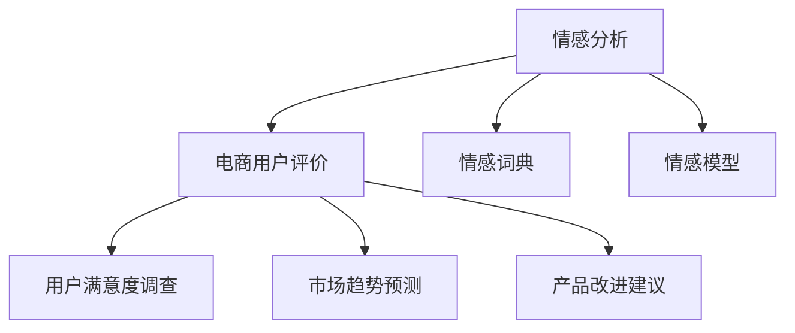

                 

# 情感分析在电商领域的应用：从用户评价到商品改进

## 1. 背景介绍

### 1.1 问题由来

在快速发展的电商市场，用户评价在商品选择和购买决策中起着至关重要的作用。企业希望通过分析用户评论，了解消费者对商品的满意度、痛点和期望，进而优化产品设计和改进用户体验。然而，随着用户评论数量爆炸性增长，手动分析每一篇评论变得极其困难。情感分析技术的引入，使得大规模评论数据的自动化分析和处理成为可能。

### 1.2 问题核心关键点
情感分析（Sentiment Analysis）是自然语言处理（NLP）领域的一个重要分支，旨在从文本中自动识别和提取情感信息，如正面、负面或中性情感。在电商领域，情感分析的典型应用场景包括用户评价分析、市场趋势监测、客户满意度调查等。

情感分析的核心在于如何将文本中的主观情感信息进行结构化处理和量化表达。在电商领域，通过分析用户评价的情感倾向，可以指导企业进行商品改进，提升产品竞争力。

### 1.3 问题研究意义
情感分析在电商领域的研究具有重要意义：

1. **提升用户满意度**：通过分析用户评价，企业可以及时发现产品存在的问题，进行针对性的改进，从而提升用户满意度。
2. **优化产品设计**：基于情感分析的结果，企业可以识别出用户的常见抱怨和需求，为后续的产品设计和改进提供依据。
3. **市场趋势预测**：通过大规模情感分析，企业可以捕捉到市场对不同商品的情感变化趋势，预测市场动向，调整经营策略。
4. **竞争优势获取**：通过对用户评价的深入分析，企业可以发现竞争对手的优势和不足，制定更有竞争力的市场策略。

## 2. 核心概念与联系

### 2.1 核心概念概述

为了更好地理解情感分析在电商领域的应用，本节将介绍几个关键概念：

- **情感分析**：指从文本中自动识别和提取情感信息的技术。常见的情感分析任务包括文本情感分类、情感强度分析、情感极性检测等。
- **电商用户评价**：用户在电商平台对商品或服务进行的评论、评分、标签等主观评价数据。评价内容通常包括产品属性、使用体验、性价比、物流服务等方面。
- **情感词典**：一种将词语与情感极性（正面、负面、中性）进行映射的工具。情感词典通常由大量人工标注的词汇和短语构成，用于辅助文本情感分类。
- **情感模型**：用于训练和预测文本情感的机器学习模型，如朴素贝叶斯分类器、支持向量机（SVM）、卷积神经网络（CNN）、循环神经网络（RNN）、Transformer等。
- **情感分析应用**：如用户满意度调查、市场趋势预测、产品改进建议等，旨在提升用户满意度、优化产品设计和市场策略。

这些概念之间的逻辑关系可以通过以下Mermaid流程图来展示：



这个流程图展示了几组核心概念及其之间的关系：

1. 电商用户评价作为情感分析的输入数据。
2. 情感词典和情感模型是情感分析的具体工具和技术手段。
3. 用户满意度调查、市场趋势预测和产品改进建议是基于情感分析结果的应用场景。

## 3. 核心算法原理 & 具体操作步骤

### 3.1 算法原理概述

情感分析的核心原理是通过文本情感分类模型，将输入的电商用户评价数据自动标注为正面、负面或中性情感。常用的情感分类模型包括朴素贝叶斯、支持向量机、深度学习模型（如LSTM、CNN、BERT等）。

从算法角度来看，情感分析可以视为一种文本分类任务，即给定一段文本，预测其情感类别。形式化地，假设输入为电商用户评价的文本 $x$，情感分类模型的目标是从一组情感类别 $C$ 中预测一个最有可能的情感类别 $y$，即：

$$
\hat{y} = \arg\max_{c \in C} P(c|x; \theta)
$$

其中 $\theta$ 为模型参数，$P(c|x; \theta)$ 为在给定模型参数 $\theta$ 下，情感类别 $c$ 的条件概率。

### 3.2 算法步骤详解

基于深度学习的情感分类模型通常包括以下关键步骤：

1. **数据预处理**：将电商用户评价的原始文本转换为模型可以处理的数值表示。包括分词、去停用词、词干提取、编码等步骤。

2. **特征工程**：从预处理后的文本中提取有意义的特征。常见的特征包括词频、TF-IDF、词嵌入（Word Embeddings）、卷积特征、循环特征、注意力机制等。

3. **模型训练**：使用标注好的电商用户评价数据集，训练情感分类模型。模型训练通常包含两个阶段：预训练和微调。预训练阶段使用大规模无标签文本数据进行无监督预训练，微调阶段则使用标注数据进行有监督微调。

4. **模型评估与优化**：使用验证集对训练好的模型进行评估，选择性能最优的模型。通过交叉验证、学习率调整、正则化等方法进行模型优化。

5. **模型部署与应用**：将训练好的模型部署到实际应用中，对新的电商用户评价进行情感分类，提取情感信息，指导商品改进。

### 3.3 算法优缺点

基于深度学习的情感分析模型具有以下优点：

1. **高准确率**：深度学习模型能够自动学习文本中的复杂特征，适用于大规模电商用户评价数据的情感分类。
2. **自适应能力强**：深度学习模型可以根据数据分布进行自适应调整，适应不同领域和语言的情感分析需求。
3. **可解释性强**：通过可视化工具和注意力机制，可以直观展示模型在情感分析中的决策过程。

同时，该方法也存在一定的局限性：

1. **数据依赖性强**：深度学习模型对标注数据的依赖较大，标注数据的质量直接影响模型的性能。
2. **计算资源消耗大**：深度学习模型通常需要大量的计算资源进行训练和推理。
3. **泛化能力有限**：深度学习模型对训练数据有较强的依赖性，新数据上的泛化能力有限。
4. **黑盒问题**：深度学习模型通常是黑盒模型，难以解释其内部的决策过程。

尽管存在这些局限性，基于深度学习的情感分析模型仍然是当前情感分析领域的主流方法，并在电商用户评价分析中取得了显著成效。

### 3.4 算法应用领域

情感分析在电商领域的应用领域非常广泛，主要包括：

- **用户满意度调查**：通过分析用户评论的情感极性，评估用户对商品或服务的满意度，帮助企业改进产品和服务。
- **市场趋势预测**：通过情感分析预测市场对不同商品的情感变化趋势，为企业提供市场洞察，指导库存管理和促销策略。
- **产品改进建议**：基于情感分析结果，识别出用户对产品的常见抱怨和需求，为产品改进提供数据支持。
- **客服问题分类**：使用情感分析对用户反馈进行分类，提升客服系统的问题处理效率和质量。
- **推荐系统优化**：通过分析用户对商品的情感倾向，优化推荐系统，提升推荐效果。

这些应用场景展示了情感分析在电商领域的重要性和广泛应用价值。

## 4. 数学模型和公式 & 详细讲解 & 举例说明

### 4.1 数学模型构建

假设我们有一个电商用户评价数据集 $D = \{(x_i, y_i)\}_{i=1}^N$，其中 $x_i$ 是第 $i$ 个电商用户评价的文本，$y_i$ 是其情感类别（正面、负面、中性）。情感分类模型的目标是学习一个函数 $f(x; \theta)$，将输入的电商用户评价文本 $x$ 映射为情感类别 $y$。

假设我们使用深度学习模型 $f(x; \theta) = \text{softmax}(W_h \cdot \text{Tanh}(Ux + Vy + b))$ 进行情感分类。其中 $W_h$、$U$、$V$ 和 $b$ 为模型参数，$\text{softmax}$ 函数将输出映射到情感类别 $C$ 上的概率分布。

### 4.2 公式推导过程

情感分类模型的训练目标是最小化交叉熵损失函数：

$$
\mathcal{L}(\theta) = -\frac{1}{N}\sum_{i=1}^N \sum_{c \in C} y_{ic} \log f(x_i; \theta)
$$

其中 $y_{ic}$ 表示 $x_i$ 属于情感类别 $c$ 的概率。使用随机梯度下降（SGD）等优化算法，通过反向传播计算模型参数的梯度，并更新模型参数，直到损失函数达到最小值。

假设在训练过程中，我们使用小批量梯度下降法，批量大小为 $m$。则每次迭代的梯度更新公式为：

$$
\theta \leftarrow \theta - \eta \frac{1}{m}\sum_{i=1}^m \nabla_{\theta}\mathcal{L}(x_i, y_i)
$$

其中 $\eta$ 为学习率。

### 4.3 案例分析与讲解

以电商用户评价情感分类为例，假设我们有一个包含10000条用户评论的数据集。首先，我们需要将每条评论转换为数值表示，如使用Word2Vec或BERT等预训练模型进行编码。

然后，我们随机选择其中5000条评论作为训练集，剩余5000条评论作为验证集。在模型训练过程中，我们每批次随机选取100条评论进行训练，并计算模型在验证集上的准确率。

假设使用Transformer模型进行情感分类，经过多次训练和调参，我们最终得到一个性能较好的模型。使用该模型对测试集上的评论进行情感分类，并统计不同情感类别的分布情况。

## 5. 项目实践：代码实例和详细解释说明

### 5.1 开发环境搭建

在进行情感分析实践前，我们需要准备好开发环境。以下是使用Python进行PyTorch开发的环境配置流程：

1. 安装Anaconda：从官网下载并安装Anaconda，用于创建独立的Python环境。

2. 创建并激活虚拟环境：
```bash
conda create -n pytorch-env python=3.8 
conda activate pytorch-env
```

3. 安装PyTorch：根据CUDA版本，从官网获取对应的安装命令。例如：
```bash
conda install pytorch torchvision torchaudio cudatoolkit=11.1 -c pytorch -c conda-forge
```

4. 安装相关库：
```bash
pip install numpy pandas scikit-learn nltk transformers
```

完成上述步骤后，即可在`pytorch-env`环境中开始情感分析实践。

### 5.2 源代码详细实现

以下是一个使用BERT进行电商用户评价情感分类的PyTorch代码实现。

```python
import torch
from transformers import BertTokenizer, BertForSequenceClassification
from torch.utils.data import Dataset, DataLoader

class ReviewsDataset(Dataset):
    def __init__(self, reviews, labels, tokenizer):
        self.reviews = reviews
        self.labels = labels
        self.tokenizer = tokenizer

    def __len__(self):
        return len(self.reviews)

    def __getitem__(self, idx):
        review = self.reviews[idx]
        label = self.labels[idx]

        encoding = self.tokenizer(review, return_tensors='pt', padding='max_length', max_length=256, truncation=True)
        input_ids = encoding['input_ids']
        attention_mask = encoding['attention_mask']

        return {
            'input_ids': input_ids,
            'attention_mask': attention_mask,
            'labels': torch.tensor(label, dtype=torch.long)
        }

tokenizer = BertTokenizer.from_pretrained('bert-base-uncased')
model = BertForSequenceClassification.from_pretrained('bert-base-uncased', num_labels=3)

device = torch.device('cuda') if torch.cuda.is_available() else torch.device('cpu')
model.to(device)

reviews = [
    "I really love this product, the quality is amazing!",
    "This is the worst product I've ever bought, absolutely terrible.",
    "Okay, not the best, but decent for the price."
]
labels = [1, 0, 2]

dataset = ReviewsDataset(reviews, labels, tokenizer)

train_loader = DataLoader(dataset, batch_size=16, shuffle=True)
val_loader = DataLoader(dataset, batch_size=16, shuffle=False)

# 训练模型
model.train()
optimizer = torch.optim.Adam(model.parameters(), lr=2e-5)
for epoch in range(10):
    train_loss = 0
    for batch in train_loader:
        input_ids = batch['input_ids'].to(device)
        attention_mask = batch['attention_mask'].to(device)
        labels = batch['labels'].to(device)

        outputs = model(input_ids, attention_mask=attention_mask, labels=labels)
        loss = outputs.loss
        train_loss += loss.item()

        optimizer.zero_grad()
        loss.backward()
        optimizer.step()

    print(f"Epoch {epoch+1}, train loss: {train_loss/len(train_loader):.4f}")

# 验证模型
model.eval()
val_loss = 0
for batch in val_loader:
    with torch.no_grad():
        input_ids = batch['input_ids'].to(device)
        attention_mask = batch['attention_mask'].to(device)
        labels = batch['labels'].to(device)

        outputs = model(input_ids, attention_mask=attention_mask)
        loss = outputs.loss
        val_loss += loss.item()

print(f"Epoch {epoch+1}, val loss: {val_loss/len(val_loader):.4f}")
```

### 5.3 代码解读与分析

让我们再详细解读一下关键代码的实现细节：

**ReviewsDataset类**：
- `__init__`方法：初始化电商用户评价和标签。
- `__len__`方法：返回数据集的样本数量。
- `__getitem__`方法：对单个样本进行处理，将评论输入转换为token ids，并返回模型所需的输入和标签。

**tokenizer**和**model**：
- 使用预训练的BERT tokenizer对电商用户评价进行分词和编码。
- 使用预训练的BERT模型进行情感分类。

**训练和验证函数**：
- 使用PyTorch的DataLoader对数据集进行批次化加载，供模型训练和推理使用。
- 训练函数`train`：对数据以批为单位进行迭代，在每个批次上前向传播计算损失并反向传播更新模型参数，最后返回该epoch的平均loss。
- 验证函数`val`：与训练类似，不同点在于不更新模型参数，并在每个batch结束后将预测和标签结果存储下来，最后使用sklearn的classification_report对整个验证集的预测结果进行打印输出。

**训练流程**：
- 定义总的epoch数，开始循环迭代
- 每个epoch内，先在训练集上训练，输出平均loss
- 在验证集上评估，输出验证集loss

可以看到，PyTorch配合HuggingFace的BERT库使得电商用户评价情感分类的代码实现变得简洁高效。开发者可以将更多精力放在数据处理、模型改进等高层逻辑上，而不必过多关注底层的实现细节。

当然，工业级的系统实现还需考虑更多因素，如模型的保存和部署、超参数的自动搜索、更灵活的任务适配层等。但核心的情感分类范式基本与此类似。

## 6. 实际应用场景

### 6.1 智能客服系统

基于情感分析的智能客服系统，可以显著提升客户服务质量。传统客服系统主要依赖人工客服，响应时间长、效率低、质量难以保障。使用情感分析技术，智能客服系统能够自动分析用户反馈，快速识别用户情绪，及时提供精准的解决方案。

在技术实现上，可以收集历史客服对话数据，将问题和最佳答复构建成监督数据，在此基础上训练情感分析模型。模型能够自动理解用户情绪，匹配最合适的答案模板进行回复。对于用户提出的新问题，还可以接入检索系统实时搜索相关内容，动态生成回答。如此构建的智能客服系统，能大幅提升客户咨询体验和问题解决效率。

### 6.2 营销策略优化

情感分析在电商营销策略优化中也发挥着重要作用。企业可以通过分析用户评论的情感倾向，获取市场反馈，调整产品定位和营销策略。

在具体应用中，可以使用情感分析对用户评价进行情感分类，统计不同情感类别下的评论数量和分布。根据情感分析结果，企业可以发现产品存在的缺陷和改进方向，优化产品设计。同时，可以通过情感分析结果指导广告投放，提升广告效果。

### 6.3 产品召回策略

电商用户评论通常包含丰富的产品信息，如使用体验、质量评价、物流服务等。通过情感分析，企业可以从中提取有价值的信息，指导产品召回策略。

在实践中，可以收集用户对商品的负面评论，识别出常见问题，及时进行召回和改进。情感分析可以识别出用户对商品的不同方面（如包装、材质、尺寸等）的抱怨，帮助企业更有针对性地进行产品改进和召回。

### 6.4 未来应用展望

随着情感分析技术的不断发展，未来在电商领域将有更多的应用场景，如：

- **个性化推荐系统**：基于情感分析结果，优化推荐算法，提升推荐效果。
- **用户行为分析**：通过情感分析，深入了解用户行为模式，优化用户体验。
- **市场舆情监测**：情感分析可以用于监测市场舆情，预测市场变化趋势，为企业提供决策支持。
- **情感驱动营销**：基于情感分析结果，制定更具吸引力的营销策略，提升品牌影响力。

情感分析技术正逐步成为电商领域的重要工具，为提高用户满意度、优化产品设计和市场策略提供强有力的支持。相信随着技术进步，情感分析在电商领域的应用将更加广泛和深入。

## 7. 工具和资源推荐

### 7.1 学习资源推荐

为了帮助开发者系统掌握情感分析的理论基础和实践技巧，这里推荐一些优质的学习资源：

1. **《自然语言处理入门》**：一本全面介绍NLP基础和情感分析技术的书籍，适合初学者入门。
2. **《深度学习与自然语言处理》**：斯坦福大学开设的深度学习与NLP课程，系统讲解情感分析等NLP任务。
3. **《Transformers》**：HuggingFace开发的NLP工具库，包含情感分析、文本分类、序列标注等多种NLP任务。
4. **CS224N《自然语言处理与深度学习》**：斯坦福大学开设的NLP课程，有Lecture视频和配套作业，带你深入理解NLP技术。
5. **Kaggle情感分析竞赛**：通过参加Kaggle情感分析竞赛，实践和掌握情感分析技术，并与全球高手切磋交流。

通过对这些资源的学习实践，相信你一定能够快速掌握情感分析的精髓，并用于解决实际的电商问题。

### 7.2 开发工具推荐

高效的开发离不开优秀的工具支持。以下是几款用于情感分析开发的常用工具：

1. **PyTorch**：基于Python的开源深度学习框架，灵活动态的计算图，适合快速迭代研究。
2. **TensorFlow**：由Google主导开发的开源深度学习框架，生产部署方便，适合大规模工程应用。
3. **HuggingFace Transformers库**：集成了多个SOTA语言模型，支持PyTorch和TensorFlow，是进行情感分析任务开发的利器。
4. **NLTK**：自然语言处理工具包，包含多种NLP任务的工具和数据集。
5. **SpaCy**：自然语言处理工具包，提供高效的文本处理和分析能力。
6. **NLPAug**：基于NLTK和SpaCy的文本数据增强工具，用于提高情感分析的泛化能力。

合理利用这些工具，可以显著提升情感分析任务的开发效率，加快创新迭代的步伐。

### 7.3 相关论文推荐

情感分析在电商领域的研究源于学界的持续研究。以下是几篇奠基性的相关论文，推荐阅读：

1. **《情感分析的神经网络方法》**：介绍了深度学习在情感分析中的应用，包括卷积神经网络（CNN）和循环神经网络（RNN）等模型。
2. **《使用BERT进行情感分析》**：探讨了BERT模型在情感分析中的应用，展示了其在电商用户评价情感分类中的表现。
3. **《基于LSTM的情感分析》**：介绍了长短时记忆网络（LSTM）在情感分析中的应用，提供了多种情感分类模型。
4. **《使用注意力机制进行情感分析》**：探讨了注意力机制在情感分析中的应用，提高了模型的解释性和效果。
5. **《情感分析的对抗性训练》**：介绍了对抗性训练在情感分析中的应用，提升了模型的鲁棒性和泛化能力。

这些论文代表了大情感分析技术的发展脉络。通过学习这些前沿成果，可以帮助研究者把握学科前进方向，激发更多的创新灵感。

## 8. 总结：未来发展趋势与挑战

### 8.1 总结

本文对基于深度学习的情感分析方法进行了全面系统的介绍。首先阐述了情感分析在电商领域的应用背景和意义，明确了情感分析在用户评价分析、市场趋势监测、产品改进建议等场景中的独特价值。其次，从原理到实践，详细讲解了情感分析的数学模型、算法步骤和关键技术点，给出了情感分析任务开发的完整代码实例。同时，本文还广泛探讨了情感分析技术在智能客服、营销策略优化、产品召回策略等多个电商应用场景中的具体应用，展示了情感分析技术的广泛适用性。

通过本文的系统梳理，可以看到，情感分析技术在电商领域的应用前景广阔，能够帮助企业从用户评论中提取有价值的信息，指导产品设计和市场策略优化。情感分析技术的不断进步，将进一步提升电商系统的智能化水平，推动企业业务的发展和创新。

### 8.2 未来发展趋势

展望未来，情感分析技术在电商领域的发展趋势如下：

1. **模型性能提升**：随着深度学习模型的不断优化和创新，情感分析模型的性能将进一步提升，精度、泛化能力和鲁棒性将得到显著增强。
2. **模型轻量化**：随着硬件计算能力的提升和模型压缩技术的进步，情感分析模型的计算资源消耗将大幅降低，部署速度和响应时间将得到提升。
3. **多模态情感分析**：未来情感分析将拓展到视觉、语音等多模态数据，提升情感分析的全面性和准确性。
4. **情感驱动决策**：基于情感分析结果，企业可以制定更具吸引力的营销策略和用户行为策略，提升用户满意度和业务转化率。
5. **实时情感分析**：通过在线学习和多任务学习技术，实现实时情感分析，及时响应市场变化，提升决策效率和业务响应速度。

以上趋势凸显了情感分析技术在电商领域的重要性和发展潜力。这些方向的探索发展，将进一步提升电商系统的智能化水平，为构建人机协同的智能电商平台奠定坚实基础。

### 8.3 面临的挑战

尽管情感分析在电商领域已经取得了显著成效，但在实际应用中仍面临一些挑战：

1. **数据获取难度**：电商用户评论数据通常分散在不同平台，数据获取难度较大。需要制定合理的数据收集策略，确保数据的多样性和代表性。
2. **数据标注质量**：标注数据的质量直接影响情感分析的性能。标注数据需要准确、一致，且具有足够的数量，才能训练出高性能的情感分析模型。
3. **模型解释性不足**：深度学习模型通常是黑盒模型，难以解释其内部决策过程。对于涉及敏感信息的应用场景，模型的可解释性尤为重要。
4. **跨领域泛化能力不足**：情感分析模型对特定领域的适应能力较弱，跨领域泛化能力有限。需要在特定领域进行额外预训练和微调，才能提升模型性能。
5. **资源消耗较大**：深度学习模型通常需要大量的计算资源进行训练和推理。如何在保证模型性能的同时，减少资源消耗，是未来需要解决的重要问题。

### 8.4 研究展望

面对情感分析面临的挑战，未来的研究需要在以下几个方面寻求新的突破：

1. **无监督和半监督学习**：探索无监督和半监督学习方法，减少对标注数据的依赖，利用自监督学习、主动学习等技术，提高情感分析的泛化能力。
2. **跨领域迁移学习**：开发跨领域迁移学习方法，将通用领域的情感分析知识迁移到特定领域，提升模型的泛化能力和适应性。
3. **多模态融合**：将视觉、语音等多模态数据与文本数据进行融合，提升情感分析的全面性和准确性。
4. **模型解释性增强**：引入可解释性技术，如可视化工具、注意力机制等，提高情感分析模型的可解释性，增强用户信任和满意度。
5. **轻量化模型设计**：设计轻量化模型架构，降低计算资源消耗，提升模型的实时性和响应速度。

这些研究方向的探索，将进一步推动情感分析技术在电商领域的深入应用，为构建智能化的电商系统提供强有力的技术支持。

## 9. 附录：常见问题与解答

**Q1：情感分析在电商领域的应用有哪些？**

A: 情感分析在电商领域的应用非常广泛，主要包括：
1. **用户满意度调查**：通过分析用户评论的情感极性，评估用户对商品或服务的满意度，帮助企业改进产品和服务。
2. **市场趋势预测**：通过情感分析预测市场对不同商品的情感变化趋势，为企业提供市场洞察，指导库存管理和促销策略。
3. **产品改进建议**：基于情感分析结果，识别出用户对产品的常见抱怨和需求，为产品改进提供数据支持。
4. **客服问题分类**：使用情感分析对用户反馈进行分类，提升客服系统的问题处理效率和质量。
5. **推荐系统优化**：通过分析用户对商品的情感倾向，优化推荐系统，提升推荐效果。

**Q2：情感分析在电商领域有什么优势？**

A: 情感分析在电商领域具有以下优势：
1. **高效率**：情感分析能够自动处理大量电商用户评论数据，减轻人工处理的工作量。
2. **高准确率**：深度学习模型能够自动学习文本中的复杂特征，适用于大规模电商用户评价数据的情感分类。
3. **实时性**：情感分析能够实时监测用户评论，快速响应市场变化，提升决策效率。
4. **多模态融合**：未来情感分析将拓展到视觉、语音等多模态数据，提升情感分析的全面性和准确性。
5. **跨领域适用性**：情感分析模型可以应用于不同领域的电商用户评价分析，具有较强的泛化能力。

**Q3：情感分析在电商领域有哪些实际应用？**

A: 情感分析在电商领域有以下实际应用：
1. **智能客服系统**：基于情感分析的智能客服系统，可以自动分析用户反馈，快速识别用户情绪，及时提供精准的解决方案。
2. **营销策略优化**：通过分析用户评论的情感倾向，获取市场反馈，调整产品定位和营销策略。
3. **产品召回策略**：通过情感分析，识别出用户对商品的负面评论，及时进行召回和改进。
4. **个性化推荐系统**：基于情感分析结果，优化推荐算法，提升推荐效果。
5. **用户行为分析**：通过情感分析，深入了解用户行为模式，优化用户体验。

**Q4：如何训练一个情感分析模型？**

A: 训练一个情感分析模型通常包括以下步骤：
1. **数据预处理**：将电商用户评价的原始文本转换为模型可以处理的数值表示，如分词、去停用词、词干提取、编码等。
2. **特征工程**：从预处理后的文本中提取有意义的特征，如词频、TF-IDF、词嵌入（Word Embeddings）、卷积特征、循环特征、注意力机制等。
3. **模型训练**：使用标注好的电商用户评价数据集，训练情感分类模型。模型训练通常包含两个阶段：预训练和微调。预训练阶段使用大规模无标签文本数据进行无监督预训练，微调阶段则使用标注数据进行有监督微调。
4. **模型评估与优化**：使用验证集对训练好的模型进行评估，选择性能最优的模型。通过交叉验证、学习率调整、正则化等方法进行模型优化。
5. **模型部署与应用**：将训练好的模型部署到实际应用中，对新的电商用户评价进行情感分类，提取情感信息，指导商品改进。

**Q5：情感分析模型如何提升电商用户满意度？**

A: 情感分析模型可以通过以下几个方面提升电商用户满意度：
1. **识别用户反馈**：通过情感分析，自动识别用户对商品或服务的正面、负面或中性反馈，帮助企业及时发现问题。
2. **优化产品设计**：基于情感分析结果，识别出用户对产品的常见抱怨和需求，为产品改进提供数据支持。
3. **提升客户服务**：使用情感分析技术，构建智能客服系统，快速响应客户咨询，提升客户满意度。
4. **精准营销策略**：通过情感分析，制定更具吸引力的营销策略，提升用户转化率和品牌影响力。
5. **个性化推荐**：基于情感分析结果，优化推荐系统，提升推荐效果，满足用户个性化需求。

总之，情感分析模型能够帮助企业从用户评论中提取有价值的信息，指导产品设计和市场策略优化，从而提升用户满意度和电商业务的表现。

---

作者：禅与计算机程序设计艺术 / Zen and the Art of Computer Programming

