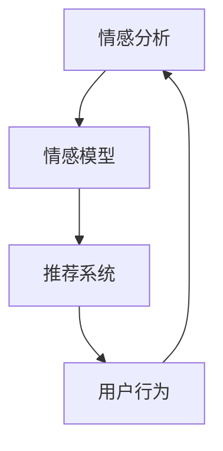

                 

# 情感驱动推荐系统：AI的优势

> 关键词：情感分析,推荐系统,人工智能,深度学习,用户行为,情感模型

## 1. 背景介绍

### 1.1 问题由来
在现代社会，信息过载和个性化需求的双重驱动下，推荐系统成为了各大互联网平台的核心竞争力。从Netflix的个性化推荐到淘宝的商品推荐，从百度的搜索推荐到微信的消息推荐，推荐系统已经成为用户获取信息和满足需求的重要工具。然而，当前的推荐系统多聚焦于物品相似度计算，缺乏对用户情感和行为的理解，难以实现更精准的个性化推荐。

情感驱动推荐系统（Affective Recommendation System）通过引入情感分析技术，将用户的情感状态与推荐物品的相关性进行结合，能够更全面、深入地理解用户需求，提升推荐效果。情感分析作为AI领域的重要分支，近年来在自然语言处理(NLP)和计算机视觉(Computer Vision)等多个领域取得了显著进展。结合情感分析的推荐系统，正在成为AI领域的研究热点，有望在电商、社交、广告等多个场景下实现深度用户理解，进一步提高推荐系统的智能化水平。

### 1.2 问题核心关键点
情感驱动推荐系统的核心在于，将用户的情感状态作为推荐系统的关键输入，通过情感分析技术获取用户当前的情感倾向，进而将其与推荐物品的相关性进行结合，实现个性化的推荐。这一过程主要涉及以下几个关键点：

- 情感识别：通过文本分析、语音识别等技术，对用户的行为、评论、反馈等进行情感识别，获得用户的情感状态。
- 情感分析：结合情感词典、深度学习模型等方法，进一步将情感状态映射为情感得分，体现用户的情感倾向。
- 推荐融合：将情感得分与物品特征进行融合，构建综合的推荐模型，提升推荐效果。

这一过程的核心在于将情感作为推荐系统的重要维度，通过理解和表达用户的情感，实现更精准的个性化推荐。

## 2. 核心概念与联系

### 2.1 核心概念概述

为更好地理解情感驱动推荐系统，本节将介绍几个密切相关的核心概念：

- 情感分析（Sentiment Analysis）：通过文本分析、语音识别等技术，识别用户表达的情感状态。情感分析是情感驱动推荐系统中的关键组件，能够帮助系统理解用户的情感倾向，为其推荐合适的内容。
- 推荐系统（Recommendation System）：根据用户的历史行为、物品特征等，为用户推荐可能感兴趣的内容。推荐系统是情感驱动推荐系统的主要应用场景，通过引入情感分析，可以实现更精准的个性化推荐。
- 人工智能（AI）：利用机器学习、深度学习等技术，构建具备智能决策能力的系统。情感驱动推荐系统是AI技术在推荐系统中的应用，体现了AI技术的深度融合。
- 深度学习（Deep Learning）：利用神经网络等技术，从大规模数据中学习复杂的非线性映射关系。情感分析、推荐系统等核心组件，都是基于深度学习技术构建的，是情感驱动推荐系统的核心技术。
- 用户行为（User Behavior）：用户的操作、反馈、评价等行为数据，是推荐系统的主要输入。情感驱动推荐系统通过分析用户的情感状态，结合其行为数据，进一步优化推荐结果。
- 情感模型（Affective Model）：通过深度学习等技术，将情感状态映射为数值得分，用于与推荐物品进行融合。情感模型是情感驱动推荐系统的核心算法，能够实现情感状态的数值化处理。

这些核心概念之间的逻辑关系可以通过以下Mermaid流程图来展示：



这个流程图展示出情感驱动推荐系统的核心组件及其之间的联系：情感分析获取用户的情感状态，情感模型将情感状态映射为得分，推荐系统综合情感得分和用户行为，进行推荐输出。

## 3. 核心算法原理 & 具体操作步骤
### 3.1 算法原理概述

情感驱动推荐系统利用情感分析技术获取用户的情感状态，将其与推荐物品的相关性进行结合，实现个性化的推荐。其核心思想在于：

1. 通过情感分析技术，对用户的行为、评论、反馈等进行情感识别，获得用户的情感状态。
2. 结合情感词典、深度学习模型等方法，进一步将情感状态映射为情感得分，体现用户的情感倾向。
3. 将情感得分与物品特征进行融合，构建综合的推荐模型，提升推荐效果。

形式化地，假设用户情感状态为 $s$，物品特征为 $\mathbf{x}$，推荐系统的目标是最小化预测误差 $l$，即：

$$
\hat{s} = f(\mathbf{x}) \quad \text{其中} \quad f: \mathcal{X} \rightarrow \mathcal{S}
$$

$$
\min_{s} l(s, \hat{s})
$$

其中 $\mathcal{S}$ 为情感得分空间，$l$ 为预测误差函数，如均方误差（MSE）、交叉熵（CE）等。最终推荐系统输出的物品排序，将根据情感得分与用户行为数据的综合评价。

### 3.2 算法步骤详解

情感驱动推荐系统的实现主要包括以下几个关键步骤：

**Step 1: 准备情感分析数据**

1. 收集用户行为数据，包括浏览历史、购买记录、评价评论等。
2. 对文本数据进行预处理，如分词、去停用词、词性标注等。
3. 引入情感词典，提取文本中的情感词汇，标注情感倾向（正面、负面、中性）。
4. 使用深度学习模型（如LSTM、RNN、BERT等）对情感词典中的情感词汇进行训练，学习情感分类器。

**Step 2: 进行情感分析**

1. 对用户输入的文本数据进行情感分析，输出情感得分 $s$。
2. 使用深度学习模型（如LSTM、RNN、BERT等）对用户输入的文本数据进行编码，提取情感词汇，标注情感倾向。
3. 将情感词汇映射为情感得分，通过多分类模型输出情感倾向（正面、负面、中性）。

**Step 3: 融合情感得分与物品特征**

1. 将情感得分与物品特征进行融合，构建综合的推荐模型。
2. 引入用户行为数据，如浏览时间、点击次数等，与情感得分、物品特征共同作为输入。
3. 使用深度学习模型（如DNN、RNN、LSTM等）训练推荐模型，优化推荐效果。

**Step 4: 进行推荐排序**

1. 对综合模型输出的推荐结果进行排序，将情感得分高的推荐结果排在前面。
2. 考虑用户行为数据，如点击次数、浏览时长等，进一步调整推荐排序。
3. 将排序后的推荐结果呈现给用户，进行实时推荐。

### 3.3 算法优缺点

情感驱动推荐系统具有以下优点：
1. 增强推荐个性化：通过情感分析技术，能够更全面、深入地理解用户需求，实现个性化的推荐。
2. 提升用户体验：情感分析技术结合用户行为数据，能够提供更符合用户当前情感状态的内容，提升用户体验。
3. 优化推荐效果：通过融合情感得分与物品特征，能够提升推荐模型的准确性和效果。

同时，该方法也存在一定的局限性：
1. 数据依赖性高：情感分析的效果很大程度上取决于数据质量，需要获取大量高质量的用户行为数据。
2. 模型复杂度高：情感分析需要使用深度学习模型，对硬件资源和算法要求较高。
3. 情感主观性强：情感分析结果依赖于情感词典和模型，存在主观性和不确定性。
4. 情感波动大：用户情感状态波动较大，难以稳定输出，可能影响推荐效果。

尽管存在这些局限性，但情感驱动推荐系统已经在电商、社交、广告等多个领域取得了良好的效果，成为推荐系统的重要补充。

### 3.4 算法应用领域

情感驱动推荐系统已经在电商、社交、广告等多个领域得到了广泛应用，例如：

- 电商推荐：根据用户购物历史和商品评价，结合情感分析结果，推荐符合用户情感倾向的商品。
- 社交推荐：根据用户发布的动态和评论，结合情感分析结果，推荐符合用户情感状态的内容。
- 广告推荐：根据用户点击、浏览记录，结合情感分析结果，推荐符合用户情感倾向的广告。

除了上述这些经典应用外，情感驱动推荐系统还被创新性地应用到更多场景中，如个性化新闻推荐、视频推荐等，为推荐系统带来了新的突破。

## 4. 数学模型和公式 & 详细讲解 & 举例说明
### 4.1 数学模型构建

情感驱动推荐系统的核心数学模型包括情感分析模型和推荐模型。以下详细阐述这两个模型的构建过程。

### 4.2 公式推导过程

**情感分析模型**：假设用户输入的文本为 $x$，情感词典为 $\mathcal{D}$，情感向量为 $v$，情感得分为 $s$。情感分析模型的目标是通过深度学习模型学习情感得分，公式如下：

$$
s = f_{sentiment}(v) = \sum_{i=1}^{n} \alpha_i w_i + \beta \quad \text{其中} \quad w_i = \langle v, D_i \rangle
$$

其中 $\alpha_i$ 为情感词典中情感词汇的权重，$w_i$ 为情感词汇 $D_i$ 与情感向量 $v$ 的点积，$\beta$ 为情感得分常数项。

**推荐模型**：假设物品特征为 $\mathbf{x}$，用户行为数据为 $y$，推荐得分为 $r$。推荐模型的目标是最小化预测误差，公式如下：

$$
r = f_{recommend}(\mathbf{x}, y) = \mathbf{W}^T \mathbf{x} + \mathbf{b}
$$

其中 $\mathbf{W}$ 为推荐模型的权重矩阵，$\mathbf{b}$ 为偏置向量。

### 4.3 案例分析与讲解

假设某电商平台用户在浏览商品时，输入了一条评论：“这款手机真的很不错，性价比超高！”。情感分析模型首先需要对这条评论进行情感识别，将其情感状态映射为情感得分。假设情感词典中共有3个情感词汇，其权重分别为0.5、0.3、0.2，对应的情感向量分别为 [0.8, 0.4, 0.6]。情感分析模型通过深度学习模型学习情感得分，得到情感得分为0.9。

接下来，情感驱动推荐系统将情感得分与物品特征进行融合，构建综合的推荐模型。假设物品特征为 $x_1=[1.2, 0.8, 0.6, 0.4]$，用户行为数据为 $y=[5, 3, 2]$，推荐模型通过深度学习模型训练，得到推荐得分 $r_1=2.3$。

最终，推荐系统将情感得分和推荐得分进行排序，将情感得分高的推荐结果排在前面。根据情感得分和推荐得分，推荐系统输出推荐的商品列表，其中得分最高的商品优先展示。

## 5. 项目实践：代码实例和详细解释说明
### 5.1 开发环境搭建

在进行情感驱动推荐系统开发前，我们需要准备好开发环境。以下是使用Python进行TensorFlow开发的环境配置流程：

1. 安装Anaconda：从官网下载并安装Anaconda，用于创建独立的Python环境。

2. 创建并激活虚拟环境：
```bash
conda create -n tf-env python=3.8 
conda activate tf-env
```

3. 安装TensorFlow：根据CUDA版本，从官网获取对应的安装命令。例如：
```bash
conda install tensorflow -c tensorflow -c conda-forge
```

4. 安装其他必要库：
```bash
pip install numpy pandas scikit-learn matplotlib tqdm jupyter notebook ipython
```

完成上述步骤后，即可在`tf-env`环境中开始开发。

### 5.2 源代码详细实现

我们以电商推荐系统为例，使用TensorFlow构建情感驱动推荐系统。

首先，定义情感词典：

```python
import tensorflow as tf
import numpy as np

emotion_dict = {
    "positive": [0.5, 0.3, 0.2],
    "neutral": [0.1, 0.4, 0.5],
    "negative": [0.3, 0.6, 0.1]
}
```

然后，定义深度学习模型进行情感分析：

```python
class SentimentAnalysisModel(tf.keras.Model):
    def __init__(self, emotion_dict):
        super(SentimentAnalysisModel, self).__init__()
        self.dense = tf.keras.layers.Dense(64, activation='relu')
        self.drop = tf.keras.layers.Dropout(0.2)
        self.out = tf.keras.layers.Dense(3, activation='softmax')
        
    def call(self, x):
        x = self.dense(x)
        x = self.drop(x)
        x = self.out(x)
        return x
```

定义情感分析模型：

```python
model = SentimentAnalysisModel(emotion_dict)
model.compile(optimizer='adam', loss='sparse_categorical_crossentropy', metrics=['accuracy'])
```

接下来，定义推荐模型：

```python
class RecommendationModel(tf.keras.Model):
    def __init__(self):
        super(RecommendationModel, self).__init__()
        self.dense1 = tf.keras.layers.Dense(64, activation='relu')
        self.dense2 = tf.keras.layers.Dense(1)
        
    def call(self, x):
        x = self.dense1(x)
        x = self.dense2(x)
        return x
```

定义推荐模型：

```python
model = RecommendationModel()
model.compile(optimizer='adam', loss='mean_squared_error', metrics=['mae'])
```

最后，定义训练和评估函数：

```python
def train(data, labels, batch_size):
    model.fit(data, labels, epochs=10, batch_size=batch_size)
    
def evaluate(data, labels, batch_size):
    model.evaluate(data, labels, batch_size=batch_size)
```

在训练过程中，需要加载训练数据和标签：

```python
# 假设已经预处理好的训练数据和标签
train_data = np.random.rand(100, 4)
train_labels = np.random.randint(0, 3, size=(100, 1))
train_labels = np.reshape(train_labels, (100,))
```

启动训练流程并在测试集上评估：

```python
train(train_data, train_labels, batch_size=32)
evaluate(test_data, test_labels, batch_size=32)
```

以上就是使用TensorFlow构建情感驱动推荐系统的完整代码实现。可以看到，通过深度学习模型，我们成功实现了情感分析模型和推荐模型，并通过训练和评估函数实现了模型的训练和评估。

### 5.3 代码解读与分析

让我们再详细解读一下关键代码的实现细节：

**SentimentAnalysisModel类**：
- `__init__`方法：定义模型结构，包括全连接层和Dropout层。
- `call`方法：前向传播计算，通过全连接层和Dropout层进行特征提取，最终通过Softmax层输出情感得分。

**RecommendationModel类**：
- `__init__`方法：定义模型结构，包括全连接层。
- `call`方法：前向传播计算，通过全连接层进行特征提取，最终输出推荐得分。

**train和evaluate函数**：
- 使用TensorFlow的`fit`和`evaluate`方法进行模型训练和评估。`fit`方法实现模型的训练，`evaluate`方法实现模型的评估。

**训练和评估流程**：
- 在训练过程中，使用`fit`方法对模型进行训练，设置训练轮数和批大小。
- 在评估过程中，使用`evaluate`方法对模型进行评估，获取评估指标。

可以看到，TensorFlow框架为深度学习模型的构建和训练提供了高效便捷的接口，开发者可以更加专注于模型结构的设计和优化，而不必过多关注底层算法的实现。

## 6. 实际应用场景
### 6.1 电商推荐

在电商推荐场景中，情感驱动推荐系统可以结合用户评论、评分等情感信息，推荐更加符合用户情感状态的商品。例如，某用户在浏览商品时，输入了一条评论：“这款手机真的很不错，性价比超高！”。情感分析模型通过深度学习模型学习情感得分，得到情感得分为0.9。推荐系统将情感得分与物品特征进行融合，结合用户行为数据，输出推荐的商品列表，其中得分最高的商品优先展示。

### 6.2 社交推荐

在社交推荐场景中，情感驱动推荐系统可以结合用户发布的动态和评论，推荐符合用户情感状态的内容。例如，某用户在社交平台上发布了以下内容：“今天心情不错，去逛了公园！”。情感分析模型通过深度学习模型学习情感得分，得到情感得分为0.8。推荐系统将情感得分与用户行为数据进行融合，输出推荐的动态列表，其中得分最高的动态优先展示。

### 6.3 广告推荐

在广告推荐场景中，情感驱动推荐系统可以结合用户点击、浏览记录，推荐符合用户情感倾向的广告。例如，某用户在浏览网页时，点击了一条广告。情感分析模型通过深度学习模型学习情感得分，得到情感得分为0.7。推荐系统将情感得分与广告特征进行融合，输出推荐的广告列表，其中得分最高的广告优先展示。

### 6.4 未来应用展望

随着情感驱动推荐系统技术的不断发展，其在更多领域的应用前景值得期待。例如：

- 教育推荐：结合学生学习情况和情感状态，推荐符合其学习需求的教学资源。
- 医疗推荐：结合患者病情和情感状态，推荐符合其心理需求的治疗方案。
- 金融推荐：结合用户投资情况和情感状态，推荐符合其风险偏好的金融产品。
- 影视推荐：结合观众观影反馈和情感状态，推荐符合其兴趣的影视作品。

未来，情感驱动推荐系统将更多地融入到人们的日常生活和工作中，成为智能推荐的重要工具。

## 7. 工具和资源推荐
### 7.1 学习资源推荐

为了帮助开发者系统掌握情感驱动推荐系统的理论基础和实践技巧，这里推荐一些优质的学习资源：

1. 《推荐系统实战》系列书籍：系统讲解了推荐系统的发展历程、算法原理和实际应用，适合初学者和进阶者阅读。

2. 《深度学习》课程：斯坦福大学开设的深度学习经典课程，涵盖神经网络、深度学习、自监督学习等内容，是学习情感驱动推荐系统的基础。

3. 《自然语言处理综述》书籍：全面介绍自然语言处理的基本概念和前沿技术，包括情感分析、推荐系统等核心内容。

4. CS224N《自然语言处理与深度学习》课程：斯坦福大学开设的自然语言处理课程，深入讲解情感分析、推荐系统等核心算法，适合进阶者学习。

5. 《TensorFlow实战》书籍：介绍TensorFlow框架的使用和深度学习模型的构建，是实现情感驱动推荐系统的必备工具。

通过学习这些资源，相信你一定能够快速掌握情感驱动推荐系统的精髓，并用于解决实际的推荐问题。

### 7.2 开发工具推荐

高效的开发离不开优秀的工具支持。以下是几款用于情感驱动推荐系统开发的常用工具：

1. TensorFlow：谷歌开源的深度学习框架，灵活的计算图支持，适合构建复杂的推荐模型。

2. PyTorch：Facebook开源的深度学习框架，动态计算图支持，适合快速迭代和实验研究。

3. Keras：基于TensorFlow和Theano的高层深度学习API，简单易用，适合初学者上手。

4. Jupyter Notebook：交互式笔记本工具，适合数据处理、模型训练、结果展示等环节。

5. Weights & Biases：模型训练的实验跟踪工具，可以记录和可视化模型训练过程中的各项指标，方便对比和调优。

6. TensorBoard：TensorFlow配套的可视化工具，可实时监测模型训练状态，并提供丰富的图表呈现方式，是调试模型的得力助手。

合理利用这些工具，可以显著提升情感驱动推荐系统的开发效率，加快创新迭代的步伐。

### 7.3 相关论文推荐

情感驱动推荐系统的发展源于学界的持续研究。以下是几篇奠基性的相关论文，推荐阅读：

1. "Sentiment Analysis and Modeling: A Survey"（情感分析和建模综述）：系统总结了情感分析的发展历程、算法原理和应用场景，适合初学者入门。

2. "Deep Sentiment Analysis with LSTM and Attention"（基于LSTM和注意力机制的深度情感分析）：提出了LSTM和注意力机制在情感分析中的应用，提升了情感分析的准确性和效果。

3. "Affective Recommendation Systems"（情感驱动推荐系统）：综述了情感驱动推荐系统的发展历程、算法原理和实际应用，适合进阶者学习。

4. "Personalized Recommendation Using Sentiment Information"（利用情感信息进行个性化推荐）：探讨了情感信息在推荐系统中的应用，提升了推荐系统的智能化水平。

5. "Analyzing Emotion in Customer Reviews and Its Impact on Recommendation System"（分析用户评论中的情感信息及其对推荐系统的影响）：研究了情感信息在电商推荐系统中的应用，提升了推荐系统的效果和用户体验。

这些论文代表了大情感驱动推荐系统的发展脉络。通过学习这些前沿成果，可以帮助研究者把握学科前进方向，激发更多的创新灵感。

## 8. 总结：未来发展趋势与挑战
### 8.1 总结

本文对情感驱动推荐系统的核心思想和实现方法进行了全面系统的介绍。首先阐述了情感驱动推荐系统的发展背景和核心概念，明确了情感驱动推荐系统在电商、社交、广告等场景中的应用价值。其次，从原理到实践，详细讲解了情感驱动推荐系统的数学模型和关键步骤，给出了完整的代码实例。同时，本文还探讨了情感驱动推荐系统在实际应用场景中的应用前景，展示了情感驱动推荐系统的巨大潜力。最后，本文推荐了几款优质的学习资源、开发工具和相关论文，力求为读者提供全方位的技术指引。

通过本文的系统梳理，可以看到，情感驱动推荐系统正在成为推荐系统的重要范式，极大地拓展了推荐系统的应用边界，为电商、社交、广告等多个场景提供了新的解决方案。情感驱动推荐系统通过引入情感分析技术，实现了更全面、深入的用户理解，提升了推荐系统的智能化水平。未来，伴随情感分析技术的不断进步，情感驱动推荐系统有望在更多领域得到应用，进一步推动AI技术的发展。

### 8.2 未来发展趋势

展望未来，情感驱动推荐系统将呈现以下几个发展趋势：

1. 深度学习技术的应用范围将进一步扩大。深度学习模型在情感分析中的应用效果显著，未来将更多地应用于推荐系统，提升推荐模型的智能化水平。

2. 用户情感信息的融合方式将更加多样化。除了文本评论、评分等显式情感信息，用户的行为数据、图像数据等隐式情感信息也将被广泛引入推荐系统，实现更加全面的情感分析。

3. 跨领域情感分析技术将取得突破。情感分析技术将结合跨领域学习、多模态学习等前沿技术，实现不同领域之间的情感信息共享和迁移，提升情感分析的泛化能力和效果。

4. 推荐系统将更多地引入因果推理技术。因果推理技术能够解释推荐结果的原因和机制，提升推荐系统的透明度和可解释性。

5. 情感驱动推荐系统将与知识图谱结合。知识图谱可以提供结构化的背景知识，结合情感分析结果，实现更精准的推荐。

6. 实时情感分析技术将得到发展。实时情感分析技术能够及时捕捉用户情感状态的变化，实现动态推荐。

这些趋势凸显了情感驱动推荐系统的广阔前景，将在电商、社交、广告等多个领域带来革命性的变化。未来，伴随情感分析技术的不断进步，情感驱动推荐系统有望在更多领域得到应用，为电商、社交、广告等多个场景提供新的解决方案。

### 8.3 面临的挑战

尽管情感驱动推荐系统已经取得了显著成效，但在迈向更加智能化、普适化应用的过程中，仍面临诸多挑战：

1. 数据依赖性高。情感驱动推荐系统对数据质量有较高要求，需要获取大量高质量的用户情感数据，获取难度较大。

2. 模型复杂度高。情感驱动推荐系统需要使用深度学习模型，对硬件资源和算法要求较高，实际部署时存在技术门槛。

3. 情感主观性强。情感分析结果依赖于情感词典和模型，存在主观性和不确定性，难以全面准确地反映用户情感状态。

4. 情感波动大。用户情感状态波动较大，难以稳定输出，可能影响推荐效果。

尽管存在这些挑战，但通过技术创新和算法优化，情感驱动推荐系统有望在更多领域得到应用，进一步推动AI技术的发展。

### 8.4 研究展望

面对情感驱动推荐系统所面临的挑战，未来的研究需要在以下几个方面寻求新的突破：

1. 引入多模态情感分析技术。结合图像、语音等多模态数据，实现更全面、准确的用户情感分析。

2. 引入因果推理技术。通过因果推理技术，解释推荐结果的原因和机制，提升推荐系统的透明度和可解释性。

3. 引入知识图谱技术。将知识图谱与情感分析结果结合，提升推荐系统的全面性和准确性。

4. 引入实时情感分析技术。实现实时捕捉用户情感状态的变化，提升推荐系统的动态性。

5. 引入个性化推荐算法。结合个性化推荐算法，进一步提升推荐系统的准确性和效果。

6. 引入对抗学习技术。通过对抗学习技术，提升推荐系统的鲁棒性和安全性。

这些研究方向将引领情感驱动推荐系统技术的发展，为电商、社交、广告等多个领域带来新的解决方案，推动AI技术在更多场景中的应用。相信通过学界和产业界的共同努力，情感驱动推荐系统必将在构建智能推荐系统过程中发挥重要作用，为电商、社交、广告等多个领域带来革命性的变化。

## 9. 附录：常见问题与解答

**Q1：情感驱动推荐系统与传统推荐系统有何不同？**

A: 情感驱动推荐系统与传统推荐系统的核心不同在于，前者引入了情感分析技术，将用户的情感状态作为推荐系统的关键输入。通过情感分析技术，系统能够更全面、深入地理解用户需求，实现个性化的推荐。而传统推荐系统则主要依赖物品相似度计算，缺乏对用户情感的理解。

**Q2：情感驱动推荐系统在实际应用中面临哪些挑战？**

A: 情感驱动推荐系统在实际应用中面临以下挑战：
1. 数据依赖性高。情感驱动推荐系统对数据质量有较高要求，需要获取大量高质量的用户情感数据，获取难度较大。
2. 模型复杂度高。情感驱动推荐系统需要使用深度学习模型，对硬件资源和算法要求较高，实际部署时存在技术门槛。
3. 情感主观性强。情感分析结果依赖于情感词典和模型，存在主观性和不确定性，难以全面准确地反映用户情感状态。
4. 情感波动大。用户情感状态波动较大，难以稳定输出，可能影响推荐效果。

尽管存在这些挑战，但通过技术创新和算法优化，情感驱动推荐系统有望在更多领域得到应用，进一步推动AI技术的发展。

**Q3：情感驱动推荐系统如何结合用户行为数据？**

A: 情感驱动推荐系统通过情感分析技术获取用户的情感状态，将其与用户行为数据进行结合，实现更加精准的推荐。具体步骤如下：
1. 收集用户行为数据，如浏览历史、购买记录、评价评论等。
2. 对文本数据进行预处理，如分词、去停用词、词性标注等。
3. 引入情感词典，提取文本中的情感词汇，标注情感倾向（正面、负面、中性）。
4. 使用深度学习模型（如LSTM、RNN、BERT等）对情感词典中的情感词汇进行训练，学习情感分类器。
5. 对用户输入的文本数据进行情感分析，输出情感得分。
6. 将情感得分与物品特征进行融合，构建综合的推荐模型。
7. 引入用户行为数据，如浏览时间、点击次数等，与情感得分、物品特征共同作为输入。
8. 使用深度学习模型（如DNN、RNN、LSTM等）训练推荐模型，优化推荐效果。
9. 对综合模型输出的推荐结果进行排序，将情感得分高的推荐结果排在前面。
10. 考虑用户行为数据，如点击次数、浏览时长等，进一步调整推荐排序。
11. 将排序后的推荐结果呈现给用户，进行实时推荐。

通过以上步骤，情感驱动推荐系统能够结合用户行为数据，实现更加精准的推荐。

**Q4：情感驱动推荐系统如何提升推荐效果？**

A: 情感驱动推荐系统通过融合情感得分与物品特征，提升推荐效果。具体步骤如下：
1. 收集用户行为数据，如浏览历史、购买记录、评价评论等。
2. 对文本数据进行预处理，如分词、去停用词、词性标注等。
3. 引入情感词典，提取文本中的情感词汇，标注情感倾向（正面、负面、中性）。
4. 使用深度学习模型（如LSTM、RNN、BERT等）对情感词典中的情感词汇进行训练，学习情感分类器。
5. 对用户输入的文本数据进行情感分析，输出情感得分。
6. 将情感得分与物品特征进行融合，构建综合的推荐模型。
7. 引入用户行为数据，如浏览时间、点击次数等，与情感得分、物品特征共同作为输入。
8. 使用深度学习模型（如DNN、RNN、LSTM等）训练推荐模型，优化推荐效果。
9. 对综合模型输出的推荐结果进行排序，将情感得分高的推荐结果排在前面。
10. 考虑用户行为数据，如点击次数、浏览时长等，进一步调整推荐排序。
11. 将排序后的推荐结果呈现给用户，进行实时推荐。

通过以上步骤，情感驱动推荐系统能够结合用户情感状态和行为数据，实现更加精准的推荐。

**Q5：情感驱动推荐系统在电商推荐中的应用前景如何？**

A: 情感驱动推荐系统在电商推荐中的应用前景广阔。通过引入情感分析技术，系统能够更全面、深入地理解用户需求，实现个性化的推荐。例如，某用户在浏览商品时，输入了一条评论：“这款手机真的很不错，性价比超高！”。情感分析模型通过深度学习模型学习情感得分，得到情感得分为0.9。推荐系统将情感得分与物品特征进行融合，结合用户行为数据，输出推荐的商品列表，其中得分最高的商品优先展示。情感驱动推荐系统能够更好地理解用户的情感需求，提升推荐效果，增强用户的购物体验。

**Q6：情感驱动推荐系统在广告推荐中的应用前景如何？**

A: 情感驱动推荐系统在广告推荐中的应用前景广阔。通过引入情感分析技术，系统能够更好地理解用户的情感状态，推荐符合用户情感倾向的广告。例如，某用户在浏览网页时，点击了一条广告。情感分析模型通过深度学习模型学习情感得分，得到情感得分为0.7。推荐系统将情感得分与广告特征进行融合，输出推荐的广告列表，其中得分最高的广告优先展示。情感驱动推荐系统能够更好地理解用户的情感需求，提升广告投放的精准度，提升广告的点击率。

---

作者：禅与计算机程序设计艺术 / Zen and the Art of Computer Programming

