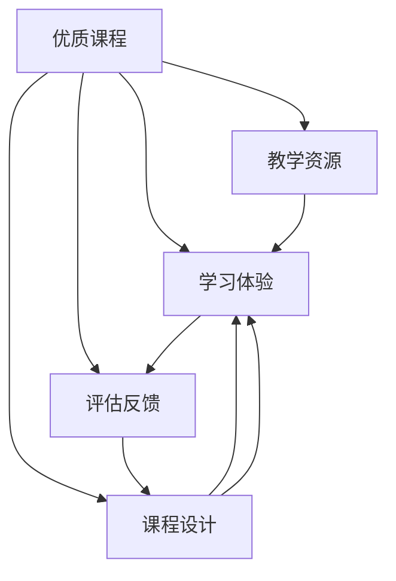

                 

# 打造优质课程的核心要素

## 1. 背景介绍

在当今信息爆炸的时代，教育资源越来越丰富，如何在众多的课程中脱颖而出，成为优质课程，是教育者和开发者面临的共同挑战。优质课程不仅仅是传授知识的工具，更是连接学生与世界的桥梁，能够激发学生的学习兴趣，提升他们的能力与素养，为未来的职业发展打下坚实的基础。

本文将深入探讨打造优质课程的核心要素，涵盖课程设计、教学内容、学习体验、评估反馈等多个方面，为教育者和开发者提供全面的指导。

## 2. 核心概念与联系

### 2.1 核心概念概述

为更好地理解优质课程的构建，本节将介绍几个密切相关的核心概念：

- 优质课程(Quality Course)：指能够有效激发学生学习兴趣，提升学习效果，实现素质教育目标的课程。优质课程通常具有丰富的教学资源、科学的课程设计、互动的教学方式、有效的评估反馈等特点。

- 教学资源(Educational Resources)：指用于支持课程教学的各种媒体、工具和资料。优质的教学资源能极大提升课堂效率和学习体验。

- 课程设计(Course Design)：指根据教学目标和学生需求，科学规划课程内容、结构、难度和形式的过程。课程设计是打造优质课程的基础。

- 学习体验(Learning Experience)：指学生在学习过程中，与课程内容、教学方法和师生互动产生的整体感受和认知。优质的学习体验能够增强学生的学习动机和满意度。

- 评估反馈(Evaluation & Feedback)：指通过各种评估方法，获取学生学习情况，并对课程进行调整和改进的过程。评估反馈是优质课程建设的重要环节。

这些核心概念之间相互联系，共同构成优质课程的构建框架。通过理解这些核心概念，我们可以更好地把握优质课程的设计原则和实践方法。

### 2.2 核心概念原理和架构的 Mermaid 流程图



这个流程图展示了优质课程构建的基本逻辑关系：

1. 优质课程以教学资源为支撑。
2. 课程设计决定了课程内容和结构。
3. 学习体验来源于课程内容和教学方法。
4. 评估反馈指导课程设计和调整。
5. 课程设计与学习体验、评估反馈相互促进，共同提升课程质量。

## 3. 核心算法原理 & 具体操作步骤

### 3.1 算法原理概述

优质课程的构建涉及多个环节，包括教学资源的获取、课程设计的规划、学习体验的营造、评估反馈的收集与分析等。本节将从教学资源、课程设计、学习体验、评估反馈四个方面，详细介绍优质课程的构建方法。

### 3.2 算法步骤详解

#### 3.2.1 教学资源获取

- 定义资源需求：明确课程所需的各种资源类型，如教材、视频、实验工具等。
- 搜集资源：通过教育资源平台、专业书籍、公开课程等渠道搜集资源。
- 筛选资源：根据课程目标和学生需求，选择最适合的资源。
- 整合资源：将搜集到的资源进行整理、编辑、整合，形成一套完整的教学资源包。

#### 3.2.2 课程设计规划

- 确定课程目标：根据学科标准和学生发展目标，设定明确的课程目标。
- 设计课程结构：按照由浅入深、循序渐进的原则，设计课程章节和知识点。
- 选择合适的教学方法：如讲授、讨论、实验等，根据课程内容和学生特点选择最合适的教学方法。
- 设计评估方式：设计科学的评估方法，如课堂测验、作业、项目等，对学生的学习效果进行客观评估。

#### 3.2.3 学习体验营造

- 互动式教学：采用小组讨论、案例分析、角色扮演等互动教学方法，增强学生的参与感和自主学习。
- 多样化资源：除了教材和视频，还可以引入实验、游戏、模拟等多样化资源，丰富学习体验。
- 及时反馈：在教学过程中，及时给予学生反馈，帮助他们调整学习策略，提升学习效果。

#### 3.2.4 评估反馈收集与分析

- 收集反馈信息：通过问卷调查、学生访谈、作业评价等方式，收集学生对课程的反馈信息。
- 分析反馈数据：对收集到的反馈信息进行统计分析，找出课程的优点和不足。
- 调整课程设计：根据反馈结果，对课程设计进行调整和优化，提升课程质量。

### 3.3 算法优缺点

#### 3.3.1 优点

- 多样化的教学资源：优质课程能够提供丰富的教学资源，满足学生多方面的学习需求。
- 科学的课程设计：课程设计符合学生的认知规律和兴趣点，有助于提升学习效果。
- 互动的学习体验：互动式教学方法能够激发学生的学习兴趣，提升课堂参与度。
- 有效的评估反馈：科学的评估反馈机制能够及时发现问题，优化课程设计，提升课程质量。

#### 3.3.2 缺点

- 资源获取难度：优质的教学资源往往需要花费大量时间和精力搜集和整合，具有一定的难度。
- 设计复杂度高：课程设计需要综合考虑学科目标、学生需求、教学方法等多个因素，设计复杂。
- 互动要求高：互动式教学方法需要教师和学生的高度配合，对教师的教学能力和学生的学习态度都有较高要求。
- 反馈分析难度：评估反馈数据的收集和分析工作量大，需要专业的工具和方法，对教师的数据分析能力有较高要求。

### 3.4 算法应用领域

优质课程的构建方法不仅适用于传统的学校教育，也适用于在线教育和企业培训等多样化场景。具体应用领域包括：

- 学校教育：涵盖中小学、大学等各级各类学校的学科课程设计。
- 在线教育：如MOOC、SPOC等在线课程平台上的课程设计。
- 企业培训：如员工技能提升、领导力培训等企业内训课程设计。
- 兴趣爱好：如编程、艺术、语言学习等兴趣班课程设计。

## 4. 数学模型和公式 & 详细讲解 & 举例说明

### 4.1 数学模型构建

为了更严谨地描述优质课程的构建过程，本节将使用数学语言对课程设计、教学内容、学习体验、评估反馈等环节进行建模。

假设优质课程包含 $N$ 个知识点，记为 $\mathcal{K}=\{k_1,k_2,...,k_N\}$，课程目标为 $T$，教学资源为 $R$，学生反馈为 $F$。

课程设计可以建模为：

$$
D = \mathcal{K} \rightarrow \mathcal{T} \rightarrow \mathcal{M} \rightarrow \mathcal{A}
$$

其中 $\mathcal{T}$ 为知识点 $\mathcal{K}$ 到教学目标 $\mathcal{T}$ 的映射，$\mathcal{M}$ 为教学目标 $\mathcal{T}$ 到教学方法 $\mathcal{M}$ 的映射，$\mathcal{A}$ 为教学方法 $\mathcal{M}$ 到评估方式 $\mathcal{A}$ 的映射。

教学资源 $R$ 对课程设计的影响建模为：

$$
R \rightarrow \mathcal{M} \rightarrow \mathcal{A}
$$

学习体验 $L$ 可以建模为：

$$
L = \mathcal{M} \times \mathcal{R} \times F
$$

其中 $\mathcal{R}$ 为教学资源 $\mathcal{R}$ 对学习体验 $L$ 的贡献。

评估反馈 $E$ 可以建模为：

$$
E = F \times \mathcal{A} \times \mathcal{K}
$$

其中 $\mathcal{A}$ 为评估方式 $\mathcal{A}$ 对评估反馈 $E$ 的贡献，$\mathcal{K}$ 为知识点 $\mathcal{K}$ 对评估反馈 $E$ 的贡献。

### 4.2 公式推导过程

根据上述模型，我们可以推导出影响课程质量的关键因素：

- 课程设计的科学性 $D$：课程设计是否符合学科标准和学生需求，是否能够有效传递教学目标和知识点。
- 教学资源的丰富度 $R$：教学资源是否足够丰富、多样化，是否能够满足学生的学习需求。
- 教学方法的互动性 $M$：教学方法是否互动、参与性强，能否激发学生的学习兴趣。
- 学习体验的满足度 $L$：学习体验是否能够满足学生的学习需求，是否能够增强学习动机和满意度。
- 评估反馈的有效性 $E$：评估反馈是否及时、客观，是否能够有效指导课程调整和优化。

通过这些因素的权衡和优化，可以提升课程的质量。

### 4.3 案例分析与讲解

以编程课程为例，进行详细分析。

**案例背景**：某大学计算机学院开设了一门《Python程序设计》课程，旨在培养学生的编程能力和算法思维。课程目标包括掌握Python基础语法、数据结构、算法设计等知识点。

**课程设计**：
- 确定课程目标：掌握Python基础语法、数据结构、算法设计等。
- 设计课程结构：将课程分为四个模块，分别为Python基础、数据结构、算法设计、项目实践。
- 选择合适的教学方法：采用讲授与实践相结合的方法，每个模块中既有理论讲解，也有编程实验。
- 设计评估方式：采用期中测验、期末考试、课程项目等评估方式，全面评估学生学习效果。

**教学资源**：
- 教材：《Python程序设计基础》。
- 视频：录制课程讲授视频。
- 实验平台：提供在线编程环境，支持学生在线完成实验。
- 编程范例：提供大量编程范例和代码片段，供学生参考和学习。

**学习体验**：
- 互动式教学：每节课后进行小组讨论，解决学生学习中的疑问。
- 实验平台：提供在线编程环境，增强学生编程体验。
- 及时反馈：教师在编程实验后及时批改代码，给予学生反馈，帮助他们改进代码。

**评估反馈**：
- 收集反馈信息：通过课程问卷、学生访谈等方式收集学生对课程的反馈信息。
- 分析反馈数据：统计分析学生对课程设计的满意度、对教学资源的评价、对学习体验的评价等。
- 调整课程设计：根据反馈结果，优化课程结构和教学方法，提升课程质量。

## 5. 项目实践：代码实例和详细解释说明

### 5.1 开发环境搭建

为了进行优质课程的构建，我们需要准备好开发环境。以下是使用Python进行项目开发的环境配置流程：

1. 安装Python：从官网下载并安装Python 3.x版本，确保系统路径设置正确。
2. 安装必要的包：使用pip安装Flask、Jinja2、SQLAlchemy等必要包，搭建基本的web开发环境。
3. 创建虚拟环境：使用virtualenv创建项目虚拟环境，隔离项目依赖。
4. 代码托管：使用Git进行代码托管，方便版本控制和团队协作。

完成上述步骤后，即可在虚拟环境中进行优质课程构建项目的开发。

### 5.2 源代码详细实现

以下是使用Flask框架搭建优质课程平台的示例代码：

```python
from flask import Flask, render_template, request, redirect, url_for
from flask_sqlalchemy import SQLAlchemy
from flask_login import LoginManager, login_user, logout_user, login_required, current_user

app = Flask(__name__)
app.config['SECRET_KEY'] = 'your_secret_key'
app.config['SQLALCHEMY_DATABASE_URI'] = 'sqlite:////tmp/test.db'
app.config['SQLALCHEMY_TRACK_MODIFICATIONS'] = False
db = SQLAlchemy(app)
login_manager = LoginManager()
login_manager.init_app(app)

class User(db.Model):
    id = db.Column(db.Integer, primary_key=True)
    username = db.Column(db.String(80), unique=True, nullable=False)
    password = db.Column(db.String(120), nullable=False)

    def __repr__(self):
        return '<User %r>' % self.username

@login_manager.user_loader
def load_user(user_id):
    return User.query.get(int(user_id))

@app.route('/')
@login_required
def home():
    return render_template('index.html')

@app.route('/login', methods=['GET', 'POST'])
def login():
    if request.method == 'POST':
        username = request.form['username']
        password = request.form['password']
        user = User.query.filter_by(username=username, password=password).first()
        if user is not None:
            login_user(user)
            return redirect(url_for('home'))
        else:
            return render_template('login.html', error='Invalid username or password')
    return render_template('login.html')

@app.route('/logout')
@login_required
def logout():
    logout_user()
    return redirect(url_for('login'))

@app.route('/profile')
@login_required
def profile():
    user = User.query.filter_by(username=current_user.username).first()
    return render_template('profile.html', user=user)

@app.route('/assignments')
@login_required
def assignments():
    assignments = Assignment.query.filter_by(user_id=current_user.id).all()
    return render_template('assignments.html', assignments=assignments)

@app.route('/submit', methods=['POST'])
@login_required
def submit():
    title = request.form['title']
    content = request.form['content']
    assignment = Assignment(title=title, content=content, user_id=current_user.id)
    db.session.add(assignment)
    db.session.commit()
    return redirect(url_for('home'))

if __name__ == '__main__':
    app.run(debug=True)
```

以上代码展示了如何使用Flask框架搭建一个简单的优质课程平台，包括用户认证、课程管理和作业提交等功能。

### 5.3 代码解读与分析

**Flask框架**：Flask是一个轻量级的Python web框架，适合搭建中小型web应用。其灵活性高，扩展性强，是构建优质课程平台的不二之选。

**SQLAlchemy库**：SQLAlchemy是一个Python ORM（对象关系映射）库，支持多种数据库。使用SQLAlchemy可以方便地进行数据建模和操作，提升开发效率。

**Flask-Login扩展**：Flask-Login扩展提供用户认证和授权功能，方便进行用户管理和权限控制。

**路由管理**：Flask通过路由（Route）机制管理请求和视图（View）之间的关系。以上代码中，通过`@app.route()`装饰器定义路由，并通过不同的HTTP方法（GET、POST等）处理不同的请求。

**用户认证和授权**：以上代码实现了基本的用户认证和授权功能，通过`login_required`装饰器保护需要登录才能访问的页面。

**表单处理**：以上代码实现了表单处理功能，通过`request.form`获取表单数据，并进行处理和保存。

**静态资源管理**：Flask提供静态资源管理功能，方便管理CSS、JS、图片等静态资源。

### 5.4 运行结果展示

运行以上代码后，即可在浏览器中访问优质课程平台，体验如下功能：

- 用户登录、注册和退出。
- 课程管理，包括课程浏览、添加和删除。
- 作业提交和查看，学生可以查看老师布置的作业，并提交作业。
- 学习讨论，学生可以在课程讨论区进行交流和讨论。

## 6. 实际应用场景

### 6.1 学校教育

优质课程在学校教育中的应用场景非常广泛，涵盖中小学生、大学生、研究生等各级各类课程。具体应用包括：

- 学科课程：如语文、数学、物理等基础课程，涵盖知识点讲解、习题训练、实验实践等环节。
- 选修课程：如编程、绘画、音乐等选修课程，涵盖兴趣激发、技能提升、项目实践等环节。
- 在线课程：如MOOC、SPOC等在线课程平台上的优质课程，涵盖自学指导、视频讲解、互动练习等环节。

### 6.2 在线教育

在线教育是优质课程的另一个重要应用场景，其特点为开放、灵活、互动性强。具体应用包括：

- MOOC课程：如Coursera、edX等平台上的MOOC课程，涵盖视频讲解、在线测试、讨论论坛等环节。
- SPOC课程：如Udacity、Coursera等平台上的SPOC课程，涵盖视频讲解、在线测试、作业提交等环节。
- K-12在线教育：如Khan Academy、VIPKID等平台上的K-12在线教育课程，涵盖视频讲解、互动练习、游戏化学习等环节。

### 6.3 企业培训

优质课程在企业培训中的应用场景也非常广泛，涵盖新员工培训、技能提升、领导力培训等。具体应用包括：

- 新员工培训：如入职培训、企业文化培训等，涵盖入职指南、公司制度、团队协作等环节。
- 技能提升培训：如技术培训、销售培训、管理培训等，涵盖知识点讲解、案例分析、模拟演练等环节。
- 领导力培训：如领导力课程、管理课程等，涵盖领导力模型、决策能力、沟通技巧等环节。

## 7. 工具和资源推荐

### 7.1 学习资源推荐

为了帮助开发者系统掌握优质课程的构建方法，这里推荐一些优质的学习资源：

- Coursera、edX、Udacity等在线学习平台，提供丰富的课程资源，涵盖各个领域。
- Khan Academy、VIPKID等在线教育平台，提供优质的K-12在线教育资源。
- GitHub、CSDN等开源社区，提供丰富的代码示例和教学资源。

通过对这些资源的学习实践，相信你一定能够快速掌握优质课程的构建方法，并用于解决实际的教育问题。

### 7.2 开发工具推荐

优质的开发工具能够大大提升课程构建的效率和质量。以下是几款用于优质课程开发的常用工具：

- Python：Python是一门功能强大、易于学习的编程语言，适合进行课程设计和数据分析。
- Flask：Flask是一个轻量级的web框架，适合构建中小型web应用，支持用户认证、表单处理等基本功能。
- SQLAlchemy：SQLAlchemy是一个Python ORM库，支持多种数据库，方便进行数据建模和操作。
- Git：Git是一个版本控制系统，支持代码托管和版本控制，方便团队协作。

合理利用这些工具，可以显著提升优质课程构建的开发效率，加快创新迭代的步伐。

### 7.3 相关论文推荐

优质课程的构建研究源于学界的持续研究。以下是几篇奠基性的相关论文，推荐阅读：

- Brevity and Humor: Principles and Constraints of Learning (2009)：探讨了学习过程的简洁性和幽默性对学习效果的影响。
- Self-regulated learning: What does it mean? (2004)：介绍了自我调节学习的概念和实施方法，强调了学生在学习过程中的自主性和控制性。
- The effect of personalized learning environments on students' self-regulated learning (2014)：探讨了个性化学习环境对学生自我调节学习的影响。

这些论文代表了大语言模型微调技术的发展脉络。通过学习这些前沿成果，可以帮助研究者把握学科前进方向，激发更多的创新灵感。

## 8. 总结：未来发展趋势与挑战

### 8.1 总结

本文对优质课程的核心要素进行了全面系统的介绍。首先阐述了优质课程的构建背景和意义，明确了课程设计、教学内容、学习体验、评估反馈等环节的重要性。其次，从教学资源、课程设计、学习体验、评估反馈四个方面，详细讲解了优质课程的构建方法。最后，本文还探讨了优质课程在多场景下的应用，提供了相关学习资源和开发工具的推荐。

通过本文的系统梳理，可以看到，优质课程的构建不仅涉及课程设计、教学资源等多个环节，还需要综合考虑学生的学习需求和特征，持续优化和改进。只有在科学的设计和灵活的执行中，优质课程才能真正发挥其作用，实现教学目标。

### 8.2 未来发展趋势

展望未来，优质课程的构建将呈现以下几个发展趋势：

1. 技术驱动：随着AI、大数据、区块链等新技术的发展，优质课程将更加智能、个性化和互动化。
2. 数据驱动：通过大数据分析和个性化推荐，优质课程将能够更好地满足学生的个性化学习需求。
3. 跨学科融合：优质课程将更多地涉及跨学科的知识，培养学生的跨学科思维和创新能力。
4. 全人发展：优质课程将更加关注学生的全面发展，涵盖学科知识、情感教育、综合素质等多个方面。
5. 终身学习：优质课程将更加注重终身学习的理念，帮助学生适应不断变化的学习环境和工作环境。

### 8.3 面临的挑战

尽管优质课程的构建取得了诸多进展，但在迈向更加智能化、普适化应用的过程中，仍面临诸多挑战：

1. 教育公平性：优质课程的建设需要高质量的教学资源和先进的技术支持，但在资源有限的地区，如何实现优质教育的普及，仍然是一个重要挑战。
2. 教师素质：优质课程的实施需要高素质的教师团队，如何培养和提升教师的素质，是一个长期的挑战。
3. 学生自主性：优质课程要求学生具备较强的自主学习能力，如何在课程设计中激发学生的自主学习兴趣和能力，仍然是一个重要挑战。
4. 数据隐私：优质课程需要收集学生的学习数据，如何保障数据隐私和安全，是一个重要的挑战。
5. 课程评价：优质课程需要科学的评估和反馈机制，如何设计科学的评价指标和方法，是一个重要的挑战。

### 8.4 研究展望

未来的优质课程研究需要在以下几个方面寻求新的突破：

1. 个性化学习：通过数据分析和个性化推荐，实现更加个性化的课程设计和教学方法。
2. 跨学科整合：将不同学科的知识进行整合，培养学生的跨学科思维和创新能力。
3. 智能辅助：引入AI技术，实现自动化的学习辅导和评估反馈，提升教学效率和效果。
4. 终身学习：开发面向终身学习的优质课程，帮助学生适应不断变化的学习环境和工作环境。
5. 数据驱动：利用大数据分析和机器学习技术，提升课程构建的效率和效果。

这些研究方向将引领优质课程的建设走向更高的台阶，为教育者和开发者提供更多的创新方向和实践指导。

## 9. 附录：常见问题与解答

**Q1：如何评估优质课程的质量？**

A: 优质课程的质量评估可以从多个维度进行，包括课程设计、教学资源、学习体验、评估反馈等多个方面。具体评估指标如下：
1. 课程设计：教学目标明确，课程结构合理，知识点覆盖全面。
2. 教学资源：教学资源丰富、多样化，能够满足学生的学习需求。
3. 学习体验：互动性强，学生参与度高，学习动机和满意度提升。
4. 评估反馈：评估方法科学，反馈信息及时、客观，能够有效指导课程调整和优化。

**Q2：优质课程的设计难点有哪些？**

A: 优质课程的设计难点主要包括以下几点：
1. 教学资源获取：优质的教学资源需要花费大量时间和精力搜集和整合，具有一定的难度。
2. 课程设计复杂：课程设计需要综合考虑学科目标、学生需求、教学方法等多个因素，设计复杂。
3. 互动要求高：互动式教学方法需要教师和学生的高度配合，对教师的教学能力和学生的学习态度都有较高要求。
4. 反馈分析难度：评估反馈数据的收集和分析工作量大，需要专业的工具和方法，对教师的数据分析能力有较高要求。

**Q3：如何提升优质课程的互动性？**

A: 提升优质课程的互动性可以从以下几个方面入手：
1. 小组讨论：每节课后进行小组讨论，解决学生学习中的疑问。
2. 案例分析：引入实际案例，让学生进行讨论和分析。
3. 角色扮演：通过角色扮演的方式，增强学生的参与感和代入感。
4. 在线互动：利用在线平台进行互动讨论，如论坛、聊天室等。

**Q4：如何设计有效的评估反馈机制？**

A: 设计有效的评估反馈机制可以从以下几个方面入手：
1. 多种评估方式：结合课堂测验、作业、项目等多种评估方式，全面评估学生学习效果。
2. 及时反馈：在教学过程中，及时给予学生反馈，帮助他们调整学习策略。
3. 反馈工具：利用在线平台进行评估和反馈，如在线测试、在线作业等。
4. 反馈分析：对收集到的反馈信息进行统计分析，找出课程的优点和不足，指导课程调整和优化。

**Q5：如何利用AI技术提升优质课程的质量？**

A: 利用AI技术提升优质课程的质量可以从以下几个方面入手：
1. 个性化推荐：利用机器学习技术，实现个性化推荐，提升学生学习体验。
2. 智能辅导：引入AI智能辅导系统，提供实时解答和学习建议。
3. 自动评估：利用AI技术进行自动评估，提高评估效率和公平性。
4. 数据驱动：利用大数据分析，提升课程设计和优化效果。

这些研究方向将引领优质课程的建设走向更高的台阶，为教育者和开发者提供更多的创新方向和实践指导。

---

作者：禅与计算机程序设计艺术 / Zen and the Art of Computer Programming

