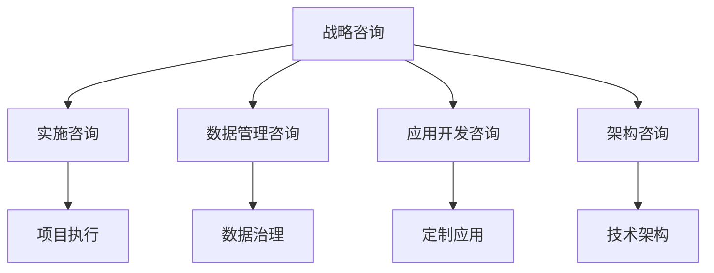

                 

# 技术咨询：从个人顾问到咨询公司

在当今快速变化的商业环境中，技术咨询公司正逐渐从传统的解决方案提供商转型为高端的专业顾问，为企业提供全面、深入的战略和技术指导。本文将深入探讨技术咨询公司的核心概念、运作原理及其实际应用，同时揭示其在未来发展的趋势与挑战。

## 1. 背景介绍

### 1.1 问题由来
随着科技的进步，企业面临的技术挑战愈加复杂多变。传统IT解决方案提供商已难以满足客户需求，而技术咨询公司以其深入的技术洞察力和丰富的行业经验，迅速崛起为咨询市场的重要力量。特别是那些具有创新能力和前瞻性的咨询公司，正成为引领企业技术发展方向的关键合作伙伴。

### 1.2 问题核心关键点
技术咨询公司的核心竞争力在于其具备以下特点：

- **深入的技术理解**：顾问通常具备深厚的技术背景，对前沿技术和行业趋势有深刻理解。
- **全面的行业知识**：顾问需掌握特定行业的商业模式、市场竞争状况及战略要点。
- **策略规划能力**：能够为企业制定长期、可行的技术战略和实施计划。
- **执行辅导**：不仅提供战略建议，还指导企业实施技术变革，解决实际问题。

### 1.3 问题研究意义
技术咨询公司的作用在于帮助企业突破技术瓶颈，实现业务数字化转型，提升竞争力。通过系统化的技术咨询，企业能够获得更加专业和高效的服务，推动创新和变革，保持市场领先地位。

## 2. 核心概念与联系

### 2.1 核心概念概述

技术咨询公司通常提供以下几类服务：

- **战略咨询**：根据企业需求制定长期技术战略和规划，包括技术架构设计、技术选型等。
- **实施咨询**：指导企业实施技术方案，确保技术部署和运维顺利进行。
- **数据管理咨询**：帮助企业设计和优化数据架构，实现数据驱动的决策支持。
- **应用开发咨询**：提供定制化应用开发，解决业务场景中特定需求。
- **架构咨询**：优化现有IT架构，提升系统性能和稳定性。

这些服务相互联系，形成一个闭环的咨询生态，如图：



其中，**战略咨询**是咨询服务的核心，旨在为企业提供高层次的技术规划；其他各类咨询在战略指导下，通过具体实施，确保战略目标的实现。

## 3. 核心算法原理 & 具体操作步骤
### 3.1 算法原理概述

技术咨询公司的咨询服务通常基于以下核心算法原理：

1. **需求分析**：通过问卷、访谈等方式，了解客户的技术需求、业务挑战和战略目标。
2. **方案设计**：根据分析结果，设计多个可行方案，并使用决策树、优化算法等工具进行综合评估。
3. **技术选型**：基于方案比较和成本效益分析，选择最适合的技术方案。
4. **项目管理**：制定详细的项目计划，使用敏捷开发、SCRUM等方法进行有效管理。
5. **性能评估**：通过模型评估、用户反馈等手段，持续监测和优化方案效果。

### 3.2 算法步骤详解

1. **项目启动阶段**：
   - **需求调研**：与客户沟通，明确业务需求、技术要求、时间节点和预算限制。
   - **资料收集**：收集现有系统架构、业务流程、数据流和用户需求等文档和资料。
   - **团队组建**：组建跨部门项目团队，明确分工和职责。

2. **方案设计阶段**：
   - **需求确认**：与客户验证需求，调整和优化方案。
   - **方案评估**：使用SWOT分析、PEST分析等工具，评估各方案的优劣势。
   - **可行性研究**：进行市场调研、风险评估，确保方案的可行性。

3. **实施阶段**：
   - **技术选型**：选择最佳技术栈，制定详细的技术规范和开发计划。
   - **项目规划**：制定里程碑和交付物，定期与客户沟通进度。
   - **技术实施**：按照计划进行开发和测试，确保系统功能正确性和性能稳定。

4. **交付和评估阶段**：
   - **系统部署**：在测试环境验证系统，确保无误后部署至生产环境。
   - **用户培训**：提供培训材料和技术支持，帮助用户熟悉系统使用。
   - **效果评估**：根据关键绩效指标（KPIs），评估系统效果，调整优化方案。

5. **维护和优化阶段**：
   - **系统运维**：提供日常技术支持和故障处理。
   - **优化改进**：根据反馈和监控数据，持续优化系统性能和用户体验。
   - **版本迭代**：按需进行功能更新和版本升级。

### 3.3 算法优缺点

技术咨询公司的优势在于其高度专业的技术能力和丰富的行业经验，能够提供全方位的技术支持和服务。其缺点主要包括：

- **成本高**：技术咨询费用通常较高，部分客户难以承受。
- **沟通障碍**：顾问可能难以完全理解客户需求，导致方案不匹配实际业务。
- **灵活性不足**：固定的项目周期可能无法适应快速变化的市场环境。

### 3.4 算法应用领域

技术咨询公司广泛应用于多个领域，包括但不限于：

- **金融科技**：帮助银行、保险等金融机构实现数字化转型，提升服务效率。
- **零售电商**：指导零售商优化供应链管理，提升客户体验。
- **制造行业**：为制造企业提供物联网、自动化解决方案，提升生产效率和质量。
- **医疗健康**：协助医疗机构实现电子病历系统、健康管理平台等建设。
- **教育培训**：为教育机构提供数字化课程和教育管理系统的设计和实施。

## 4. 数学模型和公式 & 详细讲解  
### 4.1 数学模型构建

以项目管理的敏捷模型为例，数学模型构建如下：

设项目总时间 $T$，周期 $t$，每日任务量 $S$，总工作量 $W$，团队人数 $N$。

**项目进度模型**：
$$
\text{进度} = \frac{t \times S \times N}{T}
$$

**质量模型**：
$$
\text{质量} = \frac{W}{t \times S \times N}
$$

### 4.2 公式推导过程

设每日任务完成率 $p$，周期完成率 $r$，则：
$$
r = \frac{t \times S \times N \times p}{T}
$$
$$
p = \frac{W}{t \times S \times N}
$$

将 $r$ 代入 $p$ 的公式中：
$$
p = \frac{W}{T}
$$

因此，质量与总工作量成正比，与总时间成反比。

### 4.3 案例分析与讲解

假设某项目总时间 $T=6$ 个月，每日任务量 $S=50$，团队人数 $N=5$，总工作量 $W=600$。

计算每日任务完成率 $p$ 和周期完成率 $r$：
$$
p = \frac{600}{6 \times 30 \times 5} = 0.89
$$
$$
r = \frac{6 \times 30 \times 5 \times 0.89}{6} = 89\%
$$

说明每日任务完成率高，周期完成率也较高，项目进度正常。

## 5. 项目实践：代码实例和详细解释说明
### 5.1 开发环境搭建

1. **环境准备**：
   - **安装编程语言**：安装Python、Java等常用编程语言。
   - **安装开发工具**：安装IDE（如IntelliJ IDEA、PyCharm等）、版本控制系统（如Git）、项目管理工具（如JIRA）等。
   - **安装开源库**：安装常用的开源库，如Spring Boot、Django、React等。

2. **项目管理**：
   - **版本控制**：使用Git进行版本管理，确保代码的变更可追溯。
   - **持续集成**：使用CI/CD工具（如Jenkins）进行自动化构建和测试，提高开发效率。
   - **文档管理**：使用Confluence或Git Wiki进行项目文档的管理和共享。

### 5.2 源代码详细实现

以Java Web应用开发为例，实现一个简单的用户管理模块。

**用户模块**：
- **数据库设计**：设计用户表，包括ID、用户名、密码、邮箱等字段。
- **CRUD操作**：实现用户增删改查功能。
- **安全性**：实现用户登录验证、密码加密等功能。

**技术栈**：
- **前端**：使用React构建用户界面。
- **后端**：使用Spring Boot实现用户服务。
- **数据库**：使用MySQL存储用户信息。

**代码示例**：
```java
// UserController.java
@RestController
@RequestMapping("/users")
public class UserController {
    @Autowired
    private UserService userService;
    
    @GetMapping("/{id}")
    public User getUser(@PathVariable Long id) {
        return userService.findById(id);
    }
    
    @PostMapping
    public User createUser(@RequestBody User user) {
        return userService.save(user);
    }
    
    @PutMapping("/{id}")
    public User updateUser(@PathVariable Long id, @RequestBody User user) {
        user.setId(id);
        return userService.save(user);
    }
    
    @DeleteMapping("/{id}")
    public void deleteUser(@PathVariable Long id) {
        userService.deleteById(id);
    }
}
```

### 5.3 代码解读与分析

- **设计模式**：使用Spring MVC框架，通过注解（如@RestController、@RequestMapping）简化开发过程。
- **模块划分**：将应用划分为前端、后端、数据库等模块，提高代码的可维护性和可扩展性。
- **接口设计**：定义RESTful接口，通过HTTP请求实现用户管理功能。
- **安全性**：使用Spring Security实现用户认证和授权，确保系统安全性。
- **异常处理**：封装异常处理类，提高代码健壮性。

### 5.4 运行结果展示

1. **功能展示**：
   - **前端界面**：展示用户登录、注册、修改、删除等功能。
   - **后端接口**：通过Postman或其他HTTP客户端，验证接口的正确性和可靠性。

2. **性能测试**：
   - **负载测试**：使用JMeter等工具，模拟高并发场景，评估系统性能。
   - **安全性测试**：使用OWASP Top 10测试，确保系统安全。

## 6. 实际应用场景

### 6.1 智能制造

技术咨询公司为制造企业提供物联网、自动化解决方案，通过数据分析和机器学习技术，优化生产流程，提升生产效率。

**具体应用**：
- **设备监控**：通过传感器实时监测设备状态，预测设备故障，减少停机时间。
- **质量控制**：通过机器视觉技术，检测产品质量，及时调整生产参数。
- **供应链优化**：优化物流管理，减少库存成本，提高供应链效率。

### 6.2 智慧医疗

技术咨询公司为医疗机构提供电子病历系统、健康管理平台等解决方案，通过数据驱动的决策支持，提升医疗服务质量。

**具体应用**：
- **电子病历**：实现电子病历数字化，提升诊疗效率和准确性。
- **健康管理**：通过穿戴设备采集健康数据，提供个性化健康管理方案。
- **远程医疗**：实现远程诊断、在线咨询等功能，提高医疗服务的可及性。

### 6.3 智能城市

技术咨询公司为城市管理提供智慧城市解决方案，通过数据整合和智能化应用，提升城市管理效率和居民生活质量。

**具体应用**：
- **交通管理**：通过智能交通系统，优化交通流量，减少拥堵。
- **公共安全**：利用大数据分析，预防和应对各类安全事故。
- **环境监测**：通过传感器网络，实时监测环境质量，提升城市管理水平。

## 7. 工具和资源推荐
### 7.1 学习资源推荐

1. **书籍**：
   - 《敏捷软件开发》：深入讲解敏捷开发方法论。
   - 《数据驱动的设计》：讲解数据驱动的决策支持。
   - 《Java核心技术》：经典Java编程指南，适合初学者和进阶开发者。

2. **课程**：
   - Coursera《数据科学导论》：涵盖数据科学基础，包括统计学、机器学习等。
   - Udemy《Spring Boot实战》：实战型Spring Boot教程，涵盖Spring Boot开发全栈。
   - edX《人工智能基础》：涵盖人工智能基础理论，适合技术咨询公司顾问。

3. **社区**：
   - Stack Overflow：技术问题问答社区，快速解决开发中的疑难杂症。
   - GitHub：开源代码托管平台，获取高质量开源代码。
   - Stack Exchange：技术问答社区，涵盖各种技术话题。

### 7.2 开发工具推荐

1. **编程语言**：
   - Java：企业级应用广泛使用的语言，适合开发复杂系统。
   - Python：数据科学、机器学习领域的常用语言，适合快速原型开发。
   - JavaScript：前端开发和移动应用开发的常用语言，适合实现用户界面。

2. **开发环境**：
   - IntelliJ IDEA：Java开发IDE，提供智能代码补全和代码分析功能。
   - PyCharm：Python开发IDE，提供调试、版本控制等功能。
   - Visual Studio Code：通用开发IDE，支持多种编程语言。

3. **版本控制**：
   - Git：最流行的版本控制系统，支持分布式协作开发。
   - GitLab：开源代码托管平台，提供CI/CD、项目管理等功能。
   - GitHub：流行的代码托管平台，支持团队协作和开源项目。

### 7.3 相关论文推荐

1. 《敏捷方法论：基本原则和实践》：讲解敏捷开发的基本原则和实践方法。
2. 《数据驱动的决策支持系统》：介绍数据驱动的决策模型和实现技术。
3. 《云计算在制造中的应用》：探讨云计算技术在制造行业的应用场景和效果。
4. 《智慧城市：技术架构与实现》：介绍智慧城市的技术架构和关键技术。
5. 《人工智能在医疗中的应用》：讨论AI技术在医疗领域的实际应用案例。

## 8. 总结：未来发展趋势与挑战

### 8.1 总结

技术咨询公司通过深入的技术咨询和战略指导，帮助企业实现数字化转型，提升竞争力。其核心竞争力在于高度专业的技术能力、全面的行业知识和高效的策略规划。通过战略咨询、实施咨询、数据管理咨询、应用开发咨询和架构咨询等全方位服务，技术咨询公司能够解决企业的复杂技术问题，实现业务突破。

### 8.2 未来发展趋势

未来技术咨询公司将呈现以下几个发展趋势：

1. **云计算和大数据**：随着云计算和大数据技术的成熟，咨询公司将更加关注云计算架构、大数据分析和机器学习等领域的咨询服务。
2. **人工智能**：AI技术在医疗、金融、制造等行业的应用将得到深入挖掘，咨询公司将助力企业应用AI技术，提升服务水平。
3. **数字化转型**：帮助企业实现数字化转型，构建数字化生态系统，成为企业的长期合作伙伴。
4. **全球化服务**：随着国际市场的开拓，技术咨询公司将提供全球化的咨询服务，助力企业“走出去”。
5. **新兴技术**：如区块链、物联网、5G等新兴技术将成为咨询公司的关注重点，提供前沿技术咨询服务。

### 8.3 面临的挑战

尽管技术咨询公司具有广阔的发展前景，但在发展过程中仍面临以下挑战：

1. **人才短缺**：技术咨询行业需要高度专业化的人才，但相关人才的培养周期较长，且市场上高度稀缺。
2. **市场竞争激烈**：行业竞争日趋激烈，如何突出自己的核心竞争力，获得更多的客户资源。
3. **成本控制**：项目成本和人员成本较高，如何提高运营效率，降低成本。
4. **客户需求多样**：不同客户的需求各异，如何灵活应对多样化的技术咨询需求。
5. **技术迭代快**：技术日新月异，咨询公司需要不断学习和更新技术知识，保持技术领先。

### 8.4 研究展望

未来技术咨询公司应在以下方面进行突破：

1. **人才培养**：加强技术人才的培养和引进，建立强大的技术咨询团队。
2. **客户洞察**：深入研究客户需求，提供量身定制的咨询服务。
3. **技术创新**：持续关注技术前沿，引入最新技术，提供前沿咨询服务。
4. **国际化**：拓展国际市场，提升全球化服务能力。
5. **数字化转型**：帮助客户实现数字化转型，构建数字化生态系统。

## 9. 附录：常见问题与解答

**Q1：技术咨询公司与传统IT解决方案提供商有何不同？**

A: 技术咨询公司不仅提供技术解决方案，还提供战略规划、实施辅导和持续优化等全方位服务。其服务深度和广度远超传统IT提供商。

**Q2：如何提高技术咨询公司的市场竞争力？**

A: 通过不断提升技术能力、深化行业理解和优化客户服务，提高公司的市场竞争力。同时，加强品牌建设和市场推广，提升公司知名度和美誉度。

**Q3：技术咨询公司如何规避客户需求变化的风险？**

A: 建立紧密的客户关系，及时了解客户需求变化，灵活调整服务方案，确保服务与客户需求保持一致。

**Q4：如何提高技术咨询公司的运营效率？**

A: 采用项目管理工具和技术，优化项目流程，提高效率。引入敏捷开发方法，提高项目响应速度和质量。

**Q5：技术咨询公司如何应对人才短缺的问题？**

A: 建立完善的培训体系，吸引和培养高素质人才。与高校和研究机构合作，建立技术专家库，提升团队技术能力。

---

作者：禅与计算机程序设计艺术 / Zen and the Art of Computer Programming

